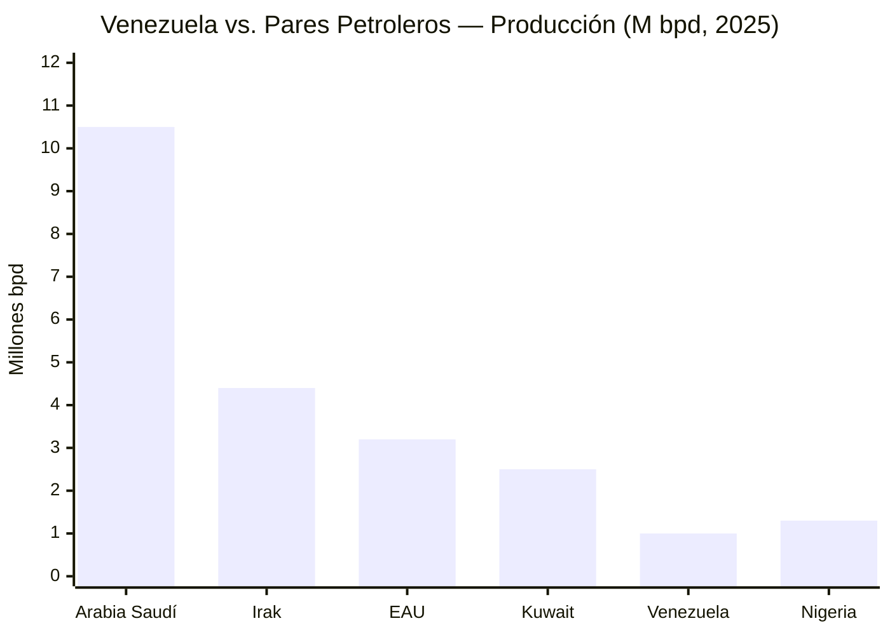
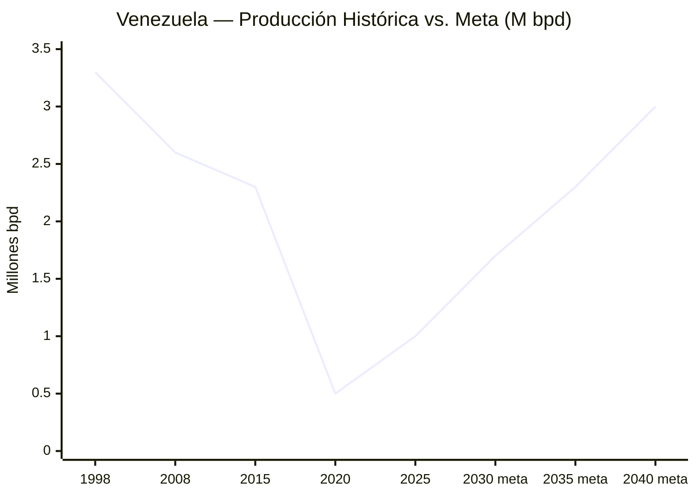
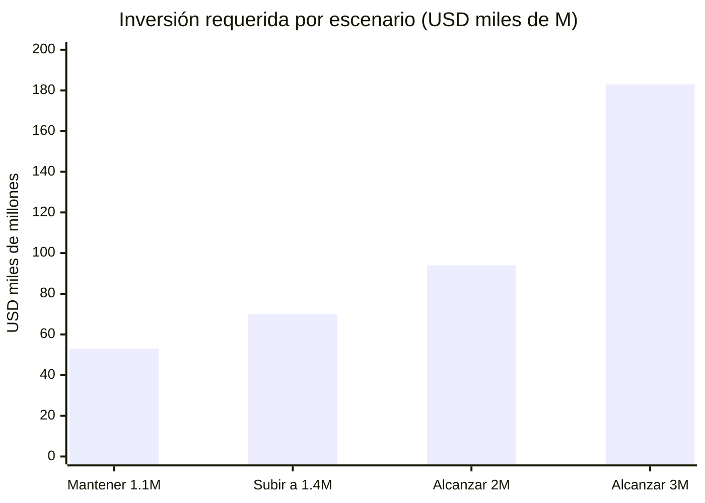

# Diagnóstico: Dónde Estamos (Datos Duros)

| Indicador | Dato Actual | Fuente |
|-----------|-------------|--------|
| Reservas probadas (oficial) | 303.000 M barriles | [OPEP ASB 2025](https://www.opec.org/assets/assetdb/asb-2025.pdf) |
| Reservas (estimación conservadora) | 100–110.000 M barriles | [Monaldi, Rice University](https://finance.yahoo.com/news/venezuela-says-it-has-the-worlds-largest-reserves-of-crude-oil-making-it-viable-is-a-whole-other-problem-181512098.html) |
| Producción actual | 0,9–1,1 M bpd | [OPEP/IEA 2025](https://www.opec.org) |
| PIB nominal 2025 | USD 82.800 M | [FMI](https://www.imf.org) |
| Deuda externa total | USD 150–170.000 M | [Reuters/CNBC, dic. 2025](https://www.cnbc.com/2026/01/04/venezuelas-billions-in-distressed-debt-who-is-in-line-to-collect.html) |
| Diáspora | 7,9 M personas | [UNHCR, dic. 2025](https://www.unhcr.org/us/emergencies/venezuela-situation) |
| Capacidad Guri | 10.200 MW | [Power Technology](https://www.power-technology.com/projects/gurihydroelectric/) |
| Cascada Caroní (potencial) | 18.000 MW | [Mongabay, 2023](https://news.mongabay.com/2023/08/hydropower-in-the-pan-amazon-the-guri-complex-and-the-caroni-cascade/) |

## Inversión Requerida ([Rystad Energy, Enero 2026](https://www.rigzone.com/news/could_venezuela_production_get_back_to_3mm_barrels_per_day-08-jan-2026-182716-article/))

| Escenario | Inversión | Plazo |
|-----------|-----------|-------|
| Mantener 1,1 M bpd | USD 53.000 M | 15 años |
| Subir a 1,4 M bpd | USD 8–9.000 M/año adicional | 2–3 años |
| Alcanzar 2 M bpd | USD 41.000 M adicionales | Inicios 2030s |
| **Alcanzar 3 M bpd** | **USD 183.000 M total** | **Para 2040** |
| Capital extranjero inmediato | USD 30–35.000 M | Primeros 2–3 años |

:::warning 60% de la inversión post-2M bpd requiere precios > USD 80 (Rystad)
A USD 60 (nuestra base), el techo realista a 15 años es 2–2,5 M bpd.
:::
