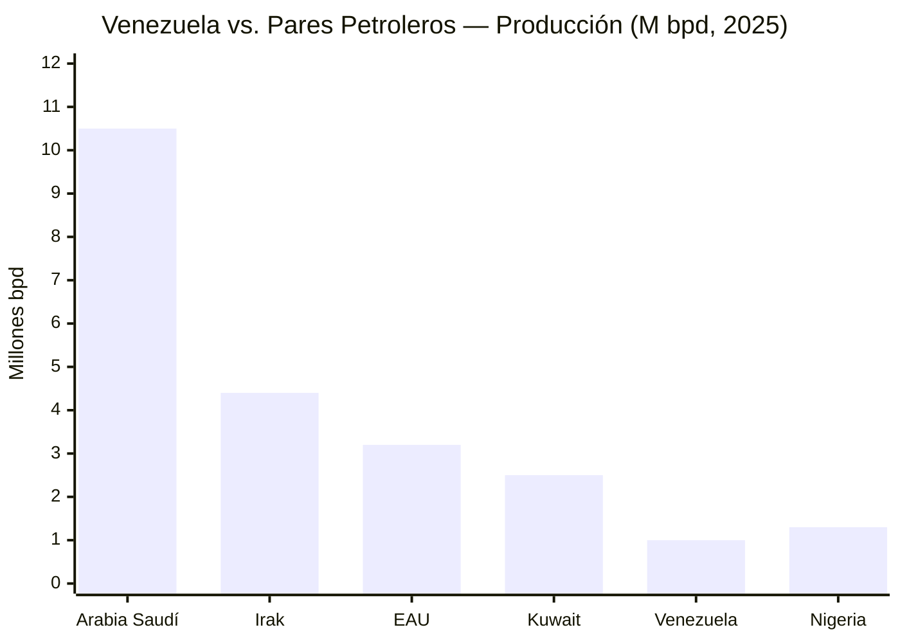
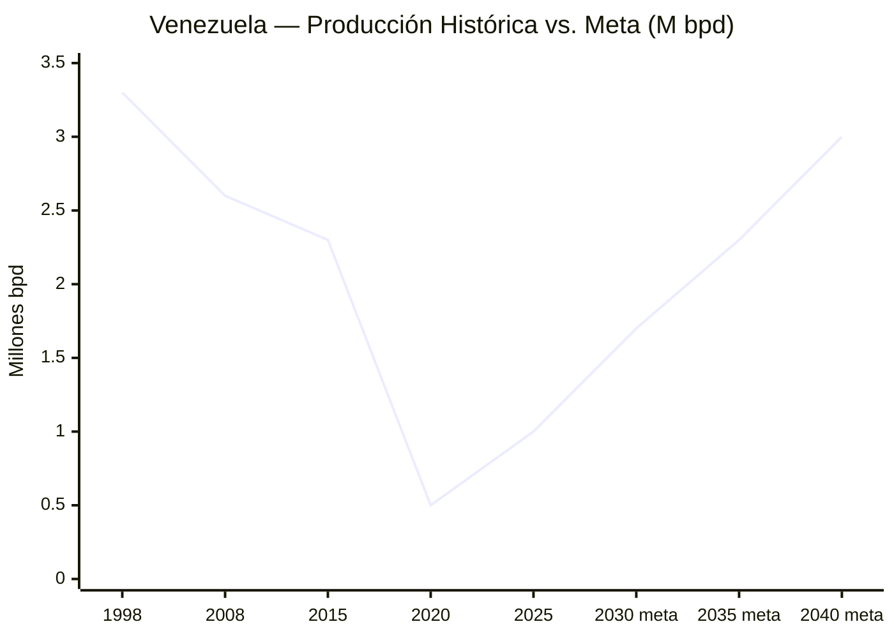
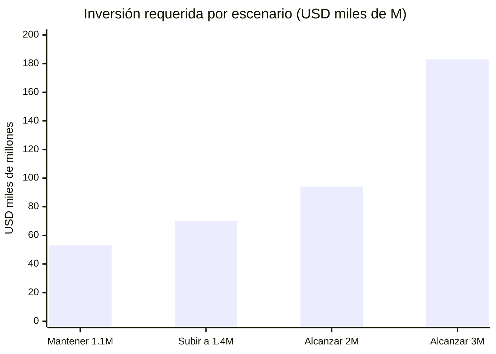
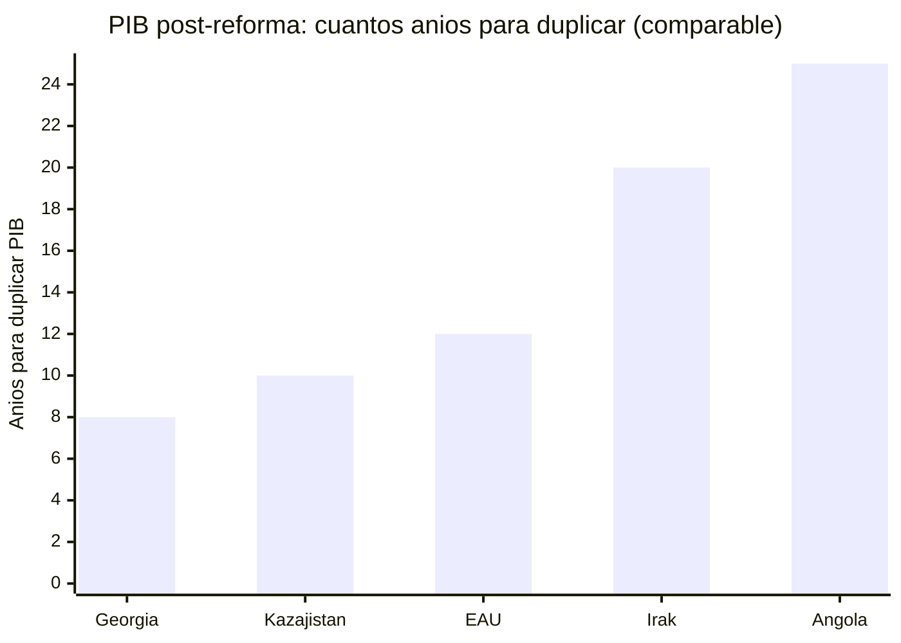

# Diagnóstico: Dónde Estamos (Datos Duros)

:::tip En pocas palabras
¿Dónde estamos hoy? Venezuela tiene la mayor reserva de petróleo del mundo pero 82,8% de pobreza. Esta sección muestra los números reales — sin maquillaje — para entender de dónde partimos.
:::

## Venezuela en 1 Página: La Oportunidad

> "No empieces con 10 páginas de lo que salió mal. Empieza con la oportunidad." — La crítica Musk a todo pitch que abre con el problema.

Venezuela no es un país pobre. Es un país rico operando al **3-30%** de su capacidad. La diferencia entre dónde está y dónde puede estar es el gap más grande del hemisferio occidental.

| Activo | Utilización actual | Potencial | Gap | Fuente |
|--------|-------------------|-----------|-----|--------|
| **Reservas petroleras** (303B bbl) | **1M bpd** (~33% de capacidad histórica) | **3M bpd** (nivel 1998) | 2M bpd | [OPEP ASB 2025](https://www.opec.org/assets/assetdb/asb-2025.pdf) / [Rystad](https://www.rigzone.com/news/could_venezuela_production_get_back_to_3mm_barrels_per_day-08-jan-2026-182716-article/) |
| **Hidroeléctrica** (18 GW Caroní) | **~40% operativa** (~7 GW efectivos) | **100%** (18 GW) | ~10 GW | [Mongabay, 2023](https://news.mongabay.com/2023/08/hydropower-in-the-pan-amazon-the-guri-complex-and-the-caroni-cascade/) |
| **Gas natural** (~200 TCF reservas) | **Cerca de cero** (se quema o reinyecta) | **5 BCF/d** (export LNG + consumo) | Masivo | [EIA Venezuela Analysis](https://www.eia.gov/international/overview/country/VEN) |
| **Tierra cultivable** (~30M ha) | **~20% cultivada** (~6M ha) | **80%** (~24M ha) | ~18M ha | [FAO](https://www.fao.org/) [Requiere investigación] |
| **Fuerza laboral** (40M personas) | **80%+ informal/subempleada** | **80% formal** | ~25M personas | [ENCOVI 2024](https://www.proyectoencovi.com/) |
| **Ecosistema emprendedor** | TEA **7,7%** (mínimo histórico); **1,4M** emprendedores activos; NECI **3,23/10** (penúltimo global) | TEA >15%; mayoría motivada por oportunidad | +12 pp TEA; NECI >5 | [GEM Venezuela 2025, UCAB/IESA](https://www.gemconsortium.org/economy-profiles/venezuela) |
| **Ubicación geográfica** (15ms a Miami) | **0 data centers hyperscale** | **50+ hyperscale** | Todo | [Submarine Cable Map](https://www.submarinecablemap.com/) |

**Venezuela tiene SUFICIENTE energía para ser top 3 global en compute, top 5 en petróleo, y top 10 en agricultura. Está operando al 3-30% de su capacidad. Este plan es el camino del 3% al 100%.**

:::tip Ir directo a la solución
El diagnóstico completo está abajo. Si prefieres ir directo a la solución → [Motor Financiero](/02-motor-financiero/inversion-inicial-fuentes)
:::

---

| Indicador | Dato Actual | Fuente |
|-----------|-------------|--------|
| Reservas probadas (oficial) | 303.000 M barriles | [OPEP ASB 2025](https://www.opec.org/assets/assetdb/asb-2025.pdf) |
| Reservas (estimación conservadora) | 100–110.000 M barriles | [Monaldi, Rice University](https://finance.yahoo.com/news/venezuela-says-it-has-the-worlds-largest-reserves-of-crude-oil-making-it-viable-is-a-whole-other-problem-181512098.html) |
| Producción actual | 0,9–1,1 M bpd | [OPEP/IEA 2025](https://www.opec.org) |
| PIB nominal 2025 | USD 82.800 M | [FMI](https://www.imf.org) |
| Deuda externa total | USD 150–170.000 M | [Reuters/CNBC, dic. 2025](https://www.cnbc.com/2026/01/04/venezuelas-billions-in-distressed-debt-who-is-in-line-to-collect.html) |
| Diáspora | 7,9 M personas | [UNHCR, dic. 2025](https://www.unhcr.org/us/emergencies/venezuela-situation) |
| Capacidad Guri | 10.200 MW | [Power Technology](https://www.power-technology.com/projects/gurihydroelectric/) |
| Cascada Caroní (potencial) | 18.000 MW | [Mongabay, 2023](https://news.mongabay.com/2023/08/hydropower-in-the-pan-amazon-the-guri-complex-and-the-caroni-cascade/) |

## Inversión Requerida ([Rystad Energy, Enero 2026](https://www.rigzone.com/news/could_venezuela_production_get_back_to_3mm_barrels_per_day-08-jan-2026-182716-article/))

| Escenario | Inversión | Plazo |
|-----------|-----------|-------|
| Mantener 1,1 M bpd | USD 53.000 M | 15 años |
| Subir a 1,4 M bpd | USD 8–9.000 M/año adicional | 2–3 años |
| Alcanzar 2 M bpd | USD 41.000 M adicionales | Inicios 2030s |
| **Alcanzar 3 M bpd** | **USD 183.000 M total** | **Para 2040** |
| Capital extranjero inmediato | USD 30–35.000 M | Primeros 2–3 años |

:::warning 60% de la inversión post-2M bpd requiere precios > USD 80 (Rystad)
A USD 60 (nuestra base), el techo realista a 15 años es 2–2,5 M bpd.
:::

---

## Comparables Reales: No Somos Noruega

:::caution El error de los comparables aspiracionales
Todo plan de reconstrucción petrolera dice "seremos Noruega" o "seremos Singapur." Los comparables reales son menos glamorosos y más instructivos. — [VisualEconomik](https://www.youtube.com/@VisualEconomik)
:::

Venezuela no parte de instituciones sólidas (Noruega), ni de un líder visionario con control total (Singapur), ni de una sociedad homogénea y educada (Corea del Sur). Los comparables reales son países que partieron de **conflicto, corrupción, y dependencia de recursos** — exactamente donde estamos.

| País | Punto de partida | Inversión/Ingreso | Resultado | Lección para Venezuela |
|------|-----------------|-------------------|-----------|----------------------|
| **Irak post-2003** | Guerra, destrucción institucional, conflicto sectario | USD 200B+ invertidos (EE.UU. + multilaterales + petróleo) | Producción petrolera recuperó a **4,5M bpd** pero país inestable. Corrupción rampante, instituciones débiles | **La seguridad DEBE venir primero.** Sin ella, USD 200B se pierden. Irak recuperó petróleo pero no reconstruyó país |
| **Angola post-guerra civil (2002)** | 27 años de guerra civil. Infraestructura destruida | USD 68B en ingresos petroleros (2002-2012) | **~30% perdido en corrupción** ([Brookings](https://www.brookings.edu/)). Infraestructura sigue pobre. Pobreza >40% | **La gobernanza es todo.** Sin oversight, los ingresos petroleros se evaporan. Venezuela ya vivió esto con FONDEN |
| **Kazajistán post-soviético (1991)** | Colapso soviético, economía destruida, cero instituciones de mercado | National Fund (Samruk-Kazyna) + oil ramp agresivo + inversión extranjera | PIB: USD 10B (1993) → **USD 100B+ (2013)** — 10x en 20 años. Pero régimen autoritario, desigualdad alta | **Crecimiento y democracia pueden chocar.** Kazajistán creció rápido sacrificando libertad. Venezuela debe encontrar el balance |
| **EAU (1971)** | Desierto, 250K habitantes, cero industria, solo petróleo | Petróleo → diversificación: Dubai como hub financiero, logístico, turístico | Petróleo < 30% PIB. Dubai atrae 16M+ turistas/año. GDP per cápita USD 50K+ | **El largo plazo funciona SI empiezas temprano.** 50 años de ejecución consistente. La paciencia paga |
| **Georgia (2004)** | Estado fallido: corrupción total, policía criminal, economía informal >50% | Reforma policial radical + anticorrupción + digitalización | FDI: 10x en 10 años. Policía: 3ra institución más confiable. Doing Business: top 10 mundial | **La reforma institucional más rápida de la historia.** Si Georgia lo hizo en 4 años, Venezuela puede |

**Venezuela tiene elementos de TODOS estos casos:**
- La destrucción institucional de Irak
- La corrupción petrolera de Angola
- El potencial de diversificación de EAU
- La necesidad de reforma policial de Georgia
- La oportunidad de crecimiento rápido de Kazajistán

**La pregunta no es si Venezuela puede reconstruirse — todos estos países lo hicieron en algún grado. La pregunta es cuál modelo replicamos: el de Angola (petróleo sin gobernanza = pobreza perpetua) o el de EAU (petróleo + visión + ejecución = transformación).**

**Fuentes:** [World Bank Data](https://data.worldbank.org/) | [IMF WEO](https://www.imf.org/) | [Brookings Institution](https://www.brookings.edu/) | [Princeton Innovations for Successful Societies](https://successfulsocieties.princeton.edu/) [Requiere investigación para cifras específicas de Kazajistán y Angola]
