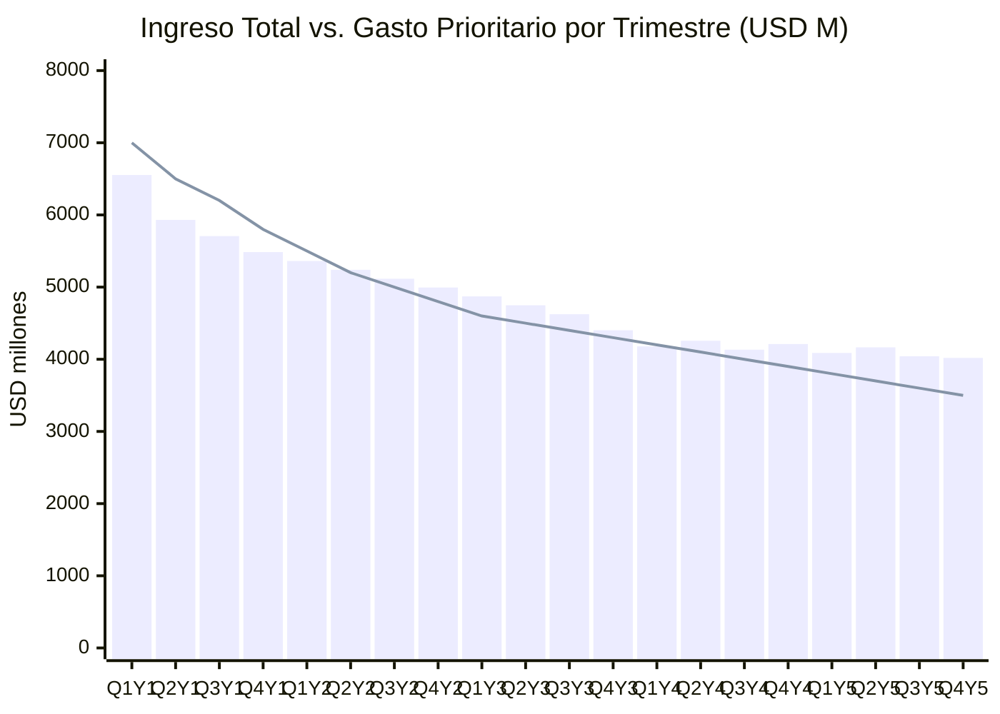
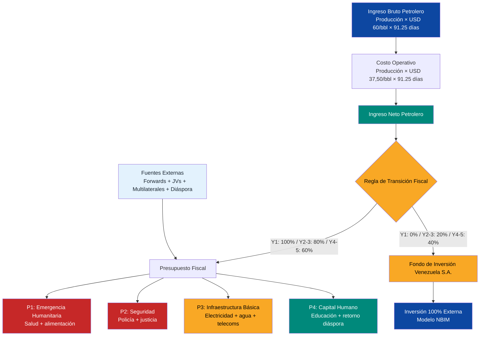

# Cashflow Trimestral: Los Primeros 5 Años

:::caution Fechas ilustrativas — las fases se activan por KPIs, no por calendario
Las referencias a "Año X" en este documento son **ilustrativas**. Las fases reales se activan por condiciones verificables (PIB/cápita, formalización, pobreza). Ver [KPIs de Activación](/07-ejecucion/kpis-activacion).
:::

> Los inversores no financian planes a 15 años. Financian los primeros 20 trimestres. Aquí está cada dólar, cada trimestre.

## Por Qué Importan los Primeros 5 Años

Los primeros 20 trimestres son el **bridge period** — el intervalo entre el arranque del plan y el momento en que los ingresos petroleros generan flujo de caja auto-sostenible. Durante este período:

- La producción sube de **~1.000K bpd a ~1.750K bpd** (timeline [Rystad Energy](https://www.rigzone.com/news/could_venezuela_production_get_back_to_3mm_barrels_per_day-08-jan-2026-182716-article/))
- Los costos de emergencia (salud, seguridad, infraestructura básica) son **máximos**
- Los ingresos petroleros netos son **insuficientes** para cubrir el gasto prioritario
- Las fuentes externas (forwards, JVs, multilaterales) **cubren el gap**

:::danger El riesgo #1
Si el bridge financing no se estructura correctamente, el plan muere en el trimestre 4. No en el año 10. Los primeros 8 trimestres son deficitarios por diseño — cada dólar de gap debe tener un origen identificado.
:::

---

## Supuestos del Modelo

| Parámetro | Valor | Fuente |
|-----------|-------|--------|
| Precio base | **USD 60/barril** | [EIA STEO, mar. 2026](https://www.eia.gov/outlooks/steo/) |
| Costo operativo | **USD 37,50/barril** | Extracción crudo pesado + diluyente + transporte + procesamiento |
| Margen neto por barril | **USD 22,50** | $60 - $37,50 |
| Producción inicial | **1.000K bpd** | [OPEP/IEA 2025](https://www.iea.org/) |
| Producción meta año 5 | **1.750K bpd** | Rystad Energy, interpolación lineal |
| Incremento trimestral | **~37,5K bpd** | (1.750 - 1.000) / 20 trimestres |
| % al Fondo de Inversión Venezuela S.A. | **0% → 40%** | [Transición fiscal](/02-motor-financiero/transicion-fiscal) |
| Días por trimestre | **91,25** | 365 / 4 |

:::info Sobre el ramp-up de producción
El incremento no es lineal en la realidad — los primeros trimestres son más lentos (reactivación de pozos, reparación de infraestructura) y se aceleran a partir del año 2 cuando entran los JVs con majors. El modelo usa incremento constante de **~37,5K bpd/trimestre** como aproximación conservadora. [Requiere investigación] granularidad exacta del ramp-up por campo.
:::

---

## Modelo Trimestral de Cashflow

| Trim. | Producción (K bpd) | Ingreso Bruto (USD M) | Costo Op. (USD M) | Ingreso Neto Petróleo (USD M) | Fuentes Externas (USD M) | Ingreso Total (USD M) | Gasto Prioritario (USD M) | Balance (USD M) | Fondo Acum. (USD M) |
|-------|--------------------:|----------------------:|-------------------:|------------------------------:|-------------------------:|----------------------:|--------------------------:|----------------:|--------------------:|
| Q1 Y1 | 1.000 | 5.475 | 3.422 | 2.053 | 4.500 | 6.553 | 7.000 | -447 | 0 |
| Q2 Y1 | 1.038 | 5.683 | 3.552 | 2.131 | 3.800 | 5.931 | 6.500 | -569 | 0 |
| Q3 Y1 | 1.075 | 5.886 | 3.679 | 2.207 | 3.500 | 5.707 | 6.200 | -493 | 0 |
| Q4 Y1 | 1.113 | 6.094 | 3.809 | 2.285 | 3.200 | 5.485 | 5.800 | -315 | 0 |
| **Q1 Y2** | **1.150** | **6.298** | **3.936** | **2.362** | **3.000** | **5.362** | **5.500** | **-138** | **354** |
| Q2 Y2 | 1.188 | 6.506 | 4.066 | 2.440 | 2.800 | 5.240 | 5.200 | 40 | 732 |
| Q3 Y2 | 1.225 | 6.709 | 4.193 | 2.516 | 2.600 | 5.116 | 5.000 | 116 | 1.135 |
| Q4 Y2 | 1.263 | 6.917 | 4.323 | 2.594 | 2.400 | 4.994 | 4.800 | 194 | 1.563 |
| **Q1 Y3** | **1.300** | **7.121** | **4.450** | **2.671** | **2.200** | **4.871** | **4.600** | **271** | **2.097** |
| Q2 Y3 | 1.338 | 7.329 | 4.581 | 2.748 | 2.000 | 4.748 | 4.500 | 248 | 2.647 |
| Q3 Y3 | 1.375 | 7.532 | 4.708 | 2.824 | 1.800 | 4.624 | 4.400 | 224 | 3.213 |
| Q4 Y3 | 1.413 | 7.740 | 4.838 | 2.902 | 1.500 | 4.402 | 4.300 | 102 | 3.793 |
| **Q1 Y4** | **1.450** | **7.943** | **4.965** | **2.978** | **1.200** | **4.178** | **4.200** | **-22** | **4.518** |
| Q2 Y4 | 1.488 | 8.151 | 5.095 | 3.056 | 1.200 | 4.256 | 4.100 | 156 | 5.283 |
| Q3 Y4 | 1.525 | 8.355 | 5.222 | 3.133 | 1.000 | 4.133 | 4.000 | 133 | 6.071 |
| Q4 Y4 | 1.563 | 8.563 | 5.352 | 3.211 | 1.000 | 4.211 | 3.900 | 311 | 6.893 |
| **Q1 Y5** | **1.600** | **8.766** | **5.479** | **3.287** | **800** | **4.087** | **3.800** | **287** | **7.869** |
| Q2 Y5 | 1.638 | 8.974 | 5.609 | 3.365 | 800 | 4.165 | 3.700 | 465 | 8.885 |
| Q3 Y5 | 1.675 | 9.177 | 5.736 | 3.441 | 600 | 4.041 | 3.600 | 441 | 9.938 |
| Q4 Y5 | 1.713 | 9.385 | 5.866 | 3.519 | 500 | 4.019 | 3.500 | 519 | 11.035 |

:::tip Cálculo de referencia — Q4 Y5
**1.713K bpd × 91,25 días × USD 60 = USD 9.375 M** (bruto) | **× USD 37,50 = USD 5.860 M** (costo) | **Neto: USD 3.515 M** | Al fondo (40%): USD 1.406 M | Los números de la tabla incluyen rendimientos del fondo al 5,5% anual.
:::

### Notas metodológicas

- **Año 1:** 100% del ingreso neto petrolero va al presupuesto (emergencia). Fondo de Inversión Venezuela S.A. recibe **USD 0**.
- **Año 2-3:** 80% al presupuesto, **20% al fondo** — consistente con [transición fiscal](/02-motor-financiero/transicion-fiscal).
- **Año 4-5:** 60% al presupuesto, **40% al fondo**.
- **Fuentes externas** incluyen: forwards (adelantos), desembolsos multilaterales, aportes JV de majors petroleras, Pre-Seed ciudadano.
- **Gasto prioritario** cubre: emergencia humanitaria, seguridad, infraestructura básica, electricidad, educación. Desciende a medida que la emergencia se estabiliza.
- **Fondo acumulado** incluye aportes + rendimiento compuesto al **5,5% anual** ([retorno NBIM promedio 1998-2025](https://www.nbim.no/en/investments/returns/)).

---

## Análisis de Gap: Dónde Están los Déficits

Los primeros **6 trimestres** (Q1 Y1 — Q2 Y2) son el período crítico. El gasto prioritario supera los ingresos petroleros netos, y las fuentes externas deben cubrir la diferencia.

| Período | Déficit Petrolero Acum. (USD M) | Fuentes Externas Acum. (USD M) | Balance Neto (USD M) |
|---------|--------------------------------:|-------------------------------:|---------------------:|
| Q1-Q4 Y1 | -17.824 | 15.000 | -1.824 |
| Q1-Q4 Y2 | -10.588 | 10.800 | +212 |
| Q1-Q4 Y3 | -6.655 | 7.500 | +845 |
| Q1-Q4 Y4 | -3.811 | 4.400 | +578 |
| Q1-Q5 Y5 | -1.223 | 2.700 | +1.712 |

:::caution Los primeros 4 trimestres
El año 1 tiene un **déficit petrolero acumulado de ~USD 17.800 M** — la producción genera USD 8.676 M netos pero el gasto prioritario requiere USD 25.500 M. Las fuentes externas aportan USD 15.000 M, dejando un gap de **~USD 1.800 M** que se cubre con reservas iniciales y deuda bridge de corto plazo.
:::

---

## Bridge Financing: Cómo Se Cubre Cada Gap

| Fuente | Año 1 (USD M) | Año 2 (USD M) | Año 3 (USD M) | Año 4 (USD M) | Año 5 (USD M) | Total 5 Años (USD M) |
|--------|---------------:|---------------:|---------------:|---------------:|---------------:|---------------------:|
| Forward advances (Chevron, Shell, TotalEnergies) | 8.000 | 4.500 | 2.500 | 1.500 | 800 | **17.300** |
| Multilaterales (FMI EFF, BM, BID) | 3.000 | 3.000 | 2.500 | 1.500 | 1.000 | **11.000** |
| JV equity (majors petroleras) | 2.500 | 2.000 | 1.500 | 1.000 | 500 | **7.500** |
| Pre-Seed diáspora + bonos ciudadanos | 1.000 | 800 | 500 | 200 | 200 | **2.700** |
| Reservas/deuda bridge | 500 | 500 | 500 | 200 | 200 | **1.900** |
| **Total** | **15.000** | **10.800** | **7.500** | **4.400** | **2.700** | **40.400** |

:::info Forward advances como columna vertebral
Los [contratos forward](/02-motor-financiero/contratos-forward) generan **USD 17.300 M en 5 años** — el 43% del bridge financing. Estos son adelantos contra producción futura a USD 55-60/barril, con escrow y auditoría Big 4. Chevron ya opera en Venezuela con [licencia OFAC](https://www.reuters.com/business/energy/), lo que reduce el riesgo de ejecución.
:::

---

## Ingreso vs. Gasto: 20 Trimestres

**Lectura del gráfico:** Las barras (ingreso total = petrolero + externo) cruzan por encima de la línea (gasto prioritario) a partir de **Q2 Y2** — el punto de inflexión. A partir de ahí, cada trimestre genera excedente creciente.

---

## Cascada de Efectivo: Distribución por Prioridad

---

## Escenarios de Riesgo

### Escenario A: Producción se retrasa (ramp-up 50% más lento)

| Impacto | Valor |
|---------|-------|
| Producción año 5 | **1.375K bpd** (vs. 1.750K base) |
| Ingreso neto acumulado 5 años | **USD 38.000 M** (vs. USD 51.700 M) |
| Gap adicional | **USD 13.700 M** |
| Solución | Ampliar forwards + acelerar desembolsos multilaterales |

### Escenario B: Precio cae a USD 50/barril

| Impacto | Valor |
|---------|-------|
| Margen neto por barril | **USD 12,50** (vs. USD 22,50) |
| Ingreso neto acumulado 5 años | **USD 28.800 M** (vs. USD 51.700 M) |
| Gap adicional | **USD 22.900 M** |
| Solución | Activar cláusula de emergencia: Fondo de Inversión Venezuela S.A. congelado, 100% al presupuesto, renegociar forward pricing |

### Escenario C: Combinado (ramp-up lento + precio bajo)

| Impacto | Valor |
|---------|-------|
| Ingreso neto acumulado 5 años | **USD 19.800 M** (vs. USD 51.700 M) |
| Gap total | **USD 31.900 M** |
| Solución | Bridge financing adicional + reducción de gasto prioritario a mínimos de emergencia + renegociación de deuda |

:::danger Escenario C es existencial
Si la producción se retrasa Y el precio cae simultáneamente, el plan necesita **USD 32.000 M adicionales** en bridge financing. Esto requiere compromisos firmes pre-negociados con FMI y majors antes del día 1. No hay margen para improvisar.
:::

---

## KPIs Trimestrales

| KPI | Meta Q4 Y1 | Meta Q4 Y2 | Meta Q4 Y3 | Meta Q4 Y5 | Fuente de Verificación |
|-----|------------|------------|------------|------------|----------------------|
| Producción (bpd) | 1.113K | 1.263K | 1.413K | 1.713K | OPEP Monthly Oil Market Report |
| Ingreso neto trimestral (USD M) | 2.285 | 2.594 | 2.902 | 3.519 | Auditoría Big 4 trimestral |
| Fondo de Inversión Venezuela S.A. acumulado (USD M) | 0 | 1.563 | 3.793 | 11.035 | Dashboard público [NBIM-style](https://www.nbim.no/) |
| Balance trimestral (USD M) | >-500 | >0 | >100 | >400 | Tesorería + auditor externo |
| Forward advances desembolsados (USD M acum.) | 8.000 | 12.500 | 15.000 | 17.300 | Cuentas escrow + Big 4 |
| Gasto prioritario ejecutado (%) | >85% | >90% | >92% | >95% | Contraloría + dashboard ciudadano |
| Ratio deuda bridge / ingreso neto | <2,0x | <1,5x | <1,0x | <0,5x | FMI Article IV |

:::tip El número que importa
**Q2 Y2 es el trimestre de inflexión.** Si el balance trimestral cruza a positivo en Q2 Y2 o antes, el plan está en track. Si se retrasa más allá de Q4 Y2, hay que activar fuentes contingentes.
:::

**Fuentes:** [Rystad Energy, ene. 2026](https://www.rigzone.com/news/could_venezuela_production_get_back_to_3mm_barrels_per_day-08-jan-2026-182716-article/) | [EIA STEO](https://www.eia.gov/outlooks/steo/) | [OPEP ASB 2025](https://www.opec.org/) | [FMI](https://www.imf.org) | [NBIM](https://www.nbim.no/)
