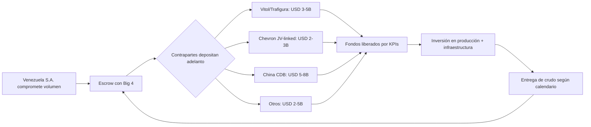
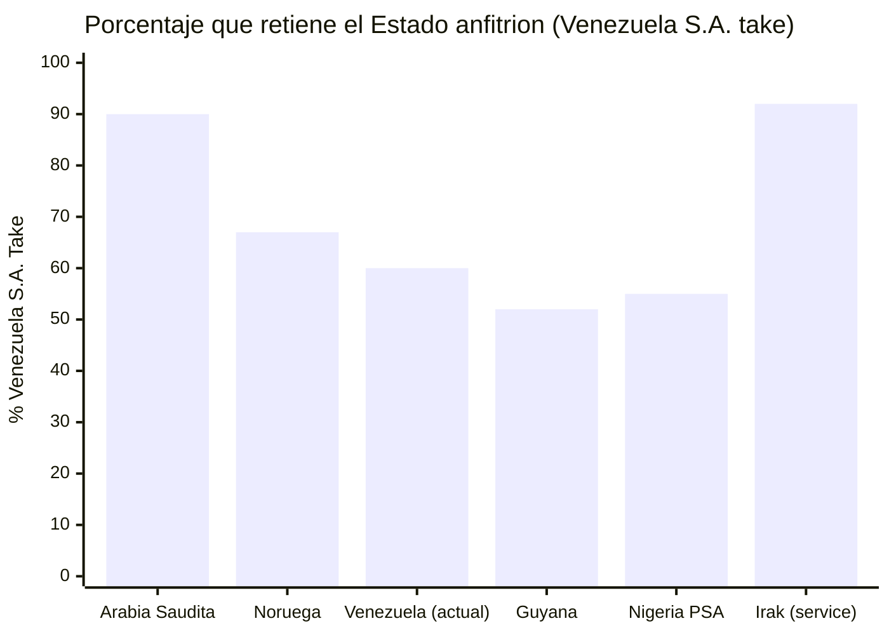

# Contratos Forward de Petróleo a Precio Garantizado

:::tip ¿Qué es un contrato forward? — En palabras simples
Imagina que tienes una finca con 1.000 árboles de mango. Los mangos maduran en 6 meses. Un comprador te dice: "Te pago hoy USD 500 por los mangos que vas a cosechar en 6 meses, a precio fijo de USD 1 cada uno." Tú recibes dinero HOY para invertir en la finca (riego, trabajadores), y el comprador se asegura mangos a buen precio.

Eso es un [contrato forward](/glosario#contrato-forward): **vender por adelantado algo que vas a producir en el futuro, a un precio acordado hoy.** Venezuela tiene 303.000 millones de barriles de petróleo bajo tierra. Un contrato forward dice: "Te vendo X barriles que voy a producir en los próximos años, a USD 60 cada uno. Págame un adelanto hoy." Ese adelanto financia la reconstrucción. El comprador se asegura petróleo. Venezuela se asegura capital. Ambos ganan.

**El riesgo:** si el precio sube a USD 100, vendiste barato. Pero USD 60 es el precio base del plan — todo lo que esté por encima va al [Fondo de Inversión Venezuela S.A.](/glosario#fondo-de-inversión-venezuela-sa) como ganancia extra.
:::

:::caution Fechas ilustrativas — las fases se activan por KPIs, no por calendario
Las referencias a "Año X" en este documento son **ilustrativas**. Las fases reales se activan por condiciones verificables (PIB/cápita, formalización, pobreza). Ver [KPIs de Activación](/07-ejecucion/kpis-activacion).
:::

## Precedente: China prestó USD 60.000+ M respaldados con petróleo

[AidData registra USD 105.590 millones](https://www.aiddata.org/blog/how-chinas-oil-backed-lending-in-venezuela-fell-into-distress) en compromisos totales, 95% con respaldo petrolero.

## Qué Salió Mal y Cómo Se Corrige

| Problema China | Solución |
|----------------|----------|
| Un solo comprador (85%) | Mínimo 5 compradores |
| Sin transparencia | Cuentas escrow + auditoría Big 4 |
| Sin tope de volumen | Floor de precio + techo de volumen |
| PDVSA sin capacidad | Joint ventures con majors |

> Fuentes: [AidData](https://www.aiddata.org/blog/how-chinas-oil-backed-lending-in-venezuela-fell-into-distress); [Columbia CGEP](https://www.energypolicy.columbia.edu/venezuela-china-oil-ties-severely-impacted-by-us-action/); [RAND](https://www.rand.org/pubs/commentary/2026/01/china-could-play-spoiler-in-venezuelas-debt-restructuring.html)

## Proyección Realista: Forwards por Tranches

:::danger Por qué la tabla anterior estaba mal
Un forward prepagado de USD 720B no existe en ningún mercado del mundo. Los forwards petroleros reales se estructuran en **tranches de USD 5–15B** por operación. El mercado total de prepaid forwards de commodities mueve ~USD 50–80B/año globalmente. Venezuela no puede absorber más que una fracción de eso. Los números anteriores confundían "valor contractual total de 60.000M de barriles" con "adelanto disponible hoy" — son cosas radicalmente distintas.
:::

### Nota sobre el Valor Presente Neto (NPV)

El "adelanto" de un forward **no es 20–25% del valor facial**. Es el **NPV del flujo de entrega descontado al costo de oportunidad del comprador**. Un barril a USD 60 entregado en el año 10, con tasa de descuento del 10%, vale hoy:

> **NPV = USD 60 / (1.10)^10 = ~USD 23**

El comprador no paga USD 12–15 (20–25% de USD 60) como "adelanto". Paga **~USD 23 por cada barril futuro**, pero exige cobertura de riesgo país, riesgo operativo y margen de trading. En la práctica, para Venezuela con su perfil de riesgo actual, el descuento efectivo puede ser **60–70%** del valor nominal. Cada tranche se negocia con su propio descuento según el plazo de entrega y la credibilidad acumulada.

### Estructura por Tranches

| Tranche | Período | Volumen comprometido | Precio base | Valor nominal | Adelanto estimado (NPV ajustado) | Perfil de riesgo |
|---------|---------|---------------------|-------------|---------------|----------------------------------|-------------------|
| **T1** | Año 1–2 | 150–250 M bbl | USD 55–60 | USD 9–15B | **USD 5–8B** | Máximo riesgo → máximo descuento (45–55% del nominal) |
| **T2** | Año 3–5 | 300–500 M bbl | USD 60 | USD 18–30B | **USD 10–15B** | Riesgo medio → descuento moderado (50–60% del nominal) |
| **T3** | Año 5–10 | 500–800 M bbl | USD 60 | USD 30–48B | **USD 15–25B** | Riesgo bajo → descuento estándar (55–65% del nominal) |
| **TOTAL** | **15 años** | **950–1.550 M bbl** | **USD 60** | **USD 57–93B** | **USD 30–48B** | Promedio ponderado |

:::info Contexto de mercado
- **Vitol** (mayor commodity trader del mundo) mueve ~USD 400B/año en volumen. Un tranche de USD 5–10B es grande pero no descabellado para un consorcio de traders.
- **Chad (2014):** Glencore prepagó ~USD 1.5B por forward de crudo. Venezuela tiene 300x más reservas.
- **Ghana (2015):** Forward con traders por USD 1B para estabilizar balanza.
- **Iraq (post-2003):** Múltiples forwards de USD 2–5B con traders durante reconstrucción.
- El total de **USD 30–48B en 15 años** es ambicioso pero estructurable — equivale a 3–4 operaciones de USD 5–15B escalonadas.
:::

### Contrapartes Potenciales

| Tipo | Empresa | Capacidad estimada | Interés estratégico |
|------|---------|-------------------|---------------------|
| **Commodity Traders** | [Vitol](https://www.vitol.com/), [Trafigura](https://www.trafigura.com/), [Glencore](https://www.glencore.com/) | USD 3–10B por tranche | Acceso a crudo pesado de la Faja (escaso, alta demanda en refinerías especializadas). Ya operan en Venezuela vía licencias OFAC |
| **Majors (JV-linked)** | Chevron, Shell, Repsol, ENI | USD 2–5B como prepago vinculado a JV | Asegurar volumen de sus propias JVs. Chevron ya opera Petropiar/Petroboscán bajo GL44 |
| **Bilateral soberano** | China (CDB/CITIC), India (OVL) | USD 5–15B por tranche bilateral | China: continuidad de relación (USD 60B+ históricos). India: diversificar fuera de Medio Oriente |
| **Trading arms de NOCs** | Saudi Aramco Trading, ADNOC Trading | USD 1–3B | Blending con crudo pesado venezolano para optimizar refinación |

:::caution Regla de diversificación: ningún comprador > 25% del volumen total
El error con China fue concentrar el 85% en un solo acreedor. Cada tranche debe tener **mínimo 3 contrapartes** y ninguna puede superar el 25% del volumen comprometido total. Esto se estructura vía cuentas escrow con auditoría Big 4.
:::

### Flujo del Forward Prepagado

### Comparación: Tabla Anterior vs. Recalibrada

| Métrica | Versión anterior | Versión recalibrada | Por qué |
|---------|-----------------|---------------------|---------|
| Barriles comprometidos | 60.000 M (60B) | 950–1.550 M (~1–1.5B) | No se comprometen 20% de las reservas totales en forwards. Se compromete producción incremental de 15 años |
| Valor facial | USD 3,6 T | USD 57–93B | Proporcional al volumen realista |
| Adelanto total | USD 720–900B | **USD 30–48B** | NPV ajustado por riesgo, no 20% de facial |
| Número de contrapartes | No especificado | **Mínimo 3 por tranche, cap 25%/contraparte** | Lección China |
| Estructura | Un solo contrato masivo | **3 tranches escalonados** por plazo y riesgo | Así funcionan los forwards reales |

:::info Precio actual vs. base del plan
Brent hoy: ~USD 100 (crisis Ormuz). [EIA proyecta](https://www.eia.gov/outlooks/steo/) ~$64 para 2027. Usamos $60 para eliminar riesgo. Todo por encima es upside al [Fondo de Inversión Venezuela S.A.](/02-motor-financiero/fondo-soberano)

**Fuentes:** [Vitol Annual Review 2024](https://www.vitol.com/); [Glencore Annual Report 2024](https://www.glencore.com/investors/reports-and-results); [AidData — China loans](https://www.aiddata.org/blog/how-chinas-oil-backed-lending-in-venezuela-fell-into-distress); [Natural Resource Governance Institute — Commodity-Backed Loans](https://resourcegovernance.org/)
:::

---

## Split Venezuela vs. Majors: ¿Cuánto Queda?

> El petróleo está en el subsuelo. Pero extraerlo requiere capital, tecnología y experiencia que Venezuela no tiene hoy. ¿Cuánto hay que ceder para obtenerlo?

### Tipos de Contrato y Reparto

| Tipo de contrato | Venezuela toma (%) | Major toma (%) | País referencia | Ventaja | Desventaja |
|------------------|--------------------|----------------|-----------------|---------|------------|
| **Joint Venture (JV)** | 55–65% | 35–45% | Venezuela actual (Chevron GL44) | Control operativo compartido, transferencia tecnológica | Requiere capital estatal como contraparte |
| **Production Sharing Agreement (PSA)** | 50–70% | 30–50% | Indonesia, Angola, Nigeria | Estado no pone capital; major asume riesgo exploratorio | Menor control operativo, cost recovery favorece major |
| **Service Contract** | 85–95% | 5–15% (fee fijo) | Irak post-2009, México (pre-reforma) | Máximo control y retención de ingresos | No atrae inversión de escala; riesgo 100% de Venezuela S.A. |
| **Concesión** | 40–60% (regalías + impuestos) | 40–60% | Guyana, Brasil (pre-sal) | Máxima inversión privada, rápida ejecución | Menor control, riesgo de términos desfavorables |
| **Modelo Noruego** | **~67%** | ~33% | Noruega (Equinor + licencias) | Balance óptimo: control ciudadano (vía Venezuela S.A.) + inversión privada + Fondo de Inversión Venezuela S.A. | Requiere empresa operadora competente (Equinor como referencia) |

### Situación Actual de Venezuela

El modelo vigente es JV con PDVSA como socio mayoritario. [Chevron opera bajo licencia OFAC GL44](https://www.reuters.com/business/energy/chevron-begins-shipping-venezuelan-oil-us-after-license-2022-11-26/) con un split estimado de **~60% Venezuela / 40% Chevron** en las JVs de la Faja del Orinoco (Petropiar, Petroboscán).

### Comparación Internacional

| País | Venezuela S.A. take | Modelo | Producción (bpd) | Fuente |
|------|----------------|--------|-------------------|--------|
| **Arabia Saudita** | ~85-90% | Aramco estatal + service contracts | 9-10M | [IEA WEO 2024](https://www.iea.org/reports/world-energy-outlook-2024) |
| **Noruega** | ~67% | Licencias + Equinor (67% estatal) | ~1.8M | [Rystad Energy](https://www.rystadenergy.com/) |
| **Venezuela (actual)** | ~60% | JVs con PDVSA mayoritaria | ~0.9M | [OPEP ASB 2025](https://www.opec.org/) |
| **Guyana** | ~52% | PSA con ExxonMobil | ~0.6M | [IEA, 2024](https://www.iea.org/) |
| **Nigeria** | ~55% (PSA) | PSAs + JVs | ~1.3M | [Rystad Energy](https://www.rystadenergy.com/) |
| **Irak** | ~92% | Service contracts (fee/barril) | ~4.5M | [IEA WEO 2024](https://www.iea.org/reports/world-energy-outlook-2024) |

### Recomendación: Modelo Híbrido Tipo Noruega

:::tip Objetivo: Venezuela S.A. take de 65-70%
1. **Fase 1 (Año 0-5):** JVs con split 55/45 — ceder más para atraer capital y tecnología cuando el riesgo es máximo.
2. **Fase 2 (Año 5-10):** Renegociar a 60/40 conforme el riesgo baja y la producción sube.
3. **Fase 3 (Año 10-15):** Migrar a modelo noruego (67/33) con Venezuela S.A. como socio competente en JVs post-reforma de PDVSA (PDVSA se transforma en filial operadora de Venezuela S.A., no del Estado).

El **upside por encima de USD 60/barril** va 100% al Fondo de Inversión Venezuela S.A. — esto aumenta el Venezuela S.A. take efectivo sin cambiar los contratos.
:::

**Fuentes:** [IEA — World Energy Outlook 2024](https://www.iea.org/reports/world-energy-outlook-2024) | [Rystad Energy](https://www.rystadenergy.com/) | [Reuters — Chevron GL44](https://www.reuters.com/business/energy/chevron-begins-shipping-venezuelan-oil-us-after-license-2022-11-26/)
