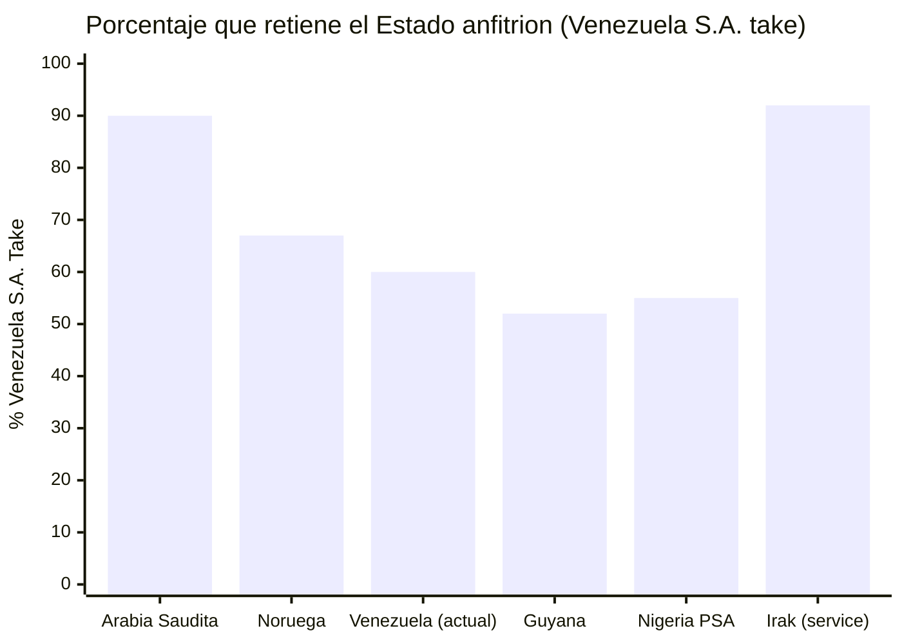

# Contratos Forward de Petróleo a Precio Garantizado

## Precedente: China prestó USD 60.000+ M respaldados con petróleo

[AidData registra USD 105.590 millones](https://www.aiddata.org/blog/how-chinas-oil-backed-lending-in-venezuela-fell-into-distress) en compromisos totales, 95% con respaldo petrolero.

## Qué Salió Mal y Cómo Se Corrige

| Problema China | Solución |
|----------------|----------|
| Un solo comprador (85%) | Mínimo 5 compradores |
| Sin transparencia | Cuentas escrow + auditoría Big 4 |
| Sin tope de volumen | Floor de precio + techo de volumen |
| PDVSA sin capacidad | Joint ventures con majors |

> Fuentes: [AidData](https://www.aiddata.org/blog/how-chinas-oil-backed-lending-in-venezuela-fell-into-distress); [Columbia CGEP](https://www.energypolicy.columbia.edu/venezuela-china-oil-ties-severely-impacted-by-us-action/); [RAND](https://www.rand.org/pubs/commentary/2026/01/china-could-play-spoiler-in-venezuelas-debt-restructuring.html)

## Proyección a USD 60/barril

| Escenario | Barriles | Precio | Valor Contractual | Adelanto (20–25%) |
|-----------|----------|--------|-------------------|-------------------|
| Conservador | 40.000 M | USD 55 | USD 2,2 T | USD 440–550.000 M |
| **Base** | **60.000 M** | **USD 60** | **USD 3,6 T** | **USD 720–900.000 M** |
| Optimista | 80.000 M | USD 65 | USD 5,2 T | USD 1,04–1,3 T |

:::info Precio actual vs. base del plan
Brent hoy: ~USD 100 (crisis Ormuz). [EIA proyecta](https://www.eia.gov/outlooks/steo/) ~$64 para 2027. Usamos $60 para eliminar riesgo. Todo por encima es upside.
:::

---

## Split Venezuela vs. Majors: ¿Cuánto Queda?

> El petróleo está en el subsuelo. Pero extraerlo requiere capital, tecnología y experiencia que Venezuela no tiene hoy. ¿Cuánto hay que ceder para obtenerlo?

### Tipos de Contrato y Reparto

| Tipo de contrato | Venezuela toma (%) | Major toma (%) | País referencia | Ventaja | Desventaja |
|------------------|--------------------|----------------|-----------------|---------|------------|
| **Joint Venture (JV)** | 55–65% | 35–45% | Venezuela actual (Chevron GL44) | Control operativo compartido, transferencia tecnológica | Requiere capital estatal como contraparte |
| **Production Sharing Agreement (PSA)** | 50–70% | 30–50% | Indonesia, Angola, Nigeria | Estado no pone capital; major asume riesgo exploratorio | Menor control operativo, cost recovery favorece major |
| **Service Contract** | 85–95% | 5–15% (fee fijo) | Irak post-2009, México (pre-reforma) | Máximo control y retención de ingresos | No atrae inversión de escala; riesgo 100% de Venezuela S.A. |
| **Concesión** | 40–60% (regalías + impuestos) | 40–60% | Guyana, Brasil (pre-sal) | Máxima inversión privada, rápida ejecución | Menor control, riesgo de términos desfavorables |
| **Modelo Noruego** | **~67%** | ~33% | Noruega (Equinor + licencias) | Balance óptimo: control ciudadano (vía Venezuela S.A.) + inversión privada + Fondo de Inversión Venezuela S.A. | Requiere empresa operadora competente (Equinor como referencia) |

### Situación Actual de Venezuela

El modelo vigente es JV con PDVSA como socio mayoritario. [Chevron opera bajo licencia OFAC GL44](https://www.reuters.com/business/energy/chevron-begins-shipping-venezuelan-oil-us-after-license-2022-11-26/) con un split estimado de **~60% Venezuela / 40% Chevron** en las JVs de la Faja del Orinoco (Petropiar, Petroboscán).

### Comparación Internacional

| País | Venezuela S.A. take | Modelo | Producción (bpd) | Fuente |
|------|----------------|--------|-------------------|--------|
| **Arabia Saudita** | ~85-90% | Aramco estatal + service contracts | 9-10M | [IEA WEO 2024](https://www.iea.org/reports/world-energy-outlook-2024) |
| **Noruega** | ~67% | Licencias + Equinor (67% estatal) | ~1.8M | [Rystad Energy](https://www.rystadenergy.com/) |
| **Venezuela (actual)** | ~60% | JVs con PDVSA mayoritaria | ~0.9M | [OPEP ASB 2025](https://www.opec.org/) |
| **Guyana** | ~52% | PSA con ExxonMobil | ~0.6M | [IEA, 2024](https://www.iea.org/) |
| **Nigeria** | ~55% (PSA) | PSAs + JVs | ~1.3M | [Rystad Energy](https://www.rystadenergy.com/) |
| **Irak** | ~92% | Service contracts (fee/barril) | ~4.5M | [IEA WEO 2024](https://www.iea.org/reports/world-energy-outlook-2024) |

### Recomendación: Modelo Híbrido Tipo Noruega

:::tip Objetivo: Venezuela S.A. take de 65-70%
1. **Fase 1 (Año 0-5):** JVs con split 55/45 — ceder más para atraer capital y tecnología cuando el riesgo es máximo.
2. **Fase 2 (Año 5-10):** Renegociar a 60/40 conforme el riesgo baja y la producción sube.
3. **Fase 3 (Año 10-15):** Migrar a modelo noruego (67/33) con Venezuela S.A. como socio competente en JVs post-reforma de PDVSA (PDVSA se transforma en filial operadora de Venezuela S.A., no del Estado).

El **upside por encima de USD 60/barril** va 100% al Fondo de Inversión Venezuela S.A. — esto aumenta el Venezuela S.A. take efectivo sin cambiar los contratos.
:::

**Fuentes:** [IEA — World Energy Outlook 2024](https://www.iea.org/reports/world-energy-outlook-2024) | [Rystad Energy](https://www.rystadenergy.com/) | [Reuters — Chevron GL44](https://www.reuters.com/business/energy/chevron-begins-shipping-venezuelan-oil-us-after-license-2022-11-26/)
