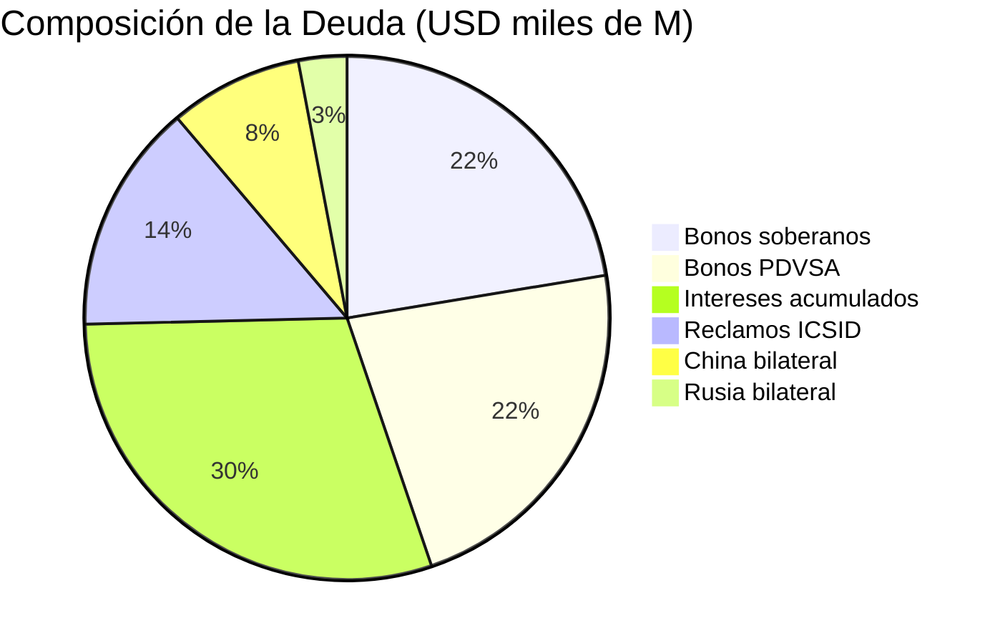
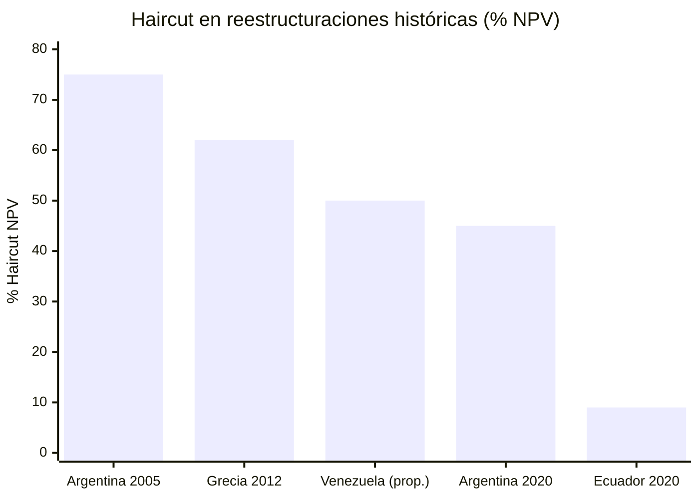

# Reestructuración de la Deuda: USD 150–170.000 M

> Venezuela lleva en default desde 2017. Ningún plan funciona sin resolver la deuda.

## Composición de la Deuda

[Default desde noviembre 2017](https://www.cnbc.com/2026/01/04/venezuelas-billions-in-distressed-debt-who-is-in-line-to-collect.html). Deuda total: **USD 150–170.000 M**. Ratio deuda/PIB: ~200% ([FMI](https://www.imf.org)).

| Tipo | Monto Estimado | Tenedor | Estado |
|------|----------------|---------|--------|
| Bonos soberanos | ~USD 30.000 M (face value) | Fondos de inversión, holdouts | Default desde 2017 |
| Bonos PDVSA | ~USD 30.000 M | Fondos, garantía Citgo | Default, bonos a [27–32 centavos/dólar](https://www.cnbc.com/2026/01/04/venezuelas-billions-in-distressed-debt-who-is-in-line-to-collect.html) |
| Bilateral — China | USD 10–12.000 M | [China, colateralizado con petróleo](https://www.rand.org/pubs/commentary/2026/01/china-could-play-spoiler-in-venezuelas-debt-restructuring.html) | Pagos parciales con crudo |
| Bilateral — Rusia | USD 3–5.000 M | Rosneft / gobierno ruso | Parcialmente pagado |
| Reclamos ICSID/arbitraje | USD 19.000+ M | [Múltiples (Citgo PDV Holding)](https://www.cnbc.com/2026/01/04/venezuelas-billions-in-distressed-debt-who-is-in-line-to-collect.html) | En litigio activo |
| Intereses acumulados | USD 30–50.000 M est. | Todos los acreedores | Creciendo |
| **TOTAL** | **USD 150–170.000 M** | — | — |

:::danger Citgo: El Activo En Riesgo
Un bono PDVSA 2020 está garantizado con la participación mayoritaria en [Citgo](https://www.cnbc.com/2026/01/04/venezuelas-billions-in-distressed-debt-who-is-in-line-to-collect.html), refinería en EE.UU. Un tribunal de Delaware registró **USD 19.000 M en reclamos** contra PDV Holding — muy por encima del valor de Citgo. Perder Citgo debilitaría la posición negociadora.
:::

## Modelo Citigroup: Haircut 50% + Bono 20 Años

[Citigroup (nov. 2025)](https://www.cnbc.com/2026/01/04/venezuelas-billions-in-distressed-debt-who-is-in-line-to-collect.html) propuso:
- **Haircut:** 50% del valor nominal
- **Nuevo bono:** 20 años de plazo
- **Cupón:** 4,4% anual
- **Costo total post-reestructuración:** USD 75–85.000 M

A bonos cotizando a 27–32 centavos, un haircut del 50% con cupón del 4,4% representa un upside significativo para los tenedores actuales — incentivo para participar.

## Lecciones de Reestructuraciones Anteriores

| País | Año | Deuda | Haircut (NPV) | Instrumento clave | Resultado |
|------|-----|-------|---------------|-------------------|-----------|
| **Argentina** | 2005 | USD 82.000 M | [~75% NPV](https://cepr.org/voxeu/columns/sovereign-default-and-debt-restructuring-was-argentinas-haircut-excessive) | GDP warrants + bonos nuevos | 76% participación, holdouts litigaron 15 años |
| **Argentina** | 2020 | USD 65.000 M | ~45% NPV | [Bonos bajo ley NY](https://www.europarl.europa.eu/thinktank/en/document/EPRS_BRI(2023)753938) | Acuerdo rápido con CACs |
| **Grecia** | 2012 | €206.000 M | [53,5% face value](https://www.esm.europa.eu/content/what-was-private-sector-debt-restructuring-march-2012) (~59–65% NPV) | PSI + GDP warrants | 97% participación |
| **Ecuador** | 2020 | [USD 17.400 M](https://www.clearygottlieb.com/news-and-insights/news-listing/ecuadors-successful-17-4-billion-sovereign-debt-restructuring) | ~9% face value | Extensión de plazos | Ahorro USD 11.300 M en 5 años |
| **Venezuela** (propuesta) | TBD | USD 150–170.000 M | 50% (Citi) | Bono 20 años, 4,4% cupón | Por negociar |

### Lecciones clave para Venezuela

1. **Argentina 2005:** Los GDP warrants alinearon incentivos — pagos vinculados al crecimiento. Venezuela podría ofrecer warrants vinculados a producción petrolera.
2. **Argentina holdouts:** Fondos buitre (NML Capital) litigaron 15 años. Venezuela necesita CACs (cláusulas de acción colectiva) para evitar esto.
3. **Grecia 2012:** La troika (FMI/BCE/CE) condicionó el alivio a reformas estructurales. Venezuela necesitará un paquete FMI similar.
4. **Ecuador 2020:** Reestructuración exitosa con [extensión de plazos](https://www.clearygottlieb.com/news-and-insights/news-listing/ecuadors-successful-17-4-billion-sovereign-debt-restructuring) más que haircuts profundos — modelo más amigable para mercados.
5. **Argentina bajo Milei:** [Volvió a mercados internacionales](https://www.fundssociety.com/en/news/markets/argentina-prepares-for-return-to-the-international-debt-market-after-eight-years/) tras 8 años de exclusión. Venezuela lleva 9 años — la secuencia es similar: superávit fiscal → acuerdo FMI → upgrade crediticio → emisión.

## China Como Spoiler

:::caution Riesgo geopolítico
[RAND (ene. 2026)](https://www.rand.org/pubs/commentary/2026/01/china-could-play-spoiler-in-venezuelas-debt-restructuring.html): China puede bloquear la reestructuración. Su deuda está colateralizada con petróleo — prefiere seguir cobrando en crudo a aceptar un haircut. **Solución:** incluir a China como comprador diversificado en los forward contracts, no como acreedor.
:::

## Timeline de Reestructuración

| Fase | Acción | Plazo | Condición |
|------|--------|-------|-----------|
| 1 | Reconocimiento intl. del gobierno | Día 1 | Elecciones o transición |
| 2 | Nombramiento de asesores (Lazard, Rothschild) | Mes 1 | Credibilidad del gobierno |
| 3 | Inicio negociaciones con comité de acreedores | Mes 3–6 | Marco legal |
| 4 | Acuerdo con FMI (programa EFF) | Mes 6–12 | Reformas estructurales |
| 5 | Oferta formal de canje (modelo Citi) | Año 1–2 | Acuerdo FMI cerrado |
| 6 | Resolución bilateral China/Rusia | Año 1–3 | Negociación paralela |
| 7 | Resolución reclamos ICSID | Año 2–5 | Tribunales intl. |
| 8 | Retorno a mercados internacionales | Año 3–5 | Riesgo país <550 bps |

## Riesgos Específicos

| Riesgo | Severidad | Mitigación |
|--------|----------|------------|
| Holdout creditors (fondos buitre) | ALTO | CACs en nuevos bonos, jurisdicción NY |
| China bloquea reestructuración | ALTO | Forward contracts como alternativa al repago |
| Pérdida de Citgo por litigio | CRÍTICO | Negociación urgente con acreedores PDVSA 2020 |
| Sin programa FMI | CRÍTICO | Reforma fiscal + transparencia como pre-condición |
| Falta de gobierno reconocido | CRÍTICO | Elecciones como condición para restructurar |
