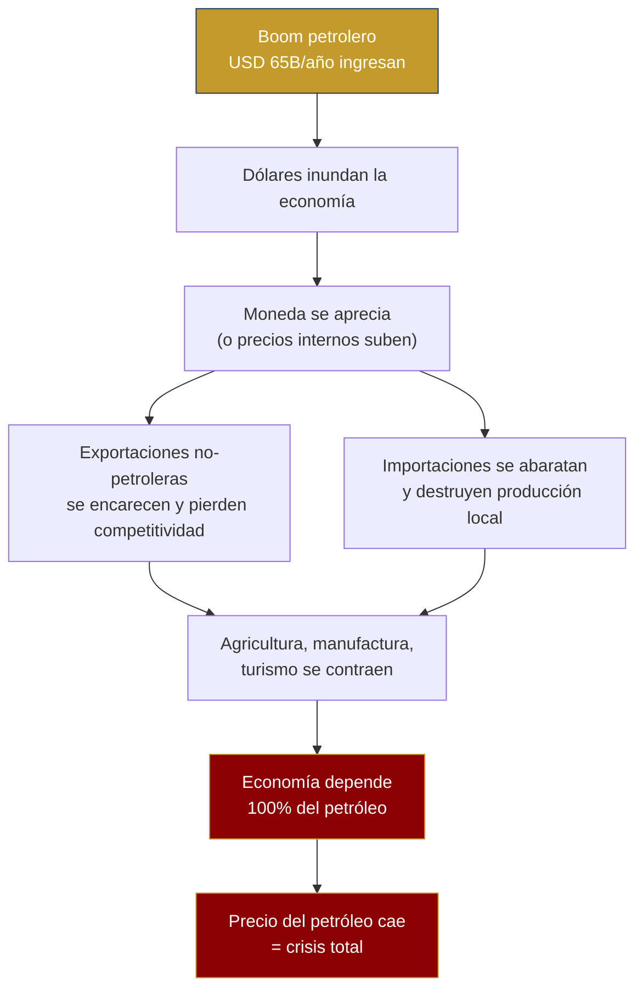
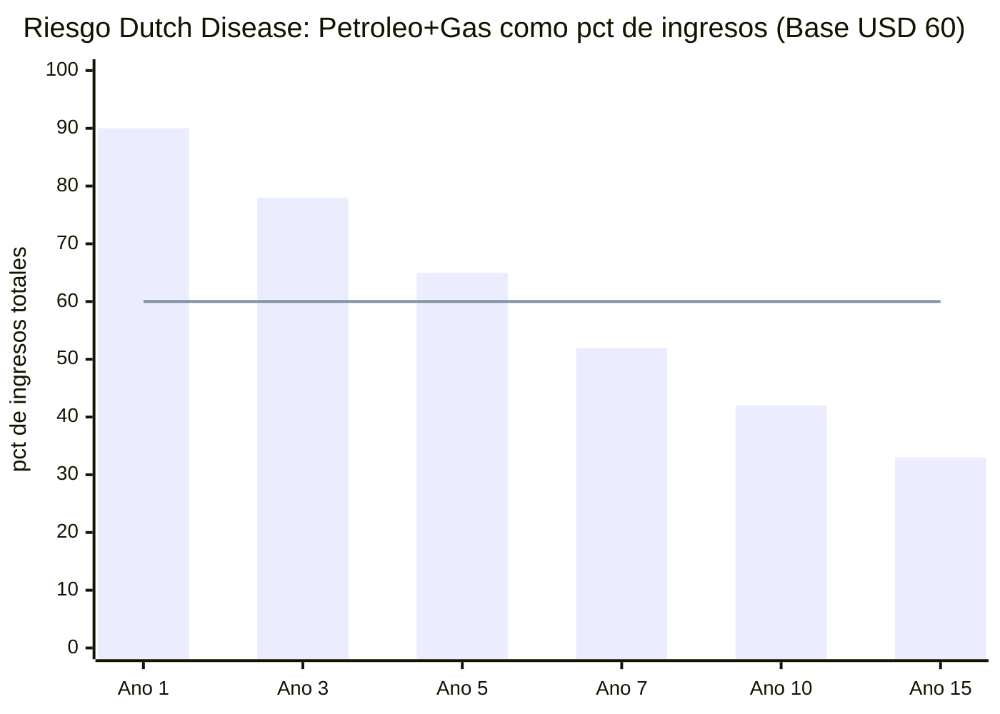

# Enfermedad Holandesa: La Trampa que Hay que Evitar

> Venezuela ya sufrió Dutch Disease durante 50 años. Este plan no puede repetir el error.

:::danger Definición
La **Enfermedad Holandesa** (Dutch Disease) ocurre cuando un boom de recursos naturales aprecia la moneda real, encarece las exportaciones no petroleras, destruye manufactura y agricultura, y crea dependencia del recurso. Nombre: el colapso de la industria holandesa tras el descubrimiento de gas en Groningen (1959).
:::

---

## Cómo Funciona

---

## Casos Históricos

| País | Período | Qué pasó | Resultado | Fuente |
|------|---------|----------|-----------|--------|
| **Países Bajos** | 1959-1977 | Descubrimiento de gas en Groningen → apreciación del florín | Manufactura cayó de 30% a 20% del PIB; sector servicios compensó parcialmente | [IMF WP/2003/12](https://www.imf.org/external/pubs/ft/wp/2003/wp0312.pdf) |
| **Nigeria** | 1970-2000 | Boom petrolero → naira apreciada → agricultura colapsó | Agricultura cayó de 60% a 20% del PIB; pobreza aumentó pese a ingresos petroleros | [World Bank, 2003](https://documents.worldbank.org/) |
| **Venezuela** | 1973-1998 | Boom petrolero → bolívar apreciado → "Venezuela Saudita" | PIB per cápita cayó 22% entre 1978-1998 pese a USD 300B+ en ingresos petroleros; manufactura destruida | [Hausmann & Rodríguez, 2014](https://www.hup.harvard.edu/books/9780674072848) |
| **Noruega** | 1970-presente | Boom petrolero → fondo soberano absorbe dólares → corona gestionada | Manufactura se contrajo pero fondo acumuló USD 2,2T; economía diversificada | [NBIM](https://www.nbim.no/) |
| **Botsuana** | 1967-presente | Boom de diamantes → fondo Pula + inversión en educación + tipo de cambio gestionado | PIB per cápita: USD 70 (1966) → USD 7.500 (2023); democracia más estable de África | [World Bank](https://data.worldbank.org/country/botswana) |

---

## Vulnerabilidad del Plan Venezuela S.A.

En el escenario optimista (año 15):

| Fuente | Ingreso | % del total |
|--------|---------|------------|
| Petróleo neto | USD 42.700 M | 33% |
| Recaudación fiscal | USD 40.000 M | 31% |
| Otros motores (gas, minería, turismo, tech, agro...) | USD 49.300 M | 36% |
| **Total** | **USD 132.000 M** | **100%** |

**El petróleo es el 33% de ingresos directos en año 15, pero financia indirectamente el crecimiento que genera los impuestos.** En el escenario base (USD 60), la dependencia es aún mayor durante los primeros 10 años: el petróleo + gas representan ~60-70% de los ingresos.

**Zona de peligro:** Años 1-7, cuando el petróleo + gas representan >60% de ingresos. Es exactamente cuando la Dutch Disease golpea más fuerte.

---

## 6 Mecanismos de Defensa

### 1. Fondo soberano 100% externo

Todos los ingresos petroleros van al [fondo soberano](/02-motor-financiero/fondo-soberano) que invierte **100% fuera de Venezuela**. Los dólares del petróleo nunca entran a la economía doméstica directamente — solo el retorno del fondo (3-4%/año), dosificado.

**Precedente:** [NBIM (Noruega)](https://www.nbim.no/) — 100% activos externos. Es el mecanismo anti-Dutch Disease más probado del mundo.

### 2. Esterilización fiscal

El Estado no financia su gasto con petróleo sino con impuestos (15% flat + 12% IVA). Los ingresos petroleros van al fondo, no al presupuesto. Esto rompe el canal de transmisión: más petróleo ≠ más gasto público ≠ más demanda interna ≠ apreciación.

### 3. ZEETs compensatorias

Las [Zonas Económicas Especiales de Tecnología](/05-transformacion/hubs-tech) crean sectores exportadores no petroleros con incentivos fiscales diferenciados, protegidos del efecto apreciación:

- Exención fiscal 10 años para exportaciones tech
- Subsidio salarial para empleos tech (compensar salarios petroleros)
- Infraestructura dedicada (energía, internet) a costo subsidiado

**Precedente:** [Shenzhen (China)](https://en.wikipedia.org/wiki/Shenzhen) y [Dubái (EAU)](https://www.difc.ae/) — zonas especiales que crearon industrias no petroleras dentro de economías petroleras.

### 4. Inversión en productividad no petrolera

Destinar 20-30% de los retornos del fondo a:
- Infraestructura agroindustrial (riego, almacenamiento, cadena de frío)
- Capacitación técnica (programas de reskilling para sectores no petroleros, ver [Capital humano](/05-transformacion/capital-humano))
- Crédito subsidiado para PYMES exportadoras

### 5. Monitoreo de tipo de cambio real

Dashboard público que mide mensualmente:
- Tipo de cambio real efectivo (REER) vs. socios comerciales
- Índice de competitividad exportadora no petrolera
- Alertas automáticas si REER se aprecia >10% en 12 meses

### 6. La dolarización como factor diferencial

:::info Dolarización de facto cambia la ecuación
Venezuela opera en dolarización de facto (~60% de transacciones en USD, [ENCOVI/UCAB 2023](https://www.proyectoencovi.com/)). Si se formaliza la dolarización (como Ecuador en 2000):
- **No hay moneda que apreciar** — el mecanismo clásico de Dutch Disease se debilita
- El riesgo se traslada a **inflación interna de precios** (más dólares → precios suben)
- Mitigación: fondo externo + esterilización fiscal siguen siendo efectivos

**Precedente:** Ecuador dolarizó en 2000 con PIB de USD 18B; hoy USD 115B. No eliminó Dutch Disease pero cambió su mecanismo. ([Banco Central del Ecuador](https://www.bce.fin.ec/))
:::

---

## Indicadores de Alerta Temprana

| Indicador | Umbral de alerta | Acción |
|-----------|-----------------|--------|
| Petróleo + gas > 60% de ingresos | Año 5+ | Acelerar diversificación, más incentivos a ZEETs |
| Manufactura < 10% del PIB | Cualquier año | Subsidios compensatorios + crédito PYMES |
| Importaciones de alimentos > 50% | Año 5+ | Inversión agroindustrial urgente |
| Salarios sector petrolero > 3x promedio nacional | Cualquier año | Tope salarial o impuesto compensatorio |
| REER aprecia > 15% en 24 meses | Cualquier año | Intervención fiscal + revisión de flujos |

**Fuentes:** [IMF — The Dutch Disease: Causes and Effects (WP/2003/12)](https://www.imf.org/external/pubs/ft/wp/2003/wp0312.pdf) | [World Bank — Resource Curse or Blessing?](https://documents.worldbank.org/) | [Hausmann & Rodríguez — Venezuela Before Chávez (2014)](https://www.hup.harvard.edu/books/9780674072848) | [NBIM](https://www.nbim.no/)
