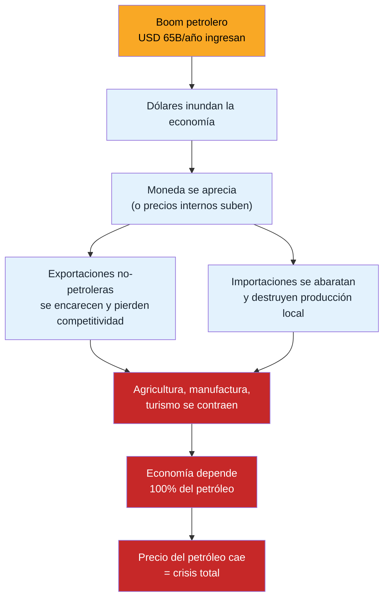
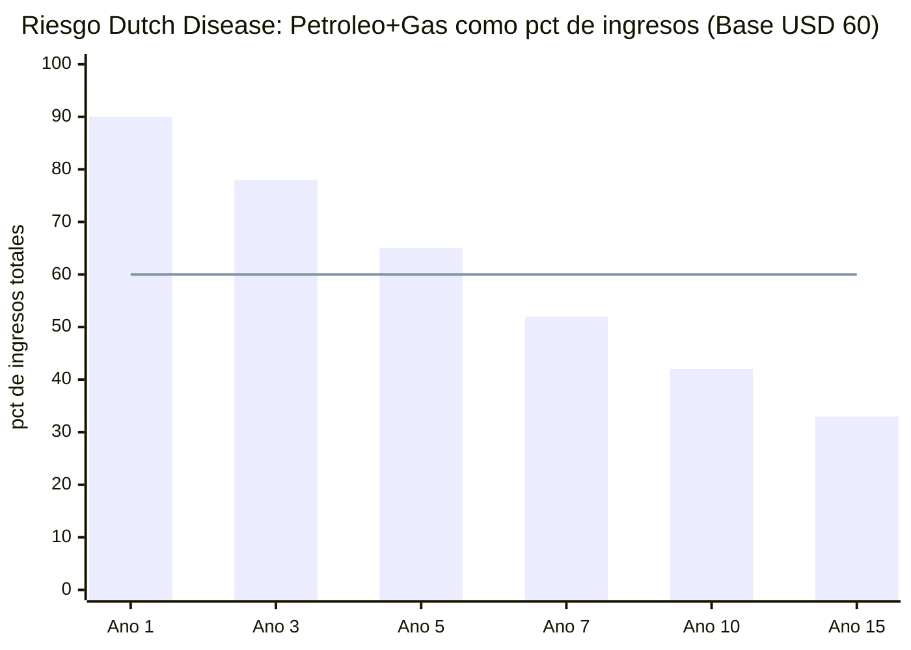
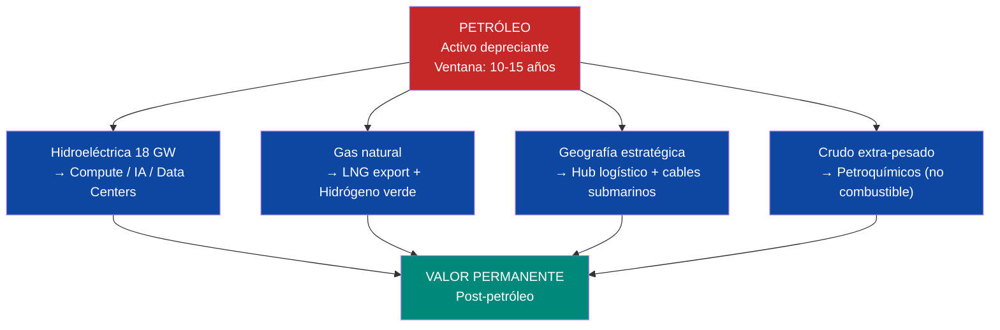

# Enfermedad Holandesa: La Trampa que Hay que Evitar

:::tip ¿Qué es la Enfermedad Holandesa? — En palabras simples
Imagina que tu pueblo vive de la agricultura y la pesca. Un día descubren petróleo. De repente hay mucho dinero. Todo sube de precio: la comida, los alquileres, los salarios. Los agricultores y pescadores ya no pueden competir porque todo es muy caro. Cierran. Ahora **todo el pueblo depende del petróleo.** Cuando el precio del petróleo cae — como pasó en Venezuela — no hay agricultura, no hay pesca, no hay nada. Solo pobreza.

Eso es la [Enfermedad Holandesa](/glosario): **cuando un país se vuelve adicto a un solo recurso y destruye todo lo demás.** Venezuela la sufrió 50 años. Este plan existe para que NO se repita.
:::

:::caution Fechas ilustrativas — las fases se activan por KPIs, no por calendario
Las referencias a "Año X" en este documento son **ilustrativas**. Las fases reales se activan por condiciones verificables (PIB/cápita, formalización, pobreza). Ver [KPIs de Activación](/07-ejecucion/kpis-activacion).
:::

> Venezuela ya sufrió Dutch Disease durante 50 años. Este plan no puede repetir el error.

:::danger Definición técnica
La **Enfermedad Holandesa** (Dutch Disease) ocurre cuando un boom de recursos naturales aprecia la moneda real, encarece las exportaciones no petroleras, destruye manufactura y agricultura, y crea dependencia del recurso. Nombre: el colapso de la industria holandesa tras el descubrimiento de gas en Groningen (1959).
:::

---

## Cómo Funciona

---

## Casos Históricos

| País | Período | Qué pasó | Resultado | Fuente |
|------|---------|----------|-----------|--------|
| **Países Bajos** | 1959-1977 | Descubrimiento de gas en Groningen → apreciación del florín | Manufactura cayó de 30% a 20% del PIB; sector servicios compensó parcialmente | [IMF WP/2003/12](https://www.imf.org/external/pubs/ft/wp/2003/wp0312.pdf) |
| **Nigeria** | 1970-2000 | Boom petrolero → naira apreciada → agricultura colapsó | Agricultura cayó de 60% a 20% del PIB; pobreza aumentó pese a ingresos petroleros | [World Bank, 2003](https://documents.worldbank.org/) |
| **Venezuela** | 1973-1998 | Boom petrolero → bolívar apreciado → "Venezuela Saudita" | PIB per cápita cayó 22% entre 1978-1998 pese a USD 300B+ en ingresos petroleros; manufactura destruida | [Hausmann & Rodríguez, 2014](https://www.hup.harvard.edu/books/9780674072848) |
| **Noruega** | 1970-presente | Boom petrolero → Fondo de Inversión Venezuela S.A. absorbe dólares → corona gestionada | Manufactura se contrajo pero fondo acumuló USD 2,2T; economía diversificada | [NBIM](https://www.nbim.no/) |
| **Botsuana** | 1967-presente | Boom de diamantes → fondo Pula + inversión en educación + tipo de cambio gestionado | PIB per cápita: USD 70 (1966) → USD 7.500 (2023); democracia más estable de África | [World Bank](https://data.worldbank.org/country/botswana) |

---

## Vulnerabilidad del Plan Venezuela S.A.

En el escenario optimista (año 15):

| Fuente | Ingreso | % del total |
|--------|---------|------------|
| Petróleo neto | USD 42.700 M | 33% |
| Recaudación fiscal | USD 40.000 M | 31% |
| Otros motores (gas, minería, turismo, tech, agro...) | USD 49.300 M | 36% |
| **Total** | **USD 132.000 M** | **100%** |

**El petróleo es el 33% de ingresos directos en año 15, pero financia indirectamente el crecimiento que genera los impuestos.** En el escenario base (USD 60), la dependencia es aún mayor durante los primeros 10 años: el petróleo + gas representan ~60-70% de los ingresos.

**Zona de peligro:** Años 1-7, cuando el petróleo + gas representan >60% de ingresos. Es exactamente cuando la Dutch Disease golpea más fuerte.

---

## 6 Mecanismos de Defensa

### 1. Fondo de Inversión Venezuela S.A. 100% externo

Todos los ingresos petroleros van al [Fondo de Inversión Venezuela S.A.](/02-motor-financiero/fondo-soberano) que invierte **100% fuera de Venezuela**. Los dólares del petróleo nunca entran a la economía doméstica directamente — solo el retorno del fondo (3-4%/año), dosificado.

**Precedente:** [NBIM (Noruega)](https://www.nbim.no/) — 100% activos externos. Es el mecanismo anti-Dutch Disease más probado del mundo.

### 2. Esterilización fiscal

El Estado no financia su gasto con petróleo sino con impuestos (15% flat + 12% IVA). Los ingresos petroleros van al Fondo de Inversión Venezuela S.A. administrado por Venezuela S.A. — no al presupuesto del Estado. Venezuela S.A. cobra regalías y dividendos de las concesiones petroleras y los deposita en el fondo. El Estado no toca esos ingresos. Esto rompe el canal de transmisión: más petróleo ≠ más gasto público ≠ más demanda interna ≠ apreciación.

### 3. ZEETs compensatorias

Las [Zonas Económicas Especiales de Tecnología](/05-transformacion/hubs-tech) crean sectores exportadores no petroleros con incentivos fiscales diferenciados, protegidos del efecto apreciación:

- Exención fiscal 10 años para exportaciones tech
- Incentivos salariales para empleos tech (compensar salarios petroleros)
- Infraestructura dedicada (energía, internet) a costo competitivo (hidro venezolana = naturalmente barata)

**Precedente:** [Shenzhen (China)](https://en.wikipedia.org/wiki/Shenzhen) y [Dubái (EAU)](https://www.difc.ae/) — zonas especiales que crearon industrias no petroleras dentro de economías petroleras.

### 4. Inversión en productividad no petrolera

Venezuela S.A. destina 20-30% de los retornos del fondo a inversiones directas en sectores no petroleros:
- Equity en JVs de infraestructura agroindustrial (riego, almacenamiento, cadena de frío)
- Capacitación técnica vía voucher (programas de reskilling para sectores no petroleros, ver [Capital humano](/05-transformacion/capital-humano))
- Capital semilla y venture capital para PYMES exportadoras (Venezuela S.A. como inversor, no como banco estatal)

### 5. Monitoreo de tipo de cambio real

Dashboard público que mide mensualmente:
- Tipo de cambio real efectivo (REER) vs. socios comerciales
- Índice de competitividad exportadora no petrolera
- Alertas automáticas si REER se aprecia >10% en 12 meses

### 6. La dolarización como factor diferencial

:::info Dolarización de facto cambia la ecuación
Venezuela opera en dolarización de facto (~60% de transacciones en USD, [ENCOVI/UCAB 2023](https://www.proyectoencovi.com/)). Si se formaliza la dolarización (como Ecuador en 2000):
- **No hay moneda que apreciar** — el mecanismo clásico de Dutch Disease se debilita
- El riesgo se traslada a **inflación interna de precios** (más dólares → precios suben)
- Mitigación: fondo externo + esterilización fiscal siguen siendo efectivos

**Precedente:** Ecuador dolarizó en 2000 con PIB de USD 18B; hoy USD 115B. No eliminó Dutch Disease pero cambió su mecanismo. ([Banco Central del Ecuador](https://www.bce.fin.ec/))
:::

---

## Indicadores de Alerta Temprana

¿Qué haría una empresa si detecta que su negocio se está concentrando peligrosamente en un solo cliente? Diversifica, reasigna capital, acelera nuevas líneas de negocio. Venezuela S.A. hace exactamente eso:

| Indicador | Umbral de alerta | Acción (como empresa) |
|-----------|-----------------|----------------------|
| Petróleo + gas > 60% de ingresos | Año 5+ | Venezuela S.A. reasigna capital del fondo: más equity en JVs tech, agro y turismo. Acelera licitaciones de concesiones no petroleras. Meta: 3 nuevos sectores exportadores activos |
| Manufactura < 10% del PIB | Cualquier año | Venezuela S.A. invierte como VC en manufactura: equity en parques industriales, energía hidro a precio competitivo (ventaja natural, no subsidio), fast-track de permisos para fábricas en ZEETs |
| Importaciones de alimentos > 50% | Año 5+ | Venezuela S.A. activa JVs agroindustriales: equity en cadena de frío + riego + almacenamiento. Concesiones de tierra cultivable con obligación de producción. Alianzas con Brasil/Argentina para transferencia de tecnología agro |
| Salarios sector petrolero > 3x promedio nacional | Cualquier año | Venezuela S.A. sube la inversión en sectores que compitan por talento: más capital en tech hubs, data centers, manufactura avanzada — que los salarios no petroleros suban por demanda de mercado, no por decreto |
| REER aprecia > 15% en 24 meses | Cualquier año | Fondo aumenta tasa de inversión externa (más dólares salen al fondo, menos circulan internamente). Venezuela S.A. acelera importación de bienes de capital para proyectos de infraestructura (absorbe dólares productivamente) |

**Fuentes:** [IMF — The Dutch Disease: Causes and Effects (WP/2003/12)](https://www.imf.org/external/pubs/ft/wp/2003/wp0312.pdf) | [World Bank — Resource Curse or Blessing?](https://documents.worldbank.org/) | [Hausmann & Rodríguez — Venezuela Before Chávez (2014)](https://www.hup.harvard.edu/books/9780674072848) | [NBIM](https://www.nbim.no/)

---

## La Ventana se Cierra: Petróleo como Activo Depreciante

> El petróleo no desaparece mañana. Pero su ventana de valor máximo es 10-15 años, no 30. Cada año de retraso destruye valor.

### La Competencia ya Ganó en Costo

| Fuente de energía | LCOE 2024 (USD/MWh) | LCOE proyectado 2035 | Tendencia | Fuente |
|-------------------|---------------------|----------------------|-----------|--------|
| **Solar utility** | **USD 29** | USD 15-20 | ↓ acelerando | [IRENA — Renewable Power Costs 2024](https://www.irena.org/publications/2024/Sep/Renewable-Power-Generation-Costs-in-2023) |
| Eólica onshore | USD 33 | USD 20-25 | ↓ estable | [IRENA, 2024](https://www.irena.org/publications/2024/Sep/Renewable-Power-Generation-Costs-in-2023) |
| Gas natural (CCGT) | USD 45-65 | USD 50-70 | → estable | [IEA WEO 2024](https://www.iea.org/reports/world-energy-outlook-2024) |
| **Faja del Orinoco (extra-heavy)** | **USD 40-50** | **USD 40-50** | → sin mejora | [Rystad Energy](https://www.rystadenergy.com/) |

El crudo extra-pesado de la Faja ya es **más caro que solar** como fuente de energía. Para 2035, la brecha será 2-3x.

### Demanda de Petróleo: El Pico se Acerca

| Indicador | Proyección | Fuente |
|-----------|-----------|--------|
| **Pico de demanda global de petróleo** | **2028-2030** | [IEA — World Energy Outlook 2024](https://www.iea.org/reports/world-energy-outlook-2024) |
| Participación de EVs en ventas globales | 80% para 2040 (escenario NZE) | [IEA — Global EV Outlook 2024](https://www.iea.org/reports/global-ev-outlook-2024) |
| Demanda de petróleo para transporte | -45% para 2040 vs. 2023 (NZE) | [IEA WEO 2024](https://www.iea.org/reports/world-energy-outlook-2024) |
| Inversión global en energía limpia | **USD 2T/año** (2024) vs. USD 1T en fósiles | [BloombergNEF, 2024](https://about.bnef.com/energy-transition-investment/) |

:::danger La ventana es 10-15 años, no 30
Si el pico de demanda es 2028-2030 y la caída es gradual (-2-3% anual post-pico), Venezuela tiene **~10-15 años de demanda fuerte**. Después, el crudo extra-pesado de la Faja — con alto costo de extracción y alta huella de carbono — será el **primero en salir del mercado**. No es el petróleo saudí (USD 10/barril de extracción) el que pierde. Es el venezolano.
:::

### Estrategia de Pivote: De Petróleo a Valor Permanente

| Activo actual | Pivote estratégico | Por qué funciona | Valor post-petróleo |
|---------------|-------------------|------------------|---------------------|
| **Hidroeléctrica (18 GW Caroní)** | Compute, IA, data centers | Energía limpia + barata = ventaja competitiva para hyperscalers (AWS, Google, Microsoft) | USD 5-10.000 M/año en servicios cloud |
| **Gas natural (200 TCF reservas)** | LNG export + hidrógeno verde | Gas es combustible de transición; H2 verde con hidro es competitivo a 2030 | USD 8-15.000 M/año en LNG+H2 |
| **Geografía (Caribe, cercanía a EE.UU.)** | Hub logístico + cables submarinos de datos | [Requiere investigación] — costo estimado de hub portuario caribeño | USD 3-5.000 M/año en servicios logísticos |
| **Crudo extra-pesado** | Petroquímicos (plásticos, asfalto, lubricantes) — no combustible | La demanda petroquímica crece +30% a 2040 aun en escenario NZE ([IEA, 2024](https://www.iea.org/reports/the-future-of-petrochemicals)) | USD 10-20.000 M/año en petroquímicos |

### La Urgencia es Real

Cada año de retraso en la ejecución del plan tiene un costo doble:

1. **Costo de oportunidad:** ~USD 35.000-40.000 M/año en ingresos petroleros no generados (diferencia entre 0.9M y 3M bpd a USD 60).
2. **Costo de depreciación:** El valor presente de las reservas cae ~2-3% anual conforme la transición energética avanza y los descuentos por carbono aumentan.

En 5 años de retraso, Venezuela pierde **~USD 175.000-200.000 M** en valor combinado. El petróleo es combustible — pero es combustible con fecha de vencimiento.

**Fuentes:** [IEA — World Energy Outlook 2024](https://www.iea.org/reports/world-energy-outlook-2024) | [IEA — Global EV Outlook 2024](https://www.iea.org/reports/global-ev-outlook-2024) | [IRENA — Renewable Power Generation Costs 2024](https://www.irena.org/publications/2024/Sep/Renewable-Power-Generation-Costs-in-2023) | [BloombergNEF — Energy Transition Investment 2024](https://about.bnef.com/energy-transition-investment/) | [IEA — Future of Petrochemicals](https://www.iea.org/reports/the-future-of-petrochemicals)
