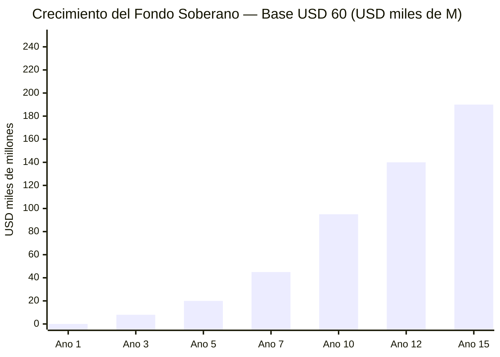
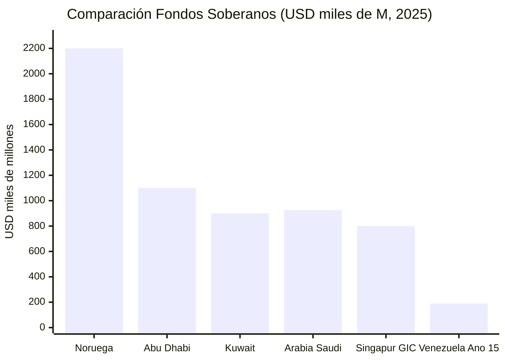
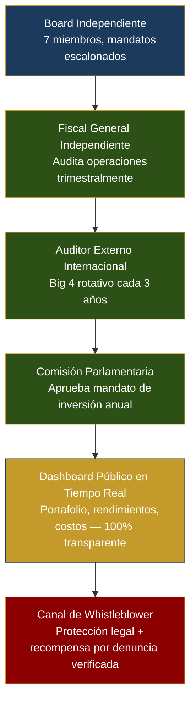

# Fondo Soberano: El Modelo Noruega

El fondo noruego: [USD 2,2 T a fines de 2025](https://www.nbim.no/en/investments/the-funds-value/), [USD 247.000 M de beneficio en 2025](https://www.cnbc.com/2026/01/29/norway-sovereign-wealth-fund-2025-return-nbim-trillion-oil-stocks-tech-ai-banks-silver.html), 7.200+ empresas, 1,5% de todas las acciones globales, [25% del presupuesto noruego](https://fortune.com/europe/2025/07/30/how-sparsely-populated-norway-amassed-1-8-trillion-sovereign-wealth-fund/).

## Las 5 Reglas Constitucionales

1. **Límite de gasto 3–4%** — Modificar requiere 2/3 parlamento + referéndum
2. **Inversión 100% externa** — Previene enfermedad holandesa
3. **Transparencia total** — Portafolio publicado como [NBIM](https://www.nbim.no/en/investments/)
4. **Consejo independiente** — 7 miembros (2 parlamento, 2 ciudadanos, 2 internacionales, 1 independiente)
5. **Dividendo ciudadano obligatorio** — Mínimo 10% de retornos anuales del fondo, distribuido per cápita

## Proyección a 15 Años (USD 60/barril)

| Fase | Producción | Aporte Anual | Valor Acumulado |
|------|-----------|-------------|----------------|
| Años 1–3 | 1,1–1,4 M bpd | USD 3–5.000 M | USD 8–15.000 M |
| Años 4–7 | 1,5–2,0 M bpd | USD 5–8.000 M | USD 35–55.000 M |
| Años 8–10 | 2,0–2,5 M bpd | USD 8–12.000 M | USD 70–120.000 M |
| Años 11–15 | 2,5–3,0 M bpd | USD 10–15.000 M | USD 160–220.000 M |

:::info Modelo solo petrolero
Esta proyección incluye **solo aportes del 30% de ingresos netos petroleros** a USD 60/barril. Con Brent a USD 70-80 el fondo alcanza USD 250-470B (ver [El Sueño](/07-ejecucion/el-sueno)). Con aportes adicionales de minería, gas y diversificación, el rango sube aún más.
:::

---

## Gobernanza: Cómo Evitar Otro FONDEN

:::danger La lección más importante
Entre 2005 y 2015, Venezuela desvió **USD 300.000+ M** a través del FONDEN (Fondo de Desarrollo Nacional) sin rendición de cuentas, sin auditorías públicas, sin oversight parlamentario ([Transparencia Venezuela](https://transparenciave.org/)). **El fondo soberano de este plan será tan bueno como su gobernanza.**
:::

### Estructura del Board

| Miembro | Quién elige | Mandato | Remoción | Restricción |
|---------|------------|---------|----------|-------------|
| 2 técnicos internacionales | Panel de [NBIM](https://www.nbim.no/) + [GIC](https://www.gic.com.sg/) + [Banco Mundial](https://www.worldbank.org/) | 6 años, no renovable | 2/3 del board + causa justificada | Sin nacionalidad venezolana requerida |
| 2 representantes parlamentarios | Parlamento (1 oficialismo + 1 oposición) | 4 años, 1 renovación | Parlamento por 2/3 | No pueden ser ministros activos |
| 2 representantes ciudadanos | Sorteo cívico de pool precalificado (profesionales financieros) | 3 años, no renovable | 2/3 del board + causa justificada | Selección aleatoria elimina captura |
| 1 presidente independiente | Nominado por los 6 anteriores, ratificado por Parlamento | 5 años, 1 renovación | 2/3 del board + 2/3 Parlamento | No puede haber sido funcionario público en últimos 10 años |

**Referencia:** [NBIM](https://www.nbim.no/en/organisation/about-norges-bank-investment-management/) tiene 9 miembros del board, todos independientes. [GIC](https://www.gic.com.sg/governance/) separa board de gobierno aunque el PM es chairman (criticado). La propuesta venezolana elimina este conflicto.

### Stack de Oversight (6 capas)

### Mecanismos Anti-Captura

| Mecanismo | Cómo funciona | Precedente |
|-----------|--------------|-----------|
| **Inversión 100% externa** | El fondo no invierte en Venezuela — evita presión política para financiar proyectos domésticos | [NBIM](https://www.nbim.no/en/the-fund/about-the-fund/): 100% activos fuera de Noruega |
| **Regla de gasto 3-4%** | Solo se puede gastar el retorno real promedio de 15 años, no el principal | Noruega: 3% del valor del fondo/año |
| **Mandatos escalonados** | Los 7 miembros nunca se renuevan al mismo tiempo — ningún gobierno nombra mayoría | [Reserva Federal](https://www.federalreserve.gov/): mandatos de 14 años escalonados |
| **Bloqueo constitucional** | Modificar reglas del fondo requiere 2/3 de Parlamento + referéndum popular | Alaska: [Permanent Fund](https://apfc.org/) protegido constitucionalmente |
| **Prohibición de préstamos soberanos** | El fondo no puede prestar al gobierno ni garantizar deuda pública | Anti-FONDEN: FONDEN prestó USD 170B+ al gobierno sin retorno |
| **Auditoría cruzada** | Auditor externo reporta al Parlamento, no al board — evita colusión | [Santiago Principles](https://www.ifswf.org/santiago-principles), Principio 16 |

### Tabla Comparativa de Gobernanza

| Dimensión | FONDEN (Venezuela) | [NBIM](https://www.nbim.no/) (Noruega) | [GIC](https://www.gic.com.sg/) (Singapur) | [ADIA](https://www.adia.ae/) (Abu Dhabi) | **Venezuela S.A.** |
|-----------|-------|------|-----|------|--------------|
| Transparencia | Cero | Total | Parcial | Parcial | Total + dashboard |
| Board independiente | Nombrado por presidente | Independiente | PM es chairman | Familia real | Mixto + sorteo cívico |
| Auditoría externa | Sin auditoría | Anual | Anual | Anual | Trimestral + rotación |
| Regla de gasto | Sin límite | 3%/año | Implícita | Implícita | 3-4% constitucional |
| Inversión doméstica | 100% doméstica | 100% externa | Mixta | Mixta | 100% externa |
| Protección legal | Decreto presidencial | Ley del parlamento | Ley ordinaria | Decreto real | Constitucional + referéndum |
| [Linaburg-Maduell Score](https://www.swfinstitute.org/research/linaburg-maduell-transparency-index) | 1/10 | 10/10 | 6/10 | 6/10 | **Meta: 10/10** |

### Locks Constitucionales: Escenarios de Estrés

| Escenario | Riesgo | Protección |
|-----------|--------|-----------|
| **Populista gana elecciones** | Quiere gastar el fondo en programas sociales | Regla de gasto 3-4% requiere referéndum para cambiar; board independiente ejecuta mandato, no órdenes del ejecutivo |
| **Constituyente** | Nueva constitución elimina el fondo | El fondo está custodiado en jurisdicción extranjera (Noruega/Singapur); cambiar custodio requiere 2/3 board + auditor + parlamento |
| **Emergencia nacional** | Terremoto, pandemia, colapso petrolero | Cláusula de emergencia permite gastar hasta 10% del fondo con aprobación de 2/3 parlamento + board + ratificación ciudadana en 90 días |
| **Presión militar** | FANB exige recursos del fondo | Fondo custodiado offshore; ningún actor doméstico puede ordenar transferencias; requiere múltiples firmas internacionales |
| **Hiperinflación** | Gobierno intenta monetizar el fondo | Fondo denominado en USD/EUR/activos reales; prohibición de préstamos al banco central |

### Mandato de Inversión

| Categoría | Asignación | Benchmark |
|-----------|-----------|-----------|
| Renta fija global | 30% | Bloomberg Global Aggregate |
| Renta variable global | 50% | MSCI ACWI |
| Bienes raíces | 10% | FTSE EPRA Nareit Global |
| Infraestructura (fuera de Venezuela) | 5% | Cambridge Associates Infrastructure |
| Efectivo/Liquidez | 5% | SOFR + 50bps |

**Prohibiciones expresas:**
- Inversión en Venezuela (evita conflicto de interés y presión política)
- Armas controversiales, tabaco (alineado con [NBIM exclusions](https://www.nbim.no/en/responsible-investment/exclusion-of-companies/))
- Préstamos a gobierno venezolano o entidades públicas
- Derivados apalancados o inversiones especulativas

**Fuentes:** [Santiago Principles (IFSWF)](https://www.ifswf.org/santiago-principles) | [NBIM Mandate](https://www.nbim.no/en/organisation/governance-model/management-mandate/) | [Linaburg-Maduell Index (SWFI)](https://www.swfinstitute.org/research/linaburg-maduell-transparency-index)
