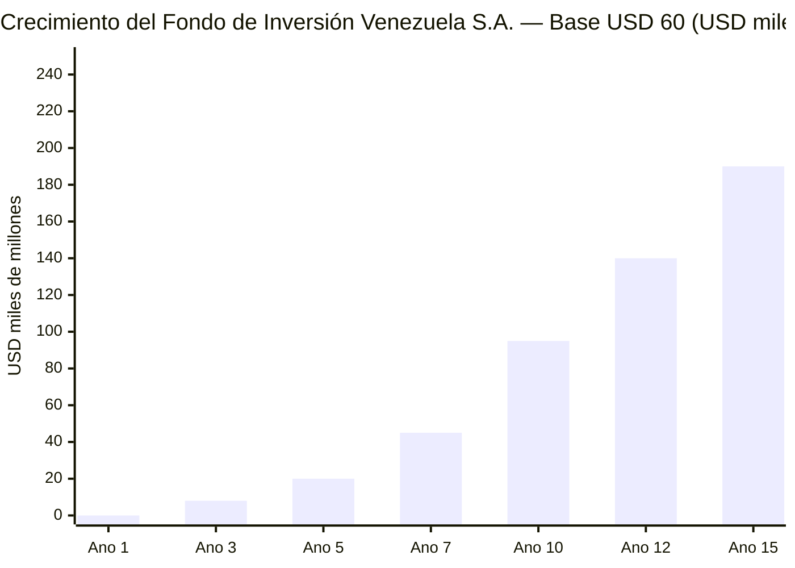
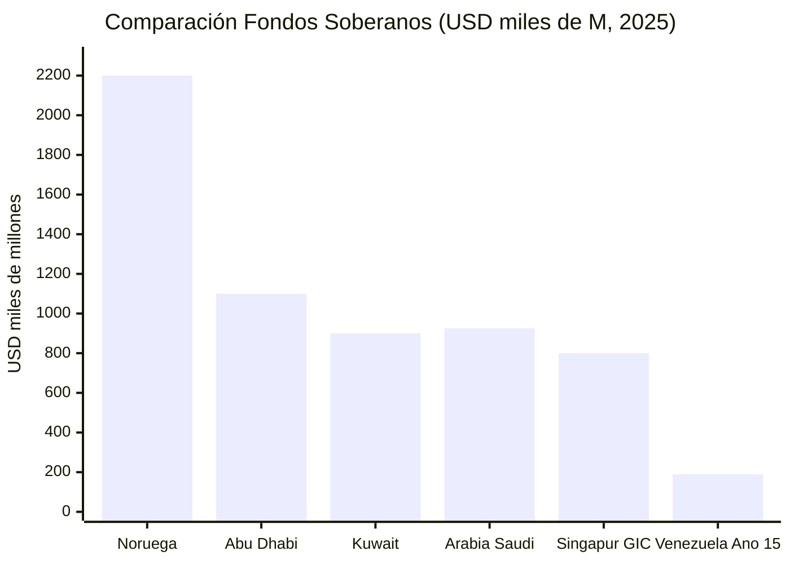
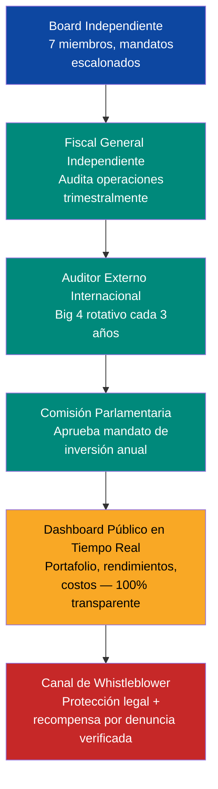
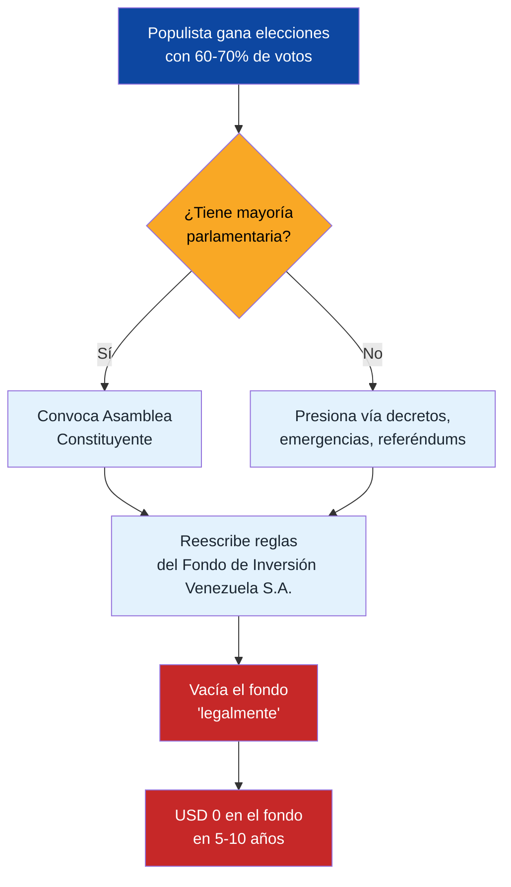
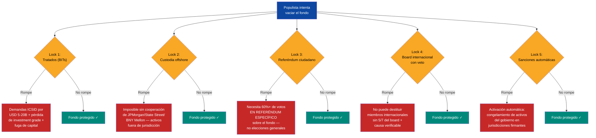

# Fondo de Inversión Venezuela S.A.: El Modelo Noruega

:::tip ¿Qué es un fondo de inversión nacional?
Cada vez que se vende petróleo, una parte va a un fondo que se **invierte en empresas de todo el mundo** — acciones, bonos, bienes raíces. La inversión genera ganancias. Las ganancias se reparten como **dividendo** a cada venezolano. Noruega lleva 30 años con uno así — hoy tiene **USD 2,2 billones**. Venezuela tiene más petróleo y más gente. **No lo administra el gobierno** sino [Venezuela S.A.](/glosario#venezuela-sa), con candados legales para que ningún presidente lo vacíe.
:::

:::danger Distinción clave: El Fondo de Inversión Venezuela S.A. NO es del Estado
El Fondo de Inversión Venezuela S.A. es administrado por **Venezuela S.A.** — el holding corporativo de los 40 millones de ciudadanos-accionistas. El Estado NO administra el fondo, NO cobra regalías, NO opera empresas. Venezuela S.A. cobra regalías de concesiones y JVs, alimenta el fondo, y distribuye dividendos. El Estado solo financia y supervisa sus 5 funciones (gobierno, salud, justicia, educación, seguridad).
:::

El fondo noruego: [USD 2,2 T a fines de 2025](https://www.nbim.no/en/investments/the-funds-value/), [USD 247.000 M de beneficio en 2025](https://www.cnbc.com/2026/01/29/norway-sovereign-wealth-fund-2025-return-nbim-trillion-oil-stocks-tech-ai-banks-silver.html), 7.200+ empresas, 1,5% de todas las acciones globales, [25% del presupuesto noruego](https://fortune.com/europe/2025/07/30/how-sparsely-populated-norway-amassed-1-8-trillion-sovereign-wealth-fund/).

## Las 5 Reglas Constitucionales

1. **Límite de gasto 3–4%** — Modificar requiere 2/3 parlamento + referéndum
2. **Inversión 100% externa** — Previene enfermedad holandesa
3. **Transparencia total** — Portafolio publicado como [NBIM](https://www.nbim.no/en/investments/)
4. **Consejo independiente** — 7 miembros (2 parlamento, 2 ciudadanos, 2 internacionales, 1 independiente)
5. **Dividendo ciudadano obligatorio** — Mínimo 10% de retornos anuales del fondo, distribuido per cápita

## Proyección a 15 Años (USD 60/barril)

| Fase | Producción | Aporte Anual | Valor Acumulado |
|------|-----------|-------------|----------------|
| Años 1–3 | 1,1–1,4 M bpd | USD 3–5.000 M | USD 8–15.000 M |
| Años 4–7 | 1,5–2,0 M bpd | USD 5–8.000 M | USD 35–55.000 M |
| Años 8–10 | 2,0–2,5 M bpd | USD 8–12.000 M | USD 70–120.000 M |
| Años 11–15 | 2,5–3,0 M bpd | USD 10–15.000 M | USD 160–220.000 M |

:::info Modelo solo petrolero
Esta proyección incluye **solo aportes del 30% de ingresos netos petroleros** a USD 60/barril. Con Brent a USD 70-80 el fondo alcanza USD 250-470B (ver [El Sueño](/07-ejecucion/el-sueno)). Con aportes adicionales de minería, gas y diversificación, el rango sube aún más.
:::

---

## Gobernanza: Cómo Evitar Otro FONDEN

:::danger La lección más importante
Entre 2005 y 2015, Venezuela desvió **USD 300.000+ M** a través del FONDEN (Fondo de Desarrollo Nacional) sin rendición de cuentas, sin auditorías públicas, sin oversight parlamentario ([Transparencia Venezuela](https://transparenciave.org/)). **El Fondo de Inversión Venezuela S.A. de este plan será tan bueno como su gobernanza.**
:::

### Estructura del Board

| Miembro | Quién elige | Mandato | Remoción | Restricción |
|---------|------------|---------|----------|-------------|
| 2 técnicos internacionales | Panel de [NBIM](https://www.nbim.no/) + [GIC](https://www.gic.com.sg/) + [Banco Mundial](https://www.worldbank.org/) | 6 años, no renovable | 2/3 del board + causa justificada | Sin nacionalidad venezolana requerida |
| 2 representantes parlamentarios | Parlamento (1 oficialismo + 1 oposición) | 4 años, 1 renovación | Parlamento por 2/3 | No pueden ser ministros activos |
| 2 representantes ciudadanos | Sorteo cívico de pool precalificado (profesionales financieros) | 3 años, no renovable | 2/3 del board + causa justificada | Selección aleatoria elimina captura |
| 1 presidente independiente | Nominado por los 6 anteriores, ratificado por Parlamento | 5 años, 1 renovación | 2/3 del board + 2/3 Parlamento | No puede haber sido funcionario público en últimos 10 años |

**Referencia:** [NBIM](https://www.nbim.no/en/organisation/about-norges-bank-investment-management/) tiene 9 miembros del board, todos independientes. [GIC](https://www.gic.com.sg/governance/) separa board de gobierno aunque el PM es chairman (criticado). La propuesta venezolana elimina este conflicto.

### Stack de Oversight (6 capas)

### Mecanismos Anti-Captura

| Mecanismo | Cómo funciona | Precedente |
|-----------|--------------|-----------|
| **Inversión 100% externa** | El fondo no invierte en Venezuela — evita presión política para financiar proyectos domésticos | [NBIM](https://www.nbim.no/en/the-fund/about-the-fund/): 100% activos fuera de Noruega |
| **Regla de gasto 3-4%** | Solo se puede gastar el retorno real promedio de 15 años, no el principal | Noruega: 3% del valor del fondo/año |
| **Mandatos escalonados** | Los 7 miembros nunca se renuevan al mismo tiempo — ningún gobierno nombra mayoría | [Reserva Federal](https://www.federalreserve.gov/): mandatos de 14 años escalonados |
| **Bloqueo constitucional** | Modificar reglas del fondo requiere 2/3 de Parlamento + referéndum popular | Alaska: [Permanent Fund](https://apfc.org/) protegido constitucionalmente |
| **Prohibición de préstamos al gobierno** | El fondo no puede prestar al Estado ni garantizar deuda pública. Venezuela S.A. emite deuda corporativa propia, respaldada por flujo de concesiones — no deuda soberana | Anti-FONDEN: FONDEN prestó USD 170B+ al gobierno sin retorno |
| **Auditoría cruzada** | Auditor externo reporta al Parlamento, no al board — evita colusión | [Santiago Principles](https://www.ifswf.org/santiago-principles), Principio 16 |

### Tabla Comparativa de Gobernanza

| Dimensión | FONDEN (Venezuela) | [NBIM](https://www.nbim.no/) (Noruega) | [GIC](https://www.gic.com.sg/) (Singapur) | [ADIA](https://www.adia.ae/) (Abu Dhabi) | **Venezuela S.A.** |
|-----------|-------|------|-----|------|--------------|
| Transparencia | Cero | Total | Parcial | Parcial | Total + dashboard |
| Board independiente | Nombrado por presidente | Independiente | PM es chairman | Familia real | Mixto + sorteo cívico |
| Auditoría externa | Sin auditoría | Anual | Anual | Anual | Trimestral + rotación |
| Regla de gasto | Sin límite | 3%/año | Implícita | Implícita | 3-4% constitucional |
| Inversión doméstica | 100% doméstica | 100% externa | Mixta | Mixta | 100% externa |
| Protección legal | Decreto presidencial | Ley del parlamento | Ley ordinaria | Decreto real | Constitucional + referéndum |
| [Linaburg-Maduell Score](https://www.swfinstitute.org/research/linaburg-maduell-transparency-index) | 1/10 | 10/10 | 6/10 | 6/10 | **Meta: 10/10** |

### Locks Constitucionales: Escenarios de Estrés

| Escenario | Riesgo | Protección |
|-----------|--------|-----------|
| **Populista gana elecciones** | Quiere gastar el fondo en programas sociales | Regla de gasto 3-4% requiere referéndum para cambiar; board independiente ejecuta mandato, no órdenes del ejecutivo |
| **Constituyente** | Nueva constitución elimina el fondo | El fondo está custodiado en jurisdicción extranjera (Noruega/Singapur); cambiar custodio requiere 2/3 board + auditor + parlamento |
| **Emergencia nacional** | Terremoto, pandemia, colapso petrolero | Cláusula de emergencia permite gastar hasta 10% del fondo con aprobación de 2/3 parlamento + board + ratificación ciudadana en 90 días |
| **Presión militar** | FANB exige recursos del fondo | Fondo custodiado offshore; ningún actor doméstico puede ordenar transferencias; requiere múltiples firmas internacionales |
| **Hiperinflación** | Gobierno intenta monetizar el fondo | Fondo denominado en USD/EUR/activos reales; prohibición de préstamos al banco central |

### Mandato de Inversión

| Categoría | Asignación | Benchmark |
|-----------|-----------|-----------|
| Renta fija global | 30% | Bloomberg Global Aggregate |
| Renta variable global | 50% | MSCI ACWI |
| Bienes raíces | 10% | FTSE EPRA Nareit Global |
| Infraestructura (fuera de Venezuela) | 5% | Cambridge Associates Infrastructure |
| Efectivo/Liquidez | 5% | SOFR + 50bps |

**Prohibiciones expresas:**
- Inversión en Venezuela (evita conflicto de interés y presión política)
- Armas controversiales, tabaco (alineado con [NBIM exclusions](https://www.nbim.no/en/responsible-investment/exclusion-of-companies/))
- Préstamos a gobierno venezolano o entidades públicas
- Derivados apalancados o inversiones especulativas

**Fuentes:** [Santiago Principles (IFSWF)](https://www.ifswf.org/santiago-principles) | [NBIM Mandate](https://www.nbim.no/en/organisation/governance-model/management-mandate/) | [Linaburg-Maduell Index (SWFI)](https://www.swfinstitute.org/research/linaburg-maduell-transparency-index)

---

## Locks Supra-Constitucionales: Más Allá de la Constitución

:::danger Las constituciones no protegen fondos soberanos
Argentina violó su propia constitución decenas de veces. Ecuador la reescribió para disolver su fondo petrolero. Bolivia hizo lo mismo con su fondo de hidrocarburos. **Un populista con 70%+ de aprobación puede convocar una constituyente y reescribir cualquier lock constitucional en 6-12 meses.** Si la única protección del fondo es la constitución, el fondo tiene fecha de vencimiento.
:::

### El problema: constituciones son papel

Una constitución es una promesa interna. Un gobierno con suficiente apoyo popular puede:
1. Convocar una Asamblea Constituyente (Venezuela 1999, Ecuador 2008, Bolivia 2009)
2. Reescribir las reglas del Fondo de Inversión Venezuela S.A.
3. Vaciar el fondo "legalmente" bajo la nueva constitución

**FONDEN lo demostró:** fue creado por decreto, sin lock constitucional, sin oversight. Resultado: **USD 300.000+ M desviados** en 10 años ([Transparencia Venezuela](https://transparenciave.org/)). Pero incluso con locks constitucionales, el resultado habría sido el mismo — la constituyente de 1999 ya había demostrado que todo es reescribible.

### La solución: locks que existen fuera de la jurisdicción nacional

La protección real viene de mecanismos que un gobierno no puede cambiar unilateralmente, porque las consecuencias de romperlos son internacionales, automáticas e irreversibles.

| # | Lock | Qué previene | Precedente | Dificultad de romper |
|---|------|-------------|-----------|---------------------|
| 1 | **Tratados bilaterales de inversión (BITs)** | Expropiación del fondo o cambio de reglas para inversores | [Colombia-EE.UU. BIT (2012)](https://investmentpolicy.unctad.org/): protege contra expropiación sin compensación | **Alta** — romper activa demandas ICSID, pérdida de investment grade, fuga de capital |
| 2 | **Custodia offshore irrevocable** | Acceso físico a los activos sin múltiples firmas internacionales | [NBIM](https://www.nbim.no/en/the-fund/about-the-fund/): 100% de activos fuera de Noruega; gobierno noruego no puede ordenar transferencias directas | **Muy alta** — los activos están físicamente fuera del país; requiere cooperación de custodios internacionales (JPMorgan, State Street, BNY Mellon) |
| 3 | **Referéndum ciudadano para retiros >1% del fondo** | Vaciamiento gradual "salami" (1% hoy, 2% mañana, fondo vacío en 10 años) | [Alaska Permanent Fund](https://apfc.org/): protección constitucional estatal + dividendo ciudadano; **42 años intacto** desde 1982 | **Alta** — requiere campaña nacional y 60%+ de votos específicamente sobre el fondo |
| 4 | **Miembros internacionales del board con poder de veto** | Captura del board por gobierno populista | [Santiago Principles](https://www.ifswf.org/santiago-principles), Principio 6: separación de gestión y gobierno | **Alta** — no pueden ser despedidos por gobierno nacional; remoción requiere 5/7 del board + causa verificable |
| 5 | **Cláusula sunset de 25 años** | Cambios prematuros de reglas por gobiernos nuevos | Modelo de concesiones de infraestructura a largo plazo; [Chile AFP (1981)](https://www.spensiones.cl/): reformas solo después de 27 años de operación | **Alta** — los locks solo expiran tras 25 años consecutivos de democracia certificada por OEA |
| 6 | **Trigger automático de sanciones** | Violación "creativa" de reglas sin consecuencias | [FMI condicionalidad](https://www.imf.org/en/About/Factsheets/Sheets/2023/IMF-Conditionality): incumplimiento activa suspensión de desembolsos automáticamente | **Muy alta** — predefinido en tratado; activación automática sin necesidad de decisión política |

### Comparación: 3 modelos de protección

| Dimensión | FONDEN (Venezuela) | NBIM (Noruega) | Alaska PFD (EE.UU.) | **Venezuela S.A.** |
|-----------|-------------------|----------------|---------------------|-------------------|
| Locks constitucionales | **Cero** — decreto presidencial | Ley del parlamento | Constitución estatal | Constitucional + referéndum |
| Locks internacionales | **Cero** | Custodia offshore + tratados UE | N/A (jurisdicción estatal) | BITs + custodia offshore + condicionalidad FMI |
| Lock ciudadano | **Cero** | Transparencia + presión pública | **Dividendo directo** — tocar el fondo = perder tu cheque | Referéndum 60%+ + dividendo ciudadano |
| Lock de board | **Cero** — presidente nombra y remueve | Board independiente | Board estatal | Board mixto con veto internacional |
| Resultado | **USD 300.000+ M robados** | **USD 2,2 T intactos** (25+ años) | **USD 80.000+ M intactos** (42+ años) | Meta: multi-lock irreversible |
| Fuente | [Transparencia Venezuela](https://transparenciave.org/) | [NBIM](https://www.nbim.no/) | [Alaska Permanent Fund Corp.](https://apfc.org/) | Diseño propio |

:::tip El dividendo ciudadano es el lock más fuerte
En Alaska, ningún político se atreve a tocar el Permanent Fund porque cada ciudadano recibe un cheque anual (USD 1,312 en 2024, [Alaska PFD](https://pfd.alaska.gov/)). Tocar el fondo = quitarle dinero directamente a cada votante. Es suicidio político. El dividendo del 10% propuesto para Venezuela crea el mismo efecto: **40 millones de guardianes del fondo.**
:::

---

## Compensación: Pagar Top-Tier o Perder el Fondo

:::caution La paradoja del "ahorro" en compensación
Pagar USD 5M/año en salarios para gestionar un fondo de USD 100-200B parece caro. No pagar salarios competitivos y perder 1% de rendimiento anual por mala gestión cuesta **USD 1-2B/año**. FONDEN no tenía estándares de compensación, no tenía accountability, no tenía talento. Resultado: USD 300.000+ M perdidos.
:::

### Por qué pagar USD 1M+ a un CIO

Lee Kuan Yew lo dijo mejor que nadie: *"If you pay peanuts, you get monkeys."* El talento de gestión de fondos soberanos compite con Wall Street, hedge funds y private equity. Si Venezuela ofrece USD 200K cuando GIC ofrece USD 2M, el talento va a GIC — y Venezuela pierde miles de millones en rendimientos subóptimos.

| Rol | Salario de mercado (referencia) | Propuesta Venezuela S.A. | Bonus por rendimiento | Fuente |
|-----|-------------------------------|--------------------------|----------------------|--------|
| **CEO / Director Ejecutivo** | USD 1-3M/año (GIC, Temasek) | **USD 800K-1,5M/año** | +50% si rendimiento >5% real | [Temasek Annual Report 2024](https://www.temasek.com.sg/en/our-financials/annual-report) |
| **CIO (Chief Investment Officer)** | USD 1-5M/año (NBIM CIO: ~USD 1M; hedge funds: USD 5M+) | **USD 500K-1,2M/año** | +100% si rendimiento >benchmark+1% | [NBIM Annual Report 2024](https://www.nbim.no/en/publications/annual-report/) |
| **Board members (part-time)** | USD 100-300K/año (NBIM, GIC) | **USD 100-200K/año** | No — independencia requiere ingreso fijo | [GIC Governance](https://www.gic.com.sg/governance/) |
| **Risk Officer** | USD 500K-1M/año (mercado financiero global) | **USD 400-800K/año** | +30% si zero breaches de mandato | Benchmark mercado financiero |
| **Equipo de inversión (10-15 analistas)** | USD 150-400K/año | **USD 120-300K/año** | Variable por equipo | Benchmark regional ajustado |

**Costo total de compensación: USD 5-8M/año** para gestionar un fondo de **USD 100-200B**.

### ROI de la compensación

| Escenario | Compensación anual | Rendimiento del fondo (USD 150B base) | Valor generado |
|-----------|-------------------|--------------------------------------|----------------|
| Talento mediocre (sin compensación competitiva) | USD 1-2M | 3% (debajo de benchmark) | USD 4.500M |
| Talento competitivo (compensación de mercado) | USD 5-8M | 6% (en benchmark) | USD 9.000M |
| **Diferencia** | **+USD 4-6M** | **+3 puntos porcentuales** | **+USD 4.500M/año** |

**ROI: ~750x.** Cada dólar extra en compensación genera USD 750 en rendimiento adicional.

**Temasek:** con compensación top-tier, ha generado **14% de rendimiento anualizado durante 50 años** ([Temasek, 2024](https://www.temasek.com.sg/en/our-financials/annual-report)). FONDEN con zero estándares generó **cero rendimiento y USD 300.000+ M en pérdidas**.

### Solución política: compensación atada a resultados

El problema político de pagar USD 1M+ a funcionarios en un país con salario mínimo de USD 3.50/mes se resuelve así:

1. **Salario base moderado** (USD 500-800K) — comparable con sector público de países de ingreso medio-alto
2. **Bonus solo si rendimiento supera benchmark** — si el fondo pierde, el equipo gana solo el base
3. **Transparencia total** — compensación publicada en dashboard junto con rendimiento del fondo
4. **Ciudadano como juez** — si el fondo rinde 6% y el equipo gana USD 1.5M, el ciudadano ve que su dividendo es mayor gracias a esa gestión

---

## Anti-Captura Política: El Ciclo de 8-12 Años

:::danger El patrón LATAM: cada 8-12 años un populista rompe las reglas
América Latina produce populistas con mayorías arrolladoras en ciclos predecibles. Argentina: Menem (1989) → Kirchner (2003) → Fernández (2019). Ecuador: Correa (2007) disolvió el fondo petrolero FEIREP. Bolivia: Morales (2006) nacionalizó hidrocarburos y vació el fondo de estabilización. **Si el Fondo de Inversión Venezuela S.A. solo tiene locks constitucionales, será vaciado en el primer ciclo populista.**
:::

### Los 3 casos que demuestran el problema

| País | Fondo | Qué pasó | Lock que falló | Fuente |
|------|-------|---------|---------------|--------|
| **Ecuador** | FEIREP (Fondo de Estabilización Petrolera) | Correa (2007) convocó constituyente, disolvió el fondo, redirigió ingresos petroleros a gasto corriente | Lock constitucional: la constituyente reescribió todo | [Banco Central del Ecuador](https://www.bce.fin.ec/) |
| **Bolivia** | Fondo de estabilización de hidrocarburos | Morales (2006) nacionalizó y redirigió ingresos a bonos sociales directos (Bono Juancito Pinto, Renta Dignidad) | Lock legal: ley ordinaria modificada con mayoría simple | [Banco Central de Bolivia](https://www.bcb.gob.bo/) |
| **Argentina** | Fondo de Garantía de Sustentabilidad (FGS) | Kirchner (2008) nacionalizó AFJPs y absorbió USD 30.000 M del FGS; Fernández usó el fondo para financiar gasto corriente | Lock institucional: el gobierno controló el board de ANSES | [ANSES](https://www.anses.gob.ar/) |

### Por qué las constituciones fallan

### Por qué los locks supra-constitucionales son más difíciles de romper

### La diferencia clave: costo de romper

| Lock | Costo de romper para un populista | Tiempo para romper |
|------|----------------------------------|-------------------|
| Constitución | Bajo — constituyente en 6-12 meses con mayoría | 6-12 meses |
| Ley del parlamento | Muy bajo — mayoría simple | 1-3 meses |
| **Tratado bilateral (BIT)** | **Alto** — demandas ICSID (USD 5-20B), pérdida de FDI, downgrade crediticio | Años de litigio |
| **Custodia offshore** | **Muy alto** — físicamente imposible sin cooperación de custodios internacionales | Imposible unilateralmente |
| **Referéndum ciudadano (60%+)** | **Alto** — debe convencer a 60%+ de votar específicamente por vaciar SU fondo (su dividendo) | 6-12 meses de campaña con resultado incierto |
| **Board internacional con veto** | **Alto** — no puede despedir miembros nombrados por entidades internacionales | Años de batalla legal |
| **Sanciones automáticas** | **Muy alto** — activación instantánea, consecuencias económicas inmediatas | Inmediato |

:::info La estrategia: hacer que romper el fondo cueste más que respetarlo
Un populista hace cálculos políticos. Si romper el fondo cuesta demandas internacionales + fuga de capital + sanciones + perder el dividendo ciudadano, el cálculo es claro: **es más barato respetar las reglas que romperlas.** Eso es lo que Noruega logró por cultura. Venezuela debe lograrlo por diseño.
:::

**Fuentes:** [Santiago Principles (IFSWF)](https://www.ifswf.org/santiago-principles) | [NBIM](https://www.nbim.no/) | [Alaska Permanent Fund Corporation](https://apfc.org/) | [ICSID (World Bank)](https://icsid.worldbank.org/) | [UNCTAD BIT Database](https://investmentpolicy.unctad.org/)
