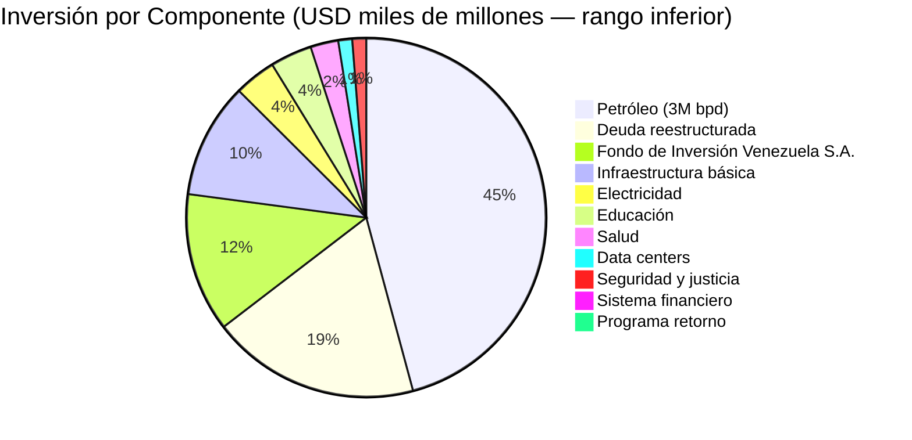
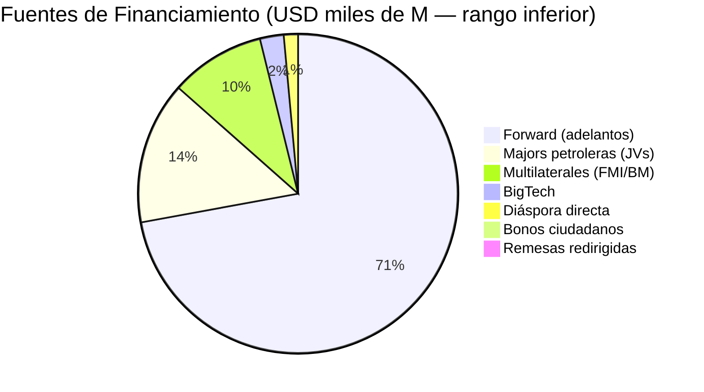
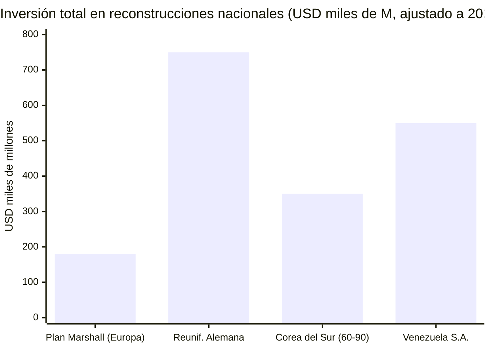
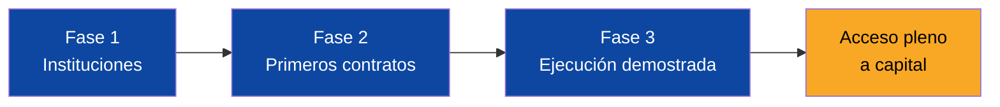

# Inversión Total: USD 550.000–750.000 M en 15 Años

## Distribución de la Inversión

```mermaid
xychart-beta
    title "Inversión por componente (USD miles de M — rango inferior vs. superior)"
    x-axis ["Petróleo", "Deuda", "Fondo Sob.", "Infraestr.", "Electric.", "Educación", "Salud", "Seguridad", "Financiero", "Data Ctr."]
    y-axis "USD miles de millones" 0 --> 200
    bar [183, 75, 50, 41.5, 15, 15, 10, 5, 4, 5]
    bar [183, 85, 100, 81, 25, 25, 20, 8, 10, 10]
```

## Detalle por Componente

| Componente | Inversión | Fuente | Prioridad |
|-----------|-----------|--------|-----------|
| Petróleo (3M bpd) | USD 183.000 M | [Rystad, ene. 2026](https://www.rigzone.com/news/could_venezuela_production_get_back_to_3mm_barrels_per_day-08-jan-2026-182716-article/) | CRÍTICA |
| Deuda | USD 75–85.000 M | [Citigroup](https://www.cnbc.com/2026/01/04/venezuelas-billions-in-distressed-debt-who-is-in-line-to-collect.html) | CRÍTICA |
| Electricidad | USD 15–25.000 M | Est. 18 GW | CRÍTICA |
| Infraestructura básica | USD 41.500–81.000 M | Telecom + agua + vivienda + transporte + agro | CRÍTICA |
| Educación | USD 15–25.000 M | Por nivel | CRÍTICA |
| Salud | USD 10–20.000 M | OMS/OPS | CRÍTICA |
| Seguridad y justicia | USD 5–8.000 M | [Modelo Georgia](https://successfulsocieties.princeton.edu/sites/g/files/toruqf5601/files/Policy_Note_ID126.pdf) | CRÍTICA |
| Sistema financiero | USD 4–10.000 M | Capitalización + plataformas + garantías | ALTA |
| Pensiones (transición) | USD 6–12.000 M/año | Pilar 1 universal + transición | ALTA |
| Data centers | USD 5–10.000 M | [ResearchAndMarkets](https://www.businesswire.com/news/home/20250505397648/en/) | ALTA |
| Programa de retorno | USD 500–1.500 M | Bonos repatriación + plataforma | ALTA |
| Fondo de Inversión Venezuela S.A. inicial | USD 50–100.000 M | Modelo noruego | ESTRATÉGICA |

:::info Nota sobre los rangos
El rango inferior asume ejecución eficiente con participación privada significativa (concesiones, JVs, PPPs). El rango superior asume mayor participación estatal directa. El modelo Venezuela S.A. prioriza el rango inferior mediante concesiones y capital privado.
:::

## Fuentes de Capital

```mermaid
xychart-beta
    title "Fuentes de capital (USD miles de M — rango inferior vs. superior)"
    x-axis ["Forwards", "Majors", "Multilat.", "BigTech", "Diáspora", "Bonos Ciud.", "Remesas"]
    y-axis "USD miles de millones" 0 --> 320
    bar [150, 30, 20, 5, 3, 1.5, 1]
    bar [300, 50, 40, 10, 8, 3, 2]
```

| Fuente | Monto | Mecanismo |
|--------|-------|-----------|
| Forward (adelantos) | USD 150–300.000 M | 20% reservas a USD 60, adelanto 20–25% |
| Majors petroleras | USD 30–50.000 M | JVs (Chevron ya operando) |
| Multilaterales | USD 20–40.000 M | Post-reestructuración FMI |
| Bonos ciudadanos | USD 1.500–3.000 M | 10% de 40M × USD 200 |
| Diáspora directa | USD 3.000–8.000 M | 5% de 8M × USD 2–5K |
| Remesas redirigidas | USD 1–2.000 M/año | Plataforma modelo M-Pesa |
| BigTech | USD 5–10.000 M | AWS, Google, Microsoft |

## Comparación: Venezuela vs. Reconstrucciones Históricas

| Programa | Inversión | Plazo | Resultado |
|----------|-----------|-------|-----------|
| Plan Marshall (Europa) | ~USD 180.000 M (ajustado) | 4 años | Reconstrucción post-guerra |
| Reunificación Alemana | ~USD 750.000 M | 20 años | PIB Este creció 250% |
| Corea del Sur (1960–90) | ~USD 350.000 M | 30 años | De USD 79 a USD 6.500 PIB/cápita |
| **Venezuela S.A.** | **USD 550–750.000 M** | **15 años** | **Meta: PIB/cápita USD 5.000→15.000** |

---

## Señalización Creíble: Resolver el Chicken-and-Egg

> USD 183.000 M en inversión petrolera requieren condiciones que no existen. Esas condiciones requieren inversión para crearse. ¿Quién se mueve primero?

### El Problema

Ninguna major petrolera invierte USD 183.000 M en un país con:
- Default activo desde 2017
- Sanciones de EE.UU. (parcialmente vigentes)
- Sin estado de derecho verificable
- PDVSA colapsada operativamente

Pero las condiciones para levantar sanciones, reestructurar deuda y reformar instituciones requieren capital que no llega sin inversión. Es un **chicken-and-egg clásico** descrito por [Hausmann, Rodrik & Velasco (2005)](https://drodrik.scholar.harvard.edu/publications/growth-diagnostics) en su marco de diagnósticos de crecimiento.

### La Solución: Señalización Secuencial

La clave es **señalización creíble** — acciones verificables que demuestran compromiso antes de pedir dinero. Cada fase desbloquea la siguiente.

| Fase | Señal creíble | Inversión que desbloquea | Monto estimado |
|------|--------------|--------------------------|----------------|
| **1: Instituciones** (Año 0-1) | Dashboard anticorrupción público, reglas fiscales legisladas, nombramiento de equipo negociador de deuda, acuerdo stand-by FMI | Chevron expande operaciones, primeras licencias OFAC | **USD 3.000–5.000 M** |
| **2: Primeros contratos** (Año 1-3) | Primeros forward contracts firmados, JV con 2-3 majors, Citgo estabilizado | Oil majors amplían JVs (TotalEnergies, Shell, Repsol), multilaterales desembolsan | **USD 10.000–20.000 M** |
| **3: Ejecución demostrada** (Año 3-5) | 2 años de cumplimiento fiscal, producción subiendo (1.5M+ bpd), primer desembolso del Fondo de Inversión Venezuela S.A. | Full upstream investment, sector financiero, BigTech data centers | **USD 50.000–100.000 M** |

### Por Qué Funciona

1. **Chevron ya está operando** — [Licencia OFAC #44](https://www.reuters.com/business/energy/chevron-begins-shipping-venezuelan-oil-us-after-license-2022-11-26/) permitió a Chevron reanudar operaciones. Esto demuestra que el mecanismo de "licencia condicionada" funciona.
2. **El costo de la Fase 1 es casi cero** — Legislar reglas fiscales, publicar un dashboard y nombrar asesores no requiere capital. Requiere voluntad política.
3. **Cada fase genera evidencia verificable** — No se pide confianza ciega. Se pide verificación de resultados concretos antes de desbloquear el siguiente tramo.

:::info Precedente: Rwanda post-genocidio
Rwanda aplicó señalización secuencial entre 1994-2010: primero tribunales gacaca (señal de justicia), luego reformas anti-corrupción (señal de gobernanza), luego apertura a inversión (capital). Resultado: [crecimiento promedio de 7,5% anual por 20 años](https://data.worldbank.org/country/rwanda). El mecanismo es el mismo: acción verificable antes de pedir dinero.
:::

**Fuentes:** [Hausmann, Rodrik & Velasco — Growth Diagnostics (2005)](https://drodrik.scholar.harvard.edu/publications/growth-diagnostics) | [Reuters — Chevron OFAC License (2022)](https://www.reuters.com/business/energy/chevron-begins-shipping-venezuelan-oil-us-after-license-2022-11-26/) | [World Bank — Rwanda Data](https://data.worldbank.org/country/rwanda)
