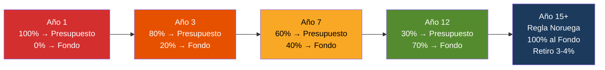
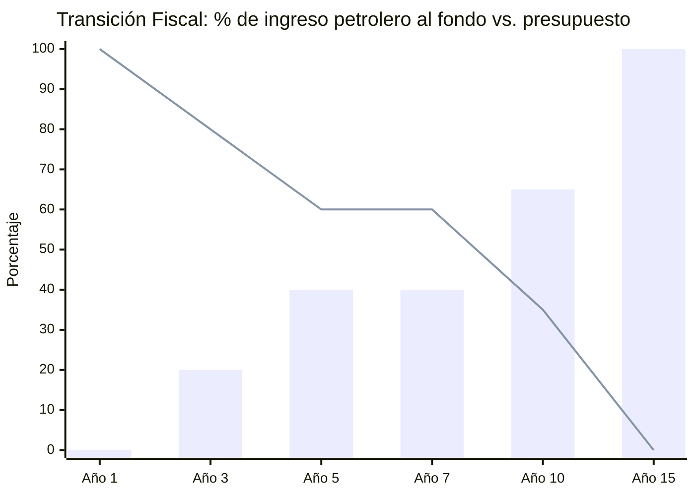
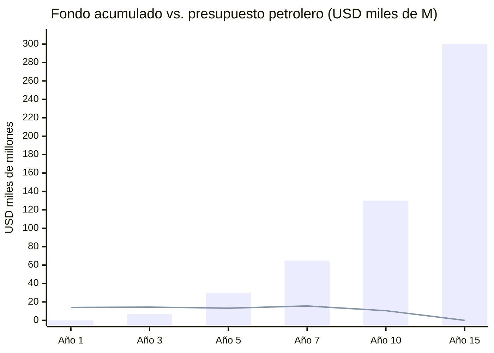

# Transición Fiscal: Del Petroestado al Fondo Soberano

> El petróleo no puede financiar SIMULTÁNEAMENTE el presupuesto de hoy y el fondo del mañana. La transición fiscal es el mecanismo que resuelve esa tensión.

## Dónde Estamos: El Presupuesto Actual

Venezuela aprobó un [presupuesto de USD 22.700 M para 2025](https://invezz.com/news/2024/12/04/venezuela-unveils-ambitious-22-7-billion-2025-budget-amid-deep-oil-revenues-decline/), un 11% más que 2024.

| Indicador | 2024 | 2025 | Fuente |
|-----------|------|------|--------|
| Presupuesto total | USD 20.500 M | USD 22.700 M | [Invezz](https://invezz.com/news/2024/12/04/venezuela-unveils-ambitious-22-7-billion-2025-budget-amid-deep-oil-revenues-decline/) |
| Aporte PDVSA | USD 11.900 M (58%) | USD 10.100 M (53%) | [La República](https://www.larepublica.co/globoeconomia/el-presupuesto-2025-de-venezuela-aumentara-11-y-reducira-los-aportes-petroleros-4013151) |
| Ingresos tributarios | — | USD 5.250 M (28%) | [Orinoco Research](https://www.orinocoresearch.com/news-and-insights/venezuela-presents-budget-for-2025) |
| Gastos corrientes | — | 49,3% del total | Orinoco Research |
| Gasto de capital | — | 42,7% del total | Orinoco Research |
| Deuda/aplicaciones financieras | — | 8% del total | Orinoco Research |
| Gasto público / PIB | ~14,4% | ~27,4% | [Statista](https://www.statista.com/statistics/371925/ratio-of-government-expenditure-to-gross-domestic-product-gdp-in-venezuela/) |
| PDVSA exportaciones totales | USD 17.520 M | — | [OE Digital](https://energynews.oedigital.com/fossil-fuels/2025/07/11/venezuelan-pdvsa-exports-of-hydrocarbons-will-reach-1752-billion-in-2024) |

:::danger El problema central
Hoy, el **100% de los ingresos petroleros** se consume en presupuesto. **0% va al fondo soberano.** Cada bolívar de petróleo se gasta. No se ahorra nada. Esto es exactamente lo que Noruega hacía antes de 1990 — y lo que decidió dejar de hacer.
:::

## El Modelo Noruega: Cómo Funciona la Regla Fiscal

[Noruega](https://www.norskpetroleum.no/en/economy/management-of-revenues/) transfiere el **100% de los ingresos petroleros netos** al fondo soberano. Luego retira solo el [3–4% del valor del fondo](https://www.norskpetroleum.no/en/economy/management-of-revenues/) para financiar el presupuesto. Resultado: el fondo crece con el 96–97% restante + rendimientos.

| Aspecto | Noruega | Venezuela (propuesta) |
|---------|---------|----------------------|
| Ingresos petroleros al fondo | [100%](https://www.norskpetroleum.no/en/economy/management-of-revenues/) | Transición gradual: 0% → 100% |
| Retiro para presupuesto | [3% del valor del fondo](https://www.nbim.no/en/about-us/about-the-fund/) | 3–4% del fondo (meta año 10+) |
| % del presupuesto financiado por fondo | [~20%](https://fortune.com/europe/2025/07/30/how-sparsely-populated-norway-amassed-1-8-trillion-sovereign-wealth-fund/) | Meta: 15–25% al año 15 |
| Fuentes alternas de ingreso | Impuestos (80% del presupuesto) | Impuestos + diversificación |

**La clave:** Noruega puede enviar 100% al fondo porque el 80% de su presupuesto viene de impuestos no-petroleros. Venezuela hoy depende del petróleo para el 53–58% del presupuesto. **La transición fiscal ES la prioridad estratégica.**

---

## El Plan de Transición: 15 Años en 4 Fases

### Lógica: A medida que crecen los ingresos petroleros (más producción), se REDUCE el % que va al presupuesto y se AUMENTA el % que va al fondo.



### Tabla de Transición Fiscal (Base USD 60/barril)

| Fase | Años | Producción | Ingreso Petrolero Bruto | % al Presupuesto | Al Presupuesto | % al Fondo | Al Fondo | Presupuesto Petrolero vs. Hoy |
|------|------|-----------|------------------------|-------------------|----------------|------------|----------|-------------------------------|
| **0: Emergencia** | 1 | 1,1 M bpd | ~USD 14.000 M | **100%** | USD 14.000 M | 0% | USD 0 | +40% vs. 2025 ($10.1B) |
| **1: Estabilización** | 2–3 | 1,1–1,4 M bpd | USD 14–18.000 M | **80%** | USD 11–14.000 M | **20%** | USD 3–4.000 M | Similar a 2025 |
| **2: Aceleración** | 4–7 | 1,5–2,0 M bpd | USD 18–26.000 M | **60%** | USD 11–16.000 M | **40%** | USD 7–10.000 M | +10–60% vs. 2025 |
| **3: Diversificación** | 8–12 | 2,0–2,5 M bpd | USD 26–33.000 M | **35%** | USD 9–12.000 M | **65%** | USD 17–21.000 M | Similar, pero PIB 3x |
| **4: Regla Noruega** | 13–15+ | 2,5–3,0 M bpd | USD 33–40.000 M | **0% directo** | Retiro 3–4% del fondo | **100%** | USD 33–40.000 M | Financiado por impuestos + fondo |

### Cálculo explícito — Ejemplo Fase 2, Año 5

```
Producción:           1,75 M bpd
Ingreso bruto:        1.750.000 × 365 × $60 = USD 38.325 M
Costo operativo:      1.750.000 × 365 × $37,50 = USD 23.953 M
Ingreso neto:         USD 14.372 M
Al presupuesto (60%): USD 8.623 M
Al fondo (40%):       USD 5.749 M

Presupuesto petrolero 2025: USD 10.100 M
Presupuesto petrolero Año 5: USD 8.623 M
Diferencia: -USD 1.477 M → cubierta por CRECIMIENTO de ingresos tributarios
```

:::info La magia de la transición
El **monto absoluto** que va al presupuesto NO baja — se mantiene o sube. Lo que baja es el **porcentaje**. Porque la producción CRECE, se puede dar más al fondo SIN quitarle al presupuesto. Al año 5, el presupuesto recibe USD 8.600 M (similar a hoy) pero el fondo ya recibe USD 5.700 M que antes se gastaban.
:::

---

## La Otra Pata: Crecer los Ingresos No-Petroleros

La transición fiscal NO funciona si el presupuesto sigue dependiendo del petróleo para el 53%. Hay que construir la base tributaria:

| Fuente | Hoy | Meta Año 7 | Meta Año 15 | Mecanismo |
|--------|-----|-----------|------------|-----------|
| Ingresos tributarios | USD 5.250 M (28%) | USD 12.000 M (40%) | USD 25.000 M (50%) | Formalización + ZEET + digitalización fiscal |
| Ingresos petroleros al presupuesto | USD 10.100 M (53%) | USD 12.000 M (40%) | USD 5.000 M* (10%) | *vía retiro 3-4% del fondo |
| Otros ingresos (dividendos, turismo, gas) | USD 2.000 M (10%) | USD 5.000 M (15%) | USD 15.000 M (30%) | Diversificación |
| Remesas/contribuciones diáspora | ~USD 500 M (3%) | USD 1.500 M (5%) | USD 5.000 M (10%) | Plataforma M-Pesa |
| **Total presupuesto** | **USD 22.700 M** | **~USD 30.000 M** | **~USD 50.000 M** | — |
| **% petrolero directo** | **53%** | **40%** | **10%** | — |

### Comparación con modelo Milei (Argentina)

[Milei logró superávit fiscal](https://www.focus-economics.com/blog/argentina-economy-under-milei/) recortando gasto. Venezuela S.A. propone lo contrario: **no recortar gasto, sino CRECER ingresos** para que el porcentaje petrolero baje naturalmente. Razón: Venezuela ya tiene 82,8% de pobreza — no hay margen para austeridad al estilo argentino (ver [Investigación Milei](/research/milei-argentina-2024-2026)).

---

## Regla Constitucional de Transición

Para que ningún gobierno futuro revierta la transición:

| Regla | Detalle | Modelo |
|-------|---------|--------|
| **Techo de gasto petrolero directo** | Máximo % del ingreso petrolero que va al presupuesto, decreciente por ley | [Chile: regla fiscal estructural](https://www.worldbank.org/en/topic/fiscal-policy) |
| **Piso de ahorro** | Mínimo % al fondo soberano, creciente por ley | Noruega: regla del 3% |
| **Candado constitucional** | Modificar requiere 2/3 del parlamento + referéndum | Chile: supermayoría |
| **Fondo de estabilización** | Reserva de 6–12 meses de gasto para crisis de precio | [Chile: FEES](https://www.hacienda.cl) |

### Cronograma de blindaje

| Año | Regla fiscal | % máximo al presupuesto | % mínimo al fondo |
|-----|-------------|------------------------|-------------------|
| 1 | Decreto ejecutivo | 100% (emergencia) | 0% |
| 2 | Ley ordinaria | 85% | 15% |
| 3 | Ley orgánica | 75% | 25% |
| 5 | Constitucional (2/3 + referéndum) | 60% | 40% |
| 7 | Constitucional blindado | 45% | 55% |
| 10 | Automático | 30% | 70% |
| 15 | **Regla Noruega activa** | **Retiro 3–4% del fondo** | **100%** |

---

## Qué Pasa Si El Petróleo Baja

| Escenario | Impacto en transición | Acción |
|-----------|----------------------|--------|
| Brent > USD 70 | Transición se ACELERA — más al fondo | Fase 4 se adelanta |
| Brent USD 50–60 | Transición sigue en calendario base | Normal |
| Brent USD 40–50 | Se pausa la transición — % al fondo se congela | Se activa fondo de estabilización |
| Brent < USD 40 | Emergencia — se puede retirar del fondo (máx. 5%) | Techo de retiro constitucional |

:::caution La tentación política
El riesgo #1 es que un gobierno futuro diga "la emergencia justifica gastar el fondo". Por eso las reglas son CONSTITUCIONALES (2/3 + referéndum). El modelo Alaska funciona desde 1982 porque ningún político se atreve a tocar el dividendo de 700.000 personas. Con 40 millones de accionistas, el fondo es intocable.
:::

## Resumen Visual





| Año | Ingreso petrolero | → Presupuesto | → Fondo | Fondo acumulado |
|-----|-------------------|---------------|---------|-----------------|
| 1 | USD 14.000 M | USD 14.000 M | USD 0 | USD 0 |
| 3 | USD 18.000 M | USD 14.400 M | USD 3.600 M | USD 7.000 M |
| 5 | USD 22.000 M | USD 13.200 M | USD 8.800 M | USD 30.000 M |
| 7 | USD 26.000 M | USD 15.600 M | USD 10.400 M | USD 65.000 M |
| 10 | USD 30.000 M | USD 10.500 M | USD 19.500 M | USD 130.000 M |
| 15 | USD 38.000 M | Retiro 3–4% fondo | USD 38.000 M | USD 300.000+ M |

**Año 15, el fondo genera ~USD 12.000–15.000 M/año en rendimientos (4–5%). Eso cubre el 25–30% del presupuesto SIN TOCAR el petróleo. El petróleo se acumula. El fondo crece. Los dividendos fluyen.**
