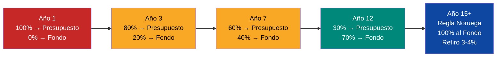
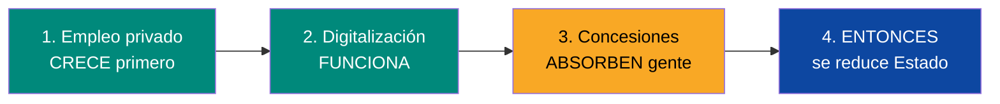
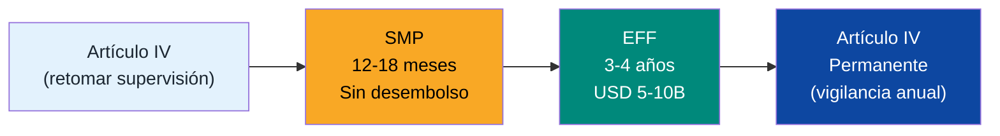
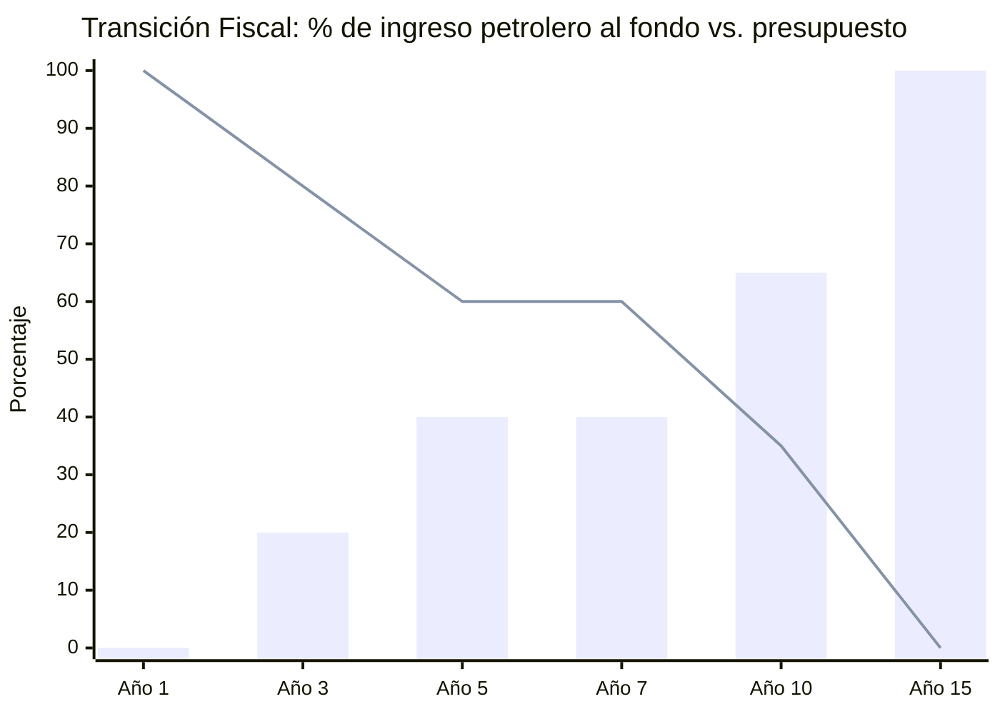
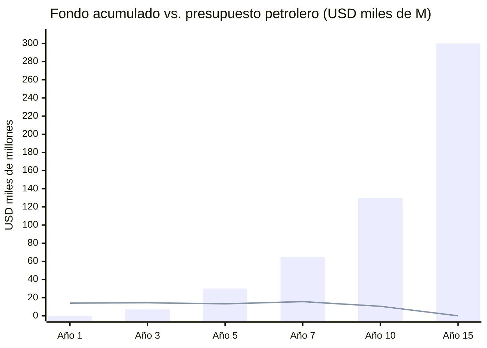

# Transición Fiscal: Del Petroestado al Fondo de Inversión Venezuela S.A.

:::tip ¿Qué es la transición fiscal? — En palabras simples
Hoy el gobierno de Venezuela paga casi todo con dinero del petróleo. Si el petróleo baja, no hay dinero para hospitales, escuelas, policía — nada. Eso es un **petroestado**: un país adicto a un solo ingreso.

La transición fiscal es el plan para **dejar de depender del petróleo.** ¿Cómo? El gobierno aprende a vivir de **impuestos** (lo que pagan los ciudadanos y empresas), no del petróleo. Y todo el dinero del petróleo va a la alcancía del país ([Fondo de Inversión Venezuela S.A.](/glosario#fondo-de-inversión-venezuela-sa)) — no al gasto del gobierno.

Al final: el gobierno se financia con impuestos. El petróleo va al fondo. El fondo genera dividendos para todos. Si un día el petróleo vale cero, el gobierno sigue funcionando y el fondo sigue creciendo. **Eso es independencia fiscal.**
:::

:::caution Fechas ilustrativas — las fases se activan por KPIs, no por calendario
Las referencias a "Año X" en este documento son **ilustrativas**. Las fases reales se activan por condiciones verificables (PIB/cápita, formalización, pobreza). Ver [KPIs de Activación](/07-ejecucion/kpis-activacion).
:::

> El petróleo no puede financiar SIMULTÁNEAMENTE el presupuesto de hoy y el fondo del mañana. La transición fiscal es el mecanismo que resuelve esa tensión.

## Dónde Estamos: El Presupuesto Actual

Venezuela aprobó un [presupuesto de USD 22.700 M para 2025](https://invezz.com/news/2024/12/04/venezuela-unveils-ambitious-22-7-billion-2025-budget-amid-deep-oil-revenues-decline/), un 11% más que 2024.

| Indicador | 2024 | 2025 | Fuente |
|-----------|------|------|--------|
| Presupuesto total | USD 20.500 M | USD 22.700 M | [Invezz](https://invezz.com/news/2024/12/04/venezuela-unveils-ambitious-22-7-billion-2025-budget-amid-deep-oil-revenues-decline/) |
| Aporte PDVSA | USD 11.900 M (58%) | USD 10.100 M (53%) | [La República](https://www.larepublica.co/globoeconomia/el-presupuesto-2025-de-venezuela-aumentara-11-y-reducira-los-aportes-petroleros-4013151) |
| Ingresos tributarios | — | USD 5.250 M (28%) | [Orinoco Research](https://www.orinocoresearch.com/news-and-insights/venezuela-presents-budget-for-2025) |
| Gastos corrientes | — | 49,3% del total | Orinoco Research |
| Gasto de capital | — | 42,7% del total | Orinoco Research |
| Deuda/aplicaciones financieras | — | 8% del total | Orinoco Research |
| Gasto público / PIB | ~14,4% | ~27,4% | [Statista](https://www.statista.com/statistics/371925/ratio-of-government-expenditure-to-gross-domestic-product-gdp-in-venezuela/) |
| PDVSA exportaciones totales | USD 17.520 M | — | [OE Digital](https://energynews.oedigital.com/fossil-fuels/2025/07/11/venezuelan-pdvsa-exports-of-hydrocarbons-will-reach-1752-billion-in-2024) |

:::danger El problema central
Hoy, el **100% de los ingresos petroleros** se consume en presupuesto. **0% va al Fondo de Inversión Venezuela S.A..** Cada bolívar de petróleo se gasta. No se ahorra nada. Esto es exactamente lo que Noruega hacía antes de 1990 — y lo que decidió dejar de hacer.
:::

## El Modelo Noruega: Cómo Funciona la Regla Fiscal

[Noruega](https://www.norskpetroleum.no/en/economy/management-of-revenues/) transfiere el **100% de los ingresos petroleros netos** al Fondo de Inversión Venezuela S.A.. Luego retira solo el [3–4% del valor del fondo](https://www.norskpetroleum.no/en/economy/management-of-revenues/) para financiar el presupuesto. Resultado: el fondo crece con el 96–97% restante + rendimientos.

| Aspecto | Noruega | Venezuela (propuesta) |
|---------|---------|----------------------|
| Ingresos petroleros al fondo | [100%](https://www.norskpetroleum.no/en/economy/management-of-revenues/) | Transición gradual: 0% → 100% |
| Retiro para presupuesto | [3% del valor del fondo](https://www.nbim.no/en/about-us/about-the-fund/) | 3–4% del fondo (meta año 10+) |
| % del presupuesto financiado por fondo | [~20%](https://fortune.com/europe/2025/07/30/how-sparsely-populated-norway-amassed-1-8-trillion-sovereign-wealth-fund/) | Meta: 15–25% al año 15 |
| Fuentes alternas de ingreso | Impuestos (80% del presupuesto) | Impuestos + diversificación |

**La clave:** Noruega puede enviar 100% al fondo porque el 80% de su presupuesto viene de impuestos no-petroleros. Venezuela hoy depende del petróleo para el 53–58% del presupuesto. **La transición fiscal ES la prioridad estratégica.**

---

## El Plan de Transición: 15 Años en 4 Fases

### Lógica: A medida que crecen los ingresos petroleros (más producción), se REDUCE el % que va al presupuesto y se AUMENTA el % que va al fondo.



### Tabla de Transición Fiscal (Base USD 60/barril)

| Fase | Años | Producción | Ingreso Petrolero Bruto | % al Presupuesto | Al Presupuesto | % al Fondo | Al Fondo | Presupuesto Petrolero vs. Hoy |
|------|------|-----------|------------------------|-------------------|----------------|------------|----------|-------------------------------|
| **0: Emergencia** | 1 | 1,1 M bpd | ~USD 14.000 M | **100%** | USD 14.000 M | 0% | USD 0 | +40% vs. 2025 ($10.1B) |
| **1: Estabilización** | 2–3 | 1,1–1,4 M bpd | USD 14–18.000 M | **80%** | USD 11–14.000 M | **20%** | USD 3–4.000 M | Similar a 2025 |
| **2: Aceleración** | 4–7 | 1,5–2,0 M bpd | USD 18–26.000 M | **60%** | USD 11–16.000 M | **40%** | USD 7–10.000 M | +10–60% vs. 2025 |
| **3: Diversificación** | 8–12 | 2,0–2,5 M bpd | USD 26–33.000 M | **35%** | USD 9–12.000 M | **65%** | USD 17–21.000 M | Similar, pero PIB 3x |
| **4: Regla Noruega** | 13–15+ | 2,5–3,0 M bpd | USD 33–40.000 M | **0% directo** | Retiro 3–4% del fondo | **100%** | USD 33–40.000 M | Financiado por impuestos + fondo |

### Cálculo explícito — Ejemplo Fase 2, Año 5

```
Producción:           1,75 M bpd
Ingreso bruto:        1.750.000 × 365 × $60 = USD 38.325 M
Costo operativo:      1.750.000 × 365 × $37,50 = USD 23.953 M
Ingreso neto:         USD 14.372 M
Al presupuesto (60%): USD 8.623 M
Al fondo (40%):       USD 5.749 M

Presupuesto petrolero 2025: USD 10.100 M
Presupuesto petrolero Año 5: USD 8.623 M
Diferencia: -USD 1.477 M → cubierta por CRECIMIENTO de ingresos tributarios
```

:::info La magia de la transición
El **monto absoluto** que va al presupuesto NO baja — se mantiene o sube. Lo que baja es el **porcentaje**. Porque la producción CRECE, se puede dar más al fondo SIN quitarle al presupuesto. Al año 5, el presupuesto recibe USD 8.600 M (similar a hoy) pero el fondo ya recibe USD 5.700 M que antes se gastaban.
:::

---

## La Otra Pata: Crecer los Ingresos No-Petroleros

La transición fiscal NO funciona si el presupuesto sigue dependiendo del petróleo para el 53%. Hay que construir la base tributaria:

| Fuente | Hoy | Meta Año 7 | Meta Año 15 | Mecanismo |
|--------|-----|-----------|------------|-----------|
| Ingresos tributarios | USD 5.250 M (28%) | USD 12.000 M (40%) | USD 25.000 M (50%) | Formalización + ZEET + digitalización fiscal |
| Ingresos petroleros al presupuesto | USD 10.100 M (53%) | USD 12.000 M (40%) | USD 5.000 M* (10%) | *vía retiro 3-4% del fondo |
| Otros ingresos (dividendos, turismo, gas) | USD 2.000 M (10%) | USD 5.000 M (15%) | USD 15.000 M (30%) | Diversificación |
| Remesas/contribuciones diáspora | ~USD 500 M (3%) | USD 1.500 M (5%) | USD 5.000 M (10%) | Plataforma M-Pesa |
| **Impuestos selectivos (excise)** | **~USD 0** | **USD 1.000–2.000 M (3–5%)** | **USD 2.500–4.000 M (5–7%)** | Alcohol, tabaco, combustibles, carbono (ver nota abajo) |
| **Total presupuesto** | **USD 22.700 M** | **~USD 31.000–32.000 M** | **~USD 52.500–54.000 M** | — |
| **% petrolero directo** | **53%** | **37–39%** | **9–10%** | — |

:::tip Impuestos selectivos (excise taxes) — recomendación estándar FMI
Los **excise taxes** sobre alcohol, tabaco, combustibles y emisiones de carbono son una recomendación recurrente del FMI para economías en transición. Generan **1-2% del PIB** con baja distorsión económica y beneficios colaterales en salud pública y medio ambiente.

| Excise tax | Base imponible | Recaudación estimada (año 7) | Referencia |
|------------|---------------|------------------------------|------------|
| Tabaco | ~4M fumadores, impuesto USD 0,50-1,00/cajetilla | USD 300-500 M | [OMS: WHO Framework Convention](https://fctc.who.int/) — recomienda impuestos >75% del precio retail |
| Alcohol | Impuesto ad valorem 20-30% sobre bebidas alcohólicas | USD 200-400 M | [OECD Tax Policy](https://www.oecd.org/tax/tax-policy/) |
| Combustibles | Impuesto de USD 0,10-0,20/litro (gasolina y diésel) | USD 400-800 M | Subsidio actual es negativo — cualquier impuesto es ganancia neta |
| Carbono | USD 5-10/ton CO₂ (fase inicial, sube gradualmente) | USD 200-400 M | [Banco Mundial: Carbon Pricing Dashboard](https://carbonpricingdashboard.worldbank.org/) — 73 jurisdicciones ya lo aplican |

Estos impuestos cierran la **brecha fiscal de los años 3-7** — el período donde los ingresos tributarios crecen pero todavía no compensan la reducción del aporte petrolero al presupuesto. Son fáciles de administrar (se cobran en origen, no al consumidor final) y políticamente viables porque gravan externalidades negativas, no trabajo ni inversión.
:::

### Comparación con modelo Milei (Argentina): Esto NO es shock

:::danger Esto NO es un recorte tipo Milei
Venezuela S.A. reduce el Estado un 90% en 10 años. Milei recortó 30% en 1 año. Parecen lo mismo — **no lo son.** La diferencia es secuencia, condiciones y red de protección.
:::

| Dimensión | Milei (Argentina 2024) | Venezuela S.A. |
|-----------|----------------------|----------------|
| **Velocidad** | 30% de recorte en 12 meses | 90% de reducción en 10 años, atada a KPIs |
| **Condición previa** | Ninguna — shock inmediato | Empleo privado creciendo + digitalización funcionando + concesiones activas |
| **Empleados desplazados** | A la calle, busquen trabajo | [3 opciones](/04-gobernanza/modelo-estado#qué-pasa-con-la-gente): jubilación anticipada, reconversión laboral, emprendimiento con capital semilla |
| **Gasto social** | Recorta transferencias a pobres | **Aumenta** cobertura vía FCV (salud + educación universal desde Día 1) |
| **Costo social** | [Pobreza subió de 40% a 53%](https://www.indec.gob.ar/) en 6 meses | Pobreza debe **bajar** como KPI de activación: si sube, la reforma se pausa |
| **Superávit** | Logrado en meses por austeridad extrema | Logrado en años por crecimiento de ingresos tributarios + petroleros |
| **Contexto** | Argentina: PIB/cápita ~USD 13.000, clase media existente | Venezuela: PIB/cápita USD 2.588, **82,8% pobreza** — cero margen para shock |
| **Modelo de referencia** | Shock liberal clásico (Thatcher, FMI años 90) | [Georgia 2004](https://www.worldbank.org/en/country/georgia) (Saakashvili) + [Singapur 1965](https://eresources.nlb.gov.sg/) (Lee Kuan Yew) |

**La secuencia importa más que la velocidad:**



> **Agresivo pero no suicida. Secuenciado, no shock.** No se cierra un ministerio hasta que el sector privado YA esté absorbiendo a esos funcionarios. No se corta un servicio hasta que la concesión YA esté operando. Milei corta primero y espera que el mercado resuelva. Venezuela S.A. construye primero y corta después.

**¿Por qué no Milei?** Porque Argentina tiene clase media, instituciones imperfectas pero funcionales, y un sector privado diversificado que puede absorber. Venezuela tiene 82,8% de pobreza, cero instituciones y un sector privado destruido. Hacer shock aquí es empujar a millones al hambre. Georgia y Singapur enfrentaron situaciones similares de colapso y reconstruyeron con reformas radicales pero secuenciadas — y funcionó.

Fuentes: [FocusEconomics — Argentina under Milei](https://www.focus-economics.com/blog/argentina-economy-under-milei/); [INDEC pobreza](https://www.indec.gob.ar/); [World Bank — Georgia reforms](https://www.worldbank.org/en/country/georgia); [Investigación Milei](/research/milei-argentina-2024-2026)

---

## Regla Constitucional de Transición

Para que ningún gobierno futuro revierta la transición:

| Regla | Detalle | Modelo |
|-------|---------|--------|
| **Techo de gasto petrolero directo** | Máximo % del ingreso petrolero que va al presupuesto, decreciente por ley | [Chile: regla fiscal estructural](https://www.worldbank.org/en/topic/fiscal-policy) |
| **Piso de ahorro** | Mínimo % al Fondo de Inversión Venezuela S.A., creciente por ley | Noruega: regla del 3% |
| **Candado constitucional** | Modificar requiere 2/3 del parlamento + referéndum | Chile: supermayoría |
| **Fondo de estabilización** | Reserva de 6–12 meses de gasto para crisis de precio | [Chile: FEES](https://www.hacienda.cl) |

### Cronograma de blindaje

| Año | Regla fiscal | % máximo al presupuesto | % mínimo al fondo |
|-----|-------------|------------------------|-------------------|
| 1 | Decreto ejecutivo | 100% (emergencia) | 0% |
| 2 | Ley ordinaria | 85% | 15% |
| 3 | Ley orgánica | 75% | 25% |
| 5 | Constitucional (2/3 + referéndum) | 60% | 40% |
| 7 | Constitucional blindado | 45% | 55% |
| 10 | Automático | 30% | 70% |
| 15 | **Regla Noruega activa** | **Retiro 3–4% del fondo** | **100%** |

---

## Secuencia FMI: Del Documento al Programa

:::danger Sin el FMI, no hay acceso a nada
Sin el sello del FMI, Venezuela no puede acceder al Banco Mundial, al BID, al Club de París ni a los mercados internacionales de deuda. El FMI es la **puerta de entrada** al sistema financiero multilateral. Venezuela no ha tenido una consulta del [Artículo IV](https://www.imf.org/en/About/Factsheets/Sheets/2023/Article-IV-Consultations) desde **~2004** — más de 20 años sin supervisión formal.
:::

### La ruta: SMP → EFF → Artículo IV permanente

No se entra al FMI pidiendo dinero. Se entra demostrando disciplina. La secuencia es:



| Etapa | Duración | Desembolso | Acciones previas / Condiciones | Qué desbloquea |
|-------|----------|------------|-------------------------------|----------------|
| **Artículo IV** (retomar) | 3-6 meses preparación | USD 0 | Invitar misión del FMI, proveer datos macroeconómicos, transparentar cuentas fiscales | Diagnóstico oficial. Señal al mercado de que Venezuela vuelve al sistema |
| **Staff-Monitored Program (SMP)** | 12-18 meses | USD 0 — no es un préstamo | **Prior actions:** regla fiscal promulgada, gobernanza del fondo establecida, reingreso a [ICSID](https://icsid.worldbank.org/), publicación de DSA preliminar, plan de reestructuración de deuda presentado | Track record verificable. Habilita negociación con Club de París y acreedores privados |
| **Extended Fund Facility (EFF)** | 3-4 años | USD 5-10B (desembolsos trimestrales condicionados) | **Structural benchmarks:** tasa de formalización >40%, tax-to-GDP >15%, debt-to-GDP en trayectoria descendente, fondo soberano operativo con gobernanza Santiago Principles, auditoría externa de PDVSA | Acceso pleno a Banco Mundial, BID, CAF, mercados de bonos soberanos |
| **Artículo IV permanente** | Anual | N/A | Consultas anuales, publicación de datos, cumplimiento de benchmarks | Credibilidad sostenida. Rating soberano mejora progresivamente |

### Debt Sustainability Analysis (DSA) — requisito sine qua non

Antes de cualquier programa formal, el FMI requiere un **Análisis de Sostenibilidad de Deuda** en su formato estándar. Con USD 150-170B de deuda externa (incluyendo ~USD 60B de deuda con China y Rusia), el DSA debe demostrar:

| Variable DSA | Valor actual estimado | Meta año 5 (post-reestructuración) | Umbral FMI |
|--------------|----------------------|-------------------------------------|------------|
| Deuda/PIB | ~180-200% | <80% (post-haircut + crecimiento) | <70% (benchmark países petroleros) |
| Servicio de deuda/exportaciones | Impagable (default desde 2017) | <15% | <20% |
| Servicio de deuda/ingresos fiscales | Impagable | <20% | <25% |
| Reservas internacionales | ~USD 10B | >USD 25B (6 meses importaciones) | >3 meses importaciones |

:::info El DSA es negociación, no castigo
El DSA no dice "pague todo". Dice "con estos supuestos de crecimiento y estas reformas, esta es la deuda que puede servir". Es la base técnica para negociar haircuts con acreedores. [Grecia](https://www.imf.org/en/Countries/GRC) obtuvo restructuración del 53% del valor nominal en 2012 basado en su DSA. Venezuela, con un caso objetivamente peor, puede negociar más.
:::

### Timeline integrado: FMI + Transición fiscal

| Año | Acción FMI | Acción fiscal interna | Resultado |
|-----|-----------|----------------------|-----------|
| 0-1 | Retomar Artículo IV. Invitar misión. Publicar datos | Regla fiscal por decreto. Fondo creado | Diagnóstico oficial |
| 1-2 | **SMP activo.** Revisiones semestrales | Regla fiscal a ley ordinaria. 15% al fondo. DSA publicado | Track record. Negociación con acreedores inicia |
| 2-3 | SMP completado. Solicitud de EFF | Regla fiscal a ley orgánica. 25% al fondo. Formalización >30% | Club de París negocia. Rating mejora |
| 3-5 | **EFF activo.** Desembolsos trimestrales USD 1-2B | Tax-to-GDP >15%. Excise taxes implementados. 40% al fondo | BID + Banco Mundial + CAF financian infraestructura |
| 5-7 | EFF concluido. Artículo IV permanente | Regla constitucional blindada. 55% al fondo | Acceso pleno a mercados. Bonos soberanos emitidos |

**Referencia cruzada:** El [Equipo Ejecutor](/07-ejecucion/equipo-ejecutor) incluye un representante ante organismos multilaterales (FMI/BM/BID) como rol permanente del holding.

Fuentes: [IMF Lending Overview](https://www.imf.org/en/About/Factsheets/IMF-Lending); [IMF — Staff-Monitored Programs](https://www.imf.org/en/About/Factsheets/Sheets/2023/Staff-Monitored-Programs); [IMF — EFF Factsheet](https://www.imf.org/en/About/Factsheets/Sheets/2023/Extended-Fund-Facility); [IMF — Article IV Consultations](https://www.imf.org/en/About/Factsheets/Sheets/2023/Article-IV-Consultations)

---

## Qué Pasa Si El Petróleo Baja

| Escenario | Impacto en transición | Acción |
|-----------|----------------------|--------|
| Brent > USD 70 | Transición se ACELERA — más al fondo | Fase 4 se adelanta |
| Brent USD 50–60 | Transición sigue en calendario base | Normal |
| Brent USD 40–50 | Se pausa la transición — % al fondo se congela | Se activa fondo de estabilización |
| Brent < USD 40 | Emergencia — se puede retirar del fondo (máx. 5%) | Techo de retiro constitucional |

:::caution La tentación política
El riesgo #1 es que un gobierno futuro diga "la emergencia justifica gastar el fondo". Por eso las reglas son CONSTITUCIONALES (2/3 + referéndum). El modelo Alaska funciona desde 1982 porque ningún político se atreve a tocar el dividendo de 700.000 personas. Con 40 millones de accionistas, el fondo es intocable.
:::

## Resumen Visual





| Año | Ingreso petrolero | → Presupuesto | → Fondo | Fondo acumulado |
|-----|-------------------|---------------|---------|-----------------|
| 1 | USD 14.000 M | USD 14.000 M | USD 0 | USD 0 |
| 3 | USD 18.000 M | USD 14.400 M | USD 3.600 M | USD 7.000 M |
| 5 | USD 22.000 M | USD 13.200 M | USD 8.800 M | USD 30.000 M |
| 7 | USD 26.000 M | USD 15.600 M | USD 10.400 M | USD 65.000 M |
| 10 | USD 30.000 M | USD 10.500 M | USD 19.500 M | USD 130.000 M |
| 15 | USD 38.000 M | Retiro 3–4% fondo | USD 38.000 M | USD 300.000+ M |

**Año 15, el fondo genera ~USD 12.000–15.000 M/año en rendimientos (4–5%). Eso cubre el 25–30% del presupuesto SIN TOCAR el petróleo. El petróleo se acumula. El fondo crece. Los dividendos fluyen.**

---

## Flat Tax y Regresividad: Cómo Proteger al 82,8%

:::caution La crítica legítima
[Stiglitz](https://www.josephstiglitz.com/) y [Piketty](https://www.pikettylab.pse.ens.fr/) argumentan que un **15% flat + 12% IVA** es regresivo: le cobra el mismo porcentaje al que gana USD 200/mes que al que gana USD 20.000/mes. Con **82,8% de la población en pobreza** ([ENCOVI 2023](https://crisisresponse.iom.int/response/venezuela-bolivarian-republic-crisis-response-plan-2024)), esta crítica no se puede ignorar.
:::

**El problema es real:** un flat tax por definición toma el mismo % de ingresos de todos. Combinado con IVA del 12% (que es regresivo porque los pobres gastan 100% de su ingreso en consumo), la carga efectiva sobre los más pobres puede ser brutal.

**La solución: 4 mecanismos de mitigación que no rompen el modelo lean.**

| # | Mecanismo | Quién se beneficia | Costo estimado | Referencia |
|---|-----------|-------------------|----------------|------------|
| 1 | **IVA 0% en canasta básica** (alimentos, medicinas, educación, transporte) | 82,8% en pobreza — gastan 60–80% de ingreso en estos rubros | USD 1.500–3.000 M/año en recaudación no cobrada | [Chile: IVA exento en salud y educación](https://www.sii.cl/); la mayoría de países OECD eximen alimentos básicos |
| 2 | **Impuesto negativo / EITC** bajo línea de pobreza — si ganas < USD 300/mes, recibes transferencia | 82,8% (33M personas), decreciendo con el tiempo | USD 2.000–5.000 M/año (decrece a medida que sube ingreso) | [EE.UU.: Earned Income Tax Credit](https://www.irs.gov/credits-deductions/individuals/earned-income-tax-credit-eitc) — USD 60B/año, saca a 5M de pobreza |
| 3 | **PVC (Paquete de Valor Ciudadano)** — salud universal (FONASA) + educación universal (voucher) + infraestructura = transferencia progresiva en especie | Todos, pero proporcionalmente más valor para los más pobres | Ya incluido en presupuesto del plan (salud USD 15–25B, educación USD 15–25B) | [Modelo nórdico](https://www.oecd.org/): servicios universales como redistribución |
| 4 | **Impuesto progresivo a la propiedad** (no al ingreso) — > USD 1M en bienes raíces = 0,5–1% anual | Top 5% de riqueza | Genera USD 500–1.500 M/año | [Estonia: flat income tax + property tax progresivo](https://www.emta.ee/) |

### Efecto neto: Tasa efectiva por nivel de ingreso

| Nivel de ingreso | Flat tax 15% | IVA efectivo | Impuesto negativo / EITC | IVA 0% canasta | **Tasa efectiva neta** |
|------------------|-------------|-------------|--------------------------|---------------|----------------------|
| < USD 300/mes (pobreza) | 15% | ~12% sobre consumo | **Recibe** USD 50–100/mes | Exento en 60–80% de gasto | **~0% o negativo** |
| USD 300–1.000/mes (clase media baja) | 15% | ~8% (parte exenta) | No aplica | Exento parcial | **~15–18%** |
| USD 1.000–5.000/mes (clase media) | 15% | ~10% | No aplica | Mínimo impacto | **~20–22%** |
| > USD 5.000/mes (clase alta) | 15% | ~12% | No aplica | No aplica | **~25–27%** (+ propiedad) |

:::info El resultado es progresivo, no regresivo
Con los 4 mecanismos, los más pobres pagan **0% efectivo** (IVA exento + impuesto negativo). La clase media paga **~15–20%**. Los más ricos pagan **~25–27%** (flat + IVA + propiedad). Es un sistema **de facto progresivo** sin la complejidad de 7 tramos de impuesto sobre la renta que requieren 50 funcionarios para administrar.
:::

**La ventaja del modelo lean:** En vez de 7 tramos impositivos + 200 deducciones + ejército de fiscalizadores (que en Venezuela se convirtieron en una mafia de extorsión), se tiene: un flat tax simple + 4 mecanismos automatizados. **Menos burocracia = menos corrupción = más recaudación efectiva.**

Fuentes: [OECD Tax Policy Reviews](https://www.oecd.org/tax/tax-policy/) [Requiere investigación: review específico de flat tax + mecanismos compensatorios]; [Estonia Tax and Customs Board](https://www.emta.ee/); [IRS EITC](https://www.irs.gov/credits-deductions/individuals/earned-income-tax-credit-eitc)
