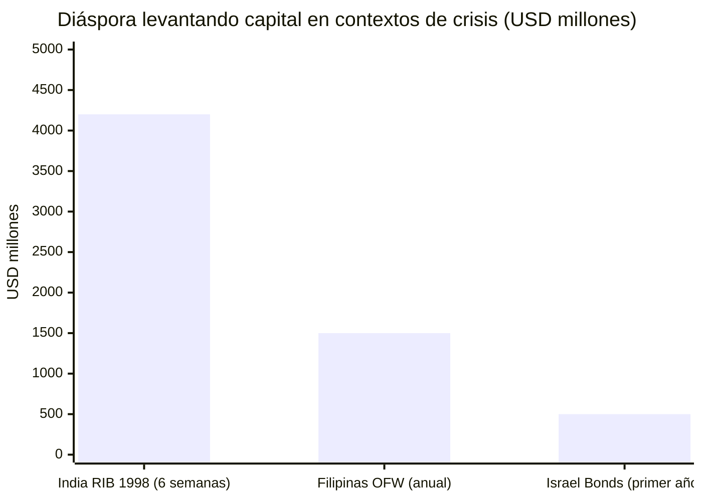

# Diáspora: Red Bilateral de 7,9 Millones de Nodos

[UNHCR (dic. 2025)](https://www.unhcr.org/us/emergencies/venezuela-situation): 7,9 M de venezolanos en el exterior. La mayor diáspora de Sudamérica. Contribuye [>USD 10.600 M/año](https://www.cnn.com/2026/01/24/americas/venezuelans-in-exile-consider-return-latam-intl) a economías de LATAM.

| País | Venezolanos | Fuente |
|------|-------------|--------|
| Colombia | 2.810.000 | [R4V](https://www.r4v.info/en/refugeeandmigrants) |
| Perú | 1.663.000 | R4V |
| EE.UU. | 760.000 | [MPI, 2025](https://www.migrationpolicy.org/article/venezuelan-immigrants-united-states) |
| Chile | 729.000 | [Milhaud Maps](https://mapasmilhaud.com/en/data-maps/the-venezuelan-diaspora-2025/) |
| España | 701.000 | Milhaud Maps |
| Brasil | 673.000 | Milhaud Maps |

## La Diáspora Como Angel Investor: Ronda Pre-Seed

**Arranca ANTES del petróleo y SIN gobierno:**

| Plataforma Pre-Seed | Inversión | Función | Modelo |
|---------------------|-----------|---------|--------|
| App Inversión Ciudadana | USD 5–15 M | Bonos desde USD 10 | Nubank/M-Pesa |
| Censo Digital Global | USD 3–8 M | Mapa de talento | Estonia e-Residency |
| Transparencia del Fondo | USD 2–5 M | Dashboard público + blockchain | NBIM portal |
| Estructura Legal | USD 5–10 M | Constitución legal del VIN | Abogados intl. |
| Hub Diáspora-Venezuela | USD 3–8 M | Matching proyectos + talento | LinkedIn/AngelList |
| Denuncia Anónima | USD 1–3 M | Anticorrupción día 1 | SEC Whistleblower |
| **TOTAL PRE-SEED** | **USD 25–60 M** | — | — |

Si el 1% de 7,9M (79.000 personas) aporta USD 500 promedio = **USD 39,5 M**. Alcanzable.

---

## El Problema Real: No es el Monto, es la Confianza

:::danger La objeción legítima
"Nadie le invertiría a Venezuela en esta fase. Al menos no los ciudadanos — son los que menos confían en el modelo."
:::

La objeción es válida. Y la respuesta no es "confía en Venezuela" — es **"no necesitas confiar en Venezuela."**

El pre-seed no requiere fe en el Estado venezolano. Requiere fe en una **estructura que blinda el dinero del Estado venezolano**. Son dos cosas distintas.

## Blindaje de Confianza: Mecanismos Estructurales

| Mecanismo | Descripción | Función |
|-----------|-------------|---------|
| **Custodio neutral externo** | BNY Mellon, State Street o equivalente — fuera de Venezuela y EE.UU. | El dinero nunca toca Venezuela hasta que se cumplen hitos verificados |
| **Escrow condicionado** | Fondos bloqueados hasta hitos auditados por tercero independiente | Nadie puede tocar el capital sin cumplir condiciones públicas |
| **Jurisdicción neutral** | Delaware LLC o Países Bajos (Coöperatie) — estándar en fintech global | La entidad legal no depende del Estado venezolano ni del de EE.UU. |
| **Dashboard público en tiempo real** | Cada centavo visible + registro en blockchain inmutable | Imposible robar en silencio |
| **MIGA (Banco Mundial)** | Seguro contra riesgo político para inversores pre-seed | Garantía institucional multinacional que no requiere confiar en Caracas |

### Hitos de Desbloqueo del Escrow

Los fondos se liberan por tramos solo cuando auditores independientes verifican:

1. Constitución legal de Venezuela S.A. en jurisdicción neutral
2. Dashboard anticorrupción operativo con datos públicos
3. Primer acuerdo trilateral (Venezuela + EE.UU. + multilateral) firmado

**Sin hitos verificados = sin desembolso.** El inversor puede retirarse si los hitos no se cumplen en plazo. El mecanismo es automático — no depende de promesas políticas.

## Precedentes: Diáspora Invirtió en Crisis Peores

| Caso | Contexto | Resultado | Fuente |
|------|----------|-----------|--------|
| **India Resurgent India Bonds (1998)** | Sanciones post-test nuclear, crisis de confianza internacional | **USD 4.200 M en 6 semanas** de la diáspora india | [RBI India](https://www.rbi.org.in/) |
| **Israel Bonds (1951–presente)** | Estado recién creado, sin historial crediticio, conflicto activo | **USD 50.000 M+** en 70 años de diáspora + institucionales | [Israel Bonds](https://www.israelbonds.com/) |
| **Filipinas ROSBonds (OFW)** | 10M trabajadores en el exterior enviando remesas | Programa permanente, accesible desde USD 5.000, décadas de éxito | [Bureau of the Treasury PH](https://www.treasury.gov.ph/) |

:::tip El punto clave
La diáspora venezolana (7,9M personas, USD 10.600 M/año en remesas) tiene mayor volumen que la india en 1998 y que la israelí en 1951. La diferencia no es disposición — es mecanismo. India y Filipinas resolvieron el problema de confianza con estructura legal, custodio externo y retorno claro. Venezuela debe hacer lo mismo.
:::

**La debilidad no es el concepto. Es que ese mecanismo de confianza estructural no está completamente construido todavía. Esta sección es el blueprint para construirlo.**

**Fuentes:** [RBI India — Resurgent India Bonds](https://www.rbi.org.in/) | [Israel Bonds](https://www.israelbonds.com/) | [Bureau of the Treasury PH](https://www.treasury.gov.ph/) | [MIGA — World Bank Group](https://www.miga.org/) | [BNY Mellon Custody](https://www.bnymellon.com/)
