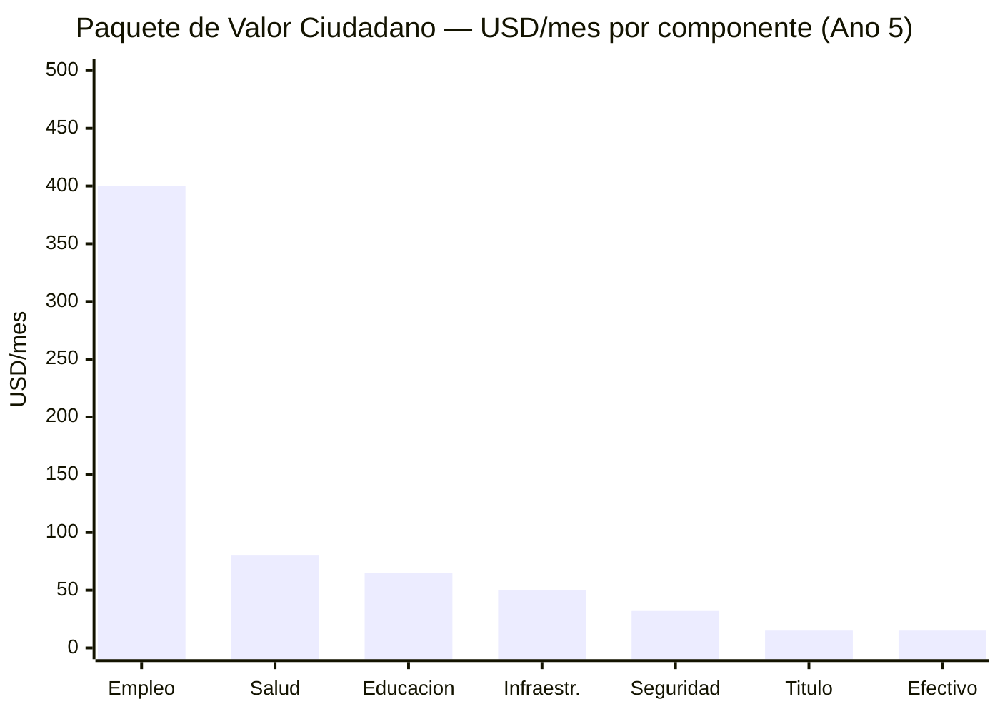

# Los 32 Millones Que Se Quedaron

> El plan habla mucho de la diáspora (7,9 M), de inversionistas internacionales y de modelos extranjeros. ¿Qué les ofrece a los 32 millones de personas que siguen en Venezuela, sobreviviendo con un salario mínimo de USD 3,50/mes?

:::danger Auditoría honesta
Si el plan no resuelve la vida cotidiana de la mayoría que se quedó — empleados públicos, informales, jubilados, estudiantes — entonces es un plan para élites y diáspora, no para un país. Esta sección examina la oferta actual del plan para los 32M y lo que falta.
:::

---

## Perfil de los 32 Millones

| Segmento | Población estimada | Situación actual | Fuente |
|----------|-------------------|-----------------|--------|
| **Sector informal** | ~12-15 M (trabajadores + familias) | 70%+ de empleo es informal; sin seguridad social, sin contrato | [ENCOVI/UCAB 2023](https://www.proyectoencovi.com/) |
| **Empleados públicos** | ~3-4 M (directos + dependientes) | Salario promedio USD 20-50/mes; muchos con segundo empleo | [ENCOVI/UCAB 2023](https://www.proyectoencovi.com/) |
| **Jubilados/pensionados** | ~4-5 M | Pensión: USD 3,50/mes (salario mínimo) | [Observatorio Venezolano de Finanzas](https://observatoriodefinanzas.com/) |
| **Estudiantes** | ~7-8 M (primaria a universidad) | Matrícula escolar cayó a ~70%; deserción universitaria masiva | [ENCOVI/UCAB 2023](https://www.proyectoencovi.com/) |
| **Clase media sobreviviente** | ~3-4 M | Dolarizados, emprendedores, freelancers; se adaptan pero sin estabilidad | [ENCOVI/UCAB 2023](https://www.proyectoencovi.com/) |
| **Comunidades indígenas** | ~700.000-1 M | Marginados del modelo económico; afectados por minería ilegal | [IWGIA](https://www.iwgia.org/en/venezuela.html) |

**Pobreza:** 82,8% de la población vive en pobreza. 53,3% en pobreza extrema ([ENCOVI/UCAB 2023](https://www.proyectoencovi.com/)).

---

## Auditoría: ¿Qué Les Ofrece el Plan Actual?

| Componente del plan | Oferta para los 32M | Suficiente |
|--------------------|---------------------|-------------|
| [Fondo de Inversión Venezuela S.A.](/02-motor-financiero/fondo-soberano) | Dividendo USD 30-65/persona/año (año 15) | Insuficiente a corto plazo; útil a largo plazo |
| [Reforma fiscal](/02-motor-financiero/transicion-fiscal) | Menos impuestos informales, más formalización | Parcial: beneficia a quien ya tiene ingresos |
| [Seguridad](/04-gobernanza/seguridad-fisica) | Reducción de criminalidad | Impacto directo en calidad de vida |
| [Salud](/06-realidad/servicios-publicos) | FONASA universal (contribución 7% salario). Tramos A/B sin copago. ISAPRE opcional | Transformacional — nadie queda fuera |
| [Educación](/05-transformacion/educacion) | Sistema educativo reconstruido | Impacto en 10-15 años |
| [Estado digital](/06-realidad/estado-digital) | Trámites online, menos burocracia | Útil para conectados; 40%+ sin internet confiable |
| [Infraestructura](/06-realidad/infraestructura-basica) | Electricidad, agua, transporte | Necesidad básica cubierta |
| [Pensiones](/06-realidad/pensiones-seguridad-social) | Pilar 1 contributivo | No resuelve jubilados actuales que nunca contribuyeron |
| [Hubs tech / ZEETs](/05-transformacion/hubs-tech) | Empleos tech | Para minoría calificada; no para mayoría informal |
| [Inversión ciudadana](/03-ciudadanos/inversion-ciudadana) | Derecho a dividendo como "accionista" | Simbólico hasta que el fondo genere retornos |

**Diagnóstico:** El plan ofrece mucho a largo plazo (año 10-15) pero **poco tangible en los primeros 5 años** para la mayoría. Un jubilado con USD 3,50/mes no puede esperar 15 años.

---

## Lo Que Falta: Agencia Económica Inmediata

El plan necesita una oferta concreta para los primeros 1-5 años. No asistencialismo perpetuo — **herramientas para que los 32M se conviertan en agentes económicos activos.**

### Programa "Accionista Activo"

#### 1. Títulos de propiedad

El [70%+ de las viviendas en barrios populares no tienen título legal](https://www.proyectoencovi.com/) (ENCOVI/UCAB). Sin título:
- No puedes pedir un crédito
- No puedes vender o heredar formalmente
- No tienes incentivo para invertir en tu vivienda
- No existes para el sistema financiero

| Acción | Modelo | Meta | Costo |
|--------|--------|------|-------|
| Catastro digital + titulación masiva | [Perú (De Soto, 1990s)](https://www.ild.org.pe/): tituló 1,2 M de propiedades en 5 años | 3-5 M de títulos en 5 años | USD 500M-1B |
| Efecto multiplicador | De Soto documentó que los activos informales de los pobres del mundo valen USD 9,3T — pero sin título no son capital | USD 50-100B en activos desbloqueados | — |

#### 2. Formalización del empleo informal

| Acción | Mecanismo | Meta | Costo |
|--------|-----------|------|-------|
| Régimen simplificado de microempresa | 1 formulario, 1 día, 0 costo los primeros 2 años | 2 M de microempresas formalizadas (año 5) | USD 100-200 M |
| Monotributo | Pago único mensual (USD 5-10) cubre impuestos + seguridad social básica | Cobertura universal progresiva | Auto-financiado al escalar |
| Banca digital universal | Cuenta bancaria digital gratuita vinculada a cédula (modelo India [Jan Dhan](https://pmjdy.gov.in/)) | 30 M de cuentas en 3 años | USD 100-200 M |

#### 3. Empleo en infraestructura

El plan requiere USD 550-750B en inversión en 15 años. Eso significa **construcción masiva**: carreteras, puentes, plantas eléctricas, edificios, puertos, escuelas, hospitales.

| Programa | Modelo | Empleos directos | Salario |
|----------|--------|-----------------|---------|
| "Construye Venezuela" | [India NREGA](https://nrega.nic.in/): empleo garantizado 100 días/año en obras públicas | 500.000-1 M empleos/año | USD 200-400/mes |
| Mantenimiento de infraestructura | Colombia "Caminos de prosperidad" | 200.000 empleos | USD 150-300/mes |
| Rehabilitación de vivienda | Programas de autoconstrucción asistida | 100.000 familias/año | Materiales + asistencia técnica |

**Costo estimado:** USD 2-4B/año (parcialmente auto-financiado: la infraestructura genera valor)

**Referencia:** [India NREGA](https://nrega.nic.in/) emplea ~50 M de hogares rurales/año con presupuesto de USD 10-12B. Escala Venezuela: ~USD 2-4B para 1-2 M de hogares.

#### 4. Capacitación con ingreso

| Programa | Duración | Ingreso durante capacitación | Modelo |
|----------|----------|------------------------------|--------|
| Bootcamps técnicos (tech, construcción, salud) | 6-12 meses | USD 150-250/mes (estipendio) | Singapur SkillsFuture |
| Reskilling trabajadores petroleros → renovables/tech | 3-6 meses | USD 200-300/mes | Transición energética UE |
| Formación agrícola técnica | 3-6 meses | USD 100-200/mes | Colombia SENA + parcelas |

**Meta:** 200.000 personas/año en programas de capacitación con ingreso. Ver [Capital humano](/05-transformacion/capital-humano) para detalle completo.

#### 5. Participación comunitaria en concesiones

Cuando Venezuela S.A. concesiona infraestructura, telecoms o servicios a privados, las comunidades locales deben tener voz y beneficio:

| Mecanismo | Cómo funciona | Precedente |
|-----------|--------------|-----------|
| 5% de regalías locales | Cada concesión destina 5% de ingresos al municipio donde opera | [Colombia: regalías directas a municipios (SGR)](https://www.sgr.gov.co/) |
| Empleo local obligatorio | 60%+ de empleos no-especializados deben ser locales | Estándar en concesiones petroleras globales |
| Comité de seguimiento comunitario | Vecinos eligen representantes que auditan la concesión | Modelo Chile concesiones mineras |

---

## El Dividendo Real: Cómo Llegar a USD 400/Mes

:::danger La matemática del dividendo en efectivo no cierra
USD 400/mes × 40M personas × 12 meses = **USD 192B/año**. El PIB actual es USD 83B. Ni siquiera en año 15 (PIB ~USD 350B) es posible repartir USD 192B en cheques. Alaska paga **USD 1.000/año** (USD 83/mes) a 730.000 personas — no a 40M. El dividendo en efectivo del fondo será siempre simbólico: **USD 22-65/persona/año** en el mejor caso.
:::

### Redefinición: El dividendo no es un cheque — es un ecosistema

La canasta básica familiar cuesta **USD 677/mes** para 5 personas (~**USD 135/persona/mes**) ([CENDAS, mar. 2026](https://lapatilla.com/2026/03/03/canasta-alimentaria-ya-cuesta-677-dolares-y-el-salario-no-alcanza-ni-para-el-1-segun-cendas/)). El plan no llega ahí con un cheque. Llega con un **Paquete de Valor Ciudadano (PVC)** que combina 7 componentes:

| # | Componente | Valor/mes (año 3) | Valor/mes (año 5) | Cómo se entrega |
|---|-----------|-------------------|-------------------|----------------|
| 1 | **Salud universal (FONASA)** | USD 40-60 | USD 60-100 | Cobertura total vía FONASA (contribución 7%). Tramos A/B: 0% copago. Ahorra lo que hoy gastan en clínicas privadas o se mueren sin atención |
| 2 | **Educación universal (voucher portable)** | USD 30-50 | USD 50-80 | Voucher cubre 100% de matrícula. Colegios compiten como empresas privadas por vouchers. +50% para bajos ingresos (SEP) |
| 3 | **Empleo formal** (el mayor impacto) | USD 150-300 | USD 300-500 | De USD 3.50/mes (salario mínimo actual) a USD 300-500/mes en construcción, servicios, tech, agro. El plan crea **1-3M de empleos directos** |
| 4 | **Infraestructura que funciona** | USD 20-40 | USD 40-60 | Electricidad 24/7, agua potable, transporte público. Hoy gastan en plantas, tanques de agua, taxis por falta de transporte |
| 5 | **Seguridad** | USD 15-25 | USD 25-40 | No te roban, no pagas "vacuna", no pierdes mercancía. El crimen es un impuesto invisible al pobre |
| 6 | **Título de propiedad** | — | USD 10-20 | Vivienda con título = crédito, herencia, inversión. Desbloquea USD 50-100B en activos informales (De Soto) |
| 7 | **Dividendo en efectivo** | USD 2-5 | USD 10-20 | Del Fondo de Inversión Venezuela S.A.. Simbólico al inicio, crece con el fondo |
| | **TOTAL PVC** | **USD 260-480** | **USD 495-820** | |

### La clave es el empleo, no el cheque

| Fuente de empleo | Empleos directos (año 5) | Salario promedio | Modelo |
|-----------------|-------------------------|-----------------|--------|
| **Construcción/infraestructura** | 500.000-1.000.000 | USD 300-500/mes | [India NREGA](https://nrega.nic.in/) adaptado |
| **Petróleo y gas** (JVs) | 100.000-200.000 | USD 500-1.500/mes | Directos + cadena de valor |
| **Servicios (salud, educación, seguridad)** | 300.000-500.000 | USD 300-600/mes | Plazas públicas con salarios dignos |
| **Tech/digital** | 50.000-100.000 | USD 800-2.500/mes | Bootcamps → empleo remoto global |
| **Agroindustria** | 200.000-400.000 | USD 200-400/mes | Formalización + tecnificación |
| **Turismo** | 100.000-200.000 | USD 250-500/mes | Zonas piloto seguras |
| **Comercio/servicios formalizados** | 500.000-1.000.000 | USD 200-400/mes | Microempresas + monotributo |
| **TOTAL** | **1.750.000-3.400.000** | **USD 300-600 promedio** | |

:::tip Empleo > dividendo
Un empleo de USD 400/mes genera **USD 4.800/año** por ciudadano — vs. USD 65/año de dividendo del fondo. El empleo es **74x más efectivo** que el dividendo en efectivo para sacar gente de la pobreza. El Fondo de Inversión Venezuela S.A. es para el largo plazo (generaciones). El empleo es para AHORA.
:::

### Acelerador: Del dividendo simbólico al dividendo real

| Año | Efectivo (fondo) | Servicios | Empleo | **PVC total** |
|-----|-----------------|-----------|--------|--------------|
| 1 | USD 0 | USD 50-80/mes | USD 100-200/mes (emergencia) | **USD 150-280/mes** |
| 3 | USD 2-5/mes | USD 120-180/mes | USD 200-350/mes | **USD 320-535/mes** |
| 5 | USD 10-20/mes | USD 180-260/mes | USD 300-500/mes | **USD 490-780/mes** |
| 10 | USD 30-50/mes | USD 250-350/mes | USD 500-800/mes | **USD 780-1.200/mes** |
| 15 | USD 50-100/mes | USD 300-400/mes | USD 800-1.500/mes | **USD 1.150-2.000/mes** |

### La narrativa que falta

:::info El joven de Petare
El plan necesita una historia, no solo tablas. Imagina: un joven de 22 años en Petare. Hoy gana USD 50/mes en economía informal. En año 1, se inscribe en un bootcamp de 6 meses con estipendio de USD 200/mes. En año 2, consigue empleo remoto ganando USD 800/mes. Invirtió USD 10 en bonos ciudadanos que ya valen USD 15. Su mamá va al hospital concesionado — cubierta por FONASA sin copago porque es Tramo A. Su hermana menor tiene voucher escolar que le permite elegir la mejor escuela del barrio. La calle donde vive ya no la controla una banda.

Ese joven cuenta la historia en TikTok. Eso vale más que 100 páginas de proyecciones.

**Sin esa narrativa, el plan son tablas y gráficos. Con ella, es un movimiento.**
:::

---

## Resolución del Conflicto: Retornados vs. Residentes

:::caution Tensión predecible
Cuando la diáspora retorne con ahorros, experiencia internacional y títulos, habrá tensión con los que se quedaron — que resistieron, que perdieron más, que sienten que "los que se fueron tuvieron la opción fácil". Ignorar esto es garantizar conflicto social.
:::

| Riesgo | Ejemplo internacional | Mitigación |
|--------|----------------------|-----------|
| Retornados compran propiedades y desplazan residentes | Gentrificación en ciudades post-conflicto (Bogotá, Beirut) | Tope de compra por retornado durante primeros 3 años; prioridad de vivienda social a residentes |
| Retornados capturan empleos calificados | España post-dictadura: retornados con títulos europeos desplazaron locales | Cuotas: 60% empleo local + 40% retornado en proyectos públicos |
| Resentimiento social | "Nosotros sufrimos, ustedes se fueron" | Programa de reconocimiento a "los que sostuvieron el país" — no es solo retórica, es prioridad en titulación, capacitación y empleo |
| Diferencia de capital | Retornados con USD 10-50K vs. residentes con USD 0 | Programa de microfinanzas exclusivo para residentes ([Grameen model](https://grameenfoundation.org/)): USD 500-5.000 a tasa 0% los primeros 2 años |

---

## Costo Total: Programa "Accionista Activo"

| Componente | Inversión (5 años) | Financiamiento |
|-----------|-------------------|---------------|
| Titulación masiva (3-5M títulos) | USD 500M-1B | Presupuesto + cooperación internacional |
| Formalización + banca digital | USD 200-400 M | Presupuesto + PPP fintech |
| Empleo en infraestructura (1-2M/año) | USD 10-20B | Presupuesto de infraestructura (ya incluido en plan) |
| Capacitación con ingreso (200K/año) | USD 2-4B | Fondo de Inversión Venezuela S.A. retornos + presupuesto educación |
| Microfinanzas residentes | USD 500M-1B | PPP con banca + cooperación |
| **TOTAL** | **USD 13-26B (5 años)** | **Mayoría ya incluida en presupuesto de infraestructura + educación** |

:::info No es gasto nuevo — es priorización
La mayor parte de esta inversión (empleo en infraestructura, capacitación) ya está contemplada en otros capítulos del plan. Lo que faltaba era **ponerle nombre y cara**: estos programas son para los 32 M que se quedaron, no para inversores ni diáspora.
:::

> *"Un plan que no le habla a la señora que vende empanadas en Petare, al jubilado de Maracaibo con USD 3,50/mes, al estudiante que no tiene internet — no es un plan para Venezuela. Es un plan para el Venezuela que nos gustaría que existiera."*

---

## Las Historias que Importan

> Las tablas convencen a economistas. Las historias mueven a 40 millones de personas.

:::tip Maria, 28 anos — Petare, Caracas
Maria vende empanadas en Petare desde los 19. Gana USD 80/mes en un buen mes, USD 30 en uno malo. Nunca ha tenido cuenta bancaria. Su cedula es su unico documento.

En marzo del ano 2 del plan, su vecina le muestra la app de Bonos Ciudadanos en el telefono. "Mira, yo meti diez dolares y ya me aparecen." Maria descarga la app, vincula su cedula, abre una cuenta digital en 4 minutos. Invierte USD 10 — lo que gana en un dia bueno de empanadas. La app le muestra su bono, su dividendo proyectado, su estatus: **Accionista de Venezuela**.

Tres meses despues recibe su primera notificacion: "Dividendo trimestral: USD 0,47 depositado." No es nada. Pero es suyo. Lo postea en TikTok con el caption: *"Mi primer dividendo. Empanadas + capitalismo popular."* Tiene 340.000 vistas en 48 horas. Su mama, que nunca ha usado una app financiera, le pide que le abra una cuenta.
:::

:::tip Carlos, 55 anos — Punto Fijo, Falcon
Carlos trabajo 22 anos en PDVSA. Sabia operar una planta de craqueo catalitico con los ojos cerrados. Cuando la empresa colapso, se quedo sin empleo, sin pension real, sin opciones. A los 50 anos, nadie contrata a un ingeniero de procesos venezolano con experiencia en equipos de los anos 90.

En el ano 1 del plan, la JV entre PDVSA y Chevron en la Faja del Orinoco lanza un programa de reskilling para exempleados petroleros. Carlos se inscribe en un curso de 4 meses: instalacion y mantenimiento de paneles solares — tecnologia que comparte principios de ingenieria termica que el ya domina. Recibe un estipendio de USD 250/mes durante la capacitacion.

Al graduarse, lo contrata una de las concesionarias del plan de electrificacion rural. Salario: USD 800/mes. En su primer proyecto, instala paneles en una escuela de la Sierra de Falcon que llevaba 3 anos sin electricidad confiable. La directora le da un abrazo. Carlos vuelve a sentir que sabe hacer algo que importa. Tiene 55 anos y acaba de empezar su segunda carrera.
:::

:::tip Valentina, 22 anos — Ciudad Guayana, Bolivar
Valentina estudio dos anos de ingenieria en la UNEXPO antes de que la universidad se quedara sin profesores. Se fue a trabajar en una ferreteria ganando USD 60/mes. Sabia que podia mas, pero no habia donde.

En el ano 2 del plan, se abre el primer bootcamp de programacion en Ciudad Guayana — financiado por el fondo de capital humano y operado por una alianza entre Platzi, una startup local y el hub tech de la zona. Valentina pasa la prueba de admision. Durante 9 meses, estudia full-time con un estipendio de USD 200/mes. Aprende Python, bases de datos, desarrollo web.

A los 22 anos, consigue su primer empleo: junior developer en el data center de Ciudad Guayana que opera la concesionaria del hub tech. Salario: **USD 1.200/mes** — mas de lo que su mama ha ganado en su vida en un solo mes. Cuando le depositan el primer sueldo, llama a su mama. No puede hablar. Su mama tampoco. Lloran las dos. Valentina se compra su primera laptop propia y mete USD 50 en bonos ciudadanos. En su perfil de LinkedIn pone: "Software Developer | Ciudad Guayana, Venezuela."
:::

:::tip Jose, 35 anos — Miami → Maracaibo
Jose se fue de Maracaibo a Miami en 2017 con una maleta y USD 400. Ocho anos despues tiene residencia, un trabajo en construccion ganando USD 4.500/mes y una hija nacida en Florida. Venezuela es un recuerdo que duele.

Un domingo ve en Instagram un post del programa de retorno: un ingeniero civil venezolano que volvio y ahora lidera la reconstruccion del puerto de Maracaibo con 8% de equity en la concesion. Jose abre la app de inversion ciudadana. Explora el dashboard: produccion petrolera en tiempo real, estado de las concesiones, retorno de los bonos. Invierte USD 5.000 en participaciones VIN.

Seis meses despues, aplica al programa de co-fundacion para la rehabilitacion de la autopista Lara-Zulia — un proyecto que conoce porque la recorrio mil veces de nino. Lo aceptan. Le ofrecen 5% de equity en la concesion, salario de USD 3.000/mes y voucher de vivienda temporal en Maracaibo por 6 meses. Jose habla con su esposa. Deciden intentarlo un ano. En enero del ano 3, aterriza en Maiquetia con su familia. Su mama lo espera en el aeropuerto. No se habian abrazado en 8 anos.
:::

:::info Por que las historias importan
Cada una de estas historias referencia mecanismos reales del plan: la [app de bonos ciudadanos](/03-ciudadanos/inversion-ciudadana), los [bootcamps con estipendio](/05-transformacion/capital-humano), el [reskilling de exempleados PDVSA](/05-transformacion/educacion), los [data centers en Ciudad Guayana](/05-transformacion/hubs-tech), el [programa de retorno con equity](/03-ciudadanos/retorno-diaspora) y el [Paquete de Valor Ciudadano](#el-dividendo-real-cómo-llegar-a-usd-400mes). No son fantasia — son la concatenacion logica de lo que el plan ya contempla. Lo que faltaba era ponerles cara.

**Si Maria, Carlos, Valentina y Jose no son reales en 5 anos, el plan fracaso.**
:::

---

**Fuentes:** [ENCOVI/UCAB 2023](https://www.proyectoencovi.com/) | [De Soto — El Misterio del Capital](https://www.ild.org.pe/) | [India NREGA](https://nrega.nic.in/) | [Grameen Foundation](https://grameenfoundation.org/) | [Colombia SGR](https://www.sgr.gov.co/)
