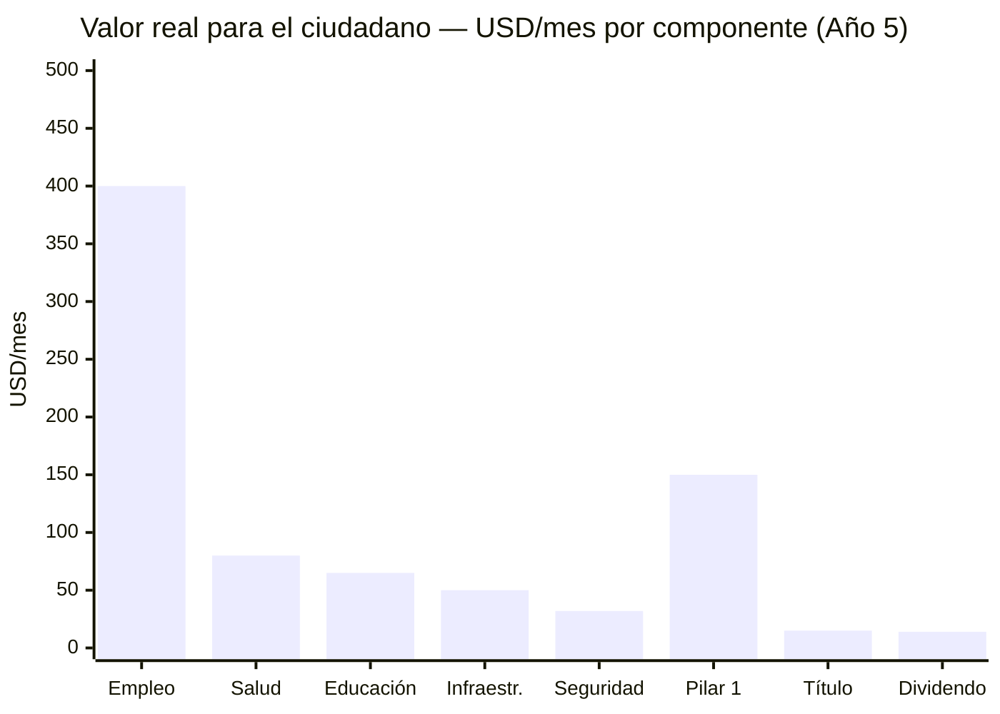

# Los 32 Millones Que Se Quedaron

:::tip En pocas palabras
El plan no te da un pez. No te enseña a pescar. Te da una **caña de pescar** (el FCV) y llena el río de peces (concesiones, empleos, infraestructura). Tú pescas. Desde el Día 1, cada venezolano tiene un FCV con 5 subcuentas. Las concesiones de infraestructura crean 1-3M de empleos privados. La titulación masiva desbloquea USD 50-100B en activos informales. El Pilar 1 universal protege a los jubilados actuales. El mercado asigna — el Estado supervisa — Venezuela S.A. invierte.
:::

> El plan habla de la diáspora (7,9M), de inversionistas internacionales y de modelos extranjeros. ¿Qué les ofrece a los 32 millones de personas que siguen en Venezuela, sobreviviendo con un salario mínimo de USD 3,50/mes?

:::danger Auditoría honesta
Si el plan no resuelve la vida cotidiana de la mayoría que se quedó — empleados públicos, informales, jubilados, estudiantes — entonces es un plan para élites y diáspora, no para un país. Esta sección examina la oferta real para los 32M.
:::

:::caution Fechas ilustrativas — las fases se activan por KPIs, no por calendario
Las referencias a "Año X" en este documento son **ilustrativas**. Las fases reales se activan por condiciones verificables (PIB/cápita, formalización, pobreza). Ver [KPIs de Activación](/07-ejecucion/kpis-activacion).
:::

---

## Perfil de los 32 Millones

| Segmento | Población estimada | Situación actual | Fuente |
|----------|-------------------|-----------------|--------|
| **Sector informal** | ~12-15M (trabajadores + familias) | 70%+ de empleo es informal; sin seguridad social, sin contrato | [ENCOVI/UCAB 2023](https://www.proyectoencovi.com/) |
| **Empleados públicos** | ~3-4M (directos + dependientes) | Salario promedio USD 20-50/mes; muchos con segundo empleo | [ENCOVI/UCAB 2023](https://www.proyectoencovi.com/) |
| **Jubilados/pensionados** | ~4-5M | Pensión: USD 3,50/mes (salario mínimo) | [Observatorio Venezolano de Finanzas](https://observatoriodefinanzas.com/) |
| **Estudiantes** | ~7-8M (primaria a universidad) | Matrícula escolar cayó a ~70%; deserción universitaria masiva | [ENCOVI/UCAB 2023](https://www.proyectoencovi.com/) |
| **Clase media sobreviviente** | ~3-4M | Dolarizados, emprendedores, freelancers; se adaptan pero sin estabilidad | [ENCOVI/UCAB 2023](https://www.proyectoencovi.com/) |
| **Comunidades indígenas** | ~700.000-1M | Marginados del modelo económico; afectados por minería ilegal | [IWGIA](https://www.iwgia.org/en/venezuela.html) |

**Pobreza:** 82,8% de la población vive en pobreza. 53,3% en pobreza extrema ([ENCOVI/UCAB 2023](https://www.proyectoencovi.com/)).

---

## Auditoría: ¿Qué Les Ofrece el Plan?

| Componente del plan | Oferta para los 32M | Impacto |
|--------------------|---------------------|---------|
| [Fondo Ciudadano Venezuela (FCV)](/04-gobernanza/modelo-estado#fondo-ciudadano-venezuela-fcv-una-sola-cuenta-cero-burocracia) | 5 subcuentas (retiro 8% + salud 7% + vivienda 4% + educación 2% + cesantía 2%). Desde el nacimiento. VSA deposita USD 150/mes por niño | **Transformacional** — un salario mínimo acumula USD 463K a los 65 años |
| [Pensión Pilar 1 universal](/06-realidad/pensiones-seguridad-social) | USD 50→200/mes para TODO jubilado desde el Día 1 — incluye a quienes nunca contribuyeron. Financiado por impuestos | **Inmediato** — resuelve a los 4-5M de jubilados actuales |
| [Salud universal (FCV Salud)](/04-gobernanza/modelo-estado#salud-subcuenta-salud-del-fcv--universal-contributivo-sin-exclusión) | Contribución 7% del salario. Tramos A/B (bajos ingresos): 0% copago. ISAPRE opcional | **Transformacional** — nadie queda fuera |
| [Educación (voucher portable)](/05-transformacion/educacion) | Voucher K-12 universal que sigue al estudiante. Colegios compiten como empresas privadas. +50% para bajos ingresos (SEP) | **Transformacional** — educación de calidad para 7-8M de estudiantes |
| [Fondo de Inversión Venezuela S.A.](/02-motor-financiero/fondo-soberano) | Dividendo ciudadano USD 125-200/año (año 15) | Simbólico a corto plazo; complemento a largo plazo |
| [Reforma fiscal](/02-motor-financiero/transicion-fiscal) | 15% flat + 12% IVA. Menos impuestos informales, más formalización | Beneficia a quien tiene ingresos formales |
| [Seguridad](/04-gobernanza/seguridad-fisica) | Reducción de criminalidad | Impacto directo en calidad de vida |
| [Estado digital](/06-realidad/estado-digital) | Trámites online, menos burocracia | Útil para conectados; 40%+ sin internet confiable |
| [Infraestructura](/06-realidad/infraestructura-basica) | Electricidad, agua, transporte vía concesiones | Necesidad básica cubierta |
| [Hubs tech](/05-transformacion/hubs-tech) | Empleos tech vía concesiones y startups | Para minoría calificada; crece con capacitación |

**Diagnóstico:** El plan ofrece herramientas inmediatas (Pilar 1, FCV, titulación, concesiones) Y de largo plazo (Fondo de Inversión, educación de calidad). El jubilado con USD 3,50/mes recibe Pilar 1 desde el Día 1. El informal recibe título de propiedad y acceso al FCV al formalizarse. El joven recibe voucher educativo y acceso a empleo en concesiones.

---

## Herramientas Inmediatas: Agencia Económica desde el Día 1

El plan no crea programas de empleo público. El Estado no contrata — el mercado contrata. Lo que el plan sí hace es darle al ciudadano las herramientas para entrar al mercado.

### 1. Titulación masiva de propiedad

El [70%+ de las viviendas en barrios populares no tienen título legal](https://www.proyectoencovi.com/) (ENCOVI/UCAB). Sin título:
- No puedes pedir un crédito
- No puedes vender o heredar formalmente
- No tienes incentivo para invertir en tu vivienda
- No existes para el sistema financiero

| Acción | Modelo | Meta | Costo |
|--------|--------|------|-------|
| Catastro digital + titulación masiva | [Perú (De Soto, 1990s)](https://www.ild.org.pe/): tituló 1,2M de propiedades en 5 años | 3-5M de títulos en 5 años | USD 500M-1B |
| Efecto multiplicador | De Soto documentó que los activos informales de los pobres del mundo valen USD 9,3T — pero sin título no son capital | USD 50-100B en activos desbloqueados | — |

**El título de propiedad es la primera herramienta.** Convierte la vivienda donde ya vives en un activo financiero: crédito, herencia, garantía. Los residentes que aguantaron 25 años reciben título legal sobre el terreno que ya ocupan. Eso es protección real — no una cuota.

### 2. Formalización del empleo informal

| Acción | Mecanismo | Meta | Costo |
|--------|-----------|------|-------|
| Régimen simplificado de microempresa | 1 formulario, 1 día, 0 costo los primeros 2 años | 2M de microempresas formalizadas (año 5) | USD 100-200M |
| Monotributo | Pago único mensual (USD 5-10) cubre impuestos + FCV básico | Cobertura universal progresiva | Auto-financiado al escalar |
| Banca digital universal | Cuenta bancaria digital sin costo de apertura vinculada a cédula (modelo India [Jan Dhan](https://pmjdy.gov.in/)) | 30M de cuentas en 3 años | USD 100-200M |

**La formalización abre la puerta al FCV.** Sin empleo formal, no hay contribución al FCV. Sin FCV, no hay salud, retiro, vivienda, educación, cesantía. El monotributo + banca digital es el puente entre la informalidad y el sistema.

### 3. Fondo Ciudadano Venezuela (FCV) como red de protección

El FCV no es un programa de gobierno — es una **cuenta personal del ciudadano** con 5 subcuentas. Todo venezolano la tiene desde el nacimiento. Venezuela S.A. deposita USD 150/mes por cada niño. Al formalizarse como trabajador, la contribución es 23% del salario (11% trabajador + 12% empleador).

| Subcuenta | % del salario | Función inmediata para los 32M |
|-----------|--------------|-------------------------------|
| **Retiro** | 8% | Pensión propia — nadie te la quita. Heredable al 100% |
| **Salud** | 7% | Cobertura universal desde el Día 1. Tramos A/B: 0% copago |
| **Vivienda** | 4% | Ahorro para pago inicial de casa propia (tipo [Singapur CPF](https://www.cpf.gov.sg/)) |
| **Educación** | 2% | Universidad propia o de los hijos |
| **Cesantía** | 2% | Colchón de 3-6 meses de salario si pierdes el empleo |
| **TOTAL** | **23%** | **UNA cuenta, UNA institución, 5 subcuentas** |

**Para los jubilados actuales:** El Pilar 1 universal (financiado por impuestos) los cubre desde el Día 1 con USD 50→200/mes. No necesitan haber contribuido al FCV. Es la garantía constitucional de vejez digna.

**Para los informales:** Al formalizarse vía monotributo, empiezan a contribuir al FCV. La subcuenta cesantía les da el colchón que nunca tuvieron. La subcuenta salud les da cobertura real.

**Para los niños:** Nacen con FCV. VSA deposita USD 150/mes. A los 18 años tienen USD 20.218 de ahorro acumulado — sin haber trabajado un solo día.

:::tip Resultado real: salario mínimo → USD 463K a los 65 años
Un trabajador que gana salario mínimo toda su vida y contribuye al FCV acumula **USD 463.508** a los 65 años. Pensión mensual: **USD 1.408/mes** (FCV Retiro + Pilar 1). Tasa de reemplazo: **117%** del último salario. Casa propia comprada a los 32. Hijos graduados de universidad. Todo financiado por el FCV — no por el gobierno. Ver [ejemplo completo](/04-gobernanza/modelo-estado#anexo-ejemplo--ciclo-de-vida-del-fcv-con-salario-mínimo).
:::

---

## Empleo: Las Concesiones Crean los Trabajos

El plan requiere USD 550-750B en inversión en 15 años. Cada carretera, puerto, hospital, escuela, planta eléctrica, red de telecomunicaciones se construye como **concesión privada o JV con Venezuela S.A.** Eso genera empleo masivo — privado, no público.

Las concesiones crean los trabajos. Cada carretera, puerto, hospital, escuela construida como PPP genera empleo. **El Estado no contrata — el mercado contrata.**

| Fuente de empleo | Empleos directos (año 5) | Salario promedio | Mecanismo |
|-----------------|-------------------------|-----------------|-----------|
| **Construcción/infraestructura** (concesiones) | 500.000-1.000.000 | USD 300-500/mes | Concesiones de carreteras, puertos, hospitales, escuelas, plantas eléctricas |
| **Petróleo y gas** (JVs) | 100.000-200.000 | USD 500-1.500/mes | Joint ventures con operadoras internacionales + cadena de valor |
| **Servicios (salud, educación, seguridad)** | 300.000-500.000 | USD 300-600/mes | Hospitales concesionados, colegios privados con voucher, policía profesional |
| **Tech/digital** | 50.000-100.000 | USD 800-2.500/mes | Data centers, startups, empleo remoto global |
| **Agroindustria** | 200.000-400.000 | USD 200-400/mes | Formalización + tecnificación + acceso a crédito |
| **Turismo** | 100.000-200.000 | USD 250-500/mes | Zonas piloto seguras + marca país |
| **Comercio/servicios formalizados** | 500.000-1.000.000 | USD 200-400/mes | Microempresas + monotributo + banca digital |
| **TOTAL** | **1.750.000-3.400.000** | **USD 300-600 promedio** | |

:::tip Empleo > dividendo
Un empleo de USD 400/mes genera **USD 4.800/año** por ciudadano — vs. USD 125-200/año de dividendo del Fondo de Inversión Venezuela S.A. El empleo es **24-38x más efectivo** que el dividendo en efectivo para sacar gente de la pobreza. El Fondo de Inversión es para el largo plazo (generaciones). El empleo es para AHORA.
:::

### Participación comunitaria en concesiones

Cuando Venezuela S.A. concesiona infraestructura a privados, el **contrato de concesión** incluye cláusulas de beneficio local:

| Mecanismo | Cómo funciona | Precedente |
|-----------|--------------|-----------|
| 5% de regalías locales | Cada concesión destina 5% de ingresos al municipio donde opera | [Colombia: regalías directas a municipios (SGR)](https://www.sgr.gov.co/) |
| 60%+ empleo local no especializado | El contrato de concesión exige contratación local para puestos no especializados | Estándar en concesiones petroleras globales |
| Comité de seguimiento comunitario | Vecinos eligen representantes que auditan la concesión | Modelo Chile concesiones mineras |

Esto no es una cuota del gobierno — es una **cláusula contractual** de la concesión. Venezuela S.A., como accionista en la concesión, la negocia directamente.

---

## Capacitación: Tu FCV Paga Tu Reconversión

La capacitación no es un programa de gobierno. Es tu propio dinero del FCV trabajando para ti.

| Mecanismo | Cómo funciona | Modelo |
|-----------|--------------|--------|
| **FCV Educación** (subcuenta 2%) | Financia bootcamps técnicos, reskilling, formación agrícola. El ciudadano elige dónde estudiar | [Singapur SkillsFuture](https://www.skillsfuture.gov.sg/) |
| **FCV Cesantía** (subcuenta 2%) | Provee estipendio de 3-6 meses de salario durante la reconversión si perdiste el empleo | [Chile AFC (Seguro de Cesantía)](https://www.afc.cl/) |
| **Voucher universitario por mérito** | Se gana y mantiene por esfuerzo (100→75→50→25→pierde). Financiado por impuestos | Chile Gratuidad + mérito |

| Tipo de capacitación | Duración | Financiamiento | Modelo |
|---------------------|----------|---------------|--------|
| Bootcamps técnicos (tech, construcción, salud) | 6-12 meses | FCV Educación + FCV Cesantía (estipendio) | Singapur SkillsFuture |
| Reskilling exempleados petroleros → renovables/tech | 3-6 meses | FCV Educación + JV petrolera (parte del contrato de concesión) | Transición energética UE |
| Formación agrícola técnica | 3-6 meses | FCV Educación + Venezuela S.A. como VC en microempresas agrícolas | Colombia SENA + parcelas |

**Meta:** 200.000 personas/año en programas de capacitación. Ver [Capital humano](/05-transformacion/capital-humano) para detalle completo.

---

## Microemprendimiento: Venezuela S.A. Invierte como VC

Venezuela S.A. no da microcréditos subsidiados a un grupo específico. Invierte como **venture capital** en microempresas de cualquier venezolano:

| Mecanismo | Cómo funciona | Meta |
|-----------|--------------|------|
| Venezuela S.A. como VC en microempresas | Inversión de USD 500-10.000 en microempresas formalizadas vía monotributo. Venezuela S.A. toma equity minoritario. El emprendedor mantiene control | 500.000 microempresas financiadas (año 5) |
| FCV Cesantía como colchón | Si el emprendimiento falla, la subcuenta cesantía del FCV provee 3-6 meses de protección | Red de seguridad para el riesgo emprendedor |
| Banca digital + historial crediticio | La formalización vía monotributo + banca digital crea historial crediticio → acceso a crédito privado | 30M de cuentas bancarias en 3 años |

**Cualquier venezolano puede aplicar.** No hay productos exclusivos para residentes o retornados. El mercado asigna. El FCV protege. Venezuela S.A. invierte.

---

## El Dividendo Real: Empleo + FCV + Servicios

:::danger La matemática del dividendo en efectivo no cierra
USD 400/mes x 40M personas x 12 meses = **USD 192B/año**. El PIB actual es USD 83B. Ni siquiera en año 15 (PIB ~USD 350B) es posible repartir USD 192B en cheques. Alaska paga **USD 1.000/año** (USD 83/mes) a 730.000 personas — no a 40M. El dividendo en efectivo del Fondo de Inversión Venezuela S.A. será siempre complementario: **USD 125-200/persona/año** en el mejor caso.
:::

### El dividendo no es un cheque — es un ecosistema

La canasta básica familiar cuesta **USD 677/mes** para 5 personas (~**USD 135/persona/mes**) ([CENDAS, mar. 2026](https://lapatilla.com/2026/03/03/canasta-alimentaria-ya-cuesta-677-dolares-y-el-salario-no-alcanza-ni-para-el-1-segun-cendas/)). El plan no llega ahí con un cheque. Llega con el **FCV + empleo + servicios universales**:

| # | Componente | Valor/mes (año 3) | Valor/mes (año 5) | Cómo se entrega |
|---|-----------|-------------------|-------------------|----------------|
| 1 | **Empleo formal** (el mayor impacto) | USD 150-300 | USD 300-500 | De USD 3,50/mes a USD 300-500/mes en construcción, servicios, tech, agro. El plan crea **1-3M de empleos** vía concesiones privadas |
| 2 | **FCV Salud universal** | USD 40-60 | USD 60-100 | Cobertura total vía FCV Salud (contribución 7%). Tramos A/B: 0% copago. Ahorra lo que hoy gastan en clínicas privadas o se mueren sin atención |
| 3 | **Educación universal (voucher portable)** | USD 30-50 | USD 50-80 | Voucher cubre 100% de matrícula. Colegios compiten como empresas privadas. +50% para bajos ingresos (SEP) |
| 4 | **Infraestructura que funciona** | USD 20-40 | USD 40-60 | Electricidad 24/7, agua potable, transporte público — todo vía concesiones. Hoy gastan en plantas, tanques de agua, taxis |
| 5 | **Seguridad** | USD 15-25 | USD 25-40 | No te roban, no pagas "vacuna", no pierdes mercancía. El crimen es un impuesto invisible al pobre |
| 6 | **Título de propiedad** | — | USD 10-20 | Vivienda con título = crédito, herencia, inversión. Desbloquea USD 50-100B en activos informales (De Soto) |
| 7 | **Pilar 1 pensión** (jubilados) | USD 50-100 | USD 100-200 | Universal desde el Día 1. Financiado por impuestos. Para los 4-5M de jubilados actuales |
| 8 | **Dividendo en efectivo** (Fondo de Inversión VSA) | USD 2-5 | USD 10-17 | Del Fondo de Inversión Venezuela S.A. Complementario al inicio, crece con el fondo |
| | **TOTAL** | **USD 310-580** | **USD 595-1.017** | |

### La clave es el empleo, no el cheque

| Año | Dividendo (Fondo VSA) | FCV + Servicios | Empleo | **Total** |
|-----|----------------------|----------------|--------|-----------|
| 1 | USD 0 | USD 50-80/mes | USD 100-200/mes | **USD 150-280/mes** |
| 3 | USD 2-5/mes | USD 120-180/mes | USD 200-350/mes | **USD 320-535/mes** |
| 5 | USD 10-17/mes | USD 180-260/mes | USD 300-500/mes | **USD 490-777/mes** |
| 10 | USD 30-50/mes | USD 250-350/mes | USD 500-800/mes | **USD 780-1.200/mes** |
| 15 | USD 50-100/mes | USD 300-400/mes | USD 800-1.500/mes | **USD 1.150-2.000/mes** |

### La narrativa que falta

:::info El joven de Petare
El plan necesita una historia, no solo tablas. Imagina: un joven de 22 años en Petare. Hoy gana USD 50/mes en economía informal. Se formaliza vía monotributo, abre su cuenta FCV en 4 minutos desde el teléfono. Se inscribe en un bootcamp de 6 meses — su subcuenta FCV Educación financia el programa, su subcuenta FCV Cesantía le da estipendio mientras estudia. Consigue empleo remoto ganando USD 800/mes. Su FCV empieza a acumular. Su mamá va al hospital concesionado — cubierta por FCV Salud sin copago porque es Tramo A. Su hermana menor tiene voucher escolar que le permite elegir la mejor escuela del barrio. La calle donde vive ya no la controla una banda.

Ese joven cuenta la historia en TikTok. Eso vale más que 100 páginas de proyecciones.

**Sin esa narrativa, el plan son tablas y gráficos. Con ella, es un movimiento.**
:::

---

## Retornados y Residentes: El Mercado Asigna

:::caution Tensión predecible
Cuando la diáspora retorne con ahorros, experiencia internacional y títulos, habrá tensión con los que se quedaron. Ignorar esto es garantizar conflicto social. Pero la solución no son cuotas — son herramientas.
:::

**La protección para los residentes es estructural, no burocrática:**

| Herramienta | Cómo protege al residente | Cómo integra al retornado |
|-------------|--------------------------|--------------------------|
| **FCV desde el Día 1** | Todo residente tiene FCV operativo desde el arranque del plan. 5 subcuentas acumulando. El retornado empieza desde cero o desde lo que contribuyó voluntariamente desde el exterior | El retornado se incorpora al FCV como cualquier trabajador. Los años no contribuidos no se recuperan |
| **Titulación masiva** | Los residentes reciben título legal sobre la tierra que ya ocupan — 3-5M de títulos. Eso es capital real: crédito, herencia, inversión | Si un retornado compra propiedad, eso es inversión. Bienvenida. El residente ya tiene la suya titulada |
| **Empleo en concesiones** | 60%+ de empleo no especializado en concesiones debe ser local (cláusula contractual). Los residentes tienen ventaja de proximidad | Los retornados compiten en el mercado abierto para puestos especializados. Si tienen mejor perfil, los contratan. Así funciona el mercado |
| **Pilar 1 universal** | Todo jubilado residente recibe Pilar 1 desde el Día 1 — sin importar si contribuyó | El retornado jubilado también recibe Pilar 1 (es ciudadano). Pero su FCV refleja solo lo que contribuyó |
| **Venezuela S.A. como VC** | Cualquier venezolano — residente o retornado — puede aplicar a financiamiento VC de Venezuela S.A. para microempresas. Sin exclusividades | El retornado que trae capital propio no necesita VC. Invierte directamente. Eso genera empleo para residentes |

**No hay cuotas. No hay topes de compra. No hay productos financieros exclusivos.** El mercado asigna. El FCV es el ecualizador: todos lo tienen, todos acumulan, todos están protegidos. La diferencia la hace el esfuerzo, no el privilegio.

---

## Costo Total: Herramientas para los 32M

| Componente | Inversión (5 años) | Financiamiento |
|-----------|-------------------|---------------|
| Titulación masiva (3-5M títulos) | USD 500M-1B | Presupuesto + cooperación internacional |
| Formalización + banca digital | USD 200-400M | Presupuesto + PPP fintech |
| FCV operativo (contribución 23%) | Auto-financiado | Contribución de trabajadores + empleadores |
| FCV niños (USD 150/mes por niño) | USD 5-14B/año | Venezuela S.A. (dividendos JVs + Fondo de Inversión) |
| Pilar 1 pensión (jubilados actuales) | USD 4-8B/año | Impuestos |
| Capacitación (200K/año) | USD 2-4B | FCV Educación + FCV Cesantía (auto-financiado) |
| Venezuela S.A. como VC en microempresas | USD 500M-2B | Venezuela S.A. (retornos de inversión) |
| **TOTAL** | **USD 12-29B (5 años)** | **Mayoría ya incluida en presupuesto existente** |

:::info No es gasto nuevo — es el plan ejecutándose
La inversión en infraestructura (USD 550-750B en 15 años) ya contempla los empleos. El FCV es auto-financiado por contribuciones. El Pilar 1 sale de impuestos. La titulación es cooperación internacional + presupuesto. Lo que esta sección hace es **ponerle nombre y cara**: estos mecanismos son para los 32M que se quedaron.
:::

> *"Un plan que no le habla a la señora que vende empanadas en Petare, al jubilado de Maracaibo con USD 3,50/mes, al estudiante que no tiene internet — no es un plan para Venezuela. Es un plan para el Venezuela que nos gustaría que existiera."*

---

## Las Historias que Importan

> Las tablas convencen a economistas. Las historias mueven a 40 millones de personas.

:::tip María, 28 años — Petare, Caracas
María vende empanadas en Petare desde los 19. Gana USD 80/mes en un buen mes, USD 30 en uno malo. Nunca ha tenido cuenta bancaria. Su cédula es su único documento.

En marzo del año 2 del plan, su vecina le muestra la app del FCV en el teléfono. "Mira, yo ya tengo mis 5 subcuentas." María descarga la app, vincula su cédula, se formaliza vía monotributo en 4 minutos. El sistema le abre su Fondo Ciudadano Venezuela con las 5 subcuentas: retiro, salud, vivienda, educación, cesantía. Su primer depósito: USD 5 del monotributo. La app le muestra su saldo, su salud cubierta, su proyección de retiro. Estatus: **Ciudadana-Accionista de Venezuela S.A.**

Tres meses después, va al hospital concesionado del barrio con dolor de muela. La atienden. Copago: USD 0 — es Tramo A. Nunca en su vida le habían atendido una muela sin pedirle que comprara los guantes y la anestesia ella misma. Lo postea en TikTok con el caption: *"Mi primera consulta sin pagar ni los guantes. Esto es FCV Salud."* Tiene 340.000 vistas en 48 horas. Su mamá, que nunca ha usado una app, le pide que le enseñe.
:::

:::tip Carlos, 55 años — Punto Fijo, Falcón
Carlos trabajó 22 años en PDVSA. Sabía operar una planta de craqueo catalítico con los ojos cerrados. Cuando la empresa colapsó, se quedó sin empleo, sin pensión real, sin opciones. A los 50 años, nadie contrata a un ingeniero de procesos venezolano con experiencia en equipos de los años 90.

En el año 1 del plan, la JV entre PDVSA y Chevron en la Faja del Orinoco lanza un programa de reskilling para exempleados petroleros — parte de la cláusula de capacitación del contrato de concesión. Carlos se inscribe en un curso de 4 meses: instalación y mantenimiento de paneles solares — tecnología que comparte principios de ingeniería térmica que él ya domina. Su subcuenta FCV Educación financia el programa. Su subcuenta FCV Cesantía le da USD 250/mes de estipendio.

Al graduarse, lo contrata una de las concesionarias del plan de electrificación rural. Salario: USD 800/mes. Ahora contribuye 23% al FCV — empezó tarde, pero el interés compuesto trabaja. En su primer proyecto, instala paneles en una escuela de la Sierra de Falcón que llevaba 3 años sin electricidad confiable. La directora le da un abrazo. Carlos vuelve a sentir que sabe hacer algo que importa. Tiene 55 años y acaba de empezar su segunda carrera.
:::

:::tip Valentina, 22 años — Ciudad Guayana, Bolívar
Valentina estudió dos años de ingeniería en la UNEXPO antes de que la universidad se quedara sin profesores. Se fue a trabajar en una ferretería ganando USD 60/mes. Sabía que podía más, pero no había dónde.

En el año 2 del plan, se abre el primer bootcamp de programación en Ciudad Guayana — operado por una alianza entre Platzi, una startup local y el hub tech de la concesión del data center. Valentina pasa la prueba de admisión. Su subcuenta FCV Educación financia la matrícula. Su subcuenta FCV Cesantía le da USD 200/mes de estipendio durante 9 meses. Aprende Python, bases de datos, desarrollo web.

A los 22 años, consigue su primer empleo: junior developer en el data center de Ciudad Guayana que opera la concesionaria del hub tech. Salario: **USD 1.200/mes** — más de lo que su mamá ha ganado en su vida en un solo mes. Cuando le depositan el primer sueldo, llama a su mamá. No puede hablar. Su mamá tampoco. Lloran las dos. Valentina se compra su primera laptop propia y revisa su FCV: las 5 subcuentas empiezan a acumular. En su perfil de LinkedIn pone: "Software Developer | Ciudad Guayana, Venezuela."
:::

:::tip José, 35 años — Miami → Maracaibo
José se fue de Maracaibo a Miami en 2017 con una maleta y USD 400. Ocho años después tiene residencia, un trabajo en construcción ganando USD 4.500/mes y una hija nacida en Florida. Venezuela es un recuerdo que duele.

Un domingo ve en Instagram un post del programa de retorno: un ingeniero civil venezolano que volvió y ahora lidera la reconstrucción del puerto de Maracaibo con 8% de equity en la concesión. José abre la app de Venezuela S.A. Explora el dashboard: producción petrolera en tiempo real, estado de las concesiones, su FCV (vacío — nunca contribuyó desde el exterior). Invierte USD 5.000 en participaciones VIN.

Seis meses después, aplica al programa de cofundación para la rehabilitación de la autopista Lara-Zulia — un proyecto que conoce porque la recorrió mil veces de niño. Lo aceptan. Le ofrecen 5% de equity en la concesión, salario de USD 3.000/mes y voucher de vivienda temporal en Maracaibo por 6 meses. Su FCV empieza a acumular desde el primer sueldo. José habla con su esposa. Deciden intentarlo un año. En enero del año 3, aterriza en Maiquetía con su familia. Su mamá lo espera en el aeropuerto. No se habían abrazado en 8 años.
:::

:::info Por qué las historias importan
Cada una de estas historias referencia mecanismos reales del plan: el [Fondo Ciudadano Venezuela (FCV)](/04-gobernanza/modelo-estado#fondo-ciudadano-venezuela-fcv-una-sola-cuenta-cero-burocracia), los [bootcamps con FCV Educación](/05-transformacion/capital-humano), el [reskilling de exempleados PDVSA](/05-transformacion/educacion), los [data centers en Ciudad Guayana](/05-transformacion/hubs-tech), el [programa de retorno con equity](/03-ciudadanos/retorno-diaspora) y el [Pilar 1 universal](/06-realidad/pensiones-seguridad-social). No son fantasía — son la concatenación lógica de lo que el plan ya contempla. Lo que faltaba era ponerles cara.

**Si María, Carlos, Valentina y José no son reales en 5 años, el plan fracasó.**
:::

---

**Fuentes:** [ENCOVI/UCAB 2023](https://www.proyectoencovi.com/) | [De Soto — El Misterio del Capital](https://www.ild.org.pe/) | [CENDAS 2026](https://lapatilla.com/2026/03/03/canasta-alimentaria-ya-cuesta-677-dolares-y-el-salario-no-alcanza-ni-para-el-1-segun-cendas/) | [Colombia SGR](https://www.sgr.gov.co/) | [Singapur CPF](https://www.cpf.gov.sg/) | [Chile FONASA](https://www.fonasa.cl/) | [India Jan Dhan](https://pmjdy.gov.in/)
