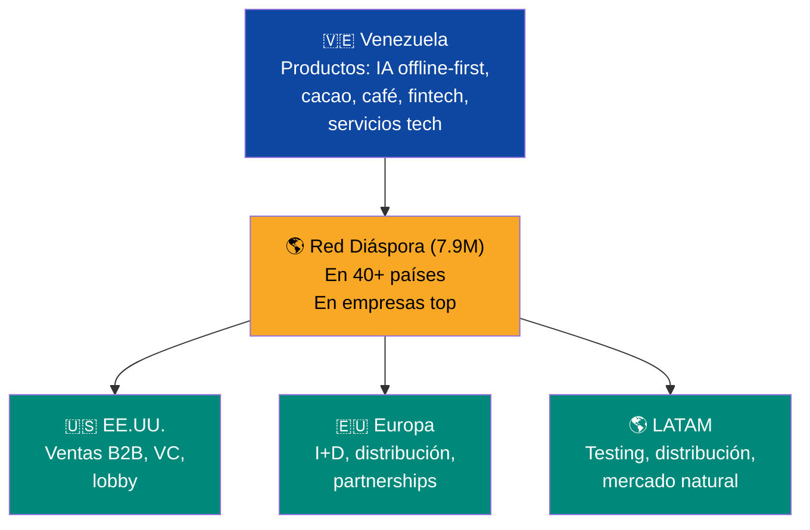

# Programa de Retorno: Traer el Talento de Vuelta

:::tip En pocas palabras
7,9 millones de venezolanos se fueron. Este plan les ofrece una razón concreta para volver: su cuenta FCV los espera, el mercado laboral necesita su experiencia, y pueden ser co-fundadores — no empleados.
:::

:::caution Fechas ilustrativas — las fases se activan por KPIs, no por calendario
Las referencias a "Año X" en este documento son **ilustrativas**. Las fases reales se activan por condiciones verificables (PIB/cápita, formalización, pobreza). Ver [KPIs de Activación](/07-ejecucion/kpis-activacion).
:::

> La diáspora no es solo capital. Son 7,9 millones de personas que adquirieron habilidades, idiomas, redes y experiencia que Venezuela necesita desesperadamente.

## El Capital Humano Perdido

[7,9 millones de venezolanos](https://www.unhcr.org/us/emergencies/venezuela-situation) en el exterior. Entre ellos hay médicos, ingenieros, programadores, profesores, enfermeros, contadores — la clase profesional que emigró entre 2015 y 2024. Contribuyen [>USD 10.600 M/año](https://www.cnn.com/2026/01/24/americas/venezuelans-in-exile-consider-return-latam-intl) a economías de LATAM.

| Perfil | Necesidad en Venezuela | Incentivo de retorno |
|--------|----------------------|---------------------|
| Médicos y enfermeros | Cobertura universal de salud | Salario competitivo + vivienda + bono repatriación |
| Ingenieros (petróleo, civil, eléctrico) | Reconstrucción de PDVSA + infraestructura | Contrato con majors + salario intl. |
| Programadores y tech | Hubs tech y data centers | Visa tech + salario competitivo + equity en startups |
| Profesores | Reforma educativa | Salario digno + programas de formación |
| Emprendedores | Ecosistema de startups | ZEET + 0% impuesto + capital semilla |
| Profesionales (contadores, abogados, gestores) | Estado digital + sector financiero | Reconocimiento de títulos + inserción rápida |

## Por Qué Volver Es Mejor Negocio Que Quedarse

:::danger Cero subsidios, cero bonos, cero exenciones
Este plan NO ofrece "bonos de repatriación", subsidios de vivienda ni vacaciones fiscales. El flat tax de 15% aplica a **todos** — retornantes incluidos. La razón para volver no es lo que el gobierno te regala. Es lo que el **mercado** te ofrece: equity, salarios competitivos en USD, un mercado de 40M de personas reconstruyéndose, y tu cuenta FCV acumulando desde el día 1.
:::

### Lo que te espera al volver (no es un regalo — es tu derecho como ciudadano-accionista)

| Mecanismo | Qué es | Cómo funciona |
|-----------|--------|---------------|
| **FCV activo desde el día 1** | Tu Fondo Ciudadano Venezuela (5 subcuentas) se activa al emplearte formalmente | Retiro 8% + Salud 7% + Vivienda 4% + Educación 2% + Cesantía 2% = 23% de tu salario. Si tienes hijos, Venezuela S.A. contribuye USD 150/mes por niño |
| **FCV Vivienda** | Subcuenta para comprar propiedad | Acumula desde el primer empleo. Si vuelves con ahorros, el [catastro digital](/06-realidad/estado-digital) garantiza títulos limpios — compras sin intermediarios |
| **Reconocimiento de títulos (30 días)** | Homologación express de credenciales internacionales | Proceso automatizado vía estado digital. Elimina la barrera #1 para profesionales retornantes. Modelo [Chile](https://www.mineduc.cl/)/[Colombia](https://www.mineducacion.gov.co/) |
| **Flat tax 15%** | Mismo impuesto que todos los demás | No hay exención. 15% ya es más bajo que lo que pagas en España (45%), EE.UU. (37%), Chile (35%) o Colombia (39%). **Eso ES el incentivo fiscal** |
| **Equity en concesiones y startups** | Participación real en la reconstrucción | Ver sección [Co-Fundadores](#co-fundadores-no-inversores-pasivos) abajo. No es salario — es propiedad |
| **Acceso a capital** | Para emprender, no para sobrevivir | Bonos ciudadanos, VIN, programas [Semilla/Ignite Venezuela](/05-transformacion/startup-programs). Inviertes tu dinero, Venezuela S.A. hace match. No es un regalo |

### Inserción laboral: el mercado contrata, no el gobierno

| Canal | Cómo funciona |
|-------|---------------|
| **Plataforma de matching** (Pre-Seed) | Conecta talento retornante con empleos reales: JVs petroleras, concesiones de infraestructura, hospitales privados, colegios privados, startups. El algoritmo cruza experiencia internacional con demanda del mercado |
| **Competencia abierta** | No hay cuotas ni prioridad por ser retornante. La ventaja competitiva es la experiencia internacional: idiomas, estándares, redes. El mercado paga por eso — no necesitas un programa gubernamental que lo certifique |
| **Emprendimiento** | Mismas condiciones que cualquier ciudadano. Acceso a programas [Semilla/Ignite Venezuela](/05-transformacion/startup-programs) por mérito. Tu ventaja: conoces mercados de destino que los locales no |

### Modelo bilateral: no todos necesitan volver

| Modalidad | Descripción | Qué ganas |
|-----------|-------------|-----------|
| **Retorno físico** | Mudarse a Venezuela | FCV activo + equity en concesiones + acceso completo al mercado laboral |
| **Retorno parcial** | 3-6 meses/año en Venezuela | FCV proporcional + contribución remota + residencia en país de acogida |
| **Contribución remota** | Trabajo remoto para empresas venezolanas | Contrato en USD + FCV proporcional + participación en programas de equity |
| **Inversión directa** | Invertir en bonos/startups desde el exterior | Bonos ciudadanos + VIN + retorno de mercado |
| **Mentoría** | Asesorar startups/instituciones venezolanas | Red de advisors + equity simbólico en startups que asesoras |

### Meta

| Indicador | Año 3 | Año 7 | Año 15 |
|-----------|-------|-------|--------|
| Retornantes físicos | 100.000 | 500.000 | 1.500.000 |
| Contribuyentes remotos | 200.000 | 500.000 | 1.000.000 |
| Inversores diáspora activos | 79.000 (1% Pre-Seed) | 400.000 | 2.000.000 |

**Costo incremental del programa de retorno:** USD 15-60M (plataforma de matching USD 10-50M + sistema de reconocimiento de títulos USD 5-10M). El FCV ya existe para todos los ciudadanos. Los empleos los crean las concesiones (ya presupuestadas). Los programas de equity ya están en el plan. **No hay bonos, no hay subsidios, no hay gasto nuevo significativo.**

---

## Co-Fundadores, No Inversores Pasivos

:::danger El patriotismo no es un modelo de retorno
La diáspora no va a volver por amor a la patria. Requarth (VivaReal, fundador venezolano que construyó un unicornio en Brasil) lo dijo claro: "Los venezolanos en el exterior ya reconstruyeron sus vidas. Para que vuelvan necesitan **equity** — participación real, no un bono de USD 5.000 y un discurso." Si el programa ofrece solo salario + vivienda, compite contra empleos estables en Madrid, Miami, Santiago y Bogotá. **Pierde.** Si ofrece equity — ser co-fundador de la reconstrucción — cambia la ecuación.
:::

### Modelo de equity para retornantes

La diferencia entre un empleado que vuelve y un co-fundador que vuelve es abismal. El empleado se va cuando le ofrecen más en otro lado. El co-fundador tiene skin in the game — su patrimonio está atado al éxito del proyecto.

| Programa | Qué obtienes | Compromiso requerido | Referencia |
|----------|-------------|---------------------|-----------|
| **Equity en concesiones** | 5-15% de equity en concesiones de infraestructura (puertos, autopistas, telecoms) para el retornante que lidera el proyecto | 3 años de residencia + liderazgo operativo | Israel — emprendedores del programa [Talpiot](https://en.wikipedia.org/wiki/Talpiot_program) reciben equity en empresas de defensa/tech que co-fundan |
| **Co-fundación de startups** | Matched equity (el fondo iguala la inversión del fundador) + visa tech fast-track + USD 50-100K en capital semilla | Fundar y operar la empresa en Venezuela | Chile — [Start-Up Chile](https://www.startupchile.org/) otorga USD 40-80K equity-free; Venezuela S.A. va más allá con matched equity |
| **Liderazgo técnico en SOEs** | Equity stake (2-8%) en divisiones de PDVSA, CVG, CANTV que el retornante reestructura y lleva a rentabilidad | 5 años de compromiso ejecutivo | Singapur — ejecutivos de [Temasek Holdings](https://www.temasek.com.sg/) reciben equity en empresas del portafolio que gestionan |
| **Retorno académico** | Equity en spin-offs de laboratorio + tenure track + presupuesto de investigación | 5 años en universidad venezolana | China — [Thousand Talents Plan](https://en.wikipedia.org/wiki/Thousand_Talents_Plan) (sin las controversias de espionaje): lab + funding + posición permanente para investigadores que retornan |

### Los primeros 50 importan más que los siguientes 5.000

Lee Kuan Yew documentó este patrón en la construcción de Singapur: cuando los primeros 50 profesionales de alto calibre retornaron y **les fue bien visiblemente** — salario competitivo, equity real, calidad de vida — los siguientes 5.000 vinieron solos. El efecto es exponencial, no lineal.

| Fase | Meta | Estrategia |
|------|------|-----------|
| **Los primeros 50** (año 1) | 50 líderes técnicos de alto perfil | Reclutamiento directo, paquetes de equity agresivos, cobertura mediática de cada retorno |
| **Los primeros 500** (año 2) | 500 profesionales calificados | Programa estructurado, matchmaking con concesiones y startups |
| **Los primeros 5.000** (año 3-5) | 5.000 retornantes con equity | El efecto red ya funciona: los primeros 500 reclutan desde sus redes internacionales |

:::tip El efecto TikTok del retorno
Cuando el ingeniero #23 publica en redes que tiene 10% de equity en la concesión del puerto de La Guaira y que su patrimonio se triplicó en 2 años, no hace falta programa de reclutamiento. La historia se vende sola. **Las historias de éxito de co-fundadores son el mejor marketing de retorno.**
:::

---

## La Diáspora como Red de Distribución (Sin Necesidad de Que Vuelvan)

> 7.9M de venezolanos en los centros de poder del mundo son una red de distribución, ventas y capital que ninguna zona franca puede crear artificialmente. — [Parra Carrillo](https://www.linkedin.com/in/andresparracarrillo/)

El plan se enfoca en traer gente de vuelta. Pero la diáspora **donde está hoy** ya es un activo productivo — una red de distribución orgánica para productos y servicios venezolanos.

### Mapa de la red

| Ubicación | Venezolanos est. | Sectores donde están | Valor como red de distribución |
|-----------|-----------------|---------------------|-------------------------------|
| **EE.UU.** (Miami, Houston, NYC) | ~800K | Finanzas, tech, petróleo, salud | Canal de ventas B2B para startups venezolanas en el mercado #1 del mundo. Puerta a VC americano |
| **España** (Madrid, Barcelona) | ~400K | Servicios, salud, hospitality | Gateway a mercado europeo. Conexión con fondos españoles de VC |
| **Colombia** (Bogotá, Medellín) | ~3M | Servicios, comercio, emprendimiento | Mercado vecino + tester natural para productos LATAM |
| **Chile** (Santiago) | ~500K | Tech, servicios, emprendimiento | Ecosistema startup maduro. Start-Up Chile como puente |
| **Perú, Ecuador, Brasil** | ~1.5M | Comercio, servicios | Red de distribución en toda Sudamérica |
| **Europa (otros)** | ~400K | Academia, ingeniería, medicina | Partnerships de I+D, transferencia de tecnología |

### 3 modelos de activación sin retorno físico

| Modelo | Cómo funciona | Ingreso estimado | Referencia |
|--------|--------------|-----------------|-----------|
| **Red de ventas tech** | Venezolanos en EE.UU./Europa venden soluciones de IA offline-first (desarrolladas en Venezuela) a empresas de sus países de residencia. Comisión 10-20% | USD 100-500M/año (a escala) | [Israel: 25% del PIB son exportaciones tech vendidas por la diáspora en Silicon Valley](https://innovationisrael.org.il/) |
| **Canal de inversión** | Plataforma donde la diáspora invierte desde afuera en startups y concesiones venezolanas. No necesitan volver — necesitan acceso a deal flow | USD 1-5B/año en inversión directa | [India: diáspora invierte USD 80B/año en la economía doméstica](https://www.worldbank.org/en/topic/migration/brief/migration-and-remittances) |
| **Distribución de productos** | Productos venezolanos (cacao, café, software, servicios) se distribuyen a través de venezolanos que ya están en esos mercados y conocen los canales | USD 200-800M/año en exportaciones facilitadas | [Irlanda: la diáspora irlandesa en EE.UU. es el canal principal de inversión hacia Irlanda](https://www.idaireland.com/) |

:::info No es retorno O distribución — son complementarios
Los que vuelven lideran operaciones en Venezuela. Los que se quedan son el canal de distribución global. **Ambos tienen equity** — el co-fundador que opera desde Caracas y el representante de ventas que opera desde Miami. Israel funciona exactamente así: las empresas están en Tel Aviv, las ventas están en Silicon Valley.
:::

---

### Integración con el plan

El modelo de co-fundación se conecta directamente con:
- **[Equipo ejecutor](/07-ejecucion/equipo-ejecutor):** los retornantes con equity son candidatos naturales para posiciones de liderazgo en VIN
- **[Startups](/05-transformacion/startup-programs):** el programa Ignite Venezuela ya contempla capital semilla; el matched equity lo potencia
- **[Concesiones](/06-realidad/infraestructura-basica):** cada concesión de infraestructura reserva 5-15% de equity para el equipo ejecutor retornante
- **[Inversión ciudadana](/03-ciudadanos/inversion-ciudadana):** los retornantes también participan como ciudadanos en bonos y dividendos — el equity de co-fundación es **adicional**

**Costo incremental:** USD 200-500 M en 5 años (equity es participación en valor futuro, no gasto directo). El costo real es el riesgo de que el retornante no rinda — mitigado por vesting a 3-5 años y métricas de desempeño.
