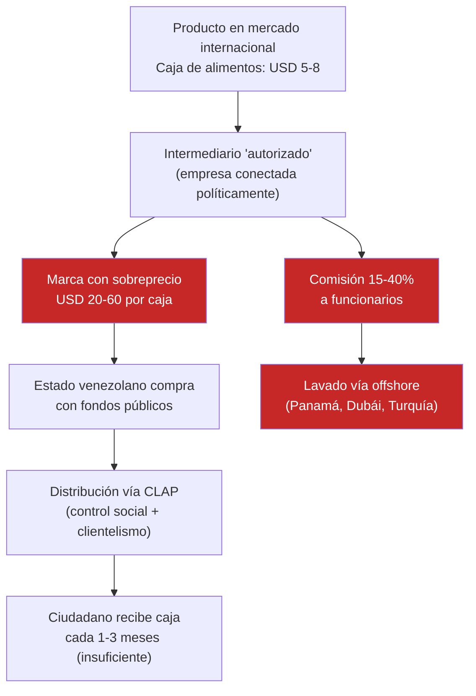
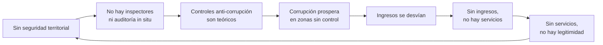
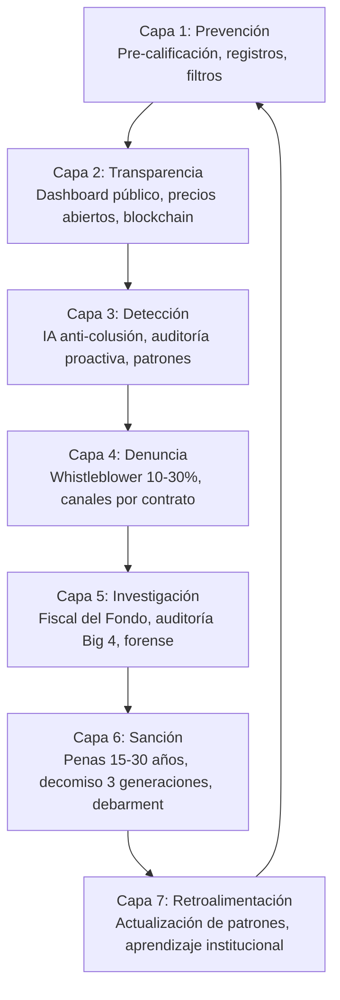
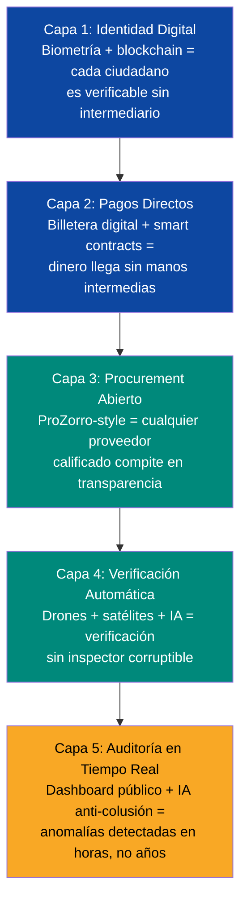

# Blindaje de Integridad: Mapa Completo de Vulnerabilidades

> Cada área del plan tiene vectores de corrupción específicos. No basta con reglas generales — hay que cerrar cada puerta, una por una. Este documento mapea **14 áreas × 12 patrones de corrupción** con mitigaciones concretas.

:::danger Lección de Venezuela 2000-2025
La corrupción no es aleatoria. Sigue patrones predecibles que se repiten en cada área de gasto público. [FONDEN desvió USD 300B+](https://transparenciave.org/) usando los mismos mecanismos una y otra vez: intermediarios, sobreprecios, empresas fantasma, y captura regulatoria. Si conoces los patrones, puedes bloquearlos.
:::

---

## Los 12 Patrones de Corrupción Venezolana

| # | Patrón | Mecanismo | Ejemplo histórico |
|---|--------|-----------|-------------------|
| 1 | **Empresa de maletín** | Sociedad fantasma recibe contrato, cobra anticipo, desaparece | Miles de empresas FONDEN/CADIVI |
| 2 | **Sobreprecios / intermediarios** | Comprador estatal paga 3-10x el precio de mercado vía intermediario | [CLAP: cajas de USD 5 vendidas al Estado por USD 20-60](https://armando.info/series/los-empresarios-del-hambre/) |
| 3 | **Captura regulatoria** | Funcionario diseña regulación que beneficia a empresa específica | CENCOEX: cupos a dólar preferencial para "aliados" |
| 4 | **Nómina fantasma** | Empleados ficticios en nómina pública cobran salario | Ministerios con 50%+ de nómina inflada |
| 5 | **Desvío de commodity** | Producto subsidiado se desvía al mercado negro o exportación ilegal | Gasolina venezolana → Colombia; PDVAL alimentos podridos |
| 6 | **Fraude en licitaciones** | Colusión entre licitantes; una empresa presenta 3 ofertas diferentes | Contratos de obra pública PDVSA |
| 7 | **Soborno directo** | Pago a funcionario por aprobación, permiso o contrato | "La mordida" en trámites gubernamentales |
| 8 | **Lavado vía concesión** | Concesión pública usada para lavar dinero de actividades ilícitas | Minería ilegal en Arco Minero |
| 9 | **Fraude en tierras/propiedad** | Títulos de propiedad falsificados o expropiación para reventa | Tierras expropiadas "productivas" que nunca producen |
| 10 | **Captura militar** | FANB controla actividad económica y extrae rentas | [Minería ilegal, contrabando fronterizo, puertos](https://insightcrime.org/) |
| 11 | **Fraude aduanero** | Subfacturación, contrabando, exenciones discrecionales | Aduanas como "peaje" controlado por mafias |
| 12 | **Certificación fantasma** | Títulos, diplomas o certificaciones emitidos sin cumplir requisitos | Universidades que venden títulos; certificaciones laborales falsas |

---

## El Patrón CLAP: Anatomía del Sobreprecio Institucionalizado

:::danger Este patrón es el más peligroso porque parece legítimo
El sistema CLAP (Comités Locales de Abastecimiento y Producción) fue presentado como programa social. En realidad fue el mayor esquema de sobreprecio de alimentos en la historia de Venezuela: intermediarios compraban alimentos a precios de mercado internacional y los vendían al Estado venezolano a **3-10x su valor**, con comisiones del 15-40% para funcionarios.
:::



**Costo estimado:** USD 10-20B en sobreprecios entre 2016-2025 ([Armando.info](https://armando.info/series/los-empresarios-del-hambre/), [OCCRP](https://www.occrp.org/)).

### Protección Anti-CLAP en el Plan

| Control | Mecanismo | Referencia |
|---------|-----------|-----------|
| **Base de datos de precios referenciales** | Todo contrato se compara con precio de mercado internacional. Desviación >15% → investigación automática | [KONEPS, Corea del Sur](https://www.pps.go.kr/eng/) |
| **Prohibición de intermediarios no registrados** | Solo proveedores directos o distribuidores con margen máximo regulado (≤12%) | [EU procurement directives](https://single-market-economy.ec.europa.eu/single-market/public-procurement_en) |
| **Auditoría de cadena de suministro** | Trazabilidad completa: fabricante → importador → distribuidor → destino final | [ProZorro, Ucrania](https://prozorro.gov.ua/en) |
| **Rotación de proveedores** | Ningún proveedor >25% del volumen total en cualquier categoría | Anti-monopolio |
| **Precios abiertos** | Todo precio pagado por el Estado es público en tiempo real | [Open Contracting Partnership](https://www.open-contracting.org/) |
| **Canal de denuncia por contrato** | Cada contrato tiene su propio canal de whistleblower. Recompensa 10-30% del ahorro identificado | [SEC Whistleblower, EE.UU.](https://www.sec.gov/whistleblower) |

---

## Mapa de Vulnerabilidades por Área del Plan

### 1. Fondo Soberano

| Vulnerabilidad | Patrón | Prob. | Mitigación |
|---------------|--------|-------|-----------|
| Board capturado por gobierno populista | Captura regulatoria | Alta | Selección 4 de 7 miembros por entidades no-gubernamentales; remoción requiere 4/5 supermayoría + causa |
| Custodia manipulada | Desvío | Media | Custodia offshore (JPMorgan/HSBC); auditoría Big 4 trimestral; blockchain público |
| Mandato de inversión relajado | Captura regulatoria | Media | Límites constitucionales: ≥60% renta fija soberana AAA, ≤5% en un solo activo |
| Fees excesivos a gestores | Sobreprecios | Media | Benchmark público de fees; 3 cotizaciones mínimo; comité de compensación independiente |
| Uso del fondo como garantía de deuda | Captura regulatoria | Media-Alta | Prohibición constitucional de usar fondo como colateral. Ref: [Alaska PFD](https://pfd.alaska.gov/) |

**Ref:** [Gobernanza del fondo](/02-motor-financiero/fondo-soberano) · [Santiago Principles](https://www.ifswf.org/santiago-principles)

### 2. Petróleo y Gas

| Vulnerabilidad | Patrón | Prob. | Mitigación |
|---------------|--------|-------|-----------|
| Contratos de servicio inflados | Sobreprecios | Alta | Benchmarking con [Rystad Energy](https://www.rystadenergy.com/) por tipo de servicio; 3 ofertas mínimo |
| JV con empresas fantasma | Empresa de maletín | Media | Pre-calificación: 5+ años de operación, USD 100M+ en activos verificables |
| Producción no reportada | Desvío de commodity | Media | Medidores fiscales certificados + auditoría satelital de quema de gas |
| Intermediarios en ventas de crudo | Sobreprecios/CLAP | Media-Alta | Ventas directas a refinerías; sin brokers no registrados; precio Brent - descuento público |
| Contratos de transporte inflados | Sobreprecios | Media | Tarifas benchmark por ruta; subastas abiertas |

**Ref:** [Contratos forward](/02-motor-financiero/contratos-forward) · [EITI](https://eiti.org/)

### 3. Deuda y Reestructuración

| Vulnerabilidad | Patrón | Prob. | Mitigación |
|---------------|--------|-------|-----------|
| Asesores legales con conflicto de interés | Captura regulatoria | Media | Divulgación de clientes; prohibición de representar acreedores y deudor simultáneamente |
| Descuentos excesivos en canje | Soborno | Media-Baja | Comité independiente; comparación con reestructuraciones similares (Ecuador 2020, Argentina 2020) |
| Side deals con acreedores preferidos | Soborno | Media | Cláusula pari passu; disclosure total de acuerdos |
| Litigantes profesionales capturan activos | Fraude legal | Media | Defensa legal coordinada; protección de activos críticos (Citgo en trust) |

**Ref:** [Deuda](/02-motor-financiero/deuda)

### 4. Infraestructura y PPP

| Vulnerabilidad | Patrón | Prob. | Mitigación |
|---------------|--------|-------|-----------|
| Concesionario sin capacidad real | Empresa de maletín | Alta | Pre-calificación: 3+ proyectos similares completados; capital ≥10% del contrato |
| Sobrecostos sin justificación | Sobreprecios | Alta | Presupuesto base público; variaciones >15% requieren aprobación independiente + auditoría |
| Subcontratación en cadena | Empresa de maletín | Media-Alta | Máximo 2 niveles de subcontratación; cada nivel con mismos filtros de pre-calificación |
| Obras abandonadas | Fraude | Media | Anticipo máximo 15%; desembolso contra hito verificado; fianza de cumplimiento del 20% |
| Inspectores corruptos | Soborno | Media | Rotación aleatoria de inspectores; drones + fotos satelitales como verificación cruzada |
| Terrenos sobrevalorados | Fraude en tierras | Media | 3 avalúos independientes; comparación con transacciones recientes en zona |

**Ref:** [Infraestructura](/06-realidad/infraestructura-basica) · [Sistema anti-frágil](/04-gobernanza/sistema-antifragil)

### 5. Emergencia Humanitaria (Fase 0)

| Vulnerabilidad | Patrón | Prob. | Mitigación |
|---------------|--------|-------|-----------|
| Medicamentos desviados | Desvío de commodity | Alta | Trazabilidad lote a lote; distribución vía ONG verificadas (MSF, Cruz Roja) |
| Alimentos sobrepreciados (patrón CLAP) | Sobreprecios | Alta | Compra directa vía WFP/UNICEF; precios de mercado verificables; sin intermediarios |
| Nómina fantasma en programa de emergencia | Nómina fantasma | Media-Alta | Identificación biométrica de beneficiarios; auditoría aleatoria mensual |
| Control social vía distribución | Captura regulatoria | Media | Distribución descentralizada; múltiples canales; sin condicionamiento político |

**Ref:** [Fase 0](/01-fundamentos/fase-0-emergencia)

### 6. Educación

| Vulnerabilidad | Patrón | Prob. | Mitigación |
|---------------|--------|-------|-----------|
| Certificaciones fantasma | Certificación fantasma | Media-Alta | Verificación digital de asistencia + exámenes estandarizados; auditoría de resultados (empleo, notas) |
| Escuelas que no operan pero cobran | Empresa de maletín | Media | Inspección aleatoria; registro de matrícula digital; pago contra asistencia verificada |
| Compra de equipos que no llegan | Sobreprecios | Media | Verificación en destino; garantía 2 años; penalidad por incumplimiento |
| Contratos de consultoría educativa inflados | Sobreprecios | Media | Benchmark con tarifas de organismos internacionales (UNESCO, BID) |

**Ref:** [Educación](/05-transformacion/educacion)

### 7. Salud

| Vulnerabilidad | Patrón | Prob. | Mitigación |
|---------------|--------|-------|-----------|
| Equipos médicos facturados y no entregados | Sobreprecios | Alta | Verificación en destino + inventario digital + garantía de funcionamiento |
| Medicamentos vencidos o falsificados | Desvío/fraude | Media-Alta | Trazabilidad blockchain; verificación de lotes con OMS; compra vía PAHO |
| Sobreprecios en insumos (patrón CLAP-salud) | Sobreprecios | Alta | Base de datos de precios referenciales (ref: [WHO Essential Medicines](https://www.who.int/groups/expert-committee-on-selection-and-use-of-essential-medicines)); margen máximo 12% |
| Nómina fantasma en hospitales | Nómina fantasma | Media | Registro biométrico de asistencia; auditoría aleatoria |

**Ref:** [Servicios públicos](/06-realidad/servicios-publicos)

### 8. Minería y Arco Minero

| Vulnerabilidad | Patrón | Prob. | Mitigación |
|---------------|--------|-------|-----------|
| Front legal para minería ilegal | Empresa de maletín / lavado | Alta | Beneficiarios finales obligatorios; inspección in situ trimestral; trazabilidad blockchain de origen |
| FANB controla zonas mineras | Captura militar | Alta | Recuperación territorial gradual (años 1-5); profesionalización; cooperación internacional |
| Regalías no reportadas | Desvío de commodity | Media-Alta | Medición independiente de producción; comparación con exportaciones declaradas |
| Concesiones a precio político | Captura regulatoria | Media | Subasta pública internacional; precios de mercado (ref: Botswana-De Beers) |

**Ref:** [Diversificación](/05-transformacion/diversificacion) · [Seguridad física](/04-gobernanza/seguridad-fisica)

### 9. Tech, Startups y ZEETs

| Vulnerabilidad | Patrón | Prob. | Mitigación |
|---------------|--------|-------|-----------|
| Startup falsa para captar grants | Empresa de maletín | Media | Desembolso en 3 tramos contra hitos; auditoría de aceleradora; demo day obligatorio |
| Shell company en ZEET para evasión | Lavado vía concesión | Media | Operación física verificable; nómina mínima; auditoría aleatoria anual |
| Facturación ficticia en ZEET | Fraude | Media | Cruce con datos aduaneros + clientes; inspección aleatoria |
| Contratos de data center inflados | Sobreprecios | Media-Baja | Benchmark con precios globales (Equinix, Digital Realty); transparencia total |

**Ref:** [Hubs tech](/05-transformacion/hubs-tech) · [Startup programs](/05-transformacion/startup-programs)

### 10. Pensiones y Seguridad Social

| Vulnerabilidad | Patrón | Prob. | Mitigación |
|---------------|--------|-------|-----------|
| Pensionados fantasma | Nómina fantasma | Alta | Registro biométrico; proof of life digital trimestral; cruce con registro civil |
| Fondos de pensión mal invertidos | Captura regulatoria | Media | Mandato de inversión constitucional; supervisión independiente; benchmark de rendimiento |
| Administradoras con fees excesivos | Sobreprecios | Media | Fee máximo por ley (1.5% AUM); benchmark con sistemas comparables (Chile AFP) |

**Ref:** [Pensiones](/06-realidad/pensiones-seguridad-social)

### 11. Propiedad y Tierras

| Vulnerabilidad | Patrón | Prob. | Mitigación |
|---------------|--------|-------|-----------|
| Títulos de propiedad falsificados | Fraude en tierras | Alta | Registro digital blockchain; verificación cruzada con catastro + fotos satelitales |
| Expropiaciones para reventa a aliados | Captura regulatoria | Media-Alta | Prohibición constitucional de expropiación sin compensación de mercado + revisión judicial |
| Avalúos manipulados | Soborno | Media | 3 avalúos independientes; rotación de peritos; comparación con transacciones de mercado |

**Ref:** [Estado de derecho](/04-gobernanza/estado-derecho-moneda) · [Los que se quedaron](/03-ciudadanos/los-que-se-quedaron)

### 12. Aduanas y Comercio Exterior

| Vulnerabilidad | Patrón | Prob. | Mitigación |
|---------------|--------|-------|-----------|
| Subfacturación de importaciones | Fraude aduanero | Alta | Escaneo 100% de contenedores; cruce con datos de exportación del país de origen (modelo [ASYCUDA, UNCTAD](https://asycuda.org/)) |
| Exenciones discrecionales | Captura regulatoria | Media-Alta | Exenciones solo por ley (no discrecional); lista pública de beneficiarios |
| Contrabando de extracción | Desvío de commodity | Media | Monitoreo satelital de fronteras; cooperación con Colombia/Brasil/Guyana |

**Ref:** [Comercio exterior](/05-transformacion/comercio-exterior)

### 13. Commodity Trading (Forwards)

| Vulnerabilidad | Patrón | Prob. | Mitigación |
|---------------|--------|-------|-----------|
| Intermediarios fantasma en forward contracts | Sobreprecios | Media | Contrapartes directas (majors: Shell, Chevron, TotalEnergies); sin brokers no registrados |
| Descuento excesivo al vender forward | Captura regulatoria | Media | Comité de pricing independiente; benchmark con mercados de referencia (Brent, WTI) |
| Side deals no revelados | Soborno | Media-Baja | Disclosure total de todos los contratos; auditoría Big 4 semestral |

**Ref:** [Contratos forward](/02-motor-financiero/contratos-forward)

### 14. Diáspora e Inversión Ciudadana

| Vulnerabilidad | Patrón | Prob. | Mitigación |
|---------------|--------|-------|-----------|
| Organización falsa capta inversiones | Empresa de maletín | Media | Plataforma centralizada con KYC/AML; auditoría de uso de fondos; regulación valores |
| Fraude en VIN (Venezuela Investment Notes) | Fraude | Media-Baja | Emisión regulada (SEC-equivalente); custodia en bolsa internacional; auditoría trimestral |
| Uso político de la plataforma | Captura regulatoria | Baja-Media | Gobernanza independiente de la plataforma; prohibición de propaganda en canal de inversión |

**Ref:** [Inversión ciudadana](/03-ciudadanos/inversion-ciudadana) · [Diáspora](/03-ciudadanos/diaspora)

---

## 5 Vulnerabilidades Estructurales No Cubiertas por Controles Estándar

Además de los patrones individuales, hay vulnerabilidades sistémicas que requieren soluciones a nivel de diseño:

### 1. Control Militar de Zonas Económicas

Las FANB controlan directamente actividades en: minería (Arco Minero), contrabando fronterizo (Táchira, Zulia, Bolívar), puertos y aduanas, y distribución de alimentos/combustible ([InSight Crime, 2024](https://insightcrime.org/)).

**Mitigación:**
- DDR adaptado con componente económico (reintegración productiva)
- Recuperación territorial gradual: zonas piloto (ZEETs) → expansión progresiva
- Cooperación internacional (Colombia, EE.UU.) como contrapeso
- Reforma militar: 350.000 → 120.000 efectivos con paquetes de retiro dignos
- **Prerequisito:** Sin security first, las protecciones anti-corrupción son papel

### 2. Presión Geopolítica vs. Transparencia

EE.UU. actualmente controla las ventas de petróleo venezolano vía licencias OFAC. China y Rusia tienen USD 50B+ en deuda. Ambos pueden presionar para relajar controles de transparencia como condición de cooperación.

**Mitigación:**
- Transparencia como condición no negociable de cualquier acuerdo
- Adhesión a [EITI](https://eiti.org/) como señal internacional
- Diversificación de socios para no depender de un solo bloque
- Sociedad civil + prensa internacional como watchdogs

### 3. Riesgo de Absorción (Capacity Constraint)

Gastar USD 550-750B en 15 años requiere capacidad institucional que no existe. Sin capacidad, los fondos se desperdician o se roban. [Angola perdió ~30% de USD 68B en infraestructura por ineficiencia](https://www.brookings.edu/).

**Mitigación:**
- Ramp-up gradual: USD 3-5B/año (años 1-3) → USD 12-15B (años 8-15)
- Concesiones PPP con operadores internacionales experimentados
- [Capital humano](/05-transformacion/capital-humano): 3 canales (diáspora + reskilling + expertise extranjera)
- Benchmarking de costos por proyecto vs. comparables regionales

### 4. Efecto Sustitución (Migración de Corrupción)

Cuando bloqueas un canal de corrupción, el dinero migra a otro menos visible. Ejemplo: cuando Venezuela cerró CADIVI, la corrupción migró a CENCOEX, luego a CLAP, luego a minería ilegal.

**Mitigación:**
- Dashboard de integridad en tiempo real que monitorea todos los canales simultáneamente
- Análisis de patrones anómalos con IA (modelo [KONEPS, Corea del Sur](https://www.pps.go.kr/eng/))
- Whistleblower con recompensas (10-30% del ahorro) como sensor distribuido
- Auditoría forense proactiva (no solo reactiva): rotación aleatoria de áreas auditadas
- Actualización continua de patrones de riesgo (este documento es versión 1.0)

### 5. El Constraint Vinculante: Seguridad



**Esto es el riesgo #1 de todo el plan.** Todas las protecciones anti-corrupción asumen que hay Estado de derecho en el territorio. En zonas donde operan grupos armados (pranatos, FANB extractiva, guerrilla colombiana, minería ilegal), los controles no funcionan.

**Mitigación:** Ver [Seguridad física](/04-gobernanza/seguridad-fisica) — la recuperación territorial es prerequisito, no consecuencia, del plan económico.

---

## Heat Map: Patrón × Área

```
                    Fund  Oil  Debt Infra Emerg Edu  Salud Min  Tech Pens Prop Aduana Fwd  Dias
Empresa maletín      ·    ●    ·    ●●    ·    ●    ·    ●●    ●    ·    ·    ·     ·    ●
Sobreprecios/CLAP    ●    ●●   ·    ●●    ●●   ●    ●●   ·    ·    ●    ·    ·     ●    ·
Captura regulatoria  ●●   ·    ●    ·     ●    ·    ·    ●    ·    ●    ●●   ●●    ●    ·
Nómina fantasma      ·    ·    ·    ·     ●●   ·    ●    ·    ·    ●●   ·    ·     ·    ·
Desvío commodity     ·    ●    ·    ·     ●●   ·    ·    ●●   ·    ·    ·    ●●    ·    ·
Fraude licitación    ·    ●    ·    ●●    ·    ·    ·    ·    ·    ·    ·    ·     ·    ·
Soborno              ·    ·    ●    ●     ·    ·    ·    ·    ·    ·    ●    ●     ·    ·
Lavado concesión     ·    ·    ·    ·     ·    ·    ·    ●●   ●    ·    ·    ·     ·    ·
Fraude tierras       ·    ·    ·    ●     ·    ·    ·    ·    ·    ·    ●●   ·     ·    ·
Captura militar      ·    ·    ·    ·     ·    ·    ·    ●●   ·    ·    ·    ●     ·    ·
Fraude aduanero      ·    ·    ·    ·     ·    ·    ·    ·    ·    ·    ·    ●●    ·    ·
Certificación falsa  ·    ·    ·    ·     ·    ●●   ·    ·    ·    ·    ·    ·     ·    ·

·  = riesgo bajo o no aplica
●  = riesgo medio
●● = riesgo alto (prioridad de mitigación)
```

---

## Stack de Defensa: 7 Capas



Cada transacción del Estado debe pasar por al menos **3 de las 7 capas**. Si una capa falla, las siguientes la respaldan. Esto es defensa en profundidad aplicada a la integridad pública.

---

## KPIs de Integridad (medición anual)

| KPI | Meta Año 1 | Meta Año 5 | Meta Año 10 | Benchmark |
|-----|-----------|-----------|------------|-----------|
| % de contratos con precio dentro de ±15% del referencial | >70% | >90% | >95% | KONEPS: 97% |
| Tiempo promedio de detección de anomalía | <90 días | <30 días | <7 días | Estonia: <5 días |
| % de beneficiarios finales registrados | >80% | >95% | 100% | UK PSC: 98% |
| Denuncias procesadas / recibidas | >60% | >80% | >90% | SEC: 85% |
| Contratos con auditoría post-adjudicación | >30% | >60% | >80% | Noruega: 75% |
| Índice CPI (Transparency International) | 20→25 | 35-40 | 50+ | Georgia: 16→52 en 10 años |
| Satisfacción ciudadana con transparencia | Baseline | >50% | >70% | Estonia: 72% |

---

## Costo del Blindaje

| Componente | Costo anual estimado | Referencia |
|-----------|---------------------|-----------|
| Plataforma digital de contrataciones | USD 5-10M | [ProZorro costo USD 3M](https://prozorro.gov.ua/en) (ajustado por escala) |
| Sistema de detección IA | USD 10-15M | [KONEPS](https://www.pps.go.kr/eng/) |
| Auditoría Big 4 (fondo + contratos) | USD 20-30M | Benchmark auditorías soberanas |
| Fiscal del Fondo + equipo | USD 5-8M | Modelo CPIB Singapur |
| Inspectores independientes (rotación) | USD 15-25M | ~500 inspectores + logística |
| Whistleblower rewards | USD 10-50M (variable) | [SEC pagó USD 1.3B en 12 años](https://www.sec.gov/whistleblower) |
| **Total** | **USD 65-138M/año** | **<0.1% del gasto total del plan** |

:::tip El blindaje se paga solo
Si el sistema previene **1% de corrupción** sobre USD 50B/año en gasto público, el ahorro es **USD 500M/año** — 4-8x el costo del sistema de integridad. Georgia redujo corrupción de ~80% a ~5% en 2 años con una inversión similar en proporción a su PIB.
:::

---

## Principio Anti-Intermediarios: Zero Middlemen by Design

:::danger El patrón CLAP es el patrón de TODA la corrupción venezolana
CLAP no fue una excepción — fue la regla. **Cada programa social, contrato público y servicio gubernamental en Venezuela fue capturado por intermediarios que extrajeron 40-70% del valor.** CADIVI: intermediarios compraban dólares a Bs. 6,30 y los vendían a Bs. 100+. Misiones sociales: intermediarios cobraban por "beneficiarios" que no existían. PDVSA: intermediarios facturaban servicios a 3-10x precio de mercado. **El intermediario es el vector principal de corrupción en Venezuela.**
:::

### El principio de diseño

**Toda transacción del Estado con ciudadanos, proveedores o inversores debe tener arquitectura anti-intermediarios por defecto.** No es un control adicional — es un requisito de diseño. Si un mecanismo requiere un intermediario humano para funcionar, el diseño está mal.

### Tabla de rediseño anti-intermediarios

| Programa / Área | Diseño tradicional (CON intermediario) | Diseño anti-intermediarios | Tecnología habilitante | Ahorro estimado | Cross-ref |
|-----------------|---------------------------------------|---------------------------|----------------------|----------------|-----------|
| **Transferencias sociales** | Vía comité local (CLAP) — intermediario decide quién recibe, cuánto, cuándo. Extracción: **40-70%** | Directo a billetera digital del ciudadano — sin comité, sin intermediario, verificación biométrica | Blockchain + biometría + identidad digital ([India Aadhaar-DBT](https://dbtbharat.gov.in/): USD 33B ahorrados) | **40-60%** del costo actual | [Fase 0](/01-fundamentos/fase-0-emergencia) · [Ciudadanos](/03-ciudadanos/los-que-se-quedaron) |
| **Compras públicas (procurement)** | Vía broker o "empresa amiga" — precio inflado 3-10x, kickback al funcionario | Marketplace abierto tipo [ProZorro](https://prozorro.gov.ua/en) — precios públicos, cualquier proveedor calificado puede ofertar, adjudicación automática | Plataforma e-procurement + IA anti-colusión + precios referenciales automáticos | **30-50%** en sobreprecios eliminados | [Infraestructura](/06-realidad/infraestructura-basica) · [Salud](/06-realidad/servicios-publicos) |
| **Inversión ciudadana (VIN)** | Vía sucursal bancaria — banco cobra comisión, trámites lentos, acceso limitado a zonas con sucursal | App directa — KYC digital, compra de VIN desde el celular, custodia en bolsa internacional | Fintech + smart contracts + custodia digital ([Robinhood](https://robinhood.com/) / [eToro](https://www.etoro.com/) model) | **80-90%** en comisiones bancarias | [Inversión ciudadana](/03-ciudadanos/inversion-ciudadana) |
| **Contratos de infraestructura** | Vía empresa intermediaria que subcontrata al constructor real — margen del intermediario: **20-40%** | Directo al constructor, desembolso por hito verificado con smart contract — pago automático cuando drone/satélite confirma avance | Smart contracts + verificación satelital + drones + milestone-based payments | **20-35%** del costo total del proyecto | [Infraestructura](/06-realidad/infraestructura-basica) · [PPP](#4-infraestructura-y-ppp) |
| **Salud: insumos y medicamentos** | Vía distribuidor farmacéutico con marca-up de **50-200%** (patrón CLAP-salud) | Compra directa vía PAHO/OMS a fabricante + supply chain blockchain de lote a lote hasta hospital | Blockchain supply chain + compra centralizada vía organismos multilaterales + trazabilidad | **40-60%** en sobreprecios de insumos | [Servicios públicos](/06-realidad/servicios-publicos) · [Salud](#7-salud) |
| **Educación: materiales y equipos** | Vía proveedor "autorizado" — equipos facturados y no entregados, o entregados sin funcionar | Compra directa a fabricante vía licitación abierta + verificación de entrega en destino con foto/video | E-procurement + verificación en destino + garantía de funcionamiento vinculada al pago | **25-40%** en compras fantasma eliminadas | [Educación](/05-transformacion/educacion) · [Educación](#6-educación) |
| **Reparaciones a víctimas** | Vía ONG intermediaria o abogado que cobra 30-50% del monto de reparación | Pago directo a cuenta digital de víctima verificada biométricamente | Identidad digital + pago directo + auditoría automática | **30-50%** en extracción de intermediarios | [Justicia transicional](/04-gobernanza/justicia-transicional) |
| **Pensiones** | Vía administradora con fees opacos de **2-4% AUM** | Administradora con fee máximo **1.5% AUM** por ley + rendimiento público + cambio libre entre administradoras | Plataforma digital de pensiones + benchmark público + portabilidad | **50-70%** en fees excesivos | [Pensiones](/06-realidad/pensiones-seguridad-social) · [Pensiones](#10-pensiones-y-seguridad-social) |

### El stack tecnológico anti-intermediarios



### Precedente: India Aadhaar-DBT

El caso más exitoso de eliminación de intermediarios a escala nacional:

| Métrica | Antes de Aadhaar-DBT | Después de Aadhaar-DBT | Fuente |
|---------|---------------------|----------------------|--------|
| Beneficiarios fantasma | **30-40%** de beneficiarios no existían | **<3%** filtrados automáticamente | [World Bank, 2023](https://www.worldbank.org/en/country/india) |
| Intermediarios en transferencias | 3-5 niveles de intermediarios | **Zero** — pago directo a cuenta Aadhaar | [DBT Bharat](https://dbtbharat.gov.in/) |
| Ahorro acumulado | — | **USD 33B+** en transferencias directas (2014-2024) | [Government of India, DBT Dashboard](https://dbtbharat.gov.in/) |
| Cobertura | ~50% de la población | **1.400 M** de personas con identidad digital | [UIDAI](https://uidai.gov.in/) |

:::tip Si India pudo eliminar intermediarios para 1.400 M de personas, Venezuela puede hacerlo para 40 M
La tecnología existe. Los modelos están probados. La diferencia entre USD 5 que llegan al ciudadano y USD 5 que desaparecen en intermediarios es una decisión de diseño, no de presupuesto.
:::

---

> **La corrupción es un problema de diseño, no de cultura. Si diseñas el sistema para que robar sea difícil, caro y visible, la gente deja de robar. Si lo diseñas para que robar sea fácil, barato e invisible — como Venezuela 2000-2025 — todo el mundo roba.**
