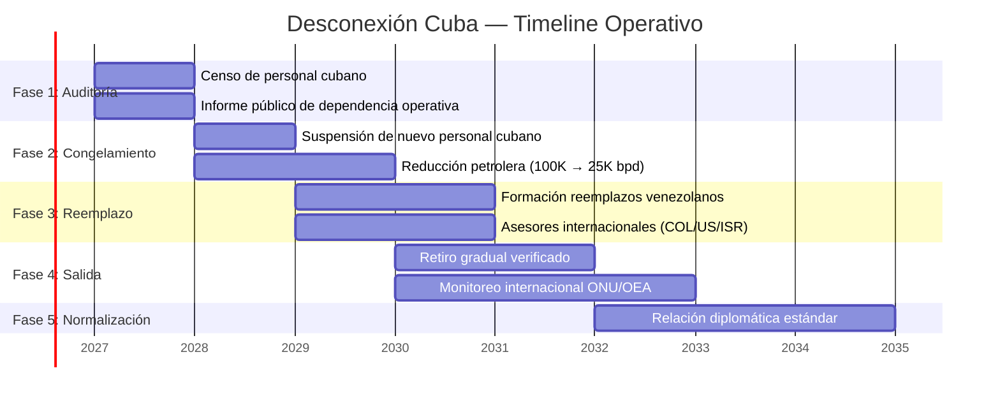
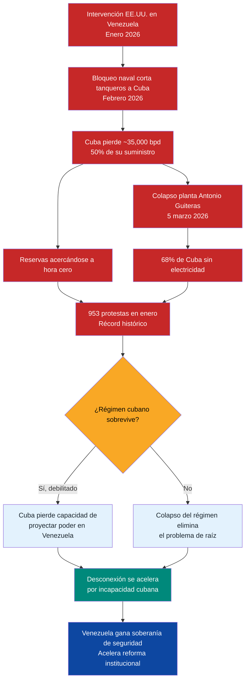

# Cuba: Desconexión del Aparato de Seguridad

> Sin desconectar a Cuba del aparato de seguridad venezolano, no hay reforma institucional viable, no hay alivio de sanciones y no hay soberanía real. Esto no es geopolítica teórica — es un prerrequisito operativo.

Cuba no "asesora" al aparato de seguridad venezolano. Lo **diseñó, lo opera y lo supervisa**. SEBIN fue modelado sobre la G-2 cubana. DGCIM fue creada con asistencia directa de La Habana. La doctrina de la FANB incorpora control político al estilo cubano. Mientras esta estructura exista, cualquier reforma de seguridad que proponga este plan — desde la [purga policial modelo Georgia](/04-gobernanza/seguridad-fisica) hasta la reforma de la FANB — enfrenta un actor con incentivos directos para sabotearla.

Marco Rubio, Secretario de Estado de EE.UU., ha sido explícito: la influencia cubana en Venezuela es una línea roja para cualquier normalización bilateral. María Corina Machado lo ha señalado como condición para una transición democrática real.

:::danger Punto ciego crítico
La sección de [geopolítica](/04-gobernanza/geopolitica) del plan no menciona a Cuba. Esto fue identificado como un punto ciego con calificación **1/10** en evaluación independiente. Esta sección lo corrige.
:::

---

## Presencia Cubana Actual

| Institución | Presencia estimada | Función | Impacto en soberanía | Fuente |
|-------------|-------------------|---------|---------------------|--------|
| **FANB** (Fuerzas Armadas) | [Requiere investigación] | Asesores doctrinarios, control político de oficiales, inteligencia militar | Control de lealtad + bloqueo de reforma interna | [International Crisis Group](https://www.crisisgroup.org/) |
| **SEBIN** (Inteligencia) | [Requiere investigación] | Estructura organizacional modelada sobre G-2 cubana, métodos de vigilancia, personal incrustado | Venezuela no controla su propia inteligencia | [InSight Crime](https://insightcrime.org/) |
| **DGCIM** (Contrainteligencia militar) | [Requiere investigación] | Diseñada y supervisada por cubanos, interrogatorios, vigilancia interna de FANB | Instrumento de control político, no de defensa | [IISS](https://www.iiss.org/) |
| **Misiones sociales** (salud, educación) | **~20.000–40.000** personas [Requiere investigación — cifras varían ampliamente] | Médicos, educadores, trabajadores sociales — funciones legítimas con cobertura de inteligencia | Red de información territorial + legitimidad política | [Reuters](https://www.reuters.com/) |
| **PDVSA** (sector petrolero) | [Requiere investigación] | Personal en operaciones, logística, comercialización | Acceso a información comercial estratégica | [Crisis Group](https://www.crisisgroup.org/) |

:::info Cifras en disputa
Las estimaciones de personal cubano en Venezuela varían entre **20.000 y 60.000** dependiendo de la fuente y si incluyen misiones sociales. No existe censo verificable. Esta sección marca todas las cifras como [Requiere investigación] hasta obtener datos de inteligencia confiables post-transición.
:::

---

## Por Qué Cuba No Se Va Voluntariamente

Cuba depende económicamente de Venezuela. No es ideología — es supervivencia fiscal.

| Flujo de Venezuela a Cuba | Valor estimado | % del PIB cubano (~USD 107B PPA) | Fuente |
|---------------------------|---------------|----------------------------------|--------|
| Petróleo subsidiado | **~100.000 bpd** → ~USD 2.2B/año a USD 60/barril | ~2% | [Reuters, 2024](https://www.reuters.com/) |
| Pagos en efectivo por servicios | **USD 400–800M/año** [Requiere investigación] | ~0.5-0.7% | [Economist](https://www.economist.com/) |
| Acceso a divisas vía PDVSA | [Requiere investigación] | — | — |
| **Total estimado** | **~USD 2.5–3.5B/año** | **~2.5-3.5%** | Consolidado |

**Venezuela es el segundo socio económico más importante de Cuba** después de las remesas de la diáspora cubana. Perder este flujo equivale a una crisis económica para La Habana.

Esto significa que Cuba solo se retira bajo tres escenarios:

1. **Alternativa económica** — alguien (China, Rusia, o un acuerdo internacional) compensa la pérdida
2. **Presión insostenible** — el costo de quedarse supera el beneficio (sanciones secundarias agresivas)
3. **Negociación con garantías** — exit package con monitoreo internacional

---

## Plan de Desconexión por Fases

| Fase | Período | Acción clave | Condición previa | Riesgo principal |
|------|---------|-------------|-----------------|-----------------|
| **1. Auditoría** | Año 0–1 | Censo completo de personal cubano en cada institución. Informe público transparente. Evaluación de dependencia operativa | Gobierno de transición instalado | Cuba obstruye el censo; datos clasificados destruidos |
| **2. Congelamiento** | Año 1–2 | Cero personal cubano nuevo. Congelamiento gradual de envíos petroleros (100K → 50K → 25K bpd). Renegociación de acuerdos bilaterales | Auditoría completada + alternativas de inteligencia en marcha | Cuba retalia con sabotaje de información |
| **3. Reemplazo** | Año 2–3 | Formación de reemplazos venezolanos. Asesores internacionales (Colombia, EE.UU., Israel). Nueva doctrina de inteligencia nacional | Personal alternativo entrenado | Vacío de capacidad operativa temporal |
| **4. Salida** | Año 3–5 | Retiro gradual verificado. Monitoreo internacional (ONU/OEA). Desclasificación de archivos | Capacidad venezolana operativa al 80%+ | Resistencia de elementos pro-Cuba dentro de FANB |
| **5. Normalización** | Año 5+ | Cuba como socio diplomático normal. Sin rol en seguridad. Relación comercial estándar | Retiro completado y verificado | Reinfiltración encubierta |

---

## Modelos Internacionales de Desconexión

| Caso | Período | Mecanismo | Resultado | Lección para Venezuela | Fuente |
|------|---------|-----------|-----------|----------------------|--------|
| **URSS → Europa del Este** | 1989–1991 | Colapso económico soviético + presión popular + negociación bilateral | Retiro completo en ~2 años. Independencia institucional lograda | El colapso económico del patrón acelera la salida. Pero deja vacío de capacidad | [IISS](https://www.iiss.org/) |
| **Cuba → Angola** | 1988–1991 | Acuerdo Tripartito (Cuba-Sudáfrica-Angola). Mediación de EE.UU. Retiro de **50.000 tropas** en 27 meses | Retiro completo verificado por ONU (UNAVEM) | Un exit negociado con verificación internacional funciona. Cuba cumple cuando hay incentivo | [UN UNAVEM](https://peacekeeping.un.org/) |
| **URSS → Egipto** | 1972 | Sadat expulsó **~15.000** asesores soviéticos unilateralmente | Ruptura abrupta. Egipto perdió capacidad militar temporal pero ganó soberanía + alianza con EE.UU. | La expulsión unilateral es posible pero costosa a corto plazo | [IISS](https://www.iiss.org/) |
| **Rusia → Siria** | 2024–2025 | Caída de Assad eliminó la base de operación | Retiro forzado por cambio de régimen | Sin patrón local, la presencia colapsa | Análisis post-2024 |

:::tip Precedente clave: Angola
Cuba retiró **50.000 tropas** de Angola en 27 meses bajo el Acuerdo Tripartito de 1988. Fue verificado por la misión UNAVEM de la ONU. Si Cuba cumplió un retiro de esa escala con verificación internacional, puede hacerlo en Venezuela. El modelo Angola es la referencia operativa.
:::

---

## Costo de la Desconexión

| Dimensión | Lo que Venezuela pierde (corto plazo) | Lo que Venezuela gana (mediano-largo plazo) |
|-----------|--------------------------------------|-------------------------------------------|
| **Inteligencia** | Capacidad operativa de SEBIN/DGCIM se degrada temporalmente (6–18 meses) | Inteligencia soberana, alianzas con Five Eyes/Mossad, capacidad propia |
| **Control militar** | Mecanismos de lealtad interna se debilitan → riesgo de facciones | FANB profesional con doctrina propia, no de control político |
| **Misiones sociales** | Pérdida temporal de médicos/educadores cubanos en zonas vulnerables | Programa propio de salud rural + contratación internacional |
| **Gasto petrolero** | "Ahorro" de **~USD 2.2B/año** en petróleo que iba a Cuba | USD 2.2B/año redirigidos al fondo soberano o inversión interna |
| **Relación con EE.UU.** | — | **Desbloqueo de alivio de sanciones** — condición Rubio satisfecha |
| **Soberanía** | — | Venezuela controla sus propias instituciones de seguridad |

:::caution Balance neto
El costo real es un **vacío de capacidad de inteligencia de 6–18 meses** que debe llenarse antes de que el retiro cubano sea completo. Todo lo demás es ganancia neta. La clave es la secuencia: reemplazos primero, retiro después.
:::

---

## Requisito Bilateral EE.UU.

Marco Rubio ha sido explícito en múltiples declaraciones: la desconexión cubana es una **condición previa** para cualquier normalización de relaciones con Venezuela.

| Condición EE.UU. | Estatus | Impacto en el plan |
|-------------------|---------|-------------------|
| Eliminación de influencia cubana en seguridad | **Gating requirement** — sin esto, no hay alivio de sanciones significativo | Bloquea Fases 1-2 del roadmap de sanciones |
| Elecciones libres verificadas | Prerrequisito político | Wright: "probablemente" durante mandato Trump |
| Transparencia en ingresos petroleros | En progreso (cuentas controladas por EE.UU.) | Ver [geopolítica](/04-gobernanza/geopolitica) |
| Cooperación antinarcóticos | Requiere capacidad de seguridad soberana | Depende de desconexión cubana |

**Implicación directa:** Sin ejecutar este plan de desconexión, el roadmap de sanciones se estanca y la inversión petrolera de USD 183B no se materializa. Cuba es el cuello de botella geopolítico del plan.

---

## Riesgo: Retaliación Cubana

| Escenario de retaliación | Probabilidad | Impacto | Mitigación |
|--------------------------|-------------|---------|------------|
| **Sabotaje de inteligencia** — destrucción de archivos, desinformación, compromiso de agentes | Alta | Alto | Respaldo de información antes de auditoría. Cooperación con agencias internacionales |
| **Activación de redes internas** — elementos pro-Cuba en FANB/SEBIN sabotean transición | Media-Alta | Crítico | Identificación temprana vía auditoría. Purga selectiva con debido proceso |
| **Filtración de información clasificada** — Cuba publica/vende inteligencia venezolana | Media | Alto | Cambio inmediato de protocolos, códigos, redes de comunicación |
| **Desestabilización vía colectivos** — Cuba activa grupos paramilitares afines | Media | Alto | DDR acelerado de colectivos. Ver [seguridad física](/04-gobernanza/seguridad-fisica) |
| **Presión diplomática** — Cuba moviliza aliados (Nicaragua, Bolivia) contra Venezuela | Baja | Bajo | Irrelevante si EE.UU. respalda la transición |

### Mitigación central: Nuevas alianzas de inteligencia

| Socio potencial | Capacidad | Precedente | Timeline |
|-----------------|-----------|------------|----------|
| **EE.UU. (CIA/DEA)** | HUMINT, SIGINT, antinarcóticos | Cooperación pre-Chávez (hasta 2005) | Inmediato post-transición |
| **Colombia (DIJIN/Ejército)** | Inteligencia fronteriza, contrainsurgencia | Mayor experiencia regional contra ELN/FARC | Año 1 |
| **Israel (Mossad/Shin Bet)** | Contrainteligencia, ciberseguridad, entrenamiento | Asesores en Colombia, Georgia, Singapur | Año 1-2 |
| **Reino Unido (MI6/GCHQ)** | SIGINT, inteligencia financiera | Five Eyes affiliate | Año 2-3 |
| **Francia (DGSE)** | Inteligencia en Caribe/Guyana Francesa | Presencia regional directa | Año 2-3 |

---

## Conexión con el Plan

| Sección del plan | Dependencia de desconexión cubana |
|-----------------|----------------------------------|
| [Seguridad física](/04-gobernanza/seguridad-fisica) | La reforma policial y FANB requiere eliminar el control cubano primero |
| [Geopolítica](/04-gobernanza/geopolitica) | Rubio condiciona alivio de sanciones a desconexión |
| [Justicia transicional](/04-gobernanza/justicia-transicional) | Archivos de SEBIN/DGCIM bajo control cubano son evidencia clave |
| [Anticorrupción](/04-gobernanza/anticorrupcion-checklist) | Cuba protege redes de corrupción dentro de FANB/PDVSA |
| [Sistema antifragil](/04-gobernanza/sistema-antifragil) | No hay sistema resiliente con un actor externo controlando la inteligencia |

:::danger Secuencia no negociable
**Auditoría → Reemplazo → Retiro → Verificación.** Nunca al revés. Expulsar sin reemplazar crea un vacío que otros actores (Rusia, crimen organizado) pueden llenar. El modelo no es Egipto 1972 (expulsión abrupta). El modelo es Angola 1988 (retiro negociado, verificado, con timeline).
:::

---

## Crisis Cubana 2026: La Desconexión Está Ocurriendo por Defecto

:::danger Actualización marzo 2026
La intervención militar de EE.UU. en Venezuela (enero 2026) y el bloqueo naval posterior están ejecutando una desconexión Cuba-Venezuela no planificada. Cuba enfrenta su peor crisis desde el Período Especial. Esto no es teoría — está pasando.
:::

### Los datos duros

| Indicador | Dato | Fuente |
|-----------|------|--------|
| Petróleo venezolano a Cuba (pre-intervención) | **~35.000 bpd** = **~50%** del suministro cubano | [Requiere investigación] |
| Bloqueo de tanqueros a Cuba | EE.UU. bloqueando tanqueros desde **febrero 2026** | [Requiere investigación] |
| Protestas en enero 2026 | **953 protestas** — récord histórico | [Requiere investigación] |
| Colapso planta Antonio Guiteras | **5 marzo 2026** — 68% de la isla sin electricidad | [Requiere investigación] |
| Cubanos muertos en operación Venezuela | **32** (personal militar/inteligencia en misiones) | [Requiere investigación] |
| Alerta de la ONU | Advierte posible "colapso" humanitario | [Requiere investigación] |
| Estado de reservas de combustible | Acercándose a "hora cero" — depleción total | [Requiere investigación] |

### 32 muertos = prueba del aparato

Los **32 cubanos muertos durante la operación en Venezuela** no eran médicos ni maestros. Eran personal militar y de inteligencia en misiones activas. Esto confirma lo que esta sección ha documentado: Cuba no "asesora" — **opera** dentro del aparato de seguridad venezolano.

:::info Validación del diagnóstico
Esta sección fue creada para corregir un punto ciego calificado 1/10. Los 32 cubanos muertos en operaciones militares/inteligencia durante la intervención de enero 2026 son la evidencia empírica más directa de la profundidad de la penetración cubana en el aparato de seguridad venezolano. El diagnóstico era correcto.
:::

### La desconexión no planificada

El bloqueo naval de EE.UU. cortó de facto el subsidio petrolero venezolano a Cuba. Sin necesidad de negociación, sin timeline de fases, sin Acuerdo Tripartito. La desconexión energética está ocurriendo por presión externa.

| Fase del plan original | Lo que está pasando (mar. 2026) |
|------------------------|---------------------------------|
| **Fase 1: Auditoría** (Año 0-1) | No ejecutada formalmente, pero la intervención expuso estructura cubana. Los 32 muertos revelan presencia operativa |
| **Fase 2: Congelamiento** (Año 1-2) | Ocurriendo por defecto. Bloqueo naval cortó petróleo. Cuba no puede enviar nuevo personal |
| **Fase 3: Reemplazo** (Año 2-3) | Urgente. El vacío ya existe. Asesores internacionales deben entrar ahora, no en Año 2 |
| **Fase 4: Salida** (Año 3-5) | Parcialmente forzada. Personal cubano sin apoyo logístico ni petrolero |
| **Fase 5: Normalización** (Año 5+) | Depende de estabilidad del régimen cubano — que está en cuestión |

:::caution Timeline acelerado
El plan original asumía 5+ años para la desconexión completa. La intervención de EE.UU. comprimió las fases 1-2 a meses. Esto es bueno para la soberanía pero peligroso para la estabilidad: el vacío de capacidad de inteligencia que preveíamos en 6-18 meses **ya está aquí**. Las alianzas de reemplazo (CIA/DEA, Colombia, Israel) deben activarse con urgencia máxima.
:::

### Cuba se acerca al colapso: implicaciones

Cuba enfrenta una crisis existencial. La ONU advierte de colapso humanitario. Las protestas alcanzan niveles récord. La infraestructura energética falla.

**Tres escenarios para Cuba:**

| Escenario | Probabilidad | Impacto en Venezuela |
|-----------|-------------|---------------------|
| **Régimen sobrevive debilitado** — ajusta, reprime protestas, busca nuevos patrones (China/Rusia) | Media | Cuba pierde capacidad de mantener presencia en Venezuela. Desconexión se completa por incapacidad, no por acuerdo |
| **Transición interna** — presión popular + crisis energética fuerza apertura gradual | Baja-Media | Nuevo gobierno cubano no tiene incentivo para mantener aparato en Venezuela. Desconexión natural |
| **Colapso humanitario** — hora cero se alcanza, crisis migratoria masiva, intervención humanitaria | Baja | Desconexión inmediata y total, pero genera crisis regional. Venezuela puede recibir ola migratoria cubana |

### Ajuste al plan: qué hacer ahora

1. **Acelerar alianzas de inteligencia.** El vacío ya existe. CIA/DEA y Colombia deben estar operando en semanas, no en años.
2. **Auditoría de emergencia.** Identificar todo personal cubano remanente en SEBIN, DGCIM y FANB. La intervención facilitó esto — los archivos están más accesibles.
3. **No enviar petróleo a Cuba.** La tentación humanitaria existe, pero cada barrel enviado a Cuba es un barrel fuera del fondo soberano. Cuba tiene otros socios potenciales (México, Rusia, China).
4. **Preparar para migración cubana.** Si Cuba colapsa, Venezuela será destino. Plan migratorio necesario.
5. **Redirigir los USD 2.2B/año.** El subsidio petrolero a Cuba (~USD 2.2B/año a USD 60/barril) es ahora ingreso recuperado. Va directo al fondo soberano.

:::tip Ahorro directo: USD 2.2B/año
Los ~35.000-100.000 bpd que iban a Cuba subsidiados ahora se venden a precio de mercado o se redirigen al fondo soberano. A **USD 60/barril**, esto representa entre **USD 766M y USD 2.2B/año** en ingresos recuperados. Es el primer "quick win" financiero de la desconexión.
:::
