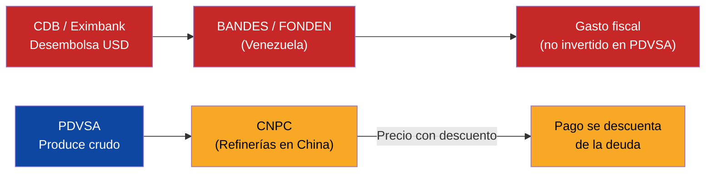
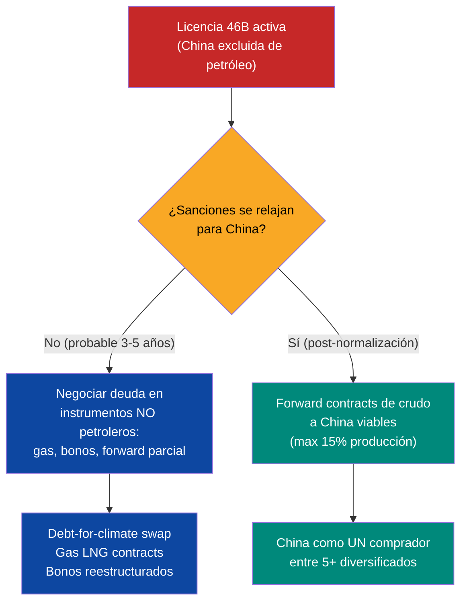
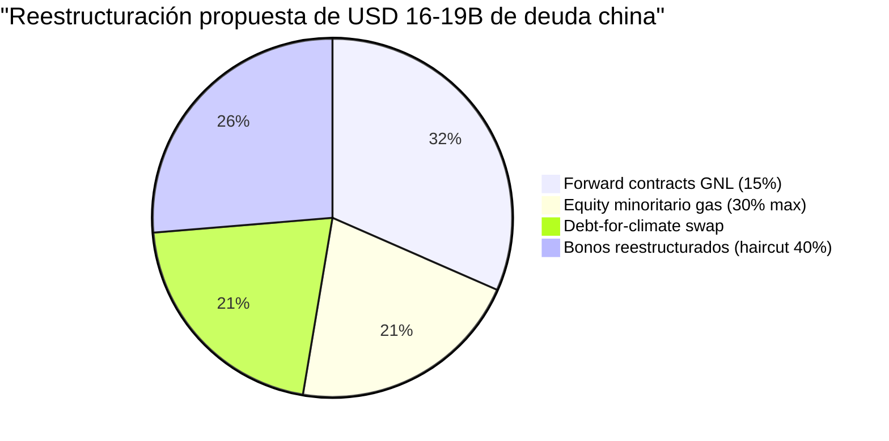
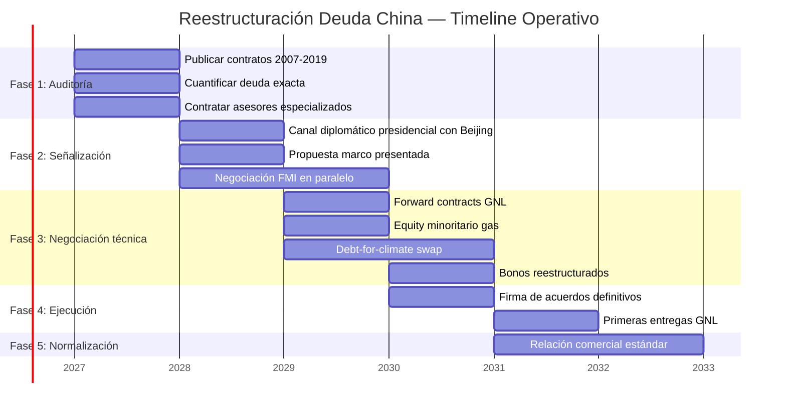

# Estrategia China: Reestructurar USD 19B Sin Entregar Soberanía

:::tip En pocas palabras
Venezuela le debe ~USD 19B a China por préstamos que se pagan con petróleo. China no perdona deuda — la intercambia por acceso a recursos. Esta sección define cómo reestructurar esa deuda sin entregar puertos, telecoms, minerales ni soberanía. El modelo: convertir una relación de dependencia en una relación comercial normal.
:::

:::caution Fechas ilustrativas — las fases se activan por KPIs, no por calendario
Las referencias a "Año X" en este documento son **ilustrativas**. Las fases reales se activan por condiciones verificables (PIB/cápita, formalización, pobreza). Ver [KPIs de Activación](/07-ejecucion/kpis-activacion).
:::

> La deuda con China es el punto ciego #1 del plan en geopolítica. Calificación previa: **5/10** (negociador bilateral China). No se puede reestructurar USD 150-170B en deuda total ignorando al acreedor más estratégico y menos transparente. Esta sección lo corrige.

---

## La Deuda: USD 19B en Préstamos Oil-for-Loans

### Estructura de los préstamos

China prestó un total de **USD 62.3B** a Venezuela desde 2007 — la cifra más alta de préstamos chinos a un solo país en el mundo. El vehículo principal fue el **Fondo Conjunto China-Venezuela (FCCV)**, operado entre el China Development Bank (CDB) y BANDES (Banco de Desarrollo Económico y Social de Venezuela).

| Acreedor | Monto original | Instrumento | Colateral | Pendiente estimado (2025) | Fuente |
|----------|---------------|-------------|-----------|--------------------------|--------|
| **CDB** (China Development Bank) | ~USD 50B+ (múltiples tramos) | Oil-for-loans vía FCCV | Entregas de crudo a CNPC | **~USD 10-12B** | [AidData](https://www.aiddata.org/publications/banking-on-the-belt-and-road) |
| **China Eximbank** | ~USD 11.9B | Préstamos para operaciones petroleras y JVs | Producción de JVs CNPC-PDVSA | **~USD 5-7B** | [AidData](https://china.aiddata.org/projects/39099/) |
| **TOTAL** | **~USD 62.3B desembolsados** | — | — | **~USD 16-19B pendientes** | [Transparencia Venezuela](https://transparenciave.org/), [Brookings](https://www.brookings.edu/articles/how-china-lends/) |

:::info ¿A dónde fue el dinero?
De los USD 62.3B desembolsados, Venezuela repagó ~USD 43-46B en entregas de crudo entre 2007 y 2019. Los pagos se interrumpieron significativamente en 2016 por el colapso de producción de PDVSA. Desde entonces, la deuda acumula intereses y arrears. Los contratos originales son **secretos** — no existe disclosure público de tasas, condiciones ni cronogramas exactos.
:::

### Cómo funciona el oil-for-loans

**Lo que salió mal:**

| Problema | Consecuencia | Fuente |
|----------|-------------|--------|
| Un solo comprador (China recibía ~85% del crudo) | Dependencia total, sin poder de negociación | [Columbia CGEP](https://www.energypolicy.columbia.edu/venezuela-china-oil-ties-severely-impacted-by-us-action/) |
| Contratos secretos sin supervisión | Imposible auditar condiciones, tasas, descuentos | [Brookings](https://www.brookings.edu/articles/how-china-lends/) |
| Dinero no fue a PDVSA | Producción colapsó de 3M a <1M bpd; capacidad de repago destruida | [Rystad Energy] |
| Sin tope de volumen ni floor de precio | Venezuela vendió crudo a descuento sin protección | [AidData](https://www.aiddata.org/blog/how-chinas-oil-backed-lending-in-venezuela-fell-into-distress) |
| CDB se clasifica como "comercial" | Evita marcos multilaterales de reestructuración (Paris Club, G20 Common Framework) | [Harvard MRC-BG](https://www.hks.harvard.edu/centers/mrcbg/publications/awp/awp248) |

---

## Qué Quiere China

China no es un acreedor filantrópico. Es un acreedor estratégico. Sus objetivos son claros y jerarquizados:

| Prioridad | Qué quiere China | Instrumento | Nivel de flexibilidad |
|-----------|-----------------|-------------|----------------------|
| **1. Acceso a petróleo** | Asegurar suministro de crudo pesado para refinerías en China | Entregas via CNPC, forward contracts | **Medio** — acepta restructurar si mantiene acceso |
| **2. Acceso a minerales críticos** | Coltan, tierras raras, oro, bauxita del [Arco Minero](/10-oportunidades/minerales-criticos) | Concesiones mineras, JVs | **Alto** — es la nueva prioridad de Beijing |
| **3. Foothold geopolítico** | Presencia en hemisferio occidental, contrapeso a EE.UU. | Puertos, telecoms, bases logísticas | **Bajo** — es donde Venezuela debe decir NO |
| **4. Recuperar capital** | Cobrar los USD 16-19B pendientes | Repago en especie, haircut parcial | **Medio** — prefiere acceso a recursos sobre cash |
| **5. No-alineamiento** | Que Venezuela no sea 100% aliada de EE.UU. | Presión diplomática, voto en ONU | **Bajo** — realista, no determinante |

:::danger Lo que China NO dice pero hace
El patrón global de China es **debt-for-asset**. Sri Lanka entregó el [puerto de Hambantota por 99 años](https://www.nytimes.com/2018/06/25/world/asia/china-sri-lanka-port.html). Zambia retrasó su reestructuración [3 años](https://www.hks.harvard.edu/centers/mrcbg/publications/awp/awp248) por resistencia de CDB. En Congo Brazzaville, la negociación tardó 2 años para un monto mucho menor. China juega lento — y espera que la urgencia del deudor genere concesiones.
:::

---

## Qué Quiere Venezuela

| Prioridad | Qué quiere Venezuela | Condición | Red line |
|-----------|---------------------|-----------|----------|
| **1. Haircut significativo** | Reducción de USD 16-19B a USD 8-12B (40-50% haircut NPV) | Extensión de plazos + período de gracia | Haircut mínimo 30% NPV |
| **2. Soberanía sobre minerales** | Control nacional del Arco Minero; China como comprador, no como operador | JVs con max 30% participación china en gas; 0% en minería de control | Zero equity chino en minería estratégica |
| **3. Libertad geopolítica** | Ser aliado de EE.UU. sin perder a China como socio comercial | Modelo dual (ver [comparables](#modelo-dual-cómo-otros-países-balancean-eeuu-y-china)) | No sacrificar relación con EE.UU. por China |
| **4. Transparencia contractual** | Publicar todos los contratos China-Venezuela | Auditoría completa de acuerdos 2007-2019 | Zero contratos secretos going forward |
| **5. Diversificación de compradores** | China max 15% de exportaciones petroleras (vs 85% histórico) | Forward contracts con 5+ compradores | Nunca >20% a un solo comprador |

---

## La Restricción OFAC: Licencia 46B y China

:::danger OFAC prohíbe explícitamente a China
La [Licencia 46B de OFAC](https://www.infobae.com/venezuela/2026/03/14/eeuu-autorizo-a-las-empresas-estadounidenses-realizar-negocios-con-el-sector-petrolero-venezolano/) (14 de marzo de 2026) autoriza a todas las empresas estadounidenses a operar en el sector petrolero venezolano **pero excluye explícitamente transacciones que involucren personas ubicadas en China, Rusia, Irán, Corea del Norte o Cuba.** Esto incluye entidades venezolanas o estadounidenses controladas por empresas chinas.
:::

| Aspecto | Impacto en la relación China-Venezuela |
|---------|----------------------------------------|
| **CNPC/Sinovensa (JV PDVSA-CNPC)** | Operaciones en zona gris legal — existían pre-46B, pero nuevas inversiones bloqueadas |
| **Nuevos contratos petroleros con China** | **Prohibidos** bajo Licencia 46B mientras esté vigente |
| **Comercio de crudo a China** | Solo vía rutas no-sancionadas; riesgo de sanciones secundarias |
| **Minería (Arco Minero)** | Licencia 46B autoriza oro para empresas de EE.UU.; China excluida |
| **Forward contracts con compradores chinos** | No viables mientras 46B esté activa con restricción China |

**Implicación estratégica:** La negociación con China **no puede incluir petróleo ni oro** mientras la Licencia 46B esté vigente con restricciones a China. Esto limita las opciones de repago pero también protege a Venezuela de entregar activos petroleros a Beijing.

### Ventana de negociación

---

## Precedente Ecuador: Lo Que Funcionó y Lo Que No

Ecuador es el caso más directamente comparable: país petrodependiente, deuda china significativa, necesidad de FMI, gobierno democrático negociando.

### Los datos

En 2022, el ministro de finanzas **Simón Cueva** renegoció ~USD 4.6B en deuda china:

| Parámetro | Ecuador | Venezuela (propuesta) |
|-----------|---------|----------------------|
| **Deuda china total** | ~USD 4.6B (CDB + Eximbank) | ~USD 16-19B |
| **Haircut** | 0% (reprofiling, no reducción) | **30-50% NPV** (necesario por volumen) |
| **Mecanismo** | Extensión de vencimientos (2027 CDB, 2032 Eximbank) | Extensión + haircut + conversión parcial |
| **Ahorro** | USD 1.4B en cash flow hasta 2025 | [Requiere modelar] |
| **Petróleo liberado** | Sí — Ecuador liberó crudo de ventas forzadas a China | **Crítico** — mismo objetivo para Venezuela |
| **Apoyo IMF** | Sí — programa FMI paralelo facilitó negociación | **Esencial** — sin FMI, China no negocia |
| **Apoyo de Xi Jinping** | Sí — Lasso obtuvo respaldo directo de Xi | [Requiere investigación: canal diplomático] |
| **Timeline** | ~8 meses de negociación activa | **3-5 años** (deuda 4x mayor, complejidad geopolítica) |

**Fuentes:** [Bloomberg](https://www.bloomberg.com/news/articles/2022-02-11/warm-china-and-imf-relations-reward-ecuador-finance-chief-says), [Euronews](https://www.euronews.com/2022/09/21/ecuador-debt-china), [Ecuador Min. Finanzas](https://www.finanzas.gob.ec/wp-content/uploads/downloads/2022/09/REPROFILING-AGREEMENTS-CHINA.pdf)

### Qué funcionó en Ecuador

1. **Negociación simultánea FMI + China.** Cueva usó el programa FMI como señal de credibilidad ante Beijing. China negoció porque Ecuador tenía un plan creíble de repago.
2. **Respaldo presidencial directo.** Lasso habló con Xi. Las decisiones de CDB responden a lógica política del Ministerio de Finanzas chino, no solo financiera.
3. **Relaciones "cálidas" con ambos.** Cueva declaró que Ecuador mantuvo relaciones positivas con China Y con el FMI/EE.UU. simultáneamente.
4. **Liberación de petróleo.** El logro principal no fue el ahorro en cash — fue liberar el crudo ecuatoriano de ventas forzadas a descuento.

### Qué es diferente para Venezuela

| Factor | Ecuador | Venezuela | Implicación |
|--------|---------|-----------|-------------|
| **Monto** | USD 4.6B | USD 16-19B | 4x más complejo; China tiene más en juego y más resistencia |
| **OFAC** | Sin sanciones | Licencia 46B restringe a China | Venezuela no puede ofrecer petróleo a China bajo régimen actual |
| **Relación EE.UU.** | Normal | EE.UU. controla ventas petroleras | Cualquier deal con China requiere OK de Washington |
| **Default general** | No | Default desde 2017 en toda la deuda | China negocia diferente cuando el deudor está en default total |
| **Minerales** | No relevante | Arco Minero con coltan, tierras raras, oro | China tiene incentivo adicional para negociar — quiere minerales |
| **Gobierno** | Democrático establecido | Transición post-intervención | Legitimidad del interlocutor es más frágil |

---

## Marco de Negociación

### Principio rector: China como socio comercial, no como acreedor dominante

La estrategia se resume en una frase: **convertir deuda en relación comercial diversificada, con topes, transparencia y sin activos estratégicos como colateral.**

### Instrumento 1: Forward Contracts de Gas (No Petróleo)

Mientras OFAC restrinja operaciones chinas en petróleo venezolano, el gas natural es el instrumento de repago más viable.

| Parámetro | Propuesta |
|-----------|-----------|
| **Instrumento** | Forward contracts de GNL (gas natural licuado) |
| **Volumen** | Max 15% de producción gasífera proyectada |
| **Precio** | Indexado a Henry Hub + prima, floor USD 3/MMBtu |
| **Plazo** | 10-15 años |
| **Valor estimado** | USD 5-8B en valor presente [Requiere modelar con proyecciones gasíferas] |
| **Ventaja** | Gas NO está bajo restricciones OFAC equivalentes a petróleo; China necesita GNL |

### Instrumento 2: Equity Minoritario en Proyectos de Gas

| Parámetro | Propuesta |
|-----------|-----------|
| **Sectores permitidos** | Gas natural upstream y midstream **ÚNICAMENTE** |
| **Participación máxima** | **30%** — Venezuela S.A. retiene control mayoritario |
| **Operador** | Empresa internacional (no china) como operador técnico |
| **Gobernanza** | Board con representación proporcional, auditoría Big Four |
| **Valor estimado** | USD 3-5B en equity a cambio de reducción de deuda |

### Instrumento 3: Debt-for-Climate Swap

Modelo innovador que reenmarca la deuda como inversión verde. Precedentes recientes:

| País | Año | Monto | Mecanismo | Fuente |
|------|-----|-------|-----------|--------|
| **Ecuador** | 2023 | USD 1.6B | Blue bonds + garantía IDB + DFC insurance | [WEF](https://www.weforum.org/stories/2024/04/climate-finance-debt-nature-swap/) |
| **El Salvador** | 2024 | USD 1.0B | Debt-for-nature swap | [Brookings](https://www.brookings.edu/articles/debt-for-adaptation-swaps-a-financial-tool-to-help-climate-vulnerable-nations/) |
| **Gabón** | 2023 | USD 500M | Blue bonds | [WEF](https://www.weforum.org/stories/2024/04/climate-finance-debt-nature-swap/) |

**Propuesta para Venezuela:**

| Parámetro | Detalle |
|-----------|---------|
| **Monto a convertir** | USD 3-5B de deuda china |
| **Compromiso ambiental** | Protección del Arco Minero: formalización de minería, reforestación, reducción de minería ilegal |
| **Garantía** | IDB o CAF como garante; auditoría de UNDP |
| **Beneficio para China** | Mejora su imagen global ("green lender"), precedente positivo para BRI |
| **Beneficio para Venezuela** | Reduce deuda + financia remediación ambiental del Arco Minero |

:::info ¿China aceptaría?
UNDP publicó en 2025 un [estudio sobre debt-for-development swaps para instituciones chinas](https://www.undp.org/sites/g/files/zskgke326/files/2025-06/the_business_case_for_debt-for-development_swaps_for_chinese_institutions.pdf) argumentando que hay business case para que China participe. No hay precedente ejecutado aún con China, pero la presión internacional y el deterioro de imagen de BRI crean incentivo. Marcar como **[Requiere validación diplomática]**.
:::

### Instrumento 4: Bonos Reestructurados

| Parámetro | Propuesta |
|-----------|-----------|
| **Haircut** | 40% del valor nominal |
| **Nuevo bono** | 15 años de plazo, 5 años de gracia |
| **Cupón** | 3.5-4.5% (benchmarked a Ecuador 2020) |
| **Ley aplicable** | Ley de Nueva York (no ley china) |
| **Monto cubierto** | USD 5-8B del saldo residual post-forwards y swaps |

### Resumen de la propuesta

---

## Red Lines: Lo Que NO Se Negocia

:::danger Activos que NUNCA se entregan a China
Estos activos son soberanía. No se negocian bajo ningún escenario de reestructuración.
:::

| Activo | Por qué es red line | Precedente negativo | Alternativa |
|--------|--------------------|--------------------|-------------|
| **Puertos** | Control logístico = control comercial | [Sri Lanka — Hambantota 99 años](https://www.nytimes.com/2018/06/25/world/asia/china-sri-lanka-port.html) | Concesión a operadores internacionales (DP World, PSA, Hutchison no-chino) |
| **Telecoms / 5G** | Infraestructura de inteligencia nacional | Huawei baneado en Five Eyes, UE, India | Ericsson, Nokia, Samsung — modelo Estonia |
| **Control mayoritario en cualquier sector** | Soberanía económica | CNPC controló 85% de exportaciones de crudo | Max 30% en gas; 0% en petróleo, minería, energía |
| **Tierras agrícolas** | Soberanía alimentaria | Restricciones en Australia, Canadá, EE.UU. | Compra de commodities agrícolas, no de tierra |
| **Infraestructura energética** | Represas, redes, oleoductos | Modelo BRI: build-own-operate | Build-transfer o concesión temporal con reversión |
| **Arco Minero (operación)** | Minerales críticos = seguridad nacional del siglo XXI | [CSIS: Venezuela como target de minerales críticos](https://www.csis.org/analysis/venezuela-critical-minerals-target) | China como comprador de minerales procesados, no como operador extractivo |

---

## Timeline Realista: 3-5 Años

:::caution No es 1-3 años. Es 3-5 años.
La sección de [deuda](/02-motor-financiero/deuda) asumía "Resolución bilateral China: Año 1-3." Esto es irrealista. Zambia tardó [4 años](https://www.hks.harvard.edu/centers/mrcbg/publications/awp/awp248) en reestructurar con China. Congo Brazzaville tardó 2 años para un monto menor. Venezuela tiene 4x la deuda de Ecuador y restricciones OFAC. **3-5 años es el timeline correcto.**
:::

| Fase | Período | Acción | Condición previa | Entregable |
|------|---------|--------|-----------------|------------|
| **1. Auditoría y transparencia** | Año 0-1 | Publicar TODOS los contratos China-Venezuela 2007-2019. Cuantificar deuda exacta con intereses. Contratar asesores (Margaret Myers, Kevin Gallagher, firma china-specialist) | Gobierno de transición + mandato de reestructuración | Informe público de deuda china: monto exacto, condiciones, colateral |
| **2. Señalización** | Año 1-2 | Canal diplomático con Beijing (nivel presidencial). Presentar propuesta marco. Iniciar negociación FMI en paralelo | Auditoría completada + programa FMI en marcha | Memorándum de entendimiento (MoU) con China |
| **3. Negociación técnica** | Año 2-3 | Negociar instrumento por instrumento (forwards, equity, swaps, bonos). CDB y Eximbank por separado | MoU firmado + forward contracts de gas diseñados | Heads of Terms para cada instrumento |
| **4. Ejecución** | Año 3-4 | Firmar acuerdos definitivos. Iniciar entregas de GNL. Emitir bonos reestructurados. Ejecutar debt-for-climate swap | Heads of Terms acordados + marco legal aprobado | Contratos vinculantes ejecutados |
| **5. Normalización** | Año 4-5 | Transición a relación comercial estándar. China como un comprador más entre 5+. Monitoreo de cumplimiento | Acuerdos ejecutados + primer ciclo de entregas cumplido | Relación bilateral normalizada |

---

## Riesgos y Mitigación

| Riesgo | Probabilidad | Impacto | Mitigación |
|--------|-------------|---------|------------|
| **China bloquea reestructuración** — CDB se niega a negociar, exige pago completo en crudo | Media-Alta | Crítico | Negociar CDB y Eximbank por separado (Eximbank es más flexible). Usar programa FMI como leverage. Escalar a nivel presidencial (modelo Ecuador/Lasso-Xi) |
| **China exige activos estratégicos** — puertos, telecoms, Arco Minero como colateral | Media | Crítico | Red lines son públicas e innegociables. Ofrecer alternativas (gas, bonos, climate swaps). Firewall legal tipo CFIUS |
| **China dumps bonos venezolanos** — vende posiciones en mercado secundario para presionar | Baja | Medio | Bonos ya cotizan a 27-32 centavos; poco espacio para presión adicional. Coordinación con otros acreedores vía CACs |
| **EE.UU. bloquea cualquier deal con China** — OFAC no relaja restricciones | Media | Alto | Diseñar instrumentos que no requieran levantamiento de 46B (gas, bonos, climate swaps). Consultar con OFAC/Treasury antes de proponer |
| **China retalia diplomáticamente** — bloquea a Venezuela en ONU, retira embajador | Baja | Bajo | China prioriza acceso a recursos sobre gestos diplomáticos. Una Venezuela que paga (aunque menos) es mejor que una Venezuela en default total |
| **Timeline se extiende a 7+ años** — negociaciones se estancan como en Zambia | Media | Alto | Deadlines vinculantes en MoU. Mecanismo de escalamiento automático (arbitraje ICC si no hay acuerdo en 5 años) |
| **China usa Arco Minero como leverage** — condiciona reestructuración a acceso a minerales | Alta | Alto | Separar negociación de deuda de negociación de minerales. Minerales se licitan competitivamente (China puede ofertar pero no tiene trato preferencial) |

:::danger El escenario pesimista
Si China bloquea la reestructuración y Venezuela no puede pagar, la deuda se convierte en un pasivo perpetuo que impide retorno a mercados internacionales. El costo de NO negociar es mayor que el costo de cualquier concesión razonable. Por eso el plan propone concesiones reales (gas, equity minoritario, climate swaps) — no una confrontación ideológica.
:::

---

## Modelo Dual: Cómo Otros Países Balancean EE.UU. y China

Venezuela no es el primer país que necesita mantener relaciones productivas con ambas superpotencias. Hay modelos funcionales:

| País | Relación con EE.UU. | Relación con China | Mecanismo de balance | Lección para Venezuela | Fuente |
|------|---------------------|-------------------|---------------------|----------------------|--------|
| **Singapur** | Aliado de seguridad, base naval, hub financiero USD | Mayor socio comercial, inversión bilateral masiva | Neutralidad estratégica + reglas claras por sector (no Huawei en 5G, sí inversión en puertos) | **El modelo ideal.** Reglas claras, no ideología. Cada sector tiene su lógica | [CSIS](https://www.csis.org/analysis/china-and-middle-east) |
| **EAU** | Base militar en Al Dhafra, compra F-35 (en negociación), aliado antiterrorismo | Mayor socio comercial no-petrolero, Huawei en 5G (parcial), inversión BRI | "Active neutrality" — [63% prefiere no alinearse](https://www.wilsoncenter.org/article/americas-key-gulf-arab-partners-embrace-non-alignment-tilt-toward-china) | Balance por volumen: EE.UU. = seguridad, China = comercio. Pero Huawei generó fricción con Washington — Venezuela debe evitar ese error | [Wilson Center](https://www.wilsoncenter.org/article/americas-key-gulf-arab-partners-embrace-non-alignment-tilt-toward-china) |
| **Arabia Saudita** | Garante de seguridad, comprador de armas, petrodólares | Mayor comprador de crudo saudí, inversión en Vision 2030, acuerdo de mediación Irán | Hedging estratégico: seguridad con EE.UU., comercio con China, diplomacia propia | Saudis demuestran que se puede vender crudo a China Y ser aliado de EE.UU. — pero Venezuela post-intervención tiene menos margen que Riad | [ECFR](https://ecfr.eu/publication/east-meets-middle-chinas-blossoming-relationship-with-saudi-arabia-and-the-uae/) |
| **Chile** | TLC vigente, aliado en Pacífico, inversión minera US | Mayor socio comercial, comprador #1 de cobre, inversión en litio | Reglas de inversión sectoriales + diversificación de compradores | Chile vende cobre a China y litio a EE.UU. sin conflicto. Venezuela puede hacer lo mismo con gas a China y petróleo a EE.UU. | [Requiere investigación] |
| **Brasil** | Aliado comercial, base de Alcántara, inversión agro US | Mayor socio comercial (USD 150B+), inversión en 5G (parcial), BRICS | Pragmatismo económico + no-alineamiento formal | Brasil es la prueba de que LATAM puede tener relación productiva con ambos. Pero Venezuela tiene restricciones OFAC que Brasil no | [Requiere investigación] |

### El principio: segmentar por sector

```mermaid
flowchart TD
    A["Relación con EE.UU."] --> B["Petróleo (100%)"]
    A --> C["Seguridad + Inteligencia"]
    A --> D["Tech / Data Centers / 5G"]
    A --> E["Sistema financiero"]

    F["Relación con China"] --> G["Gas natural (max 15%)"]
    F --> H["Compra de minerales procesados"]
    F --> I["Bienes de consumo / manufactura"]
    F --> J["Debt-for-climate swaps"]

    K["Neutral / Competitivo"] --> L["Infraestructura (licitación abierta)"]
    K --> M["Turismo"]
    K --> N["Agricultura de exportación"]

    style A fill:#0D47A1,color:#fff
    style B fill:#0D47A1,color:#fff
    style C fill:#0D47A1,color:#fff
    style D fill:#0D47A1,color:#fff
    style E fill:#0D47A1,color:#fff
    style F fill:#C62828,color:#fff
    style G fill:#C62828,color:#fff
    style H fill:#C62828,color:#fff
    style I fill:#C62828,color:#fff
    style J fill:#C62828,color:#fff
    style K fill:#00897B,color:#fff
    style L fill:#00897B,color:#fff
    style M fill:#00897B,color:#fff
    style N fill:#00897B,color:#fff
```

**Regla: EE.UU. es el aliado de seguridad y energía. China es un socio comercial normal. Los sectores se segmentan. No se mezclan.**

---

## Equipo Negociador: Perfil del Negociador Bilateral China

El [equipo ejecutor](/07-ejecucion/equipo-ejecutor) define el rol de Negociador Bilateral China. Estos son los perfiles de referencia con mayor relevancia:

| Perfil | Logro | Relevancia directa |
|--------|-------|-------------------|
| **Margaret Myers** — Directora, [Asia & Latin America Program, Inter-American Dialogue](https://thedialogue.org/expert/margaret-myers) | Creó la base de datos China-LATAM. Testificó ante Congreso de EE.UU. | La mayor experta occidental en finanzas China-LATAM |
| **Kevin Gallagher** — Director, [BU Global Development Policy Center](https://www.bu.edu/gdp/profile/kevin-p-gallagher/) | Co-creó la base de datos China-LATAM finance. Asesor G20 Brasil | Entiende la arquitectura financiera de los préstamos chinos |
| **Rebecca Ray** — Senior Researcher, [BU GDP Center](https://www.bu.edu/gdp/profile/rebecca-ray/) | Lidera China-LAC Economic Bulletin. Expertise en debt-for-climate swaps | Tracking de finanzas de desarrollo chinas + swaps verdes |
| **Simón Cueva** — Ex-Ministro de Finanzas, Ecuador | Renegoció ~USD 4.6B de deuda china en 2022 | **Experiencia directa** en negociación con CDB/Eximbank |

**Requisitos adicionales del negociador:**
- Mandarín profesional (o equipo con capacidad bilingüe)
- Experiencia directa con CDB o Eximbank (banquero, asesor, o contraparte)
- Conocimiento de BRI (Belt and Road Initiative) y sus patrones contractuales
- Independencia de cualquier gobierno (ni pro-Beijing ni anti-Beijing — pragmático)

---

## Conexión con el Plan

| Sección del plan | Dependencia de la estrategia China |
|-----------------|-----------------------------------|
| [Deuda](/02-motor-financiero/deuda) | USD 16-19B de la deuda total de USD 150-170B. Sin resolver China, la reestructuración general se estanca. [RAND lo advierte](https://www.rand.org/pubs/commentary/2026/01/china-could-play-spoiler-in-venezuelas-debt-restructuring.html) |
| [Geopolítica](/04-gobernanza/geopolitica) | China es el contrapeso geopolítico a la dependencia de EE.UU. Relación mal gestionada = riesgo existencial |
| [Forward contracts](/02-motor-financiero/contratos-forward) | El error original fue un solo comprador (China 85%). Los nuevos forwards corrigen esto: max 15% por comprador |
| [Roadmap de sanciones](/04-gobernanza/roadmap-sanciones) | Licencia 46B excluye a China. Toda estrategia con China debe ser OFAC-compliant |
| [Equipo ejecutor](/07-ejecucion/equipo-ejecutor) | Negociador bilateral China es rol #3 del equipo de reestructuración |
| [Fondo de Inversión Venezuela S.A.](/02-motor-financiero/fondo-soberano) | Reducir deuda china = más ingresos al fondo. Cada USD 1B de haircut = ~USD 50M/año en servicio de deuda ahorrado |
| [Minerales críticos](/10-oportunidades/minerales-criticos) | China quiere acceso al Arco Minero. La estrategia: vender minerales procesados, no concesiones extractivas |
| [Cuba: Desconexión](/04-gobernanza/cuba-desconexion) | Cuba busca a China como patrón alternativo post-Venezuela. La negociación con China debe anticipar este factor |

---

## Resumen Ejecutivo para el Board

| Pregunta | Respuesta |
|----------|-----------|
| **¿Cuánto debemos?** | ~USD 16-19B (de USD 62.3B originales, ~USD 43-46B repagados en crudo) |
| **¿A quién?** | CDB (~USD 10-12B) + Eximbank (~USD 5-7B) |
| **¿Qué quiere China?** | Acceso a recursos (petróleo, gas, minerales) > cobrar cash |
| **¿Qué podemos ofrecer?** | Gas (forward + equity 30%), bonos reestructurados, climate swaps. NO petróleo (OFAC), NO puertos, NO telecoms, NO minerales |
| **¿Cuánto tiempo toma?** | 3-5 años (no 1-3 como se asumía antes) |
| **¿Cuál es el target de haircut?** | 30-50% NPV total (mix de instrumentos) |
| **¿Ecuador es replicable?** | Parcialmente. Mismo mecanismo, pero 4x la deuda y restricciones OFAC |
| **¿Y si China dice no?** | La deuda se convierte en pasivo perpetuo. Pero China pierde acceso a gas y minerales. Ambos pierden — por eso negocia |
| **¿Quién negocia?** | Equipo especializado: Myers/Gallagher/Ray (asesores) + negociador con experiencia CDB + firma legal (Cleary Gottlieb o White & Case) |

---

**Fuentes principales:**
- [AidData — Banking on the Belt and Road (2021)](https://www.aiddata.org/publications/banking-on-the-belt-and-road)
- [Brookings — How China Lends (2023)](https://www.brookings.edu/articles/how-china-lends/)
- [RAND — China Could Play Spoiler (2026)](https://www.rand.org/pubs/commentary/2026/01/china-could-play-spoiler-in-venezuelas-debt-restructuring.html)
- [Columbia CGEP — Venezuela-China Oil Ties (2025)](https://www.energypolicy.columbia.edu/venezuela-china-oil-ties-severely-impacted-by-us-action/)
- [Harvard MRC-BG — Sovereign Debt Restructuring with China (2024)](https://www.hks.harvard.edu/centers/mrcbg/publications/awp/awp248)
- [Transparencia Venezuela — China-Venezuela Relations (2025)](https://transparenciave.org/wp-content/uploads/2025/03/China-Venezuela-Relations.-Financial-economic-and-production-management.-Transparencia-Venezuela-en-el-exilio.pdf)
- [CSIS — Is Venezuela a Critical Minerals Target? (2025)](https://www.csis.org/analysis/venezuela-critical-minerals-target)
- [UNDP — Debt-for-Development Swaps for Chinese Institutions (2025)](https://www.undp.org/sites/g/files/zskgke326/files/2025-06/the_business_case_for_debt-for-development_swaps_for_chinese_institutions.pdf)
- [Ecuador Min. Finanzas — Reprofiling Agreements China (2022)](https://www.finanzas.gob.ec/wp-content/uploads/downloads/2022/09/REPROFILING-AGREEMENTS-CHINA.pdf)
- [Wilson Center — Gulf Arab Partners Non-Alignment (2024)](https://www.wilsoncenter.org/article/americas-key-gulf-arab-partners-embrace-non-alignment-tilt-toward-china)
