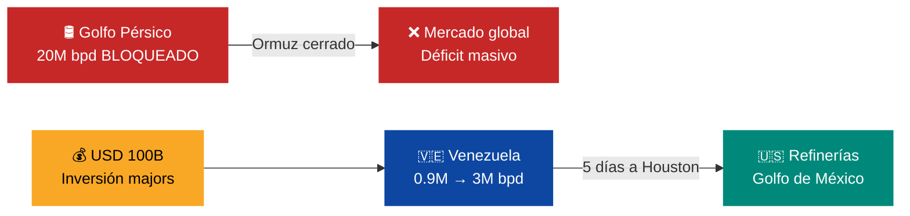

# Realidad Geopolítica: EE.UU. Controla el Petróleo

:::tip En pocas palabras
La relación con Estados Unidos define todo. EE.UU. controla el petróleo venezolano desde enero 2026. Esta sección explica cómo se negocia esa realidad para beneficio de Venezuela — no para confrontar.
:::

Desde enero 2026, [Wright declaró](https://abcnews.go.com/US/energy-secretary-wright-details-plans-us-control-venezuelan/story?id=128979604) que EE.UU. controlará ventas petroleras "indefinidamente". [Ventas >USD 1.000 M a feb. 2026](https://www.cnbc.com/2026/02/13/venezuela-oil-sales-qatar-chris-wright-trump.html), acuerdos por USD 5.000 M adicionales. [Wright visitó Caracas](https://www.cnn.com/2026/02/12/americas/venezuela-oil-wright-rodriguez-latam-intl) y recorrió instalaciones de Chevron con Rodríguez.

| Realidad | Posición del Plan | Acción |
|----------|-------------------|--------|
| EE.UU. controla ventas | Fase de transición, no permanente | Negociar % al Fondo de Inversión Venezuela S.A. |
| Cuentas controladas por EE.UU. | Es mecanismo anticorrupción temporal | Exigir transparencia ([demócratas propusieron](https://www.aljazeera.com/news/2026/2/12/us-energy-secretary-chris-wright-touts-oil-production-on-venezuela-visit) Transparency Act) |
| ~~Majors cautelosas~~ **RESUELTO 14-mar-2026** | [Licencia 46B de OFAC](https://www.infobae.com/venezuela/2026/03/14/eeuu-autorizo-a-las-empresas-estadounidenses-realizar-negocios-con-el-sector-petrolero-venezolano/) autoriza a TODAS las empresas estadounidenses a operar en el sector petrolero | **Barrera eliminada.** Explotar, comerciar, invertir, suministrar — todo autorizado |
| China USD 10–12B pendientes | [RAND: China puede ser spoiler](https://www.rand.org/pubs/commentary/2026/01/china-could-play-spoiler-in-venezuelas-debt-restructuring.html) | Incluir como comprador diversificado |
| **Pre-Seed diáspora** | **NO depende de ningún actor anterior** | **Arrancar inmediatamente** |

Wright dijo que elecciones "probablemente" ocurren durante mandato de Trump. Este plan propone: elecciones = condición para transferir control al Fondo de Inversión Venezuela S.A. ciudadano.

---

## Licencia 46B: EE.UU. Abre el Sector Petrolero (14 de marzo de 2026)

:::tip BREAKING — La barrera más grande del plan se acaba de eliminar
El 14 de marzo de 2026, [OFAC emitió la Licencia 46B](https://www.infobae.com/venezuela/2026/03/14/eeuu-autorizo-a-las-empresas-estadounidenses-realizar-negocios-con-el-sector-petrolero-venezolano/) autorizando a **todas las empresas estadounidenses** a realizar negocios con el sector petrolero venezolano: explotación, comercio, inversión, suministro de materiales, almacenamiento, transporte y refinación. También se autorizó extracción/comercialización de oro y exportación de fertilizantes a EE.UU.
:::

| Aspecto | Detalle |
|---------|---------|
| **Licencia** | 46B de OFAC (Departamento del Tesoro) |
| **Alcance** | Explotación, comercio, inversión, suministro, almacenamiento, marketing, transporte y refinación de crudo y derivados |
| **Quién puede operar** | Cualquier empresa estadounidense establecida |
| **Restricciones** | Prohibido involucrar personas de Irán, Corea del Norte, Rusia o Cuba. Contratos bajo ley de EE.UU. Disputas resueltas en territorio de EE.UU. |
| **Adicional** | Autorización para extracción/comercialización de oro + exportación de fertilizantes a EE.UU. |
| **Producción actual** | >1M bpd (+10% crecimiento) |
| **Cita OFAC** | *"La Administración Trump ha estado cumpliendo rápidamente la promesa de ayudar a restaurar la economía venezolana para beneficio tanto del pueblo estadounidense como del venezolano"* |

### Impacto en el Plan Venezuela S.A.

| Antes de Licencia 46B | Después de Licencia 46B |
|----------------------|------------------------|
| Solo Chevron operaba (licencia individual) | **Todas** las empresas de EE.UU. pueden operar |
| Majors cautelosas (Bessent: "no están interesadas") | Barrera legal eliminada — la decisión es comercial, no regulatoria |
| Inversión limitada a ~USD 5B (Chevron) | Potencial de USD 30-100B (ExxonMobil, ConocoPhillips, Halliburton, Baker Hughes, Schlumberger) |
| Oro restringido | Autorizado — Arco Minero puede atraer mineras formales |
| Fertilizantes bloqueados | Exportación directa a EE.UU. — agro venezolano tiene mercado |

:::danger Lo que esto significa para el timeline
La Licencia 46B **acelera dramáticamente** la Fase 2 (Seed) del plan. Los contratos forward con empresas estadounidenses ahora son legalmente viables sin licencia individual. La producción puede escalar más rápido porque las empresas de servicios petroleros (Halliburton, Schlumberger, Baker Hughes) pueden operar sin restricciones. **La ventana está abierta — cada día sin ejecutar es un día perdido.**
:::

---

## Transición Post-Maduro: Intervención, No Elección

:::danger Cambio de paradigma — enero 2026
La transición política no llegó por vía electoral. EE.UU. ejecutó una intervención militar en enero 2026 y Maduro fue arrestado. Esto cambia fundamentalmente las premisas geopolíticas del plan.
:::

El plan asumía originalmente una transición negociada o electoral. La realidad es distinta:

| Premisa original | Realidad marzo 2026 | Ajuste al plan |
|------------------|---------------------|----------------|
| Transición democrática gradual | Intervención militar de EE.UU., Maduro arrestado | Acelerar fases operativas; el gobierno de transición ya existe |
| Negociación con régimen | Régimen desplazado | Foco en reconstrucción institucional inmediata |
| Soberanía petrolera negociable | EE.UU. controla ventas directamente | Negociar desde posición de reconstrucción, no de confrontación |
| Timeline de elecciones incierto | Wright: "probablemente" durante mandato Trump | Ventana 2026-2028 para institucionalizar el Fondo de Inversión Venezuela S.A. |

**Implicación para el plan:** La ventana de ejecución se aceleró. No hay que esperar transición — hay que ejecutar dentro de ella. Cada mes sin institucionalizar el Fondo de Inversión Venezuela S.A. es un mes donde EE.UU. controla ingresos sin contraparte ciudadana.

---

## Crisis del Medio Oriente: Venezuela como Aliado Energético Principal de EE.UU.

:::danger Cambio de tablero global — febrero 2026
El 28 de febrero de 2026, EE.UU. e Israel ejecutaron ataques coordinados contra Irán, eliminando al líder supremo Khamenei. Irán cerró el Estrecho de Ormuz. **20M bpd** de crudo global quedaron bloqueados — el mayor shock de suministro desde la crisis del petróleo de 1973. El precio del crudo se disparó **+25%** a **USD 120/barril**. La IEA activó una liberación récord de **400M barriles** de reservas estratégicas. El mundo busca desesperadamente sustitutos al crudo del Golfo. Venezuela está en la primera fila. [Requiere investigación]
:::

| Evento | Fecha | Impacto directo en Venezuela |
|--------|-------|------------------------------|
| Ataques de EE.UU./Israel a Irán — muerte de Khamenei | 28 feb. 2026 | Venezuela pasa de proveedor marginal a aliado energético estratégico |
| Cierre del Estrecho de Ormuz | 28 feb. 2026 | **20M bpd** bloqueados; urgencia global por crudo alternativo |
| Crudo sube a **USD 120/barril** (+25%) | 28 feb. 2026 | Cada barril venezolano genera **USD 60 de upside** sobre precio base de USD 60 |
| IEA libera **400M barriles** de reservas estratégicas | Mar. 2026 | Medida de emergencia temporal — no sustituye producción permanente |
| Venezuela firma nuevos contratos petroleros con EE.UU. | 4 mar. 2026 | Formalización de alianza energética bilateral |
| Trump llama a Venezuela "new friend and partner" en State of the Union | Mar. 2026 | Señal política de máximo nivel — desbloquea inversión y diplomacia |
| Trump destaca **80M barriles** en camino a EE.UU. | Mar. 2026 | Volumen inmediato demuestra capacidad operativa |
| USD 100B comprometidos por petroleras de EE.UU. | Mar. 2026 | Mayor compromiso de inversión extranjera en historia de Venezuela |
| 5 majors autorizadas (Chevron, BP, Eni, Shell, Repsol) | Mar. 2026 | Fin de la era de "las grandes no están interesadas" |
| EE.UU. asume control operativo de marketing petrolero venezolano | 9 mar. 2026 | Control de comercialización pasa completamente a Washington |
| Meta: aumento de producción **30-40%** en 2026 | Mar. 2026 | De **~0.9M bpd** a **~1.2-1.3M bpd** este año; **3M bpd** en 24 meses (agresivo) |

*Todas las fuentes: [Requiere investigación] — eventos de feb-mar 2026, verificar contra Reuters, Bloomberg, EIA, IEA, White House.*

### Venezuela como Sustituto del Crudo del Golfo

Con el Estrecho de Ormuz cerrado, **20M bpd** del suministro global están en riesgo:

| País afectado | Producción (bpd) | Ruta por Ormuz | Estatus mar. 2026 |
|---------------|-------------------|----------------|-------------------|
| Arabia Saudita | ~10.5M | ~80% transita por Ormuz | Exportaciones severamente limitadas |
| Irak | ~4.5M | ~95% transita por Ormuz | Casi totalmente bloqueado |
| EAU | ~3.5M | ~99% transita por Ormuz | Prácticamente bloqueado |
| Kuwait | ~2.7M | 100% transita por Ormuz | Totalmente bloqueado |
| Irán | ~3.2M | Origen del bloqueo | Producción bajo ataque |

**¿Puede Venezuela llenar ese vacío?** No todo — pero sí una porción crítica para EE.UU.

| Parámetro | Situación actual | Meta agresiva (24 meses) | Meta Rystad (15 años) |
|-----------|------------------|--------------------------|----------------------|
| Producción Venezuela | **0.9-1.0M bpd** | **3.0M bpd** | **3.0M bpd** |
| % del vacío Ormuz cubierto | 5% | 15% | 15% |
| Inversión requerida | — | ~USD 50-80B acelerada | USD 183B (Rystad) |

**¿Por qué Venezuela es el sustituto ideal para EE.UU.?**

1. **Proximidad geográfica.** Venezuela está a **5 días de tanquero** de refinerías del Golfo de México (Houston, Lake Charles, Port Arthur). Golfo Pérsico → EE.UU. son **40+ días**.
2. **Compatibilidad de crudo.** Las refinerías del Golfo de EE.UU. fueron diseñadas para crudo pesado — exactamente lo que produce la Faja del Orinoco. Arabia Saudita exporta liviano; Venezuela exporta pesado. EE.UU. necesita pesado.
3. **Infraestructura existente.** Oleoductos, puertos, tanques de almacenamiento de PDVSA existen. Están deteriorados, pero existen. No hay que construir desde cero.
4. **Control político asegurado.** EE.UU. ya controla ventas y marketing. No hay riesgo de un proveedor hostil — Venezuela post-intervención es aliado.

### Nuevo Marco de Relación EE.UU.-Venezuela

El discurso de Trump en el State of the Union marcó un cambio semántico radical: de "régimen" a "new friend and partner". Este reposicionamiento tiene consecuencias concretas.

**Marco político:**
- Trump destacó **80M barriles** en camino desde Venezuela — señal de prioridad energética
- El lenguaje de "amigo y socio" reemplaza décadas de hostilidad retórica
- Venezuela se posiciona como pilar de seguridad energética de EE.UU. durante crisis de Ormuz

**Marco de inversión:**

| Petrolera | Estatus pre-crisis | Estatus post-crisis (mar. 2026) | Compromiso estimado |
|-----------|--------------------|---------------------------------|---------------------|
| **Chevron** | Operando con licencia limitada | Licencia expandida, operaciones aceleradas | Parte de USD 100B |
| **BP** | Sin operaciones | **Autorizada** para operar en Venezuela | Parte de USD 100B |
| **Eni** | Sin operaciones | **Autorizada** para operar en Venezuela | Parte de USD 100B |
| **Shell** | Salió en 2018 | **Reautorizada** para operar en Venezuela | Parte de USD 100B |
| **Repsol** | Operaciones mínimas | **Autorizada** para expandir | Parte de USD 100B |

**USD 100B** es más que el PIB actual de Venezuela (**USD 82.8B**, FMI). Es la mayor inyección de capital privado en la historia petrolera del país.

**Marco operativo:**
- EE.UU. asumió **control operativo del marketing petrolero** (9 mar. 2026) — esto va más allá de "controlar ventas": es decidir a quién, cuánto, a qué precio
- Meta de producción agresiva: **30-40% de aumento en 2026** (de ~0.9M a ~1.2-1.3M bpd)
- Meta a 24 meses: **3M bpd** — versus el timeline Rystad de 15 años

:::caution Timeline Rystad vs. meta de emergencia
Rystad Energy estima **15 años y USD 183B** para alcanzar 3M bpd. EE.UU. quiere llegar en **24 meses**. Este plan mantiene el timeline Rystad como base — si la emergencia de Ormuz acelera la inversión, el upside es enorme. Pero prometer 3M bpd en 24 meses sin precedente técnico es irresponsable. La infraestructura deteriorada de PDVSA, la falta de personal calificado y la complejidad del crudo de la Faja imponen límites físicos que no se resuelven con dinero solamente.
:::

### Impacto en el Plan Venezuela S.A.

La crisis de Ormuz transforma los supuestos operativos del plan:

| Parámetro del plan | Pre-crisis (ene. 2026) | Post-crisis (mar. 2026) | Cambio |
|---------------------|------------------------|-------------------------|--------|
| **Precio base** | USD 60/barril | **USD 60/barril** (sin cambio — conservador) | El precio actual de USD 120 es upside masivo, pero no asumimos permanencia |
| **Upside al Fondo de Inversión Venezuela S.A.** | Moderado | **USD 60/barril de upside** → ~USD 20B/año adicional a producción actual | Cada barril genera el doble del ingreso proyectado |
| **Inversión extranjera comprometida** | Cautelosa ("las grandes no están interesadas") | **USD 100B** de 5 majors autorizadas | De 0 a 100 en un mes |
| **Acceso a mercado** | EE.UU. como comprador principal | EE.UU. como comprador **desesperado** | Poder de negociación sube para Venezuela S.A. |
| **Sanciones** | Vigentes con excepciones mínimas | Rollback acelerado para facilitar producción | Desbloqueado por necesidad, no por diplomacia |
| **Relación política EE.UU.-Venezuela** | Transaccional-coercitiva | "Friend and partner" — alianza energética | Ventana para negociar institucionalización del Fondo de Inversión Venezuela S.A. |
| **Timeline de producción** | 15 años (Rystad) | 15 años (plan) / 24 meses (meta EE.UU.) | Mantenemos Rystad; si se acelera, es upside |
| **Control de marketing** | EE.UU. controla ventas | EE.UU. controla **operaciones de marketing** | Control se profundiza — riesgo de soberanía |
| **Riesgo de dependencia** | Alto en EE.UU. | **Crítico** en EE.UU. | Un solo comprador = vulnerabilidad existencial |

**Efecto en el Fondo de Inversión Venezuela S.A. (Venezuela S.A.):**

```mermaid
xychart-beta
    title "Ingreso al Fondo de Inversión Venezuela S.A.: Escenario Base vs. Crisis Ormuz"
    x-axis ["Año 1", "Año 3", "Año 5", "Año 10", "Año 15"]
    y-axis "USD Billones acumulados" 0 --> 500
    bar [8, 45, 100, 250, 400]
    bar [20, 90, 180, 380, 500]
```

*Barra 1: escenario base (USD 60/bbl). Barra 2: escenario crisis sostenida (USD 100+/bbl). Ambos asumen ramp-up Rystad de 15 años. Todo el ingreso petrolero va al Fondo de Inversión Venezuela S.A. administrado por Venezuela S.A., no al Estado.*

:::tip Ventana estratégica: negociar desde la fortaleza
EE.UU. **necesita** el petróleo venezolano más que nunca. Esta es la primera vez en décadas que Venezuela tiene poder de negociación real. La prioridad de Venezuela S.A. no es maximizar producción — es **institucionalizar el Fondo de Inversión Venezuela S.A.** mientras EE.UU. está dispuesto a hacer concesiones. Negociar ahora:
1. **Cronograma vinculante** de transferencia de control de ventas al Fondo de Inversión Venezuela S.A.
2. **Porcentaje garantizado** de ingresos al fondo (mínimo 80%)
3. **Auditoría internacional** del fondo (Santiago Principles) como condición para las 5 majors
4. **Diversificación de compradores** post-crisis (Europa, India) para reducir dependencia

Si esperamos a que Ormuz reabra, el leverage desaparece.
:::

---

## Estatus de Sanciones: Rollback Selectivo

:::info Sanciones a marzo 2026
Todas las sanciones permanecen vigentes: GoV, PDVSA, Minerven, sector oil & gas. Pero EE.UU. ha comenzado a crear excepciones estratégicas para facilitar su propia adquisición de crudo.
:::

| Acción de sanciones | Fecha | Impacto en el plan | Fuente |
|---------------------|-------|-------------------|--------|
| White House anuncia que secretario de energía implementa acuerdo para adquirir petróleo venezolano para EE.UU. | 7 ene. 2026 | EE.UU. se convierte en comprador principal — alineado con control de ventas | [Requiere investigación] |
| EE.UU. autoriza importación de equipos, partes y servicios para campos petroleros | Q1 2026 | **Oportunidad directa:** permite reactivar infraestructura de PDVSA con tecnología occidental | [Requiere investigación] |
| Sanciones generales siguen vigentes (GoV, PDVSA, Minerven, sector) | Vigente mar. 2026 | Inversión a gran escala sigue bloqueada hasta alivio formal | [Requiere investigación] |

:::tip Oportunidad: equipos de campo petrolero
La autorización de importación de equipos petroleros es la primera apertura tangible. Permite recibir tecnología de perforación, mantenimiento y EOR (Enhanced Oil Recovery) sin esperar un levantamiento total de sanciones. El plan debe priorizar contratos de equipamiento con proveedores estadounidenses que ya tienen autorización — esto acelera el timeline de producción hacia los **3M bpd** de la meta Rystad.
:::

### PDVSA: Producción bajo presión

El bloqueo naval de EE.UU. está forzando reducciones de producción. Los tanques de almacenamiento se llenan sin salida suficiente.

| Operación | Operador | Situación mar. 2026 |
|-----------|----------|---------------------|
| Petropiar | Chevron JV | Instrucción de reducir producción por bloqueo naval |
| Petroboscan | Chevron JV | Reducción de output |
| Sinovensa | CNPC JV | Reducción de output |
| Otras operaciones PDVSA | PDVSA directo | Almacenamiento llenándose |

**Riesgo operativo:** Reducir producción en campos de crudo pesado (Faja del Orinoco) no es como cerrar una llave. Los pozos que se cierran pueden requerir inversión significativa para reactivarse. Cada barrel no producido hoy puede costar **USD 3-5 en reactivación futura** [Requiere investigación].

---

## Contexto Europa: Guerra Comercial con EE.UU.

La relación EE.UU.-Europa se deteriora en 2026. Esto afecta a Venezuela como proveedor potencial de crudo para Europa.

| Desarrollo | Impacto en Venezuela |
|------------|---------------------|
| Trump planea tarifa base global de **15%** bajo Section 122 | Encarece importaciones europeas de crudo; Europa busca diversificar proveedores |
| UE advierte que tarifas de EE.UU. violan acuerdos comerciales, congela negociaciones | Fractura transatlántica abre espacio para Venezuela como proveedor alternativo a Europa |
| Guerra en Ucrania impone mayor carga financiera a Europa | Europa necesita energía barata — crudo venezolano pesado podría competir con descuento |
| Trump busca debilitar instituciones de la UE y fortalecer partidos de extrema derecha | Inestabilidad política europea dificulta acuerdos a largo plazo |

:::info Oportunidad para diversificación
Si EE.UU. está en guerra comercial con Europa, Venezuela podría posicionarse como proveedor de crudo a la UE una vez que las sanciones se alivien. Europa necesita alternativas a Rusia y al crudo de Medio Oriente. Pero esto solo funciona si EE.UU. lo permite — recuerda: EE.UU. controla las ventas.
:::

---

## Contexto Asia: China, India y la Nueva Dinámica

| Indicador | Dato 2026 | Relevancia para Venezuela |
|-----------|-----------|--------------------------|
| Crecimiento China | **4.6%** (menor que 2025) | Demanda de crudo modera; China puede negociar precios más bajos |
| Crecimiento India | **6.6%** | India es comprador creciente de crudo global |
| Crecimiento Asia del Sur | **5.6%** | Demanda energética asiática sigue siendo motor global |
| EE.UU. penalizó a India con tarifa de **25%** por comprar petróleo ruso | India busca fuentes alternativas a Rusia — Venezuela podría ser una |
| India sube tarifas a químicos e industriales chinos | Fragmentación comercial intra-Asia crea oportunidades para terceros |
| Crecimiento de exportaciones chinas se modera | Restricción del motor económico principal de China |

**Lectura para el plan:**

1. **China como comprador de crudo venezolano:** Con crecimiento moderándose y deuda pendiente de USD 10-12B, China negociará duro. No es el comprador salvador — es un comprador con leverage.
2. **India como comprador alternativo:** Castigada por comprar crudo ruso, India busca proveedores "aceptables" para Washington. Venezuela bajo control de EE.UU. podría calificar. Oportunidad de diversificar fuera de China.
3. **Asia sigue creciendo:** A pesar de la fragmentación global, la demanda asiática de energía sostiene el piso de precio. Esto protege el supuesto base de **USD 60/barril**.

---

## Evaluación de Riesgos Geopolíticos Actualizada (Marzo 2026)

| Riesgo | Prob. | Impacto | Mitigación |
|--------|-------|---------|------------|
| EE.UU. mantiene control de ventas indefinidamente sin transferir al Fondo de Inversión Venezuela S.A. | Alta | Crítico | Condicionar apoyo político a cronograma de transferencia. Vincular a elecciones |
| Producción colapsa por cierres forzados de pozos (bloqueo naval) | Media-Alta | Alto | Priorizar autorización de equipos para mantenimiento. Evitar cierres de pozos de Faja |
| Guerra comercial EE.UU.-Europa cierra mercado europeo a crudo venezolano | Media | Medio | Europa no es mercado inmediato; priorizar EE.UU. y Asia |
| China usa deuda de USD 10-12B como leverage para acceso preferencial | Alta | Alto | Negociar reestructuración de deuda con descuento, incluir a China en consorcio multi-comprador |
| India no puede comprar crudo venezolano por presión de EE.UU. sobre sanciones | Media | Medio | Solo viable si EE.UU. autoriza — alinear con rollback selectivo de sanciones |
| Vacío institucional post-intervención genera inestabilidad interna | Alta | Crítico | Ejecutar plan de reconstrucción institucional en paralelo. Ver [seguridad física](/04-gobernanza/seguridad-fisica) |
| Cuba retalia por pérdida de subsidio petrolero (ver [desconexión Cuba](/04-gobernanza/cuba-desconexion)) | Media | Alto | Desconexión acelerada — Cuba ya perdió leverage con caída del régimen |
| **Ormuz reabre rápido**, crudo cae a USD 70-80; urgencia por crudo venezolano se reduce | Media | Alto | No asumir precios de crisis como permanentes. Precio base USD 60 ya protege contra este escenario. Usar ventana alta para institucionalizar Fondo de Inversión Venezuela S.A., no para gastar |
| **EE.UU. sobreextiende control** operativo; preocupaciones de soberanía venezolana crecen | Media-Alta | Crítico | Negociar cronograma vinculante de transferencia al Fondo de Inversión Venezuela S.A.. Auditoría internacional (Santiago Principles). Transparencia como escudo contra narrativa imperialista |
| **Irán retalia asimétricamente**: ciberataques a infraestructura petrolera, activación de proxies en LATAM (Hezbollah, ELN) | Media | Alto | Coordinación de ciberseguridad con EE.UU. para infraestructura crítica de PDVSA. Monitoreo de proxies iraníes en Caribe y frontera colombiana. Ver [seguridad física](/04-gobernanza/seguridad-fisica) [Requiere investigación] |

:::danger Riesgo existencial: la ventana se cierra
Con petróleo como activo depreciante (solar más barato que Faja para 2040), la intervención de EE.UU. paradójicamente abre la ventana de ejecución del plan. Pero cada mes sin institucionalizar el Fondo de Inversión Venezuela S.A., sin autorizar inversión masiva, y sin reactivar producción, es un mes perdido de la ventana de 10-15 años. El reloj empezó en enero 2026.
:::
