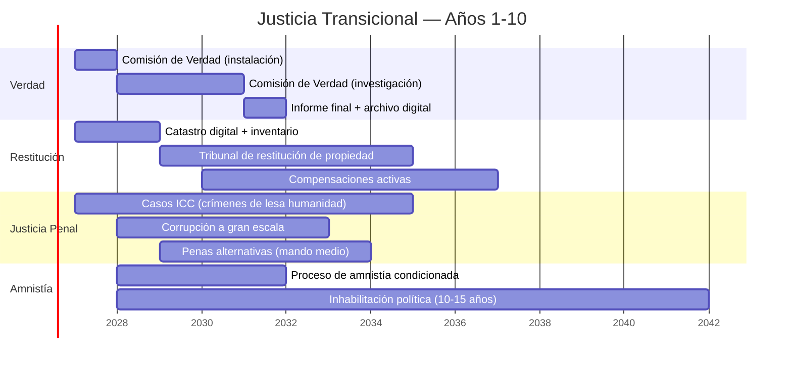

# Justicia Transicional: El Dilema que Nadie Quiere Abordar

> ¿Cómo se construye un estado de derecho cuando los que deben construirlo fueron parte del problema? ¿Cómo se hace justicia sin bloquear la transición?

:::caution El dilema
**Justicia plena** (procesar a todos) → los actores del régimen bloquean la transición porque no tienen nada que ganar.

**Impunidad total** (perdonar a todos) → no hay estado de derecho, no hay confianza, no hay inversión.

**La respuesta está en el medio**, y cada país que ha transitado ha encontrado su propio punto de equilibrio.
:::

---

## Inventario de Deuda Moral

| Categoría | Escala | Fuente |
|-----------|--------|--------|
| **Presos políticos** | 1.900+ detenidos desde jul. 2024 | [Foro Penal, feb. 2025](https://foropenal.com/) |
| **Ejecuciones extrajudiciales** | 19.000+ entre 2016-2019 (FAES y otros) | [OHCHR/Bachelet, jul. 2019](https://www.ohchr.org/en/hr-bodies/hrc/co-i-venezuela/co-i-venezuela) |
| **Expropiaciones** | 1.500+ empresas expropiadas sin compensación justa (2005-2015) | [CONINDUSTRIA](https://www.conindustria.org/) |
| **Desplazados forzados** | 7,9 M emigrantes (muchos por persecución o colapso inducido) | [UNHCR, dic. 2025](https://www.unhcr.org/) |
| **Tortura y tratos crueles** | Documentados sistemáticamente por OHCHR, ICC, Foro Penal | [ICC situación Venezuela](https://www.icc-cpi.int/venezuela) |
| **Corrupción masiva** | USD 300.000+ M desviados (FONDEN + PDVSA + programas sociales) | [Transparencia Venezuela](https://transparenciave.org/) |
| **Destrucción institucional** | Poder judicial, electoral, fuerzas armadas cooptadas | [V-Dem Institute, 2024](https://www.v-dem.net/) |

---

## 5 Modelos Internacionales

| País | Mecanismo | Fortaleza | Debilidad | Resultado |
|------|-----------|-----------|-----------|-----------|
| **Sudáfrica** (1994) | Comisión de Verdad y Reconciliación (TRC): amnistía a cambio de verdad plena | Transición pacífica, documentación histórica | Víctimas sin reparación económica; desigualdad persistió | Democracia estable pero desigualdad extrema ([TRC Report](https://www.justice.gov.za/trc/)) |
| **Colombia** (2016) | JEP (Jurisdicción Especial para la Paz): justicia restaurativa + penas alternativas | Marco legal sofisticado; combina verdad, justicia y reparación | Lenta (8 años, primeras sentencias en 2024); disidencias | Reducción violencia pero implementación incompleta ([JEP](https://www.jep.gov.co/)) |
| **Argentina** (1983) | Juicios a juntas militares + CONADEP + Nunca Más | Sentó precedente global de accountability | 10 años de amnistías (1986-2003) antes de reabrir juicios | Justicia tardía pero efectiva; modelo para región ([CONADEP](https://www.argentina.gob.ar/derechoshumanos/conadep)) |
| **Ruanda** (1994) | Tribunales Gacaca (comunitarios) + ICTR internacional | Procesó 1,9 M de casos en una década | Justicia de vencedores; gobierno autoritario post-genocidio | Estabilidad pero sin democracia plena ([ICTR](https://unictr.irmct.org/)) |
| **España** (1975) | Pacto del Olvido: amnistía total, sin comisión de verdad | Transición rápida y pacífica | Víctimas del franquismo sin justicia por 45+ años | Democracia consolidada pero heridas abiertas ([Ley de Memoria Histórica, 2007](https://www.boe.es/)) |

---

## Propuesta Híbrida: 4 Pilares

### Pilar 1: Comisión de Verdad y Memoria

| Dimensión | Propuesta |
|-----------|----------|
| Duración | 3 años (renovable 1 vez) |
| Composición | 7 comisionados: 2 internacionales + 2 víctimas + 2 académicos + 1 mediador |
| Mandato | Documentar violaciones de DDHH, corrupción y destrucción institucional (2000-2025) |
| Poder | Citar testigos, acceder archivos, protección de testigos |
| Producto | Informe público + archivo digital accesible + recomendaciones vinculantes |
| Modelo | Sudáfrica TRC + Colombia Comisión de la Verdad |
| Costo estimado | USD 50-100 M |

### Pilar 2: Restitución de Propiedad

| Tipo | Escala estimada | Mecanismo |
|------|----------------|-----------|
| Empresas expropiadas | 1.500+ empresas | Devolución o compensación a valor justo de mercado (pre-expropiación) |
| Tierras confiscadas | [Requiere investigación] | Tribunal especializado + catastro digital |
| Viviendas/activos personales | [Requiere investigación] | Proceso simplificado con arbitraje |
| PDVSA activos transferidos | [Requiere investigación] | Auditoría forense internacional |

**Costo estimado:** USD 5-15B en 10 años [Requiere investigación detallada]

**Precedente:** Alemania reunificada (1990) procesó 2,5 M de reclamaciones de propiedad en 15 años ([Bundesamt für zentrale Dienste und offene Vermögensfragen](https://www.badv.bund.de/)).

### Pilar 3: Justicia Penal Selectiva

No se puede procesar a todos. Pero los crímenes más graves no pueden quedar impunes.

| Categoría | Tratamiento | Justificación |
|-----------|------------|---------------|
| **Crímenes de lesa humanidad** (ejecuciones, tortura sistemática) | Procesamiento penal completo — sin amnistía | Obligación bajo Estatuto de Roma; [ICC ya investiga](https://www.icc-cpi.int/venezuela) |
| **Corrupción a gran escala** (>USD 10 M) | Procesamiento + decomiso + inhabilitación | Recuperación de activos para financiar reparaciones |
| **Violaciones graves de DDHH** (mando medio) | Penas reducidas a cambio de verdad plena y cooperación | Modelo Colombia JEP: 5-8 años de penas alternativas |
| **Funcionarios menores** | Comisión de Verdad + veto de cargos públicos | Sin pena privativa, pero accountability |
| **Ciudadanos comunes** | Sin proceso | No criminalizar a la población |

### Pilar 4: Amnistía Condicionada

| Condición | Requisito |
|-----------|----------|
| Verdad plena | Declaración completa ante Comisión de Verdad |
| No crímenes de lesa humanidad | Exclusión absoluta para tortura, ejecución, desaparición |
| Reparación simbólica | Reconocimiento público + petición de perdón |
| Cooperación en recuperación de activos | Identificar y facilitar retorno de fondos desviados |
| Inhabilitación política | 10-15 años sin cargos públicos |

---

## Financiamiento

| Fuente | Monto estimado | Mecanismo |
|--------|---------------|-----------|
| Recuperación de activos desviados | USD 5-20B (de USD 300B+ desviados) | Cooperación DOJ/EU + firmas forenses internacionales |
| Cooperación internacional | USD 500M-1B | ONU, UE, EE.UU. (precedente Colombia: USD 1.2B en justicia transicional) |
| Presupuesto nacional | USD 100-200 M/año | 0.1-0.2% del PIB |
| Fondo soberano (retornos) | USD 200-500 M/año (año 5+) | Asignación específica para reparaciones |

**Referencia:** Colombia ha gastado ~USD 3B en su sistema de justicia transicional (JEP + Comisión de la Verdad + Unidad de Búsqueda) desde 2017 ([Banco Mundial](https://www.worldbank.org/)).

---

## Secuencia Propuesta

---

## Conexión con el Plan

:::info La justicia transicional no es opcional
Sin justicia transicional:
- No hay estado de derecho → no hay seguridad jurídica → no hay inversión extranjera
- No hay reconciliación → no hay cohesión social → no hay gobernabilidad
- No hay recuperación de activos → se pierde USD 5-20B que podría financiar reparaciones

**Es un prerrequisito del plan, no un complemento.** La [seguridad física](/04-gobernanza/seguridad-fisica) depende de DDR, que depende de amnistías condicionadas. El [fondo soberano](/02-motor-financiero/fondo-soberano) depende de gobernanza, que depende de estado de derecho. Los [inversionistas](/08-pitch/resumen-ejecutivo) necesitan ver que hay reglas que se respetan.
:::

**Fuentes:** [OHCHR Venezuela](https://www.ohchr.org/en/hr-bodies/hrc/co-i-venezuela/co-i-venezuela) | [ICC Situation in Venezuela](https://www.icc-cpi.int/venezuela) | [Foro Penal](https://foropenal.com/) | [Colombia JEP](https://www.jep.gov.co/) | [ICTJ (International Center for Transitional Justice)](https://www.ictj.org/)
