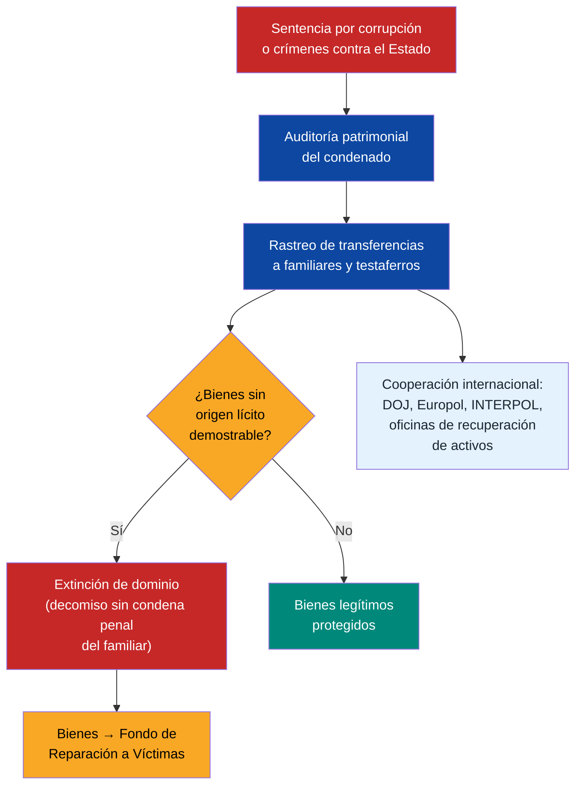
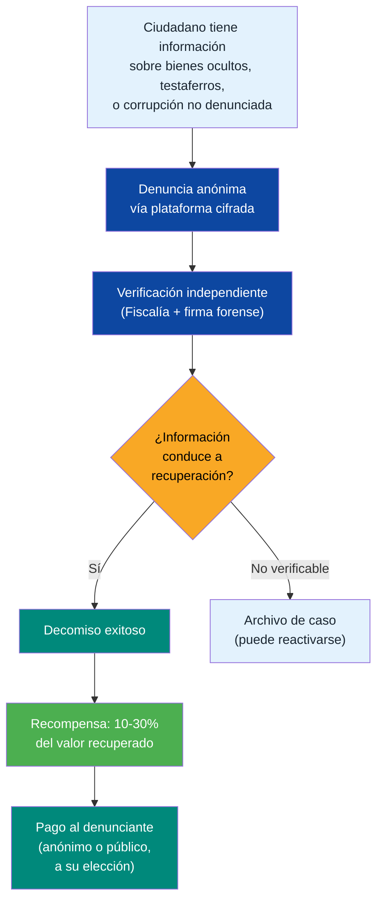
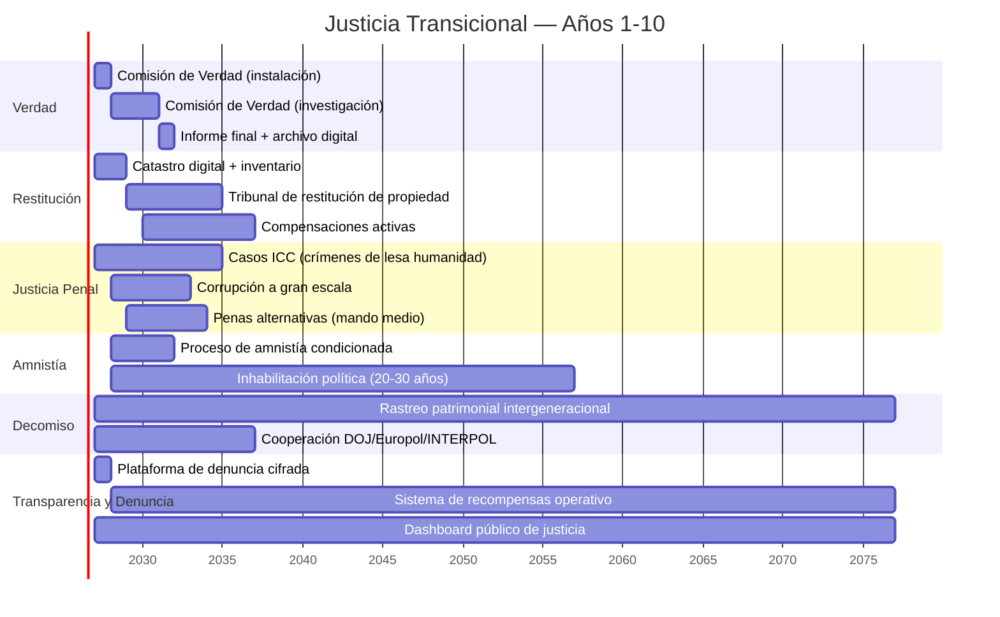

# Justicia Transicional: El Dilema que Nadie Quiere Abordar

:::tip En pocas palabras
¿Qué pasa con los que robaron, torturaron y destruyeron el país? Justicia transicional es el proceso de rendir cuentas sin venganza — para que el país pueda pasar la página y reconstruirse.
:::

> ¿Cómo se construye un estado de derecho cuando los que deben construirlo fueron parte del problema? ¿Cómo se hace justicia sin bloquear la transición?

:::caution El dilema
**Justicia plena** (procesar a todos) → los actores del régimen bloquean la transición porque no tienen nada que ganar.

**Impunidad total** (perdonar a todos) → no hay estado de derecho, no hay confianza, no hay inversión.

**La respuesta está en el medio**, y cada país que ha transitado ha encontrado su propio punto de equilibrio.
:::

---

## Inventario de Deuda Moral

| Categoría | Escala | Fuente |
|-----------|--------|--------|
| **Presos políticos** | 1.900+ detenidos desde jul. 2024 | [Foro Penal, feb. 2025](https://foropenal.com/) |
| **Ejecuciones extrajudiciales** | 19.000+ entre 2016-2019 (FAES y otros) | [OHCHR/Bachelet, jul. 2019](https://www.ohchr.org/en/hr-bodies/hrc/co-i-venezuela/co-i-venezuela) |
| **Expropiaciones** | 1.500+ empresas expropiadas sin compensación justa (2005-2015) | [CONINDUSTRIA](https://www.conindustria.org/) |
| **Desplazados forzados** | 7,9 M emigrantes (muchos por persecución o colapso inducido) | [UNHCR, dic. 2025](https://www.unhcr.org/) |
| **Tortura y tratos crueles** | Documentados sistemáticamente por OHCHR, ICC, Foro Penal | [ICC situación Venezuela](https://www.icc-cpi.int/venezuela) |
| **Corrupción masiva** | USD 300.000+ M desviados (FONDEN + PDVSA + programas sociales) | [Transparencia Venezuela](https://transparenciave.org/) |
| **Destrucción institucional** | Poder judicial, electoral, fuerzas armadas cooptadas | [V-Dem Institute, 2024](https://www.v-dem.net/) |

---

## 5 Modelos Internacionales

| País | Mecanismo | Fortaleza | Debilidad | Resultado |
|------|-----------|-----------|-----------|-----------|
| **Sudáfrica** (1994) | Comisión de Verdad y Reconciliación (TRC): amnistía a cambio de verdad plena | Transición pacífica, documentación histórica | Víctimas sin reparación económica; desigualdad persistió | Democracia estable pero desigualdad extrema ([TRC Report](https://www.justice.gov.za/trc/)) |
| **Colombia** (2016) | JEP (Jurisdicción Especial para la Paz): justicia restaurativa + penas alternativas | Marco legal sofisticado; combina verdad, justicia y reparación | Lenta (8 años, primeras sentencias en 2024); disidencias | Reducción violencia pero implementación incompleta ([JEP](https://www.jep.gov.co/)) |
| **Argentina** (1983) | Juicios a juntas militares + CONADEP + Nunca Más | Sentó precedente global de accountability | 10 años de amnistías (1986-2003) antes de reabrir juicios | Justicia tardía pero efectiva; modelo para región ([CONADEP](https://www.argentina.gob.ar/derechoshumanos/conadep)) |
| **Ruanda** (1994) | Tribunales Gacaca (comunitarios) + ICTR internacional | Procesó 1,9 M de casos en una década | Justicia de vencedores; gobierno autoritario post-genocidio | Estabilidad pero sin democracia plena ([ICTR](https://unictr.irmct.org/)) |
| **España** (1975) | Pacto del Olvido: amnistía total, sin comisión de verdad | Transición rápida y pacífica | Víctimas del franquismo sin justicia por 45+ años | Democracia consolidada pero heridas abiertas ([Ley de Memoria Histórica, 2007](https://www.boe.es/)) |

---

## Propuesta Híbrida: 4 Pilares

### Pilar 1: Comisión de Verdad y Memoria

| Dimensión | Propuesta |
|-----------|----------|
| Duración | 3 años (renovable 1 vez) |
| Composición | 7 comisionados: 2 internacionales + 2 víctimas + 2 académicos + 1 mediador |
| Mandato | Documentar violaciones de DDHH, corrupción y destrucción institucional (2000-2025) |
| Poder | Citar testigos, acceder archivos, protección de testigos |
| Producto | Informe público + archivo digital accesible + recomendaciones vinculantes |
| Modelo | Sudáfrica TRC + Colombia Comisión de la Verdad |
| Costo estimado | USD 50-100 M |

### Pilar 2: Restitución de Propiedad

| Tipo | Escala estimada | Mecanismo |
|------|----------------|-----------|
| Empresas expropiadas | 1.500+ empresas | Devolución o compensación a valor justo de mercado (pre-expropiación) |
| Tierras confiscadas | [Requiere investigación] | Tribunal especializado + catastro digital |
| Viviendas/activos personales | [Requiere investigación] | Proceso simplificado con arbitraje |
| PDVSA activos transferidos | [Requiere investigación] | Auditoría forense internacional |

**Costo estimado:** USD 5-15B en 10 años [Requiere investigación detallada]

**Precedente:** Alemania reunificada (1990) procesó 2,5 M de reclamaciones de propiedad en 15 años ([Bundesamt für zentrale Dienste und offene Vermögensfragen](https://www.badv.bund.de/)).

### Pilar 3: Justicia Penal Selectiva

No se puede procesar a todos. Pero los crímenes más graves no pueden quedar impunes.

| Categoría | Tratamiento | Inhabilitación política | Justificación |
|-----------|------------|------------------------|---------------|
| **Crímenes de lesa humanidad** (ejecuciones, tortura sistemática) | Procesamiento penal completo — sin amnistía | **Perpetua** | Obligación bajo Estatuto de Roma; [ICC ya investiga](https://www.icc-cpi.int/venezuela). Quien ordenó matar no puede volver a gobernar. |
| **Corrupción a gran escala** (>USD 10 M) | Procesamiento + decomiso + inhabilitación | **Perpetua** | Recuperación de activos para financiar reparaciones. USD 300B+ desviados no se perdonan con 10 años de espera. |
| **Violaciones graves de DDHH** (mando medio) | Penas reducidas a cambio de verdad plena y cooperación | **25-30 años** | Modelo Colombia JEP: 5-8 años de penas alternativas, pero inhabilitación extendida |
| **Funcionarios menores con participación directa** | Comisión de Verdad + veto de cargos públicos | **15-20 años** | Sin pena privativa, pero fuera de la función pública por una generación |
| **Ciudadanos comunes** | Sin proceso | — | No criminalizar a la población |

### Pilar 4: Amnistía Condicionada

| Condición | Requisito |
|-----------|----------|
| Verdad plena | Declaración completa ante Comisión de Verdad |
| No crímenes de lesa humanidad | Exclusión absoluta para tortura, ejecución, desaparición |
| Reparación simbólica | Reconocimiento público + petición de perdón |
| Cooperación en recuperación de activos | Identificar y facilitar retorno de fondos desviados |
| Inhabilitación política | **20-30 años** sin cargos públicos (proporcional a la gravedad) |
| Rastreo patrimonial intergeneracional | Bienes no justificados en hijos, nietos y bisnietos pueden ser decomisados (ver abajo) |

### Rastreo Patrimonial Intergeneracional

:::danger Los bienes robados no se lavan con el tiempo
USD 300.000+ M desviados no desaparecieron — se convirtieron en propiedades en Madrid, Miami, Panamá, Dubái. En cuentas en Suiza, Andorra, Islas Caimán. En empresas a nombre de hijos, sobrinos, testaferros. **Si el decomiso solo alcanza al funcionario, el 90% de lo robado queda intacto en la siguiente generación.**
:::

| Alcance | Mecanismo | Precedente |
|---------|-----------|-----------|
| **Funcionario directo** | Decomiso total de bienes no justificados | Estándar internacional |
| **Hijos** (1ra generación) | Inversión de carga de la prueba: si no puede demostrar origen lícito, se decomisa | [Ley de Extinción de Dominio, Colombia](https://www.funcionpublica.gov.co/) |
| **Nietos** (2da generación) | Rastreo de bienes transferidos; decomiso si hay nexo con fondos ilícitos | [UK Unexplained Wealth Orders](https://www.legislation.gov.uk/ukpga/2017/22/part/1) |
| **Bisnietos** (3ra generación) | Rastreo activo por 50 años desde la sentencia; decomiso de bienes identificados | [Francia: délai de prescription pour recel, 30 años](https://www.legifrance.gouv.fr/) — extendido a 50 |
| **Testaferros y personas interpuestas** | Mismas reglas que el funcionario directo. Ser testaferro es delito autónomo (10-15 años) | [OFAC SDN List](https://www.treasury.gov/ofac) |
| **Amistades y socios bajo investigación** | Rastreo de transferencias y bienes; decomiso si hay nexo demostrable con fondos ilícitos. Inversión de carga de prueba si hay patrón de enriquecimiento inexplicable | [RICO Act, EE.UU.](https://www.law.cornell.edu/uscode/text/18/part-I/chapter-96) — persigue redes, no solo individuos |

**Mecanismo operativo:**

**Principios clave:**
- **Inversión de carga de la prueba** para bienes de familiares y vinculados de condenados: el poseedor debe demostrar origen lícito, no el Estado demostrar origen ilícito. Modelo: [Colombia Ley 1708 de 2014](https://www.funcionpublica.gov.co/).
- **Extinción de dominio es acción real, no penal**: se persigue el bien, no la persona. Los hijos/nietos no van presos — pero pierden bienes que no pueden justificar.
- **Plazo de prescripción: 50 años** desde la sentencia. Los bienes de la corrupción venezolana no prescriben en una generación.
- **Cooperación internacional obligatoria**: tratados bilaterales con EE.UU., España, Panamá, Portugal, Italia (países donde la diáspora de élite chavista concentra activos).
- **Red completa, no solo individuos**: se persigue la red (modelo [RICO Act](https://www.law.cornell.edu/uscode/text/18/part-I/chapter-96)), no solo al funcionario.

### Régimen Especial para Testaferros

:::danger El testaferro es el eslabón que protege al corrupto
En Venezuela, la mayoría de los bienes de funcionarios corruptos están a nombre de terceros: familiares, amigos de infancia, socios comerciales, abogados, y hasta empleados domésticos. Sin atacar al testaferro, el decomiso es inútil.
:::

| Aspecto | Regla |
|---------|-------|
| **Definición** | Persona que posee, administra o controla bienes a nombre de un funcionario público o persona investigada por corrupción |
| **Delito autónomo** | Ser testaferro es delito independiente: **10-20 años** de prisión + decomiso total de bienes vinculados |
| **Inhabilitación** | **Perpetua** para cargos públicos y contratación con el Estado |
| **Inversión de carga** | Si se demuestra relación con investigado + enriquecimiento inexplicable → el testaferro debe probar origen lícito |
| **Colaboración eficaz** | Reducción de pena (50%) si el testaferro coopera plenamente: identifica bienes, cuentas, estructuras, y otros testaferros |
| **Protección de testigos** | Programa de protección para testaferros que cooperan (modelo [US Witness Protection, USMS](https://www.usmarshals.gov/)) |
| **Sin prescripción** | El delito de testaferrismo no prescribe mientras los bienes sigan ocultos |

**Señales automáticas de alerta:**
- Persona sin historial de ingresos significativos que posee propiedades de alto valor
- Transferencias frecuentes entre la persona y un funcionario público o investigado
- Múltiples propiedades/empresas registradas en períodos cortos
- Persona nombrada en empresas vinculadas a contratación pública sin experiencia empresarial previa
- Patrones de viaje/residencia coincidentes con funcionarios investigados

### Pilar 5: Transparencia Total + Recompensa por Denuncia

:::tip La denuncia ciudadana es el arma más poderosa contra la impunidad
El Estado no puede encontrar USD 300B+ en bienes ocultos solo. Pero 40 millones de venezolanos + 7.9 millones de diáspora sí pueden. Quien vive en Miami sabe quién tiene el penthouse. Quien trabajó en PDVSA sabe quién firmó. Quien fue testaferro sabe dónde están las cuentas. **Hay que convertir esa información en justicia — y recompensar a quien la provea.**
:::

#### Dashboard Público de Justicia Transicional

Todo el proceso es público y consultable en tiempo real:

| Dato público | Detalle | Acceso |
|-------------|---------|--------|
| **Lista de investigados** | Nombre, cargo, período, delitos imputados | Cualquier ciudadano |
| **Bienes identificados** | Propiedades, cuentas, empresas decomisadas — con fotos, ubicación, valor | Cualquier ciudadano |
| **Estado de cada caso** | Investigación → acusación → juicio → sentencia → decomiso → destino de bienes | Cualquier ciudadano |
| **Testaferros identificados** | Nombre, relación con investigado, bienes bajo rastreo | Cualquier ciudadano |
| **Fondos recuperados** | Monto total recuperado, desglose por caso, destino (Fondo de Reparación) | Cualquier ciudadano |
| **Recompensas pagadas** | Monto total pagado a denunciantes (sin identificar al denunciante) | Cualquier ciudadano |
| **Sentencias** | Texto completo de cada sentencia, penas impuestas, inhabilitaciones | Cualquier ciudadano |

**Modelo:** [ASSET Recovery Watch (Stolen Asset Recovery Initiative, World Bank/UNODC)](https://star.worldbank.org/) + [US DOJ Kleptocracy Asset Recovery Initiative](https://www.justice.gov/criminal/criminal-mlars)

#### Sistema de Recompensas por Denuncia

| Tipo de denuncia | Recompensa | Tope máximo | Condición |
|-----------------|------------|-------------|-----------|
| **Bienes ocultos en el exterior** (cuentas, propiedades, empresas) | **15-30%** del valor recuperado | USD 50 M por caso | Información debe ser original y conducir directamente al decomiso |
| **Identificación de testaferro** | **10-20%** del valor de los bienes del testaferro | USD 20 M por caso | Debe incluir evidencia de la relación (documentos, transferencias, testimonios) |
| **Corrupción activa no denunciada** | **10-15%** del daño patrimonial evitado o recuperado | USD 30 M por caso | Aplicable a esquemas en curso o recientes (<5 años) |
| **Red de lavado** (estructura completa) | **20-30%** del valor total de la red | USD 100 M por caso | Debe desmantelar la estructura, no solo identificar un nodo |
| **Documentación de crímenes de DDHH** | **Recompensa fija** USD 10.000-100.000 | — | Evidencia que conduzca a procesamiento penal exitoso |

**Referencia:** [SEC Whistleblower Program](https://www.sec.gov/whistleblower): ha pagado **USD 2.2B+ en recompensas** desde 2012, recuperando **USD 7B+** para el Estado. ROI: 3-4x. El programa más exitoso del mundo en recuperación de activos vía denuncia ciudadana.

#### Protecciones para el Denunciante

| Protección | Mecanismo |
|-----------|-----------|
| **Anonimato garantizado** | Plataforma cifrada end-to-end; identidad protegida por ley incluso ante orden judicial (modelo [EU Whistleblower Directive 2019/1937](https://eur-lex.europa.eu/legal-content/EN/TXT/?uri=celex%3A32019L1937)) |
| **Anti-represalia** | Despido, amenaza o persecución al denunciante = delito autónomo (5-10 años). Carga de la prueba invertida: el empleador debe probar que el despido no fue por la denuncia |
| **Protección física** | Programa de protección de testigos para casos de alto riesgo (modelo [USMS](https://www.usmarshals.gov/)) |
| **Reubicación** | Asistencia para reubicación nacional o internacional si hay amenaza verificada |
| **Inmunidad parcial** | Denunciantes que participaron en el esquema pero cooperan plenamente pueden recibir inmunidad o reducción de pena (modelo colaboración eficaz) |
| **Acceso legal gratuito** | Representación legal pro bono para denunciantes de escasos recursos |

#### Canales de Denuncia

| Canal | Acceso | Para qué |
|-------|--------|----------|
| **Plataforma digital cifrada** | Web + app + Tor | Denuncias anónimas con upload de documentos |
| **Línea telefónica internacional** | Gratuita desde 30+ países | Denunciantes en la diáspora |
| **Oficinas presenciales** | En cada estado + 5 ciudades del exterior (Miami, Madrid, Bogotá, Lima, Santiago) | Denuncias con documentación física |
| **Embajadas y consulados** | Tras reforma del servicio exterior | Venezolanos en cualquier país |
| **ONG aliadas** | Transparencia Venezuela, Foro Penal, PROVEA | Canalización segura de denuncias |

:::info Incentivo alineado: el ciudadano gana cuando el corrupto pierde
Este sistema convierte a cada venezolano en auditor. Si alguien sabe que el exfuncionario X tiene una mansión en Panamá a nombre de su cuñado, puede denunciarlo y ganar 15-30% del valor recuperado. Eso puede ser USD 100.000-500.000 para una familia venezolana. **El incentivo económico hace que la denuncia sea racional, no solo moral.**
:::

---

## Financiamiento

| Fuente | Monto estimado | Mecanismo |
|--------|---------------|-----------|
| Recuperación de activos desviados | USD 5-20B (de USD 300B+ desviados) | Cooperación DOJ/EU + firmas forenses + **denuncias ciudadanas con recompensa** |
| Cooperación internacional | USD 500M-1B | ONU, UE, EE.UU. (precedente Colombia: USD 1.2B en justicia transicional) |
| Presupuesto nacional | USD 100-200 M/año | 0.1-0.2% del PIB |
| Fondo de Inversión Venezuela S.A. (retornos) | USD 200-500 M/año (año 5+) | Asignación específica para reparaciones |
| Recompensas a denunciantes | USD 500M-3B (10-30% de lo recuperado vía denuncia) | Autofinanciado: se paga del monto recuperado, no del presupuesto |

**Referencia:** Colombia ha gastado ~USD 3B en su sistema de justicia transicional (JEP + Comisión de la Verdad + Unidad de Búsqueda) desde 2017 ([Banco Mundial](https://www.worldbank.org/)).

---

## Secuencia Propuesta

---

## Conexión con el Plan

:::info La justicia transicional no es opcional
Sin justicia transicional:
- No hay estado de derecho → no hay seguridad jurídica → no hay inversión extranjera
- No hay reconciliación → no hay cohesión social → no hay gobernabilidad
- No hay recuperación de activos → se pierde USD 5-20B que podría financiar reparaciones

**Es un prerrequisito del plan, no un complemento.** La [seguridad física](/04-gobernanza/seguridad-fisica) depende de DDR, que depende de amnistías condicionadas. El [Fondo de Inversión Venezuela S.A.](/02-motor-financiero/fondo-soberano) depende de gobernanza, que depende de estado de derecho. Los [inversionistas](/08-pitch/resumen-ejecutivo) necesitan ver que hay reglas que se respetan.
:::

---

## Fondo de Reparación a Víctimas

:::danger Los bienes recuperados de corrupción NO van al Fondo de Inversión Venezuela S.A.
El Fondo de Inversión Venezuela S.A. se alimenta de ingresos petroleros. Los bienes decomisados a funcionarios corruptos tienen un destino diferente: **reparación directa a las víctimas.** Mezclar ambos fondos diluye la justicia y crea incentivos perversos (el gobierno "gana" con la corrupción pasada). Los bienes robados vuelven a quienes fueron robados — punto.
:::

### Gobernanza: 5 miembros, mayoría de víctimas

| Miembro | Quién elige | Mandato | Restricción |
|---------|------------|---------|-------------|
| **2 representantes de víctimas** | Elegidos por organizaciones de víctimas registradas (Foro Penal, PROVEA, COFAVIC) | 4 años, 1 renovación | Deben ser víctimas documentadas o familiares directos |
| **1 representante OHCHR** | Oficina del Alto Comisionado de Naciones Unidas para los DDHH | 3 años, renovable | Garante internacional de estándares de DDHH |
| **1 representante sociedad civil** | Seleccionado por coalición de ONG (Transparencia Venezuela, Sinergia, UCAB) | 3 años, no renovable | No puede ser funcionario público activo ni candidato |
| **1 ciudadano rotativo** | Sorteo cívico de pool precalificado (profesionales con experiencia en auditoría/finanzas) | 2 años, no renovable | Selección aleatoria elimina captura política |

**Principio rector:** la mayoría del board (3 de 5) son víctimas o sociedad civil. Ningún gobierno controla el fondo de reparaciones.

### Fuentes de financiamiento y destino

| Fuente de fondos | Monto estimado | Destino |
|-----------------|---------------|---------|
| Bienes decomisados a funcionarios corruptos (inmuebles, cuentas, empresas) | **USD 5-20B** en 15 años | Reparación directa a víctimas documentadas |
| Bienes recuperados de testaferros (rastreo intergeneracional) | **USD 2-5B** en 15 años | Reparación directa + fondo de becas para hijos de víctimas |
| Cooperación DOJ/EU (activos congelados en el exterior) | **USD 1-3B** | Compensación a expropiados + familias de ejecuciones extrajudiciales |
| Multas a empresas cómplices (intermediarios CLAP, proveedores de armas/vigilancia) | **USD 500M-2B** [Requiere investigación] | Programas de salud mental + reconstrucción comunitaria |
| Contribución del presupuesto nacional | **USD 100-200M/año** | Operación del fondo + reparaciones simbólicas |

### Categorías de víctimas y tipo de reparación

| Categoría de víctima | Nro. estimado | Tipo de reparación | Monto estimado por víctima |
|---------------------|--------------|-------------------|--------------------------|
| **Presos políticos** (2014-presente) | **1.900+** actuales + miles previos | Compensación económica + salud + reinserción laboral | USD 50.000-200.000 según tiempo de detención |
| **Familias de ejecuciones extrajudiciales** | **19.000+** familias | Compensación por muerte + pensión a dependientes + salud mental | USD 100.000-500.000 por familia |
| **Empresas expropiadas** | **1.500+** empresas | Devolución o compensación a valor justo pre-expropiación | Variable (USD 100K-50M por empresa) |
| **Torturados y víctimas de tratos crueles** | Miles [Requiere investigación] | Compensación + tratamiento médico/psicológico de por vida | USD 50.000-300.000 |
| **Desplazados forzados** (persecución directa) | [Requiere investigación: subset de 7.9M] | Asistencia de retorno + compensación + acceso a vivienda | USD 10.000-50.000 |

### Precedentes internacionales

| País | Fondo/Mecanismo | Monto disbursado | Resultado | Fuente |
|------|----------------|-----------------|-----------|--------|
| **Colombia** | Fondo de Reparación a Víctimas (Ley 1448/2011) | **~USD 5B** en 12 años (2012-2024) | 9,5 M de víctimas registradas; compensaciones directas + restitución de tierras | [Unidad de Víctimas](https://www.unidadvictimas.gov.co/) |
| **Sudáfrica** | TRC Reparations | **~USD 500M** (limitado) | 22.000 víctimas recibieron reparaciones; insuficiente para la escala del daño | [TRC Report](https://www.justice.gov.za/trc/) |
| **Alemania** | Compensación a víctimas del Holocausto | **USD 80B+** en 70 años | Programa más extenso de la historia; incluye pensiones vitalicias | [Claims Conference](https://www.claimscon.org/) |

### Mecanismos anti-intermediarios

Los fondos de reparación son vulnerables a captura por intermediarios (abogados que cobran 40%, ONG fantasma, funcionarios que desvían). Protecciones:

- **Pago directo** a cuenta digital de la víctima — sin intermediarios financieros
- **Verificación biométrica** del beneficiario — evita reparaciones a personas falsas
- **Auditoría trimestral** por firma Big 4 + OHCHR — doble verificación
- **Dashboard público** de reparaciones pagadas — nombre de víctima (con consentimiento), monto, fecha, estado
- **Whistleblower** con recompensa 10-20% si detecta fraude en reparaciones

**Cross-ref:** Ver [Blindaje de integridad](/04-gobernanza/blindaje-integridad) para mecanismos anti-intermediarios aplicables a todos los programas del plan.

---

## Conexión con el Plan

:::info La justicia transicional no es opcional
Sin justicia transicional:
- No hay estado de derecho → no hay seguridad jurídica → no hay inversión extranjera
- No hay reconciliación → no hay cohesión social → no hay gobernabilidad
- No hay recuperación de activos → se pierde USD 5-20B que podría financiar reparaciones

**Es un prerrequisito del plan, no un complemento.** La [seguridad física](/04-gobernanza/seguridad-fisica) depende de DDR, que depende de amnistías condicionadas. El [Fondo de Inversión Venezuela S.A.](/02-motor-financiero/fondo-soberano) depende de gobernanza, que depende de estado de derecho. Los [inversionistas](/08-pitch/resumen-ejecutivo) necesitan ver que hay reglas que se respetan.
:::

**Fuentes:** [OHCHR Venezuela](https://www.ohchr.org/en/hr-bodies/hrc/co-i-venezuela/co-i-venezuela) | [ICC Situation in Venezuela](https://www.icc-cpi.int/venezuela) | [Foro Penal](https://foropenal.com/) | [Colombia JEP](https://www.jep.gov.co/) | [ICTJ (International Center for Transitional Justice)](https://www.ictj.org/) | [Unidad de Víctimas Colombia](https://www.unidadvictimas.gov.co/)
