# Modelo de Estado Eficiente: Impuestos, No Petróleo

> El Estado venezolano debe vivir de impuestos razonables — no del petróleo. El petróleo va al fondo soberano, administrado por **Venezuela S.A.** (el holding corporativo de 40M ciudadanos-accionistas), no por el Estado. Los impuestos cubren lo esencial: Estado, salud, justicia, educación, y seguridad. Todo lo demás lo opera el sector privado con supervisión estatal. Todo lo que pueda automatizarse, se automatiza. El Estado regula. Venezuela S.A. hace negocios.

## Garantías No Negociables

Antes del modelo económico, los derechos fundamentales:

| Garantía | Descripción | Rango |
|----------|-------------|-------|
| **Salud para todos** | Cobertura universal desde el Día 1 — sin importar ingreso, ubicación, o empleo | Constitucional |
| **Vejez digna para todos** | Pensión básica universal que cubra necesidades reales (no USD 3/mes) | Constitucional |
| **Libertad de vida** | Cada persona decide cómo vivir, con quién, dónde, sin interferencia estatal | Constitucional |
| **Libertad económica** | Derecho a emprender, comerciar, contratar, y poseer propiedad sin obstáculos | Constitucional |
| **Libertad religiosa** | Respeto absoluto a toda creencia o no-creencia. Estado laico | Constitucional |
| **Independencia del Estado** | El ciudadano NO depende del gobierno para comer, trabajar o tener vivienda | Objetivo central |

:::danger La realidad de partida: 82,8% de pobreza
Venezuela tiene [82,8% de pobreza](https://www.cgdev.org/blog/barreling-blindly-ahead-seizure-venezuelas-oil) y un Estado que da USD 3,50/mes de pensión. No se puede pasar de golpe a un modelo de "cada quien se las arregla". La transición requiere un piso de protección social MIENTRAS se construyen las instituciones privadas. El Pilar 1 universal (pensiones, salud) existe para esto: nadie queda atrás mientras el sistema madura.
:::

## El Principio Rector

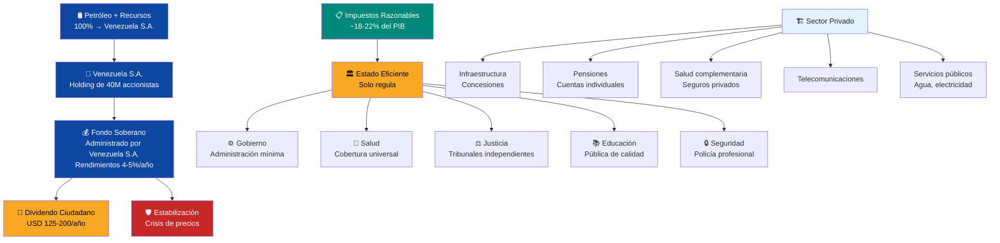

**Regla de oro:** Si un servicio puede operarse privadamente con supervisión estatal y entrega mejor resultado, NO lo opera el Estado. **En salud y educación, el Estado FINANCIA y SUPERVISA — no opera.** La supervisión es tripartita: Estado + comunidad + padres/pacientes. **Venezuela S.A.** — el holding corporativo de los ciudadanos — invierte en infraestructura base, cobra regalías de concesiones, administra el fondo soberano y distribuye dividendos.

---

## Lo Que Paga el Estado (Con Impuestos)

Cinco funciones indelegables. Todo lo demás es concesión, contrato o mercado regulado.

| Función | % del Presupuesto | Gasto/PIB | Modelo de referencia |
|---------|-------------------|-----------|---------------------|
| **Gobierno central** | 12–15% | 2–3% | [Singapur: 17% gasto/PIB total](https://www.mof.gov.sg/singaporebudget) |
| **Salud (supervisa, no opera)** | 25–30% | 4–5% | [Chile FONASA](https://www.fonasa.cl/) — Estado recauda contribución 7% y supervisa calidad. Privados operan hospitales |
| **Justicia** | 8–10% | 1,5–2% | [Singapur](https://www.judiciary.gov.sg/) / Estonia |
| **Educación (supervisa, no opera)** | 25–30% | 4–5% | Estado financia vouchers y supervisa estándares. Colegios y universidades operan autónomamente |
| **Seguridad** | 15–20% | 3–4% | [Georgia: reforma policial](https://successfulsocieties.princeton.edu/sites/g/files/toruqf5601/files/Policy_Note_ID126.pdf) |
| **TOTAL** | 100% | **15–19% del PIB** | — |

:::info ¿Por qué 15–19% del PIB?
[Singapur gasta ~17% del PIB](https://www.mof.gov.sg/singaporebudget) en gobierno total y tiene salud universal, educación de clase mundial, y la policía más segura de Asia. Si Singapur puede con 17%, Venezuela puede apuntar a 18–22% en el periodo de reconstrucción y converger a 15–18% en la madurez.
:::

---

## Lo Que NO Paga el Estado

Estos servicios se operan por concesión, contrato o mercado privado regulado. El Estado supervisa, no opera.

:::danger Principio Rector: Todo Servicio Tiene Financiamiento — Nadie Queda Fuera
**Salud y educación son universales: ningún venezolano queda fuera por no tener dinero.** Pero no son "gratis" — están financiados por mecanismos sostenibles, no por regalías del Estado.

| Servicio | Modelo | Financiamiento | Nadie queda fuera |
|----------|--------|---------------|-------------------|
| **Salud** | [FONASA mejorado](https://www.fonasa.cl/) (Chile) | Contribución obligatoria 7% del salario. Todos contribuyen, todos están cubiertos | Tramo A/B (bajos ingresos): 0% copago. Tramo C: 10%. Tramo D: 20% |
| **Educación** | Chile voucher + [SEP](https://www.mineduc.cl/) | Voucher universal que sigue al estudiante. Colegios compiten como empresas privadas | Voucher 50% mayor para familias bajo línea de pobreza. Nadie paga matrícula |
| **Agua** | Israel Mekorot / Singapur PUB | Tarifa de costo real + precio por escasez (conservación) | Voucher para primeros 13m³/mes en extrema pobreza |
| **Electricidad** | Chile/Singapur competitivo | Tarifa de costo real (hidro venezolana = ~USD 0.05-0.06/kWh SIN subsidio — naturalmente barata) | Voucher focalizado en transición |
| **Gasolina** | Precio de mercado (transición Arabia Saudita) | Precio de mercado: ~USD 0.50-0.80/litro a USD 60/barril | Ninguno. Transición gradual en 5-10 años |
| **Telecomunicaciones** | 5G SA competitivo | Tarifa de mercado (operadores compiten) | Puntos de acceso público WiFi en escuelas/plazas |

**La gratuidad destruyó a Venezuela:** gasolina regalada = contrabando masivo, electricidad gratis = desperdicio + apagones. **El modelo es: financiamiento sostenible (contribución solidaria para salud, voucher para educación) + tarifa de mercado para todo lo demás.** [Chile FONASA cubre al 83% de la población](https://www.supersalud.gob.cl/) con contribución solidaria. [Israel recicla 85% de aguas residuales](https://www.haaretz.com/) porque el precio refleja escasez.
:::

### Fondo Ciudadano Venezuela (FCV): Una Sola Cuenta, Cero Burocracia

**¿Por qué tener un sistema de salud separado de pensiones separado de vivienda?** En [Singapur, el CPF](https://www.cpf.gov.sg/) es UNA sola cuenta con subcuentas. El ciudadano ve todo su ahorro en un solo lugar. Una sola institución lo administra. Cero duplicidad burocrática.

Venezuela adopta el mismo principio: **el Fondo Ciudadano Venezuela (FCV)** es una cuenta personal obligatoria que unifica salud, retiro, vivienda y educación superior en un solo vehículo.

| Subcuenta | % del salario | Para qué | Propiedad | Modelo |
|-----------|--------------|----------|-----------|--------|
| **Retiro** | 8% | Pensión al jubilarse | Del trabajador — nadie se la quita | [Singapur CPF Special Account](https://www.cpf.gov.sg/) |
| **Salud** | 7% | Hospitalización, medicamentos, copagos. Fase 1-5: 100% solidario. Fase 5+: solidario + ahorro individual | Solidario (fase 1) → individual (fase 3) | [Chile FONASA](https://www.fonasa.cl/) → [Singapur MediSave](https://www.moh.gov.sg/) |
| **Vivienda** | 4% | Pago inicial de vivienda propia. Crédito hipotecario | Del trabajador | [Singapur CPF Ordinary Account](https://www.cpf.gov.sg/) |
| **Educación** | 2% | Universidad propia o de los hijos | Del trabajador | [Singapur CPF Education Scheme](https://www.cpf.gov.sg/) |
| **TOTAL** | **21%** | | **(10% trabajador + 11% empleador)** | Singapur CPF: 37% |

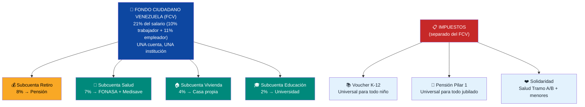

#### El FCV empieza al nacer — Venezuela S.A. invierte primero

**El FCV no empieza cuando consigues trabajo. Empieza cuando naces.** Venezuela S.A. y el Estado abren una cuenta FCV para cada recién nacido y depositan **USD 150/mes** desde el mes 1. De ahí se financia la salud y educación del menor:

| Edad | VSA deposita | Salud del menor | Educación K-12 | Ahorro neto |
|------|-------------|----------------|----------------|-------------|
| **0-4 años** | USD 150/mes | USD 30/mes (FONASA menor) | — (preescolar) | USD 120/mes → ahorro |
| **5-17 años** | USD 150/mes | USD 30/mes | USD 100/mes (voucher K-12) | USD 20/mes → ahorro |

A los 18 años, el ciudadano ha recibido **USD 32,400 en inversión** de Venezuela S.A. De eso: USD 6,480 financiaron su salud, USD 15,600 su educación K-12, y **USD 20,218 quedaron como ahorro** (con interés compuesto al 5%). Ese ahorro se distribuye en las 4 subcuentas del FCV cuando empieza a trabajar.

**Venezuela S.A. invierte en el ciudadano ANTES de que el ciudadano produzca.** Esa es la diferencia con un sistema de mercado puro: el país apuesta por cada persona desde el día 1. A cambio, el ciudadano contribuye al sistema durante 47 años de vida laboral.

**Lo que complementa el FCV** (financiado con impuestos):
- **Pensión Pilar 1**: universal, para todo jubilado — incluye a quienes nunca contribuyeron
- **Salud Tramo A/B**: solidaridad adicional para adultos sin ingresos/extrema pobreza

#### FCV para la diáspora: incentivo para volver

| Situación | Dividendo del fondo soberano | FCV (4 subcuentas) | Cómo funciona |
|-----------|-----------------------------|--------------------|--------------|
| **Venezolano en el exterior — NO contribuye** | ✓ Recibe dividendo como accionista de Venezuela S.A. | ✗ No acumula en FCV | Mantiene sus derechos como ciudadano-accionista. Si vuelve, empieza a contribuir desde ese momento |
| **Venezolano en el exterior — contribuye voluntariamente** | ✓ Recibe dividendo | ✓ Acumula en las 4 subcuentas | Paga 21% voluntario sobre ingresos declarados. Cuando vuelva, tiene salud, vivienda, pensión y educación para hijos ya acumulados |
| **Venezolano que retorna** | ✓ Recibe dividendo | ✓ Empieza/continúa FCV | Se incorpora al sistema como cualquier trabajador. Los años contribuidos desde el exterior cuentan |

:::tip El FCV es el mayor incentivo de retorno
Un venezolano en Miami gana USD 4.500/mes pero NO tiene FCV. Si contribuye voluntariamente el 21% (USD 945/mes) durante 10 años desde el exterior, acumula ~USD 150.000 en su FCV. Cuando vuelve a Venezuela tiene: casa (subcuenta vivienda), salud cubierta (subcuenta salud), pensión avanzada (subcuenta retiro), y universidad para sus hijos (subcuenta educación). **El FCV convierte "volver" de un riesgo a una inversión calculada.**
:::

#### Extranjeros que llegan a Venezuela: mismo sistema

Los extranjeros que trabajen legalmente en Venezuela contribuyen al FCV **exactamente igual que un venezolano**. El sistema no discrimina por nacionalidad — discrimina por contribución.

| Situación | Dividendo del fondo | FCV | Cómo funciona |
|-----------|--------------------|----|--------------|
| **Extranjero con permiso de trabajo** | ✗ No recibe dividendo (no es accionista de VSA) | ✓ Contribuye y acumula FCV desde el Día 1 | Mismas 4 subcuentas. Si se va: retira lo acumulado menos costos (ver abajo) |
| **Extranjero con residencia permanente** | ✗ No recibe dividendo (salvo que se naturalice) | ✓ FCV completo | Mismos beneficios. Hijos nacidos en Venezuela: FCV desde nacimiento (VSA contribuye) |
| **Extranjero naturalizado** | ✓ Recibe dividendo (es venezolano) | ✓ FCV completo | Pasa a ser ciudadano-accionista de Venezuela S.A. con todos los derechos |
| **Hijos de extranjeros nacidos en Venezuela** | ✓ Son venezolanos | ✓ FCV desde nacimiento (VSA contribuye) | Nacen con cuenta FCV. VSA deposita USD 150/mes. Mismos derechos que cualquier venezolano |

#### Qué pasa cuando un extranjero se va del país

El FCV del extranjero es **retirable**, pero el Estado recupera lo que invirtió:

| Concepto | Qué pasa |
|----------|----------|
| **Subcuenta Retiro** | Se le devuelve 100% de lo acumulado (es su dinero) |
| **Subcuenta Salud** | Se le devuelve el saldo no utilizado |
| **Subcuenta Vivienda** | Se le devuelve el saldo (si no compró casa) |
| **Subcuenta Educación** | Se le devuelve el saldo no utilizado |
| **(-) Inversión de VSA en sus hijos** | Se descuenta lo que Venezuela S.A. invirtió en educación y salud de hijos nacidos en Venezuela (USD 150/mes × meses cubiertos) |
| **(-) Salud utilizada (solidaridad)** | Se descuenta el costo de atención médica recibida vía componente solidario del FCV (hospitalización, cirugías, tratamientos financiados por el fondo común — no lo que pagó de su bolsillo vía copago) |
| **(-) Comisión de administración** | Se descuenta la comisión acumulada del fondo (~0,5% anual sobre el saldo) |
| **= Monto a recibir** | **Acumulado total − inversión VSA en hijos − salud solidaria utilizada − comisiones** |

**Ejemplo:** Un extranjero trabajó 8 años, acumuló USD 45.000 en FCV. Tuvo 1 hijo (4 años, VSA invirtió USD 7.200). Usó USD 3.500 en salud solidaria (una cirugía + hospitalización). Comisiones: USD 1.200. **Recibe: USD 45.000 − USD 7.200 − USD 3.500 − USD 1.200 = USD 33.100.**

:::info Atraer talento global con el FCV
El FCV es una ventaja competitiva para atraer talento extranjero. Un ingeniero colombiano, peruano o argentino que trabaje en Venezuela acumula en 4 subcuentas desde el Día 1 — algo que su país de origen probablemente NO ofrece en un solo sistema. Si se queda 10+ años, tiene casa, salud y pensión. Si se va, retira su dinero (menos lo que Venezuela invirtió en sus hijos y comisiones). **Es justo: el sistema te protege mientras contribuyes, y si te vas, te devuelve lo tuyo menos lo que el país invirtió en tu familia.**
:::

#### Transición gradual del FCV

| Fase | Años | Contribución total | Distribución | Razón |
|------|------|-------------------|-------------|-------|
| **Emergencia** | 1-3 | 14% | Retiro 8% + Salud 6% (100% solidario) | 82,8% pobreza. No hay capacidad para vivienda ni educación. Salud es puro fondo solidario |
| **Estabilización** | 3-7 | 18% | Retiro 8% + Salud 6% + Vivienda 4% | Ingresos suben. Se abre subcuenta vivienda. Trabajadores empiezan a ahorrar para casa propia |
| **Construcción** | 7-12 | 21% | Retiro 8% + Salud 7% + Vivienda 4% + Educación 2% | Clase media creciente. Se abre subcuenta educación. Salud introduce componente individual (Medisave) |
| **Madurez** | 12+ | 25% | Retiro 10% + Salud 7% + Vivienda 5% + Educación 3% | Convergencia al modelo Singapur. Ciudadano es dueño de su ahorro en las 4 áreas |

:::tip ¿Por qué 21% y no 37% como Singapur?
Singapur tiene PIB per cápita de USD 65.000. Venezuela parte de USD 2.075. No se puede pedir 37% a un salario de USD 200/mes. Se arranca en 14% (fase emergencia) y se sube gradualmente. La meta es 25% al año 12+ — cuando el PIB per cápita supere USD 8.000. La clave: cada punto porcentual adicional se introduce SOLO cuando los ingresos reales han subido lo suficiente para absorberlo sin ahogar al trabajador.
:::

:::info Ventajas del FCV unificado vs. sistemas separados
| Separado (FONASA + AFP + subsidio vivienda + beca) | Unificado (FCV) |
|-----------------------------------------------------|-----------------|
| 4 instituciones, 4 burocracias, 4 rendiciones de cuentas | **1 institución, 1 cuenta, 1 app** |
| El ciudadano no sabe cuánto tiene en total | **Dashboard único: ves retiro + salud + vivienda + educación** |
| Cada sistema tiene su propio costo administrativo | **Economía de escala: comisiones más bajas** |
| Fondos fragmentados invierten por separado | **Un solo fondo invierte profesionalmente todo el pool** |
| Difícil de reformar (cada sistema tiene su lobby) | **Una sola reforma, un solo marco legal** |
| Singapur: 37% en 1 sistema = eficiente | **Chile: 17% en 3 sistemas = ineficiente** |
:::

### Infraestructura: Modelo Concesiones Chile

[Chile ha otorgado 82 concesiones](https://www.mop.cl/Paginas/default.aspx) desde 1993 por USD 28.000+ M en inversión privada: autopistas, aeropuertos, hospitales, cárceles.

| Infraestructura | Modelo | Referencia |
|----------------|--------|-----------|
| Autopistas y carreteras | Concesión 20–30 años con peaje | [Chile Ruta 5 (3.364 km)](https://www.mop.cl/Paginas/default.aspx) |
| Aeropuertos | Concesión operativa | [Chile SCL Nuevo Pudahuel](https://www.nuevopudahuel.cl/) |
| Puertos | Concesión portuaria | Colombia: Sociedad Portuaria |
| Agua y saneamiento | Concesión + tarifa regulada | [Chile: empresas sanitarias privatizadas](https://www.siss.gob.cl/) |
| Telecomunicaciones | Licencias competitivas | Modelo LATAM estándar |
| Electricidad (distribución) | Concesión regulada | Chile: Enel/CGE |
| Hospitales (infraestructura) | Concesión BOT | [Chile: Hospital Maipú](https://www.mop.cl/Paginas/default.aspx) |
| Vivienda social | Subsidio a demanda (no construcción estatal) | [Chile: subsidio habitacional](https://www.minvu.gob.cl/) |

:::tip Vivienda: Subcuenta FCV + subsidio a demanda
El trabajador acumula ahorro en la **Subcuenta Vivienda del FCV** (4-5% del salario). Ese ahorro se usa como pago inicial de vivienda propia — como en [Singapur](https://www.cpf.gov.sg/) donde 89,7% de la población es propietaria gracias al CPF. Para familias de bajos ingresos que no han acumulado suficiente: subsidio a demanda (modelo Chile). El Estado no construye viviendas — el privado construye, Venezuela S.A. participa como accionista en JVs, y el ciudadano elige dónde vivir.
:::

### Pensiones: Subcuenta Retiro del FCV

> La pensión es la **Subcuenta Retiro** del [Fondo Ciudadano Venezuela (FCV)](#fondo-ciudadano-venezuela-fcv-una-sola-cuenta-cero-burocracia). No es un sistema separado — es parte de la cuenta unificada del ciudadano.

El [AFP chileno](https://www.spensiones.cl/) lleva 44 años funcionando pero tiene problemas: tasas de reemplazo bajas (~40%), comisiones altas, y brechas de género. El [CPF de Singapur](https://www.cpf.gov.sg/) es superior: contribución más alta (37% vs. 10%), cubre vivienda+salud+retiro, y está [rankeado #5 mundial](https://www.mercer.com/insights/investments/market-outlook-and-trends/mercer-cfa-global-pension-index/) (grado A).

| Aspecto | Chile AFP | Singapur CPF | Venezuela (propuesta) |
|---------|----------|-------------|----------------------|
| Contribución total | 10% (solo trabajador) | 37% (20% + 17% empleador) | 21% (10% trabajador + 11% empleador) via FCV |
| Administración | AFPs privadas | Gobierno (CPF Board) | FCV: ente público autónomo (tipo CPF Board) |
| Cubre | Solo retiro | Vivienda + salud + retiro | Retiro + salud + vivienda + educación (4 subcuentas) |
| Tasa de reemplazo | [~40%](https://economia.lse.ac.uk/articles/10.31389/eco.420) | ~50–70% | Meta: >50% |
| Comisiones | ~1,2% del fondo | ~0,1–0,2% | Techo: 0,5% (regulado) |
| Ranking global | [Grado B](https://www.mercer.com/insights/investments/market-outlook-and-trends/mercer-cfa-global-pension-index/) | [Grado A, #5](https://www.mercer.com/insights/investments/market-outlook-and-trends/mercer-cfa-global-pension-index/) | Meta: Grado B+ |
| Pilar solidario | PGU (2008, reformada 2025) | Silver Support Scheme | Pilar 1 universal (ver [Pensiones](/06-realidad/pensiones-seguridad-social)) |

**Modelo Venezuela:** Tomar lo mejor de ambos:
- **De Chile:** Cuentas individuales con propiedad del trabajador, libertad de elección de fondo
- **De Singapur:** Contribución compartida empleador/trabajador, comisiones reguladas bajas, cobertura ampliada

El Pilar 1 universal (USD 100–200/mes) lo financia el presupuesto público. Los Pilares 2 y 3 son privados. Ver detalle en [Pensiones y Seguridad Social](/06-realidad/pensiones-seguridad-social).

### Salud: Subcuenta Salud del FCV — Universal, Contributivo, Sin Exclusión

> La salud es la **Subcuenta Salud** del [Fondo Ciudadano Venezuela (FCV)](#fondo-ciudadano-venezuela-fcv-una-sola-cuenta-cero-burocracia). El 7% de contribución va a esta subcuenta. En fase 1-5 es 100% solidario (FONASA). A partir del año 5 se introduce el componente individual (Medisave).

**No es "gratis" — es financiado por contribución obligatoria. Pero nadie queda fuera.**

| Componente | Cómo funciona | Financiamiento | Modelo |
|-----------|--------------|---------------|--------|
| **FONASA (seguro solidario)** | Seguro universal obligatorio. Todos contribuyen, todos están cubiertos. Tramos por ingreso determinan copago | 7% del salario bruto (cotización obligatoria) | [Chile FONASA](https://www.fonasa.cl/) — cubre [83% de la población](https://www.supersalud.gob.cl/) |
| **Menores de 18: cobertura automática** | **Todo menor tiene salud garantizada automáticamente** — sin copago, sin trámites, sin depender del estatus laboral de los padres | Financiado por solidaridad del sistema | Constitucional — derecho del menor |
| **Tramo A (sin ingresos)** | Cobertura total sin copago. Indigentes, desempleados, pensionados mínimos | Financiado por solidaridad del sistema + presupuesto público | [FONASA Tramo A](https://www.fonasa.cl/) |
| **Tramo B (bajos ingresos)** | Cobertura total sin copago | Cotización 7% sobre ingreso bajo | [FONASA Tramo B](https://www.fonasa.cl/) |
| **Tramo C (ingreso medio)** | Copago 10% en prestaciones | Cotización 7% | Igual que FONASA Chile |
| **Tramo D (ingreso alto)** | Copago 20% en prestaciones | Cotización 7% | Igual que FONASA Chile |
| **ISAPRE (opción privada)** | Seguros privados para quienes quieran más cobertura o menos espera | Prima privada (en vez de FONASA) | [Chile ISAPRE](https://www.supersalud.gob.cl/) — opción, no obligación |
| **Hospitales** | Concesión BOT (privado construye y opera, Venezuela S.A. como accionista en JV) | Pagos de FONASA/ISAPRE | [Chile: hospitales concesionados](https://www.mop.cl/) |

:::info Cobertura universal al 4-5% del PIB
FONASA Chile cubre al [83% de la población](https://www.supersalud.gob.cl/) con contribución obligatoria del 7% del salario. Desde 2022, la atención pública es efectivamente sin copago para todos los beneficiarios FONASA. La hidro-energía barata de Venezuela (USD 0.05-0.06/kWh) reduce costos operativos de hospitales. Con telemedicina ([Estonia: 99% recetas digitales](https://e-estonia.com/)) + hospitales concesionados, Venezuela puede lograr cobertura universal al **4-5% del PIB**. La clave: contribución solidaria + gestión privada eficiente + tecnología.
:::

#### Transición Gradual: FONASA → Híbrido FONASA + Medisave

Con 82,8% de pobreza, no se puede arrancar con ahorro individual tipo Singapur (nadie tiene con qué ahorrar). Se arranca con solidaridad (FONASA) y se transiciona gradualmente a un modelo híbrido a medida que los ingresos suben:

| Fase | Años | Contribución 7% | División | Razón |
|------|------|-----------------|----------|-------|
| **Emergencia** | 1-5 | 7% → 100% FONASA solidario | Todo al fondo solidario. Cobertura universal inmediata | 82,8% pobreza. No hay ingreso para ahorro individual |
| **Introducción Medisave** | 5-10 | 7% → 5% FONASA + 2% Medisave personal | Se crea cuenta de ahorro médico personal para copagos, medicamentos, dental, óptica | Ingresos subiendo. Clase media creciente puede ahorrar |
| **Maduración** | 10-15 | 7% → 4% FONASA + 3% Medisave | Medisave crece. FONASA se concentra en Tramos A/B y catastrófico | Pobreza <25%. Mayoría tiene ahorro médico propio |
| **Equilibrio** | 15+ | 7% → 3% FONASA + 4% Medisave | Ciudadano es dueño de su ahorro médico + piso solidario garantizado | Economía madura. Modelo híbrido sostenible |

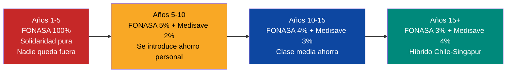

**Lo mejor de dos mundos:**
- **De Chile (FONASA):** Solidaridad, cobertura universal desde el Día 1, nadie excluido por falta de dinero
- **De Singapur (Medisave):** Propiedad individual del ahorro, eficiencia, conciencia de costo, 5% PIB con resultados de primer mundo

### Educación: Voucher Universal + Colegios como Empresas Autónomas

> **K-12**: voucher universal financiado por impuestos (no por el FCV). **Universidad**: voucher por mérito + **Subcuenta Educación del [FCV](#fondo-ciudadano-venezuela-fcv-una-sola-cuenta-cero-burocracia)** (2-3% del salario). El trabajador acumula ahorro que puede usar para su propia educación superior o la de sus hijos.

**Ningún niño queda fuera. Cada familia elige dónde estudia su hijo — y el voucher paga.**

| Componente | Cómo funciona | Modelo |
|-----------|--------------|--------|
| **Voucher universal (sistema de puntos)** | Todo niño (K-12) recibe un voucher con **tope de puntos** que cubre: colegio + comedor + transporte + 1 deporte + 1 arte/actividad extra. **El precio lo fija el mercado** — cada colegio y proveedor cobra lo que quiera, pero el estudiante paga con puntos hasta el tope. Si el colegio cobra más del tope → la familia paga la diferencia. Esto genera competencia: colegios compiten por ofrecer más calidad dentro del rango de puntos | [Chile SEP](https://www.mineduc.cl/) + [Finlandia: transporte + comedor](https://www.oph.fi/) |
| **Voucher SEP (+50%)** | Familias bajo línea de pobreza reciben voucher 50% mayor | [Chile Subvención Escolar Preferencial](https://www.mineduc.cl/) |
| **Voucher extracurricular (puntos)** | El voucher incluye un **tope de puntos** para actividades extracurriculares. Mínimo obligatorio: **1 deporte + 1 arte o actividad extra**. Los puntos se gastan en proveedores acreditados — el precio lo fija el mercado, pero el voucher tiene un tope. No tienen que ser en el mismo colegio: el padre elige cualquier proveedor acreditado (academia de música, dojo, escuela de fútbol, club de robótica, etc.). Es un plus si el colegio las ofrece internamente | [Singapur CCA](https://www.moe.gov.sg/) — Co-Curricular Activities obligatorias |
| **Colegios públicos → empresas privadas** | Comunidades educativas que se organicen para modernizar y gestionar colegios reciben apoyo: fondos de modernización + asistencia técnica + autonomía de gestión | [Chile: colegios subvencionados](https://www.mineduc.cl/) — compiten por vouchers |
| **Colegios en línea** | Habilitados como opción válida con acreditación oficial. Red de tutores presenciales y remotos para acompañamiento personalizado | [Uruguay Plan Ceibal](https://www.ceibal.edu.uy/) + [Khan Academy](https://www.khanacademy.org/) |
| **Auditoría de colegios** | Todo colegio que reciba vouchers es auditado: resultados académicos, infraestructura, gestión financiera. Si no cumple estándares → pierde acreditación | [Chile: Agencia de Calidad de la Educación](https://www.agenciaeducacion.cl/) |
| **Evaluación de profesores** | Profesores evaluados periódicamente por resultados, metodología y actualización. Incentivos por desempeño: bonos anuales para los mejores | [Singapur: Enhanced Performance Management System](https://www.moe.gov.sg/) |

#### Monto del voucher K-12 (hasta los 18 años)

| Componente | Mínimo | Óptimo | Referencia |
|-----------|--------|--------|-----------|
| Matrícula / operación escolar | USD 80/mes | USD 120/mes | Salarios docentes + infraestructura. Chile: ~USD 100/mes |
| Comedor escolar | USD 25/mes | USD 40/mes | [Finlandia](https://www.oph.fi/): USD 50/mes. [Chile JUNAEB](https://www.junaeb.cl/): USD 25/mes |
| Transporte escolar | USD 15/mes | USD 30/mes | Ruta concesionada. Finlandia: incluido |
| Actividades extracurriculares | USD 30/mes | USD 50/mes | 2-3 actividades: idioma, deporte, arte/robótica |
| Material escolar + tablet | USD 10/mes | USD 20/mes | [Uruguay Ceibal](https://www.ceibal.edu.uy/): USD 10/mes amortizado |
| Seguro escolar | USD 3/mes | USD 5/mes | Accidentes + responsabilidad civil |
| **TOTAL voucher estándar** | **USD 163/mes** | **USD 265/mes** | **USD 1.956-3.180/año** (Chile: USD 3.200/año) |
| **Voucher SEP (+50%)** | **USD 244/mes** | **USD 397/mes** | **USD 2.928-4.764/año** |

Implementación gradual (el voucher crece con la economía):

| Fase | Voucher estándar | Voucher SEP | Qué cubre |
|------|-----------------|-------------|-----------|
| Emergencia (Años 1-3) | USD 163/mes | USD 244/mes | Matrícula + comedor + material |
| Estabilización (Años 3-7) | USD 214/mes | USD 321/mes | + Transporte |
| Construcción (Años 7-12) | USD 265/mes | USD 397/mes | + Extracurriculares completas |
| Madurez (Años 12+) | USD 295/mes | USD 442/mes | + Tablet/laptop + seguro premium |

#### Ejes del nuevo currículo

El currículo se rediseña para el siglo XXI. No se enseña lo de los 90 — se enseña lo que generará empleo en 2035-2040:

| Eje | Desde | Horas/semana | Referencia |
|-----|-------|-------------|-----------|
| **Lectura** | Preescolar | 5-7 hrs (lectura guiada + biblioteca + lectura en casa) | [Singapur: #1 PIRLS](https://pirls2021.org/results/achievement/overall/). [Finlandia: cultura lectora](https://worldpopulationreview.com/country-rankings/education-rankings-by-country) desde preescolar, bibliotecas en cada escuela |
| **Inglés + segundo idioma** (mandarín o portugués) | 1er grado | 10+ hrs (inglés), 3-5 hrs (2do idioma) | [Singapur: bilingüe obligatorio desde 1er grado](https://www.moe.gov.sg/) |
| **Ciencias y STEM** | 1er grado | 6-8 hrs (laboratorio + teoría) | Singapur: #1 PISA ciencias |
| **Robótica y programación** | 3er grado | 3-5 hrs | [Estonia ProgeTiger](https://www.hitsa.ee/) desde 1er grado |
| **Música, teatro, artes** | 1er grado | 4-6 hrs | Finlandia: artes como pilar curricular |
| **Educación financiera** | 5to grado | 2 hrs | Australia: financial literacy en currículo nacional |
| **Pensamiento crítico y debate** | 3er grado | Integrado en todas las materias | Finlandia: competencias transversales |
| **Emprendimiento** | 7mo grado | 2 hrs | Junior Achievement: 100+ países |

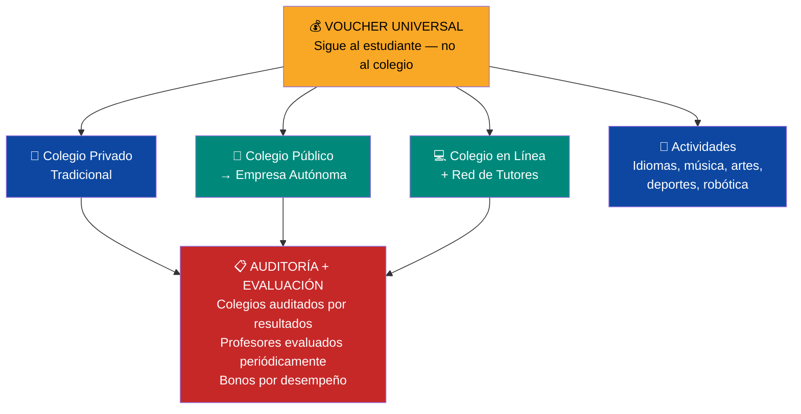

:::tip ¿Por qué lectura e idiomas como ejes primordiales?
**Lectura:** [Singapur es #1 mundial en PIRLS](https://pirls2021.org/results/achievement/overall/) (lectura a los 10 años). Finlandia tiene la mayor densidad de bibliotecas per cápita del mundo. Un niño que lee a los 7 años aprende todo lo demás más rápido. **La lectura es el multiplicador de todas las demás competencias.**

**Idiomas:** Un developer que habla inglés gana USD 3.000-6.000/mes (mercado global) vs. USD 800-1.500/mes solo español. El inglés multiplica el ingreso por 2-4x. Mandarín abre 1.400M de personas. Portugués abre Brasil (220M). [Singapur](https://www.moe.gov.sg/) hizo del bilingüismo obligatorio la base de su transformación económica.
:::

:::info Cada colegio es una oportunidad de empleo y negocio
Cuando un colegio se convierte en empresa autónoma, crea empleo directo: directores, maestros, administrativos, mantenimiento, cocina, IT, seguridad, tutores en línea. Y genera demanda de bienes y servicios: materiales educativos, tecnología, alimentación escolar, transporte, uniformes.

El voucher extracurricular crea un **ecosistema de negocios educativos**: músicos abren academias de música, artistas enseñan artes plásticas, ingenieros desarrollan plataformas edtech, instructores de artes marciales abren dojos, entrenadores deportivos crean escuelas de fútbol/béisbol/natación — todos compiten por el voucher del estudiante. Cada actividad es un negocio viable con demanda garantizada.

Con ~25.000 centros educativos + miles de proveedores extracurriculares, el sistema crea **500.000+ empleos directos** y un mercado edtech de miles de millones. Todos supervisados y acreditados por estándares de calidad. El voucher no es solo un mecanismo educativo — es un motor económico.
:::

:::caution Lección de Suecia y Chile: el voucher sin controles segrega
[Suecia](https://www.ifau.se/globalassets/pdf/se/2024/wp-2024-17-unpacking-the-impact-of-voucher-schools-evidence-from-sweden.pdf) y [Chile](https://www.newamerica.org/education-policy/edcentral/chiles-school-voucher-system-enabling-choice-or-perpetuating-social-inequality/) demostraron que el voucher sin diferenciación crea segregación: colegios privados seleccionan a los mejores estudiantes. La solución: **voucher diferenciado (SEP)** — más valor para estudiantes de menor ingreso. Prohibición de selección por ingreso. [25 países OECD](https://www.edchoice.org/school-voucher-systems-across-globe-make-case-school-choice-u-s/) usan vouchers; los que funcionan (Países Bajos, Chile post-SEP) combinan libre elección + auditoría de resultados + financiamiento diferenciado.
:::

#### Mitigación de riesgos del modelo educativo

| Riesgo | Cómo ocurrió en otros países | Mitigación |
|--------|------------------------------|-----------|
| **Segregación por ingreso** | Suecia y Chile: colegios privados seleccionan estudiantes ricos | Prohibición de selección por ingreso. Voucher SEP +50% para bajos ingresos. El mercado y la libre elección corrigen |
| **Colegios de baja calidad capturan vouchers** | EE.UU.: escuelas charter sin supervisión producen resultados peores | [Agencia de Calidad](https://www.agenciaeducacion.cl/) audita resultados anuales. Colegio que no cumple estándares → **pierde acreditación** → el mercado desconfía, los padres mueven vouchers a otro colegio, el colegio se ve obligado a tomar acciones o cierra |
| **Profesores no se actualizan** | Venezuela actual: currículo de los 90, sin evaluación | Evaluación periódica obligatoria. Bonos por desempeño. Capacitación continua financiada. Si no cumple → plan de mejora o reasignación |
| **Colegios en línea sin calidad** | EE.UU.: escuelas virtuales con tasas de graduación de 50% | Red de tutores presenciales obligatoria. Evaluaciones presenciales periódicas. Supervisión de tiempo de estudio |
| **Proveedores extracurriculares fraudulentos** | Cobran voucher sin dar servicio | Acreditación obligatoria + auditoría aleatoria + encuestas a padres/estudiantes. Pérdida de licencia por fraude |
| **Éxodo docente** | Profesores con inglés emigran a mejor pago | Salarios competitivos desde Día 1 (USD 500-800/mes → USD 1.500-2.000 en año 10). Bonos por permanencia |
| **Transporte inseguro** | Zonas rurales o de alta criminalidad | Rutas escolares operadas por concesión con estándares de seguridad. GPS + monitoreo en tiempo real |

#### Educación Superior: Voucher por Mérito + Universidades Autosostenibles

**Todo estudiante tiene la oportunidad de ir a la universidad — pública o privada. Pero el voucher se gana y se mantiene por esfuerzo.**

| Componente | Cómo funciona | Modelo |
|-----------|--------------|--------|
| **VSA sigue contribuyendo (18-22)** | Si el estudiante va a la universidad, **VSA continúa depositando USD 120/mes** a su FCV durante los 4 años de carrera — igual que lo hizo durante K-12. La inversión en el ciudadano no se detiene | [Singapur CPF](https://www.cpf.gov.sg/) — contribuciones continuas |
| **Voucher universitario por mérito** | Cubre matrícula (~USD 200/mes). Se obtiene por rendimiento académico (notas, admisión) y se mantiene por esfuerzo semestral. Financiado por impuestos | [Singapur: becas por mérito](https://www.moe.gov.sg/) + [Chile GRATUIDAD](https://www.mineduc.cl/) |
| **Mantener el voucher (escalonado)** | Requisitos semestrales: aprobar mínimo de créditos + promedio mínimo. **La pérdida es gradual:** 1er semestre bajo → baja a 75% del voucher. 2do semestre bajo → 50%. 3er semestre → 25%. 4to semestre consecutivo sin cumplir → pierde el voucher. Puede recuperar el 100% si mejora el siguiente semestre | Estándar en becas internacionales (Pell Grant, FAFSA) |
| **Subcuenta Educación de los padres** | Los padres acumulan 2-3% de su salario en Subcuenta Educación del FCV. Pueden transferir a sus hijos para complementar el voucher universitario | [Singapur CPF Education Scheme](https://www.cpf.gov.sg/) |
| **Casos especiales** | Enfermedad, emergencia familiar, discapacidad → comité de evaluación con protocolos claros. Extensiones justificadas, no automáticas | [UK: mitigating circumstances](https://www.officeforstudents.org.uk/) |
| **Salud + alimentación durante estudios** | Salud FONASA automática sin copago + comedor universitario para Tramos A/B verificados. **El estudiante no paga nada de su bolsillo** | [Chile JUNAEB](https://www.junaeb.cl/) |
| **Universidades públicas: siguen públicas** | UCV, USB, ULA, LUZ siguen siendo instituciones públicas. No se privatizan. Pero deben buscar autosostenibilidad parcial | Se mantiene la autonomía universitaria |

:::info ¿Cómo se paga la universidad? — 4 fuentes, cero deuda para el estudiante
| Fuente | Monto (4 años) | Quién paga |
|--------|---------------|-----------|
| **Voucher por mérito** | USD 9.600 | Impuestos (Estado) |
| **VSA continúa contribuyendo al FCV** | USD 5.760 | Fondo soberano (Venezuela S.A.) |
| **Subcuenta Educación de los padres** | Variable | FCV de los padres |
| **Salud + alimentación** | Cubierto | FONASA + JUNAEB |
| **Total invertido** | **~USD 15.360** | **El estudiante NO se endeuda** |

**ROI:** cada USD 1 invertido en universidad genera **USD 12** adicionales en el FCV del ciudadano a los 65 años. Un universitario acumula **USD 756K** vs. USD 463K sin universidad — USD 190K más de diferencia y USD 348/mes más de pensión.
:::

#### Universidades públicas: modelo de autosostenibilidad

Las universidades públicas reciben vouchers por estudiante (no presupuesto fijo global), lo que las obliga a competir por calidad. Además, generan ingresos propios:

| Fuente de ingreso | Cómo funciona | Referencia |
|-------------------|--------------|-----------|
| **I+D + patentes** | Laboratorios de investigación producen patentes licenciables. Universidad retiene % de royalties | [MIT: USD 2.1B en licencias de patentes](https://tlo.mit.edu/) |
| **Alianzas privadas** | Empresas financian cátedras, laboratorios, programas a cambio de acceso a talento e investigación | [Stanford: USD 1.8B/año en investigación patrocinada](https://facts.stanford.edu/) |
| **Spin-offs y startups** | Incubadoras universitarias crean empresas. Universidad retiene equity minoritario | [Technion Israel: 1.600+ empresas, USD 36B en valor](https://www.technion.ac.il/) |
| **Consultoría y servicios** | Facultades ofrecen consultoría técnica a empresas y gobierno | [NUS Singapur: Enterprise](https://enterprise.nus.edu.sg/) |
| **Educación continua** | Cursos ejecutivos, certificaciones, maestrías profesionales con matrícula de mercado | Estándar en universidades top globales |
| **Donaciones y endowment** | Fondo patrimonial que crece con donaciones de egresados y empresas | [Harvard: USD 50B endowment](https://www.harvard.edu/) |

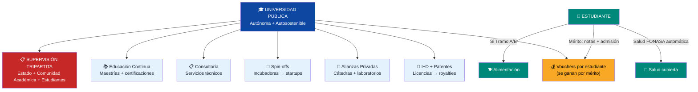

:::tip Universidades como garantes de calidad
La universidad es **responsable de la calidad de los profesionales que forma**. Si un egresado de ingeniería no sabe calcular, la universidad falla — no el estudiante. La acreditación se vincula a resultados: empleabilidad de egresados, calidad de investigación, ingresos propios generados.

**La consecuencia no es fiscal — es reputacional:** la universidad que no cumple estándares **pierde la acreditación**. Eso hace que el mercado desconfíe: los empleadores no contratan a sus egresados, los estudiantes no la eligen, las empresas no hacen alianzas. **La pérdida de acreditación obliga a la universidad a tomar acciones concretas** — reformar programas, cambiar directivos, mejorar infraestructura — para recuperar la confianza. El mercado castiga más rápido y más duro que cualquier sanción estatal.
:::

#### Gobernanza: Estado como Supervisor, No Operador

:::danger Principio de gobernanza: el Estado NO opera servicios — los supervisa
En salud y educación, el Estado:
- **FINANCIA**: recauda contribución FONASA (salud) y asigna vouchers (educación)
- **SUPERVISA**: define estándares de calidad y audita resultados
- **NO OPERA**: no gestiona hospitales, no administra colegios, no dirige universidades

La supervisión es **tripartita**:

| Nivel | Quién supervisa | Qué supervisa |
|-------|----------------|---------------|
| **Estado** | Agencia de Calidad (educación) + Superintendencia de Salud | Estándares nacionales, acreditación, uso de fondos públicos |
| **Comunidad** | Comités locales de padres + asociaciones vecinales | Calidad del servicio, infraestructura, seguridad, trato |
| **Usuarios** | Padres/estudiantes (educación) + pacientes (salud) | Encuestas de satisfacción, libre elección (votan con los pies) |

**La libre elección ES supervisión:** si un colegio es malo, los padres mueven el voucher a otro. Si un hospital da mal servicio, el paciente va a otro. El mercado disciplina más rápido que cualquier auditoría.
:::

---

## Modelo Tributario: Impuestos Razonables

### Principios

1. **Simple:** Pocos impuestos, fáciles de entender y pagar
2. **Bajo:** Tasas competitivas que atraigan inversión, no la espanten
3. **Digital:** Declaración y pago 100% online (modelo Estonia)
4. **Progresivo donde importa:** Los que más ganan, más pagan — pero sin excesos
5. **Sin dependencia petrolera:** Los impuestos cubren el presupuesto SIN petróleo

### Estructura Tributaria Propuesta

| Impuesto | Tasa | Comparación | Justificación |
|----------|------|-------------|---------------|
| **Renta personas** | 15% flat (con mínimo exento) | [Estonia: 20%](https://www.emta.ee/en), [Georgia: 20%](https://www.rs.ge/), Chile: 0–40% | Flat tax = simple, bajo costo de cumplimiento, reduce evasión |
| **Renta empresas** | 15% (utilidades distribuidas) | [Singapur: 17%](https://www.iras.gov.sg/), [Estonia: 20% solo si distribuye](https://www.emta.ee/en), Chile: 27% | Reinversión = 0% (modelo Estonia). Solo paga cuando saca dividendos |
| **IVA** | 12% | [Singapur GST: 9%](https://www.iras.gov.sg/), Chile: 19%, Colombia: 19% | Competitivo para LATAM. Canasta básica exenta |
| **Ganancias de capital** | 0% (primeros 10 años) | [Singapur: 0%](https://www.iras.gov.sg/), Hong Kong: 0% | Atraer inversión. Después: 10% |
| **ZEET (zonas especiales)** | 0% corporativo por 10 años | [Argentina RIGI](https://www.upi.com/Top_News/World-News/2025/10/30/bcpargentina-RIGI-foreign-invetments-report/1561761834454/) | Estabilidad 30 años |
| **Impuesto a la propiedad** | 0,5–1% del valor catastral | [Singapur: 0–20% progresivo](https://www.iras.gov.sg/) | Financia municipios |
| **Aranceles** | 0–5% general | Singapur: 0% | Economía abierta |

### ¿Cuánto Recauda Este Modelo?

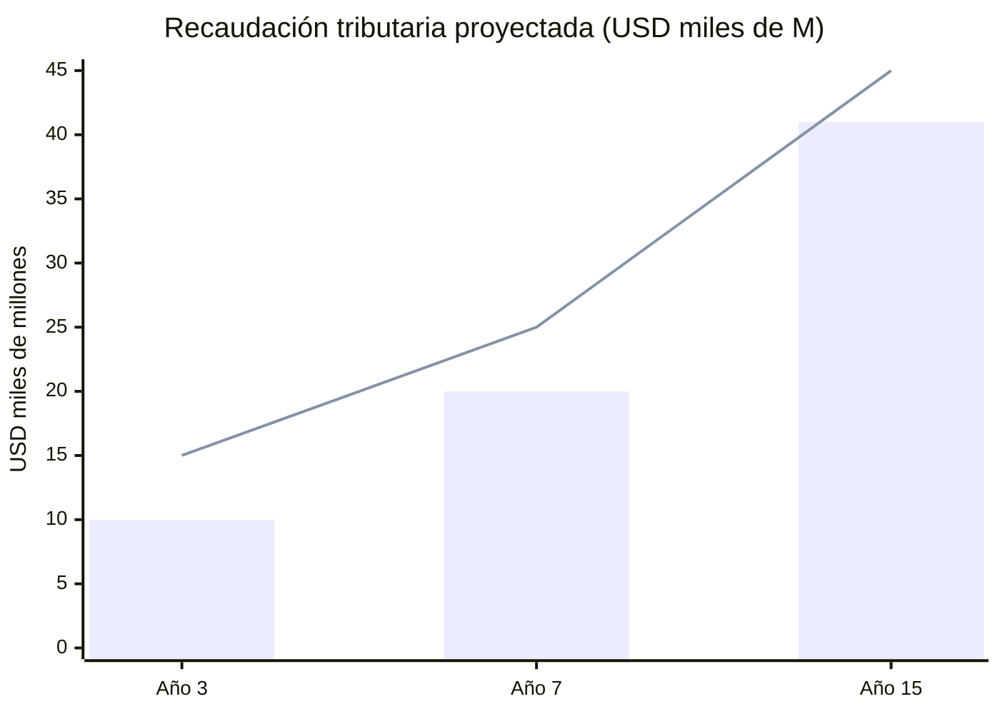

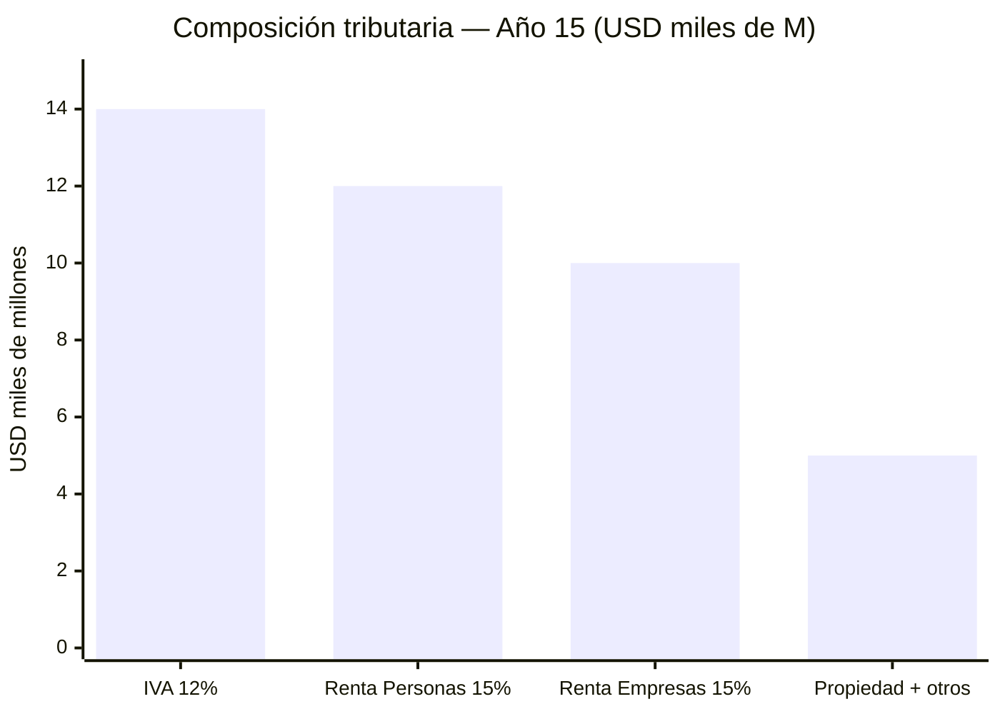

| Fuente tributaria | Año 3 | Año 7 | Año 15 |
|-------------------|-------|-------|--------|
| Renta personas (15% flat) | USD 3.000 M | USD 5.500 M | USD 12.000 M |
| Renta empresas (15%) | USD 2.000 M | USD 5.000 M | USD 10.000 M |
| IVA (12%) | USD 4.000 M | USD 7.000 M | USD 14.000 M |
| Propiedad + otros | USD 1.000 M | USD 2.500 M | USD 5.000 M |
| **Total tributario** | **USD 10.000 M** | **USD 20.000 M** | **USD 41.000 M** |
| **% del PIB** | ~10% | ~15% | ~18% |
| **Presupuesto necesario** | USD 15.000 M | USD 25.000 M | USD 45.000 M |
| **Déficit cubierto por** | Petróleo (transitorio) | Fondo soberano + otros | Autosuficiente |

:::caution La trampa de los impuestos altos
Venezuela bajo Maduro cobra [15% de impuesto sobre nómina](https://central-law.com/en/venezuela-law-on-the-protection-of-social-security-pensions/) solo para pensiones. Colombia cobra 19% de IVA. Argentina tiene 100+ impuestos diferentes. Resultado: evasión masiva, informalidad, y fuga de empresas. El modelo Venezuela S.A. apuesta por tasas BAJAS con base AMPLIA (formalización + digitalización fiscal).
:::

---

## Comparación: Modelos de Estado Eficiente

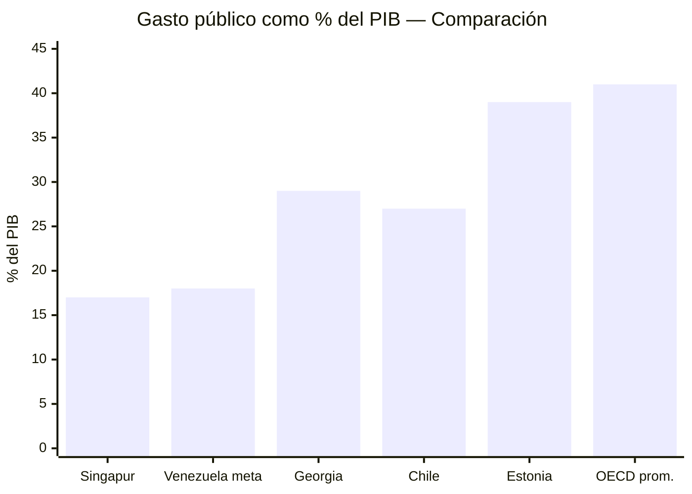

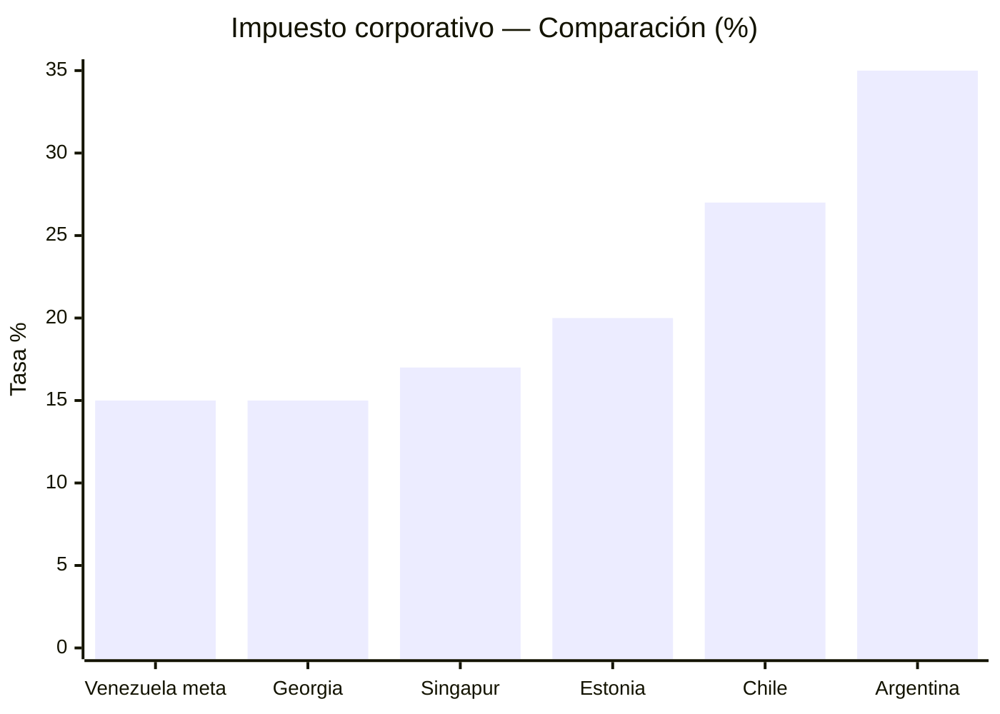

| Indicador | Singapur | Estonia | Georgia | Chile | Venezuela (meta) |
|-----------|----------|---------|---------|-------|-----------------|
| Gasto público/PIB | [~17%](https://www.mof.gov.sg/singaporebudget) | ~39%* | ~29% | ~27% | 18–22% (transición) → 15–18% |
| Impuesto renta (personas) | 0–24% | [20% flat](https://www.emta.ee/en) | [20% flat](https://www.rs.ge/) | 0–40% | 15% flat |
| Impuesto renta (empresas) | [17%](https://www.iras.gov.sg/) | [20% (solo distribuidas)](https://www.emta.ee/en) | [15%](https://www.rs.ge/) | 27% | 15% |
| IVA/GST | [9%](https://www.iras.gov.sg/) | 22% | 18% | 19% | 12% |
| Pensiones | CPF (37%) | 3 pilares | Privado | AFP (10%) | FCV unificado (21%) |
| Ranking Doing Business | #2 | #18 | #7 | #59 | Meta: Top 20 |
| Infraestructura | PPP | Digital | Reformada | Concesiones | Concesiones |

*Estonia: alto gasto/PIB por ser EU — incluye transferencias sociales europeas. El gasto estatal propio es menor.

---

## Hoja de Ruta

| Fase | Acción | Plazo |
|------|--------|-------|
| Día 1 | Decreto: petróleo al fondo soberano (ver [Transición Fiscal](/02-motor-financiero/transicion-fiscal)) | Inmediato |
| Mes 1–6 | Reforma tributaria express: 15% flat + IVA 12% + digitalización | Semestre 1 |
| Año 1 | Ley de concesiones: infraestructura + hospitales + vivienda | Año 1 |
| Año 1–2 | Fondo Ciudadano Venezuela (FCV): 4 subcuentas (retiro + salud + vivienda + educación) + Pilar 1 universal | Año 1–2 |
| Año 2–3 | FCV Salud operativo: cobertura universal (solidario). ISAPRE como opción privada | Año 2–3 |
| Año 3–5 | Base tributaria >15% del PIB → Estado autosuficiente sin petróleo | Año 3–5 |
| Año 7+ | Convergencia a modelo Singapur: gasto público <18% PIB | Largo plazo |
| Año 15 | **Estado vive 100% de impuestos. Petróleo 100% al fondo.** | Meta final |

---

## Reforma del Estado: Terapia de Shock Quirúrgica

> Si hay que recortar, se recorta. Pero con bisturí, no con machete. Se elimina redundancia, no servicios esenciales.

### Principio: Recorte Quirúrgico, No Ciego

El Estado venezolano tiene ~2,5 millones de empleados públicos, decenas de ministerios duplicados, misiones clientelares sin rendición de cuentas, y empresas estatales que pierden dinero. Las empresas estatales se privatizan o se transfieren a Venezuela S.A. como activos del holding ciudadano — el Estado no opera empresas. La reforma es tipo **terapia de shock**:

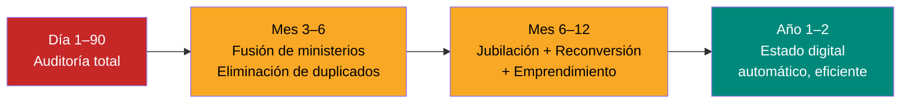

### De 34 Ministerios a 10: Estructura Meta

:::danger 24 ministerios se eliminan o fusionan
El Estado **supervisa, no opera**. Petróleo, minería, agricultura, turismo, vivienda, industria → los opera Venezuela S.A. o el sector privado. El Estado no necesita un ministerio para cada sector que no gestiona.
:::

#### Los 10 ministerios y sus funciones

| # | Ministerio | Funciones | Empleados meta | Digital |
|---|-----------|-----------|---------------|---------|
| 1 | **Presidencia y Gobierno** | Coordinación interministerial, planificación estratégica, relaciones con Venezuela S.A., gabinete | 1.500 | Dashboard de gestión en tiempo real |
| 2 | **Finanzas y FCV** | Recaudación tributaria (15% flat + 12% IVA), administración del Fondo Ciudadano Venezuela (4 subcuentas), presupuesto nacional, auditoría fiscal | 12.000 | Declaración automática 3 minutos ([Estonia](https://e-estonia.com/)). FCV: app única para 40M cuentas |
| 3 | **Relaciones Exteriores** | Diplomacia, tratados comerciales, embajadas/consulados (50+), protección de venezolanos en exterior, retorno diáspora | 3.000 | Trámites consulares 100% online |
| 4 | **Defensa** | Fuerzas armadas completas (Ejército, Armada, Aviación, Guardia Nacional profesionalizada), fronteras (Colombia/Brasil/Guyana), costa Caribe, antinarcóticos, inteligencia, ciberseguridad militar. **Milicia bolivariana: ELIMINADA** (instrumento político, no militar) | 80.000 activos + 3.000 admin civil | Vigilancia fronteriza con drones + IA. Fuerza profesional, no politizada |
| 5 | **Interior, Justicia y Seguridad** | Policía nacional (130K: [ONU recomienda 300/100K hab.](https://ourworldindata.org/grapher/police-officers-per-1000-people)), tribunales (8K), sistema penitenciario (12K), registros civiles, protección de derechos (mujer, indígenas, minorías), migración | 155.000 | Policía predictiva IA. Tribunales 80% virtuales. Expediente digital único. Cámaras + reconocimiento. Inicialmente 170K policías (crimen alto), baja a 130K con IA |
| 6 | **Salud** (supervisor) | Supervisa calidad de hospitales concesionados, acredita clínicas, audita FCV Salud, regula medicamentos, epidemiología | 3.000 | Historia clínica digital única. Telemedicina. Recetas digitales 99% ([Estonia](https://e-estonia.com/)) |
| 7 | **Educación** (supervisor) | Supervisa colegios autónomos, acredita universidades, define currículo nacional, administra vouchers K-12, evalúa profesores | 3.000 | Voucher digital (puntos). Evaluaciones online. Dashboard de calidad por colegio |
| 8 | **Infraestructura y Servicios** | Supervisa concesiones: agua, electricidad, telecoms, transporte, puertos, aeropuertos. Regulación ambiental. Permisos digitales | 2.500 | Permisos automáticos si cumple norma ([Singapur BCA](https://www.bca.gov.sg/)). Monitoreo IoT de infraestructura |
| 9 | **Economía y Trabajo** | Regulación laboral, formalización, competencia, comercio interior/exterior, defensa del consumidor, ZEETs | 2.000 | Registro de empresa en 15 minutos. Monotributo digital |
| 10 | **Digital y Tecnología** | Estado digital (plataforma central), ciberseguridad, identidad digital, datos abiertos, IA gubernamental, interoperabilidad | 5.000 | **ES** la infraestructura digital que habilita a los otros 9 ministerios |

#### Los 24 ministerios que se eliminan

| Ministerio actual | Destino | Razón |
|-------------------|---------|-------|
| Petróleo | → Venezuela S.A. | VSA maneja JVs petroleras. No es función del Estado |
| Minería | → Venezuela S.A. | VSA maneja JVs mineras |
| Energía Eléctrica | → Infraestructura | Concesiones reguladas |
| Aguas | → Infraestructura | Concesiones reguladas |
| Transporte | → Infraestructura | Concesiones reguladas |
| Obras Públicas | → Infraestructura | Concesiones reguladas |
| Hábitat y Vivienda | → **Eliminar** | FCV Vivienda + sector privado construye |
| Agricultura | → **Eliminar** | Sector privado. VSA accionista en JVs agrícolas |
| Pesca | → **Eliminar** | Sector privado |
| Turismo | → **Eliminar** | Sector privado. Promoción desde Economía |
| Industrias | → **Eliminar** | Sector privado |
| Comercio Nacional | → Economía | Fusionar |
| Alimentación (CLAP) | → **Eliminar** | Mercado libre + voucher focalizado |
| Comunas | → **Eliminar** | Clientelismo sin justificación |
| Deporte | → **Eliminar** | Voucher extracurricular financia deportes |
| Cultura | → **Eliminar** | Voucher extracurricular + sector privado |
| Juventud | → **Eliminar** | FCV + voucher cubren a los jóvenes |
| Mujer e Igualdad | → Interior y Justicia | Protección legal integrada |
| Pueblos Indígenas | → Interior y Justicia | Derechos constitucionales integrados |
| Comunicación e Información | → **Eliminar** | Estado no debe tener medios de propaganda |
| Ecosocialismo | → **Eliminar** | Regulación ambiental integrada en Infraestructura |
| Ambiente | → Infraestructura | Regulación ambiental de concesiones |
| Planificación | → Presidencia | Fusionar |
| Ciencia y Tecnología | → Digital | Fusionar |
| Educación Universitaria | → Educación | Un solo ministerio supervisa K-12 + universidad |

#### Empleados públicos: meta por fase

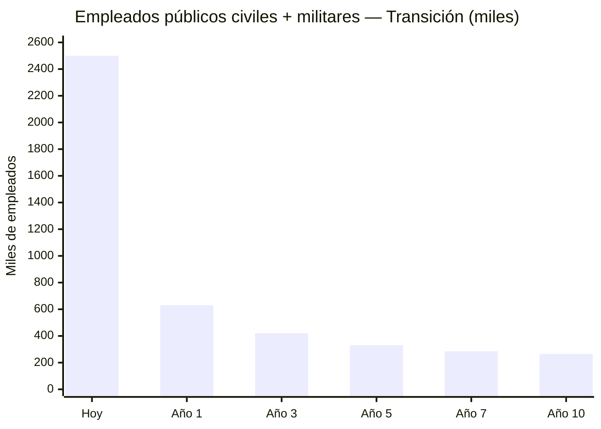

| Fase | Civiles | FFAA | Total | Qué cambia |
|------|---------|------|-------|-----------|
| **Hoy** | **2.370.000** | **130.000** + 220K milicia | **2.500.000+** | Estado opera TODO. Milicia = instrumento político |
| **Año 1** | **550.000** | **80.000** | **630.000** | Fusión 34→10 ministerios. Empresas → VSA. Misiones cerradas. Milicia eliminada. FFAA profesionalizadas |
| **Año 3** | **340.000** | **80.000** | **420.000** | 50% docentes ya en colegios autónomos. Hospitales en concesión |
| **Año 5** | **250.000** | **80.000** | **330.000** | 80% colegios autónomos. IA en policía. Trámites digitales |
| **Año 7** | **205.000** | **80.000** | **285.000** | Tribunales 80% virtuales. Tax automático. 95% colegios autónomos |
| **Año 10** | **185.000** | **80.000** | **265.000** | Estado digital maduro. Todos los servicios en concesión o autónomos |

**Meta: 265.000 empleados totales** (185K civiles + 80K militares) — los mejor pagados de LATAM.

| Comparación | Civiles | Militares | Total | Población | Ratio |
|-------------|---------|-----------|-------|-----------|-------|
| [Singapur](https://www.careers.gov.sg/who-we-are/the-singapore-public-service/) | 158.000 | 50.000 | 208.000 | 5,9M | 1:28 |
| Chile | ~400.000 | 80.000 | 480.000 | 19M | 1:40 |
| **Venezuela meta** | **185.000** | **80.000** | **265.000** | **40M** | **1:151** |
| Venezuela actual | 2.370.000 | 350.000+ | 2.720.000 | 32M | 1:12 |

:::caution Estado lean pero funcional
1:151 es agresivo pero viable porque: (1) estado 100% digital — [Estonia ahorra 2% PIB](https://e-estonia.com/) con e-gov, (2) salud/educación operadas por privados/autónomos — no son empleados públicos, (3) FCV unificado reemplaza 4 burocracias, (4) IA en policía/justicia/impuestos, (5) EE.UU. como aliado de seguridad reduce necesidad militar. Si falla la digitalización, falla el modelo — por eso el Ministerio de Digital es la columna vertebral.
:::

#### Plan de transición para los 2,37M funcionarios desplazados

### Qué Pasa Con la Gente

No se bota a la calle a nadie sin alternativa. **Tres opciones para cada funcionario público desplazado:**

| Opción | Para quién | Mecanismo |
|--------|-----------|-----------|
| **Jubilación anticipada** | Funcionarios >50 años con >15 años de servicio | Pensión Pilar 1 + bonificación de retiro (6–12 meses de salario) |
| **Reconversión laboral** | Funcionarios <50 años con habilidades reutilizables | Programa de capacitación 6 meses (tech, concesiones, salud, educación) + reubicación en sector privado o concesiones |
| **Emprendimiento** | Funcionarios con vocación emprendedora | Acceso directo a programas Semilla/Ignite Venezuela (ver [Startups](/05-transformacion/startup-programs)) + capital semilla + exención fiscal 2 años |

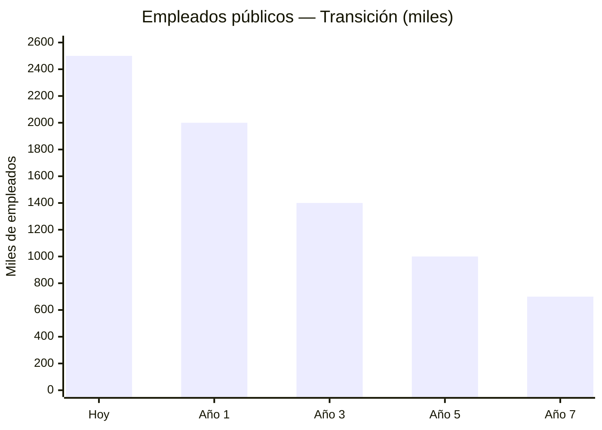

:::info De 2,5 M a 700 mil
Singapur gobierna a 5,9 M de personas con ~150 mil empleados públicos. Estonia a 1,3 M con ~130 mil. Venezuela con 40 M NO necesita 2,5 M de funcionarios. Con automatización + concesiones, la meta es ~700 mil empleados públicos al Año 7 — los mejores pagados de LATAM, en las 5 funciones esenciales.
:::

---

### Recuperación de Fondos Públicos Desviados

> Toda persona o empresa que recibió fondos públicos para un proyecto y no entregó resultados, debe responder.

| Acción | Detalle | Prioridad |
|--------|---------|-----------|
| **Fiscalía especializada** | Unidad dedicada a fraude contra el Estado. Independiente, con jurisdicción retroactiva | Año 1 — empieza a investigar |
| **Auditoría de contratos 2000–2025** | Revisar todos los contratos públicos >USD 1 M. Identificar obras inconclusas, sobrefacturación, fantasmas | Año 1–2 |
| **Acciones legales civiles y penales** | Demandas contra empresas y personas que recibieron fondos y no entregaron | Año 1–5 (no prioritario pero en marcha) |
| **Cooperación internacional** | Rastreo de activos en el exterior vía INTERPOL, OFAC, Transparencia Internacional | Año 1+ |
| **Incentivo whistleblower** | 10–30% de lo recuperado para quien denuncie (modelo [SEC Whistleblower](https://www.sec.gov/whistleblower)) | Desde Día 1 |
| **Destino de lo recuperado** | **100% al fondo soberano** — no al presupuesto corriente | Permanente |

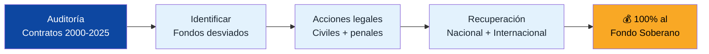

:::caution No es venganza — es rendición de cuentas
El objetivo no es persecución política. Es que quien robó, devuelva. Quien no cumplió un contrato, responda. Esto envía una señal clara a futuros contratistas y funcionarios: en Venezuela S.A., el dinero público tiene dueño — 40 millones de accionistas.
:::

---

## Transición Desde la Pobreza: El Camino Realista

Con 82,8% de pobreza, el modelo final no se implementa el Día 1. Se transiciona:

| Fase | Estado del país | Rol del Estado | Rol del privado | Financiamiento |
|------|----------------|---------------|-----------------|---------------|
| **Emergencia (Año 1)** | Pobreza extrema, sin instituciones | Estado provee servicios básicos: salud, alimentos, pensión mínima, empleo temporal. Venezuela S.A. arranca contratos forward y primeras concesiones | Casi nulo — no hay mercado | 100% ingresos Venezuela S.A. (petróleo) + emergencia humanitaria |
| **Estabilización (Años 2–3)** | Pobreza bajando, dolarización estable | Estado mantiene piso universal. Venezuela S.A. licita concesiones y cobra regalías | Primeras concesiones (telecomunicaciones, puertos) + FCV operativo (14%) | 80% ingresos Venezuela S.A. + 20% impuestos crecientes |
| **Construcción (Años 4–7)** | Pobreza <50%, economía formal creciendo | Estado reduce operación directa. Supervisa salud y educación. Venezuela S.A. administra concesiones + fondo soberano | FCV al 18% (se abre subcuenta vivienda), ISAPRE arrancando, concesiones en marcha | 50% impuestos + 50% fondo soberano (Venezuela S.A.) |
| **Madurez (Años 8–15)** | Pobreza <25%, clase media creciente | Estado solo supervisa las 5 funciones. FCV al 21-25% auto-financiado | FCV maduro. Privado opera infraestructura, hospitales, colegios. ISAPRE activo | 100% impuestos. Petróleo → fondo. FCV auto-financiado |

### Protección durante la transición

| Mecanismo | Para quién | Duración |
|-----------|-----------|----------|
| **Pensión básica universal** (USD 50→200/mes) | TODO jubilado, desde Día 1 | Permanente (Pilar 1) |
| **Salud universal: FCV Salud desde Día 1** | TODO ciudadano cubierto desde el Día 1. Contribución 7% del salario (subcuenta Salud del FCV). Tramos A/B: 0% copago | Permanente (FCV Salud solidario + ISAPRE opcional) |
| **Voucher alimentos** | Hogares bajo línea de pobreza, verificado por ingreso | Transitorio (Años 1–5) — baja a medida que suben ingresos |
| **Empleo público temporal** | Desempleados durante reconstrucción | Transitorio (Años 1–3) — infraestructura intensiva en mano de obra |
| **Voucher vivienda** | Familias sin hogar o hacinamiento, verificado | Permanente (modelo Chile: voucher a demanda, familia elige dónde) |
| **Educación universal: voucher portable** | TODO niño recibe voucher. Colegios compiten como empresas privadas por vouchers. +50% para bajos ingresos | Permanente (modelo Chile SEP — colegios públicos transicionan a empresas autónomas) |
| **Dividendo ciudadano** | TODO venezolano (cuando el fondo lo permita) | Desde Año 3+ (ver [Inversión Ciudadana](/03-ciudadanos/inversion-ciudadana)) |

:::info No es austeridad — es graduación
El objetivo NO es quitar ayuda. Es que la gente YA NO LA NECESITE porque tiene empleo, pensión propia, seguro de salud, y oportunidades. El Estado no desaparece — se reduce porque la gente prospera. La mejor política social es un buen empleo.
:::

---

## Estado Automatizado: Mínima Fricción, Máximo Resultado

> Todo lo que pueda ser automatizado, será automatizado.

| Proceso | Hoy | Meta | Modelo | Ahorro |
|---------|-----|------|--------|--------|
| **Declaración de impuestos** | Manual, presencial, corrupto | Automática, pre-llenada por el sistema | [Estonia: 3 minutos](https://e-estonia.com/) | 95% del costo administrativo |
| **Registro de empresa** | 30+ trámites, semanas | 1 clic, 15 minutos | [Estonia e-Residency](https://e-estonia.com/) / [Georgia: #7 Doing Business](https://www.rs.ge/) | 90% del tiempo |
| **Permisos de construcción** | Meses, sobornos | Digital, automático si cumple norma | Singapur: BCA | 80% del tiempo |
| **Trámites de salud** | Presencial, colas | Receta digital, historia clínica única, telemedicina | [Estonia: 99% recetas digitales](https://e-estonia.com/) | 70% del costo |
| **Justicia civil** | Años | Meses. 80% casos resueltos online | [UK: Online Courts](https://www.judiciary.uk/) | 60% del costo |
| **Policía** | Patrulla improvisada | Predictiva (IA), cámaras, datos en tiempo real | [Singapur Safe City](https://www.police.gov.sg/) | Reducción de crimen |
| **Compras públicas** | Opacas, corruptas | 100% digitales, abiertas, auditables por IA | [Corea: KONEPS](https://www.pps.go.kr/eng/) | 15–20% ahorro + anticorrupción |
| **Identidad ciudadana** | Cédula física, falsificable | Identidad digital con firma electrónica | [Estonia ID](https://e-estonia.com/) | Base para todo lo demás |

:::tip El dividendo de la automatización
[Estonia ahorra 2% del PIB](https://centreforpublicimpact.org/public-impact-fundamentals/e-estonia-the-information-society-since-1997/) con gobierno digital. Para Venezuela, eso significaría USD 4.000+ M/año al llegar al PIB meta. Menos funcionarios, menos corrupción, menos colas, más velocidad. El Estado no necesita 2 millones de empleados públicos si automatiza el 80% de los trámites.
:::

### Reducir dependencia del Estado

| Hoy | Meta |
|-----|------|
| Millones dependen de bolsas CLAP para comer | Empleo formal que permita comprar alimentos libremente |
| Pensión de USD 3,50/mes = dependencia total | FCV Retiro propio + Pilar 1 digno = independencia |
| Salud: ir al hospital público o morir | FCV Salud (contribución 7%) + ISAPRE para quien quiera más |
| Vivienda: esperando que el gobierno construya | FCV Vivienda (4-5% del salario) = casa propia. Subsidio focalizado solo para extrema pobreza |
| Empleo: enchufados y misiones clientelares | Mercado laboral libre, ZEET, startups, concesiones |

**El Estado no es tu papá. Es tu plataforma.** Crea las condiciones para que cada persona construya su propia vida. Y para quien no puede — aún — existe el piso universal hasta que pueda.

---

:::danger El objetivo final
Año 15: Venezuela financia su Estado CON impuestos. El petróleo va al fondo soberano administrado por Venezuela S.A. — no por el Estado. Los rendimientos del fondo (4–5%) complementan vía dividendo ciudadano. El FCV unificado (retiro + salud + vivienda + educación) hace que cada ciudadano sea dueño de su futuro. La infraestructura la opera el sector privado en concesiones donde Venezuela S.A. es accionista. El Estado es pequeño, digital, automatizado, y eficiente — solo supervisa y provee sus 5 funciones. Libertad de vida, económica y religiosa son constitucionales. Nadie depende del gobierno para vivir. Ese es el modelo.
:::

---

## Cómo se Financia Todo: De la Crisis Actual al Modelo FCV

> ¿De dónde sale el dinero? Venezuela tiene PIB de USD 83B, 82,8% de pobreza, y un Estado que gasta USD 22,7B/año. ¿Cómo se paga el FCV, los vouchers, la salud universal y las pensiones?

### Costo total del modelo

| Componente | Quién paga | Costo anual (Año 1) | Costo anual (Año 7) | Costo anual (Año 15) |
|-----------|-----------|---------------------|---------------------|----------------------|
| **FCV contribución niños (0-17)** | Venezuela S.A. (fondo soberano + JVs) | USD 5B (parcial, se escala) | USD 10B | USD 14B |
| **FCV contribución trabajadores (21%)** | Trabajadores + empleadores | Auto-financiado | Auto-financiado | Auto-financiado |
| **Voucher universitario (mérito)** | Impuestos | USD 0,5B | USD 1B | USD 2B |
| **Pilar 1 pensión (jubilados actuales)** | Impuestos | USD 4B | USD 6B | USD 8B |
| **Solidaridad salud Tramo A/B** | Impuestos | USD 3B | USD 2B | USD 1B (baja con pobreza) |
| **5 funciones del Estado** | Impuestos | USD 10B | USD 15B | USD 25B |
| **TOTAL gasto público** | | **USD 22,5B** | **USD 34B** | **USD 50B** |
| **TOTAL como % PIB** | | **27% (emergencia)** | **17% (estabilización)** | **14% (madurez)** |

### De dónde sale el dinero — fase por fase

```mermaid
xychart-beta
    title "Fuentes de financiamiento por fase (USD miles de M)"
    x-axis ["Año 1", "Año 3", "Año 7", "Año 15"]
    y-axis "USD miles de millones" 0 --> 55
    bar [14, 16, 18, 10]
    bar [5, 8, 12, 25]
    bar [0, 2, 4, 15]
```

| Fuente | Año 1 | Año 3 | Año 7 | Año 15 |
|--------|-------|-------|-------|--------|
| **Petróleo** (Venezuela S.A.) | USD 14B (100%) | USD 16B (80%) | USD 18B (45%) | USD 10B (10% → fondo) |
| **Impuestos** (Estado) | USD 5B (28%) | USD 8B (35%) | USD 12B (40%) | USD 25B (50%) |
| **FCV trabajadores** (auto-financiado) | USD 1B | USD 4B | USD 8B | USD 15B |
| **Fondo soberano retornos** | USD 0 | USD 0,5B | USD 2B | USD 10B |
| **Concesiones + JVs** | USD 0,5B | USD 2B | USD 5B | USD 8B |
| **TOTAL disponible** | **USD 20,5B** | **USD 30,5B** | **USD 45B** | **USD 68B** |

### Cómo se aborda desde la situación actual

:::danger La secuencia importa — no se puede hacer todo el Día 1
Con USD 83B de PIB y 82,8% de pobreza, el modelo completo (FCV al 21%, voucher de USD 265/mes, 4 subcuentas) es imposible el Día 1. Se construye por fases. **Cada fase se financia con lo que genera la anterior.**
:::

| Fase | Qué se implementa | Cómo se financia | Costo |
|------|-------------------|-----------------|-------|
| **Día 1-90** | Pensión Pilar 1 (USD 50/mes). Salud de emergencia. Empleo temporal en infraestructura | 100% petróleo (Venezuela S.A.) + ayuda humanitaria | USD 5-8B/año |
| **Meses 3-12** | FCV arranca al 14% (retiro 8% + salud 6%). Voucher K-12 básico (USD 163/mes). Salarios docentes x5 | Petróleo 80% + primeros impuestos 20% | USD 15-18B/año |
| **Años 2-3** | FCV sube a 18% (se agrega vivienda 4%). Voucher crece a USD 214/mes. Primeras concesiones generan ingreso | Petróleo 60% + impuestos 35% + concesiones 5% | USD 22-28B/año |
| **Años 4-7** | FCV al 21% (se agrega educación 2%). Voucher a USD 265/mes. Universidad con voucher mérito. Fondo soberano crece | Impuestos 40% + petróleo 30% + FCV auto-financiado + fondo 5% | USD 30-40B/año |
| **Años 8-15** | FCV al 25%. Voucher madurez (USD 295/mes). Pilar 1 sube a USD 200/mes. Salud introduce Medisave individual | Impuestos 50% + fondo soberano 20% + FCV auto-financiado + diversificación | USD 45-55B/año |

### La clave: el FCV de los trabajadores es AUTO-FINANCIADO

El costo más grande del modelo NO es gasto público. El 21% de contribución FCV lo pagan **trabajadores + empleadores** — no el gobierno. Eso es:

| Año | Trabajadores formales | Salario promedio | FCV 21% mensual | Total FCV/año |
|-----|----------------------|-----------------|----------------|---------------|
| 1 | 5M | USD 250/mes | USD 52/mes | **USD 3,1B** |
| 7 | 10M | USD 500/mes | USD 105/mes | **USD 12,6B** |
| 15 | 15M | USD 800/mes | USD 168/mes | **USD 30,2B** |

**USD 30B/año del FCV no es gasto público** — es ahorro obligatorio del ciudadano en su propia cuenta. El Estado solo recauda y supervisa. El dinero es del trabajador.

### Lo que SÍ paga el gobierno (y cuánto)

Solo 4 rubros requieren financiamiento público directo:

| Rubro | Año 1 | Año 7 | Año 15 | Fuente |
|-------|-------|-------|--------|--------|
| **FCV niños (VSA)**: USD 150/mes × niños | USD 5B | USD 10B | USD 14B | Venezuela S.A. (dividendos JVs + fondo soberano) |
| **Pilar 1 pensión**: jubilados actuales | USD 4B | USD 6B | USD 3B (baja con FCV maduro) | Impuestos |
| **Solidaridad salud Tramo A/B** | USD 3B | USD 2B | USD 1B (baja con economía) | Impuestos |
| **Voucher universitario** | USD 0,5B | USD 1B | USD 2B | Impuestos |
| **TOTAL carga pública directa** | **USD 12,5B** | **USD 19B** | **USD 20B** | |

El resto del presupuesto (gobierno, justicia, seguridad) se financia con impuestos como cualquier país normal.

:::info ¿Es viable con USD 83B de PIB?
**Año 1:** USD 22,5B de gasto total = 27% del PIB. Alto, pero financiable porque el petróleo genera USD 14B y hay ayuda humanitaria. Es una emergencia — se gasta lo necesario.

**Año 7:** USD 34B de gasto total = 17% de un PIB de USD 200B. Perfectamente viable — Singapur gasta 17%.

**Año 15:** USD 50B de gasto total = 14% de un PIB de USD 350B. El Estado más eficiente de LATAM. Y el FCV de USD 30B/año es auto-financiado — no cuenta como gasto público.

**El modelo se paga porque el petróleo financia la transición y los impuestos toman la posta.** Cada año el petróleo contribuye menos al presupuesto y más al fondo soberano. Para el año 15, el 100% del petróleo va al fondo y el Estado vive de impuestos. Ese es el diseño.
:::

---

## Anexo: Ejemplo — Ciclo de Vida del FCV con Salario Mínimo

> ¿Qué pasa con un venezolano que nace, estudia, trabaja con salario mínimo toda su vida, compra casa, tiene hijos, y se jubila? Este ejemplo usa los números más conservadores posibles.

**Supuestos:** Retorno del fondo 5% anual (invertido profesionalmente como [Noruega NBIM](https://www.nbim.no/en/) / [Singapur GIC](https://www.gic.com.sg/)). Salario mínimo crece con el plan: USD 250 → 1.200/mes.

### Fase 1: Nacimiento a 18 años (VSA invierte)

Venezuela S.A. deposita **USD 150/mes** al FCV de cada niño. De ahí se paga su salud y educación:

| Período | VSA deposita | Salud (FONASA menor) | Educación (voucher K-12) | Ahorro neto acumulado |
|---------|-------------|---------------------|------------------------|----------------------|
| 0-4 años | USD 9.000 | USD 1.800 | — | **USD 8.355** |
| 5-17 años | USD 23.400 | USD 4.680 | USD 15.600 | **USD 20.218** |
| **TOTAL** | **USD 32.400** | **USD 6.480** | **USD 15.600** | **USD 20.218** |

**A los 18 años:** VSA invirtió USD 32.400 en este ciudadano. Le financió 18 años de salud y 13 años de educación K-12. Y le quedan **USD 20.218 de ahorro** gracias al interés compuesto.

### Fase 2: 18 a 65 años (Trabajador + Empleador contribuyen)

Arranca con USD 20.218 heredados de la Fase 1 y un empleo de salario mínimo:

| Edad | Salario | Retiro | Salud | Vivienda | Educación | **Total FCV** |
|------|---------|--------|-------|----------|-----------|--------------|
| 25 | USD 600/mes | USD 15.392 | USD 11.619 | USD 7.189 | USD 3.138 | **USD 37.339** |
| 30 | USD 800/mes | USD 23.389 | USD 17.930 | USD 11.048 | USD 4.992 | **USD 57.359** |
| 32 | — | — | — | **Compra casa** (USD 13.213 de enganche) | — | — |
| 40 | USD 1.000/mes | USD 51.572 | USD 38.638 | USD 5.210 | USD 12.173 | **USD 107.593** |
| 48 | — | — | — | — | **Hijo 1 → universidad** (USD 10.835) | — |
| 52 | — | — | — | — | **Hijo 2 → universidad** (USD 9.075) | — |
| 60 | USD 1.200/mes | USD 182.962 | USD 134.806 | USD 36.887 | USD 13.270 | **USD 367.925** |
| **65** | **Jubilación** | **USD 228.908** | **USD 168.419** | **USD 48.095** | **USD 18.085** | **USD 463.508** |

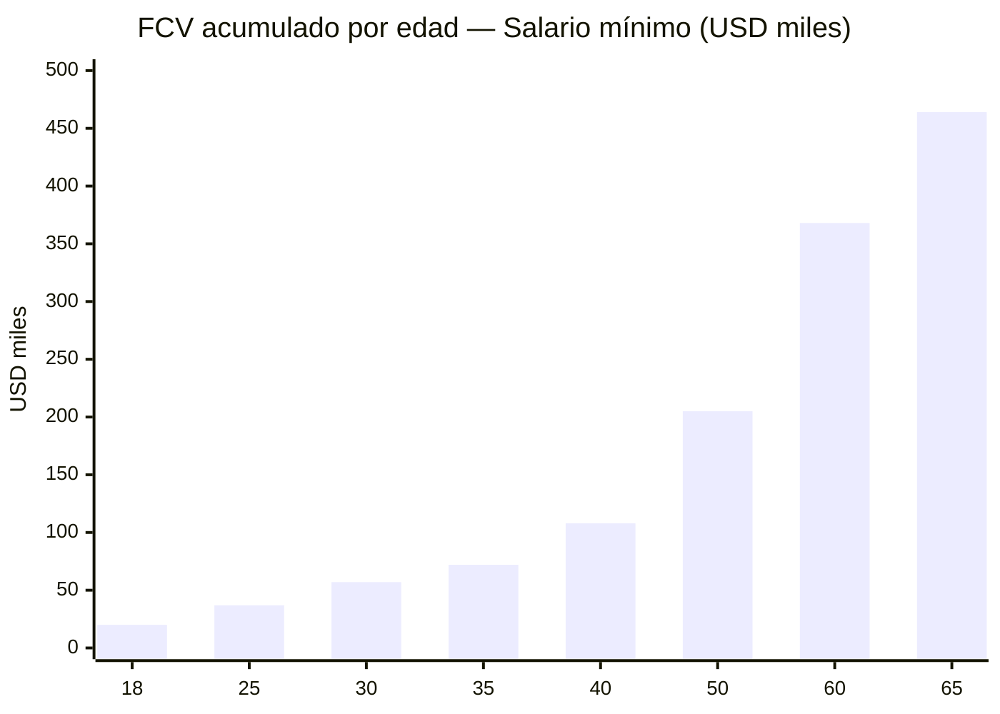

### Resultado a los 65 años

| Logro | Detalle |
|-------|---------|
| **Pensión mensual** | **USD 1.408/mes** (FCV Retiro + Pilar 1 universal) |
| **Tasa de reemplazo** | **117%** del último salario |
| **Casa propia** | Comprada a los 32 con subcuenta vivienda + crédito hipotecario |
| **Hijos graduados** | 2 hijos con universidad pagada desde subcuenta educación |
| **Salud de por vida** | USD 168.419 acumulados + FONASA jubilado |
| **Total FCV** | **USD 463.508** |

### La matemática del interés compuesto

| Fuente | Monto |
|--------|-------|
| VSA invirtió (0-17 años) | USD 32.400 |
| Trabajador + empleador contribuyeron (18-65) | USD 122.676 |
| **Interés compuesto generó** | **USD 320.614** |
| **TOTAL** | **USD 463.508** |

**El interés compuesto generó más que todas las contribuciones combinadas.** Por eso el fondo se invierte profesionalmente como [Noruega](https://www.nbim.no/en/) (retorno promedio 6,3% real) o [Singapur GIC](https://www.gic.com.sg/) (retorno 3,9% real a 20 años).

:::info El contrato social hecho tangible
Venezuela S.A. invierte USD 32.400 en cada ciudadano antes de que gane su primer sueldo. A cambio, ese ciudadano contribuye al sistema durante 47 años, genera USD 463.508, compra su casa, educa a sus hijos, y se jubila con USD 1.408/mes. **No depende del gobierno. No necesita subsidio. Es dueño de su vida.** Ese es el modelo Venezuela S.A.: el país apuesta por ti primero, y tú devuelves multiplicado.
:::

:::caution Este ejemplo es con SALARIO MÍNIMO
Si el trabajador gana más que el mínimo — lo cual es probable en una economía creciente — los números mejoran proporcionalmente. Un trabajador con salario promedio (2x mínimo) acumularía ~USD 900K. Un profesional tech (4x mínimo) superaría USD 1.5M en su FCV. El sistema funciona para todos — pero especialmente transforma la vida de los más humildes.
:::
