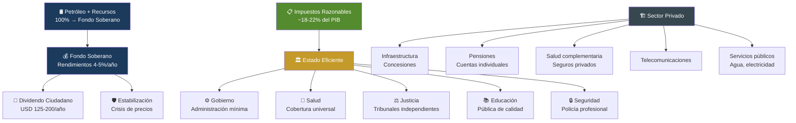
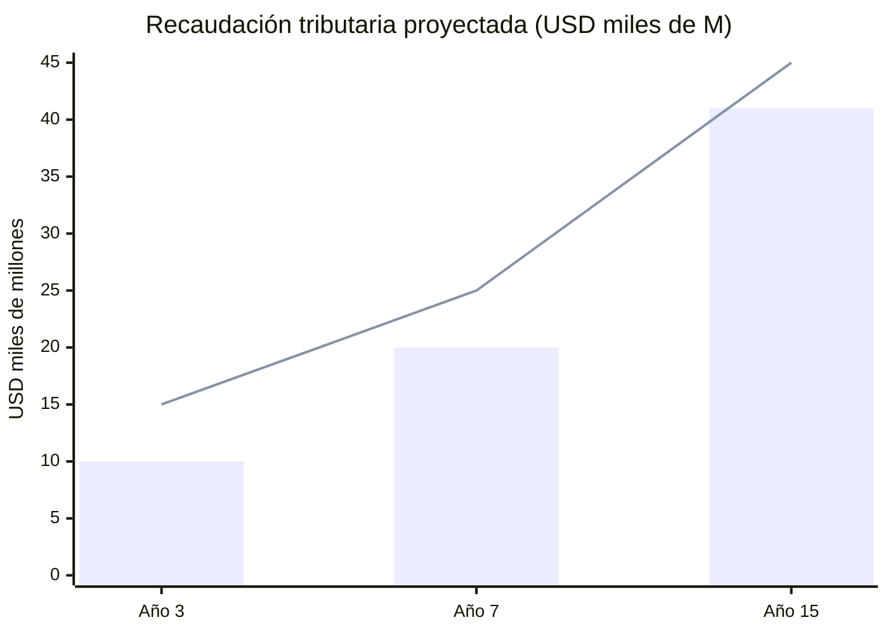
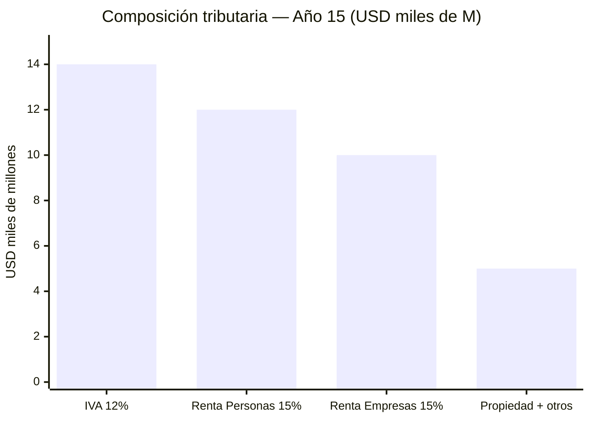
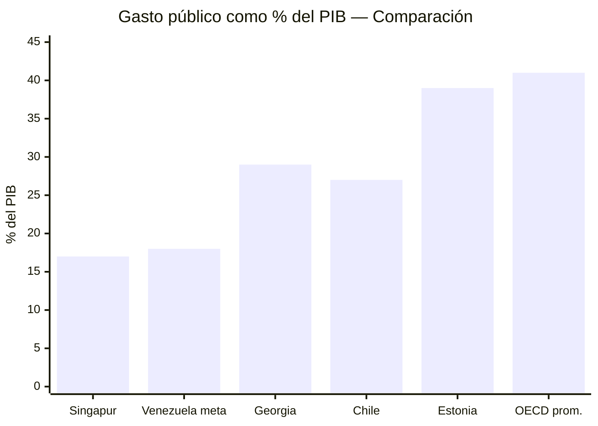
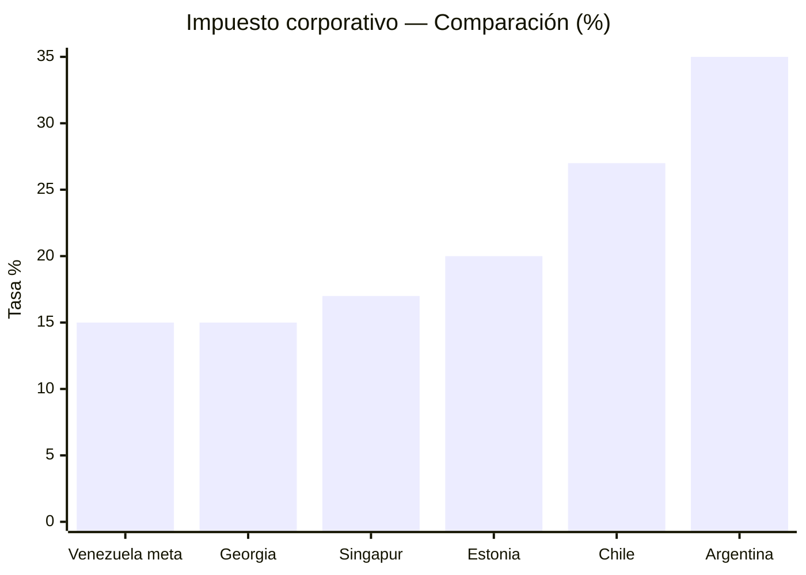

# Modelo de Estado Eficiente: Impuestos, No Petróleo

> El Estado venezolano debe vivir de impuestos razonables — no del petróleo. El petróleo va al fondo soberano. Los impuestos cubren lo esencial: Estado, salud, justicia, educación, y seguridad. Todo lo demás lo opera el sector privado con supervisión estatal. Todo lo que pueda automatizarse, se automatiza.

## Garantías No Negociables

Antes del modelo económico, los derechos fundamentales:

| Garantía | Descripción | Rango |
|----------|-------------|-------|
| **Salud para todos** | Cobertura universal desde el Día 1 — sin importar ingreso, ubicación, o empleo | Constitucional |
| **Vejez digna para todos** | Pensión básica universal que cubra necesidades reales (no USD 3/mes) | Constitucional |
| **Libertad de vida** | Cada persona decide cómo vivir, con quién, dónde, sin interferencia estatal | Constitucional |
| **Libertad económica** | Derecho a emprender, comerciar, contratar, y poseer propiedad sin obstáculos | Constitucional |
| **Libertad religiosa** | Respeto absoluto a toda creencia o no-creencia. Estado laico | Constitucional |
| **Independencia del Estado** | El ciudadano NO depende del gobierno para comer, trabajar o tener vivienda | Objetivo central |

:::danger La realidad de partida: 82,8% de pobreza
Venezuela tiene [82,8% de pobreza](https://www.cgdev.org/blog/barreling-blindly-ahead-seizure-venezuelas-oil) y un Estado que da USD 3,50/mes de pensión. No se puede pasar de golpe a un modelo de "cada quien se las arregla". La transición requiere un piso de protección social MIENTRAS se construyen las instituciones privadas. El Pilar 1 universal (pensiones, salud) existe para esto: nadie queda atrás mientras el sistema madura.
:::

## El Principio Rector

**Regla de oro:** Si un servicio puede operarse privadamente con supervisión estatal y entrega mejor resultado, NO lo opera el Estado.

---

## Lo Que Paga el Estado (Con Impuestos)

Cinco funciones indelegables. Todo lo demás es concesión, contrato o mercado regulado.

| Función | % del Presupuesto | Gasto/PIB | Modelo de referencia |
|---------|-------------------|-----------|---------------------|
| **Gobierno central** | 12–15% | 2–3% | [Singapur: 17% gasto/PIB total](https://www.mof.gov.sg/singaporebudget) |
| **Salud (pilar público)** | 25–30% | 4–5% | [Singapur Medisave + MediShield](https://www.moh.gov.sg/healthcare-schemes-subsidies) |
| **Justicia** | 8–10% | 1,5–2% | [Singapur](https://www.judiciary.gov.sg/) / Estonia |
| **Educación** | 25–30% | 4–5% | [Estonia: #1 PISA Europa](https://digital-strategy.ec.europa.eu/en/factpages/estonia-2024-digital-decade-country-report) |
| **Seguridad** | 15–20% | 3–4% | [Georgia: reforma policial](https://successfulsocieties.princeton.edu/sites/g/files/toruqf5601/files/Policy_Note_ID126.pdf) |
| **TOTAL** | 100% | **15–19% del PIB** | — |

:::info ¿Por qué 15–19% del PIB?
[Singapur gasta ~17% del PIB](https://www.mof.gov.sg/singaporebudget) en gobierno total y tiene salud universal, educación de clase mundial, y la policía más segura de Asia. Si Singapur puede con 17%, Venezuela puede apuntar a 18–22% en el periodo de reconstrucción y converger a 15–18% en la madurez.
:::

---

## Lo Que NO Paga el Estado

Estos servicios se operan por concesión, contrato o mercado privado regulado. El Estado supervisa, no opera.

### Infraestructura: Modelo Concesiones Chile

[Chile ha otorgado 82 concesiones](https://www.mop.cl/Paginas/default.aspx) desde 1993 por USD 28.000+ M en inversión privada: autopistas, aeropuertos, hospitales, cárceles.

| Infraestructura | Modelo | Referencia |
|----------------|--------|-----------|
| Autopistas y carreteras | Concesión 20–30 años con peaje | [Chile Ruta 5 (3.364 km)](https://www.mop.cl/Paginas/default.aspx) |
| Aeropuertos | Concesión operativa | [Chile SCL Nuevo Pudahuel](https://www.nuevopudahuel.cl/) |
| Puertos | Concesión portuaria | Colombia: Sociedad Portuaria |
| Agua y saneamiento | Concesión + tarifa regulada | [Chile: empresas sanitarias privatizadas](https://www.siss.gob.cl/) |
| Telecomunicaciones | Licencias competitivas | Modelo LATAM estándar |
| Electricidad (distribución) | Concesión regulada | Chile: Enel/CGE |
| Hospitales (infraestructura) | Concesión BOT | [Chile: Hospital Maipú](https://www.mop.cl/Paginas/default.aspx) |
| Vivienda social | Subsidio a demanda (no construcción estatal) | [Chile: subsidio habitacional](https://www.minvu.gob.cl/) |

:::tip Subsidio a demanda vs. oferta
Chile no construye viviendas. Da subsidios que las familias usan para comprar en el mercado. Resultado: [>2 M de viviendas subsidiadas](https://www.minvu.gob.cl/) en 40 años, sin empresas estatales de construcción. Venezuela debería adoptar el mismo modelo: el Estado financia, el privado construye.
:::

### Pensiones: Cuentas Individuales (Modelo AFP Mejorado)

El [AFP chileno](https://www.spensiones.cl/) lleva 44 años funcionando pero tiene problemas: tasas de reemplazo bajas (~40%), comisiones altas, y brechas de género. El [CPF de Singapur](https://www.cpf.gov.sg/) es superior: contribución más alta (37% vs. 10%), cubre vivienda+salud+retiro, y está [rankeado #5 mundial](https://www.mercer.com/insights/investments/market-outlook-and-trends/mercer-cfa-global-pension-index/) (grado A).

| Aspecto | Chile AFP | Singapur CPF | Venezuela (propuesta) |
|---------|----------|-------------|----------------------|
| Contribución total | 10% (solo trabajador) | 37% (20% + 17% empleador) | 14% (8% trabajador + 6% empleador) |
| Administración | AFPs privadas | Gobierno (CPF Board) | Mixto: AFP privadas + ente público supervisor |
| Cubre | Solo retiro | Vivienda + salud + retiro | Retiro + salud complementaria |
| Tasa de reemplazo | [~40%](https://economia.lse.ac.uk/articles/10.31389/eco.420) | ~50–70% | Meta: >50% |
| Comisiones | ~1,2% del fondo | ~0,1–0,2% | Techo: 0,5% (regulado) |
| Ranking global | [Grado B](https://www.mercer.com/insights/investments/market-outlook-and-trends/mercer-cfa-global-pension-index/) | [Grado A, #5](https://www.mercer.com/insights/investments/market-outlook-and-trends/mercer-cfa-global-pension-index/) | Meta: Grado B+ |
| Pilar solidario | PGU (2008, reformada 2025) | Silver Support Scheme | Pilar 1 universal (ver [Pensiones](/06-realidad/pensiones-seguridad-social)) |

**Modelo Venezuela:** Tomar lo mejor de ambos:
- **De Chile:** Cuentas individuales con propiedad del trabajador, libertad de elección de fondo
- **De Singapur:** Contribución compartida empleador/trabajador, comisiones reguladas bajas, cobertura ampliada

El Pilar 1 universal (USD 100–200/mes) lo financia el presupuesto público. Los Pilares 2 y 3 son privados. Ver detalle en [Pensiones y Seguridad Social](/06-realidad/pensiones-seguridad-social).

### Salud: Sistema Dual con Piso Universal

| Componente | Operador | Financiamiento | Modelo |
|-----------|----------|---------------|--------|
| **Piso universal (FONASA)** | Estado | Impuestos generales | [Chile FONASA](https://www.fonasa.cl/) / [Singapur subsidios](https://www.moh.gov.sg/) |
| **Seguro obligatorio** | Aseguradoras privadas reguladas | 7% del salario (cotización) | [Chile ISAPRE](https://www.supersalud.gob.cl/) reformada |
| **Atención primaria** | Público + concesiones | Presupuesto público | [Colombia EPS](https://www.minsalud.gov.co/) |
| **Hospitales complejos** | Concesión BOT (privado construye, Estado opera) | Mixto | [Chile: hospitales concesionados](https://www.mop.cl/) |
| **Medicamentos** | Privado + compra centralizada | Cotización + copago regulado | [Singapur Medisave](https://www.cpf.gov.sg/) |

:::info Por qué no 100% privado ni 100% público
Chile ISAPRE cubre solo al [~17% de la población](https://www.supersalud.gob.cl/) (los de mayores ingresos). FONASA cubre al 83%. La lección: el piso universal es indispensable, pero la competencia privada mejora calidad para quien puede pagar. Singapur logra [gasto de salud de solo 4,1% del PIB](https://www.moh.gov.sg/) con resultados de primer mundo usando este modelo dual.
:::

---

## Modelo Tributario: Impuestos Razonables

### Principios

1. **Simple:** Pocos impuestos, fáciles de entender y pagar
2. **Bajo:** Tasas competitivas que atraigan inversión, no la espanten
3. **Digital:** Declaración y pago 100% online (modelo Estonia)
4. **Progresivo donde importa:** Los que más ganan, más pagan — pero sin excesos
5. **Sin dependencia petrolera:** Los impuestos cubren el presupuesto SIN petróleo

### Estructura Tributaria Propuesta

| Impuesto | Tasa | Comparación | Justificación |
|----------|------|-------------|---------------|
| **Renta personas** | 15% flat (con mínimo exento) | [Estonia: 20%](https://www.emta.ee/en), [Georgia: 20%](https://www.rs.ge/), Chile: 0–40% | Flat tax = simple, bajo costo de cumplimiento, reduce evasión |
| **Renta empresas** | 15% (utilidades distribuidas) | [Singapur: 17%](https://www.iras.gov.sg/), [Estonia: 20% solo si distribuye](https://www.emta.ee/en), Chile: 27% | Reinversión = 0% (modelo Estonia). Solo paga cuando saca dividendos |
| **IVA** | 12% | [Singapur GST: 9%](https://www.iras.gov.sg/), Chile: 19%, Colombia: 19% | Competitivo para LATAM. Canasta básica exenta |
| **Ganancias de capital** | 0% (primeros 10 años) | [Singapur: 0%](https://www.iras.gov.sg/), Hong Kong: 0% | Atraer inversión. Después: 10% |
| **ZEET (zonas especiales)** | 0% corporativo por 10 años | [Argentina RIGI](https://www.upi.com/Top_News/World-News/2025/10/30/bcpargentina-RIGI-foreign-invetments-report/1561761834454/) | Estabilidad 30 años |
| **Impuesto a la propiedad** | 0,5–1% del valor catastral | [Singapur: 0–20% progresivo](https://www.iras.gov.sg/) | Financia municipios |
| **Aranceles** | 0–5% general | Singapur: 0% | Economía abierta |

### ¿Cuánto Recauda Este Modelo?

| Fuente tributaria | Año 3 | Año 7 | Año 15 |
|-------------------|-------|-------|--------|
| Renta personas (15% flat) | USD 3.000 M | USD 5.500 M | USD 12.000 M |
| Renta empresas (15%) | USD 2.000 M | USD 5.000 M | USD 10.000 M |
| IVA (12%) | USD 4.000 M | USD 7.000 M | USD 14.000 M |
| Propiedad + otros | USD 1.000 M | USD 2.500 M | USD 5.000 M |
| **Total tributario** | **USD 10.000 M** | **USD 20.000 M** | **USD 41.000 M** |
| **% del PIB** | ~10% | ~15% | ~18% |
| **Presupuesto necesario** | USD 15.000 M | USD 25.000 M | USD 45.000 M |
| **Déficit cubierto por** | Petróleo (transitorio) | Fondo soberano + otros | Autosuficiente |

:::caution La trampa de los impuestos altos
Venezuela bajo Maduro cobra [15% de impuesto sobre nómina](https://central-law.com/en/venezuela-law-on-the-protection-of-social-security-pensions/) solo para pensiones. Colombia cobra 19% de IVA. Argentina tiene 100+ impuestos diferentes. Resultado: evasión masiva, informalidad, y fuga de empresas. El modelo Venezuela S.A. apuesta por tasas BAJAS con base AMPLIA (formalización + digitalización fiscal).
:::

---

## Comparación: Modelos de Estado Eficiente

| Indicador | Singapur | Estonia | Georgia | Chile | Venezuela (meta) |
|-----------|----------|---------|---------|-------|-----------------|
| Gasto público/PIB | [~17%](https://www.mof.gov.sg/singaporebudget) | ~39%* | ~29% | ~27% | 18–22% (transición) → 15–18% |
| Impuesto renta (personas) | 0–24% | [20% flat](https://www.emta.ee/en) | [20% flat](https://www.rs.ge/) | 0–40% | 15% flat |
| Impuesto renta (empresas) | [17%](https://www.iras.gov.sg/) | [20% (solo distribuidas)](https://www.emta.ee/en) | [15%](https://www.rs.ge/) | 27% | 15% |
| IVA/GST | [9%](https://www.iras.gov.sg/) | 22% | 18% | 19% | 12% |
| Pensiones | CPF (37%) | 3 pilares | Privado | AFP (10%) | Mixto (14%) |
| Ranking Doing Business | #2 | #18 | #7 | #59 | Meta: Top 20 |
| Infraestructura | PPP | Digital | Reformada | Concesiones | Concesiones |

*Estonia: alto gasto/PIB por ser EU — incluye transferencias sociales europeas. El gasto estatal propio es menor.

---

## Hoja de Ruta

| Fase | Acción | Plazo |
|------|--------|-------|
| Día 1 | Decreto: petróleo al fondo soberano (ver [Transición Fiscal](/02-motor-financiero/transicion-fiscal)) | Inmediato |
| Mes 1–6 | Reforma tributaria express: 15% flat + IVA 12% + digitalización | Semestre 1 |
| Año 1 | Ley de concesiones: infraestructura + hospitales + vivienda | Año 1 |
| Año 1–2 | Sistema pensional: AFP mejorado + Pilar 1 universal | Año 1–2 |
| Año 2–3 | Sistema de salud dual: FONASA + seguros privados | Año 2–3 |
| Año 3–5 | Base tributaria >15% del PIB → Estado autosuficiente sin petróleo | Año 3–5 |
| Año 7+ | Convergencia a modelo Singapur: gasto público <18% PIB | Largo plazo |
| Año 15 | **Estado vive 100% de impuestos. Petróleo 100% al fondo.** | Meta final |

---

## Transición Desde la Pobreza: El Camino Realista

Con 82,8% de pobreza, el modelo final no se implementa el Día 1. Se transiciona:

| Fase | Estado del país | Rol del Estado | Rol del privado | Financiamiento |
|------|----------------|---------------|-----------------|---------------|
| **Emergencia (Año 1)** | Pobreza extrema, sin instituciones | Estado provee TODO: salud básica, alimentos, pensión mínima, empleo público temporal | Casi nulo — no hay mercado | 100% petróleo + emergencia humanitaria |
| **Estabilización (Años 2–3)** | Pobreza bajando, dolarización estable | Estado mantiene piso universal + empieza a licitar concesiones | Primeras concesiones (telecomunicaciones, puertos) + AFPs se crean | 80% petróleo + 20% impuestos crecientes |
| **Construcción (Años 4–7)** | Pobreza <50%, economía formal creciendo | Estado reduce operación directa. Salud y educación se mantienen. Infraestructura = concesiones | AFP operando, ISAPRE arrancando, concesiones en marcha | 50% petróleo + 50% impuestos |
| **Madurez (Años 8–15)** | Pobreza <25%, clase media creciente | Estado solo: salud piso, justicia, educación, seguridad | Privado opera infraestructura, pensiones, salud complementaria | 100% impuestos. Petróleo → fondo |

### Protección durante la transición

| Mecanismo | Para quién | Duración |
|-----------|-----------|----------|
| **Pensión básica universal** (USD 50→200/mes) | TODO jubilado, desde Día 1 | Permanente (Pilar 1) |
| **Salud gratuita básica** | TODO ciudadano, desde Día 1 | Permanente (FONASA) |
| **Subsidio alimentos** | Hogares bajo línea de pobreza | Transitorio (Años 1–5) — baja a medida que suben ingresos |
| **Empleo público temporal** | Desempleados durante reconstrucción | Transitorio (Años 1–3) — infraestructura intensiva en mano de obra |
| **Subsidio vivienda** | Familias sin hogar o hacinamiento | Permanente (modelo Chile: subsidio a demanda) |
| **Educación gratuita** | TODO niño y joven, desde Día 1 | Permanente |
| **Dividendo ciudadano** | TODO venezolano (cuando el fondo lo permita) | Desde Año 3+ (ver [Inversión Ciudadana](/03-ciudadanos/inversion-ciudadana)) |

:::info No es austeridad — es graduación
El objetivo NO es quitar ayuda. Es que la gente YA NO LA NECESITE porque tiene empleo, pensión propia, seguro de salud, y oportunidades. El Estado no desaparece — se reduce porque la gente prospera. La mejor política social es un buen empleo.
:::

---

## Estado Automatizado: Mínima Fricción, Máximo Resultado

> Todo lo que pueda ser automatizado, será automatizado.

| Proceso | Hoy | Meta | Modelo | Ahorro |
|---------|-----|------|--------|--------|
| **Declaración de impuestos** | Manual, presencial, corrupto | Automática, pre-llenada por el sistema | [Estonia: 3 minutos](https://e-estonia.com/) | 95% del costo administrativo |
| **Registro de empresa** | 30+ trámites, semanas | 1 clic, 15 minutos | [Estonia e-Residency](https://e-estonia.com/) / [Georgia: #7 Doing Business](https://www.rs.ge/) | 90% del tiempo |
| **Permisos de construcción** | Meses, sobornos | Digital, automático si cumple norma | Singapur: BCA | 80% del tiempo |
| **Trámites de salud** | Presencial, colas | Receta digital, historia clínica única, telemedicina | [Estonia: 99% recetas digitales](https://e-estonia.com/) | 70% del costo |
| **Justicia civil** | Años | Meses. 80% casos resueltos online | [UK: Online Courts](https://www.judiciary.uk/) | 60% del costo |
| **Policía** | Patrulla improvisada | Predictiva (IA), cámaras, datos en tiempo real | [Singapur Safe City](https://www.police.gov.sg/) | Reducción de crimen |
| **Compras públicas** | Opacas, corruptas | 100% digitales, abiertas, auditables por IA | [Corea: KONEPS](https://www.pps.go.kr/eng/) | 15–20% ahorro + anticorrupción |
| **Identidad ciudadana** | Cédula física, falsificable | Identidad digital con firma electrónica | [Estonia ID](https://e-estonia.com/) | Base para todo lo demás |

:::tip El dividendo de la automatización
[Estonia ahorra 2% del PIB](https://centreforpublicimpact.org/public-impact-fundamentals/e-estonia-the-information-society-since-1997/) con gobierno digital. Para Venezuela, eso significaría USD 4.000+ M/año al llegar al PIB meta. Menos funcionarios, menos corrupción, menos colas, más velocidad. El Estado no necesita 2 millones de empleados públicos si automatiza el 80% de los trámites.
:::

### Reducir dependencia del Estado

| Hoy | Meta |
|-----|------|
| Millones dependen de bolsas CLAP para comer | Empleo formal que permita comprar alimentos libremente |
| Pensión de USD 3,50/mes = dependencia total | AFP propia + Pilar 1 digno = independencia |
| Salud: ir al hospital público o morir | Seguro privado obligatorio + FONASA para quien no pueda |
| Vivienda: esperando que el gobierno construya | Subsidio a demanda: TÚ eliges dónde y cómo vivir |
| Empleo: enchufados y misiones clientelares | Mercado laboral libre, ZEET, startups, concesiones |

**El Estado no es tu papá. Es tu plataforma.** Crea las condiciones para que cada persona construya su propia vida. Y para quien no puede — aún — existe el piso universal hasta que pueda.

---

:::danger El objetivo final
Año 15: Venezuela financia su Estado CON impuestos. El petróleo va al fondo soberano. Los rendimientos del fondo (4–5%) complementan. La pensión es privada (AFP). La salud tiene piso público + opción privada. La infraestructura es concesión. El Estado es pequeño, digital, automatizado, y eficiente. Libertad de vida, económica y religiosa son constitucionales. Nadie depende del gobierno para vivir. Ese es el modelo.
:::
