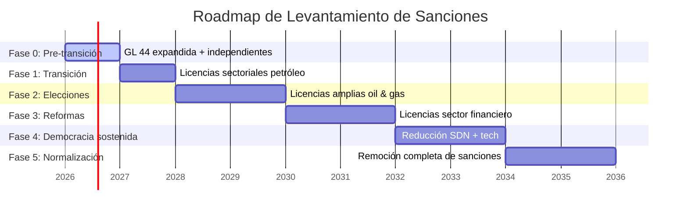
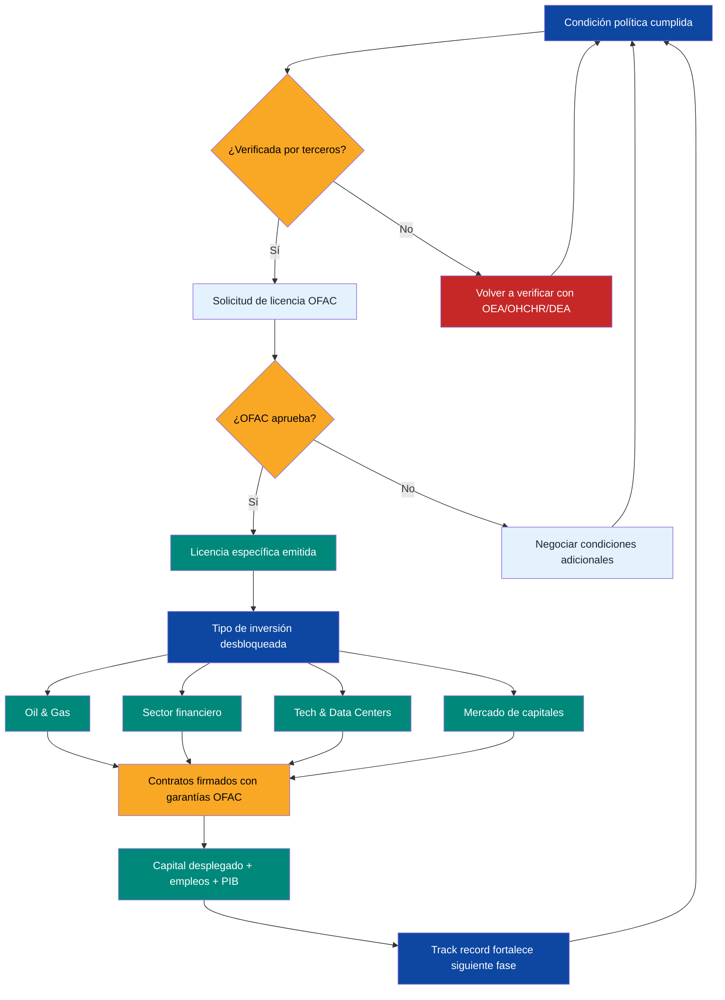

# Roadmap de Sanciones: De OFAC a Investment Grade

:::danger Sin roadmap de sanciones = sin inversión
Las sanciones de EE.UU. bloquean **USD 6-20B** en inversión tech y **USD 4-20B** en VC/PE. Sin una hoja de ruta verificable para su levantamiento progresivo, el plan de reconstrucción queda limitado a operaciones Chevron y capital de diáspora. Este documento cierra ese vacío.
:::

## Panorama actual de sanciones

Venezuela acumula **6 Executive Orders** activas que bloquean prácticamente toda actividad económica con EE.UU.:

| Executive Order | Año | Qué bloquea | Impacto |
|----------------|------|-------------|---------|
| EO 13692 | 2015 | Activos de funcionarios designados (SDN) | **112+ individuos** en lista SDN |
| EO 13808 | 2017 | Deuda nueva del gobierno y PDVSA | Imposible emitir bonos soberanos |
| EO 13827 | 2018 | Criptomonedas del gobierno (Petro) | Bloquea finanzas digitales estatales |
| EO 13835 | 2018 | Compra de deuda venezolana existente | Mercado secundario congelado |
| EO 13850 | 2018 | Sector oro y minería | Bloquea **USD 2-4B/año** en exportaciones auríferas |
| EO 13884 | 2019 | Bloqueo total del gobierno venezolano | **La más amplia**: congela todos los activos del Estado en jurisdicción de EE.UU. |

**Fuente:** [OFAC Venezuela Sanctions Program](https://ofac.treasury.gov/sanctions-programs-and-country-information/venezuela-related-sanctions)

### Precedente: General License 44 (Chevron)

La GL 44 (nov. 2022, renovada) permite a Chevron operar en Venezuela bajo condiciones estrictas:
- No pagar regalías directamente al gobierno de Maduro
- Producción limitada a JVs existentes
- Ingresos a cuentas controladas por EE.UU.
- **Resultado:** Chevron produce ~**200.000 bpd** con inversión limitada

:::info Lección clave de GL 44
Washington ya demostró que puede dar licencias condicionales sin levantar sanciones. El modelo es: **condición verificable -> licencia específica -> inversión controlada**. El roadmap completo sigue esta lógica.
:::

## Qué necesita Washington (Marco Rubio)

Basado en declaraciones públicas del Secretario de Estado Rubio, el Departamento de Estado y el Congreso, las condiciones son claras:

| Condición | Verificador | Estándar |
|-----------|-------------|----------|
| Elecciones libres con observación internacional | OEA, UE, Carter Center | Invitación formal + acceso completo |
| Liberación de presos políticos | OHCHR, ONG (Foro Penal) | Lista verificable, acceso a cárceles |
| Desconexión del aparato cubano de FANB/SEBIN | Inteligencia de EE.UU. | Salida verificada de asesores cubanos |
| Cooperación antinarcóticos | DEA, SOUTHCOM | Extradiciones + operaciones conjuntas |
| Marco de reestructuración de deuda | FMI, acreedores | Aceptable para tenedores de bonos |
| Acceso humanitario y DDHH | OHCHR, ACNUR | Oficina permanente en Venezuela |

**Fuente:** Declaraciones de Rubio ante el Senado (2025-2026), [Congressional Research Service — Venezuela Sanctions](https://crsreports.congress.gov/) [Requiere investigación: compilar URLs específicas de declaraciones de Rubio]

:::caution Rubio no negocia en abstracto
A diferencia de administraciones anteriores, Rubio exige **condiciones verificables antes de cada paso**. No hay levantamiento "de buena fe". Cada licencia se gana con hechos en el terreno.
:::

## Roadmap por fases

Esta es la tabla central del documento. Cada fase requiere que la anterior esté sustancialmente cumplida.

| Fase | Condición verificable | Licencia OFAC esperada | Inversión desbloqueada | Monto estimado | Timeline |
|------|----------------------|------------------------|------------------------|----------------|----------|
| **0: Pre-transición** ~~(ahora)~~ **COMPLETADA** | ~~Status quo~~ → [Licencia 46B emitida 14-mar-2026](https://www.infobae.com/venezuela/2026/03/14/eeuu-autorizo-a-las-empresas-estadounidenses-realizar-negocios-con-el-sector-petrolero-venezolano/) | **Licencia 46B: TODAS las empresas de EE.UU. autorizadas** (explotación, comercio, inversión, suministro, transporte, refinación) + oro + fertilizantes | **Todas las empresas estadounidenses** — ya no solo Chevron | **USD 3-5B** (ya en marcha) | **ACTIVA** |
| **1: Transición + elecciones anunciadas** | Gobierno de transición instalado, cronograma electoral con fecha, observadores invitados | Licencias sectoriales ampliadas (ya parcialmente cubiertas por 46B) | Oil majors JVs (ExxonMobil, ConocoPhillips, TotalEnergies, Shell) | **USD 10-30B** | Próxima fase |
| **2: Elecciones + presos liberados** | Elecciones celebradas (certificadas por OEA/UE), presos políticos liberados | Licencias amplias para oil & gas (upstream + downstream + gas) | Full upstream, gas natural (LNG), refinerías | **USD 20-30B** | 2028-2030 |
| **3: Gobierno democrático + reformas** | Gobierno electo operando, reformas judiciales iniciadas, cooperación antinarcóticos | Licencias del sector financiero | Banca internacional, bonos, estructura VIN | **USD 15-25B** | 2030-2032 |
| **4: Democracia sostenida (2+ años)** | Dos años de gobierno democrático, DDHH verificados, Cuba desconectada | Reducción de lista SDN, licencias tech/services | Tech investment, data centers, VC/PE | **USD 6-16B** | 2032-2034 |
| **5: Normalización plena** | Track record democrático, deuda reestructurada, investment grade path | Remoción completa de sanciones | Bonos soberanos, investment grade, mercado de capitales completo | **USD 20-50B** | 2034-2036 |

**Total acumulado: USD 74-146B** desbloqueados progresivamente en ~10 años.

:::tip Fase 0 COMPLETADA — Licencia 46B cambia todo (14-mar-2026)
Ya no es solo Chevron. **Toda empresa estadounidense puede operar en el sector petrolero, de oro y fertilizantes.** La Fase 0 se completó más rápido de lo proyectado. Ahora la carrera es por la Fase 1: elecciones + inversión masiva. Condiciones: contratos bajo ley de EE.UU., disputas en territorio de EE.UU., prohibido involucrar Irán/Corea del Norte/Rusia/Cuba.
:::

## Timeline visual

## Árbol de decisión

## Comparables internacionales

¿Es realista levantar sanciones progresivamente en ~10 años? Sí. Hay precedentes directos:

| País | Programa | Condiciones exigidas | Resultado | Timeline | Lección para Venezuela |
|------|----------|---------------------|-----------|----------|----------------------|
| **Irán** (JCPOA) | Sanciones nucleares EE.UU./UE/ONU | Reducir enriquecimiento de uranio, inspecciones IAEA, desmantelar centrifugadoras | **USD 100B+ en activos descongelados**, petróleo de 1M a 2.5M bpd | 2013-2016 (3 años negociación) | Condiciones técnicas verificables funcionan. Pero: Trump salió del acuerdo en 2018. Lección: **necesita apoyo bipartidista** |
| **Myanmar** | Sanciones EE.UU. por junta militar | Elecciones 2010/2012, liberación Aung San Suu Kyi, reformas políticas | Inversión extranjera de USD 0.3B a **USD 9.5B/año**, PIB creció 7%/año | 2012-2016 (4 años) | Levantamiento gradual funciona. Pero: golpe de 2021 revirtió todo. Lección: **las reformas deben ser irreversibles** |
| **Sudán** | Lista de Estado patrocinador de terrorismo | Cooperación antiterrorismo, pago a víctimas de atentados, acuerdo Israel | Removido de lista, acceso a FMI/Banco Mundial, alivio de deuda **USD 50B** | 2017-2020 (3 años) | Condiciones de seguridad + compensación financiera. Lección: **pagar la deuda política abre puertas** |
| **Cuba** (Obama) | Relajación parcial de sanciones | Liberación de prisioneros (swap), restablecimiento diplomático | Turismo de USD 0 a **USD 3B/año**, vuelos directos, remesas liberadas | 2014-2016 (2 años) | Parcial funciona para sectores específicos. Pero: Trump revirtió. Lección: **el levantamiento parcial es frágil sin legislación** |

**Fuente:** [Congressional Research Service](https://crsreports.congress.gov/), [Brookings Institution](https://www.brookings.edu/) [Requiere investigación: URLs específicas por caso]

:::info Venezuela tiene una ventaja que ninguno de estos países tenía
**303B barriles de reservas probadas**. EE.UU. tiene incentivo económico directo para levantar sanciones. Irán era adversario estratégico. Myanmar era irrelevante energéticamente. Venezuela es el mayor yacimiento del hemisferio occidental. Eso cambia la ecuación.
:::

## Plan B: Si las sanciones NO se levantan

No apostar todo a un escenario. Si el levantamiento se retrasa o estanca:

| Escenario | Estrategia | Capital disponible | Limitación |
|-----------|------------|-------------------|------------|
| Sanciones se mantienen 5+ años | Pre-Seed con diáspora (**7.9M** personas), operaciones solo Chevron/GL 44 | **USD 3-8B** (diáspora + Chevron) | Sin oil majors, sin mercado de capitales |
| Levantamiento parcial (solo petróleo) | Maximizar upstream con licencias sectoriales, Fondo de Inversión Venezuela S.A. con ingresos limitados | **USD 15-30B** | Sin tech investment, sin investment grade |
| Inversores no-estadounidenses | India (ONGC), Brasil (Petrobras), Golfo (ADNOC, Saudi Aramco) | **USD 10-20B** [Requiere investigación] | Riesgo de sanciones secundarias, menor capital disponible |
| Finanzas alternativas | Bonos en mercados no-USD (yuan, euro), tokenización de activos, DeFi para remesas | **USD 2-5B** [Requiere investigación] | Liquidez limitada, mayor costo de capital |

:::danger El Plan B funciona, pero es lento
Sin levantamiento de sanciones, la reconstrucción pasa de **15 años a 25-30 años**. El Pre-Seed de diáspora arranca sin depender de sanciones (ver [Inversión Ciudadana](/03-ciudadanos/inversion-ciudadana)), pero el salto a USD 550-750B de inversión total requiere normalización con EE.UU.
:::

## Alineación con Washington: Cómo construir credibilidad

No basta con cumplir condiciones. Hay que construir la relación proactivamente:

| Acción | Responsable | Costo estimado | Impacto esperado |
|--------|-------------|----------------|-----------------|
| Contratar firma de lobbying/advisory en DC (Akin Gump, BGR Group, Mercury) | Gobierno de transición | **USD 2-5M/año** | Acceso a Congreso, Departamento de Estado, OFAC |
| Engagement con Congressional Venezuela Caucus | Embajada + lobbying | Incluido en advisory | Aliados bipartidistas para legislación de levantamiento |
| Reportes trimestrales de cumplimiento de condiciones | Gobierno + auditores internacionales | **USD 1-2M/año** | Evidencia verificable para cada fase |
| Equipo de compliance OFAC dedicado | Gobierno + firmas legales (Sullivan & Cromwell, Cleary Gottlieb) | **USD 3-5M/año** | Cero violaciones = confianza |
| Roadshows con inversores en NY/Houston/London | Equipo económico | **USD 0.5-1M/evento** | Pipeline de inversión listo para cada fase |
| Transparencia total: dashboard público de condiciones cumplidas | Equipo tech | **USD 0.5M** (desarrollo) | Credibilidad ante ciudadanos Y Washington |

**Inversión total en alineación: USD 7-13M/año.** Retorno: desbloquear **USD 74-146B** en inversión.

:::tip USD 10M para desbloquear USD 100B+
La relación costo-beneficio es absurda. Un equipo de compliance y lobbying de primer nivel cuesta lo que cuesta un edificio en Caracas. El retorno es acceso al mercado de capitales más grande del mundo. No hacerlo es negligencia.
:::

## Conexión con el plan

| Sección del plan | Dependencia de sanciones |
|-----------------|-------------------------|
| [Motor Financiero](/02-motor-financiero/inversion-inicial-fuentes) | Fases 1-3: oil majors, bonos, banca |
| [Hubs Tech / ZEETs](/05-transformacion/hubs-tech) | Fase 4: tech investment, data centers |
| [Fondo de Inversión Venezuela S.A.](/02-motor-financiero/fondo-soberano) | Fase 3+: estructura VIN, Santiago Principles |
| [Realidad Geopolítica](/04-gobernanza/geopolitica) | Todas las fases: EE.UU. controla ventas |
| [Pre-Seed Diáspora](/03-ciudadanos/inversion-ciudadana) | **Fase 0: NO depende de sanciones** |

---

## BIT Venezuela-EE.UU.: Protección Legal para Inversores

:::info No existe un BIT entre Venezuela y EE.UU.
A diferencia de Colombia ([BIT con EE.UU. vigente desde 2012](https://investmentpolicy.unctad.org/)), Perú (firmado pero no ratificado) o Argentina (vigente desde 1994), **Venezuela nunca ha firmado un tratado bilateral de inversión con Estados Unidos.** Esto significa que los **500.000+ venezolano-americanos en Florida** y los inversores estadounidenses no tienen protección legal formal contra expropiación, trato discriminatorio o denegación de justicia en Venezuela.
:::

### Qué provee un BIT

| Protección | Qué significa | Relevancia para Venezuela |
|-----------|--------------|--------------------------|
| **Acceso a arbitraje ICSID** | Si el gobierno viola derechos del inversor, este puede demandar ante el [ICSID (Banco Mundial)](https://icsid.worldbank.org/) — tribunal neutral | Venezuela salió del ICSID en 2012; un BIT requeriría reingresar o aceptar jurisdicción ad hoc |
| **Protección contra expropiación** | Expropiación solo con compensación justa, pronta y efectiva | Crítico: 1.500+ empresas expropiadas sin compensación (2005-2015) |
| **Trato justo y equitativo (FET)** | Gobierno no puede aplicar reglas arbitrarias o discriminatorias al inversor | Elimina riesgo de "cambiar las reglas del juego" post-inversión |
| **Libre transferencia de capitales** | Inversores pueden repatriar ganancias sin restricciones cambiarias | Crítico dado el historial de controles cambiarios (CADIVI, CENCOEX) |
| **Cláusula de nación más favorecida (MFN)** | Inversores estadounidenses reciben trato al menos igual al de cualquier otro país | Previene deals preferenciales con China/Rusia en detrimento de inversores US |

### Timeline propuesto

| Fase del roadmap | Acción BIT | Dependencia |
|-----------------|-----------|-------------|
| **Fase 2-3** (2028-2032) | Iniciar negociaciones formales del BIT durante proceso de levantamiento de sanciones financieras | Gobierno democrático instalado + reformas judiciales iniciadas |
| **Fase 3-4** (2030-2034) | Firma del BIT + ratificación por Senado de EE.UU. y Parlamento venezolano | Track record de 2+ años de respeto a propiedad privada |
| **Fase 4-5** (2032-2036) | BIT operativo + reingreso a ICSID o mecanismo arbitral equivalente | Normalización plena de relaciones |

### Precedentes regionales

| País | BIT con EE.UU. | Año | Impacto en FDI | Fuente |
|------|---------------|-----|---------------|--------|
| **Colombia** | Vigente | 2012 | FDI de USD 10B a **USD 17B/año** post-BIT | [UNCTAD BIT Database](https://investmentpolicy.unctad.org/) |
| **Perú** | Firmado, no ratificado | 2006 | FDI creció con TLC (que incluye capítulo de inversión) | [UNCTAD](https://investmentpolicy.unctad.org/) |
| **Argentina** | Vigente | 1994 | Protegió inversores durante crisis 2001; 62 demandas ICSID contra Argentina | [ICSID](https://icsid.worldbank.org/) |
| **Ecuador** | Terminado | 2018 (terminado por Correa) | FDI cayó; Correa enfrentó USD 2B+ en demandas ICSID | [UNCTAD](https://investmentpolicy.unctad.org/) |

:::tip El BIT es la señal más fuerte para la diáspora inversora
Para los **500.000+ venezolano-americanos** que quieren invertir en la reconstrucción pero temen una nueva expropiación, el BIT es la diferencia entre "quiero invertir" y "voy a invertir". Con BIT, si el gobierno expropia, el inversor demanda ante ICSID y cobra. Sin BIT, el inversor queda a merced de tribunales venezolanos — que históricamente han fallado a favor del gobierno.
:::

**Fuentes:** [UNCTAD BIT Database](https://investmentpolicy.unctad.org/) | [ICSID (World Bank)](https://icsid.worldbank.org/) [Requiere investigación: URLs específicas de BITs Colombia-US y Argentina-US]

---

> **Las sanciones no son un muro. Son una puerta con condiciones escritas en la cerradura. Este roadmap es la llave.**
