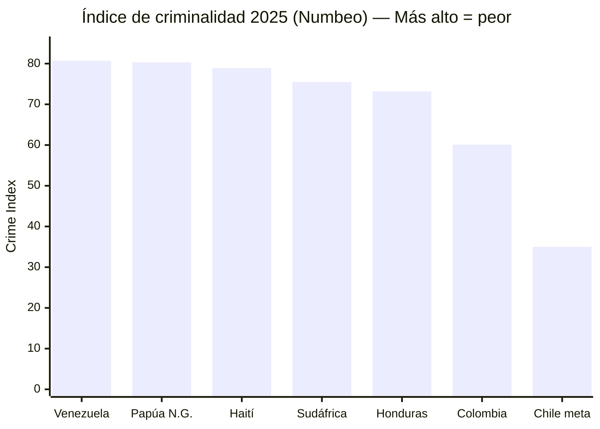
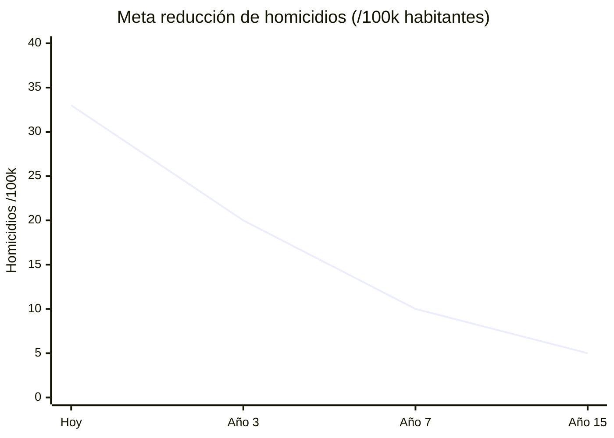
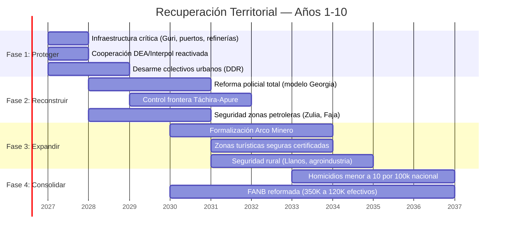

# Seguridad Física: Sin Seguridad No Hay Inversión

> Ningún BigTech pone un data center donde hay riesgo de secuestro. Ningún turista visita un país con la tasa de homicidios más alta del continente.

## Diagnóstico: La Realidad

Venezuela tiene el [índice de criminalidad más alto del mundo](https://worldpopulationreview.com/country-rankings/crime-rate-by-country) (80,7 en el Numbeo Crime Index, 2025), por encima de Papúa Nueva Guinea (80,3) y Haití (78,9).

La tasa de homicidios ha caído ~42% desde su pico en 2016, pero Venezuela sigue entre los países más violentos del mundo. [Fuente: Macrotrends/UNODC](https://www.macrotrends.net/global-metrics/countries/ven/venezuela/murder-homicide-rate).

| Amenaza | Nivel | Descripción | Fuente |
|---------|-------|-------------|--------|
| **Tren de Aragua** | CRÍTICO | [Organización criminal más poderosa de Venezuela](https://insightcrime.org/venezuela-organized-crime-news/tren-de-aragua/), fundada en 2014 en prisión de Tocorón. Presencia transnacional (Chile, Perú, Colombia, EE.UU.). Designada [organización terrorista por Trump (feb. 2025)](https://www.npr.org/2025/03/16/nx-s1-5329777/tren-de-aragua-all-you-need-to-know-about-the-venezuelan-gang) | InSight Crime; NPR |
| **Colectivos armados** | CRÍTICO | Grupos paramilitares pro-gobierno con control territorial en zonas urbanas | [OSAC](https://www.osac.gov/Content/Report/34f99e62-2161-412d-bfeb-1e752539f6bf) |
| **Narcotráfico** | CRÍTICO | Venezuela como corredor de tránsito hacia Centroamérica y EE.UU. | [OC Index 2025](https://ocindex.net/assets/downloads/2025/english/ocindex_profile_venezuela_2025.pdf) |
| **Megabandas** | ALTO | Yeico Masacre y otros grupos con expansión internacional | [InSight Crime](https://insightcrime.org/venezuela-organized-crime-news/tren-de-aragua/) |
| **ELN/FARC frontera** | ALTO | Presencia guerrillera en estados fronterizos (Táchira, Apure, Zulia) | OSAC |
| **Minería ilegal (Arco Minero)** | ALTO | Control criminal de zonas mineras en Bolívar | [OC Index 2025](https://ocindex.net/assets/downloads/2025/english/ocindex_profile_venezuela_2025.pdf) |

## Modelos de Reforma Exitosa

| País | Reforma | Resultado | Fuente |
|------|---------|-----------|--------|
| **Georgia (2004)** | [Despidió ~15.000 policías en un día](https://successfulsocieties.princeton.edu/sites/g/files/toruqf5601/files/Policy_Note_ID126.pdf) (~85% de la fuerza). Reemplazó con Policía Patrullera sin antecedentes. Salarios multiplicados 10x. | Crimen violento cayó **66%**. Policía pasó a ser [3ra institución más confiable](https://centreforpublicimpact.org/public-impact-fundamentals/seizing-the-moment-rebuilding-georgias-police/) del país | Princeton; Centre for Public Impact |
| **Colombia post-FARC** | DDR (Desarme, Desmovilización, Reintegración). 13.000+ excombatientes en programas de reintegración | Tasa de homicidios: 60/100k (2002) → ~24/100k (2023) | ONU; Datos DANE |
| **El Salvador (Bukele)** | Estado de excepción desde 2022. Encarcelamiento masivo. Construcción de CECOT (mega-cárcel) | Homicidios: ~106/100k (2015) → ~2,4/100k (2024). Controversial por derechos humanos | InSight Crime |
| **Singapur** | Salarios policiales competitivos + tecnología + cero tolerancia + penas severas | Top 3 países más seguros del mundo | [CPIB](https://www.cpib.gov.sg/) |

:::caution Modelo Georgia vs. Modelo Bukele
Georgia reformó **reemplazando** la policía con profesionales bien pagados (modelo institucional). El Salvador reformó **encarcelando masivamente** (modelo represivo). El plan Venezuela S.A. propone el **modelo Georgia**: reconstruir instituciones, no llenar cárceles. Las instituciones duran; la represión sin instituciones no.
:::

## Plan de Seguridad Venezuela S.A.

### Fase 1: Emergencia (Días 1–180)
| Acción | Costo Est. | Modelo |
|--------|-----------|--------|
| Publicación de mapa criminal (zonas, actores, corredores) | USD 5–10 M | Inteligencia |
| Desarme de colectivos (DDR) | USD 500–1.000 M | Colombia post-FARC |
| Protección de infraestructura crítica (Guri, puertos, refinerías) | USD 200–500 M | Estándar intl. |
| Cooperación DEA/Interpol reactivada | Bajo costo | Acuerdos bilaterales |

### Fase 2: Reconstrucción Policial (Años 1–3)
| Acción | Costo Est. | Modelo |
|--------|-----------|--------|
| Purga y reconstrucción policial total | USD 1.000–2.000 M | [Georgia 2004](https://foreignpolicy.com/2020/06/11/abolish-police-georgia-brutality-crime/) |
| Salarios policiales dignos (USD 800–1.200/mes) | USD 500 M/año | Georgia + Singapur |
| Cámaras + tecnología en ciudades principales | USD 500–1.000 M | Singapur / Estonia |
| Academia policial nueva (formación 12 meses) | USD 200–400 M | Georgia Patrol Police |
| Centro Nacional de Ciberseguridad | USD 100–200 M | Estonia CERT-EE |

### Fase 3: Consolidación (Años 3–7)
| Acción | Costo Est. | Modelo |
|--------|-----------|--------|
| Formalización de Arco Minero (drones + satélite + minería legal) | USD 500–1.000 M | Colombia/Perú |
| Policía predictiva con controles éticos | USD 200–500 M | Singapur |
| Reducción homicidios a <15/100k | — | Meta: nivel Colombia actual |

**Inversión total estimada (Fases 1-3):** USD 5.000–8.000 M en 7 años. *Ver [estimación actualizada abajo](#inversión-actualizada-en-seguridad) que incluye reforma FANB y DDR expandido: USD 10-18B total.*

### Meta de Resultado

| Indicador | Hoy | Año 3 | Año 7 | Año 15 |
|-----------|-----|-------|-------|--------|
| Tasa de homicidios | ~25–40/100k (est.) | <20/100k | <10/100k | <5/100k (nivel Chile) |
| Índice de criminalidad (Numbeo) | 80,7 (#1 mundial) | <60 | <40 | <30 |
| Confianza en policía | <10% (est.) | >40% | >60% | >75% |

---

## El Elefante en la Habitación: Control Territorial

:::caution Lo que ningún plan de inversión menciona
Antes de hablar de data centers y ZEETs, hay que hablar de quién controla el territorio donde se quieren construir.
:::

### Mapa de Control Territorial

| Zona | Actor dominante | Tipo | Impacto económico |
|------|----------------|------|-------------------|
| **Arco Minero (Bolívar)** | ELN, FARC disidentes, sindicatos armados, pranatos | Criminal-guerrillero | Bloquea formalización minera (USD 8-10B/año) |
| **Frontera Táchira-Apure** | ELN + FANB (coexistencia) | Guerrilla + militar | Contrabando combustible, narcotráfico, extorsión |
| **Zulia (sur)** | Grupos paramilitares + narcotráfico | Criminal | Bloquea rehabilitación petrolera en cuencas del Lago |
| **Tocorón/Aragua** | Tren de Aragua (debilitado pero activo) | Crimen organizado transnacional | Extorsión, trata de personas, narcotráfico |
| **Barrios urbanos (Caracas, Valencia)** | Colectivos + megabandas | Paramilitar + criminal | Control territorial impide inversión urbana |
| **Costa (Falcón, Sucre)** | Redes de narcotráfico + pesca ilegal | Criminal | Bloquea turismo costero y puertos |
| **Delta Orinoco** | Minería ilegal + abandono estatal | Extractivo | Desastre ambiental + comunidades indígenas afectadas |

**Fuente:** [OC Index Venezuela 2025](https://ocindex.net/assets/downloads/2025/english/ocindex_profile_venezuela_2025.pdf) | [InSight Crime](https://insightcrime.org/venezuela-organized-crime-news/) | [OSAC](https://www.osac.gov/)

### FANB: El Actor Más Complejo

Las Fuerzas Armadas Nacionales Bolivarianas (~350.000 efectivos, [IISS Military Balance 2024](https://www.iiss.org/publications/the-military-balance)) no son solo un cuerpo de seguridad — son un conglomerado económico:

| Actividad FANB | Escala estimada | Fuente |
|---------------|----------------|--------|
| Control de minería (oro/coltán) | USD 1-2B/año | [InSight Crime, 2023](https://insightcrime.org/) |
| Contrabando de combustible | USD 500M-1B/año | [Reuters, 2024](https://www.reuters.com/) |
| Importación de alimentos (CLAP) | USD 2-3B/año en contratos | [Transparencia Venezuela](https://transparenciave.org/) |
| Empresas militares (construcción, transporte) | [Requiere investigación] | — |
| Narcotráfico (individuos, no institucional) | [Requiere investigación] | EE.UU. DOJ indictments |

**Implicación:** Cualquier reforma económica que elimine estas rentas sin ofrecer alternativa enfrentará resistencia activa de un actor con 350.000 personas armadas.

### Prerrequisitos de Seguridad por Motor Económico

| Motor económico | Prerrequisito de seguridad | Zona clave | Timeline |
|----------------|--------------------------|-----------|----------|
| Petróleo (USD 183B inversión) | Control de Zulia + protección de infraestructura | Lago Maracaibo, Faja del Orinoco | Años 1-3 |
| Minería formal (USD 8-10B/año) | Desplazamiento de grupos armados del Arco Minero | Bolívar, Amazonas | Años 3-7 |
| Data centers / ZEETs | Seguridad física + jurídica en zonas tech | Caracas, Valencia, Barquisimeto | Años 1-5 |
| Turismo (USD 4-10B/año) | <10 homicidios/100k + zonas seguras verificadas | Los Roques, Canaima, Mérida | Años 3-7 |
| Agroindustria | Títulos de propiedad + seguridad rural | Llanos, Barinas, Portuguesa | Años 1-5 |
| Gas (Dragon Field) | Seguridad marítima costa norte | Sucre, Nueva Esparta | Años 1-3 |

### Secuencia Realista de Recuperación Territorial

### DDR Adaptado: Lecciones Internacionales

| Dimensión | Colombia (político) | El Salvador (criminal) | **Venezuela (híbrido)** |
|-----------|-------------------|----------------------|----------------------|
| Tipo de conflicto | Guerrilla ideológica | Pandillas/Maras | Guerrilla + crimen organizado + paramilitares + militares |
| Modelo DDR | Negociación → acuerdo → reintegración | Encarcelamiento masivo | **Negociación selectiva + reforma institucional + justicia** |
| Excombatientes | ~13.000 FARC → programas productivos | ~70.000 encarcelados | ~50.000-80.000 (colectivos + bandas + ELN) [Requiere investigación] |
| Costo | USD 1.2B (JEP + reintegración, [Banco Mundial](https://www.worldbank.org/)) | USD 2-3B (cárceles + policía) | **USD 3-5B (componente DDR)** |
| Resultado | Homicidios: 60 → 24/100k en 20 años | Homicidios: 106 → 2.4/100k en 8 años (DDHH cuestionados) | **Meta: 33 → <10/100k en 10 años** |
| Riesgo principal | Disidencias + narcotráfico + vacío de poder | Autoritarismo + violaciones DDHH | **FANB resiste + vacío de poder en zonas liberadas** |

**Fuente:** [Colombia JEP](https://www.jep.gov.co/) | [Crisis Group El Salvador](https://www.crisisgroup.org/) | [Plan Colombia](https://www.state.gov/) (USD 12B+ inversión EE.UU.)

Ver [Justicia transicional](/04-gobernanza/justicia-transicional) para el marco legal de amnistía condicionada que habilita el DDR.

### Inversión Actualizada en Seguridad

| Componente | Estimación anterior | Estimación actualizada | Justificación |
|-----------|---------------------|----------------------|---------------|
| Reforma policial (modelo Georgia) | USD 2-3B | USD 3-4B | Incluye formación, tecnología, salarios 5 años |
| DDR (colectivos + bandas + ELN) | Incluido arriba | USD 3-5B | Ref: Colombia DDR + Plan Colombia |
| Infraestructura seguridad (cámaras, centros) | USD 1-2B | USD 1-2B | Sin cambio |
| Protección infraestructura crítica | USD 0.5-1B | USD 1-2B | Incluye seguridad marítima |
| Reforma FANB (reducción + reintegración) | No estimado | USD 2-4B | 230.000 paquetes de retiro + reconversión |
| Ciberseguridad + inteligencia | USD 0.3-0.5B | USD 0.5-1B | Actualizado a estándar Estonia |
| **TOTAL** | **USD 5-8B** | **USD 10-18B** | **Ref: Plan Colombia USD 12B+ (2000-2016)** |

:::caution Costo de no invertir en seguridad
El costo de la inseguridad actual se estima en ~22% del PIB entre homicidios, extorsión, inversión perdida, emigración forzada y costos de salud ([UNDP](https://www.undp.org/)). La inversión de USD 10-18B en 10 años se paga sola si reduce esta pérdida en 50%.
:::
