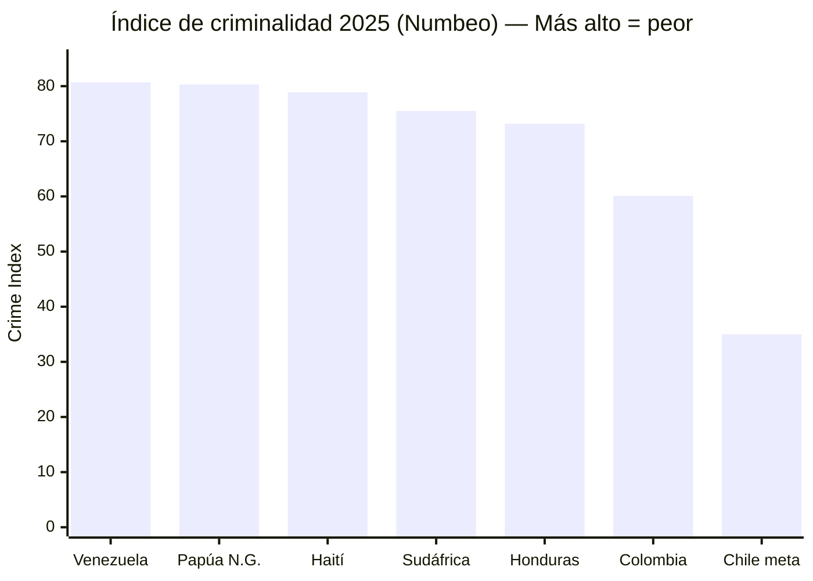
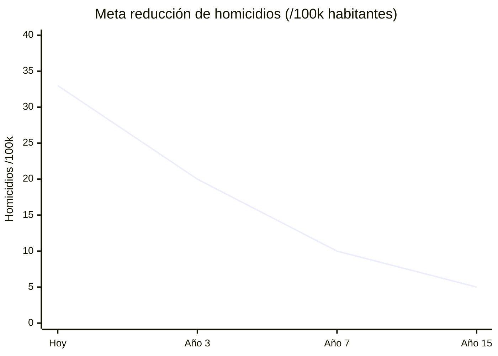
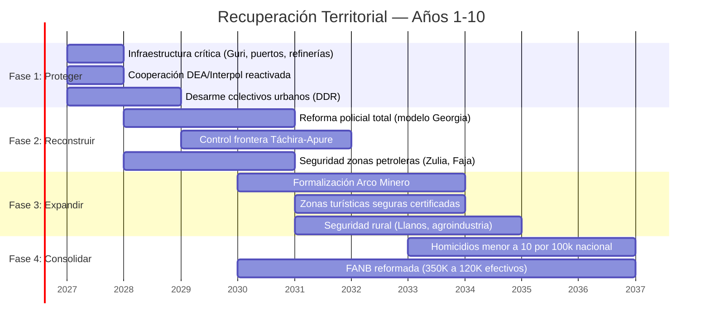
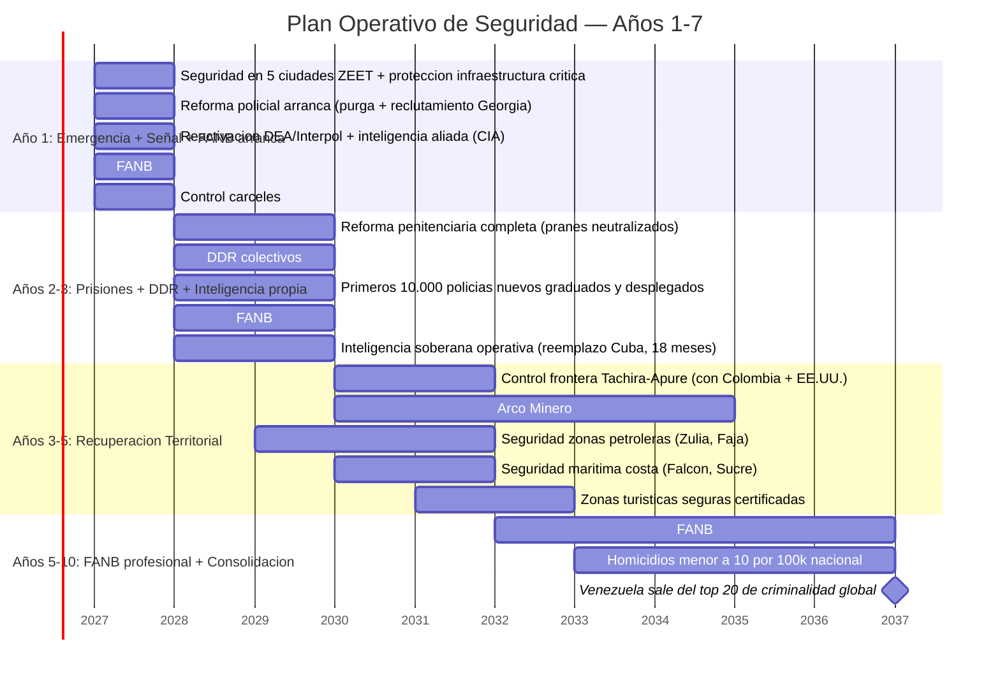

# Seguridad Física: Sin Seguridad No Hay Inversión

:::tip En pocas palabras
Sin seguridad no hay nada. Venezuela es el país más violento del mundo. Esta sección propone cómo reformar la policía, desarmar a los grupos armados, y hacer que caminar por la calle sea seguro otra vez.
:::

:::caution Fechas ilustrativas — las fases se activan por KPIs, no por calendario
Las referencias a "Año X" en este documento son **ilustrativas**. Las fases reales se activan por condiciones verificables (PIB/cápita, formalización, pobreza). Ver [KPIs de Activación](/07-ejecucion/kpis-activacion).
:::

> Ningún BigTech pone un data center donde hay riesgo de secuestro. Ningún turista visita un país con la tasa de homicidios más alta del continente.

## Diagnóstico: La Realidad

Venezuela tiene el [índice de criminalidad más alto del mundo](https://worldpopulationreview.com/country-rankings/crime-rate-by-country) (80,7 en el Numbeo Crime Index, 2025), por encima de Papúa Nueva Guinea (80,3) y Haití (78,9).

La tasa de homicidios ha caído ~42% desde su pico en 2016, pero Venezuela sigue entre los países más violentos del mundo. [Fuente: Macrotrends/UNODC](https://www.macrotrends.net/global-metrics/countries/ven/venezuela/murder-homicide-rate).

| Amenaza | Nivel | Descripción | Fuente |
|---------|-------|-------------|--------|
| **Tren de Aragua** | CRÍTICO | [Organización criminal más poderosa de Venezuela](https://insightcrime.org/venezuela-organized-crime-news/tren-de-aragua/), fundada en 2014 en prisión de Tocorón. Presencia transnacional (Chile, Perú, Colombia, EE.UU.). Designada [organización terrorista por Trump (feb. 2025)](https://www.npr.org/2025/03/16/nx-s1-5329777/tren-de-aragua-all-you-need-to-know-about-the-venezuelan-gang) | InSight Crime; NPR |
| **Colectivos armados** | CRÍTICO | Grupos paramilitares pro-gobierno con control territorial en zonas urbanas | [OSAC](https://www.osac.gov/Content/Report/34f99e62-2161-412d-bfeb-1e752539f6bf) |
| **Narcotráfico** | CRÍTICO | Venezuela como corredor de tránsito hacia Centroamérica y EE.UU. | [OC Index 2025](https://ocindex.net/assets/downloads/2025/english/ocindex_profile_venezuela_2025.pdf) |
| **Megabandas** | ALTO | Yeico Masacre y otros grupos con expansión internacional | [InSight Crime](https://insightcrime.org/venezuela-organized-crime-news/tren-de-aragua/) |
| **ELN/FARC frontera** | ALTO | Presencia guerrillera en estados fronterizos (Táchira, Apure, Zulia) | OSAC |
| **Minería ilegal (Arco Minero)** | ALTO | Control criminal de zonas mineras en Bolívar | [OC Index 2025](https://ocindex.net/assets/downloads/2025/english/ocindex_profile_venezuela_2025.pdf) |

## Modelos de Reforma Exitosa

| País | Reforma | Resultado | Fuente |
|------|---------|-----------|--------|
| **Georgia (2004)** | [Despidió ~15.000 policías en un día](https://successfulsocieties.princeton.edu/sites/g/files/toruqf5601/files/Policy_Note_ID126.pdf) (~85% de la fuerza). Reemplazó con Policía Patrullera sin antecedentes. Salarios multiplicados 10x. | Crimen violento cayó **66%**. Policía pasó a ser [3ra institución más confiable](https://centreforpublicimpact.org/public-impact-fundamentals/seizing-the-moment-rebuilding-georgias-police/) del país | Princeton; Centre for Public Impact |
| **Colombia post-FARC** | DDR (Desarme, Desmovilización, Reintegración). 13.000+ excombatientes en programas de reintegración | Tasa de homicidios: 60/100k (2002) → ~24/100k (2023) | ONU; Datos DANE |
| **El Salvador (Bukele)** | Estado de excepción desde 2022. Encarcelamiento masivo. Construcción de CECOT (mega-cárcel) | Homicidios: ~106/100k (2015) → ~2,4/100k (2024). Controversial por derechos humanos | InSight Crime |
| **Singapur** | Salarios policiales competitivos + tecnología + cero tolerancia + penas severas | Top 3 países más seguros del mundo | [CPIB](https://www.cpib.gov.sg/) |

:::caution Modelo Georgia vs. Modelo Bukele
Georgia reformó **reemplazando** la policía con profesionales bien pagados (modelo institucional). El Salvador reformó **encarcelando masivamente** (modelo represivo). El plan Venezuela S.A. propone el **modelo Georgia**: reconstruir instituciones, no llenar cárceles. Las instituciones duran; la represión sin instituciones no.
:::

## Plan de Seguridad Venezuela S.A.

### Fase 1: Emergencia (Días 1–180)
| Acción | Costo Est. | Modelo |
|--------|-----------|--------|
| Publicación de mapa criminal (zonas, actores, corredores) | USD 5–10 M | Inteligencia |
| Desarme de colectivos (DDR) | USD 500–1.000 M | Colombia post-FARC |
| Protección de infraestructura crítica (Guri, puertos, refinerías) | USD 200–500 M | Estándar intl. |
| Cooperación DEA/Interpol reactivada | Bajo costo | Acuerdos bilaterales |

### Fase 2: Reconstrucción Policial (Años 1–3)
| Acción | Costo Est. | Modelo |
|--------|-----------|--------|
| Purga y reconstrucción policial total | USD 1.000–2.000 M | [Georgia 2004](https://foreignpolicy.com/2020/06/11/abolish-police-georgia-brutality-crime/) |
| Salarios policiales dignos (USD 800–1.200/mes) | USD 500 M/año | Georgia + Singapur |
| Cámaras + tecnología en ciudades principales | USD 500–1.000 M | Singapur / Estonia |
| Academia policial nueva (formación 12 meses) | USD 200–400 M | Georgia Patrol Police |
| Centro Nacional de Ciberseguridad | USD 100–200 M | Estonia CERT-EE |

### Fase 3: Consolidación (Años 3–7)
| Acción | Costo Est. | Modelo |
|--------|-----------|--------|
| Formalización de Arco Minero (drones + satélite + minería legal) | USD 500–1.000 M | Colombia/Perú |
| Policía predictiva con controles éticos | USD 200–500 M | Singapur |
| Reducción homicidios a <15/100k | — | Meta: nivel Colombia actual |

**Inversión total estimada (Fases 1-3):** USD 5.000–8.000 M en 7 años. *Ver [estimación actualizada abajo](#inversión-actualizada-en-seguridad) que incluye reforma FANB y DDR expandido: USD 18-25B en 10 años.*

### Meta de Resultado

| Indicador | Hoy | Año 3 | Año 7 | Año 15 |
|-----------|-----|-------|-------|--------|
| Tasa de homicidios | ~25–40/100k (est.) | <20/100k | <10/100k | <5/100k (nivel Chile) |
| Índice de criminalidad (Numbeo) | 80,7 (#1 mundial) | <60 | <40 | <30 |
| Confianza en policía | <10% (est.) | >40% | >60% | >75% |

---

## El Elefante en la Habitación: Control Territorial

:::caution Lo que ningún plan de inversión menciona
Antes de hablar de data centers y ZEETs, hay que hablar de quién controla el territorio donde se quieren construir.
:::

### Mapa de Control Territorial

| Zona | Actor dominante | Tipo | Impacto económico |
|------|----------------|------|-------------------|
| **Arco Minero (Bolívar)** | ELN, FARC disidentes, sindicatos armados, pranatos | Criminal-guerrillero | Bloquea formalización minera (USD 8-10B/año) |
| **Frontera Táchira-Apure** | ELN + FANB (coexistencia) | Guerrilla + militar | Contrabando combustible, narcotráfico, extorsión |
| **Zulia (sur)** | Grupos paramilitares + narcotráfico | Criminal | Bloquea rehabilitación petrolera en cuencas del Lago |
| **Tocorón/Aragua** | Tren de Aragua (debilitado pero activo) | Crimen organizado transnacional | Extorsión, trata de personas, narcotráfico |
| **Barrios urbanos (Caracas, Valencia)** | Colectivos + megabandas | Paramilitar + criminal | Control territorial impide inversión urbana |
| **Costa (Falcón, Sucre)** | Redes de narcotráfico + pesca ilegal | Criminal | Bloquea turismo costero y puertos |
| **Delta Orinoco** | Minería ilegal + abandono estatal | Extractivo | Desastre ambiental + comunidades indígenas afectadas |

**Fuente:** [OC Index Venezuela 2025](https://ocindex.net/assets/downloads/2025/english/ocindex_profile_venezuela_2025.pdf) | [InSight Crime](https://insightcrime.org/venezuela-organized-crime-news/) | [OSAC](https://www.osac.gov/)

### FANB: El Actor Más Complejo

Las Fuerzas Armadas Nacionales Bolivarianas (~350.000 efectivos, [IISS Military Balance 2024](https://www.iiss.org/publications/the-military-balance)) no son solo un cuerpo de seguridad — son un conglomerado económico:

| Actividad FANB | Escala estimada | Fuente |
|---------------|----------------|--------|
| Control de minería (oro/coltán) | USD 1-2B/año | [InSight Crime, 2023](https://insightcrime.org/) |
| Contrabando de combustible | USD 500M-1B/año | [Reuters, 2024](https://www.reuters.com/) |
| Importación de alimentos (CLAP) | USD 2-3B/año en contratos | [Transparencia Venezuela](https://transparenciave.org/) |
| Empresas militares (construcción, transporte) | [Requiere investigación] | — |
| Narcotráfico (individuos, no institucional) | [Requiere investigación] | EE.UU. DOJ indictments |

**Implicación:** Cualquier reforma económica que elimine estas rentas sin ofrecer alternativa enfrentará resistencia activa de un actor con 350.000 personas armadas.

### Prerrequisitos de Seguridad por Motor Económico

| Motor económico | Prerrequisito de seguridad | Zona clave | Timeline |
|----------------|--------------------------|-----------|----------|
| Petróleo (USD 183B inversión) | Control de Zulia + protección de infraestructura | Lago Maracaibo, Faja del Orinoco | Años 1-3 |
| Minería formal (USD 8-10B/año) | Desplazamiento de grupos armados del Arco Minero | Bolívar, Amazonas | Años 3-7 |
| Data centers / ZEETs | Seguridad física + jurídica en zonas tech | Caracas, Valencia, Barquisimeto | Años 1-5 |
| Turismo (USD 4-10B/año) | <10 homicidios/100k + zonas seguras verificadas | Los Roques, Canaima, Mérida | Años 3-7 |
| Agroindustria | Títulos de propiedad + seguridad rural | Llanos, Barinas, Portuguesa | Años 1-5 |
| Gas (Dragon Field) | Seguridad marítima costa norte | Sucre, Nueva Esparta | Años 1-3 |

### Secuencia Realista de Recuperación Territorial

### DDR Adaptado: Lecciones Internacionales

| Dimensión | Colombia (político) | El Salvador (criminal) | **Venezuela (híbrido)** |
|-----------|-------------------|----------------------|----------------------|
| Tipo de conflicto | Guerrilla ideológica | Pandillas/Maras | Guerrilla + crimen organizado + paramilitares + militares |
| Modelo DDR | Negociación → acuerdo → reintegración | Encarcelamiento masivo | **Negociación selectiva + reforma institucional + justicia** |
| Excombatientes | ~13.000 FARC → programas productivos | ~70.000 encarcelados | ~50.000-80.000 (colectivos + bandas + ELN) [Requiere investigación] |
| Costo | USD 1.2B (JEP + reintegración, [Banco Mundial](https://www.worldbank.org/)) | USD 2-3B (cárceles + policía) | **USD 3-5B (componente DDR)** |
| Resultado | Homicidios: 60 → 24/100k en 20 años | Homicidios: 106 → 2.4/100k en 8 años (DDHH cuestionados) | **Meta: 33 → <10/100k en 10 años** |
| Riesgo principal | Disidencias + narcotráfico + vacío de poder | Autoritarismo + violaciones DDHH | **FANB resiste + vacío de poder en zonas liberadas** |

**Fuente:** [Colombia JEP](https://www.jep.gov.co/) | [Crisis Group El Salvador](https://www.crisisgroup.org/) | [Plan Colombia](https://www.state.gov/) (USD 12B+ inversión EE.UU.)

Ver [Justicia transicional](/04-gobernanza/justicia-transicional) para el marco legal de amnistía condicionada que habilita el DDR.

### Inversión Actualizada en Seguridad

:::danger Corrección post-evaluación DDR (5.7/10): presupuesto insuficiente y front-loading necesario
El experto en seguridad/DDR identificó que USD 10-18B en 7 años es insuficiente para la escala del desafío (FANB + colectivos + ELN + pranes + narco + costa). Recomendación: **USD 18-25B en 10 años, con USD 8-10B front-loaded en Años 1-3.** Los primeros 3 años determinan si el círculo virtuoso (seguridad→inversión→empleo→menos crimen) o el vicioso (inseguridad→fuga→desempleo→más crimen) se activa.
:::

| Componente | Estimación anterior | **Estimación corregida** | Justificación |
|-----------|---------------------|----------------------|---------------|
| Reforma policial (modelo Georgia) | USD 3-4B | **USD 4-5B** | 200K policías surge (Años 1-5), bajando a 130K. 10+ academias con capacidad 2.000/año c/u. Salarios USD 800-1.200/mes. Partners: [ILEA](https://www.state.gov/international-law-enforcement-academies/), Colombia, Israel |
| DDR (colectivos + bandas) | USD 3-5B | **USD 4-6B** | Mapeo de comando 6 meses. Negociación 2-4 años. Reintegración: empleo en concesiones de infraestructura, no solo paquetes. Ref: Colombia 4+ años |
| Reforma FANB (350K→100K) | USD 2-4B | **USD 3-5B** | Disolución milicia (220K) Año 1. Retiro dirigido mandos medios Años 2-3. Buyout tiered por rango (USD 5K-50K según rango + renta ilícita reemplazada). Profesionalización completa Año 10 |
| Control penitenciario | No estimado | **USD 1-2B** | Recuperar cárceles de pranes en Fase 1 (antes de DDR). 5-10K guardias penitenciarios nuevos. Infraestructura. Ref: El Salvador CECOT adaptado |
| Arco Minero (operación militar + formalización) | Incluido en DDR | **USD 2-3B** | Operación tipo Plan Patriota (Colombia 2003). 7-10 años para control total. ELN tiene capacidad militar real |
| Seguridad marítima (costa) | No estimado | **USD 1-1.5B** | Patrulleras, radar costero, cooperación DEA marítima. Costa Falcón-Sucre = corredor narco |
| Infraestructura seguridad (cámaras, centros) | USD 1-2B | USD 1-2B | Sin cambio |
| Inteligencia soberana (post-Cuba) | USD 0.5-1B | **USD 1.5-2B** | Reemplazo de capacidad cubana en 18 meses. CIA/DEA como puente. Contrainteligencia contra redes stay-behind. Protección física de líderes de transición |
| Ciberseguridad | USD 0.3-0.5B | USD 0.5-1B | Estándar Estonia |
| **TOTAL** | **USD 10-18B / 7 años** | **USD 18-25B / 10 años** | **Front-loaded: USD 8-10B en Años 1-3** |

### Distribución temporal (front-loaded)

| Período | Inversión | % del total | Foco |
|---------|-----------|-------------|------|
| **Años 1-3** | **USD 8-10B** | **40-45%** | Milicia disuelta, cárceles recuperadas, 10K policías, inteligencia operativa, infraestructura protegida |
| **Años 4-7** | **USD 6-8B** | **30-35%** | Arco Minero, frontera, FANB profesionalización, DDR completo, turismo seguro |
| **Años 8-10** | **USD 4-7B** | **20-25%** | Consolidación, tecnología predictiva, homicidios <10/100K, salida top 20 criminalidad |

:::caution Costo de no invertir en seguridad
El costo de la inseguridad actual se estima en ~22% del PIB entre homicidios, extorsión, inversión perdida, emigración forzada y costos de salud ([UNDP](https://www.undp.org/)). La inversión de USD 10-18B en 10 años se paga sola si reduce esta pérdida en 50%.
:::

---

## Plan Operativo de Seguridad Territorial

:::danger Condición previa para TODO el plan
Sin seguridad territorial, nada funciona. No es sección 4 — es la condición previa para TODAS las secciones. Ningún inversor pone USD 500 si le roban saliendo del banco. Ningún data center se construye donde hay riesgo de extorsión. Ningún turista visita un país donde lo secuestran en la carretera. **La seguridad no es un capítulo — es el cimiento.**
:::

### Mapa de Control Territorial por Tipo de Actor

| Zona | Actor dominante | Tipo | Impacto directo |
|------|----------------|------|-----------------|
| **Cárceles (Tocorón, Rodeo)** | Pranes — Tren de Aragua, Yeico Masacre | Criminal organizado transnacional | Extorsión nacional, trata, narcotráfico. Operan desde prisiones como centros de comando |
| **Barrios urbanos (Caracas, Valencia, Barquisimeto)** | Colectivos — Tupamaros, La Piedrita, Colectivo Alexis Vive | Paramilitar político-criminal | Control territorial urbano, extorsión de comercios, intimidación electoral |
| **Frontera Colombia (Táchira, Apure, Zulia)** | ELN, disidencias FARC (ex-Segunda Marquetalia) | Guerrilla + narcotráfico | Contrabando de combustible, narcotráfico, minería ilegal, secuestro |
| **Arco Minero (Bolívar, Amazonas)** | ELN + sindicatos armados + pranatos | Criminal-guerrillero-extractivo | Minería ilegal de oro, coltán. USD 2-4B/año en economía ilícita |
| **FANB (nacional)** | Altos mandos con intereses económicos | Militar-económico | Contrabando, minería, CLAP, narcotráfico individual. ~USD 3-6B/año en rentas |
| **Costa (Falcón, Sucre, Nueva Esparta)** | Redes de narcotráfico + pesca ilegal | Criminal marítimo | Bloquea turismo costero, puertos, seguridad marítima |

**Fuente:** [InSight Crime](https://insightcrime.org/venezuela-organized-crime-news/) | [OC Index 2025](https://ocindex.net/assets/downloads/2025/english/ocindex_profile_venezuela_2025.pdf) | [OSAC](https://www.osac.gov/) | [Requiere investigación para cifras exactas de economía ilícita]

### DDR Adaptado a Venezuela: Modelo Híbrido

Venezuela no es ni Colombia ni El Salvador. Es **ambos simultáneamente** — conflicto político (colectivos) + crimen organizado (pranes/megabandas) + guerrilla transfronteriza (ELN). Se necesita un DDR híbrido:

| Dimensión | Colombia (DDR político) | El Salvador (DDR criminal) | **Venezuela (DDR híbrido)** |
|-----------|------------------------|---------------------------|---------------------------|
| **Problema central** | Guerrilla ideológica con mando unificado | Pandillas sin ideología, control territorial | Guerrilla + crimen + paramilitares + militares con intereses económicos |
| **Modelo aplicado** | Negociación → acuerdo de paz → reintegración productiva | Estado de excepción → encarcelamiento masivo → mega-cárceles | **Negociación selectiva para colectivos que desarmen + justicia penal para pranes/ELN + reforma institucional FANB** |
| **Qué negociar** | Participación política, tierras, verdad | Nada — represión pura | **Colectivos: amnistía condicionada + empleo. FANB: retiro digno + reconversión. Pranes/ELN: justicia + cárceles reformadas** |
| **Qué NO negociar** | — | — | **Extorsión, narcotráfico, trata de personas. Cero tolerancia.** |
| **Riesgo principal** | Vacío de poder → disidencias | Autoritarismo + violaciones DDHH | **FANB resiste reforma + vacío en zonas liberadas si no se llena rápido** |
| **Costo estimado** | USD 1.2B (JEP + reintegración) | USD 2-3B (cárceles + policía) | **USD 3-5B (componente DDR) + USD 2-4B (reforma FANB)** |
| **Referencia** | [JEP Colombia](https://www.jep.gov.co/) | [Crisis Group El Salvador](https://www.crisisgroup.org/) | Híbrido — ambos modelos + innovación propia |

### Secuencia Operativa de Recuperación

### Prerrequisitos de Seguridad por Sector Económico

| Sector económico | Prerrequisito de seguridad | Sin seguridad | Timeline requerido |
|-----------------|---------------------------|---------------|-------------------|
| **Petróleo** (USD 183B inversión) | Tránsito seguro, protección de oleoductos/refinerías, zona Zulia controlada | Ninguna major invierte más allá de lo mínimo. Producción estancada en 1M bpd | **Año 1** |
| **Data centers** (USD 3-8B/año) | Seguridad física 24/7, cero riesgo de secuestro, estabilidad eléctrica | Ningún tech giant (Google, Microsoft, Amazon) pone un servidor | **Año 2** |
| **Turismo** (USD 4-10B/año) | Zonas turísticas seguras 24/7, policía reformada, tasa de homicidios <15/100k | Cero turistas internacionales de alto gasto. Solo aventureros | **Años 3-5** |
| **Agroindustria** (USD 5-8B/año) | Seguridad de tenencia de tierra, cero invasiones, seguridad rural | Nadie invierte en fincas que pueden ser invadidas mañana | **Años 2-3** |
| **Minería formal** (USD 8-10B/año) | Desplazamiento de grupos armados del Arco Minero, títulos mineros seguros | La minería sigue siendo ilegal y controlada por criminales | **Años 3-5** |
| **Mercado de capitales** | Estado de derecho, contratos ejecutables, cero expropiación | Nadie compra un bono venezolano. Rating sigue en default | **Años 3-7** |

### Costo Total del Plan de Seguridad Territorial

**USD 10-18B en 7 años** (ver [tabla detallada arriba](#inversión-actualizada-en-seguridad)).

| Referencia internacional | Inversión | Período | Resultado |
|-------------------------|-----------|---------|-----------|
| **Plan Colombia** (EE.UU. + gobierno) | USD 12B+ | 2000-2016 (16 años) | Homicidios: 60 → 24/100k. FARC desmovilizadas. Pero disidencias persisten |
| **El Salvador (Bukele)** | USD 2-3B (est.) | 2019-2025 (6 años) | Homicidios: 106 → 2.4/100k. Costo: derechos humanos cuestionados |
| **Georgia (Saakashvili)** | USD 300-500M (est.) | 2004-2008 (4 años) | Crimen: -66%. Policía: institución más confiable. Costo: bajo |

**Fuente:** [Plan Colombia/State Dept](https://www.state.gov/) | [Crisis Group](https://www.crisisgroup.org/) | [ACLED](https://acleddata.com/) | [InSight Crime](https://insightcrime.org/) [Requiere investigación para costos exactos de Georgia y El Salvador]

---

## Anticorrupción Militar: Cómo Desmontar un Conglomerado de USD 3-6B/Año

:::danger El problema real no es la milicia — son los 500-2.000 oficiales que manejan el negocio
La milicia (220K) se disuelve fácil: no tienen poder económico propio. El problema son los **mandos medios y altos de la FANB** que controlan minería (USD 1-2B), contrabando (USD 500M-1B), CLAP (USD 2-3B), y narcotráfico individual. Un coronel que gana USD 50K/año en rentas ilícitas no acepta un paquete de retiro de USD 10K. Hay que ofrecer algo mejor que el crimen — o hacer que el crimen sea imposible.
:::

### El problema visto como empresa

Si la FANB fuera una subsidiaria de Venezuela S.A., un CEO la miraría así:

| Diagnóstico | Cifra | Acción corporativa |
|---|---|---|
| Empleados: 350K (sobrestaffed 3.5x) | Meta: 100K | Reestructuración con paquetes tiered |
| Ingresos off-books: USD 3-6B/año | 100% ilícito | Cortar flujos + ofrecer alternativa legal |
| Mandos con conflicto de interés: ~500-2.000 | Controlan logística, puertos, minas | Separar persona de posición + vetting |
| Marca: tóxica (politizada, corrupta) | Cero confianza pública | Rebrand: FANB → Fuerza Profesional nueva |

### 6 mecanismos anticorrupción militar (modelo Georgia + Singapur + Colombia)

#### 1. Reemplazar, no reformar (modelo Georgia 2004)

Georgia no reformó la policía corrupta — la **eliminó y creó una nueva desde cero**. Saakashvili despidió al 85% de la policía, contrató nuevos sin antecedentes, y pagó 10x más.

**Aplicación a FANB:**
- No se "reforma" un ejército que funciona como cartel. Se crea una **fuerza profesional nueva** con vetting exhaustivo
- Cada militar que quiera permanecer pasa por vetting: patrimonial, judicial, lifestyle audit, polígrafo
- Los que no pasen el vetting: 3 opciones (retiro, reconversión, emprendimiento) — las mismas del [modelo de desplazados](/04-gobernanza/modelo-estado#qué-pasa-con-la-gente)
- **Meta: retener solo los 100K más limpios y profesionales**

#### 2. Pagar lo suficiente para que la corrupción no valga la pena (modelo Singapur)

| Rango | Salario actual (est.) | Renta ilícita (est.) | **Salario propuesto** | Riesgo/retorno del crimen |
|---|---|---|---|---|
| Soldado raso | USD 30-50/mes | USD 0-100/mes | **USD 800-1.200/mes** | Crimen no vale la pena |
| Sargento/Técnico | USD 50-100/mes | USD 200-500/mes | **USD 1.500-2.000/mes** | Crimen marginal |
| Teniente/Capitán | USD 100-200/mes | USD 500-2.000/mes | **USD 2.500-4.000/mes** | Crimen riesgoso |
| Coronel/General | USD 200-500/mes | USD 5.000-50.000/mes | **USD 5.000-10.000/mes** | Crimen necesita ser masivo para justificar riesgo de perder salario + pensión + libertad |

**Referencia:** Singapur paga a generales USD 500K-1M/año. Georgia multiplicó salarios policiales 10x y la corrupción cayó a casi cero. **El salario es la primera línea de defensa anticorrupción.**

**Costo:** 100K militares × USD 2.500/mes promedio × 12 = **USD 3B/año**. Es caro. Pero es más barato que los USD 3-6B/año que la FANB actual roba.

#### 3. Cortar los flujos económicos ilícitos

No basta con pagar bien — hay que **eliminar la oportunidad de robar**:

| Flujo ilícito | Monto est. | Cómo se corta |
|---|---|---|
| **Minería (Arco Minero)** | USD 1-2B/año | Operación militar (Plan Patriota) + concesiones formales a empresas auditadas. FANB pierde acceso operativo a minas |
| **Contrabando combustible** | USD 500M-1B/año | Precios de mercado eliminan margen de contrabando. Si gasolina cuesta lo que vale, no hay incentivo de contrabandear |
| **CLAP (importación alimentos)** | USD 2-3B/año | CLAP se elimina. Mercado libre + voucher focalizado (FCV). No hay "importación estatal" que intermediar |
| **Narcotráfico** | [Requiere investigación] | DEA + cooperación bilateral. Inteligencia financiera. No es competencia de la FANB — es policía + fiscalía |
| **Puertos/aduanas** | USD 500M-1B/año | Aduanas operadas por concesión privada internacional (modelo Georgia). FANB pierde control de puertos |

**La clave:** cada renta ilícita se elimina **quitando la función**, no reformando al que la ejerce. Si la FANB no opera minas, no puede robar de minas. Si no importa alimentos, no puede cobrar comisión de CLAP. Si no controla puertos, no puede cobrar "peaje".

#### 4. Vetting patrimonial obligatorio (lifestyle audit)

| Mecanismo | Aplica a | Frecuencia | Consecuencia |
|---|---|---|---|
| **Declaración patrimonial** | Todo oficial (rango capitán+) | Anual, pública | Remoción + investigación si patrimonio no corresponde a ingresos |
| **Lifestyle audit** | Todo general + directores de unidad | Semestral por firma externa | Si estilo de vida excede salario: investigación automática |
| **Auditoría de familiares** | Cónyuge, hijos, padres de oficiales senior | Anual | Testaferros detectados por redes patrimoniales |
| **Blockchain de compras militares** | Toda adquisición > USD 10K | Cada transacción | Público en dashboard ciudadano. IA detecta sobreprecios |
| **Whistleblower militar** | Cualquier militar o civil con información | Permanente | Recompensa 10-20% del activo recuperado. Protección total del denunciante |

**Referencia:** [Singapore CPIB](https://www.cpib.gov.sg/) — la agencia anticorrupción más efectiva del mundo. Opera independiente del gobierno, puede investigar a ministros y generales. **El plan propone un CPIB venezolano con jurisdicción sobre la FANB.**

#### 5. Supervisión civil absoluta (nunca más los militares se supervisan a sí mismos)

| Principio | Implementación |
|---|---|
| **Presupuesto militar público** | Cada dólar del presupuesto de Defensa visible en dashboard ciudadano. Cero "gastos reservados" sin auditoría |
| **Adquisiciones por Venezuela S.A.** | Las compras militares las hace Venezuela S.A. (como holding), no la FANB directamente. Elimina el canal de sobreprecio |
| **Inspector General civil** | Nombrado por el Board de Venezuela S.A., no por el Ministerio de Defensa. Reporta directamente a ciudadanos |
| **Inteligencia separada** | Inteligencia militar reporta a una agencia civil (no al SEBIN ni al alto mando). Modelo: [DIA/FBI separación EE.UU.](https://www.dia.mil/) |
| **Rotación obligatoria** | Ningún oficial puede permanecer >3 años en una posición con acceso a recursos económicos (puertos, minas, aduanas). Elimina redes de clientelismo |

#### 6. Golden parachute condicionado: el buyout inteligente

Para los 500-2.000 mandos que realmente controlan el conglomerado ilícito, el paquete de retiro estándar no funciona. Se necesita un **buyout tiered** que reconozca la realidad económica:

| Tier | Quién es | Oferta | Condición | Si rechaza |
|---|---|---|---|---|
| **Tier 1** (generales, 50-100) | Controlan operaciones mayores (puertos, minería, CLAP) | Retiro con USD 200-500K + pensión digna + inmunidad parcial por delitos económicos (no violentos) | Declarar patrimonio + devolver activos ilícitos identificables + cooperar con transición | Investigación penal completa. Congelamiento de activos. Extradición si hay indictment EE.UU. |
| **Tier 2** (coroneles, 500-1.000) | Mandos medios con rentas regionales | Retiro con USD 50-100K + reconversión laboral + amnistía económica | Mismo: declarar + devolver + cooperar | Purga + investigación |
| **Tier 3** (oficiales, 1.000-5.000) | Participantes menores en redes | Retiro estándar (6-12 meses salario) + prioridad en reconversión | Vetting patrimonial limpio | Purga sin paquete |

**Costo del buyout Tier 1+2:** ~100 × USD 350K + ~750 × USD 75K = **USD 91M**. Es nada comparado con los USD 3-6B/año que dejan de robar.

:::info La lección de Georgia: velocidad + salarios + reemplazo = cero corrupción
Georgia eliminó la corrupción policial en 2 años con 3 ingredientes: (1) despidió a todos y contrató nuevos, (2) multiplicó salarios 10x, (3) la nueva fuerza no tenía redes de corrupción heredadas. Venezuela aplica el mismo modelo a la FANB: fuerza nueva, salarios competitivos, cero herencia. Los que pasan el vetting se quedan con salario digno. Los que no, reciben paquete y se van. Los que resisten, enfrentan justicia. No hay cuarta opción.
:::

---

:::tip Secuencia correcta: seguridad → inversión → crecimiento → más seguridad
El círculo virtuoso es: seguridad atrae inversión → inversión genera empleo → empleo reduce criminalidad → menos criminalidad atrae más inversión. El círculo vicioso (actual) es exactamente lo opuesto. El Plan Operativo rompe el ciclo vicioso invirtiendo USD 10-18B para crear las condiciones mínimas que permitan los otros USD 550-750B del plan.
:::
