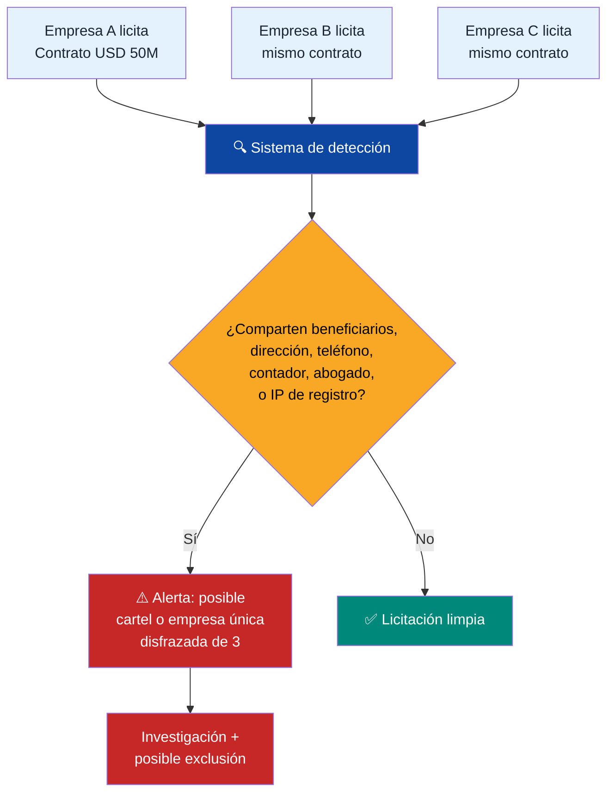

# Gobernanza: Diseño de Sistema Anti-Frágil

> La corrupción y la inestabilidad no son riesgos del plan. Son el entorno operativo. Diseñas el sistema para funcionar dentro.

## 3 Mecanismos de Estabilidad Política Probados

### 1. El Fondo Como Seguro (modelo Alaska)
Si 40 millones tienen dividendos, el político que toque el fondo enfrenta a todo el país. Ningún gobernador de Alaska ha tocado el [PFD desde 1982](https://pfd.alaska.gov/).

### 2. Comprar, No Expropiar (modelo Botswana)
[Khama compró 50% de De Beers](https://www.palladiummag.com/2019/05/09/what-botswana-can-teach-us-about-political-stability/) en vez de expropiar. Las majors petroleras son socias, no enemigas.

### 3. Reglas Constitucionales Blindadas (modelo Chile)
[CORFO sobrevivió 7 gobiernos](https://startupchile.org/en/) porque las reglas fiscales son constitucionales. Modificar requiere 2/3 + referéndum.

## Anticorrupción: Diseño Que Elimina Oportunidades

[Carnegie Endowment (2024)](https://carnegieendowment.org/research/2024/06/sovereign-wealth-funds-corruption-illicit-finance-governance-risks?lang=en): la transparencia voluntaria no funciona.

| Modelo | País | Resultado |
|--------|------|-----------|
| Gobierno digital total | [Estonia](https://e-estonia.com/) | Ahorro 2% PIB; #1 ONU e-gobierno 2024 |
| Purga policial total | Georgia (2004) | Corrupción de ~80% a ~5% en 2 años |
| Agencia independiente | [Singapore CPIB](https://www.cpib.gov.sg/) | Top 5 global anticorrupción |
| Blockchain público | Estonia | 100% trazabilidad |
| Salarios dignos + penas duras | Singapore | Virtualmente cero corrupción |

## Protocolo Día 1 (Primeras 72 Horas)

- **Hora 0:** Publicación total de contratos
- **Hora 1:** Cuentas escrow internacionales (JPM, HSBC)
- **Hora 2:** Plataforma denuncia anónima (recompensa 10–30%, [modelo SEC](https://www.sec.gov/whistleblower))
- **Hora 3:** Fiscal Nacional del Fondo (mandato 10 años, inamovible, modelo CPIB)
- **Hora 4:** Auditoría forense de PDVSA

## Blindaje Anti-Empresas de Maletín

:::danger Contexto: el mecanismo favorito de la corrupción venezolana
Entre 2000-2025, miles de "empresas de maletín" — sociedades sin oficina, sin empleados, sin historial — recibieron contratos públicos por miles de millones de dólares. El mecanismo: un funcionario crea o conecta con una empresa fantasma, le adjudica un contrato, cobra un anticipo de 30-50%, y la empresa desaparece. Esto fue el canal principal de [FONDEN (USD 150B+ desviados)](https://transparenciave.org/), CADIVI, PDVAL, y cientos de entes públicos. **Si el plan no bloquea este mecanismo específicamente, todo lo demás es papel.**
:::

### Registro Obligatorio de Beneficiarios Finales

Toda empresa que contrate con el Estado, opere en ZEETs, reciba fondos de Venezuela Emprende, o participe en concesiones debe registrar:

| Dato | Requisito | Verificación |
|------|-----------|-------------|
| **Beneficiarios finales** (personas físicas) | Declarar toda persona con >5% de propiedad directa o indirecta | Cruzar con [registros internacionales](https://www.openownership.org/) + OFAC SDN List |
| **Estructura societaria completa** | Organigramas hasta la persona física final — sin offshore opacas | Auditoría anual; falsedad = delito penal |
| **Personas políticamente expuestas (PEPs)** | Declarar parentesco hasta 2do grado con funcionarios públicos | Base de datos nacional + [Dow Jones Risk](https://www.dowjones.com/professional/risk/) |
| **Historial de contratos previos** | Registro de todos los contratos públicos de los últimos 10 años | Verificar cumplimiento en registro nacional |

**Referencia:** [UK Persons of Significant Control Register](https://www.gov.uk/government/publications/psc-register-guidance) — obligatorio desde 2016. [EU Anti-Money Laundering Directive 6](https://eur-lex.europa.eu/legal-content/EN/TXT/?uri=celex%3A32024L1640) — registro público de beneficiarios finales.

### Pre-Calificación de Contratistas

Nadie licita sin pasar estos filtros:

| Requisito | Umbral mínimo | Excepción |
|-----------|--------------|-----------|
| **Antigüedad** | 2+ años de operación real (no solo registro mercantil) | JVs con empresa calificada como líder |
| **Capital mínimo** | 10% del valor del contrato en activos verificables | Garantía bancaria equivalente |
| **Personal real** | Nómina verificable ≥10% de lo requerido para ejecutar | Plan de contratación con cronograma |
| **Oficina física** | Dirección verificable con inspección aleatoria | Coworking certificado para startups |
| **Referencias** | 3+ contratos completados de escala similar | Carta de referencia de cliente verificable |
| **No estar en lista negra** | Sin debarment activo nacional o internacional | — |
| **Declaración jurada** | Sin vínculos con funcionarios adjudicadores | Falsedad = delito penal + debarment 20 años |

### Lista de Inhabilitación (Debarment)

| Causal | Duración | Efecto |
|--------|----------|--------|
| Contrato incumplido (>30% del alcance) | 5 años | No puede licitar ni subcontratar |
| Sobrefacturación comprobada | 10 años + devolución del exceso | Inhabilitación + acción penal |
| Empresa fantasma / maletín | **20 años** + decomiso + acción penal | Inhabilitación de beneficiarios finales en cualquier nueva empresa |
| Subcontratación no autorizada (>50% del contrato) | 5 años | Recisión + penalidad |
| Falsificación de documentos de pre-calificación | **Permanente** | Acción penal contra firmantes |

**La lista es pública, digital, y consultable por cualquier ciudadano.** Modelo: [World Bank Debarment List](https://www.worldbank.org/en/projects-operations/procurement/debarred-firms) + [US SAM Exclusions](https://sam.gov/).

### Detección de Empresas Relacionadas

**Señales de alerta que el sistema detecta automáticamente:**
- Misma dirección fiscal o teléfono
- Mismo contador, auditor o abogado
- Beneficiarios finales compartidos (directos o indirectos)
- Registro mercantil en la misma fecha y notaría
- Misma IP de acceso al portal de licitaciones
- Patrones de oferta colusoria (precios sospechosamente cercanos o escalonados)

**Referencia:** [KONEPS (Corea del Sur)](https://www.pps.go.kr/eng/) — sistema de e-procurement que detecta colusión automáticamente. Ahorró USD 8B en 10 años.

### Control de Ejecución Post-Adjudicación

El contrato no termina cuando se firma — ahí empieza la vigilancia:

| Control | Mecanismo | Frecuencia |
|---------|-----------|-----------|
| **Verificación física de avance** | Inspectores independientes (rotación aleatoria) + drones + fotos satelitales | Mensual |
| **Desembolso contra hito** | No se paga anticipo >15%. Pagos solo contra entregable verificado | Por hito |
| **Auditoría de subcontratistas** | Todo subcontrato >10% del valor requiere aprobación + mismos filtros de pre-calificación | Continua |
| **Monitoreo de precios** | Comparar precios pagados con mercado (base de datos de precios referenciales) | Trimestral |
| **Whistleblower de proyecto** | Canal específico por obra/contrato. Trabajadores pueden denunciar anomalías | Permanente |
| **Dashboard público** | Ciudadanos ven: contrato, contratista, avance, pagos, inspector asignado | Tiempo real |

### Protección Anti-Maletín en Cada Área del Plan

| Área del plan | Riesgo de maletín | Protección específica |
|--------------|-------------------|----------------------|
| **Concesiones (PPP)** | Empresa sin experiencia gana concesión y subcontrata todo | Pre-calificación exige 3+ proyectos completados de escala similar |
| **Venezuela Emprende (grants)** | Startup falsa para obtener USD 10-250K | Desembolso en 3 tramos contra hitos; auditoría de aceleradora |
| **ZEETs (0% impuesto)** | Shell company registra facturación ficticia | Operación física verificable; nómina mínima; auditoría aleatoria anual |
| **Forward contracts petroleros** | Intermediario fantasma toma comisión | Contrapartes directas verificadas; sin brokers no registrados |
| **Fondo soberano (proveedores)** | Proveedor de servicios financieros cobrando fees excesivos | Benchmark público de fees; 3 cotizaciones mínimo; comité de compensación independiente |
| **Minería (formalización)** | Front legal para minería ilegal | Trazabilidad blockchain de origen + inspección in situ |
| **Salud (equipos/insumos)** | Facturación de equipos que no llegan o no funcionan | Verificación en destino + garantía de funcionamiento 2 años + penalidad |
| **Educación (servicios)** | Certificaciones fantasma, escuelas que no operan | Verificación de asistencia digital + resultados medibles (notas, empleo) |
| **Vivienda social** | Constructora cobra anticipo y abandona | Anticipo máximo 15% + fianza de cumplimiento + inspector en obra |
| **Diáspora Pre-Seed** | Organización falsa capta inversiones | Plataforma centralizada con KYC; auditoría de uso de fondos |

---

## Penas

| Delito | Pena | Inhabilitación política | Decomiso intergeneracional |
|--------|------|------------------------|---------------------------|
| Corrupción con fondos soberanos | 20–30 años sin beneficios | **Perpetua** | Hijos, nietos, bisnietos + testaferros + amistades bajo investigación (50 años) |
| Soborno a funcionario | 15–25 años | **Perpetua** | Hijos, nietos + personas vinculadas (30 años) |
| Manipulación de datos | 10–20 años | **25 años** | Condenado + familiares directos (20 años) |
| Obstrucción de auditoría | 5–10 años | **15 años** | Condenado (10 años) |
| **Empresa de maletín / contrato fantasma** | **15–25 años** | **Perpetua** | **Beneficiarios finales + familiares + testaferros (50 años)** |
| **Colusión en licitaciones** | **10–20 años** | **Perpetua para empresas; 25 años personal** | **Empresas + beneficiarios + personas vinculadas (30 años)** |
| **Falsificación de pre-calificación** | **10–15 años** | **Perpetua + devolución** | **Firmantes + personas interpuestas (20 años)** |

:::info Rastreo patrimonial extendido
El decomiso no se limita al condenado. Se extiende a **familiares** (hijos, nietos, bisnietos), **testaferros**, y **personas vinculadas bajo investigación** (amistades, socios, prestanombres). La carga de la prueba se invierte: quien posee bienes vinculados a un condenado debe demostrar origen lícito. Modelo: [Colombia Ley de Extinción de Dominio](https://www.funcionpublica.gov.co/) + [UK Unexplained Wealth Orders](https://www.legislation.gov.uk/ukpga/2017/22/part/1). Ver detalle completo en [Justicia Transicional](/04-gobernanza/justicia-transicional).
:::
