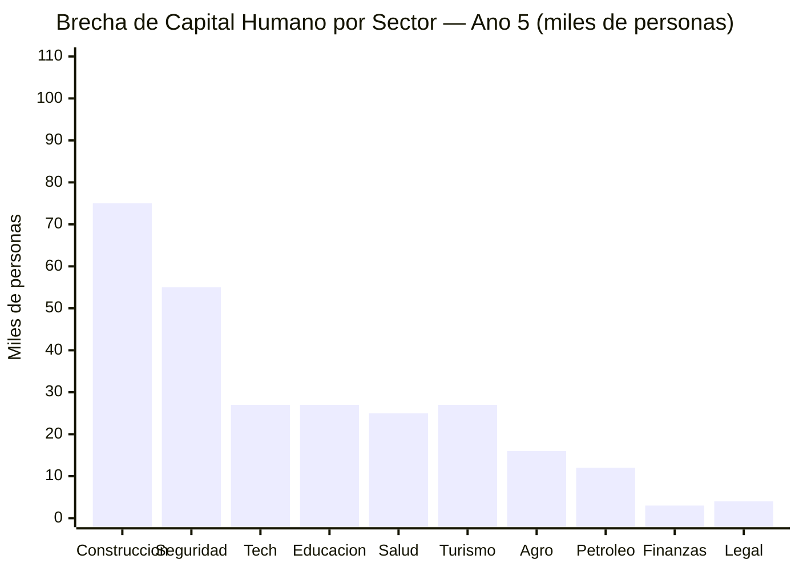
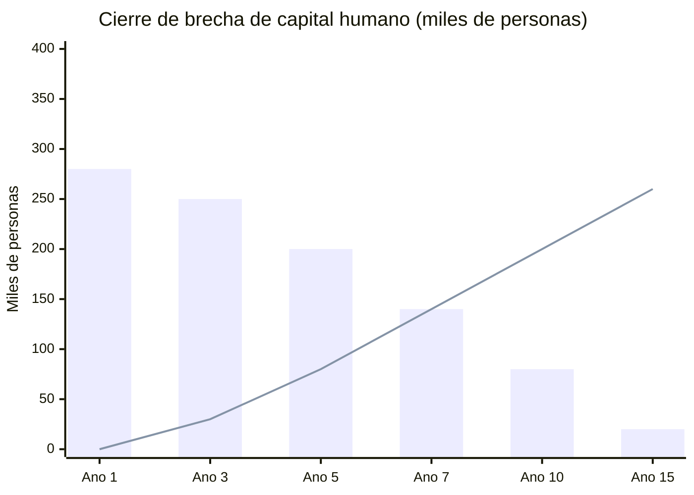

# Capital Humano: El Cuello de Botella Invisible

> El plan necesita USD 550-750B en inversión y 10 motores económicos funcionando. ¿Quién va a operarlos? Venezuela perdió 7,9 M de personas — muchas de las más calificadas.

:::danger La brecha
No puedes rehabilitar refinerías sin ingenieros petroleros. No puedes operar data centers sin programadores. No puedes reformar el Estado sin abogados y economistas. No puedes atraer turistas sin hoteleros. La brecha de capital humano es el cuello de botella más subestimado de todo el plan.
:::

---

## La Brecha Cuantificada

| Sector | Demanda (año 5) | Oferta interna est. | Diáspora disponible | Brecha | Fuente |
|--------|-----------------|---------------------|--------------------|---------|----|
| Ingeniería petrolera | 25.000-35.000 | 5.000-8.000 | 8.000-12.000 | **10.000-15.000** | [PDVSA tenía 45.000 empleados calificados en 2002; producción colapsó tras despidos](https://www.reuters.com/) |
| Tecnología/Software | 50.000-80.000 | 10.000-15.000 | 15.000-25.000 | **15.000-40.000** | [Requiere investigación] |
| Salud (médicos + enfermeras) | 80.000-100.000 | 30.000-40.000 | 20.000-30.000 | **20.000-30.000** | [HRW 2023](https://www.hrw.org/): Venezuela perdió ~40% de personal médico |
| Educación | 100.000-120.000 | 60.000-70.000 | 10.000-15.000 | **20.000-35.000** | [ENCOVI/UCAB 2023](https://www.proyectoencovi.com/) |
| Construcción/Infraestructura | 200.000-300.000 | 100.000-150.000 | 30.000-50.000 | **50.000-100.000** | [Requiere investigación] |
| Finanzas/Banca | 15.000-20.000 | 5.000-8.000 | 5.000-10.000 | **2.000-5.000** | [Requiere investigación] |
| Agricultura técnica | 30.000-50.000 | 15.000-20.000 | 5.000-8.000 | **10.000-22.000** | [FAO Venezuela](https://www.fao.org/) |
| Turismo/Hospitalidad | 40.000-60.000 | 10.000-15.000 | 5.000-10.000 | **20.000-35.000** | [Requiere investigación] |
| Seguridad/Policía | 80.000-100.000 | 30.000 (calificados) | 3.000-5.000 | **45.000-65.000** | Modelo Georgia: policía nueva desde cero |
| Legal/Judicial | 10.000-15.000 | 3.000-5.000 | 3.000-5.000 | **3.000-5.000** | [Requiere investigación] |
| **TOTAL** | **630.000-880.000** | **268.000-356.000** | **104.000-170.000** | **~200.000-350.000** | |

---

## Comparaciones Internacionales

| País | Situación | Solución | Resultado | Fuente |
|------|-----------|----------|-----------|--------|
| **Corea del Sur** (1960s) | País agrícola, analfabetismo 40% | Inversión masiva en educación: 20% del presupuesto por 20 años | De USD 80 per cápita (1960) a USD 35.000 (2024) | [World Bank](https://data.worldbank.org/country/korea-rep) |
| **Singapur** (1965) | Sin recursos, población poco calificada | Educación bilingüe + expertise extranjera + salarios competitivos | Hub financiero y tech global en 30 años | [Lee Kuan Yew, From Third World to First](https://www.worldscientific.com/) |
| **Emiratos Árabes** (1970s) | Pocos nacionales calificados | 85% de fuerza laboral es extranjera; expertise importada | Diversificación exitosa en 40 años | [World Bank UAE](https://data.worldbank.org/country/united-arab-emirates) |
| **Georgia** (2004) | Estado colapsado, policía corrupta | Despidió 85% de policía, recontrató con formación nueva + salarios 10x | Policía funcional en 2 años | [Princeton Innovations for Successful Societies](https://successfulsocieties.princeton.edu/) |
| **India** (1990s-2010s) | Brain drain masivo (IIT → Silicon Valley) | No bloqueó emigración; creó condiciones de retorno (sector tech, salarios) | Reverse brain drain: millones retornaron para crear startups | [NASSCOM](https://nasscom.in/) |

---

## 3 Canales de Solución

### Canal 1: Diáspora (20-30% de la brecha)

La [diáspora venezolana de 7,9 M personas](https://www.unhcr.org/) es el activo humano más valioso y subutilizado:

| Programa | Mecanismo | Meta (año 5) | Costo |
|----------|-----------|-------------|-------|
| **"Vuelve y Construye"** | Fast-track de repatriación: vuelo + vivienda temporal 6 meses + empleo garantizado en proyecto del plan | 50.000-80.000 retornados/año | USD 200-400 M/año |
| **Transferencia remota** | Consultorías, mentorías y formación desde el exterior para quienes no retornan | 20.000 consultores remotos | USD 50-100 M/año |
| **Reconocimiento de títulos** | Homologación automática de títulos obtenidos en el exterior | — | USD 5-10 M (plataforma digital) |
| **Incentivos fiscales** | 5 años sin impuesto sobre renta para retornados que trabajen en sectores prioritarios | — | Costo fiscal absorbido por productividad |

**Precedente:** [Irlanda post-2000](https://www.cso.ie/) — reverse brain drain convirtió a Irlanda en hub tech de Europa; 500K retornados en 15 años.

### Canal 2: Reskilling Interno (50-60% de la brecha, timeline 5-15 años)

Los [32 M que se quedaron](/03-ciudadanos/los-que-se-quedaron) son la base. Pero el sistema educativo colapsó: Venezuela cayó de ~95% de matrícula escolar a ~70% ([ENCOVI/UCAB 2023](https://www.proyectoencovi.com/)).

| Programa | Modelo | Meta | Timeline | Costo |
|----------|--------|------|----------|-------|
| **Bootcamps técnicos** (6-12 meses) | Singapur SkillsFuture + Colombia SENA | 100.000 graduados/año en tech, construcción, salud | Años 1-5 | USD 500 M/año |
| **Reforma educativa** (K-12 + universitaria) | Estonia (PISA top 5 Europa) + Corea del Sur | Sistema educativo competitivo en 10-15 años | Años 1-15 | 4-5% PIB/año |
| **Aprendizaje dual** (trabajo + estudio) | Alemania Ausbildung | 50.000 aprendices/año en industria | Años 3-10 | USD 200 M/año (compartido con empresas) |
| **Certificaciones internacionales** | AWS, Google, Cisco, PMP, CFA, etc. | 200.000 certificados en 5 años | Años 1-5 | USD 100-200 M |

### Canal 3: Expertise Extranjera (10-20% de la brecha, años 1-5)

Para cerrar la brecha inmediata mientras se forman locales:

| Programa | Modelo | Sectores | Escala | Costo |
|----------|--------|----------|--------|-------|
| **Asesores técnicos** | UAE: asesores occidentales en petróleo, finanzas, gobierno | Petróleo, finanzas, legal, gobierno | 5.000-10.000 expertos | USD 500M-1B/año |
| **Partnerships industriales** | Singapur EDB: empresas globales operan con obligación de transferencia de conocimiento | Tech, petróleo, minería | 50-100 partnerships | Incentivos fiscales |
| **Fast-track immigration** | UAE Golden Visa + Singapur Employment Pass | Todos los sectores prioritarios | 20.000-50.000 visas/año | USD 10-20 M (administración) |
| **Campus universitarios internacionales** | UAE: campus de NYU, Sorbonne; Qatar: Education City | Educación superior | 5-10 campus satélite | PPP (inversión privada) |

---

## Proyección: Cierre de Brecha a 15 Años

| Canal | Aporte año 5 | Aporte año 10 | Aporte año 15 |
|-------|-------------|--------------|--------------|
| Diáspora retornada | 50.000-80.000 | 100.000-150.000 | 150.000-200.000 |
| Reskilling interno | 30.000-50.000 | 100.000-200.000 | 300.000-400.000 |
| Expertise extranjera | 15.000-30.000 | 10.000-20.000 | 5.000-10.000 (transferido a locales) |
| **Total** | **95.000-160.000** | **210.000-370.000** | **455.000-610.000** |

---

## Inversión en Capital Humano

| Componente | Inversión total (15 años) | % del plan |
|-----------|--------------------------|------------|
| Educación (4-5% PIB/año) | USD 80-120B | ~15% |
| Programas de reskilling y bootcamps | USD 10-15B | ~2% |
| Incentivos de retorno diáspora | USD 5-8B | ~1% |
| Expertise extranjera (años 1-5) | USD 3-5B | ~0.5% |
| **TOTAL** | **USD 98-148B** | **~18%** |

:::tip La inversión más rentable
Corea del Sur invirtió ~20% de su presupuesto en educación durante 20 años. El retorno: de país agrícola a la 12.ª economía mundial. Cada dólar invertido en capital humano multiplica el retorno de todos los demás motores del plan.
:::

**Fuentes:** [ENCOVI/UCAB 2023](https://www.proyectoencovi.com/) | [UNHCR](https://www.unhcr.org/) | [ILO](https://www.ilo.org/) | [World Bank Human Capital Project](https://www.worldbank.org/en/publication/human-capital) | [Singapur SkillsFuture](https://www.skillsfuture.gov.sg/)
