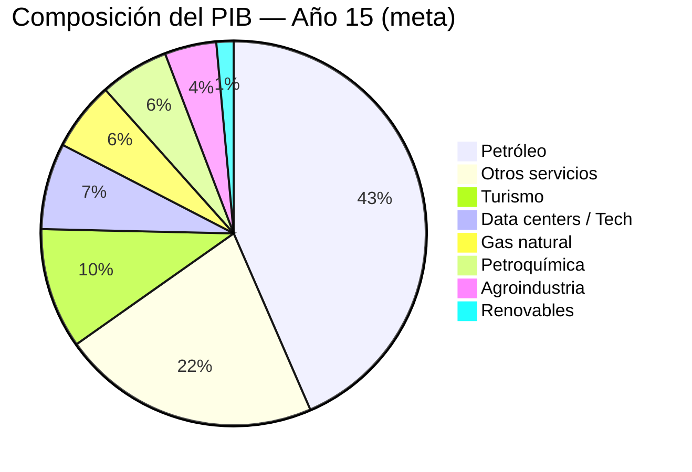
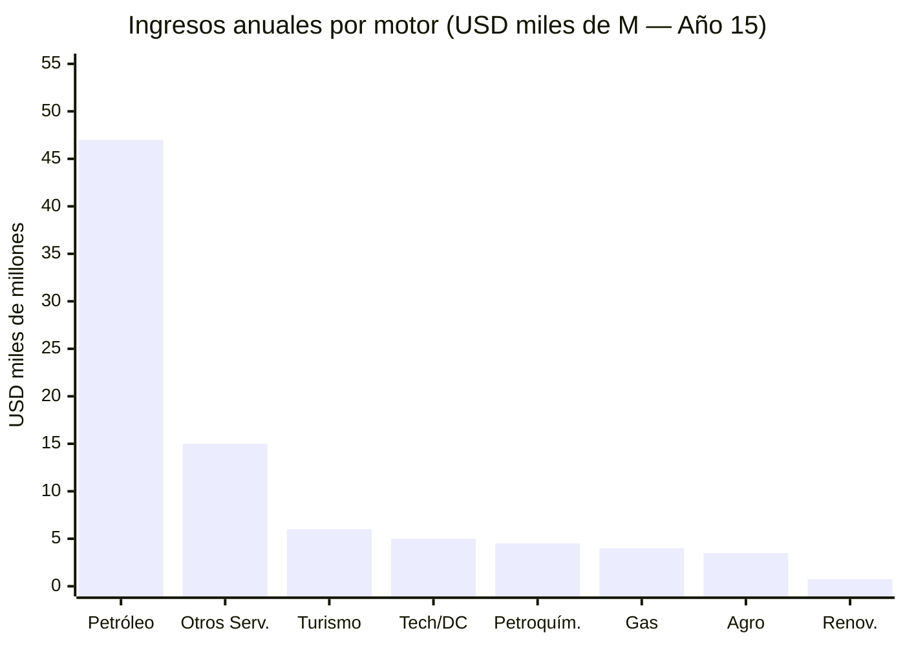
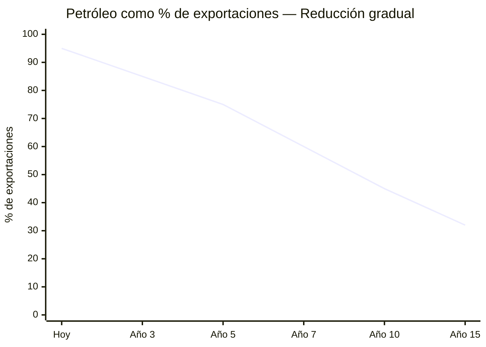

# Los Seis Motores de Diversificación

> El petróleo es el combustible. Estos son los motores que lo consumen.

## 1. Centros de Datos e IA

Mercado LATAM: [USD 7.160 M (2024) → USD 14.300 M (2030)](https://www.businesswire.com/news/home/20250505397648/en/), CAGR 12,22%. Venezuela: energía hidro barata ([Guri 10.200 MW](https://www.power-technology.com/projects/gurihydroelectric/)) como ventaja competitiva.

### Inversiones BigTech en LATAM (referencia)

| Empresa | País | Inversión | Año | Fuente |
|---------|------|-----------|-----|--------|
| Amazon (AWS) | Chile | USD 4.000 M | 2024 | [Mordor Intelligence](https://www.mordorintelligence.com/industry-reports/south-america-data-center-market) |
| Microsoft | Brasil | USD 2.700 M | 2025 | [BusinessWire](https://www.businesswire.com/news/home/20250505397648/en/) |
| Google | Chile/Argentina | Cable Humboldt + DC | 2024–2025 | Google Press |
| Oracle | México | USD 1.500 M+ | 2024 | Oracle Press |

**Propuesta Venezuela:** Zona Guayana Digital (Ciudad Guayana, adyacente a Guri). Electricidad a costo marginal. Meta: **5–10% del mercado LATAM de data centers para 2035** = USD 700–1.400 M/año.

---

## 2. Gas Natural

:::info Recurso ignorado
Venezuela tiene las **7mas reservas mundiales de gas natural**: [5.500 BCM](https://www.congress.gov/crs-product/IF12448) (~195 TCF). Producción actual: ~30 BCM/año, **100% consumo doméstico, cero exportaciones**. [~80% del gas es asociado](https://www.energypolicy.columbia.edu/more-efficient-use-of-venezuelas-natural-gas-could-strengthen-the-regions-energy-security-and-the-countrys-electricity-sector/) (subproducto del petróleo).
:::

### Oportunidad: Modelo Trinidad y Tobago

[Trinidad y Tobago](https://www.congress.gov/crs-product/IF12448) tiene capacidad de licuefacción (LNG) de 16 BCM/año con un tren actualmente fuera de servicio por falta de gas. El [proyecto Dragon Field](https://venezuelanalysis.com/news/venezuela-signs-30-year-alliance-with-trinidad-to-develop-dragon-gas-field/) — alianza de 30 años — construiría un gasoducto de 17 km desde el campo Dragon (Venezuela) hasta Hibiscus (Trinidad) para producir LNG.

| Escenario | Producción adicional | Ingreso estimado | Fuente |
|-----------|---------------------|------------------|--------|
| Dragon Field (fase 1) | 185 MMCF/día | USD 300–500 M/año | [Venezuelanalysis](https://venezuelanalysis.com/news/venezuela-signs-30-year-alliance-with-trinidad-to-develop-dragon-gas-field/) |
| Exportación a Colombia | 0,5 BCF/día | [USD 700–800 M/año](https://rbac.com/beyond-oil-could-venezuela-be-a-natural-gas-powerhouse/) | RBAC Inc. |
| LNG expandido (trenes reactivados) | 6–10 BCM/año | USD 2.000–4.000 M/año | [J.P. Morgan](https://www.jpmorgan.com/insights/global-research/commodities/venezuela-oil-lng) |

**Potencial total gas natural: USD 3.000–5.000 M/año** — un motor financiero comparable al petróleo en escala parcial.

---

## 3. Turismo

Salto Ángel, Los Roques, Canaima (UNESCO), Margarita, Mochima, Gran Sabana, Delta del Orinoco.

| País competidor | Turistas/año | Ingresos | Fuente |
|----------------|-------------|----------|--------|
| Rep. Dominicana | 10+ M | USD 9.000+ M | OMT |
| Costa Rica | 3,2 M | USD 4.000+ M | OMT |
| Colombia | 6+ M | USD 6.000+ M | MinComercio |
| **Venezuela (meta)** | **5–10 M** | **USD 4.000–8.000 M** | **Año 15** |

**Requisitos:** Seguridad (ver [Seguridad Física](/04-gobernanza/seguridad-fisica)), aeropuertos (ver [Infraestructura](/06-realidad/infraestructura-basica)), marca país, visa fast-track, Margarita como zona de nómades digitales.

**Inversión turismo:** USD 3.000–5.000 M en 10 años (aeropuertos, hoteles, marketing, capacitación).

---

## 4. Energías Renovables

[74% de electricidad ya renovable](https://www.energypolicy.columbia.edu/more-efficient-use-of-venezuelas-natural-gas-could-strengthen-the-regions-energy-security-and-the-countrys-electricity-sector/) (hidroeléctrica). Potencial de expansión masiva en solar y eólica.

| Fuente | Potencial | Ubicación | Estado |
|--------|-----------|-----------|--------|
| Hidroeléctrica | [18.000 MW (Cascada Caroní)](https://news.mongabay.com/2023/08/hydropower-in-the-pan-amazon-the-guri-complex-and-the-caroni-cascade/) | Bolívar | Guri operando a capacidad reducida |
| Solar | Alto irradiación (>5 kWh/m²/día) | Falcón, Zulia, Lara | Sin desarrollo |
| Eólica | Potencial en Paraguaná | Falcón | Sin desarrollo |

**Meta:** 74% → 85%+ renovable con solar/eólica. Exportar electricidad a Colombia y Brasil (interconexión existente).

**Inversión renovables:** USD 3.000–5.000 M en 10 años.

---

## 5. Petroquímica

Venezuela tiene refinerías (Paraguaná, Amuay, Cardón — actualmente operando a <20% de capacidad) y feedstock petrolero abundante. La petroquímica convierte commodities en productos de alto valor agregado.

| Producto | Mercado objetivo | Potencial |
|----------|-----------------|-----------|
| Fertilizantes (urea, amoníaco) | LATAM + Caribe | Alto — demanda agrícola creciente |
| Plásticos y resinas | Doméstico + exportación | Alto — materia prima abundante |
| Metanol / Etanol | Industria química global | Medio |
| Asfalto | Infraestructura LATAM | Alto — crudo pesado ideal |

**Inversión petroquímica:** USD 5.000–10.000 M en 10 años (rehabilitación de refinerías + nuevas plantas).

---

## 6. Agroindustria

Llanos: tierras fértiles subutilizadas + agua del Orinoco. Venezuela importa >70% de alimentos pese a su potencial agrícola.

| Rubro | Potencial | Mercado | Meta |
|-------|-----------|---------|------|
| Cacao | Top 10 mundial en calidad | Premium global | Marca "cacao venezolano" |
| Café | Tradición exportadora | Specialty coffee | Recuperar posición |
| Camarón/acuicultura | Costa caribeña extensa | Caribe + EE.UU. | Modelo Ecuador (1/4 consumo mundial) |
| Frutas tropicales | Clima ideal | Caribe + Europa | Procesamiento + exportación |
| Maíz, arroz, carne | Llanos | Autosuficiencia | Soberanía alimentaria 10 años |

**Meta:** Soberanía alimentaria en 10 años + exportación agroindustrial al Caribe. Ver [Infraestructura](/06-realidad/infraestructura-basica) para plan agrícola detallado.

---

## Resumen: Contribución al PIB (Meta Año 15)

| Motor | Ingreso Anual Est. | % PIB (meta) |
|-------|-------------------|-------------|
| Petróleo | USD 40.000–55.000 M | 25–35% |
| Gas natural | USD 3.000–5.000 M | 3–5% |
| Data centers / Tech | USD 3.000–7.000 M | 3–5% |
| Turismo | USD 4.000–8.000 M | 5–8% |
| Petroquímica | USD 3.000–6.000 M | 3–5% |
| Agroindustria | USD 2.000–5.000 M | 2–4% |
| Renovables (exportación) | USD 500–1.000 M | <1% |
| Otros servicios | USD 10.000–20.000 M | 10–15% |

### Transición: De Petroestado a Economía Diversificada

:::tip Meta de diversificación
Petróleo pasa del **95% actual a <35% de exportaciones**. Los 6 motores no-petroleros generan >USD 25.000 M/año combinados. Esta es la diferencia entre una petroeconomía frágil y una economía diversificada.
:::
