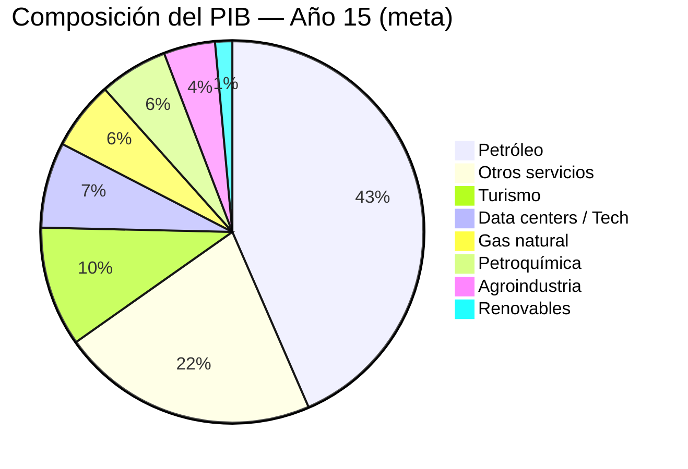
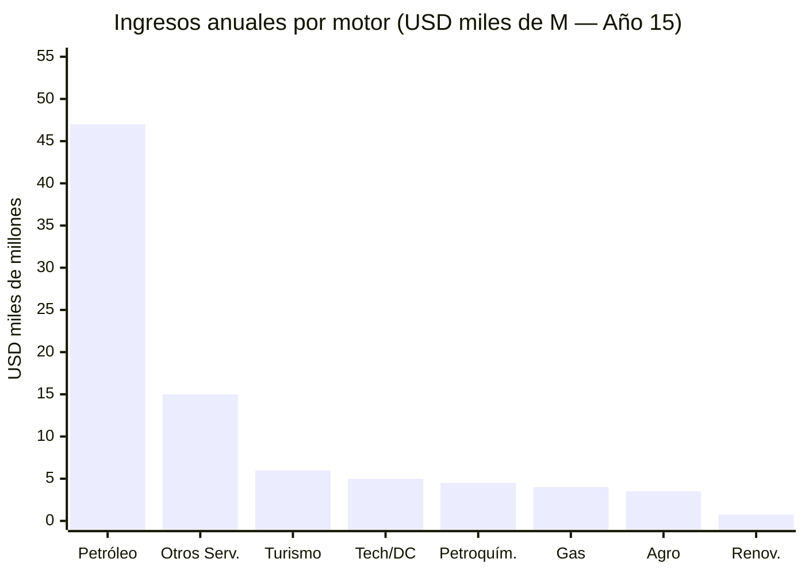
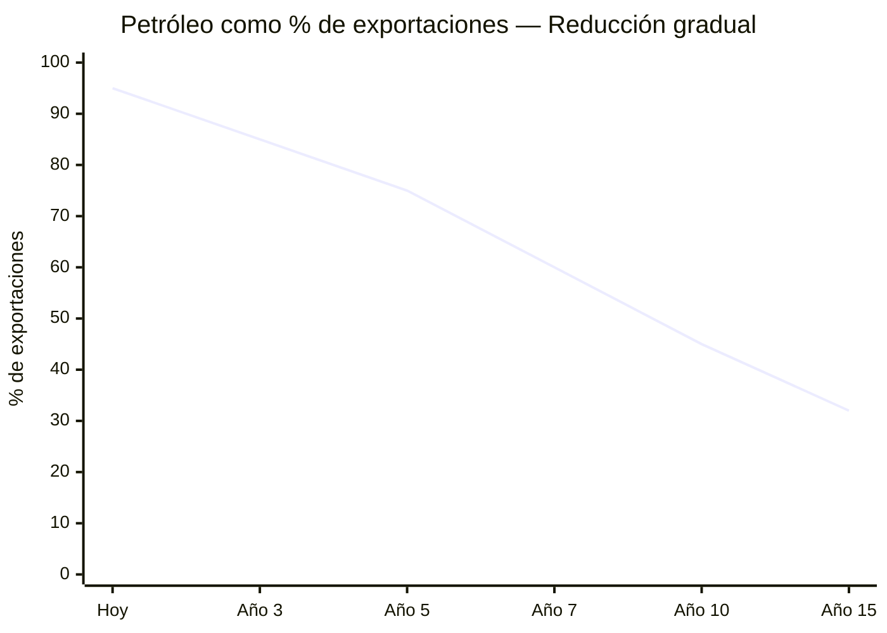
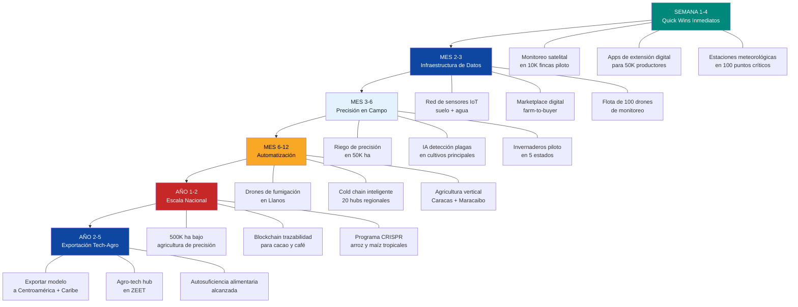

# Los Seis Motores de Diversificación

> El petróleo es el combustible. Estos son los motores que lo consumen.

## 1. Centros de Datos e IA

:::info Mercado en explosión
Mercado LATAM DC: [USD 7.160 M (2024) → USD 14.300 M (2030)](https://www.businesswire.com/news/home/20250505397648/en/), CAGR 12,22%. Pero el mercado global es otra escala: capex en data centers alcanzará **USD 1,7 TRILLONES para 2030** ([Dell'Oro Group](https://www.delloro.com/)). Los hyperscalers invertirán **USD 602B solo en 2026** — el **75% para IA** — y el cuello de botella es **energía limpia y barata**. Venezuela tiene exactamente eso.
:::

### El contexto global: la carrera por energía para IA

| Dato | Cifra | Fuente |
|------|-------|--------|
| Capex hyperscalers 2026 | **USD 602B** (+36% vs 2025) | [Dell'Oro Group](https://www.delloro.com/) |
| Amazon, Microsoft, Google, Meta | Cada uno **>USD 100B** en 2026 | [Bloomberg](https://www.bloomberg.com/) |
| Capex global en DCs para 2030 | **USD 1,7 TRILLONES** | [Dell'Oro Group](https://www.delloro.com/) |
| % para infraestructura IA | **75%** del capex 2026 | [Bloomberg](https://www.bloomberg.com/) |
| DCs como % electricidad EE.UU. (2028) | **12-15%** (vs 4% en 2023) | [Morgan Stanley](https://www.morganstanley.com/) |
| Déficit de generación EE.UU. para 2028 | **49 GW** | [Morgan Stanley](https://www.morganstanley.com/) |
| Capacidad AI DC LATAM 2026 → 2031 | **443 MW → 1,6 GW** | [Requiere investigación] |

**Traducción:** El mundo está desesperado por sitios con energía limpia y barata. Las renovables crecen 22%/año pero cubren solo ~la mitad de la demanda nueva. Las empresas pagan **primas** por acceso garantizado a energía verde. Venezuela tiene **17 GW de hidro**, el costo más bajo del hemisferio, y excedentes de energía en Bolívar que literalmente no tienen a dónde ir.

### Inversiones BigTech en LATAM (referencia)

| Empresa | País | Inversión | Año | Fuente |
|---------|------|-----------|-----|--------|
| Amazon (AWS) | Chile | USD 4.000 M | 2024 | [Mordor Intelligence](https://www.mordorintelligence.com/industry-reports/south-america-data-center-market) |
| Microsoft | Brasil | USD 2.700 M | 2025 | [BusinessWire](https://www.businesswire.com/news/home/20250505397648/en/) |
| Google | Chile/Argentina | Cable Humboldt + DC | 2024–2025 | Google Press |
| Oracle | México | USD 1.500 M+ | 2024 | Oracle Press |
| Google | Chile | Región Cloud (**>USD 4B** comprometidos a 2026) | 2024-2026 | [Google Cloud](https://cloud.google.com/) |
| Goldman Sachs | Brasil | **Rio AI City** (campus de IA) | 2025-2026 | [Goldman Sachs](https://www.goldmansachs.com/) |

### Venezuela como "arbitraje energético" para data centers

La tesis es simple: los hyperscalers necesitan energía limpia. Chile cobra **USD 0,05-0,08/kWh**. Brasil cobra **USD 0,06-0,09/kWh**. Venezuela puede ofrecer **<USD 0,02/kWh** con hidroeléctrica — el precio más bajo del hemisferio occidental.

| Parámetro | Venezuela (Bolívar) | Chile | Brasil | EE.UU. (Virginia) |
|-----------|---------------------|-------|--------|-------------------|
| **Costo eléctrico** | **<USD 0,02/kWh** | USD 0,05-0,08 | USD 0,06-0,09 | USD 0,08-0,12 |
| **Fuente** | Hidro 90% | Solar + eólica | Hidro + solar | Gas + nuclear |
| **Capacidad hidro** | **17 GW** | N/A | ~110 GW | ~80 GW |
| **Ahorro anual por 100 MW** | Referencia | -USD 30-50M | -USD 35-60M | -USD 50-80M |
| **Energía "atrapada" disponible** | **Sí** | No | No | No |

Fuentes: costos — [Global Energy Monitor](https://globalenergymonitor.org/), [Americas Quarterly](https://www.americasquarterly.org/); Guri — [Power Technology](https://www.power-technology.com/projects/gurihydroelectric/).

:::tip Benchmark Chile: >USD 4B comprometidos — pero Venezuela tiene mejor energía
Chile ha comprometido **>USD 4B en data centers** con Google entre los líderes. Pero su electricidad cuesta **3-4x más** que la de Venezuela y depende de solar/eólica (intermitente). Venezuela ofrece hidroeléctrica: **24/7, baseload, cero carbono, y a USD 0,02/kWh**. Es el pitch más competitivo del hemisferio — el riesgo país es la única barrera, y esa se resuelve con concesiones a operadores privados internacionales y zona de inversión protegida.
:::

**Propuesta Venezuela:** Corredor Guayana Digital (Ciudad Guayana, adyacente a Guri). Electricidad a costo marginal. "Energía atrapada" — excedentes de Guri que la red de transmisión no puede llevar al norte. En lugar de esperar a reparar toda la red, **construir data centers JUNTO a la fuente de energía**. Meta: **5-10% del mercado LATAM de data centers para 2035** = USD 700-1.400 M/año. Con escala completa (500 MW-1 GW): **USD 1,5-3B/año**. Ver [Hubs Tech](/05-transformacion/hubs-tech) para proyección detallada del corredor. Ver [Data Centers e IA — Análisis Detallado](/10-oportunidades/data-centers-ia) para modelo financiero completo.

---

## 2. Gas Natural

:::info Recurso ignorado
Venezuela tiene las **7mas reservas mundiales de gas natural**: [5.500 BCM](https://www.congress.gov/crs-product/IF12448) (~195 TCF). Producción actual: ~30 BCM/año, **100% consumo doméstico, cero exportaciones**. [~80% del gas es asociado](https://www.energypolicy.columbia.edu/more-efficient-use-of-venezuelas-natural-gas-could-strengthen-the-regions-energy-security-and-the-countrys-electricity-sector/) (subproducto del petróleo).
:::

### Oportunidad: Modelo Trinidad y Tobago

[Trinidad y Tobago](https://www.congress.gov/crs-product/IF12448) tiene capacidad de licuefacción (LNG) de 16 BCM/año con un tren actualmente fuera de servicio por falta de gas. El [proyecto Dragon Field](https://venezuelanalysis.com/news/venezuela-signs-30-year-alliance-with-trinidad-to-develop-dragon-gas-field/) — alianza de 30 años — construiría un gasoducto de 17 km desde el campo Dragon (Venezuela) hasta Hibiscus (Trinidad) para producir LNG.

| Escenario | Producción adicional | Ingreso estimado | Fuente |
|-----------|---------------------|------------------|--------|
| Dragon Field (fase 1) | 185 MMCF/día | USD 300–500 M/año | [Venezuelanalysis](https://venezuelanalysis.com/news/venezuela-signs-30-year-alliance-with-trinidad-to-develop-dragon-gas-field/) |
| Exportación a Colombia | 0,5 BCF/día | [USD 700–800 M/año](https://rbac.com/beyond-oil-could-venezuela-be-a-natural-gas-powerhouse/) | RBAC Inc. |
| LNG expandido (trenes reactivados) | 6–10 BCM/año | USD 2.000–4.000 M/año | [J.P. Morgan](https://www.jpmorgan.com/insights/global-research/commodities/venezuela-oil-lng) |

**Potencial total gas natural: USD 3.000–5.000 M/año** — un motor financiero comparable al petróleo en escala parcial. Ver [Petróleo y Gas — Análisis Detallado](/10-oportunidades/petroleo-gas) para modelo completo con USD 183B de inversión (Rystad).

---

## 3. Turismo

Salto Ángel, Los Roques, Canaima (UNESCO), Margarita, Mochima, Gran Sabana, Delta del Orinoco.

| País competidor | Turistas/año | Ingresos | Fuente |
|----------------|-------------|----------|--------|
| Rep. Dominicana | 10+ M | USD 9.000+ M | OMT |
| Costa Rica | 3,2 M | USD 4.000+ M | OMT |
| Colombia | 6+ M | USD 6.000+ M | MinComercio |
| **Venezuela (meta)** | **5–10 M** | **USD 4.000–8.000 M** | **Año 15** |

**Requisitos:** Seguridad (ver [Seguridad Física](/04-gobernanza/seguridad-fisica)), aeropuertos (ver [Infraestructura](/06-realidad/infraestructura-basica)), marca país, visa fast-track, Margarita como zona de nómades digitales. Ver [Turismo — Análisis Detallado](/10-oportunidades/turismo) para modelo completo con 12 verticales y USD 8-15B de inversión.

**Inversión turismo:** USD 3.000–5.000 M en 10 años (aeropuertos, hoteles, marketing, capacitación).

---

## 4. Energías Renovables

[74% de electricidad ya renovable](https://www.energypolicy.columbia.edu/more-efficient-use-of-venezuelas-natural-gas-could-strengthen-the-regions-energy-security-and-the-countrys-electricity-sector/) (hidroeléctrica). Potencial de expansión masiva en solar y eólica.

| Fuente | Potencial | Ubicación | Estado |
|--------|-----------|-----------|--------|
| Hidroeléctrica | [18.000 MW (Cascada Caroní)](https://news.mongabay.com/2023/08/hydropower-in-the-pan-amazon-the-guri-complex-and-the-caroni-cascade/) | Bolívar | Guri operando a capacidad reducida |
| Solar | Alto irradiación (>5 kWh/m²/día) | Falcón, Zulia, Lara | Sin desarrollo |
| Eólica | Potencial en Paraguaná | Falcón | Sin desarrollo |

**Meta:** 74% → 85%+ renovable con solar/eólica. Exportar electricidad a Colombia y Brasil (interconexión existente). Ver [Energía Renovable — Análisis Detallado](/10-oportunidades/energia-renovable) y [Capacidad Eléctrica](/10-oportunidades/capacidad-electrica) para proyecciones de generación y distribución.

**Inversión renovables:** USD 3.000–5.000 M en 10 años.

---

## 5. Petroquímica

Venezuela tiene refinerías (Paraguaná, Amuay, Cardón — actualmente operando a <20% de capacidad) y feedstock petrolero abundante. La petroquímica convierte commodities en productos de alto valor agregado.

| Producto | Mercado objetivo | Potencial |
|----------|-----------------|-----------|
| Fertilizantes (urea, amoníaco) | LATAM + Caribe | Alto — demanda agrícola creciente |
| Plásticos y resinas | Doméstico + exportación | Alto — materia prima abundante |
| Metanol / Etanol | Industria química global | Medio |
| Asfalto | Infraestructura LATAM | Alto — crudo pesado ideal |

**Inversión petroquímica:** USD 5.000–10.000 M en 10 años (rehabilitación de refinerías + nuevas plantas). Ver [Manufactura Industrial](/10-oportunidades/manufactura-industrial) para cadena de valor downstream y [Minerales Críticos](/10-oportunidades/minerales-criticos) para insumos industriales.

---

## 6. Agroindustria

Llanos: tierras fértiles subutilizadas + agua del Orinoco. Venezuela importa >70% de alimentos pese a su potencial agrícola.

| Rubro | Potencial | Mercado | Meta |
|-------|-----------|---------|------|
| Cacao | Top 10 mundial en calidad | Premium global | Marca "cacao venezolano" |
| Café | Tradición exportadora | Specialty coffee | Recuperar posición |
| Camarón/acuicultura | Costa caribeña extensa | Caribe + EE.UU. | Modelo Ecuador (1/4 consumo mundial) |
| Frutas tropicales | Clima ideal | Caribe + Europa | Procesamiento + exportación |
| Maíz, arroz, carne | Llanos | Autosuficiencia | Autosuficiencia alimentaria 10 años |

**Meta:** Autosuficiencia alimentaria en 10 años + exportación agroindustrial al Caribe. Ver [Infraestructura](/06-realidad/infraestructura-basica) para plan agrícola detallado. Ver [Agro y Ganadería — Análisis Detallado](/10-oportunidades/agro-ganaderia) para modelo completo con USD 18-25B de inversión y 1,5-2M empleos.

---

## Resumen: Contribución al PIB (Meta Año 15)

| Motor | Ingreso Anual Est. | % PIB (meta) |
|-------|-------------------|-------------|
| Petróleo | USD 40.000–55.000 M | 25–35% |
| Gas natural | USD 3.000–5.000 M | 3–5% |
| Data centers / Tech / IA | USD 3.000–7.000 M | 3–5% |
| Turismo | USD 4.000–8.000 M | 5–8% |
| Petroquímica | USD 3.000–6.000 M | 3–5% |
| Agroindustria | USD 2.000–5.000 M | 2–4% |
| Renovables (exportación) | USD 500–1.000 M | <1% |
| Otros servicios | USD 10.000–20.000 M | 10–15% |

### Transición: De Petroestado a Economía Diversificada

:::tip Meta de diversificación
Petróleo pasa del **95% actual a <35% de exportaciones**. Los 6 motores no-petroleros generan >USD 25.000 M/año combinados. Esta es la diferencia entre una petroeconomía frágil y una economía diversificada.
:::

---

## Automatización Agrícola: Leapfrog Tecnológico

> Venezuela no necesita repetir 50 años de mecanización agrícola. Con drones, IA y sensores, puede saltar directo a agricultura de precisión — y lograr Autosuficiencia alimentaria en 3-5 años, no en 15.

:::danger Crisis alimentaria actual (2026)
- **5,1 millones** de personas necesitan asistencia alimentaria urgente — [WFP Venezuela](https://www.wfp.org/emergencies/venezuela-emergency)
- Reservas alimentarias para **111 días** — [FAO/GIEWS](https://www.fao.org/giews/countrybrief/country.jsp?code=VEN)
- Importa **>70%** de lo que consume pese a tener Los Llanos, Sur del Lago y Delta del Orinoco
- Capacidad productiva deteriorada por décadas de desinversión, expropiaciones y éxodo de capital humano
:::

### La tesis: leapfrog, no catch-up

Venezuela tiene 4 activos que la mayoría de los países en crisis alimentaria no tienen:

| Activo | Dato | Ventaja para agro-tech |
|--------|------|----------------------|
| **Tierra fértil** | Llanos (~17M ha), Sur del Lago (~500K ha), Delta del Orinoco | Superficie cultivable masiva, subutilizada |
| **Electricidad barata** | [Guri 10.200 MW](https://www.power-technology.com/projects/gurihydroelectric/) + Cascada Caroní 18 GW | Energía a costo marginal para IoT, riego, cold chain |
| **Fuerza laboral disponible** | Desempleo efectivo >40%, 200K ha de tierras comunales activándose | Mano de obra lista para capacitación |
| **Conectividad rural** | Starlink ya en el plan de infraestructura digital | IoT y drones funcionan con satélite — no necesitan fibra |

En lugar de comprar tractores usados y repetir el modelo de mecanización del siglo XX, Venezuela puede desplegar tecnología agrícola de 2026 sobre tierra virgen. Es el mismo argumento que M-Pesa en Kenia: sin infraestructura legacy que defender, se salta directo a la siguiente generación.

### Tecnologías disponibles AHORA: Timeline de despliegue

| Tecnología | Timeline | Costo por finca (100 ha) | Impacto en rendimiento | Fuente |
|-----------|----------|-------------------------|----------------------|--------|
| **Monitoreo satelital** (Farmonaut, Planet) | Días (1-30) | USD 500-2.000/año | +15-25% detección temprana de estrés | [Farmonaut](https://www.farmonaut.com/) |
| **Estaciones meteorológicas IoT** | Días (1-30) | USD 1.000-3.000 instalación | Reducción 20-30% pérdidas por clima | [Davis Instruments](https://www.davisinstruments.com/) |
| **Apps móviles para agricultores** (extensión digital) | Días (1-30) | USD 0 (modelo freemium) | Acceso a precios, técnicas, mercados | [Plantix](https://plantix.net/), [AgroStar](https://www.agrostar.in/) |
| **Drones de monitoreo** (NDVI, multispectral) | Semanas (30-90) | USD 5.000-15.000 por dron | +20-30% eficiencia en insumos | [DJI Agras](https://ag.dji.com/) |
| **Sensores de suelo IoT** (humedad, pH, nutrientes) | Semanas (30-90) | USD 2.000-5.000/finca | -25-40% uso de agua | [CropX](https://www.cropx.com/) |
| **Marketplace digital** (farm-to-buyer) | Semanas (30-90) | USD 0 para productores | Elimina 2-3 intermediarios (+30-50% ingreso) | [Agrofy](https://www.agrofy.com.ar/) |
| **Riego de precisión con IA** | Meses (3-12) | USD 10.000-30.000/finca | -40-60% uso de agua, +25% rendimiento | [Netafim](https://www.netafim.com/) |
| **IA detección de enfermedades** (cámara + modelo) | Meses (3-12) | USD 500-2.000/año | Reducción 30-50% pérdidas por plagas | [PlantVillage](https://plantvillage.psu.edu/) |
| **Invernaderos automatizados** | Meses (3-12) | USD 50.000-150.000 (1.000 m²) | 3-10x rendimiento vs. campo abierto | [Autogrow](https://autogrow.com/) |
| **Agricultura vertical** (piloto urbano) | Meses (3-12) | USD 200.000-500.000 (piloto) | 100x rendimiento/m², -95% agua | [AeroFarms](https://www.aerofarms.com/) |
| **Drones de fumigación/siembra** | 1-2 años | USD 15.000-40.000 por dron | -30% pesticidas, 10x velocidad vs. manual | [XAG](https://www.xa.com/en) |
| **Cadena de frío inteligente** | 1-2 años | USD 50.000-200.000/hub | Reducción 30-50% merma post-cosecha | [Inficold](https://inficold.com/) |
| **Blockchain trazabilidad** (farm-to-table) | 1-2 años | USD 5.000-10.000/cooperativa | Premium de precio 15-30% en exportación | [IBM Food Trust](https://www.ibm.com/products/supply-chain-intelligence-suite/food-trust) |
| **Biotech/CRISPR para cultivos** | 2-3 años | USD 1-5M por programa | Variedades adaptadas a clima y suelo local | [Corteva Agriscience](https://www.corteva.com/) |

### Secuencia de despliegue

### Agricultura tradicional vs. automatizada: el salto de rendimiento

| Métrica | Método tradicional (Venezuela hoy) | Agricultura de precisión (meta año 3-5) | Mejora |
|---------|-----------------------------------|----------------------------------------|--------|
| **Rendimiento maíz** (ton/ha) | 2,5-3,0 | 6,0-8,0 | **+150-170%** |
| **Rendimiento arroz** (ton/ha) | 3,5-4,0 | 7,0-9,0 | **+100-125%** |
| **Uso de agua** (m³/ton) | 1.500-2.000 | 600-900 | **-55-60%** |
| **Uso de pesticidas** (kg/ha) | 3,0-5,0 | 1,0-2,0 | **-60-70%** |
| **Pérdida post-cosecha** (%) | 30-40% | 10-15% | **-20-25 pp** |
| **Costo por hectárea** (USD/ha/año) | 800-1.200 | 1.200-1.800 (año 1), 700-1.000 (año 3+) | **-15-20% después de amortización** |
| **Productores con acceso a precios en tiempo real** | <10% | >80% | **+70 pp** |
| **Tiempo de detección de plagas** | 7-14 días (visual) | 1-2 días (dron + IA) | **-80-85%** |

Fuentes: rendimientos promedios Venezuela — [FAO STAT](https://www.fao.org/faostat/); rendimientos agricultura de precisión — [McKinsey Agriculture Practice, 2023](https://www.mckinsey.com/industries/agriculture/our-insights); reducción de insumos — [PrecisionAg](https://www.precisionag.com/).

:::info Referencia: Brasil y la revolución EMBRAPA
Brasil pasó de importador neto de alimentos a **superpotencia agrícola** en 40 años, fundamentalmente por [EMBRAPA](https://www.embrapa.br/en/international) — su agencia de investigación agropecuaria. Hoy alimenta a 800M de personas. Venezuela con agro-tech puede comprimir ese timeline a 10-15 años: la tecnología que Brasil desarrolló durante décadas ya existe como producto off-the-shelf. Lo que falta es capital, voluntad y ejecución — no ciencia.
:::

### Quick wins: desplegable en <6 meses

Estas 5 acciones no requieren legislación, ni infraestructura pesada, ni años de preparación:

| # | Acción | Costo | Impacto inmediato | Responsable |
|---|--------|-------|-------------------|-------------|
| 1 | **Contratar monitoreo satelital** para 10.000 fincas en Llanos y Sur del Lago | USD 5-20M/año | Mapa completo del estado real de la agricultura venezolana en 30 días | Concesión privada + cooperativas |
| 2 | **Desplegar app de extensión agrícola** con precios, clima, técnicas | USD 1-3M desarrollo + operación | 50K+ productores conectados a información en tiempo real | Startup local o licencia de Plantix/AgroStar |
| 3 | **100 estaciones meteorológicas IoT** en zonas productivas clave | USD 3-5M | Red de alerta temprana: sequías, lluvias extremas, heladas | Proveedor IoT + universidades |
| 4 | **Flota piloto de 50-100 drones de monitoreo** en 5 estados agrícolas | USD 1-3M | Detección de plagas, estrés hídrico, salud del cultivo en 24 horas vs. 2 semanas | Empresa de servicios de drones (crear o traer) |
| 5 | **Marketplace digital farm-to-buyer** eliminando intermediarios | USD 2-5M desarrollo | Productores ganan 30-50% más por eliminar 2-3 intermediarios | Startup tipo Agrofy adaptada |

**Inversión total quick wins: USD 12-36M.** Retorno: visibilidad completa del sector agrícola + conexión digital de 50K+ productores + reducción de pérdidas. Esto no es un plan a 15 años — es ejecutable en el primer semestre.

### Inversión total en automatización agrícola

| Fase | Período | Inversión | Hectáreas bajo agro-tech | Empleos directos |
|------|---------|-----------|------------------------|-----------------|
| **Fase 0: Quick wins** | Meses 1-6 | USD 12-36M | 100K (monitoreo) | 500-1.000 |
| **Fase 1: Precisión** | Meses 6-18 | USD 100-200M | 300K | 5.000-10.000 |
| **Fase 2: Automatización** | Año 1-3 | USD 300-600M | 750K | 15.000-30.000 |
| **Fase 3: Escala nacional** | Año 3-5 | USD 500M-1B | 2M+ | 30.000-60.000 |
| **Total** | **5 años** | **USD 900M-1.8B** | **2M+ ha** | **50K-100K** |

### Mercado de drones agrícolas: oportunidad de USD 36.5B

El mercado global de drones agrícolas alcanzará [USD 36.500 M para 2032](https://www.fortunebusinessinsights.com/agricultural-drones-market-102589) (Fortune Business Insights). Venezuela puede:

1. **Usar** drones importados para productividad inmediata (año 1-3)
2. **Ensamblar** drones en ZEETs con componentes importados (año 2-4)
3. **Exportar** servicios de drones agrícolas al Caribe y Centroamérica (año 3-5)

:::tip Modelo de negocio: Drone-as-a-Service (DaaS)
El productor no compra el dron — contrata el servicio. Una empresa opera flotas de 50-100 drones, cobra por hectárea monitoreada/fumigada. **Precio:** USD 5-15/ha por vuelo de monitoreo, USD 15-30/ha por fumigación de precisión. Con 500K ha bajo contrato = **USD 5-15M/año** por operador. Esto es un negocio de [Venezuela Emprende](/05-transformacion/startup-programs) — capital semilla de USD 50-200K, breakeven en 12-18 meses.
:::

### Cultivos prioritarios para automatización

| Cultivo | Ha disponibles | Rendimiento actual | Meta con agro-tech | Impacto en Autosuficiencia alimentaria |
|---------|---------------|-------------------|-------------------|-------------------------------|
| **Maíz** | 600K-800K (Llanos) | 2,5 ton/ha | 6-8 ton/ha | Autosuficiencia — hoy importa 60% |
| **Arroz** | 200K-350K (Portuguesa, Guárico) | 3,5 ton/ha | 7-9 ton/ha | Autosuficiencia — hoy importa 40% |
| **Caraota negra** | 50K-100K | 0,8 ton/ha | 1,5-2,0 ton/ha | Alimento básico, 200K ha en activación |
| **Cacao** | 50K-80K (Barlovento, Sur del Lago) | 0,3 ton/ha | 0,8-1,2 ton/ha | Exportación premium USD 200-500M/año |
| **Café** | 100K-150K (Andes, Lara) | 0,5 ton/ha | 1,0-1,5 ton/ha | Recuperar specialty coffee market |
| **Camarón** | Costa Caribeña + estanques | N/A (colapsado) | Meta: 50K ton/año | [Modelo Ecuador](https://www.cna-ecuador.com/): USD 7B/año |

### Riesgos y mitigación

:::caution Riesgos a monitorear
| Riesgo | Probabilidad | Impacto | Mitigación |
|--------|-------------|---------|-----------|
| **Rechazo de productores a tecnología** | Media | Alto | Extensionistas digitales + demostración en fincas piloto + incentivo económico directo |
| **Conectividad rural insuficiente** | Media | Alto | Starlink como backup; estaciones IoT con almacenamiento local + sincronización periódica |
| **Robo/vandalismo de equipos** | Alta | Medio | Drones centralizados en hubs seguros; sensores de bajo costo reemplazables |
| **Dependencia de importación de tecnología** | Media | Medio | Ensamblaje local en ZEETs (año 2+); contratos de mantenimiento con proveedores |
| **Falta de capital humano técnico** | Alta | Alto | Programa de capacitación rápida (3-6 meses): técnicos de drones, operadores IoT, analistas de datos agrícolas |
:::

### Fuentes

| # | Fuente | Dato utilizado |
|---|--------|---------------|
| 1 | [WFP Venezuela Emergency](https://www.wfp.org/emergencies/venezuela-emergency) | 5,1M necesitan asistencia alimentaria |
| 2 | [FAO/GIEWS Country Brief](https://www.fao.org/giews/countrybrief/country.jsp?code=VEN) | Reservas alimentarias, producción |
| 3 | [FAO STAT](https://www.fao.org/faostat/) | Rendimientos agrícolas por cultivo |
| 4 | [Fortune Business Insights — Agricultural Drone Market](https://www.fortunebusinessinsights.com/agricultural-drones-market-102589) | Mercado USD 36.5B para 2032 |
| 5 | [McKinsey Agriculture Practice](https://www.mckinsey.com/industries/agriculture/our-insights) | Rendimientos con agricultura de precisión |
| 6 | [Farmonaut](https://www.farmonaut.com/) | Monitoreo satelital accesible |
| 7 | [EMBRAPA](https://www.embrapa.br/en/international) | Modelo Brasil de transformación agrícola |
| 8 | [Netafim](https://www.netafim.com/) | Riego de precisión, referencia global |
| 9 | [PrecisionAg](https://www.precisionag.com/) | Reducción de insumos con agricultura de precisión |
| 10 | [CNA Ecuador](https://www.cna-ecuador.com/) | Modelo acuicultura USD 7B/año |
