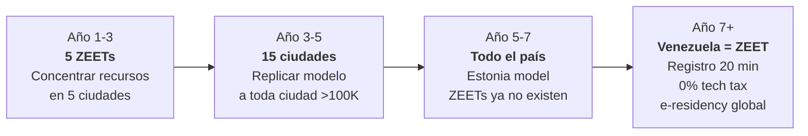
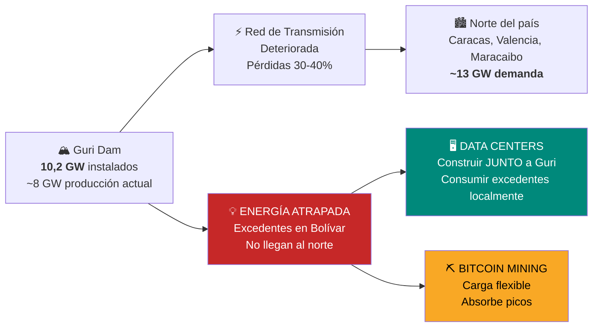
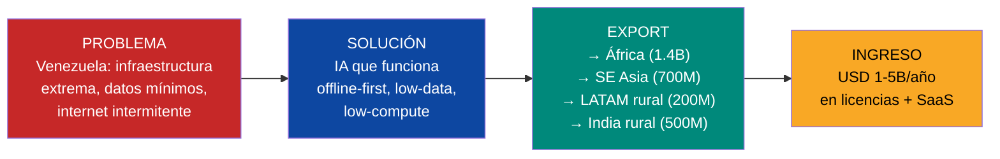

# De 5 Zonas Especiales a 1 País Startup-Friendly

:::tip En pocas palabras
Zonas del país donde las empresas de tecnología pagan cero impuestos por 10 años. La idea: atraer data centers, startups y empresas globales con la energía más barata del continente. Venezuela como el Singapur de América Latina.
:::

:::caution La crítica de Vélez (Nubank)
"5 ZEETs suena a zonas francas de los 90. Lo que funciona hoy es un PAÍS entero que sea startup-friendly. Estonia no tiene zonas especiales — TODO el país es una zona especial."

**La crítica es correcta.** Las zonas especiales crean dos Venezuelas: una con impuesto 0% y fibra, otra con burocracia y apagones. El destino es hacer **todo el país** una zona especial. Pero no puedes hacer eso en año 1 cuando el 40% no tiene internet estable.
:::

## Estrategia: ZEETs → País Completo

| Fase | Alcance | Qué pasa | Timeline |
|------|---------|----------|----------|
| **Fase 1: Concentrar** | 5 ZEETs (ciudades piloto) | Infraestructura, seguridad, fibra, Starlink concentrados. Demostrar que funciona | Años 1-3 |
| **Fase 2: Expandir** | 15 ciudades | Replicar el modelo ZEET a toda ciudad >100K habitantes. Beneficios fiscales se extienden | Años 3-5 |
| **Fase 3: Nacionalizar** | **Todo el país** | Impuesto 0% tech, registro en 20 min, visa fast-track, identidad digital — para TODO Venezuela. Las ZEETs dejan de existir porque ya no hacen falta | Años 5-7 |

**Meta año 7: las ZEETs desaparecen porque todo Venezuela es una ZEET.**

## El Boom Global de Data Centers: USD 1,7 TRILLONES para 2030

:::danger La ventana se cierra
Los hyperscalers (Amazon, Microsoft, Google, Meta) invertirán **USD 602B solo en 2026** — cada uno superando **USD 100B individualmente** — y el **75% es para infraestructura de IA**. Para 2030, el capex global en data centers alcanzará **USD 1,7 TRILLONES** ([Dell'Oro Group](https://www.delloro.com/), 2026). El cuello de botella no es capital ni chips — es **energía limpia y barata**. Quien tenga electricidad garantizada, barata y verde gana.
:::

### La crisis energética de los data centers

| Dato | Cifra | Fuente |
|------|-------|--------|
| Capex hyperscalers 2026 | **USD 602B** (+36% vs 2025) | [Dell'Oro Group](https://www.delloro.com/) |
| % de capex para IA | **75%** | [Bloomberg](https://www.bloomberg.com/) |
| Data centers como % de electricidad EE.UU. (2028) | **12-15%** (vs 4% en 2023) | [Morgan Stanley](https://www.morganstanley.com/) |
| Demanda de DC en EE.UU. para 2028 | **74 GW** — déficit de **49 GW** | [Morgan Stanley](https://www.morganstanley.com/) |
| Nueva generación necesaria para 2030 | **75-100 GW** | [Goldman Sachs](https://www.goldmansachs.com/) |
| Capacidad AI DC en LATAM 2026 | **443 MW** | [Requiere investigación] |
| Capacidad AI DC en LATAM 2031 | **1,6 GW** | [Requiere investigación] |
| Inversión Chile en DCs (a fin de 2026) | **>USD 4B** comprometidos | [Google Cloud](https://cloud.google.com/) |
| Rio AI City (Brasil) | Respaldado por Goldman Sachs | [Goldman Sachs](https://www.goldmansachs.com/) |

**Traducción:** El mundo necesita desesperadamente sitios con energía limpia, barata y abundante para data centers de IA. Las renovables crecen 22%/año pero cubren solo ~la mitad de la demanda nueva. Las empresas pagan **primas** por acceso garantizado a energía verde.

### Venezuela: el pitch de energía más competitivo del hemisferio

| Parámetro | Venezuela | Chile | Brasil | México | EE.UU. (Virginia) |
|-----------|-----------|-------|--------|--------|-------------------|
| **Costo eléctrico** | **<USD 0,02/kWh** | USD 0,05-0,08/kWh | USD 0,06-0,09/kWh | USD 0,07-0,10/kWh | USD 0,08-0,12/kWh |
| **Fuente principal** | Hidro (90%) | Solar + eólica | Hidro + solar | Gas + solar | Gas + nuclear |
| **Capacidad instalada** | **17 GW hidro** | ~8 GW renovable | 180 GW total | ~90 GW total | ~1.300 GW total |
| **Energía "atrapada"** | **Sí** — Bolívar tiene excedentes | No | No | No | No |
| **Latencia a Miami** | ~30 ms | ~150 ms | ~120 ms | ~40 ms | ~10 ms |
| **Riesgo país** | Alto (sanciones, transición) | Bajo | Bajo-medio | Medio | Mínimo |
| **Inversión comprometida en DCs** | USD 0 | **>USD 4B** | **>USD 5B** | **>USD 3B** | **>USD 50B** |

Fuentes: costos de electricidad — [Global Energy Monitor](https://globalenergymonitor.org/), [Americas Quarterly](https://www.americasquarterly.org/); capacidad instalada — [EIA](https://www.eia.gov/), [Mongabay](https://news.mongabay.com/2023/08/hydropower-in-the-pan-amazon-the-guri-complex-and-the-caroni-cascade/); inversiones DC — reportes corporativos 2025-2026.

### La verdad sobre Guri: acto de fe vs. due diligence

:::danger Crítica de [Andrés Parra Carrillo](https://www.linkedin.com/in/andresparracarrillo/)
*"Todo el plan se apoya en una cifra que hoy es un acto de fe. Decir que hay 10.2 GW instalados no significa que estén disponibles. Corpoelec tiene más de una década en un apagón informativo y las Big Tech no perdonan: ellos exigen un SLA de 99.99% de uptime antes de soltar un dólar."*
:::

**La crítica es correcta.** 10.2 GW es capacidad instalada, no capacidad disponible. Nadie sabe cuánto está realmente operativo — Corpoelec no publica datos desde ~2013. Un hyperscaler como AWS exige **99.99% uptime** (52 minutos de downtime/año). Venezuela tuvo un **apagón nacional de 5 días en 2019**. Eso no es ni 99%, mucho menos 99.99%.

**Ruta a SLA aceptable para Big Tech:**

| Paso | Qué se necesita | Costo | Timeline | Quién lo hace |
|------|----------------|-------|----------|---------------|
| 1. **Auditoría real de Guri** | Inspección independiente (no Corpoelec) por firma tipo Black & Veatch o Stantec | USD 5-10M | 3-6 meses | Firma internacional contratada por Venezuela S.A. |
| 2. **Reparación SCADA + turbinas** | Sistema de control + turbinas fuera de servicio. De 10.2 GW instalados, probablemente 6-7 GW operativos | USD 500M-1B | 12-24 meses | Alstom/GE/Voith (fabricantes originales) |
| 3. **Microgrid dedicada para DC campus** | Red eléctrica independiente: Guri → campus DC, sin pasar por la red nacional deteriorada | USD 200-500M | 12-18 meses | EPC + Venezuela S.A. como accionista |
| 4. **Backup gas + baterías** | Generadores a gas natural (abundante) + BESS para cubrir microsegundos de transición | USD 100-300M | 6-12 meses | Generadores: Wärtsilä/Caterpillar. BESS: Tesla/BYD |
| 5. **SLA contractual verificado** | 6 meses de operación demostrada antes de firmar con hyperscaler. Telemetría pública 24/7 | USD 0 (es tiempo) | 6 meses post-paso 3 | Monitoreo independiente |

**Resultado realista:** No se llega a 99.99% con la red nacional. Se llega a 99.99% con **una microgrid dedicada junto a Guri** que no depende de Corpoelec. La red nacional se repara en paralelo (USD 5-15B, 5+ años), pero el campus DC no la necesita.

### Pero Guri es solo el anzuelo

:::info Los 3 activos que el plan subestima — [Parra Carrillo](https://www.linkedin.com/in/andresparracarrillo/)
El Guri atrae la primera mirada. Pero los 3 activos que realmente importan son:

**1. 40M personas desconectadas = el mercado virgen más grande del continente.** Si el [FCV](/04-gobernanza/modelo-estado#fondo-ciudadano-venezuela-fcv-una-sola-cuenta-cero-burocracia) funciona como cuenta universal, estás haciendo el onboarding forzoso de todo un país al sistema financiero. Cualquier fintech mataría por una base de 40M usuarios cautivos que necesitan banca digital, pagos, seguros, crédito — todo desde cero. India lo hizo con [UPI](https://www.npci.org.in/what-we-do/upi/product-overview): 400M bancarizados en 5 años. Venezuela tiene la oportunidad de replicarlo.

**2. Venezuela = laboratorio extremo para IA que funcione con internet intermitente.** El 60% de la población mundial vive en países con infraestructura similar a Venezuela. Soluciones de IA que funcionen con conectividad intermitente, baja potencia de cómputo y datos limitados tienen un TAM de **3.000 millones de personas**. Quien resuelva IA offline-first en Venezuela tiene un producto exportable a África, Sudeste Asiático y el resto de LATAM. [Google Research](https://research.google/) ya invierte en esto — Venezuela puede ser el campo de pruebas.

**3. 7.9M venezolanos en los centros de poder del mundo = red de distribución que ninguna zona franca puede crear.** Hay venezolanos en Goldman Sachs, Google, McKinsey, Shell, hospitales de EE.UU., universidades europeas, startups en Chile y Colombia. Esa no es solo diáspora — es una **red de ventas, distribución y capital** lista para activarse. Ningún incentivo fiscal de zona franca puede fabricar eso.
:::

### "Energía atrapada": la oportunidad de arbitraje

Guri tiene **10,2 GW de capacidad instalada** (capacidad disponible real por determinar tras auditoría independiente) pero la red de transmisión no puede llevar toda esa energía al norte del país. Resultado: **excedentes localizados en Bolívar State** que literalmente no tienen a dónde ir.

**La solución:** en lugar de arreglar toda la red de transmisión (USD 5-15B, 5+ años), se **construyen data centers junto a Guri** y se consume la energía localmente. La red de transmisión se repara en paralelo, pero los data centers no esperan.

**Requisitos inmediatos:**
1. **Reparar SCADA** — sistema de control y supervisión de Guri (deteriorado)
2. **Interconexiones de alto voltaje** locales — de Guri al campus de data centers
3. **Fibra óptica** — tendido Bolívar → cable submarino (existente en la costa norte)
4. **Seguridad física** — zona perimetral 24/7 para el campus

### Corredor de Data Centers en Bolívar: proyección de ingresos

| Escenario | Capacidad | Inversión | Ingreso anual | Empleos directos | Timeline |
|-----------|-----------|-----------|---------------|-------------------|----------|
| **Piloto** | 50 MW | USD 300-500M | USD 150-250M | 200-500 | Años 1-3 |
| **Expansión** | 200 MW | USD 1-2B | USD 600M-1B | 1.000-2.000 | Años 3-5 |
| **Escala** | 500 MW-1 GW | USD 3-6B | USD 1,5-3B | 3.000-5.000 | Años 5-10 |

**Cálculo de referencia:** A USD 0,02/kWh, un data center de 100 MW gasta ~USD 17M/año en electricidad vs. ~USD 70-100M en EE.UU. Ese diferencial de **USD 50-80M/año por cada 100 MW** es el pitch a los hyperscalers.

:::tip Despliegue rápido: 6-18 meses con excedentes existentes
No hace falta esperar la reconstrucción completa de la red eléctrica. Los excedentes de Guri en Bolívar ya existen. Con reparación de SCADA + interconexiones locales + fibra, un data center piloto de **50 MW** puede estar operativo en **12-18 meses**. Eso pone a Venezuela en el mapa ANTES de que Chile y Brasil absorban toda la demanda LATAM.
:::

---

## Venezuela como Laboratorio de IA para el Mundo en Desarrollo

> El 60% de la población mundial vive en países con infraestructura similar a Venezuela. Quien resuelva IA en estas condiciones tiene un producto exportable a 3.000 millones de personas. — [Parra Carrillo](https://www.linkedin.com/in/andresparracarrillo/)

### El problema que nadie resuelve

Los modelos de IA de Silicon Valley asumen: internet de 100+ Mbps, GPUs en la nube, datos abundantes. Eso cubre al 40% del mundo. El otro 60% tiene:

| Condición | Venezuela | % de población mundial en condiciones similares |
|-----------|-----------|-----------------------------------------------|
| Internet < 5 Mbps o intermitente | ~60% de la población | **~3.500M personas** (África, SE Asia, LATAM rural) |
| Sin acceso a cloud computing | Mayoría del territorio | **~2.000M personas** |
| Electricidad inestable | Apagones frecuentes fuera de Caracas | **~1.500M personas** |
| Datos limitados / baja calidad | Sin registros digitales históricos | **~3.000M personas** |

### Verticales de IA offline-first exportables

| Vertical | Problema que resuelve | TAM global | Referencia |
|----------|----------------------|-----------|-----------|
| **IA diagnóstica offline** | Médicos rurales sin especialistas ni internet estable | USD 5-10B | [Google Health AI](https://health.google/) — ya invierte en diagnóstico offline para India/África |
| **EdTech offline** | Educación personalizada sin conexión permanente | USD 3-8B | [Kolibri (Learning Equality)](https://learningequality.org/) — plataforma educativa offline para escuelas sin internet |
| **Agro-IA con datos mínimos** | Optimizar cosechas con pocos sensores y datos históricos limitados | USD 2-5B | [PlantVillage](https://plantvillage.psu.edu/) — IA para diagnóstico de cultivos vía foto desde celular |
| **FinTech low-bandwidth** | Pagos, crédito y seguros en zonas sin 4G estable | USD 5-15B | [M-Pesa](https://www.vodafone.com/about-vodafone/what-we-do/consumer-products-and-services/m-pesa) funciona con SMS, sin internet |
| **GovTech para estados frágiles** | Identidad digital, registro civil, trámites sin infraestructura | USD 1-3B | [Simprints](https://www.simprints.com/) — biometría para países sin registro civil |

### Venezuela como campo de pruebas → exportador de soluciones

**La ventaja competitiva es la adversidad.** Las startups de Silicon Valley no pueden testear en estas condiciones — no las tienen. Venezuela sí. Cada solución que funcione en Venezuela funciona en el 60% del planeta.

### El binding constraint: talento ML

:::caution Hausmann (5/10): "¿Dónde están los ingenieros de ML?"
Venezuela necesita **500-1.000 ingenieros de ML** para que este vertical funcione. Estimación doméstica actual: **<50**. La diáspora aporta quizás 200-300 más. Eso deja un gap del 50-70% que aceleradoras no cierran en 3 años.
:::

| Fuente de talento | Cantidad estimada | Timeline | Mecanismo |
|---|---|---|---|
| **Diáspora tech** (ML/AI en Google, Meta, Amazon, etc.) | 200-300 | Año 1-3 | Programa de co-fundación con equity (ver [Retorno Diáspora](/03-ciudadanos/retorno-diaspora)) |
| **Reskilling intensivo** (ingenieros, matemáticos, físicos → ML) | 300-500 en 5 años | Año 1-5 | Bootcamps 6-12 meses financiados con voucher FCV Educación. Alianza con [Platzi](https://platzi.com/), [Holberton](https://www.holbertonschool.com/), universidades |
| **Talento extranjero** (fast-track visa tech) | 100-200 | Año 2-5 | Visa tech 30 días + salario competitivo + equity en startups. Modelo [Start-Up Chile](https://startupchile.org/) |
| **Partnerships corporativos** (secondments de Google/Meta/Microsoft Research) | 50-100 | Año 1-3 | Venezuela como campo de pruebas → corporativos envían investigadores a cambio de datos y acceso |
| **Total** | **650-1.100** en 5 años | | |

**Sin este talento, el vertical de IA offline-first no existe.** Es la inversión más importante después de la infraestructura física.

**Integración con ZEETs:** Las 5 ZEETs incluyen un vertical de "IA para mercados emergentes" con:
- Aceleradoras especializadas en offline-first AI
- Partnerships con Google Research, Meta AI, Microsoft Research (que ya invierten en esto)
- Acceso a Venezuela como campo de pruebas real (no simulado)
- Exportación vía la red de distribución de la diáspora (7.9M en 40+ países)
- **Pipeline de talento ML**: 500-1.000 ingenieros en 5 años vía diáspora + reskilling + extranjeros

---

## Fase 1: Las 5 Ciudades Piloto (Años 1-3)

| Zona | Ubicación | Vocación | Ventaja natural |
|------|----------|----------|----------------|
| Caracas Tech District | Caracas | IA, Fintech, SaaS | Capital + talento + conectividad existente |
| Guayana Digital | Ciudad Guayana | Data centers, cloud, IA training | Guri 10.200 MW — energía más barata del hemisferio |
| Maracaibo Energy Tech | Maracaibo | EnergyTech, IoT, H2 verde | Campos petroleros + sol para solar |
| Valencia Innovation Hub | Valencia | Hardware, robótica, manufactura | Infraestructura industrial existente |
| Margarita Digital Nomad | Isla de Margarita | Remote work, gaming, crypto | Caribe + zona franca existente |

### Infraestructura por ZEET (año 1)

| Componente | Solución | Costo por ZEET | Total 5 ZEETs |
|-----------|----------|---------------|--------------|
| **Internet** | Starlink Business (350+ Mbps) + fibra local | USD 1-3M | USD 5-15M |
| **Coworking** | 100-500 puestos, 24/7, aire acondicionado | USD 2-5M | USD 10-25M |
| **Energía** | Conexión prioritaria + backup solar + baterías | USD 3-5M | USD 15-25M |
| **Seguridad** | Zona segura 24/7, cámaras, policía reformada | USD 1-2M | USD 5-10M |
| **Total** | | | **USD 35-75M** |

:::info USD 35-75M para arrancar 5 hubs tech
Eso es **0.01% del plan total**. Si cada hub genera 1 startup exitosa que emplea 100 personas a USD 1.500/mes, el ROI es inmediato. Spotify no necesitó una zona franca en Suecia — pero Suecia ya tenía internet, seguridad y estado digital. Venezuela necesita concentrar eso primero.
:::

## Fase 3: Todo Venezuela = Estonia (Año 5-7)

Cuando las 5 ZEETs demuestren que funciona, los beneficios se expanden a todo el territorio nacional:

| Beneficio | En ZEET (año 1) | En todo el país (año 5-7) | Referencia |
|-----------|-----------------|---------------------------|-----------|
| **Impuesto 0% tech** por 10 años | Solo en 5 ZEETs | **Nacional** — cualquier startup tech, en cualquier ciudad | Estonia: 0% CIT en ganancias reinvertidas |
| **IVA 0% servicios digitales exportados** | Solo ZEETs | **Nacional** | Irlanda |
| **Registro empresa en 20 minutos** | Solo digital en ZEETs | **Nacional** — 100% online, desde el teléfono | [Estonia e-Residency](https://e-estonia.com/): 20 min |
| **Visa tech fast-track** (30 días) | Solo ZEETs | **Nacional** — cualquier extranjero tech | [Start-Up Chile](https://startupchile.org/en/) |
| **Crédito fiscal I+D 35%** | Solo ZEETs | **Nacional** | [CORFO Chile](https://www.corfo.cl): 35% |
| **e-Residency global** | No existe | **Cualquier persona del mundo** puede abrir empresa venezolana online sin pisar el país | [Estonia e-Residency](https://e-residency.gov.ee/): 100K+ e-residentes |

### e-Residency venezolana (año 5+)

Estonia tiene **100.000+ e-residentes** de 170 países que abren empresas estonias sin vivir ahí. Generan ~EUR 100M+ en actividad económica ([e-Residency](https://e-residency.gov.ee/)).

Venezuela con e-Residency + dolarización + 0% tech tax + energía barata podría atraer:

| Segmento | Por qué vendrían | Estimación |
|----------|-----------------|-----------|
| Nómadas digitales | USD 0 tax + Caribe + bajo costo de vida | 50.000-100.000 e-residentes (año 7) |
| Startups LATAM | Incorporación en 20 min + 0% CIT + acceso a mercado de 40M | 5.000-10.000 empresas |
| Freelancers globales | Facturación legal sin burocracia + cuentas en USD | 100.000+ |
| **Ingreso estimado** | Tasas de registro + actividad económica + consumo local | **USD 500M-2B/año** [Requiere investigación] |

:::tip El pitch para Vélez
"No estamos creando 5 zonas francas. Estamos creando 5 laboratorios para probar el modelo que luego se aplica a todo el país. En año 7, las ZEETs desaparecen porque ya no hacen falta — todo Venezuela es Estonia con playa, petróleo y la energía más barata del hemisferio."
:::
