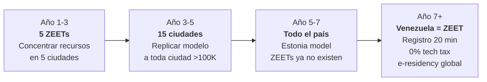

# De 5 Zonas Especiales a 1 País Startup-Friendly

:::caution La crítica de Vélez (Nubank)
"5 ZEETs suena a zonas francas de los 90. Lo que funciona hoy es un PAÍS entero que sea startup-friendly. Estonia no tiene zonas especiales — TODO el país es una zona especial."

**La crítica es correcta.** Las zonas especiales crean dos Venezuelas: una con impuesto 0% y fibra, otra con burocracia y apagones. El destino es hacer **todo el país** una zona especial. Pero no puedes hacer eso en año 1 cuando el 40% no tiene internet estable.
:::

## Estrategia: ZEETs → País Completo

| Fase | Alcance | Qué pasa | Timeline |
|------|---------|----------|----------|
| **Fase 1: Concentrar** | 5 ZEETs (ciudades piloto) | Infraestructura, seguridad, fibra, Starlink concentrados. Demostrar que funciona | Años 1-3 |
| **Fase 2: Expandir** | 15 ciudades | Replicar el modelo ZEET a toda ciudad >100K habitantes. Beneficios fiscales se extienden | Años 3-5 |
| **Fase 3: Nacionalizar** | **Todo el país** | Impuesto 0% tech, registro en 20 min, visa fast-track, identidad digital — para TODO Venezuela. Las ZEETs dejan de existir porque ya no hacen falta | Años 5-7 |

**Meta año 7: las ZEETs desaparecen porque todo Venezuela es una ZEET.**

## Fase 1: Las 5 Ciudades Piloto (Años 1-3)

| Zona | Ubicación | Vocación | Ventaja natural |
|------|----------|----------|----------------|
| Caracas Tech District | Caracas | IA, Fintech, SaaS | Capital + talento + conectividad existente |
| Guayana Digital | Ciudad Guayana | Data centers, cloud, IA training | Guri 10.200 MW — energía más barata del hemisferio |
| Maracaibo Energy Tech | Maracaibo | EnergyTech, IoT, H2 verde | Campos petroleros + sol para solar |
| Valencia Innovation Hub | Valencia | Hardware, robótica, manufactura | Infraestructura industrial existente |
| Margarita Digital Nomad | Isla de Margarita | Remote work, gaming, crypto | Caribe + zona franca existente |

### Infraestructura por ZEET (año 1)

| Componente | Solución | Costo por ZEET | Total 5 ZEETs |
|-----------|----------|---------------|--------------|
| **Internet** | Starlink Business (350+ Mbps) + fibra local | USD 1-3M | USD 5-15M |
| **Coworking** | 100-500 puestos, 24/7, aire acondicionado | USD 2-5M | USD 10-25M |
| **Energía** | Conexión prioritaria + backup solar + baterías | USD 3-5M | USD 15-25M |
| **Seguridad** | Zona segura 24/7, cámaras, policía reformada | USD 1-2M | USD 5-10M |
| **Total** | | | **USD 35-75M** |

:::info USD 35-75M para arrancar 5 hubs tech
Eso es **0.01% del plan total**. Si cada hub genera 1 startup exitosa que emplea 100 personas a USD 1.500/mes, el ROI es inmediato. Spotify no necesitó una zona franca en Suecia — pero Suecia ya tenía internet, seguridad y estado digital. Venezuela necesita concentrar eso primero.
:::

## Fase 3: Todo Venezuela = Estonia (Año 5-7)

Cuando las 5 ZEETs demuestren que funciona, los beneficios se expanden a todo el territorio nacional:

| Beneficio | En ZEET (año 1) | En todo el país (año 5-7) | Referencia |
|-----------|-----------------|---------------------------|-----------|
| **Impuesto 0% tech** por 10 años | Solo en 5 ZEETs | **Nacional** — cualquier startup tech, en cualquier ciudad | Estonia: 0% CIT en ganancias reinvertidas |
| **IVA 0% servicios digitales exportados** | Solo ZEETs | **Nacional** | Irlanda |
| **Registro empresa en 20 minutos** | Solo digital en ZEETs | **Nacional** — 100% online, desde el teléfono | [Estonia e-Residency](https://e-estonia.com/): 20 min |
| **Visa tech fast-track** (30 días) | Solo ZEETs | **Nacional** — cualquier extranjero tech | [Start-Up Chile](https://startupchile.org/en/) |
| **Crédito fiscal I+D 35%** | Solo ZEETs | **Nacional** | [CORFO Chile](https://www.corfo.cl): 35% |
| **e-Residency global** | No existe | **Cualquier persona del mundo** puede abrir empresa venezolana online sin pisar el país | [Estonia e-Residency](https://e-residency.gov.ee/): 100K+ e-residentes |

### e-Residency venezolana (año 5+)

Estonia tiene **100.000+ e-residentes** de 170 países que abren empresas estonias sin vivir ahí. Generan ~EUR 100M+ en actividad económica ([e-Residency](https://e-residency.gov.ee/)).

Venezuela con e-Residency + dolarización + 0% tech tax + energía barata podría atraer:

| Segmento | Por qué vendrían | Estimación |
|----------|-----------------|-----------|
| Nómadas digitales | USD 0 tax + Caribe + bajo costo de vida | 50.000-100.000 e-residentes (año 7) |
| Startups LATAM | Incorporación en 20 min + 0% CIT + acceso a mercado de 40M | 5.000-10.000 empresas |
| Freelancers globales | Facturación legal sin burocracia + cuentas en USD | 100.000+ |
| **Ingreso estimado** | Tasas de registro + actividad económica + consumo local | **USD 500M-2B/año** [Requiere investigación] |

:::tip El pitch para Vélez
"No estamos creando 5 zonas francas. Estamos creando 5 laboratorios para probar el modelo que luego se aplica a todo el país. En año 7, las ZEETs desaparecen porque ya no hacen falta — todo Venezuela es Estonia con playa, petróleo y la energía más barata del hemisferio."
:::
