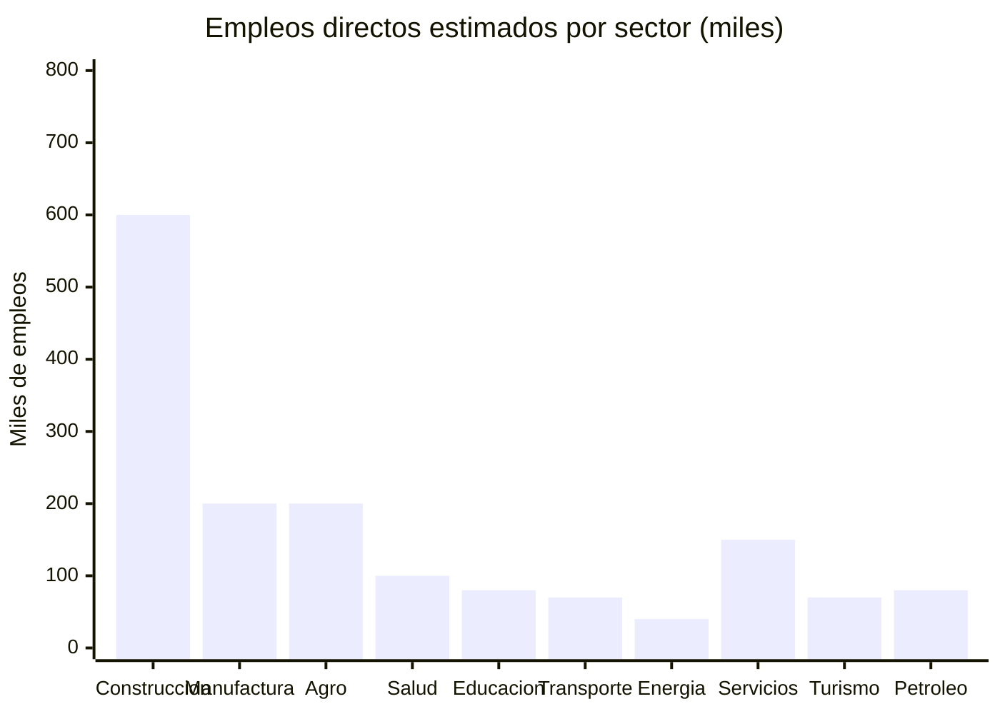
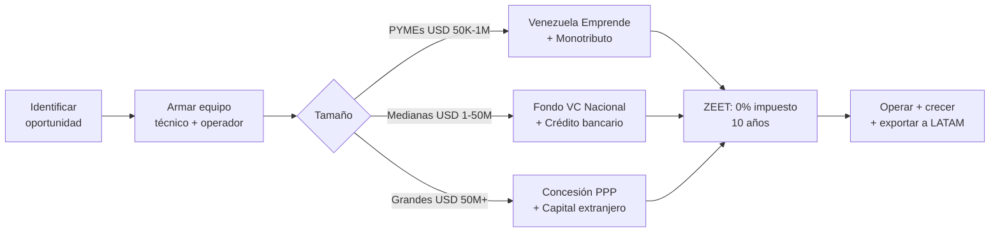

# Oportunidades para Empresas Reales: El País Físico que Hay que Construir

> Las startups crean apps. Las empresas reales construyen puentes, operan hospitales, fabrican bloques, reparan turbinas, procesan cacao y mueven contenedores. Venezuela necesita ambas — pero las empresas físicas absorben el 80% de la inversión y generan el 90% del empleo.

:::info Por qué este documento
El plan invierte USD 550-750B en 15 años. De eso, USD 400-500B van a empresas físicas: constructoras, operadores de concesiones, fabricantes, distribuidoras, empresas de servicios. Este documento mapea esas oportunidades por sector, con tamaño de mercado, modelo de negocio y perfil de empresa.
:::

---

## 1. Construcción e Ingeniería — USD 80-120B en Contratos

El plan necesita construir **todo**: carreteras, hospitales, viviendas, plantas de agua, puertos, aeropuertos, líneas de transmisión, data centers, escuelas, cárceles, cuarteles, represas, plantas solares.

### Oportunidades por tipo de obra

| Oportunidad | Inversión del plan | Tipo de empresa | Empleos directos est. | Modelo/Referencia |
|-------------|-------------------|----------------|---------------------|-------------------|
| **Vivienda social y clase media** | USD 15-30B / 15 años | Constructoras medianas, prefabricadoras | 200K-400K | Chile DS49: subsidio + constructor privado |
| **Carreteras y puentes** | USD 5-10B / 15 años | Constructoras de infraestructura pesada | 50K-100K | Colombia 4G/5G: concesiones PPP |
| **Puertos (Puerto Cabello, La Guaira, Maracaibo)** | USD 2-4B / 10 años | Operadores portuarios + obra civil | 15K-30K | DP World, APM Terminals como socios |
| **Aeropuertos** | USD 1-3B / 10 años | Concesionarios aeroportuarios + constructoras | 10K-20K | Grupo Aeroportuario del Pacífico (México) |
| **Red ferroviaria (Caracas-Valencia-Barquisimeto)** | USD 5-10B / 15 años | Consorcio de ingeniería pesada | 30K-60K | Metro de Medellín como modelo de gobernanza |
| **Plantas de agua y saneamiento** | USD 5-9B / 7 años | Empresas de ingeniería hidráulica | 30K-50K | Acueducto de Bogotá, modelo Israel |
| **Hospitales y centros de salud** | USD 3-5B / 10 años | Constructoras especializadas en salud | 20K-40K | Hospital turnkey + mantenimiento 20 años |
| **Escuelas y universidades** | USD 2-4B / 10 años | Constructoras + mobiliario + equipamiento | 15K-30K | FISE Colombia (Fondo Infraestructura Social) |
| **Líneas de transmisión eléctrica** | USD 2-4B / 10 años | Empresas de ingeniería eléctrica | 10K-20K | ISA (Colombia), empresa de transmisión LATAM |
| **Plantas solares y eólicas** | USD 3-8B / 15 años | Desarrolladores de energía renovable | 15K-30K | Enel Green Power, Atlas Renewable Energy |
| **Data centers (ZEET Guayana)** | USD 2-5B / 10 años | Constructoras especializadas + cooling | 5K-10K | Equinix, Digital Realty como socios |

**Total empleo directo en construcción:** 400K-800K puestos de trabajo durante 15 años.

:::tip La constructora que Venezuela necesita
No existe una constructora venezolana de escala. Las que había quebraron o emigraron. **Oportunidad:** fundar 10-20 constructoras medianas especializadas (vivienda, infraestructura pesada, hospitalaria, energética) que compitan por los USD 80-120B en contratos. Con experiencia venezolana en diáspora (hay miles de ingenieros en Chile, Panamá, Colombia) + capital de Venezuela Emprende + contratos garantizados del plan = empresas de USD 100-500M en 5-10 años.
:::

---

## 2. Manufactura e Industria — Producir lo que se Importa

Venezuela importa >70% de lo que consume. Cada producto importado es una oportunidad de manufactura local con energía barata y mercado cautivo.

### Oportunidades de sustitución de importaciones + exportación

| Oportunidad | Demanda interna | Inversión necesaria | Empleos | Ventaja competitiva |
|-------------|----------------|--------------------|---------|--------------------|
| **Bloques, cemento, materiales de construcción** | USD 2-4B/año (boom de vivienda y obras) | USD 200-500M por planta | 20K-40K | Energía barata + demanda garantizada 15 años |
| **Muebles y carpintería industrial** | USD 500M-1B/año (hogares + oficinas + escuelas) | USD 50-200M | 15K-30K | Maderas tropicales + diseño + mano de obra |
| **Tubería PVC, accesorios sanitarios** | USD 300-600M/año (redes de agua y saneamiento) | USD 100-300M | 5K-10K | Petroquímica local como insumo |
| **Cable eléctrico y transformadores** | USD 500M-1B/año (red eléctrica completa) | USD 200-400M | 10K-20K | Aluminio + cobre local |
| **Fertilizantes y agroquímicos** | USD 300-500M/año | USD 500M-1B (planta petroquímica) | 5K-10K | Gas natural como materia prima |
| **Alimentos procesados** | USD 3-5B/año | USD 500M-2B en plantas | 50K-100K | Materia prima agrícola local |
| **Plásticos y envases** | USD 500M-1B/año | USD 200-500M | 10K-15K | Petroquímica downstream |
| **Textiles y uniformes** | USD 300-600M/año (uniformes escolares, laborales, militares) | USD 100-300M | 20K-40K | Mano de obra + algodón |
| **Medicamentos genéricos** | USD 1-2B/año | USD 300-800M en laboratorios | 10K-20K | [Modelo India](https://www.ibef.org/industry/pharmaceutical-india): genéricos para LATAM |
| **Ensamblaje de equipos solares** | USD 200-500M/año | USD 100-300M | 5K-10K | ZEET + energía barata + mercado cautivo |

**Meta:** Reducir importaciones de 70% a 40% en 10 años, liberando USD 5-10B/año en divisas.

---

## 3. Petróleo, Gas y Minería — La Cadena de Proveedores

El plan invierte USD 183B en producción petrolera (Rystad). Cada barril extraído requiere servicios, equipos, logística y personal que hoy se importa casi en su totalidad.

### Oportunidades en la cadena petrolera

| Oportunidad | Mercado est. | Tipo de empresa | Referencia |
|-------------|-------------|----------------|-----------|
| **Mantenimiento de pozos y workover** | USD 2-4B/año | Empresa de servicios petroleros | Schlumberger, Halliburton (versión local) |
| **Transporte y logística petrolera** | USD 1-2B/año | Flota de camiones cisterna + barcazas | PDVSA hoy lo hace todo internamente — concesionar |
| **Catering y hotelería para campos** | USD 500M-1B/año | Empresa de hospitality industrial | Compass Group, Sodexo (pero venezolana) |
| **Fabricación de válvulas y accesorios** | USD 300-600M/año | Metalmecánica especializada | Reemplazar importaciones de EE.UU./China |
| **Inspección, ensayos no destructivos** | USD 200-400M/año | Empresa de inspección técnica | Bureau Veritas, SGS (versión nacional) |
| **Perforación direccional** | USD 1-2B/año | Empresa de perforación especializada | Baker Hughes como socio tecnológico |
| **Tratamiento de agua de producción** | USD 300-600M/año | Empresa ambiental/ingeniería | Veolia, Suez (licencia o JV) |
| **Seguridad industrial y HSE** | USD 200-400M/año | Consultora + proveedor de EPP | DuPont Safety, MSA como proveedores |

### Oportunidades en minería

| Oportunidad | Mercado est. | Tipo de empresa |
|-------------|-------------|----------------|
| **Procesamiento de oro (refinerías)** | USD 500M-1B/año | Refinería certificada LBMA |
| **Planta de procesamiento de hierro/acero** | USD 1-3B (inversión) | Siderúrgica moderna (reemplazar SIDOR) |
| **Procesamiento de bauxita/aluminio** | USD 500M-1B (inversión) | Planta de alúmina (reactivar CVG/Alcasa) |
| **Servicios de explosivos para minería** | USD 100-200M/año | Fabricante + proveedor autorizado |
| **Laboratorios de análisis de minerales** | USD 50-100M/año | Laboratorio certificado internacional |

---

## 4. Agroindustria y Alimentos — De Importador a Exportador

Venezuela tiene Los Llanos (una de las llanuras fértiles más extensas de Sudamérica), el Delta del Orinoco para acuicultura, y cacao premium que es el mejor del mundo. Importa >70% de alimentos.

### Oportunidades agroindustriales

| Oportunidad | Inversión | Mercado | Empleos | Modelo |
|-------------|-----------|---------|---------|--------|
| **Plantas de procesamiento de cacao** | USD 100-300M | Exportación premium USD 200-500M/año | 10K-20K | [Barry Callebaut](https://www.barry-callebaut.com/) + cooperativas locales |
| **Torrefactoras de café premium** | USD 50-150M | Exportación specialty USD 100-300M/año | 5K-10K | Colombia FNC como modelo de marca país |
| **Procesadoras de arroz y maíz** | USD 200-500M | Mercado interno USD 1-2B/año | 15K-30K | Brasil EMBRAPA + empresas privadas |
| **Plantas de camarón (acuicultura)** | USD 300-600M | Exportación USD 500M-1B/año | 20K-40K | Ecuador: USD 7B/año en camarón exportado |
| **Plantas frigoríficas y mataderos** | USD 200-400M | Mercado interno USD 500M-1B/año | 10K-20K | Uruguay: cadena de frío = calidad exportable |
| **Producción de lácteos** | USD 200-500M | Mercado interno USD 500M-1B/año | 10K-20K | Alpina (Colombia), Gloria (Perú) |
| **Cervecerías artesanales e industriales** | USD 100-300M | Mercado interno USD 300-600M/año | 5K-10K | AB InBev controla 80% hoy; espacio para competencia |
| **Frutas tropicales procesadas** | USD 100-300M | Exportación USD 200-500M/año | 10K-20K | Mangos, guayabas, papayas → jugo, pulpa, deshidratado |
| **Aceite de palma y oleaginosas** | USD 200-400M | Sustitución importaciones USD 300-500M/año | 8K-15K | Malasia como referencia, Venezuela tiene el clima |
| **Panaderías y alimentos preparados (escala)** | USD 100-200M | Mercado interno masivo | 30K-50K | Bimbo (México) empezó así |

:::tip Cacao: la oportunidad de USD 1B
Venezuela produce el [40% del cacao fino del mundo](https://www.icco.org/). Hoy exporta grano crudo a USD 3-5/kg. Procesado como chocolate premium: USD 50-100/kg. **Empresa necesaria:** planta de procesamiento bean-to-bar + marca "Cacao de Venezuela" + certificación de origen + canal D2C y retail. Inversión: USD 50-100M. Revenue potencial: USD 300-500M/año. **Empleos:** 10K directos (productores + planta + comercialización). [Tony's Chocolonely](https://tonyschocolonely.com/) (EUR 300M) y [Pacari](https://www.pacari.com/) (Ecuador) demostraron el modelo.
:::

---

## 5. Salud — Clínicas, Laboratorios, Farmacias

El plan invierte USD 15-25B en salud. Más allá de la tech, se necesitan empresas de salud físicas.

| Oportunidad | Inversión | Mercado | Empleos | Modelo |
|-------------|-----------|---------|---------|--------|
| **Cadena de clínicas de atención primaria** | USD 200-500M | 32M de pacientes con acceso limitado | 20K-40K | Narayana Health (India): salud de calidad a bajo costo |
| **Laboratorios clínicos en red** | USD 100-300M | USD 500M-1B/año en análisis | 5K-10K | SYNLAB (Europa): red de labs estandarizados |
| **Cadena de farmacias moderna** | USD 200-500M | USD 1-2B/año | 15K-30K | Farmatodo ya existe; competencia modernizada |
| **Centros de diálisis** | USD 100-200M | 30K+ pacientes renales sin acceso | 3K-5K | DaVita/Fresenius como socio operador |
| **Manufactura de dispositivos médicos básicos** | USD 100-300M | Sustitución importaciones USD 300-500M/año | 5K-10K | Mascarillas, jeringas, suturas, material descartable |
| **Centros de rehabilitación** | USD 50-150M | Post-conflicto: 100K+ personas necesitan rehabilitación | 3K-5K | Colombia post-acuerdo como referencia |
| **Ambulancias como servicio** | USD 50-100M | Cobertura nacional inexistente | 5K-10K | Flota + centro de despacho + paramédicos |
| **Ópticas y oftalmología popular** | USD 50-100M | 40M de personas sin acceso a lentes | 3K-5K | Lenstec (India): lentes a USD 2 |
| **Centros odontológicos de volumen** | USD 50-150M | Décadas de atención dental postergada | 5K-10K | Aspen Dental (EE.UU.): red de franquicias |

**Caso de referencia:** [Narayana Health (India)](https://www.narayanahealth.org/) — cirugías cardíacas a USD 1.500 (vs. USD 100.000 en EE.UU.). Modelo: volumen + eficiencia + calidad. Venezuela necesita exactamente esto.

---

## 6. Educación — Escuelas, Academias, Institutos

Más allá del EdTech, Venezuela necesita infraestructura educativa física y operadores.

| Oportunidad | Inversión | Mercado | Empleos | Modelo |
|-------------|-----------|---------|---------|--------|
| **Red de academias de inglés** | USD 50-200M | 30M+ necesitan inglés; obligatorio desde grado 1 | 10K-20K (profesores + admin) | British Council + franquicias locales |
| **Cadena de colegios accesibles** | USD 200-500M | 8M de estudiantes K-12 | 30K-50K | Innova Schools (Perú): escuelas de calidad a USD 100-150/mes |
| **Centros de formación técnica** | USD 100-300M | 500K/año necesitan certificarse | 10K-20K | SENAI (Brasil): formación técnica de clase mundial |
| **Guarderías y preescolar** | USD 100-200M | Habilitador de empleo femenino | 15K-25K | KinderCare (EE.UU.) adaptado |
| **Centros de idiomas diversos** | USD 30-80M | Portugués, mandarín, francés para comercio | 3K-5K | Alianzas con Goethe, Confucio, AF |
| **Autoescuelas modernizadas** | USD 20-50M | Millones sin licencia vigente | 3K-5K | Simuladores + flota + certificación digital |
| **Escuelas de oficios** | USD 50-150M | Plomería, electricidad, soldadura, HVAC, mecánica | 10K-20K | Mike Rowe Works (EE.UU.): dignificar los oficios |

:::tip Academias de inglés: negocio inmediato con impacto masivo
El plan hace inglés obligatorio desde grado 1. El sistema educativo no tiene profesores suficientes. **Oportunidad:** red de 500+ academias de inglés (modelo franquicia), con profesores certificados como socios-operadores que ganan por alumno. A USD 30-50/mes × 500K estudiantes = USD 180-300M/año. **Socios:** los 5.000+ profesores de inglés del país como franquiciatarios. Escala: centros físicos + app complementaria para práctica.
:::

---

## 7. Transporte y Logística — Mover 40 Millones de Personas y Mercancías

| Oportunidad | Inversión | Mercado | Empleos | Modelo |
|-------------|-----------|---------|---------|--------|
| **Empresa de autobuses interurbanos** | USD 100-300M | 30M+ sin transporte interurbano eficiente | 10K-20K | Pullman Bus (Chile), Cruz del Sur (Perú) |
| **Flota de camiones de carga** | USD 200-500M | USD 2-5B/año en flete interno | 20K-40K | Mercado fragmentado → consolidar con flota moderna |
| **Operador de ferrocarril** | USD 50-200M (operación, no obra civil) | Corredor Caracas-Valencia (fase 1) | 5K-10K | Concesión tipo Ferrovias (Portugal) |
| **Empresa de mudanzas y almacenamiento** | USD 20-50M | Retornados + nueva vivienda = demanda masiva | 3K-5K | PODS (EE.UU.): contenedores portátiles |
| **Courier y paquetería** | USD 50-150M | E-commerce naciente necesita logística | 10K-20K | Mercado Envíos (MELI), 99Minutos |
| **Taller de reparación de maquinaria pesada** | USD 30-80M | Concesionarios + minería + petróleo | 3K-5K | Caterpillar dealers como modelo |
| **Marina y servicios náuticos** | USD 30-100M | Turismo + pesca + petróleo offshore | 2K-5K | 2.800 km de costa, marinas inexistentes |

---

## 8. Energía — Operar la Infraestructura

| Oportunidad | Inversión | Mercado | Empleos | Modelo |
|-------------|-----------|---------|---------|--------|
| **Empresa de mantenimiento eléctrico** | USD 50-200M | Red de transmisión y distribución nacional | 10K-20K | ISA (Colombia): mantenimiento de red |
| **Instalador de paneles solares** | USD 20-100M | 8M+ hogares + comercios + industria | 10K-20K | SunRun (EE.UU.): instalar + financiar |
| **Empresa de generación distribuida** | USD 100-300M | Micro-redes para comunidades sin red | 3K-5K | Husk Power (India): micro-redes rurales |
| **Operador de estaciones de servicio** | USD 100-300M | Reformar las 1.600+ estaciones existentes | 5K-10K | Concesión + minimarkets + servicios |
| **Distribuidora de gas doméstico** | USD 50-150M | Sustitución de leña en zonas rurales | 5K-8K | Modelo Brasil: última milla de GLP |
| **Empresa de eficiencia energética** | USD 30-80M | Auditorías + retrofitting para industria | 3K-5K | Schneider Electric como socio tecnológico |

---

## 9. Servicios Profesionales — El Ecosistema de Soporte

Cada empresa nueva necesita contadores, abogados, aseguradoras, banqueros, consultores. El boom económico multiplica la demanda de servicios profesionales.

| Oportunidad | Mercado est. | Empleos | Perfil |
|-------------|-------------|---------|--------|
| **Firmas de contabilidad y auditoría** | USD 300-600M/año | 10K-20K | Régimen fiscal nuevo = todo el mundo necesita contador |
| **Bufetes especializados** (corporativo, ICSID, sanciones) | USD 200-400M/año | 5K-10K | Reestructuración + inversión extranjera + OFAC |
| **Empresas de reclutamiento y headhunting** | USD 100-200M/año | 3K-5K | 500K+ vacantes/año por boom económico |
| **Aseguradoras** | USD 1-3B/año | 10K-20K | Penetración actual <1% vs. LATAM 3-5% |
| **Empresas de seguridad privada** | USD 500M-1B/año | 50K-100K | Transición: demanda enorme durante 5-10 años |
| **Agencias inmobiliarias y property management** | USD 300-600M/año | 10K-15K | Boom de vivienda + titulación + inversión |
| **Empresas de limpieza y facilities management** | USD 200-500M/año | 30K-50K | Cada edificio nuevo necesita operación |
| **Catering industrial y comedores** | USD 300-600M/año | 20K-40K | Campos petroleros + minas + ZEETs + hospitales |
| **Agencias de publicidad y marketing** | USD 100-300M/año | 5K-10K | Marcas nuevas + turismo + marca país |
| **Consultoría de gestión** | USD 200-400M/año | 3K-5K | Concesionarios + gobierno + inversión extranjera |

---

## 10. Turismo — El Caribe que el Mundo No Conoce

| Oportunidad | Inversión | Mercado | Empleos | Ubicación |
|-------------|-----------|---------|---------|-----------|
| **Cadena de posadas y eco-lodges** | USD 200-500M | 5-10M turistas/año meta | 20K-40K | Los Roques, Canaima, Mérida, Morrocoy, Delta |
| **Hoteles boutique** | USD 100-300M | Turismo premium y negocios | 5K-10K | Caracas, Margarita, Mérida |
| **Restaurantes de alta cocina venezolana** | USD 50-150M | Gastronomía como destino | 10K-20K | Modelo Perú: 3 restaurantes en World's 50 Best → boom |
| **Operadores de tours de aventura** | USD 30-80M | Salto Ángel, tepuyes, rafting, kitesurf | 5K-10K | [Intrepid Travel](https://www.intrepidtravel.com/) como referencia |
| **Escuelas de deportes acuáticos** | USD 10-30M | Kitesurf, surf, buceo, snorkel | 2K-5K | Margarita, Los Roques, Tucacas |
| **Transporte turístico** (lanchas, vuelos internos, buses) | USD 50-150M | Conectar destinos dispersos | 5K-10K | Flota de lanchas rápidas + aerolínea regional |
| **Centros de convenciones** | USD 100-200M | Turismo de negocios + congresos | 3K-5K | Caracas + Margarita |

---

## Empleo Total Estimado por Sector

| Sector | Empleos directos | Empleos indirectos (est. 2x) | Total |
|--------|-----------------|-----------------------------:|------:|
| Construcción e ingeniería | 400K-800K | 800K-1.6M | **1.2-2.4M** |
| Manufactura | 150K-300K | 300K-600K | **450K-900K** |
| Agroindustria | 120K-250K | 240K-500K | **360K-750K** |
| Salud | 60K-120K | 120K-240K | **180K-360K** |
| Educación | 60K-120K | 60K-120K | **120K-240K** |
| Transporte y logística | 50K-100K | 100K-200K | **150K-300K** |
| Energía | 30K-60K | 60K-120K | **90K-180K** |
| Servicios profesionales | 100K-200K | 100K-200K | **200K-400K** |
| Turismo | 50K-100K | 100K-200K | **150K-300K** |
| Cadena petrolera | 50K-100K | 100K-200K | **150K-300K** |
| **TOTAL** | **1.1-2.2M** | **2-4M** | **3-6M** |

:::info 3-6 millones de empleos directos e indirectos
Con 32M de residentes, desempleo efectivo >40% y subempleo masivo, generar 3-6M de empleos formales transforma el mercado laboral. Esto no incluye los trabajos informales que se formalizan (meta: 1M de micronegocios).
:::

---

## Cómo Participar

:::tip Para empresarios y profesionales
1. **Identifica tu sector** — ¿construyes, produces, operas o sirves?
2. **Arma equipo** — técnico con experiencia (diáspora o extranjero) + operador local que conoce el terreno
3. **Aplica al programa correcto** — [Venezuela Emprende](/05-transformacion/startup-programs) para PYMEs, concesiones PPP para empresas grandes
4. **Ubícate en una [ZEET](/05-transformacion/hubs-tech)** — 0% impuesto por 10 años
5. **Piensa en escala** — empieza en Venezuela, pero diseña para exportar el modelo a LATAM
:::

---

**Ver también:** [Oportunidades Tech](/05-transformacion/oportunidades-negocio) · [Programas de Startups](/05-transformacion/startup-programs) · [Diversificación Económica](/05-transformacion/diversificacion) · [Infraestructura Básica](/06-realidad/infraestructura-basica) · [Capital Humano](/05-transformacion/capital-humano)
