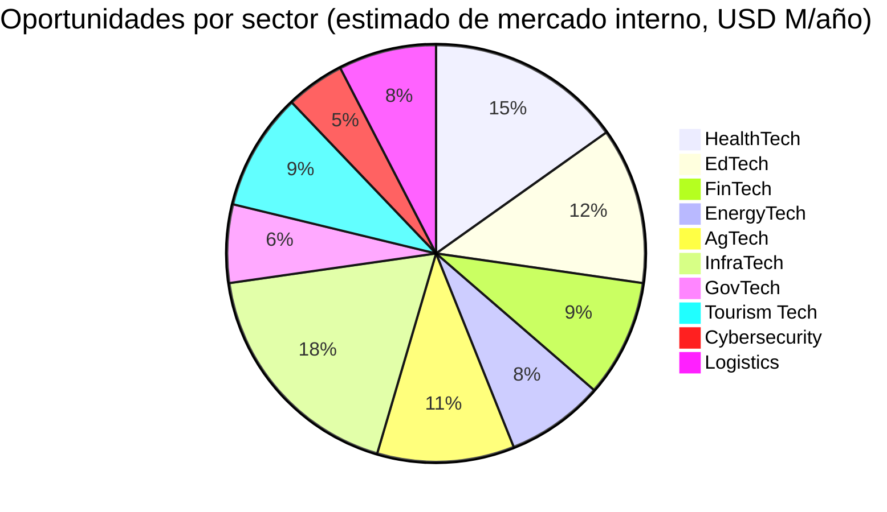
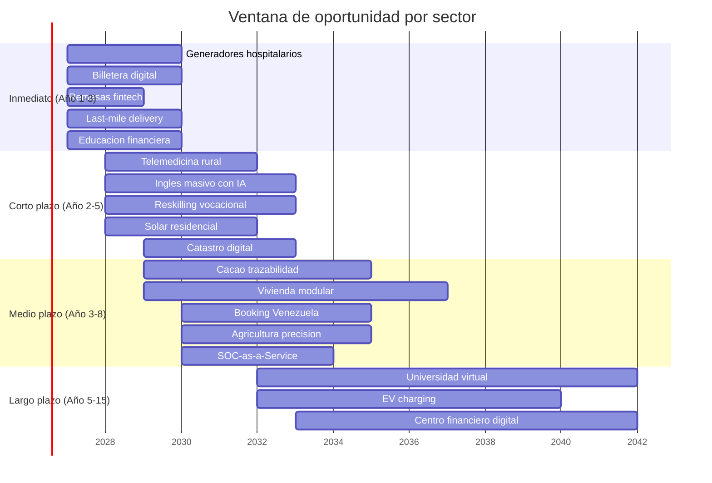

# Oportunidades Tech: 70+ Startups que Venezuela Necesita

> Cada problema del plan es un negocio. Cada brecha es un mercado. Estas no son ideas — son necesidades cuantificadas con mercado cautivo interno y potencial de exportación a LATAM y global.

:::info Lógica de este documento
El plan invierte USD 550-750B en 15 años. Cada dólar invertido crea cadenas de valor donde startups y PYMEs capturan 30-60% del gasto como proveedores, operadores o innovadores. Este documento mapea esas oportunidades concretas, sector por sector.
:::

## Modelo: Socios + Tecnología + Mercado Global

La ventaja de Venezuela no es solo energía barata. Es la combinación de:

1. **Mercado cautivo de 40M personas** que necesita todo — desde generadores hasta apps de salud
2. **Energía a costo marginal** (Guri + solar) que reduce OpEx de cualquier operación digital
3. **7.9M de diáspora** con experiencia en mercados globales que puede co-fundar
4. **Español como idioma** — acceso directo a 500M de hispanohablantes
5. **Programas de aceleración** ([Venezuela Emprende](/05-transformacion/startup-programs)) con USD 10-250K por startup

**Modelo de asociación:** Cada oportunidad identifica socios naturales — educadores, médicos, ingenieros, comunidades — que aportan conocimiento de dominio. La startup aporta tecnología. El plan aporta mercado.

---

## 1. HealthTech — Salud como Plataforma

**Contexto:** Venezuela tiene [1.2 médicos/1.000 hab](https://data.worldbank.org/indicator/SH.MED.PHYS.ZS?locations=VE) (OECD: 3.7). El 65% de los hospitales tienen equipos inoperativos. El plan invierte USD 15-25B en salud.

### Oportunidades específicas

| Oportunidad | Modelo | Mercado interno | Exportación LATAM | Socios naturales |
|-------------|--------|----------------|-------------------|-----------------|
| **Telemedicina rural** | SaaS — consulta remota con IA de triaje | 12M personas sin acceso a especialistas | 150M rurales en LATAM | Médicos venezolanos en diáspora + enfermeras locales |
| **Mantenimiento de generadores hospitalarios** | Service-as-a-Service — monitoreo IoT + mantenimiento preventivo | 300+ hospitales, 2.000+ generadores | Hospitales en todo el Caribe y Centroamérica | Técnicos electromecánicos + ingenieros de la diáspora |
| **Farmacia digital + delivery** | Marketplace + logística última milla | 32M personas, mercado fragmentado | Venezuela + Colombia + Ecuador | Farmacias existentes como puntos de distribución |
| **IA diagnóstica por imagen** | Rayos X / ecografías analizadas por IA en centros rurales | Ahorra 80% de traslados a ciudad | Toda LATAM rural (200M personas) | Radiólogos como entrenadores del modelo |
| **Historia clínica digital** | Plataforma interoperable para el sistema público | 40M de registros, obligatorio por ley | Estándar para LATAM (ningún país lo tiene completo) | Ministerio de Salud + hospitales privados |
| **Salud mental digital** | App de terapia con psicólogos LATAM + IA de seguimiento | 5M+ con PTSD/depresión post-crisis | 100M de hispanohablantes con acceso limitado | Psicólogos venezolanos (muchos en diáspora) |
| **Supply chain farmacéutico** | Blockchain para trazabilidad de medicamentos | Elimina falsificación (30%+ del mercado) | Problema endémico en toda LATAM | Distribuidoras + farmacias |
| **Equipamiento médico remanufacturado** | Importar equipos usados de EE.UU./Europa, remanufacturar localmente | 300+ hospitales necesitan todo | Exportar a Caribe + Centroamérica | Ingenieros biomédicos + técnicos |

**Caso de referencia:** [mDoc (Nigeria)](https://www.mdoc.ng/) — telemedicina en país con crisis sanitaria similar. Series A USD 3M. [Doctolib (Francia)](https://www.doctolib.fr/) — citas médicas digitales, valuación EUR 5.8B.

:::tip Generadores hospitalarios: el negocio inmediato
Un contrato de mantenimiento de generadores para los 300+ hospitales públicos = USD 15-25M/año. Con IoT (sensores de vibración, temperatura, combustible) se previenen fallas y se optimiza consumo. El modelo escala a clínicas, escuelas, torres de telecoms. **Socios:** técnicos electromecánicos locales capacitados en 3-6 meses. **Competencia global:** [Aggreko](https://www.aggreko.com/) factura USD 1.7B/año; una versión LATAM enfocada en hospitales no existe.
:::

---

## 2. EdTech — Educación como Exportación

**Contexto:** El plan invierte USD 15-25B en educación. 500K adultos/año necesitan reskilling. El sistema escolar necesita reconstruirse desde cero en muchas zonas. [Duolingo](https://investors.duolingo.com/) (USD 7.6B market cap) demostró que EdTech en español escala globalmente.

### Oportunidades específicas

| Oportunidad | Modelo | Mercado interno | Exportación | Socios naturales |
|-------------|--------|----------------|-------------|-----------------|
| **Inglés masivo con IA** | App + clases híbridas (IA tutora + profesor real) | 30M+ que no hablan inglés; obligatorio desde grado 1 | 300M de hispanohablantes que quieren inglés | Profesores de inglés como creadores de contenido |
| **Plataforma de reskilling vocacional** | Bootcamps online + presencial con ingreso durante formación | 500K/año necesitan certificarse | Plomeros, electricistas, soldadores en toda LATAM | Gremios técnicos + empresas como empleadores |
| **STEM para niños (K-12)** | Contenido gamificado + kits físicos | 8M de estudiantes de primaria/secundaria | 80M de estudiantes hispanohablantes | Maestros como co-creadores y distribuidores |
| **Certificaciones internacionales** | Plataforma de prep + examen para AWS, Google, Cisco, CFA | 200K profesionales/año meta | Todo LATAM (mercado de USD 3B en certificaciones) | Instructores certificados como partners |
| **Universidad virtual venezolana** | Grados acreditados 100% online con costos LATAM | Reconstruir educación superior | Estudiantes en toda LATAM que no acceden a universidad | Profesores universitarios (diáspora + locales) |
| **LMS para empresas** | Learning Management System para capacitación corporativa | Empresas en ZEETs + concesionarias | PYMEs de toda LATAM | Diseñadores instruccionales + empresas como canal |
| **Educación financiera ciudadana** | App que enseña inversión, ahorro, uso del dividendo del fondo | 40M de nuevos "accionistas" del país | LATAM con baja cultura financiera | Economistas + educadores + bancos como canal |

**Caso de referencia:** [Platzi (Colombia)](https://platzi.com/) — 5M+ estudiantes, USD 225M levantados. [Crehana (Perú)](https://www.crehana.com/) — reskilling LATAM, Series B. **La oportunidad:** ninguna de estas plataformas nació con un mercado cautivo de 500K alumnos/año financiados por el Estado.

:::tip Inglés: la startup más obvia
30M de venezolanos necesitan inglés. El plan lo hace obligatorio desde grado 1. Un modelo **Platzi meets Duolingo** con profesores venezolanos (muchos bilingües en la diáspora) como tutores pagados por hora + IA para práctica = negocio de USD 50-100M/año solo en Venezuela. **Socios:** el gremio de profesores de inglés (5.000+ en el país) como co-founders operativos que ganan por alumno. A USD 5/mes × 5M de usuarios = USD 300M/año. Compite con Duolingo agregando el componente humano que Duolingo no tiene.
:::

---

## 3. FinTech — La Banca que No Existe

**Contexto:** El 70%+ de la población no tiene cuenta bancaria funcional. El plan dolariza formalmente y crea plataforma de bonos ciudadanos desde USD 10. Las remesas de 7.9M de diáspora son USD 3-5B/año.

| Oportunidad | Modelo | Mercado interno | Exportación | Socios naturales |
|-------------|--------|----------------|-------------|-----------------|
| **Billetera digital universal** | App de pagos, transferencias, micro-ahorro | 32M de adultos sin banca real | Venezuela como piloto → LATAM | Comercios como puntos de cash-in/cash-out |
| **Remesas sin fricción** | Transfer + wallet integrada | USD 3-5B/año en remesas | Corredor LATAM-EE.UU. (USD 150B/año) | Diáspora como early adopters |
| **Micro-crédito con scoring alternativo** | IA evalúa historial de pagos móviles, no historial bancario | 5M+ de microempresarios informales | 200M de no-bancarizados en LATAM | Microempresarios como red de distribución |
| **Plataforma de inversión ciudadana** | Compra de bonos del fondo soberano desde USD 10 vía app | 40M de potenciales inversores | Modelo replicable a otros fondos soberanos | Bancos digitales como canal |
| **Seguros paramétricos** | Seguro agrícola que paga automáticamente si lluvia < X mm | 500K+ agricultores sin seguro | LATAM agrícola (USD 8B mercado) | Cooperativas agrícolas + estaciones meteorológicas |
| **Payroll-as-a-Service** | Nómina digital para empresas en ZEETs y concesiones | 50K+ empresas necesitan modernizar nómina | PYMEs de toda LATAM | Contadores como revendedores |

**Caso de referencia:** [Nubank (Brasil)](https://www.nu.com.br/) — 100M+ clientes, market cap USD 60B. Empezó en un país con banca ineficiente. Venezuela es exactamente ese mercado, con 0 competencia digital.

---

## 4. EnergyTech — Monetizar la Ventaja

**Contexto:** Venezuela tiene [18.000 MW en Guri + Caroní](https://www.mongabay.com/), potencial solar/eólico sin explotar, y el plan invierte USD 5-15B en infraestructura energética.

| Oportunidad | Modelo | Mercado interno | Exportación | Socios naturales |
|-------------|--------|----------------|-------------|-----------------|
| **Mantenimiento predictivo de red eléctrica** | IoT + IA para detectar fallas antes de apagones | Red nacional degradada, apagones diarios | Utilities en toda LATAM | Ingenieros eléctricos + CORPOELEC como cliente |
| **Solar residencial as-a-service** | Instalar paneles sin costo upfront, cobrar por kWh | 8M+ hogares con servicio eléctrico inestable | Caribe + Centroamérica | Instaladores locales capacitados en 2-4 semanas |
| **Gestión energética para data centers** | Software de optimización de consumo hidro + solar + backup | Data centers en ZEET Guayana | Data centers en toda LATAM | Ingenieros de sistemas eléctricos |
| **Micro-redes comunitarias** | Solar + baterías para comunidades rurales sin red | 2M+ personas sin electricidad estable | Comunidades rurales en toda LATAM y África | Comunidades como co-propietarias + técnicos locales |
| **EV charging network** | Red de carga para vehículos eléctricos en rutas principales | Infraestructura desde cero (ventaja: sin legacy) | Corredor Caribe-Colombia-Brasil | Estaciones de servicio existentes como ubicaciones |
| **Auditoría energética industrial** | Consultoría + software para reducir consumo 20-40% | Industrias en ZEETs y concesiones | Industria LATAM (USD 2B mercado) | Ingenieros industriales como consultores |

---

## 5. AgTech — Del Campo al Mundo

**Contexto:** Venezuela tiene 30M de hectáreas cultivables, produce [< 30% de lo que consume](https://www.fao.org/giews/countrybrief/country.jsp?code=VEN&lang=es). El plan invierte USD 5-15B en agroindustria. Cacao venezolano es premium mundial.

| Oportunidad | Modelo | Mercado interno | Exportación | Socios naturales |
|-------------|--------|----------------|-------------|-----------------|
| **Trazabilidad cacao/café premium** | Blockchain farm-to-bar para certificar origen | 10K+ productores de cacao (el mejor del mundo) | Mercado global de cacao fino: USD 800M/año | Cooperativas de cacao como socios productivos |
| **Agricultura de precisión** | Drones + sensores + IA para optimizar riego y fertilización | 500K+ fincas sin tecnología | 5M de fincas en LATAM | Agrónomos como consultores de implementación |
| **Marketplace agrícola B2B** | Conectar productores con compradores sin intermediarios | Eliminar 3-4 capas de intermediación (40% del precio) | Comercio agrícola LATAM | Asociaciones de productores como canal |
| **Acuicultura tech** | Sensores + IA para cultivo de camarón y tilapia en Delta | Costa de 2.800 km + Delta del Orinoco | Mercado global de camarón: USD 45B | Pescadores artesanales como operadores |
| **Cold chain as-a-service** | Red de frío compartida para perecederos | Pérdida post-cosecha actual: 30-40% | Toda LATAM tropical tiene el mismo problema | Transportistas como operadores de flota |
| **Vertical farming urbano** | Cultivo hidropónico en contenedores para ciudades | Caracas, Valencia, Maracaibo (12M+ urbanos) | Caribe (depende de importaciones) | Jóvenes urbanos como micro-emprendedores |

**Caso de referencia:** [Agrofy (Argentina)](https://www.agrofy.com/) — marketplace agro, Series B USD 30M. [ProducePay (México)](https://www.producepay.com/) — financiamiento agro, USD 380M levantados.

:::tip Cacao venezolano: marca país
Venezuela produce el [40% del cacao fino del mundo](https://www.icco.org/). Un modelo **Nespresso del cacao** — trazabilidad blockchain + marca "Cacao de Venezuela" + venta directa D2C a chocolateros premium — puede capturar USD 50-100/kg vs. USD 3-5/kg commodity. **Socios:** 10K familias productoras como co-propietarias de la marca. [Tony's Chocolonely](https://tonyschocolonely.com/) (EUR 300M revenue) demostró que el modelo funciona.
:::

---

## 6. InfraTech — Construir el País como Negocio

**Contexto:** El plan invierte USD 41.5-81B en infraestructura. Cada puente, carretera, hospital y escuela necesita diseño, materiales, gestión de proyecto y mantenimiento.

| Oportunidad | Modelo | Mercado interno | Exportación | Socios naturales |
|-------------|--------|----------------|-------------|-----------------|
| **Construction project management SaaS** | Plataforma de gestión de obras para concesionarios | 500+ proyectos simultáneos en el plan | Construcción LATAM (USD 300B/año) | Ingenieros civiles como usuarios y revendedores |
| **Vivienda modular prefabricada** | Fábricas de módulos de concreto/acero, ensamblaje en sitio | Meta: 500K-1M viviendas en 15 años | Déficit habitacional en toda LATAM: 25M viviendas | Constructoras como clientes, comunidades como mano de obra |
| **Water purification as-a-service** | Plantas portátiles de purificación con monitoreo IoT | 7.6M sin agua potable segura | 160M sin agua segura en LATAM | Comunidades como operadores, ingenieros sanitarios |
| **Smart building management** | IoT para eficiencia en edificios públicos (hospitales, escuelas) | 5.000+ edificios públicos a reconstruir | Edificios gubernamentales en toda LATAM | Técnicos en HVAC y electricidad |
| **Drones para inspección de infraestructura** | Inspección de puentes, torres, líneas eléctricas con IA | 20.000+ km de infraestructura degradada | Utilities e infraestructura LATAM | Pilotos de drones certificados como operadores |
| **Reciclaje industrial** | Planta de reciclaje de metales, plásticos, electrónicos | Economía circular desde cero | Exportación de materiales reciclados | Recicladores informales formalizados como socios |

---

## 7. GovTech — Digitalizar el Estado

**Contexto:** El plan reduce de 34 a 15 ministerios y automatiza con modelo [Estonia e-Residency](https://e-resident.gov.ee/). El Estado como plataforma necesita software.

| Oportunidad | Modelo | Mercado interno | Exportación | Socios naturales |
|-------------|--------|----------------|-------------|-----------------|
| **Identidad digital universal** | Sistema biométrico + blockchain para ID, votación, trámites | 40M de ciudadanos necesitan ID digital | Gobiernos de LATAM y África | Registros civiles como puntos de captura |
| **Plataforma de trámites e-government** | Portal único con IA para resolver consultas | 100+ trámites a digitalizar | Municipalidades en toda LATAM | Funcionarios públicos como testers y trainers |
| **Catastro digital con blockchain** | Registro de propiedad inmutable | 10M+ propiedades sin título claro ([De Soto](/03-ciudadanos/los-que-se-quedaron)) | Problema endémico en LATAM y África | Topógrafos + abogados como red de captura |
| **Tax compliance SaaS** | Software de declaración y pago para el flat tax 15% | 10-35M contribuyentes a formalizar | PYMEs de toda LATAM | Contadores como implementadores |
| **Licitaciones transparentes** | Plataforma de contratación pública con blockchain | USD 550-750B en contratos del plan | Anti-corrupción replicable globalmente | Auditores + sociedad civil como watchdogs |
| **Dashboard ciudadano** | App donde cada "accionista" ve ingresos, gastos, fondo en tiempo real | 40M de usuarios (obligatorio por transparencia) | Modelo para otros fondos soberanos | Periodistas de datos como auditores |

**Caso de referencia:** [ProZorro (Ucrania)](https://prozorro.gov.ua/en) — licitaciones transparentes, ahorró USD 6B en 3 años. [X-Road (Estonia)](https://e-estonia.com/solutions/interoperability-services/x-road/) — backbone de gobierno digital, exportado a 20+ países.

---

## 8. Tourism Tech — El Caribe Desconocido

**Contexto:** El plan proyecta [5-10M turistas en 15 años](/05-transformacion/diversificacion) (USD 4-8B/año). Venezuela tiene Salto Ángel, Los Roques, Canaima, Mérida, Morrocoy — y cero infraestructura digital turística.

| Oportunidad | Modelo | Mercado interno | Exportación | Socios naturales |
|-------------|--------|----------------|-------------|-----------------|
| **Plataforma de booking venezolana** | OTA (Online Travel Agency) especializada en Venezuela | 5-10M turistas/año | Hub para turismo caribeño | Posadas, hoteles, operadores como inventario |
| **Eco-turismo experiencial** | Plataforma tipo Airbnb Experiences para aventura/naturaleza | Canaima, Los Roques, Delta, Mérida | Turistas de aventura globales (USD 800B mercado) | Comunidades indígenas + guías locales como hosts |
| **Digital nomad hub management** | Co-living + coworking + comunidad para nómadas en Margarita | 1.000-5.000 nómadas/año (ZEET Margarita) | Red global de nómadas | Propietarios locales + operadores de coworking |
| **Gastronomía como experiencia** | Tours gastronómicos + marketplace de productos locales | Turismo interno + visitantes | Gastronomía venezolana al mundo | Chefs, restaurantes, productores artesanales |
| **Travel safety & insurance** | Seguro de viaje + app de seguridad para turistas | Crítico para confianza del turista | Todos los destinos emergentes | Aseguradoras + embajadas como canal |

---

## 9. Cybersecurity — Proteger la Reconstrucción

**Contexto:** Digitalizar un país entero crea la mayor superficie de ataque de LATAM. Cada data center, hospital digital y gobierno en la nube necesita protección.

| Oportunidad | Modelo | Mercado interno | Exportación | Socios naturales |
|-------------|--------|----------------|-------------|-----------------|
| **SOC-as-a-Service** | Centro de operaciones de seguridad como servicio | Gobierno + ZEETs + concesionarios | PYMEs de LATAM sin SOC propio (90%+) | Ingenieros de seguridad como analistas |
| **Identity & Access Management** | Gestión de accesos para gobierno digital + empresas | 15 ministerios + 100+ agencias | SaaS para gobierno y empresas LATAM | Implementadores como partners |
| **Compliance automation** | Software para cumplir regulaciones (OFAC, anti-lavado, datos) | Obligatorio para operar post-sanciones | Toda empresa LATAM con negocios en EE.UU. | Abogados + auditores como canal |

---

## 10. Logistics & Mobility — Mover un País

**Contexto:** 22.000+ km de carreteras degradadas, puertos subutilizados, flota vehicular obsoleta. El plan invierte USD 15-30B en transporte.

| Oportunidad | Modelo | Mercado interno | Exportación | Socios naturales |
|-------------|--------|----------------|-------------|-----------------|
| **Last-mile delivery** | Plataforma de entregas para e-commerce | Mercado naciente — e-commerce < 2% del retail | LATAM last-mile (USD 15B mercado) | Motoristas como fleet partners |
| **Fleet management IoT** | GPS + telemetría + optimización de rutas | 50K+ vehículos de concesionarios y gobierno | Flotas comerciales LATAM | Transportistas como usuarios |
| **Port management system** | Software para gestionar puertos reactivados | 4 puertos principales a modernizar | Puertos del Caribe + LATAM | Operadores portuarios como clientes |
| **Ride-sharing / bus tech** | App de transporte público + privado | 32M sin transporte eficiente | Ciudades de LATAM | Conductores como socios, municipios como clientes |

---

## Mapa de Oportunidades por Inversión del Plan

## Timeline de Madurez

## Cómo Empezar

:::tip Para emprendedores
1. **Elegir un problema del plan** — cada sección tiene brechas cuantificadas
2. **Formar equipo** — un técnico (diáspora o local) + un operador de terreno + un vendedor
3. **Aplicar a [Venezuela Emprende](/05-transformacion/startup-programs)** — USD 10-250K según etapa
4. **Montar en una [ZEET](/05-transformacion/hubs-tech)** — 0% impuesto por 10 años, registro en 24 horas
5. **Empezar con mercado venezolano, escalar a LATAM** — 40M cautivos + 500M de hispanohablantes
:::

:::info No es solo tecnología
Las oportunidades más grandes no son apps — son servicios. El técnico que mantiene generadores. La enfermera que opera la telemedicina. El profesor que enseña inglés con la app. El agricultor que usa el drone. **La tecnología es la palanca; las personas son el negocio.**
:::

---

## 11. Bitcoin Mining con Hidroeléctrica

**Contexto:** Venezuela tiene **18.000 MW** de capacidad hidroeléctrica instalada en Caroní/Guri, con excedentes significativos y costo de generación de ~**USD 0,03/kWh** — entre los más baratos del mundo. Eso convierte al país en uno de los destinos más competitivos del planeta para minería de Bitcoin.

| Parámetro | Valor | Referencia |
|-----------|-------|------------|
| Costo energético Venezuela | ~**USD 0,03/kWh** | Tarifa industrial Corpoelec |
| Costo de minar 1 BTC a USD 0,03/kWh | ~**USD 10.000–15.000** | [Requiere investigación: cálculo exacto según hashrate y eficiencia de equipos] |
| Precio BTC (2025-2026) | **USD 100.000+** | Mercado spot |
| ROI por BTC minado | **5–10x** | Cálculo propio (precio / costo de producción) |
| Revenue potencial si se escala | **USD 1–5B/año** | [Cambridge Bitcoin Electricity Consumption Index](https://ccaf.io/cbnsi/cbeci); [CoinShares Mining Report](https://coinshares.com/) |

:::tip El Salvador ya lo hizo — Venezuela puede hacerlo 100x más grande
El Salvador mina BTC con energía volcánica a escala modesta. Venezuela tiene **18.000 MW** de hidro vs. los ~100 MW volcánicos de El Salvador. La diferencia de escala es 2 órdenes de magnitud. Con solo el 5% de la capacidad ociosa de Guri dedicada a mining = **~900 MW = una de las operaciones más grandes del mundo**.
:::

**Reglas del juego:**

1. **100% sector privado** — el Estado NO mina BTC. Otorga concesiones de energía a operadores privados de mining
2. **No confiscable** — BTC es un hedge contra riesgo soberano. Los inversores lo entienden
3. **Complementario a data centers** — misma infraestructura eléctrica, distinta carga de trabajo
4. **Regulación clara** — licencias de mining con requisitos de eficiencia energética y pago de regalías

**Riesgos:**

| Riesgo | Mitigación |
|--------|-----------|
| Competencia por energía con data centers e industria | Zonas exclusivas de mining vs. zonas de data centers; prioridad a industria en picos |
| Volatilidad de BTC | Los miners profesionales cubren riesgo con derivados; el Estado solo cobra regalías en USD |
| Presión ambiental | Energía es 100% hidroeléctrica — huella de carbono cercana a cero |
| Claridad regulatoria | Marco legal específico para cripto-mining como parte del sandbox fintech |

---

## 12. Fintech: La Oportunidad de USD 50–100B

**Contexto:** **40 millones de personas** sin fintech funcional = el mercado no bancarizado más grande de LATAM sin atender. Las primeras **5–10 startups fintech** venezolanas que capturen este mercado serán unicornios. [Kaszek](https://www.kaszek.com/) (mayor fondo VC de LATAM) invertiría.

| Vertical Fintech | Tamaño de mercado | Referencia global | Por qué Venezuela |
|-------------------|-------------------|-------------------|-------------------|
| **Neo-banking** | USD 10–20B (depósitos) | [Nubank](https://www.nu.com.br/) (Brasil, 100M+ clientes, USD 60B market cap) | 0 competencia digital, 40M sin cuenta funcional |
| **Remesas** | **USD 4–5B/año** | [Wise](https://wise.com/) (UK, USD 12B market cap) | 7,9M de diáspora enviando dinero a comisiones de 5–8% |
| **Pagos digitales** | USD 5–10B (volumen anual) | [Pix](https://www.bcb.gov.br/en/financialstability/pix_en) (Brasil, USD 0 costo, instantáneo) | Economía 70%+ en USD cash → digitalizar = capturar float |
| **Micro-lending** | USD 3–5B (cartera potencial) | [Creditas](https://www.creditas.com/) (Brasil, USD 4,8B valuación) | 5M+ microempresarios sin acceso a crédito por encaje del 73% |
| **Seguros** | USD 1–2B (primas potenciales) | [Lemonade](https://www.lemonade.com/) (EE.UU., seguros con IA) | Penetración de seguros ~0%; mercado virgen |
| **Crypto on/off ramps** | USD 2–5B (volumen) | [MoonPay](https://www.moonpay.com/) | Venezuela ya usa USDT masivamente; formalizar el flujo |

:::info Nubank empezó exactamente así
Nubank nació en Brasil cuando la banca era ineficiente y cara. Llegó a **100M de clientes** y **USD 60B de valuación** sirviendo a los no bancarizados. Venezuela tiene las mismas condiciones pero **peores** — lo que significa que la oportunidad es **mayor**. La primera billetera digital venezolana que funcione bien = USD 10B+ empresa.
:::

**Prerequisitos (no negociables):**

1. **Dolarización formal** — sin moneda estable no hay fintech (ver [Estado de Derecho y Moneda](/04-gobernanza/estado-derecho-moneda))
2. **Identidad digital** — KYC sin cédula digital es imposible (ver [Estado Digital](/06-realidad/estado-digital))
3. **Regulación fintech (sandbox)** — reglas claras para operar sin pedir permiso a 5 ministerios
4. **Reconexión bancaria internacional** — SWIFT + corresponsalía para mover USD

**YC aceptaría** una plataforma de inversión ciudadana (bonos soberanos desde USD 10) como startup standalone — 40M de usuarios cautivos, USD 250–400B de AUM potencial del fondo soberano, modelo replicable a otros países con fondos soberanos.

Fuentes: [Finnovista LATAM Fintech Report](https://www.finnovista.com/) [Requiere investigación: edición más reciente]; [CB Insights Fintech Report 2024](https://www.cbinsights.com/)

---

**Ver también:** [Programas de Startups](/05-transformacion/startup-programs) · [Hubs Tech y ZEETs](/05-transformacion/hubs-tech) · [Diversificación Económica](/05-transformacion/diversificacion) · [Capital Humano](/05-transformacion/capital-humano) · [Impacto IA](/05-transformacion/impacto-ia)
