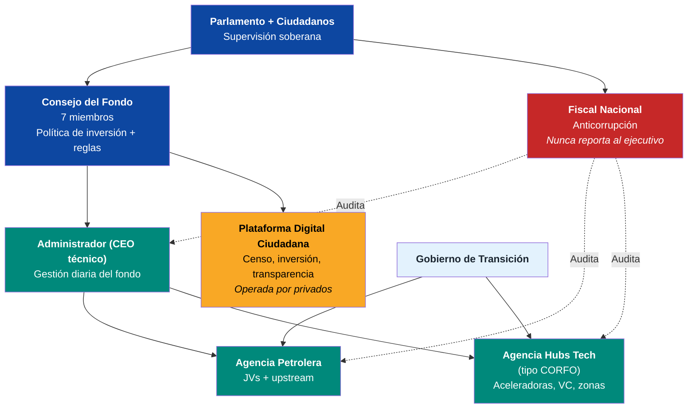

# Sostenibilidad ESG y Gobernanza de Ejecución

## Framework ESG

| Componente | Acción | Beneficio |
|-----------|--------|----------|
| Huella carbono | Compensación + créditos carbono + upgraders limpios | Atrae inversión ESG |
| Arco Minero | Moratorio minería ilegal + formalización | Protege Amazonía |
| Energía | 74% renovable → 85%+ con solar/eólica | Líder renovable LATAM |
| Derechos laborales | Estándares OIT en todo | Evita sanciones |

## Organigrama de Ejecución (PMO)

| Entidad | Responsabilidad | Reporta a |
|---------|----------------|-----------|
| Consejo del Fondo (7 miembros) | Política de inversión + reglas | Parlamento + ciudadanos |
| Administrador (CEO técnico) | Gestión diaria | Consejo |
| Fiscal Nacional | Anticorrupción | Parlamento (nunca ejecutivo) |
| Agencia Petrolera | JVs + upstream | Gobierno + Consejo |
| Agencia Hubs Tech (tipo CORFO) | Aceleradoras, VC, zonas | Gobierno + privados |
| Plataforma Digital Ciudadana | Censo, inversión, transparencia | Consejo (operada por privados) |

**Principio:** KPIs públicos trimestrales. 2 trimestres sin cumplir = revisión automática de liderazgo.

---

## Net-Zero Commitment para Data Centers

:::info Por qué importa
Larry Fink (BlackRock, USD 10T+ AUM) condiciona inversión a ESG compliance. Los Tech Giants que invertirían USD 6-16B en data centers en Venezuela necesitan **net-zero commitment**. Sin esto, BlackRock no compra VIN, AWS no pone data centers, y el plan pierde su segundo motor económico.
:::

### Ventaja natural: Venezuela ya es ~74% renovable

| Fuente de energía | Capacidad | % del mix | Emisiones | Estado |
|-------------------|-----------|----------|-----------|--------|
| **Hidroeléctrica** (Caroní/Guri) | 18.000 MW | ~74% | **Cero** | Operativa (degradada) |
| Termoeléctrica (gas/diésel) | ~6.000 MW | ~22% | Alta | Degradada |
| Solar | ~50 MW | <1% | Cero | Mínima |
| Eólica (Falcón) | ~100 MW | <1% | Cero | Piloto |

**El punto de partida es privilegiado:** pocos países del mundo pueden ofrecer data centers alimentados al 100% por hidroeléctrica. Esto es una ventaja competitiva vs. Chile (solar intermitente), Colombia (hidro + térmica), Brasil (hidro + biomasa + térmica).

### Compromiso Net-Zero: 3 fases

| Fase | Meta | Mecanismo | Timeline |
|------|------|-----------|----------|
| **1. Clean compute** | Data centers 100% hidro | Conexión directa a red Caroní, PPA a 20 años | Años 1-3 |
| **2. Grid transition** | Mix nacional > 85% renovable | Rehabilitar Guri + solar (Falcón/Zulia) + eólica | Años 3-8 |
| **3. Full net-zero** | Toda operación tech net-zero | Créditos de carbono para emisiones residuales, hidrógeno verde para backup | Años 8-15 |

### Framework ESG para inversores institucionales

| Requisito | Estándar | Venezuela S.A. propone | Fuente |
|-----------|---------|----------------------|--------|
| **Emisiones Scope 1-3** | TCFD / GHG Protocol | Reporte anual auditado por Big 4 | [TCFD](https://www.fsb-tcfd.org/) |
| **Energía renovable** | RE100 | Data centers 100% hidro desde día 1 | [RE100](https://www.there100.org/) |
| **Agua** | CDP Water | Caroní tiene agua abundante — monitorear impacto en caudal | [CDP](https://www.cdp.net/) |
| **Social** | UN Global Compact | Estándares laborales OIT, inclusión de comunidades locales | [UN Global Compact](https://www.unglobalcompact.org/) |
| **Gobernanza** | Santiago Principles | Fondo soberano transparente, board independiente | [Santiago Principles](https://www.ifswf.org/) |
| **Biodiversidad** | TNFD | Moratorio Arco Minero ilegal, protección Amazonía/Gran Sabana | [TNFD](https://tnfd.global/) |

### Cuantificación del diferencial ESG

| Data center | Energía | Emisiones CO2e/MW | Costo energía | ESG score |
|-------------|---------|------------------|---------------|-----------|
| Virginia, USA (AWS) | Mix fósil + renovable | ~300-400 ton/MW/año | USD 0.06-0.08/kWh | Medio |
| Chile (Google) | Solar + eólica | ~50-100 ton/MW/año | USD 0.04-0.06/kWh | Alto |
| **Venezuela (propuesto)** | **100% hidro** | **~0 ton/MW/año** | **USD 0.03-0.05/kWh** | **Máximo** |
| Noruega (data centers) | 98% hidro | ~0 ton/MW/año | USD 0.04-0.06/kWh | Máximo |

:::tip Pitch para BlackRock/Fink
"Venezuela ofrece data centers con **cero emisiones + la energía más barata del hemisferio occidental**. No es un compromiso futuro — es una ventaja natural existente. El commitment es no arruinarla."
:::

### Créditos de carbono como ingreso adicional

Si Venezuela opera data centers 100% hidro mientras sus competidores usan mix fósil, puede generar **créditos de carbono** vendibles en mercados internacionales:

| Concepto | Estimación |
|----------|-----------|
| Ahorro CO2 vs. data center promedio global | ~300-400 ton/MW/año |
| Capacidad total data centers (meta año 10) | 500-1.000 MW |
| Créditos generables | 150.000-400.000 ton CO2e/año |
| Precio mercado voluntario | USD 10-50/ton ([Ecosystem Marketplace 2024](https://www.ecosystemmarketplace.com/)) |
| Ingreso potencial | **USD 1.5-20M/año** (modesto pero simbólico) |
