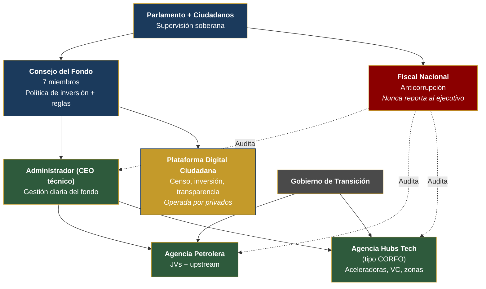

# Sostenibilidad ESG y Gobernanza de Ejecución

## Framework ESG

| Componente | Acción | Beneficio |
|-----------|--------|----------|
| Huella carbono | Compensación + créditos carbono + upgraders limpios | Atrae inversión ESG |
| Arco Minero | Moratorio minería ilegal + formalización | Protege Amazonía |
| Energía | 74% renovable → 85%+ con solar/eólica | Líder renovable LATAM |
| Derechos laborales | Estándares OIT en todo | Evita sanciones |

## Organigrama de Ejecución (PMO)

| Entidad | Responsabilidad | Reporta a |
|---------|----------------|-----------|
| Consejo del Fondo (7 miembros) | Política de inversión + reglas | Parlamento + ciudadanos |
| Administrador (CEO técnico) | Gestión diaria | Consejo |
| Fiscal Nacional | Anticorrupción | Parlamento (nunca ejecutivo) |
| Agencia Petrolera | JVs + upstream | Gobierno + Consejo |
| Agencia Hubs Tech (tipo CORFO) | Aceleradoras, VC, zonas | Gobierno + privados |
| Plataforma Digital Ciudadana | Censo, inversión, transparencia | Consejo (operada por privados) |

**Principio:** KPIs públicos trimestrales. 2 trimestres sin cumplir = revisión automática de liderazgo.
