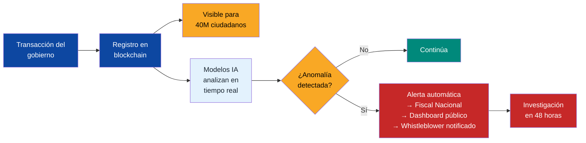

# Estado Digital: Reducir, Digitalizar, Automatizar

:::tip En pocas palabras
Un gobierno donde todo se hace por internet: registrar una empresa en 15 minutos, declarar impuestos en 3 minutos, sacar una cita médica sin hacer cola. Estonia lo logró con 1,3 millones de personas. Venezuela puede hacerlo con 40 millones.
:::

[Estonia](https://e-estonia.com/): 100% servicios digitales (dic. 2024), [ahorro 2% PIB](https://centreforpublicimpact.org/public-impact-fundamentals/e-estonia-the-information-society-since-1997/), 820 años de tiempo ahorrado, [#1 ONU e-gobierno 2024](https://e-estonia.com/estonia-is-at-the-top-of-the-un-e-government-ranking/), [82% satisfacción ciudadana](https://www.socialeurope.eu/estonias-digital-frontier-when-perfect-e-government-meets-the-paradox-of-trust) (OECD 2024).

## Hoja de Ruta

| Servicio | Meta Año 3 | Meta Año 7 | Referencia |
|----------|-----------|-----------|-----------|
| Identidad digital | Cédula digital 100% | Firma digital universal | Estonia eID |
| Impuestos | Online 80% | Auto-declaración IA (3 min) | Estonia: 3 min |
| Registro empresas | 24 horas | 20 minutos online | Estonia: 20 min |
| Salud | Historia clínica 50% | 100% digital + IA | Estonia: 99% recetas |
| Justicia | Expediente digital 50% | Tribunales virtuales | Singapur |
| Trámites | Online 60% | Online 95% (0 filas) | Estonia: 100% |

**Infraestructura:** X-Road venezolano (interoperabilidad) + blockchain público + principio once-only.

**Inversión:** USD 3.000–5.000 M en 7 años. Retorno: ~2% PIB/año en ahorro.

---

## Transparencia Total: Blockchain + IA Anti-Corrupción

:::tip La mejor anticorrupción no son 500 inspectores — es un sistema que no permite esconder nada
Pon todo en blockchain. Que cualquier persona en cualquier lugar pueda ver cualquier transacción del gobierno en tiempo real. Un solo modelo de ML puede reemplazar a toda una agencia anti-corrupción.
:::

### Blockchain público para finanzas del Estado

| Capa | Qué se registra | Quién puede ver | Tecnología |
|------|----------------|-----------------|-----------|
| **Presupuesto** | Cada bolívar/dólar asignado: de qué partida, a qué entidad, para qué | Cualquier ciudadano, en tiempo real | Blockchain permissionada (Hyperledger/Polygon) |
| **Licitaciones** | Cada contrato: empresa, monto, plazo, hitos, pagos | Público + comparación automática con precios de referencia | Smart contracts con milestone payments |
| **Pagos** | Cada pago del Estado: proveedor, monto, factura, entregable | Público. Alertas automáticas si > 20% del precio referencial | Blockchain + oráculos de precios |
| **Fondo soberano** | Cada movimiento: aporte, retiro, rendimiento, custodio | Público + auditoría automatizada | Modelo [Norway NBIM transparency](https://www.nbim.no/) + blockchain |
| **Nómina** | Cada empleado público: cargo, salario, asistencia | Público (protegiendo datos personales sensibles) | Base de datos verificable contra blockchain |
| **Activos** | Inventario de activos del Estado: inmuebles, vehículos, equipos | Público | Registry on-chain |

### IA para detección de corrupción en tiempo real

| Modelo | Qué detecta | Cómo funciona | Referencia |
|--------|------------|---------------|-----------|
| **Detección de anomalías** | Pagos fuera de patrón, sobrecostos, proveedores fantasma | ML no supervisado sobre transacciones. Alerta si desvía >2σ del promedio | [ProZorro (Ucrania)](https://prozorro.gov.ua/en): redujo corrupción en licitaciones 40% |
| **Análisis de red** | Empresas de maletín, testaferros, redes de corrupción | Graph neural networks sobre beneficiarios finales, directores, accionistas | [OpenOwnership](https://www.openownership.org/) |
| **Predicción de riesgo** | Contratos con alta probabilidad de fraude ANTES de que ocurra | Clasificador entrenado en patrones históricos de corrupción (los 12 del [blindaje](/04-gobernanza/blindaje-integridad)) | [World Bank Integrity AI](https://www.worldbank.org/) [Requiere investigación] |
| **NLP sobre documentos** | Cláusulas inusuales en contratos, lenguaje que oculta conflictos de interés | LLM fine-tuned para contratos públicos en español | Modelo propio o partnership con Anthropic/OpenAI |
| **Matching de precios** | Sobreprecio vs. mercado (patrón CLAP) | Comparación automática de precios pagados vs. mercado internacional + regional | Oráculos de precios (Chainlink/APIs de mercado) |

### Costo vs. retorno

| Concepto | Costo | Retorno estimado |
|----------|-------|-----------------|
| Infraestructura blockchain | USD 50-100M (setup) + USD 10-20M/año | — |
| Equipo IA anti-corrupción (30-50 ingenieros) | USD 5-10M/año | — |
| Total anual | **USD 15-30M/año** | — |
| Corrupción prevenida (conservador: 5% del gasto público) | — | **USD 1-3B/año** |
| **ROI** | | **50-100x** |

### Precedentes

| País/Sistema | Qué hicieron | Resultado | Fuente |
|-------------|-------------|-----------|--------|
| **Ucrania (ProZorro)** | Licitaciones públicas 100% online + IA de detección | Ahorro USD 6B en 3 años, corrupción en compras -40% | [ProZorro](https://prozorro.gov.ua/en) |
| **Georgia (2004)** | Policía nueva + cámaras + dashboard público | De más corrupto a #1 reforma anti-corrupción del mundo | [TI Georgia](https://www.transparency.org/) |
| **Estonia (X-Road)** | Interoperabilidad total + once-only + blockchain para auditoría | CPI score de 74 (top 20 mundial) | [e-Estonia](https://e-estonia.com/) |
| **Corea del Sur (KONEPS)** | Procurement electrónico + IA | Corrupción en compras públicas -50% | [KONEPS](https://www.pps.go.kr/) |

:::danger La regla de Musk para Venezuela
"No necesitas 500 inspectores si tienes un sistema que no permite esconder nada." Cada transacción del gobierno en blockchain pública + IA que detecta patrones en tiempo real + 40M de ciudadanos que pueden auditar desde su teléfono = **anti-corrupción by design, no by enforcement**.

Cross-reference: [12 patrones de corrupción × 14 áreas del plan](/04-gobernanza/blindaje-integridad) | [Sistema de whistleblower con recompensa 10-30%](/04-gobernanza/justicia-transicional)
:::

### Ejecución Automática de Presupuesto

:::caution Implementación del Estado — Venezuela S.A. provee la tecnología
El presupuesto es del Estado. Venezuela S.A. puede desarrollar y operar la plataforma tecnológica como concesión (el Ministerio Digital), pero la política de ejecución automática la aprueba el parlamento. Referencia: [Plan Providencia por Venezuela (2026)].
:::

El gasto fantasma termina cuando los fondos solo fluyen si hay servicio verificado. En salud y educación, las transferencias se ejecutan por algoritmo — no por discreción política:

| Componente | Mecanismo | Si no cumple |
|------------|-----------|-------------|
| **Salud** | Fondos se transfieren según data verificada: pacientes atendidos, procedimientos realizados, vacunas aplicadas | Transferencia se **pausa automáticamente** hasta regularizar datos |
| **Educación** | Fondos se transfieren según estudiantes matriculados, asistencia, resultados estandarizados | Pausa automática + alerta pública en dashboard |
| **Verificación** | Datos cargados por prestadores en plataforma digital, cruzados con registros de identidad (cédula digital) | Inconsistencias > 5% activan auditoría automática |
| **Anti-manipulación** | Hash de cada registro en blockchain — alteración retroactiva es detectable e imputable penalmente | Smart contract bloquea fondos si hash no coincide |

**Efecto:** un gobernador no puede reportar 50.000 estudiantes si solo hay 30.000 cédulas de menores registradas en su estado. Un hospital no cobra por 1.000 cirugías si solo hay 600 historias clínicas verificables. **Se paga por servicio entregado, no por presupuesto asignado.**

**Referencia:** Plan Providencia por Venezuela (2026). Complementa la capa blockchain de transparencia descrita arriba.
