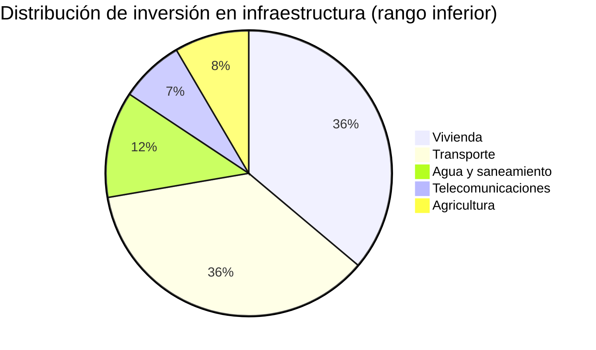

# Infraestructura Básica: Telecomunicaciones, Agua, Vivienda, Transporte y Agricultura

:::caution Fechas ilustrativas — las fases se activan por KPIs, no por calendario
Las referencias a "Año X" en este documento son **ilustrativas**. Las fases reales se activan por condiciones verificables (PIB/cápita, formalización, pobreza). Ver [KPIs de Activación](/07-ejecucion/kpis-activacion).
:::

> Sin infraestructura no hay hubs tech, no hay turismo, no hay data centers. Cada dólar invertido aquí habilita USD 5–10 de inversión privada.

## Telecomunicaciones

:::danger Estado actual
Venezuela tiene [velocidad promedio de descarga estancada por debajo de 1 Mbps](https://estcarisimo.github.io/assets/pdf/papers/2024-sigcomm-venezuela.pdf) durante una década, mientras que la mediana de LATAM es ~20 Mbps. Solo [48% de hogares tiene acceso a internet](https://freedomhouse.org/country/venezuela/freedom-net/2024) (Consultores 21, 2023). Penetración de banda ancha fija: 9,58% vs. móvil: 52,3%. En [7 de 23 estados la penetración es menor al 30%](https://freedomhouse.org/country/venezuela/freedom-net/2024).
:::

| Indicador | Venezuela (actual) | Promedio LATAM | Meta Año 5 | Meta Año 10 |
|-----------|-------------------|----------------|-----------|------------|
| Velocidad descarga | <1 Mbps | ~20 Mbps | 15 Mbps | 50+ Mbps |
| Penetración hogares | 48% | ~70% | 70% | 90%+ |
| Banda ancha fija | 9,58% | ~15% | 20% | 40% |
| 5G | 0 | En despliegue | Ciudades principales | Cobertura nacional |

**Plan:**
- **CANTV:** Se transfiere a Venezuela S.A. como activo del holding ciudadano → privatización parcial o aporte como equity en JVs con operadores internacionales (modelo Chile: Entel → CTC/Telefónica). El Estado no opera telecoms
- **Zonas rurales:** Starlink + fibra troncal nacional
- **5G:** Licencias competitivas para 3+ operadores
- **Inversión:** USD 3.000–5.000 M en 5 años

Ver [Telecomunicaciones — Análisis Detallado](/10-oportunidades/telecomunicaciones) para modelo de concesión, proveedores y proyección a 15 años.

Fuentes: [Freedom House 2024](https://freedomhouse.org/country/venezuela/freedom-net/2024); [SIGCOMM/Northwestern 2024](https://estcarisimo.github.io/assets/pdf/papers/2024-sigcomm-venezuela.pdf)

### Starlink + Conectividad Inmediata

**Problema:** CANTV ofrece ~**5–10 Mbps** promedio en zonas urbanas. En zonas rurales y estados como Amazonas, Delta Amacuro y Bolívar, **la conectividad es cero o cercana a cero**. Esperar 3–5 años a construir fibra troncal no es opción cuando los data centers, ZEETs y hubs tech necesitan internet **ahora**.

**Solución:** [Starlink](https://www.starlink.com/) como puente inmediato + fibra como backbone a mediano plazo.

| Solución | Velocidad | Costo | Timeline de despliegue | Cobertura |
|----------|-----------|-------|----------------------|-----------|
| **Starlink Residencial** | 100–200 Mbps | USD 120/mes + USD 599 hardware | **6 meses** | Nacional (cualquier punto con cielo) |
| **Starlink Business** | 350+ Mbps | USD 250/mes + USD 2.500 hardware | **6 meses** | ZEETs + hubs + hospitales |
| **Fibra troncal nacional** | 1–10 Gbps | USD 500M–1B inversión total | 3–5 años | Urbano (80% de población) |
| **5G (Ericsson/Nokia)** | 1+ Gbps | USD 2–5B inversión total | 5–7 años | Urbano + suburbano |

**Costos de cobertura Starlink:**

| Segmento | Terminales | Costo anual | Impacto |
|----------|-----------|-------------|---------|
| 5 ciudades ZEET + 50 hubs tech | ~500 terminales Business | **USD 3–5M/año** | Internet de alta velocidad para ecosistema tech |
| 1.000+ puntos de acceso comunitario (rural) | 1.000 terminales | **USD 10–20M/año** | Conectividad básica para zonas sin infraestructura |
| Hospitales y escuelas prioritarias | ~2.000 terminales | **USD 5–10M/año** | Telemedicina + educación digital |
| **Total cobertura inmediata** | ~3.500 terminales | **USD 18–35M/año** | — |

:::info Complementar, no reemplazar
Starlink es el **puente**, no el destino. La fibra troncal y 5G son la infraestructura permanente. Pero Starlink permite que las ZEETs, data centers y hospitales operen con internet de primer mundo **desde el mes 6**, mientras se construye la fibra. Es la diferencia entre esperar 5 años o empezar mañana.
:::

Fuentes: [Starlink](https://www.starlink.com/) (precios actualizados 2025); [ITU Broadband Commission](https://www.broadbandcommission.org/) [Requiere investigación: datos más recientes de cobertura satelital LATAM]

### Proveedores de Telecoms: Aliados, No Huawei

**Realidad geopolítica:** La relación con EE.UU. es condición sine qua non para el levantamiento de sanciones. Usar equipos **Huawei** para 5G o infraestructura crítica es un **deal-breaker** para Washington.

> Marco Rubio (Secretario de Estado): La infraestructura de telecomunicaciones con equipos chinos en países del hemisferio occidental es una amenaza de seguridad nacional para EE.UU.

| Proveedor | País | Qué provee | Estatus con EE.UU. |
|-----------|------|-----------|-------------------|
| **Ericsson** | Suecia | 5G RAN, core network, fibra | Aprobado — proveedor preferido de EE.UU. |
| **Nokia** | Finlandia | 5G, fibra, networking empresarial | Aprobado — contratos con Pentágono |
| **Samsung** | Corea del Sur | 5G RAN, equipos de red | Aprobado — proveedor de Verizon/AT&T |
| ~~Huawei~~ | ~~China~~ | ~~5G, equipos de red~~ | **Prohibido** — Entity List desde 2019 |
| ~~ZTE~~ | ~~China~~ | ~~Telecoms, equipos~~ | **Prohibido** — Entity List |

**Cables submarinos:** Venezuela necesita nuevas conexiones de fibra submarina. Los acuerdos deben pasar por negociación con EE.UU. — no es técnico, es geopolítico.

:::danger Esto no es opcional
Elegir Huawei/ZTE = perder el roadmap de sanciones completo. No hay negociación. Ericsson/Nokia/Samsung son los únicos proveedores viables para un país que busca reintegrarse a la economía occidental. El costo puede ser 10–20% mayor, pero el costo de elegir mal es **perder USD 550–750B en inversión**.
:::

Fuentes: [FCC Clean Network Initiative](https://www.fcc.gov/) [Requiere investigación: status actualizado del programa]; [State Department Telecommunications Security](https://www.state.gov/) [Requiere investigación]

---

## Agua Potable

:::danger Crisis crónica
[7,6 millones de personas](https://crisisresponse.iom.int/response/venezuela-bolivarian-republic-crisis-response-plan-2025) afectadas por falta de servicios básicos. El acceso a agua potable es limitado y desigual en todo el país ([IOM 2025](https://crisisresponse.iom.int/response/venezuela-bolivarian-republic-crisis-response-plan-2025)). Plantas de tratamiento deterioradas, redes de distribución con pérdidas >50%.
:::

| Acción | Inversión Est. | Plazo | Modelo |
|--------|---------------|-------|--------|
| Reparación plantas de tratamiento | USD 1.000–2.000 M | Años 1–3 | Israel (desalinización + reciclaje) |
| Rehabilitación redes de distribución | USD 2.000–4.000 M | Años 1–5 | Colombia (Acueducto de Bogotá) |
| Desalinización (Margarita, Zulia) | USD 500–1.000 M | Años 3–7 | Israel / Arabia Saudita |
| Saneamiento y aguas servidas | USD 1.000–2.000 M | Años 2–7 | Chile (cobertura 100%) |
| **TOTAL AGUA** | **USD 5.000–9.000 M** | **7 años** | — |

**Meta:** Acceso a agua potable 100% de la población en 7 años. Ver [Agua y Saneamiento — Análisis Detallado](/10-oportunidades/agua-saneamiento) para modelo de concesión y proyecciones.

---

## Vivienda

[ENCOVI 2023](https://crisisresponse.iom.int/response/venezuela-bolivarian-republic-crisis-response-plan-2024): 82,8% de la población en pobreza por ingreso, con acceso limitado a vivienda digna. Déficit habitacional masivo.

| Acción | Inversión Est. | Plazo | Modelo |
|--------|---------------|-------|--------|
| Subcuenta Vivienda del FCV + subsidio focalizado para familias en extrema pobreza | USD 5.000–10.000 M | Años 1–10 | Chile (subsidio habitacional DS49) |
| Crédito hipotecario (bancos privados + garantía de Venezuela S.A.) | USD 5.000–10.000 M | Años 2–15 | Colombia (Mi Casa Ya) |
| Vivienda asequible vía concesión privada cerca de hubs tech y ZEET | USD 3.000–5.000 M | Años 3–10 | Singapur (HDB) |
| Formalización de tenencia + registro digital | USD 500–1.000 M | Años 1–3 | Georgia (blockchain títulos) |
| **TOTAL VIVIENDA** | **USD 15.000–30.000 M** | **15 años** | — |

---

## Transporte

Sin transporte no hay cadena de suministro, no hay turismo, no hay hubs tech conectados.

| Componente | Estado Actual | Inversión Est. | Meta |
|-----------|---------------|---------------|------|
| Carreteras | Red deteriorada, falta de mantenimiento | USD 5.000–10.000 M | Red troncal en estándar LATAM |
| Puertos (Puerto Cabello, La Guaira) | Operando a capacidad reducida | USD 2.000–4.000 M | Capacidad para exportación petrolera + contenedores |
| Aeropuertos (Maiquetía, Maracaibo, Valencia) | Limitada conectividad intl. | USD 1.000–3.000 M | Hub caribeño + low-cost carriers |
| Ferrocarril | Prácticamente inexistente | USD 5.000–10.000 M | Corredor Caracas–Valencia–Barquisimeto (fase 1) |
| Transporte urbano (Caracas, Maracaibo, Valencia) | Metro de Caracas deteriorado | USD 2.000–4.000 M | Metro funcional + BRT |
| **TOTAL TRANSPORTE** | — | **USD 15.000–30.000 M** | **15 años** |

:::info Priorización
Corredores prioritarios: (1) Caracas–La Guaira–Maiquetía (turismo + logística), (2) Caracas–Valencia (industrial), (3) Ciudad Guayana–Puerto Ordaz (minería + data centers cerca de Guri). Modelo: Colombia 4G/5G highways (concesiones público-privadas). Ver [Vialidad y Logística](/10-oportunidades/vialidad-logistica) y [Transporte Marítimo](/10-oportunidades/transporte-maritimo) para análisis detallado.
:::

---

## Agricultura y Soberanía Alimentaria

Venezuela importa >70% de sus alimentos pese a tener los Llanos — una de las llanuras fértiles más extensas de Sudamérica — y el río Orinoco como fuente de riego.

| Acción | Inversión Est. | Plazo | Meta |
|--------|---------------|-------|------|
| Formalización de tierras + crédito agrícola | USD 1.000–2.000 M | Años 1–5 | Registro digital + microcrédito |
| AgTech (riego IA, drones, satélite, agricultura de precisión) | USD 500–1.000 M | Años 2–7 | Israel (Netafim) + Brasil (Embrapa) |
| Zonas francas agroindustriales | USD 1.000–2.000 M | Años 3–10 | Procesamiento + exportación |
| Reactivación de rubros estratégicos (maíz, arroz, café, cacao) | USD 500–1.000 M | Años 1–5 | Colombia + Brasil |
| Exportación al Caribe + LATAM | USD 200–500 M | Años 5–10 | Rep. Dominicana como mercado |
| **TOTAL AGRICULTURA** | **USD 3.500–7.000 M** | **10 años** | Autosuficiencia alimentaria |

Ver [Agro y Ganadería — Análisis Detallado](/10-oportunidades/agro-ganaderia) para modelo completo con USD 18-25B de inversión y comparables internacionales.

---

## Resumen de Inversión en Infraestructura

```mermaid
xychart-beta
    title "Inversión en infraestructura por sector (USD miles de M — rango inferior vs. superior)"
    x-axis ["Vivienda", "Transporte", "Agua", "Telecom", "Agricultura"]
    y-axis "USD miles de millones" 0 --> 32
    bar [15, 15, 5, 3, 3.5]
    bar [30, 30, 9, 5, 7]
```

| Sector | Inversión | Plazo |
|--------|-----------|-------|
| Telecomunicaciones | USD 3.000–5.000 M | 5 años |
| Agua | USD 5.000–9.000 M | 7 años |
| Vivienda | USD 15.000–30.000 M | 15 años |
| Transporte | USD 15.000–30.000 M | 15 años |
| Agricultura | USD 3.500–7.000 M | 10 años |
| **TOTAL** | **USD 41.500–81.000 M** | **15 años** |

:::caution Fuentes de inversión
No todo es gasto público. Telecomunicaciones, vivienda y transporte son altamente concesionables (modelo Chile/Colombia). El gasto público directo se concentra en agua, agricultura y vivienda social. Ver [Inversión y Fuentes](/02-motor-financiero/inversion-inicial-fuentes). Ver [Modelo de Concesiones](/10-oportunidades/modelo-concesiones) para el marco completo de concesión aplicable a todos los sectores de infraestructura, y [Construcción Inmobiliaria](/10-oportunidades/construccion-inmobiliaria) para vivienda y obra civil.
:::
