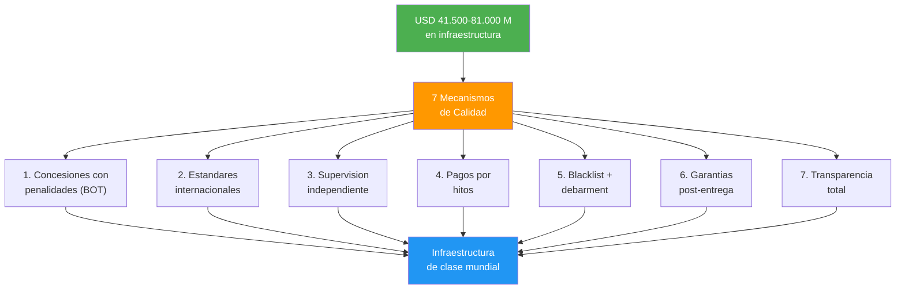
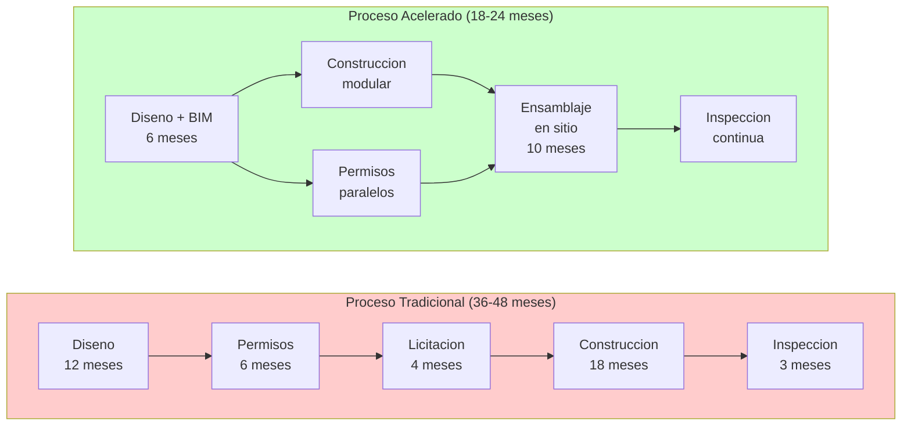

# Calidad y Plazos en Infraestructura: Que No Se Caiga al Mes

> El problema de infraestructura en Venezuela no es solo dinero — es ejecucion. El pais ha gastado miles de millones en obras que nunca se terminaron, se terminaron tarde, o se desmoronaron a los dias. Esta seccion define COMO garantizar calidad de clase mundial y entrega a tiempo para los [USD 41.500-81.000 M en infraestructura basica](/06-realidad/infraestructura-basica).

---

## El Problema Cuantificado

:::danger El patron historico
Venezuela construye caro, tarde y mal. No es un problema de ingenieros — es un problema de incentivos. Cuando el contratista cobra por adelantado, no tiene obligacion de mantener la obra, y nadie lo audita, el resultado es predecible: puentes que colapsan, hospitales que nunca se terminan, carreteras con huecos al mes, viviendas con problemas estructurales.
:::

| Indicador | Venezuela | Promedio LATAM | Mejor practica | Fuente |
|-----------|-----------|----------------|----------------|--------|
| Indice de calidad de infraestructura (WEF, 1-7) | **2.1** | **3.2** | **6.3** (Singapur) | [WEF Global Competitiveness Report 2019](https://www.weforum.org/reports/how-to-end-a-decade-of-lost-productivity-growth/) |
| Calidad de carreteras (WEF, 1-7) | **1.8** | **3.1** | **6.5** (Singapur) | [WEF GCR 2019](https://www.weforum.org/reports/how-to-end-a-decade-of-lost-productivity-growth/) |
| Confiabilidad suministro electrico (WEF, 1-7) | **1.5** | **4.2** | **6.8** (Japon) | [WEF GCR 2019](https://www.weforum.org/reports/how-to-end-a-decade-of-lost-productivity-growth/) |
| Acceso a agua potable (% poblacion) | **<80%** | **~95%** | **100%** (Chile) | [Requiere investigacion] |
| Sobrecostos promedio en obras publicas | **30-60%** | **15-25%** | **5-10%** (Singapur) | [Requiere investigacion] |
| Proyectos completados a tiempo | **<30%** | **~50%** | **>85%** (Singapur) | [Requiere investigacion] |
| Indice de desempeno logistico (Banco Mundial, 1-5) | **2.2** | **2.7** | **4.2** (Singapur) | [World Bank LPI 2023](https://lpi.worldbank.org/) |

:::info Nota sobre fuentes
Los datos marcados [Requiere investigacion] reflejan estimaciones basadas en reportes parciales y no tienen una fuente unica verificable. Se actualizaran cuando se disponga de datos oficiales post-transicion. Los datos WEF corresponden al ultimo reporte que incluyo a Venezuela (2019); el pais fue excluido de ediciones posteriores por falta de datos confiables.
:::

---

## 7 Mecanismos de Calidad Mundial

### Mecanismo 1: Concesiones con Penalidades (Build-Operate-Transfer)

El contratista construye Y opera la obra por **15-30 anos**. Si la calidad falla, el repara con su dinero, no con el del Estado.

| Elemento | Detalle |
|----------|---------|
| Modelo | Build-Operate-Transfer (BOT) |
| Duracion de concesion | **15-30 anos** |
| Performance bond | **10-20%** del valor del contrato en escrow |
| Penalidad por incumplimiento | Descuento automatico de pagos + ejecucion de bond |
| Transferencia | Al Estado solo despues de verificacion de calidad |

:::tip Modelo: Chile
Chile concesiono **>80%** de su red de autopistas desde 1993. Resultado: las mejores carreteras de LATAM. El concesionario cobra peaje, pero si la via tiene huecos o no cumple estandares, **el pierde ingresos y paga penalidades**. [Ministerio de Obras Publicas de Chile](https://www.mop.cl/Paginas/default.aspx).
:::

:::tip Modelo: Singapur (BCA)
La Building & Construction Authority de Singapur certifica CADA estructura antes de ocupacion. Sin certificacion BCA, no se abre al publico. Resultado: **cero colapsos estructurales** en 30 anos. [BCA Singapore](https://www1.bca.gov.sg/).
:::

---

### Mecanismo 2: Estandares Internacionales Obligatorios

COVENIN (normas venezolanas) no es suficiente como estandar unico. Los proyectos de Venezuela S.A. deben cumplir normas internacionales verificables.

| Estandar | Que cubre | Quien certifica | Obligatorio para |
|----------|-----------|-----------------|------------------|
| **ISO 9001** | Sistema de gestion de calidad | Bureau Veritas, SGS, TUV | Todo proyecto >USD 1M |
| **ISO 14001** | Gestion ambiental | Bureau Veritas, SGS, TUV | Todo proyecto >USD 5M |
| **ISO 45001** | Seguridad y salud ocupacional | Bureau Veritas, SGS, TUV | Todo proyecto |
| **Eurocode / ACI 318** | Diseno estructural (concreto, acero) | Ingenieros certificados intl. | Toda estructura |
| **AASHTO** | Diseno de carreteras y puentes | Ingenieros certificados intl. | Vialidad |
| **IEC 61850** | Sistemas electricos | IEC / laboratorios acreditados | Infraestructura electrica |
| **COVENIN** | Normas venezolanas (complementario) | SENCAMER | Como base minima |

:::caution No se trata de despreciar lo local
COVENIN es la base. Pero los estandares internacionales cierran las brechas que COVENIN no cubre (especialmente en zonas sismicas, diseno de puentes y materiales de construccion). La certificacion la hacen firmas internacionales independientes del contratista.
:::

---

### Mecanismo 3: Supervision Independiente por Terceros

El que construye NO se supervisa a si mismo. Se contrata una firma internacional de ingenieria como supervisor independiente.

| Componente | Detalle |
|------------|---------|
| Firmas elegibles | AECOM, WSP, Arup, Mott MacDonald, Dar Group |
| Pagado por | El Estado (o el fondo de infraestructura) |
| Reporta a | Dashboard publico + ciudadanos |
| Frecuencia de inspeccion | Semanal en fase de construccion |
| Tecnologia | IoT: sensores de deformacion, vibracion y asentamiento en tiempo real |
| Drones | Inspeccion aerea con IA para deteccion de defectos |
| Dashboard | Publico, actualizado en tiempo real |

:::tip Modelo: Hong Kong (ICV)
El sistema Independent Checking Verification de Hong Kong requiere que un ingeniero independiente verifique TODOS los calculos estructurales antes de aprobacion. Ha mantenido los estandares de construccion de Hong Kong entre los mejores del mundo durante 40 anos. [Buildings Department Hong Kong](https://www.bd.gov.hk/).
:::

---

### Mecanismo 4: Pagos Atados a Hitos (Milestone Payments)

Cero anticipos gordos. El contratista cobra cuando demuestra avance verificado.

| Hito | % del pago | Condicion |
|------|-----------|-----------|
| Anticipo maximo | **10%** | Contra fianza bancaria internacional |
| Cimentacion completada | **20%** | Inspeccion aprobada por supervisor independiente |
| Estructura completada | **20%** | Inspeccion aprobada + pruebas de materiales |
| MEP (mecanica, electrica, plomeria) | **20%** | Inspeccion aprobada + pruebas funcionales |
| Entrega final | **10%** | Certificacion de ocupacion/uso |
| **Retencion** | **20%** | Liberada tras **12 meses** sin defectos (defect liability period) |

**Total: 100%.** Si un hito falla la inspeccion, **no hay pago hasta que se corrija.**

:::info Smart contracts para trazabilidad
Los pagos se registran en blockchain (smart contracts) para que cualquier ciudadano pueda verificar: cuanto se pago, cuando, a quien, y contra que evidencia. Modelo: [FIDIC](https://fidic.org/) (Federation Internationale des Ingenieurs-Conseils) — estandar global de contratos de construccion. Ver tambien [Estado Digital](/06-realidad/estado-digital) para la infraestructura de blockchain publico.
:::

---

### Mecanismo 5: Blacklist + Debarment

Quien entrega obra de mala calidad no vuelve a trabajar con el Estado. Punto.

| Accion | Detalle |
|--------|---------|
| Obra deficiente confirmada | **Ban de 5-10 anos** de todo contrato publico |
| Fraude comprobado | **Ban permanente** + proceso penal |
| Registro publico | Nombre de empresa, proyecto, razon del ban, evidencia |
| Alcance | Incluye subsidiarias, empresas relacionadas y directores |
| Cross-reference | Verificacion contra listas del [Banco Mundial](https://www.worldbank.org/en/projects-operations/procurement/debarred-firms) y [blindaje-integridad](/04-gobernanza/blindaje-integridad) |

:::tip Modelo: Banco Mundial
El sistema de debarment del Banco Mundial ha sancionado a **>1.000 empresas** desde 1999. Las empresas sancionadas quedan excluidas de TODOS los proyectos financiados por el BM. Venezuela S.A. adopta este modelo y lo conecta con el [blindaje de integridad](/04-gobernanza/blindaje-integridad) para cerrar el circuito.
:::

---

### Mecanismo 6: Garantias Post-Entrega (Warranty Periods)

La obra no termina cuando se corta la cinta. El contratista responde por anos.

| Tipo de obra | Garantia estructural | Garantia funcional | Fianza requerida |
|-------------|---------------------|-------------------|-----------------|
| Edificios (vivienda, hospitales) | **5 anos** | **2 anos** | Aseguradora internacional |
| Carreteras y autopistas | **10 anos** | **5 anos** | Aseguradora internacional |
| Puentes y tuneles | **10 anos** | **5 anos** | Aseguradora internacional |
| Infraestructura critica (presas, plantas) | **15 anos** | **7 anos** | Aseguradora internacional |
| Telecomunicaciones | **5 anos** | **3 anos** | Aseguradora internacional |

**Regla clave:** Las fianzas las emiten aseguradoras internacionales (Lloyd's, Swiss Re, Munich Re) — no locales. Si aparece un defecto dentro del periodo de garantia, el contratista repara a su costo o pierde la fianza.

---

### Mecanismo 7: Transparencia Total

Si el ciudadano puede ver todo, el corrupto no puede esconderse.

| Herramienta | Funcion | Modelo |
|-------------|---------|--------|
| Dashboard publico de obras | Presupuesto, avance, fotos, reportes de inspeccion en tiempo real | [MapaInversiones (BID)](https://www.mapainversiones.org/) |
| App ciudadana de reporte | Reportar defectos con foto + GPS desde el celular | [FixMyStreet (UK)](https://www.fixmystreet.com/) |
| Auditoria trimestral publica | Revision de TODO el gasto en infraestructura, publicada online | [KONEPS (Corea del Sur)](https://www.pps.go.kr/eng/) |
| Datos abiertos de contratos | Todos los contratos publicados en formato Open Contracting | [Open Contracting Partnership](https://www.open-contracting.org/) |

:::tip Modelo: Corea del Sur (KONEPS)
El sistema electronico de compras publicas de Corea del Sur (KONEPS) redujo la corrupcion en contratacion publica en **~50%** y ahorra USD 8.000 M/ano al gobierno. Todo contrato es publico, toda oferta es visible, todo pago es rastreable. [KONEPS](https://www.pps.go.kr/eng/).
:::

---

## Comprimir Plazos Sin Sacrificar Calidad

El objetivo no es solo construir bien — es construir **rapido Y bien**. Estas son las tecnicas para comprimir timelines sin recortar esquinas.

| Tecnica | Ahorro de tiempo | Como funciona | Modelo |
|---------|-----------------|---------------|--------|
| **Prefabricacion / construccion modular** | **30-50%** | Componentes fabricados en planta, ensamblados en sitio | China: hospitales COVID en 10 dias; Singapur: HDB |
| **Design-Build (D-B)** | **15-25%** | Una sola entidad disena y construye (elimina friccion) | EE.UU.: >50% de proyectos federales usan D-B |
| **Permisos paralelos** | **20-30%** | Tramitar multiples permisos simultaneamente, no secuencialmente | Dubai: permiso en 5 dias para proyectos prioritarios |
| **Construccion 24/7** | **30-40%** | Turnos de 8 horas x 3, con protecciones laborales | UAE: Burj Khalifa, metro de Dubai |
| **BIM obligatorio** | **10-20%** | Modelo digital 3D detecta conflictos antes de construir | UK: BIM Level 2 obligatorio desde 2016 en obras publicas |
| **Fast-track scheduling** | **20-30%** | Iniciar construccion antes de terminar todo el diseno | Singapur: Changi Terminal 5 |

:::caution Velocidad sin explotacion
Los turnos 24/7 requieren: (1) cumplimiento de ISO 45001, (2) maximo 8 horas por turno, (3) pago de horas nocturnas y dominicales segun legislacion, (4) supervision de seguridad por turno. La velocidad nunca justifica la explotacion laboral.
:::

**Meta combinada:** China construye rapido pero con problemas de calidad. Singapur construye con calidad pero es lento para un pais de 5M personas. Venezuela S.A. necesita **velocidad tipo China + calidad tipo Singapur**. Los 7 mecanismos de calidad + las 6 tecnicas de compresion de plazos lo hacen posible.

---

## Costo de Calidad vs. Costo de Fracaso

Invertir en calidad no es un gasto — es el retorno mas alto del plan.

| Concepto | Costo de hacerlo bien | Costo de hacerlo mal | ROI |
|----------|----------------------|---------------------|-----|
| Supervision independiente | **3-5%** del costo del proyecto | **20-40%** en retrabajo y reparaciones | **4-8x** |
| Performance bonds | **1-2%** del contrato | Fracaso total del proyecto | **50x+** |
| Certificacion ISO | **USD 50.000-100.000** por proyecto | Demandas, reconstrucciones, muertes | **Incalculable** |
| BIM obligatorio | **1-3%** del costo del proyecto | **10-15%** en cambios durante construccion | **3-5x** |
| Sensores IoT | **0.5-1%** del costo del proyecto | Fallo catastrofico no detectado | **Incalculable** |
| **Total inversion en calidad** | **~6-12%** del proyecto | **30-60%+ en costos de fracaso** | **~5x promedio** |

:::info La matematica es clara
Si Venezuela invierte **USD 41.500-81.000 M** en infraestructura y aplica un sobrecosto de calidad del **~8%** (USD 3.300-6.500 M), evita costos de fracaso del **~35%** (USD 14.500-28.400 M). **Ahorro neto: USD 11.200-21.900 M.** Eso sin contar las vidas salvadas por no tener puentes que colapsan.
:::

---

## KPIs de Infraestructura

| KPI | Linea base (Venezuela hoy) | Meta Ano 5 | Meta Ano 10 | Meta Ano 15 |
|-----|---------------------------|-----------|------------|------------|
| Proyectos entregados a tiempo | **<30%** | **60%** | **80%** | **>90%** |
| Proyectos dentro de presupuesto | **<40%** | **65%** | **80%** | **>85%** |
| Tasa de defectos en entrega | **>50%** | **<20%** | **<10%** | **<5%** |
| Satisfaccion ciudadana (encuesta) | **[Requiere investigacion]** | **60%** | **75%** | **>85%** |
| Indice calidad infraestructura WEF | **2.1/7** | **3.0/7** | **4.0/7** | **>4.5/7** |
| Ranking LATAM infraestructura | **Ultimo quintil** | **Top 60%** | **Top 40%** | **Top 25%** |

---

:::danger El Patron Historico: Construccion Estilo CLAP

La corrupcion en construccion en Venezuela sigue el **mismo patron que los CLAP** (ver [blindaje-integridad](/04-gobernanza/blindaje-integridad)):

| Paso | Patron CLAP en alimentos | Patron equivalente en construccion |
|------|-------------------------|-----------------------------------|
| 1 | Empresa de maletin recibe contrato | Empresa de maletin gana licitacion (oferta mas baja, sin capacidad real) |
| 2 | Compra productos a USD 5 | Compra cemento/acero a precio de mercado |
| 3 | Factura al Estado a USD 20-60 | Factura al Estado a **3-5x** el costo real |
| 4 | Comision 15-40% a funcionarios | Comision 15-40% a funcionarios de obras publicas |
| 5 | Producto deficiente llega al ciudadano | Obra deficiente (o nunca terminada) se "entrega" |
| 6 | Nadie audita | Nadie inspecciona — o el inspector esta comprado |

**Resultado:** Hospitales como el Hospital Universitario de Maracaibo (decadas sin completar), autopistas como la Gran Mariscal de Ayacucho (inaugurada multiples veces, nunca terminada), viviendas de la Gran Mision Vivienda Venezuela con filtraciones y grietas estructurales a meses de entregadas.

**Los 7 mecanismos de esta seccion cierran CADA paso del patron:**

| Paso corrupto | Mecanismo que lo bloquea |
|---------------|-------------------------|
| Empresa de maletin | Blacklist + debarment + verificacion de capacidad tecnica |
| Sobreprecios | Pagos por hitos + supervision independiente + datos abiertos |
| Comisiones | Transparencia total + blockchain + auditoria trimestral |
| Obra deficiente | Estandares ISO + certificacion obligatoria + garantias post-entrega |
| Sin inspeccion | Supervision independiente por terceros internacionales |
| Sin consecuencias | Concesiones BOT (el contratista opera lo que construye) + ban 5-10 anos |

Cross-reference: [Blindaje de Integridad](/04-gobernanza/blindaje-integridad) para el mapa completo de 14 areas x 12 patrones de corrupcion.

:::

---

## Referencias

| Fuente | Uso en esta seccion |
|--------|-------------------|
| [WEF Global Competitiveness Report 2019](https://www.weforum.org/reports/how-to-end-a-decade-of-lost-productivity-growth/) | Indices de calidad de infraestructura |
| [World Bank LPI 2023](https://lpi.worldbank.org/) | Indice de desempeno logistico |
| [World Bank Debarment System](https://www.worldbank.org/en/projects-operations/procurement/debarred-firms) | Modelo de blacklist |
| [FIDIC](https://fidic.org/) | Estandar global de contratos de construccion |
| [BCA Singapore](https://www1.bca.gov.sg/) | Autoridad de construccion de Singapur |
| [KONEPS (Corea del Sur)](https://www.pps.go.kr/eng/) | Sistema electronico de compras publicas |
| [Open Contracting Partnership](https://www.open-contracting.org/) | Estandar de datos abiertos de contratacion |
| [MapaInversiones (BID)](https://www.mapainversiones.org/) | Dashboard de inversiones publicas |
| [FixMyStreet (UK)](https://www.fixmystreet.com/) | App de reporte ciudadano |
| [Ministerio de Obras Publicas de Chile](https://www.mop.cl/Paginas/default.aspx) | Modelo de concesiones |
| [Buildings Department Hong Kong](https://www.bd.gov.hk/) | Sistema ICV |
