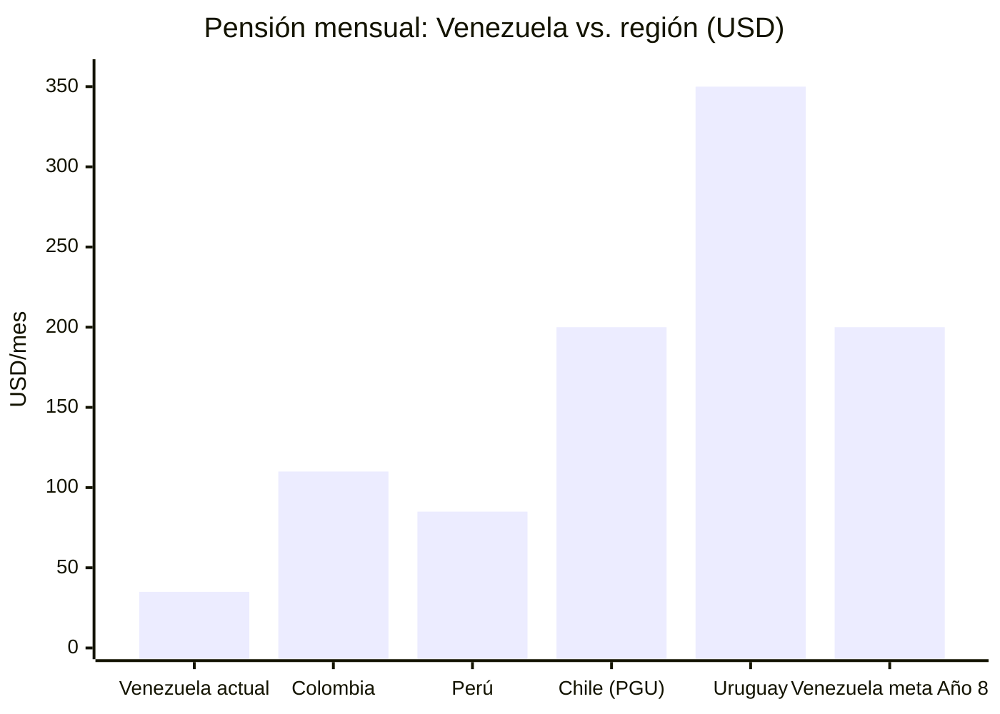
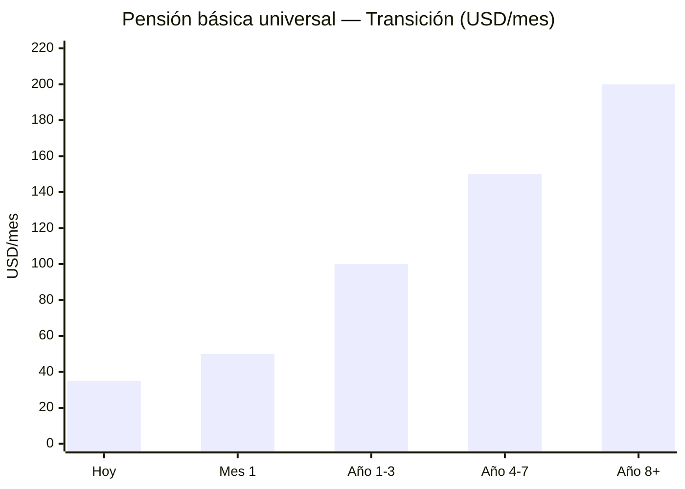

# Pensiones y Seguridad Social: La Deuda Con los Mayores

:::caution Fechas ilustrativas — las fases se activan por KPIs, no por calendario
Las referencias a "Año X" en este documento son **ilustrativas**. Las fases reales se activan por condiciones verificables (PIB/cápita, formalización, pobreza). Ver [KPIs de Activación](/07-ejecucion/kpis-activacion).
:::

> Un país que no cuida a sus jubilados no merece un fondo de inversión.

## Diagnóstico: El Colapso

El salario mínimo de Venezuela está congelado en 130 bolívares desde marzo 2022. Los pensionados reciben el equivalente a [USD 3,50–7/mes](https://misionverdad.com/english/venezuelas-minimum-comprehensive-income-announcements-thorough-reading) en pensión base más bonos de "guerra económica" de ~USD 25–70/mes. Total: **~USD 30–75/mes** para un jubilado.

| Indicador | Dato | Contexto |
|-----------|------|----------|
| Pensión base | ~130 bolívares/mes | [Congelada desde 2022](https://misionverdad.com/english/venezuelas-minimum-comprehensive-income-announcements-thorough-reading) |
| Bonos adicionales | ~USD 25–70/mes | Variables, no constitucionales |
| Ingreso total pensionado | ~USD 30–75/mes | Insuficiente para canasta básica |
| Canasta básica alimentaria | ~USD 400+/mes (est.) | Datos CENDA/ENCOVI |
| Pensionados estimados | ~5 M personas | IVSS + Misión Amor Mayor |
| Sistema | PAYG (reparto) | [Sin fondo de reserva](https://www.ssa.gov/policy/docs/progdesc/ssptw/2018-2019/americas/venezuela.html) |

:::danger Ley de Protección de Pensiones (2024)
En mayo 2024, el gobierno promulgó la ["Ley para la Protección de las Pensiones de Seguridad Social"](https://central-law.com/en/venezuela-law-on-the-protection-of-social-security-pensions/), que establece un impuesto de hasta **15% sobre la nómina del sector privado** para financiar pensiones. Solución que castiga al empleo formal en vez de capitalizar el sistema.
:::

## Propuesta: Subcuenta Retiro del FCV + Pensión Universal

:::info La pensión NO es un sistema separado
Es la **Subcuenta Retiro del Fondo Ciudadano Venezuela (FCV)**, que también cubre salud, vivienda y educación en una sola cuenta personal. Administrada por un **ente autónomo público** (tipo [CPF Board de Singapur](https://www.cpf.gov.sg/)), NO por AFPs privadas. Ver [Modelo de Estado: FCV](/04-gobernanza/modelo-estado#fondo-ciudadano-venezuela-fcv-una-sola-cuenta-cero-burocracia).
:::

| Componente | Descripción | Modelo |
|-----------|-------------|--------|
| **Pilar 1: Pensión básica universal** | USD 100–200/mes para TODO jubilado (financiado por impuestos + rendimientos del Fondo de Inversión Venezuela S.A.) | [Alaska PFD](https://pfd.alaska.gov/) + Chile Pensión Garantizada Universal |
| **Pilar 2: Subcuenta Retiro del FCV** | 8% del salario → 10% en madurez. Cuenta individual dentro del FCV, administrada por ente autónomo tipo CPF Board. Parte del 21% total del FCV (10% trabajador + 11% empleador) | [Singapur CPF Special Account](https://www.cpf.gov.sg/) |
| **Pilar 3: Ahorro voluntario** | Incentivos fiscales para ahorro adicional sobre el FCV | 401(k) EE.UU. / Colombia fondo voluntario |
| **Pilar 4: Dividendo ciudadano** | Complemento del Fondo de Inversión Venezuela S.A. (USD 125–200/año a todos) | Ver [Inversión Ciudadana](/03-ciudadanos/inversion-ciudadana) |

### Financiamiento del Pilar 1 (Pensión Básica — de impuestos, NO del FCV)

| Escenario | Costo anual | Financiamiento |
|-----------|------------|----------------|
| 5 M jubilados × USD 100/mes | USD 6.000 M/año | Presupuesto estatal (15% flat + 12% IVA) |
| 5 M jubilados × USD 150/mes | USD 9.000 M/año | Presupuesto + rendimientos parciales del Fondo de Inversión Venezuela S.A. |
| 5 M jubilados × USD 200/mes | USD 12.000 M/año | Rendimientos del Fondo de Inversión Venezuela S.A. (año 10+) |

### Transición

| Fase | Pensión básica | Fuente | Plazo |
|------|---------------|--------|-------|
| Emergencia | USD 50/mes (vs. USD 30 actual) | Presupuesto + oil revenue | Mes 1 |
| Estabilización | USD 100/mes | Presupuesto | Año 1–3 |
| Crecimiento | USD 150/mes | Presupuesto + rendimientos fondo | Año 4–7 |
| Madurez | USD 200+/mes + dividendo ciudadano | Rendimientos del Fondo de Inversión Venezuela S.A. | Año 8+ |

### Contribución al Pilar 2 (Subcuenta Retiro del FCV)

La Subcuenta Retiro NO es un sistema aislado — forma parte del FCV total que transiciona gradualmente:

| Fase | Años | FCV total | Subcuenta Retiro | Otras subcuentas |
|------|------|-----------|-----------------|-----------------|
| **Emergencia** | 1-3 | 14% | 8% | Salud 6% (100% contributivo) |
| **Estabilización** | 3-7 | 18% | 8% | Salud 6% + Vivienda 4% |
| **Construcción** | 7-12 | 21% | 8% | Salud 7% + Vivienda 4% + Educación 2% |
| **Madurez** | 12+ | 25% | 10% | Salud 7% + Vivienda 5% + Educación 3% |

:::tip Propiedad del trabajador
A diferencia del IVSS actual (reparto, sin fondo), la Subcuenta Retiro del FCV es **propiedad del trabajador**. Nadie se la quita. Si muere antes de jubilarse, el saldo pasa a sus herederos. No hay "caja negra" estatal.
:::

---

## Lección Argentina (Milei)

Bajo Milei, el poder adquisitivo de las jubilaciones [cayó del 50% al 26,6%](https://www.batimes.com.ar/news/economy/mileis-two-years-in-five-large-economic-and-social-indicators.phtml) de la canasta mínima. Venezuela S.A. propone lo contrario: **subir las pensiones desde el Día 1** como parte de la Fase 0 humanitaria. El Fondo de Inversión Venezuela S.A. es el mecanismo de largo plazo que lo hace sostenible.
