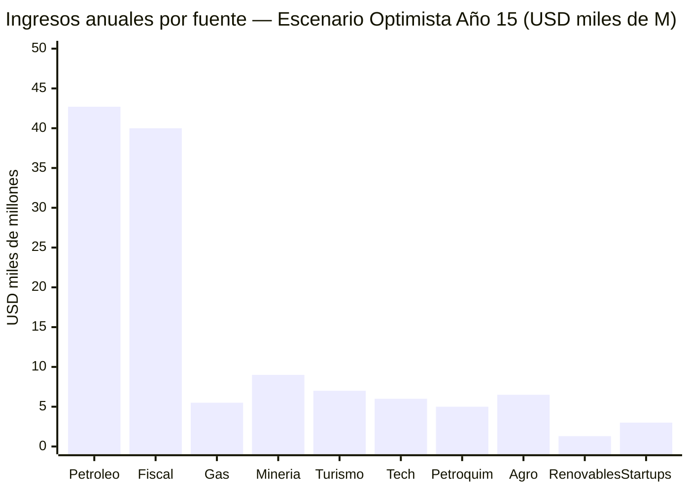
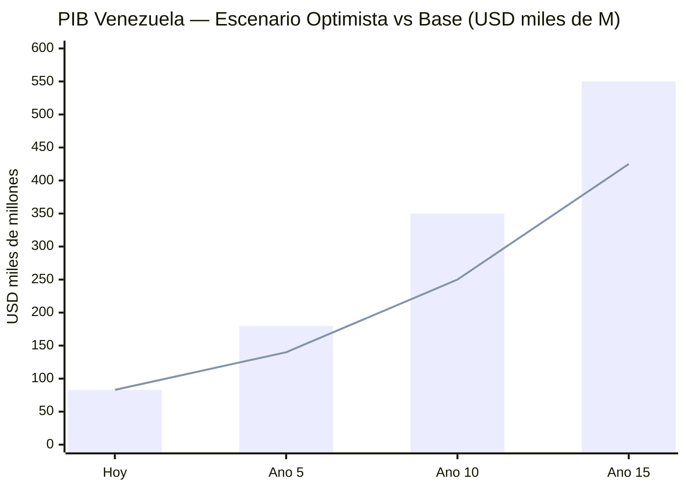
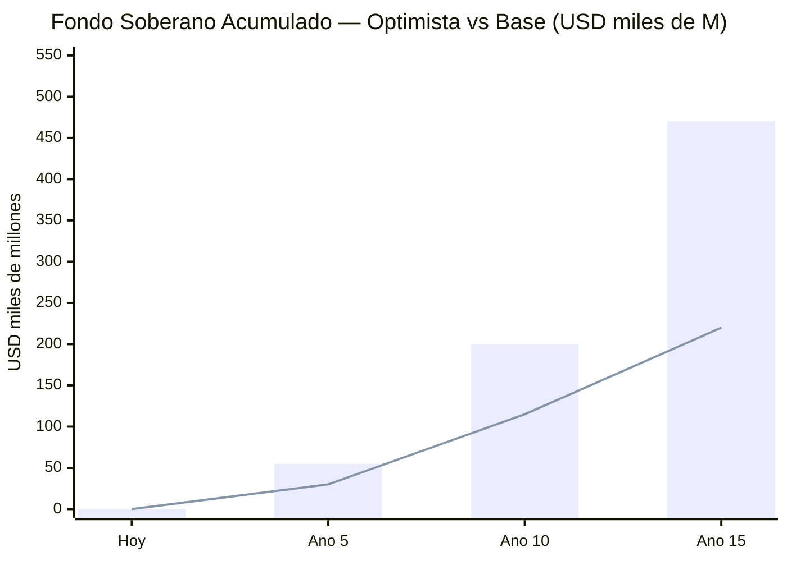
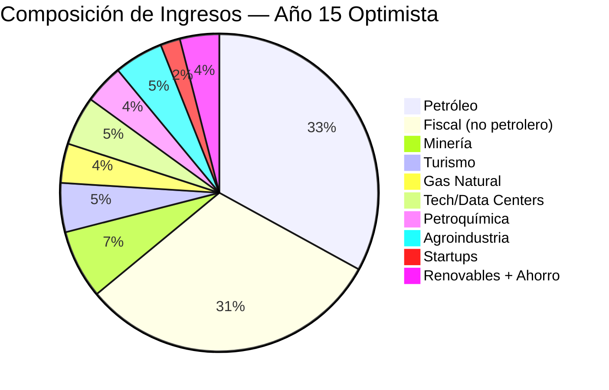
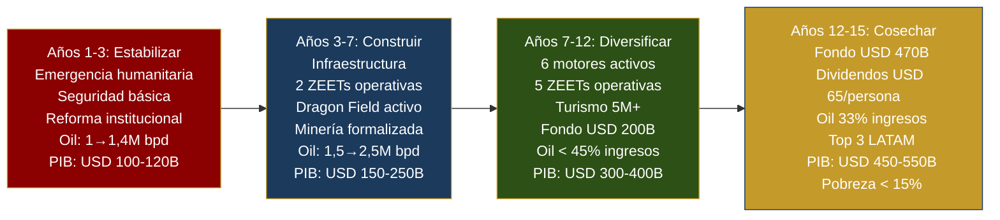

# El Sueño: Escenario Optimista Integrado

> ¿Qué pasa si todo funciona? Esta sección agrega TODAS las fuentes de ingreso del plan — petróleo a precio favorable, gas natural, turismo, minería, energías, tecnología, startups, estado eficiente — y muestra el escenario donde Venezuela maximiza su potencial.

:::caution Base de datos, no fantasía
Cada cifra aquí tiene fuente verificable. El escenario optimista no es inventado — es lo que pasa cuando se combinan las proyecciones favorables de cada motor, todas documentadas en sus secciones respectivas. Lo que lo hace "sueño" no son los números, sino que requiere que TODAS las condiciones se cumplan simultáneamente.
:::

---

## Condiciones Requeridas

Para que este escenario se materialice, deben cumplirse **todas** estas condiciones:

| # | Condición | Probabilidad | Dependencia |
|---|-----------|-------------|-------------|
| 1 | Transición política pacífica y estado de derecho funcional | Media | Geopolítica |
| 2 | Brent promedio ≥ USD 70-80/barril durante 15 años | Media-Alta | Mercado global |
| 3 | Ramp-up de producción petrolera a 2,75-3 M bpd (timeline [Rystad](https://www.rigzone.com/news/could_venezuela_production_get_back_to_3mm_barrels_per_day-08-jan-2026-182716-article/)) | Media | Inversión + infraestructura |
| 4 | Seguridad jurídica para inversión extranjera | Media | Reforma institucional |
| 5 | Formalización del sector minero (hoy 75+ ton oro ilegal/año) | Media-Baja | Seguridad + gobernanza |
| 6 | Infraestructura eléctrica rehabilitada (Guri + red de transmisión) | Media | Capital + tiempo |
| 7 | Acuerdos internacionales de gas (Dragon Field + Colombia + LNG) | Alta | Ya firmados parcialmente |
| 8 | Demanda global de data centers y energía limpia sostiene crecimiento | Alta | Tendencia AI/cloud |
| 9 | Reforma fiscal implementada (15% flat + 12% IVA) | Media | Voluntad política |
| 10 | Estado reducido a 5 funciones con <18% PIB en gasto | Media | Reforma administrativa |

---

## Las 10 Fuentes de Ingreso

### 1. Petróleo (Escenario Boom: USD 80/barril)

| Métrica | Año 5 | Año 10 | Año 15 |
|---------|--------|---------|---------|
| Producción | 1,75 M bpd | 2,25 M bpd | 2,75 M bpd |
| Precio | USD 80/bbl | USD 80/bbl | USD 80/bbl |
| Costo/barril | USD 37,50 | USD 37,50 | USD 37,50 |
| Margen/barril | USD 42,50 | USD 42,50 | USD 42,50 |
| **Ingreso neto** | **USD 27.147 M** | **USD 34.914 M** | **USD 42.681 M** |

Fuente: Modelo de stress test en [Proyecciones](/07-ejecucion/proyecciones). Costo barril USD 35-40 incluye extracción + dilución + transporte + procesamiento de crudo pesado.

---

### 2. Gas Natural

Venezuela tiene las [7mas reservas mundiales: 5.500 BCM](https://www.congress.gov/crs-product/IF12448) (~195 TCF). Producción actual: cero exportaciones.

| Proyecto | Ingreso estimado | Estado | Fuente |
|----------|-----------------|--------|--------|
| Dragon Field (Trinidad) | USD 500 M/año | [Alianza 30 años firmada](https://venezuelanalysis.com/news/venezuela-signs-30-year-alliance-with-trinidad-to-develop-dragon-gas-field/) | Venezuelanalysis |
| Exportación a Colombia | USD 800 M/año | Gasoducto existente | [RBAC Inc.](https://rbac.com/beyond-oil-could-venezuela-be-a-natural-gas-powerhouse/) |
| LNG expandido (trenes Trinidad) | USD 4.000 M/año | Infraestructura parcial | [J.P. Morgan](https://www.jpmorgan.com/insights/global-research/commodities/venezuela-oil-lng) |
| Gas doméstico (sustitución diésel) | USD 700 M/año ahorro | Optimización interna | Columbia SIPA |
| **Total gas** | **USD 5.000-6.000 M/año** | | |

---

### 3. Minería y Minerales Estratégicos

El [Arco Minero del Orinoco](https://www.csis.org/analysis/venezuela-critical-minerals-target) cubre ~12% del territorio nacional. Reservas estimadas (requieren verificación independiente):

| Mineral | Reservas | Ingreso potencial/año | Fuente |
|---------|----------|----------------------|--------|
| Oro | [74,98 M onzas](https://www.mining.com/web/venezuelas-oil-and-mining-sectors-large-potential-weak-infrastructure/) (2.343 ton) | USD 4.400 M (a 75 ton/año) | OECD 2021 |
| Hierro (Cerro Bolívar) | [18.000 M ton](https://pubs.usgs.org/myb/vol3/2017-18/myb3-2017-18-venezuela.pdf) (64,4% Fe) | USD 2.250-3.000 M | USGS |
| Bauxita/Aluminio | [3.479 M ton bauxita](https://pubs.usgs.org/myb/vol3/2019/myb3-2019-venezuela.pdf) / 640K ton Al capacidad | USD 770-900 M | USGS |
| Coltan | Depósitos significativos (sin verificación independiente) | USD 200-500 M | CSIS |
| Diamantes | 1.000+ M quilates | USD 300-600 M | Gov. estimates |
| Tierras raras | 300.000+ ton métricas (sin verificación) | USD 200-400 M | Estimaciones |
| Níquel | [340 M ton](https://www.newsweek.com/map-shows-venezuela-critical-minerals-us-coltan-bauxite-11344086) (estratégico para EV) | USD 500-1.000 M | Newsweek |
| **Total minería** | | **USD 8.000-10.000 M/año** | |

:::warning Verificación pendiente
La mayoría de estas reservas NO han sido verificadas por agencias geológicas independientes. El valor real depende de exploración profesional y auditorías internacionales. La cifra de USD 2 trillones para el Arco Minero es una estimación gubernamental sin verificación.
:::

**Requisito crítico:** Formalizar la minería ilegal (hoy ~75 ton oro/año = [USD 4.800 M sin control](https://investornews.com/market-opinion/venezuelas-resource-paradox-critical-minerals-oil-and-the-price-of-mismanagement/)) y restaurar seguridad en zonas mineras controladas por grupos armados.

---

### 4. Data Centers y Tecnología

Mercado LATAM: [USD 7.160 M (2024) → USD 14.300 M (2030)](https://www.businesswire.com/news/home/20250505397648/en/), CAGR 12,22%.

| Componente | Ingreso Año 15 | Base |
|-----------|---------------|------|
| Data centers (5-10% mercado LATAM) | USD 1.400-2.800 M | [Guri 10.200 MW](https://www.power-technology.com/projects/gurihydroelectric/) energía barata 24/7 |
| ZEETs (5 zonas tech) | USD 2.000-3.000 M | Modelo [Shenzhen](https://en.wikipedia.org/wiki/Shenzhen)/Dubái |
| Servicios tech/outsourcing | USD 1.000-2.000 M | Talento diáspora retornada |
| **Total tech** | **USD 4.400-7.800 M/año** | |

Referencia: Amazon invirtió [USD 4.000 M en Chile](https://www.mordorintelligence.com/industry-reports/south-america-data-center-market) por energía solar. Venezuela ofrece hidroeléctrica (más barata, 24/7, más limpia).

---

### 5. Turismo

| Activo | Comparador | Potencial |
|--------|-----------|-----------|
| Salto Ángel, Canaima (UNESCO) | Costa Rica (3,2M turistas = USD 4.000 M) | Eco/aventura premium |
| Los Roques, Margarita | Rep. Dominicana (10M = USD 9.000 M) | Sol y playa |
| Gran Sabana, Delta Orinoco | Perú (Machu Picchu) | Turismo científico |
| Mérida, Andes | Colombia (6M = USD 6.000 M) | Montaña/cultura |

| Métrica | Conservador | Optimista |
|---------|------------|-----------|
| Turistas/año | 5 M | 10 M |
| Gasto promedio | USD 800 | USD 1.000 |
| **Ingreso** | **USD 4.000 M** | **USD 10.000 M** |

**Inversión requerida:** USD 3.000-5.000 M en 10 años (aeropuertos, hoteles, seguridad, marketing, marca país).

---

### 6. Petroquímica

Refinerías existentes (Paraguaná, Amuay, Cardón) operan a [<20% de capacidad](https://www.reuters.com/business/energy/). Rehabilitadas y diversificadas:

| Producto | Mercado | Ingreso potencial |
|----------|---------|-------------------|
| Fertilizantes (urea, amoníaco) | LATAM agrícola | USD 1.500-2.500 M |
| Plásticos y resinas | Doméstico + export | USD 1.000-2.000 M |
| Asfalto | Infraestructura LATAM | USD 500-1.000 M |
| Metanol/Químicos | Industria global | USD 500-1.000 M |
| **Total petroquímica** | | **USD 3.500-6.500 M/año** |

---

### 7. Agroindustria

Venezuela importa >70% de alimentos pese a tener los Llanos (tierras fértiles + agua del Orinoco).

| Rubro | Meta | Ingreso |
|-------|------|---------|
| Soberanía alimentaria | Reducir importaciones 70% → 20% | USD 3.000-4.000 M ahorro |
| Cacao premium | Top 5 exportador mundial | USD 500-800 M |
| Café specialty | Recuperar posición histórica | USD 300-500 M |
| Acuicultura (camarón) | Modelo Ecuador | USD 500-1.000 M |
| Frutas tropicales procesadas | Caribe + Europa | USD 300-500 M |
| Ganadería/Carne | Llanos → exportación | USD 500-1.000 M |
| **Total agroindustria** | | **USD 5.000-8.000 M/año** |

---

### 8. Energías Renovables (Exportación)

[74% de electricidad ya es renovable](https://www.energypolicy.columbia.edu/more-efficient-use-of-venezuelas-natural-gas-could-strengthen-the-regions-energy-security-and-the-countrys-electricity-sector/) (hidroeléctrica).

| Fuente | Capacidad | Ingreso |
|--------|-----------|---------|
| Hidroeléctrica expandida | [18.000 MW Cascada Caroní](https://news.mongabay.com/2023/08/hydropower-in-the-pan-amazon-the-guri-complex-and-the-caroni-cascade/) a plena capacidad | Soporte a data centers + industria |
| Solar (Falcón, Zulia) | >5 kWh/m²/día irradiación | USD 300-500 M exportación |
| Eólica (Paraguaná) | Potencial significativo | USD 200-400 M |
| Exportación eléctrica (Colombia/Brasil) | Interconexión existente | USD 500-800 M |
| **Total renovables** | | **USD 1.000-1.700 M/año** |

---

### 9. Startups y Ecosistema de Innovación

| Componente | Modelo | Ingreso Año 15 |
|-----------|--------|---------------|
| 5 ZEETs operativas | Shenzhen, Dubái, Estonia | Tasas + impuestos corporativos |
| Aceleradoras (50+/año) | Israel: 6.000 startups en 20 años | Equity + empleos |
| Talento diáspora retornada (300K+) | India reverse brain drain | Capital humano |
| Venture capital local | Fondo soberano como LP | Retornos de portfolio |
| **Contribución total ecosistema** | | **USD 2.000-4.000 M/año** |

---

### 10. Estado Eficiente (Ahorro como Ingreso)

Reducir el Estado de 34 a 15 ministerios y automatizar con modelo [Estonia e-gov](https://digital-strategy.ec.europa.eu/en/factpages/estonia-2024-digital-decade-country-report):

| Reforma | Ahorro anual | Base |
|---------|-------------|------|
| Fusión de ministerios (34→15) | USD 2.000-4.000 M | [Modelo Singapur: 17% PIB](https://www.mof.gov.sg/singaporebudget) |
| Digitalización (99% trámites online) | USD 1.000-2.000 M | Estonia: 2% PIB ahorrado |
| Eliminación duplicidades y burocracia | USD 1.000-2.000 M | Benchmark OCDE |
| Recaudación fiscal eficiente (15% flat + 12% IVA) | USD 35.000-45.000 M recaudación total | Sobre PIB de USD 350-500B |
| **Ahorro neto del Estado eficiente** | **USD 4.000-8.000 M/año** | |

---

## Consolidación: El Sueño en Números

### Tabla consolidada Año 15

| # | Fuente | Rango (USD M/año) | Escenario optimista |
|---|--------|-------------------|---------------------|
| 1 | Petróleo neto (2,75M bpd × $80) | 38.000-47.000 | **42.681** |
| 2 | Recaudación fiscal (15% + 12% IVA) | 35.000-45.000 | **40.000** |
| 3 | Gas natural (Dragon + Colombia + LNG) | 5.000-6.000 | **5.500** |
| 4 | Minería (oro + hierro + aluminio + otros) | 8.000-10.000 | **9.000** |
| 5 | Turismo (7-10M visitantes) | 4.000-10.000 | **7.000** |
| 6 | Data centers + Tech + ZEETs | 4.400-7.800 | **6.000** |
| 7 | Petroquímica | 3.500-6.500 | **5.000** |
| 8 | Agroindustria | 5.000-8.000 | **6.500** |
| 9 | Renovables (exportación eléctrica) | 1.000-1.700 | **1.350** |
| 10 | Startups/ecosistema innovación | 2.000-4.000 | **3.000** |
| | **SUBTOTAL INGRESOS BRUTOS** | | **~USD 126.000 M** |
| | Ahorro por estado eficiente | 4.000-8.000 | **6.000** |
| | **TOTAL RECURSOS DISPONIBLES** | | **~USD 132.000 M** |

### PIB Estimado Año 15

| Métrica | Base (USD 60) | Optimista (USD 80) |
|---------|--------------|-------------------|
| PIB Año 15 | USD 350-500B | **USD 450-550B** |
| PIB per cápita | USD 8.750-12.500 | **USD 11.250-13.750** |
| Ranking LATAM | Top 5 | **Top 3** (tras Brasil y México) |

---

## Fondo Soberano: El Motor de los Dividendos

En el escenario optimista, el fondo soberano se alimenta de:

| Fuente de aporte al fondo | % asignado | Aporte anual Año 15 |
|--------------------------|-----------|---------------------|
| Ingreso neto petrolero | 30% | USD 12.804 M |
| Regalías mineras | 15% del ingreso minero | USD 1.350 M |
| Excedente gas natural | 10% | USD 550 M |
| **Total aportes anuales** | | **USD 14.704 M** |

### Proyección del fondo (5,5% retorno anual compuesto)

| Métrica | Base (USD 60) | Optimista (USD 80) |
|---------|--------------|-------------------|
| Fondo Año 5 | USD 20-40B | **USD 45-65B** |
| Fondo Año 10 | USD 80-150B | **USD 170-230B** |
| Fondo Año 15 | USD 250-400B | **USD 400-540B** |
| Retorno anual (5,5%) | USD 13.750-22.000 M | **USD 22.000-29.700 M** |

**Comparación:** [Noruega alcanzó USD 2,2T](https://www.nbim.no/en/investments/the-funds-value/) en ~30 años con 5,3 M habitantes. Venezuela con 40 M habitantes alcanzaría USD 470B en 15 años — equivalente per cápita al fondo noruego en su año 18.

---

## Retorno para el Ciudadano-Accionista

### Dividendo directo (10% de ingresos netos del fondo)

| Escenario | Fondo Año 15 | Retorno 5,5% | Dividendo total (10%) | **Por persona/año** | **Familia de 4** |
|-----------|-------------|-------------|----------------------|---------------------|-----------------|
| Base ($60) | USD 220B | USD 12.100 M | USD 1.210 M | **USD 30** | **USD 120** |
| Favorable ($70) | USD 340B | USD 18.700 M | USD 1.870 M | **USD 47** | **USD 187** |
| **Optimista ($80)** | **USD 470B** | **USD 25.850 M** | **USD 2.585 M** | **USD 65** | **USD 258** |

### Retorno total por ciudadano (directo + indirecto)

| Beneficio | Valor anual/persona | Notas |
|-----------|-------------------|-------|
| Dividendo directo del fondo | USD 65 | 10% de retornos del fondo |
| Salud universal financiada | USD 250-400 | Pilar público (4-5% PIB) |
| Educación pública de calidad | USD 200-350 | Modelo Estonia (4-5% PIB) |
| Pensión básica universal | USD 120-200 | Pilar 1 contributivo |
| Seguridad ciudadana | USD 100-150 | <20 homicidios/100K |
| Internet 50+ Mbps | USD 50-100 | Estado digital |
| **Valor total por ciudadano** | **USD 785-1.265/año** | **vs. USD ~180 hoy** |

### Calidad de vida Año 15

| Indicador | Hoy | Escenario Optimista | Referencia |
|-----------|-----|---------------------|------------|
| Pobreza | 82,8% | <15% | Chile (10,8%) |
| PIB per cápita | USD 2.075 | USD 11.250-13.750 | Colombia actual (~USD 6.600) |
| Homicidios/100K | ~30-40 | <10 | Costa Rica (11) |
| Internet | <1 Mbps | 50+ Mbps | Uruguay (75 Mbps) |
| Esperanza de vida | ~72 años | 78+ años | Chile (80) |
| Emigración neta | -7,9 M | +500K retornados | Irlanda post-2000 |
| Pensión mínima | USD 3,50/mes | USD 250+/mes | Chile (USD 230) |

---

## Retorno para Inversionistas del Pre-Seed

Los 79.000 inversores de la diáspora que aportan USD 500 promedio (USD 39,5M total) en el Pre-Seed:

| Métrica | Valor |
|---------|-------|
| Inversión individual promedio | USD 500 |
| Total Pre-Seed | USD 39,5 M |
| Tipo de instrumento | Certificado ciudadano + derecho a dividendos preferentes |
| Dividendo preferente (primeros 10 años) | 2x el dividendo regular |
| Dividendo regular Año 15 (optimista) | USD 65/persona/año |
| **Dividendo Pre-Seed Año 15** | **USD 130/persona/año** |
| Payback period (optimista) | ~8-10 años |
| Valor adicional: servicios públicos | USD 720-1.200/año |
| Retorno total Año 15 | USD 850-1.330/persona/año |

:::tip El retorno real no es financiero
La inversión de USD 500 no busca retorno de venture capital. Busca:
1. Un país donde volver
2. Servicios públicos que funcionan para tu familia
3. Seguridad para tus padres que se quedaron
4. Oportunidades económicas en una economía de USD 550B
5. Dividendos perpetuos de un fondo soberano

El ROI verdadero: **pasar de emigrante a accionista de tu país.**
:::

---

## Distribución del PIB: De Petroestado a Economía Diversificada

**El petróleo pasa del 95% al 33% de ingresos totales.** Ya no es un petroestado — es una economía diversificada donde el petróleo es un motor importante pero no el único.

---

## Comparación Internacional

| País | Fondo Soberano | Habitantes | Per cápita | Años para lograrlo |
|------|---------------|-----------|------------|-------------------|
| Noruega | USD 2.200B | 5,3 M | USD 415.000 | 30 años |
| Singapur (GIC+Temasek) | USD 1.100B+ | 5,9 M | USD 186.000 | 40 años |
| Abu Dhabi (ADIA) | USD 993B | 3,8 M | USD 261.000 | 45 años |
| **Venezuela (optimista)** | **USD 470B** | **40 M** | **USD 11.750** | **15 años** |
| Alaska (APF) | USD 78B | 0,7 M | USD 111.000 | 40 años |

Venezuela tiene más habitantes pero también más recursos. El fondo per cápita es menor, pero el impacto en calidad de vida es transformacional dado el punto de partida (USD 2.075 PIB per cápita actual).

---

## Riesgos del Escenario Optimista

| Riesgo | Impacto | Mitigación |
|--------|---------|-----------|
| Petróleo cae a USD 50-60 | Fondo crece 50% más lento | Contratos forward con floor USD 55 |
| Transición política fracasa | Plan entero se retrasa 5-10 años | Pre-Seed opera sin gobierno |
| Minería no se formaliza | -USD 9.000 M/año | Priorizar oro + hierro con framework legal |
| Data centers eligen otros países | -USD 6.000 M/año | Energía sigue siendo ventaja competitiva |
| Corrupción captura valor | Fondos desviados | Blockchain + dashboard + whistleblower |
| Cambio climático reduce hidroeléctrica | Energía más cara | Diversificar con solar + eólica |

:::info Incluso si falla la mitad
Si solo se materializan el petróleo (a USD 60), el gas, y la reforma fiscal — sin turismo, sin minería, sin tech — el plan base sigue generando USD 80-100B/año y un fondo de USD 220-325B. El sueño es el upside. El plan base es el floor.
:::

---

## Timeline del Sueño

---

## Conclusión: ¿Es Posible?

Cada componente individual de este escenario ya existe en otro país:

| Componente | Ya lo hizo | Resultado |
|-----------|-----------|-----------|
| Fondo soberano de petróleo | Noruega | USD 2,2T en 30 años |
| Diversificación desde petróleo | Emiratos Árabes | Petróleo <30% PIB |
| Estado digital | Estonia | 99% servicios online |
| Reforma policial radical | Georgia | Corrupción eliminada en 2 años |
| Atracción de data centers | Chile | USD 4B de Amazon |
| Turismo desde cero | Rep. Dominicana | 10M turistas/año |
| Formalización minera | Perú, Colombia | Industrias reguladas |
| Revolución agrícola | Brasil | De importador a superpotencia |

**Lo que nadie ha hecho es combinar todo en un solo plan coherente.** Eso es Venezuela S.A.

> *"El sueño no es que Venezuela sea rica — ya lo es debajo del suelo. El sueño es que esa riqueza llegue a los 40 millones de personas que viven encima."*
