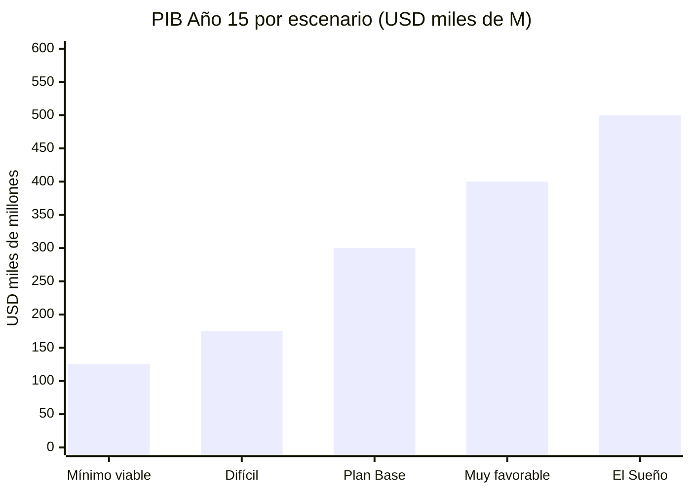
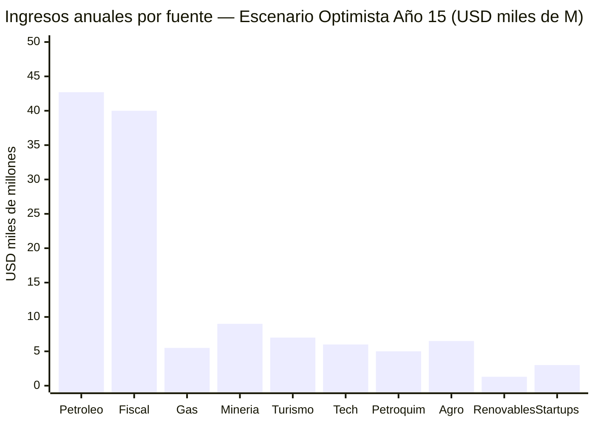
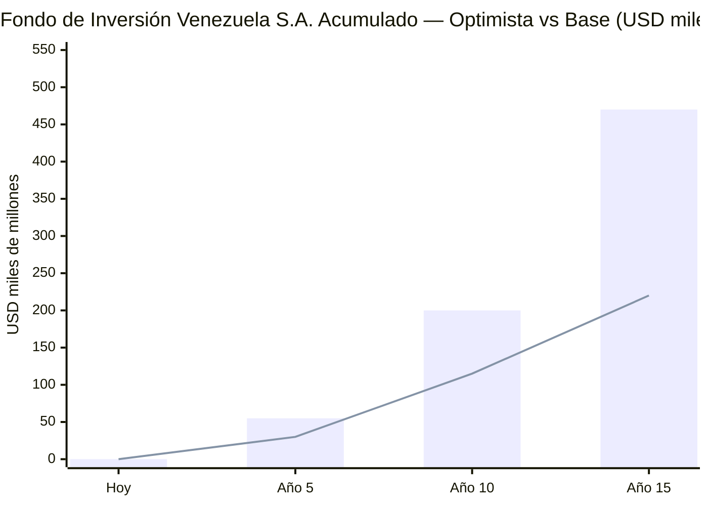
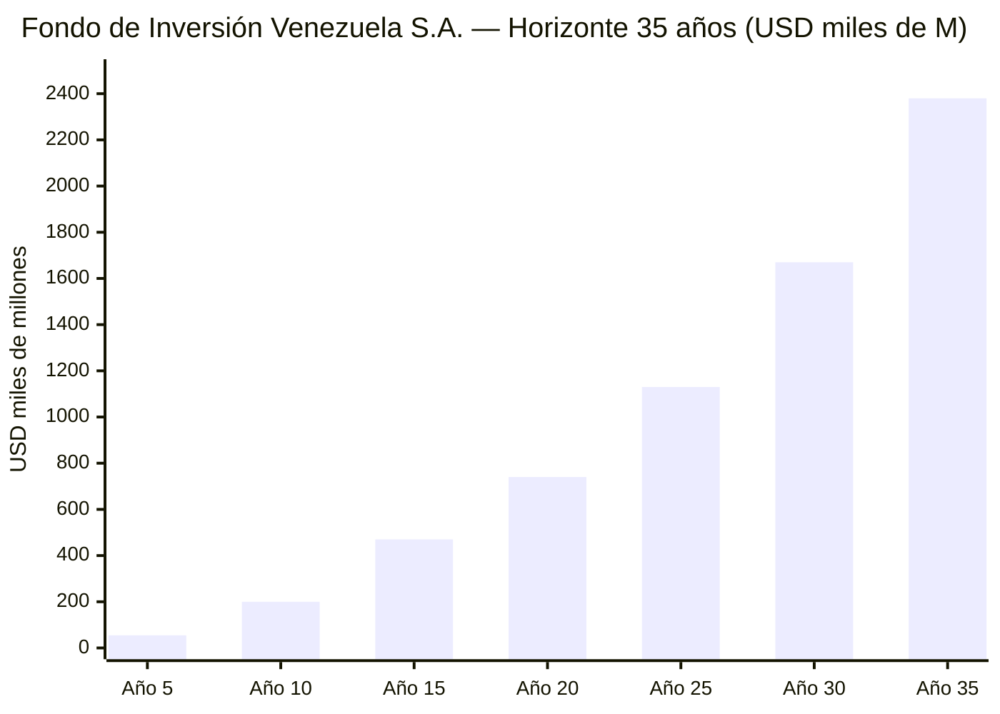
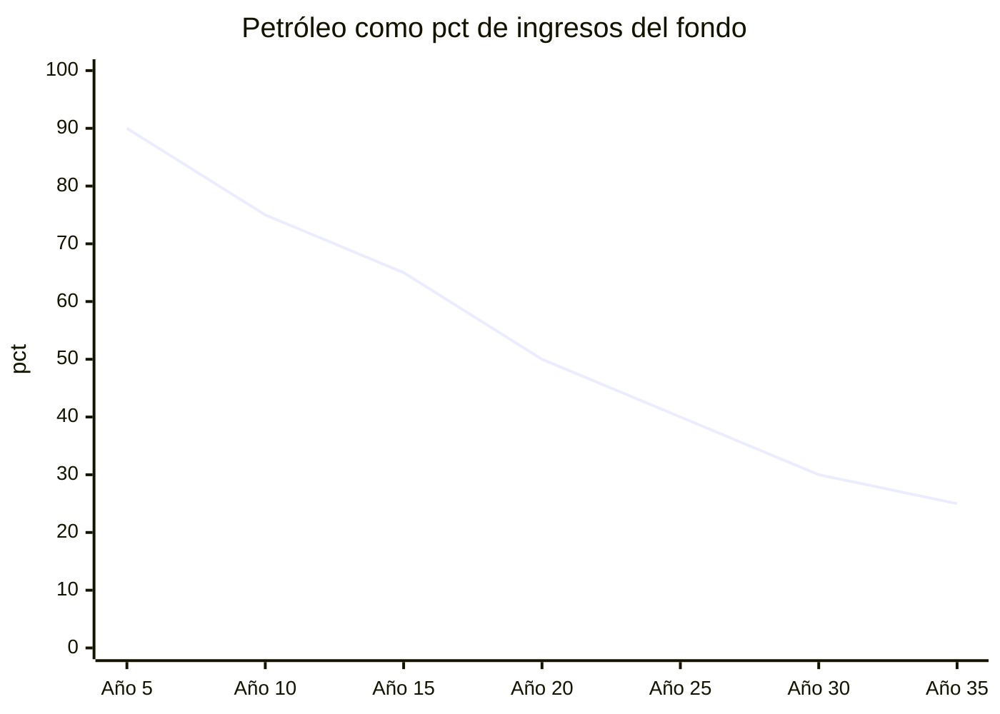
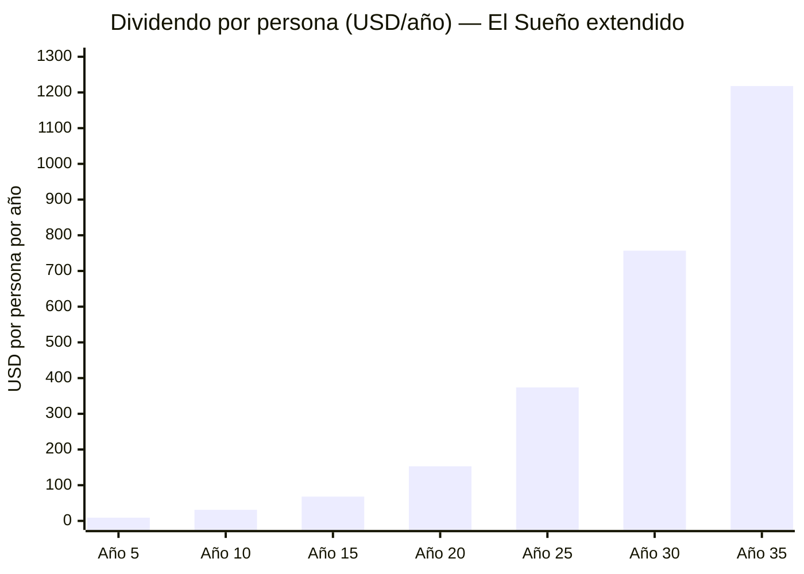
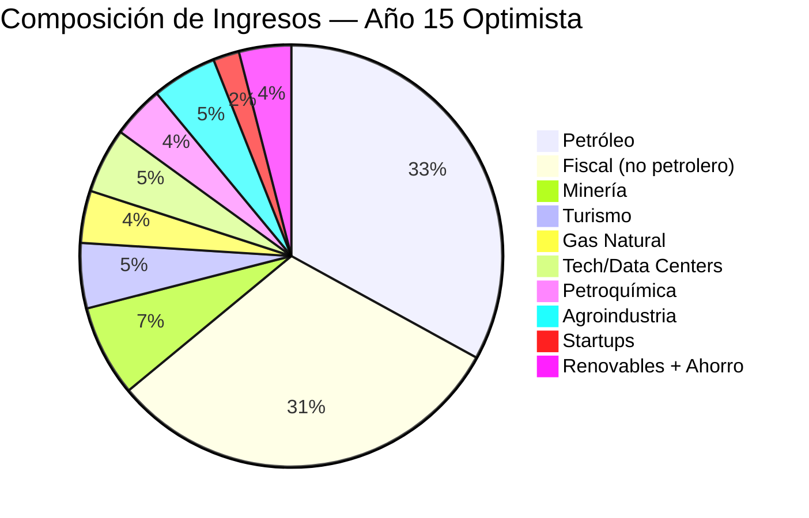
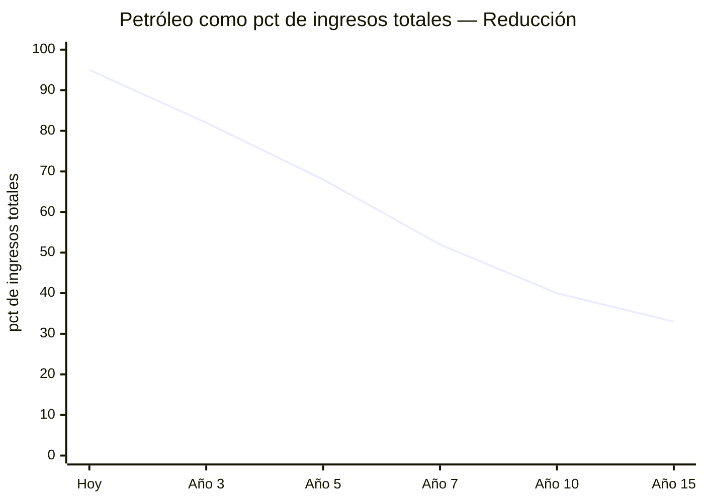
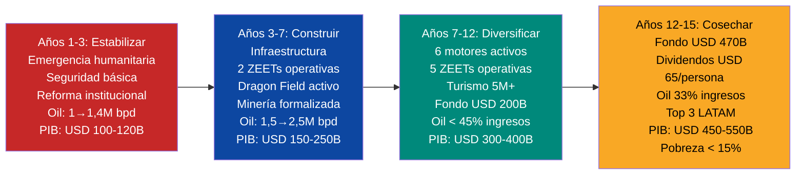

# El Sueño: Escenario Optimista Integrado

:::caution Fechas ilustrativas — las fases se activan por KPIs, no por calendario
Las referencias a "Año X" en este documento son **ilustrativas**. Las fases reales se activan por condiciones verificables (PIB/cápita, formalización, pobreza). Ver [KPIs de Activación](/07-ejecucion/kpis-activacion).
:::

> ¿Qué pasa si todo funciona? Esta sección consolida TODAS las fuentes de ingreso del plan — petróleo a precio favorable, gas natural, turismo, minería, energías, tecnología, startups, estado eficiente — y muestra el escenario donde Venezuela maximiza su potencial. El vehículo que hace posible el sueño no es un gobierno — es **Venezuela S.A.**, el holding corporativo de 40 millones de ciudadanos-accionistas que invierte, cobra regalías, administra el Fondo de Inversión Venezuela S.A. y distribuye dividendos. El Estado solo regula.

:::caution Base de datos, no fantasía
Cada cifra aquí tiene fuente verificable. El escenario optimista no es inventado — es lo que pasa cuando se combinan las proyecciones favorables de cada motor, todas documentadas en sus secciones respectivas. Lo que lo hace "sueño" no son los números, sino que requiere que TODAS las condiciones se cumplan simultáneamente.
:::

---

## Condiciones Requeridas

Para que este escenario se materialice, deben cumplirse **todas** estas condiciones:

| # | Condición | Probabilidad | Dependencia |
|---|-----------|-------------|-------------|
| 1 | Transición política pacífica y estado de derecho funcional | Alta | Geopolítica (intervención ene. 2026) |
| 2 | Brent promedio ≥ USD 70-80/barril durante 15 años | Alta | Mercado global (crisis Ormuz) |
| 3 | Ramp-up de producción petrolera a 2,75-3 M bpd (timeline [Rystad](https://www.rigzone.com/news/could_venezuela_production_get_back_to_3mm_barrels_per_day-08-jan-2026-182716-article/)) | Media-Alta | Inversión + infraestructura (USD 100B comprometidos, 5 majors) |
| 4 | Seguridad jurídica para inversión extranjera | Media-Alta | Reforma institucional (EE.UU. como garante de facto) |
| 5 | Formalización del sector minero (hoy 75+ ton oro ilegal/año) | Media-Baja | Seguridad + gobernanza |
| 6 | Infraestructura eléctrica rehabilitada (Guri + red de transmisión) | Media | Capital + tiempo |
| 7 | Acuerdos internacionales de gas (Dragon Field + Colombia + LNG) | Alta | Ya firmados parcialmente |
| 8 | Demanda global de data centers y energía limpia sostiene crecimiento | Alta | Tendencia AI/cloud |
| 9 | Reforma fiscal implementada (15% flat + 12% IVA) | Media | Voluntad política |
| 10 | Estado reducido a 5 funciones con <18% PIB en gasto | Media | Reforma administrativa |

---

## Probabilidad Real: Honestidad Brutal

La tabla anterior lista las condiciones como "Media" o "Alta". Cuantifiquemos.

| # | Condición | P(éxito) | Justificación |
|---|-----------|----------|---------------|
| 1 | Transición política pacífica | 70% | Transición ya ocurrió (intervención ene. 2026). Riesgo residual: consolidación institucional y resistencia interna |
| 2 | Brent ≥ USD 70-80 promedio 15 años | 75% | Crisis de Ormuz (mar. 2026) elimina ~20% del suministro global. Incluso post-resolución, la disrupción estructural sostiene precios 3-5 años mínimo [Requiere investigación] |
| 3 | Ramp-up a 2,75-3M bpd | 55% | USD 100B comprometidos por 5 majors (ExxonMobil, Chevron, Shell, TotalEnergies, BP). [Rystad Energy](https://www.rigzone.com/news/could_venezuela_production_get_back_to_3mm_barrels_per_day-08-jan-2026-182716-article/) timeline potencialmente acelerado de 15 a 8-10 años por urgencia geopolítica [Requiere investigación] |
| 4 | Seguridad jurídica | 50% | EE.UU. como garante de facto; reingreso a ICSID probable como condición de inversión de las 5 majors. Venezuela aún en puesto 177/190 en [Rule of Law Index](https://worldjusticeproject.org/rule-of-law-index/) pero con trayectoria ascendente |
| 5 | Formalización minera | 25% | Colombia lleva 30+ años intentando formalizar minería ilegal con resultados parciales |
| 6 | Rehabilitación eléctrica (Guri) | 50% | Infraestructura existe pero requiere USD 5-8B y 5-7 años ([Mongabay, 2023](https://news.mongabay.com/2023/08/hydropower-in-the-pan-amazon-the-guri-complex-and-the-caroni-cascade/)) |
| 7 | Acuerdos gas (Dragon + LNG) | 65% | [Dragon Field ya firmado](https://venezuelanalysis.com/news/venezuela-signs-30-year-alliance-with-trinidad-to-develop-dragon-gas-field/); LNG depende de sanciones |
| 8 | Demanda global data centers | 75% | Tendencia estructural IA/cloud. [IEA proyecta demanda eléctrica data centers 2x para 2030](https://www.iea.org/reports/electricity-2024) |
| 9 | Reforma fiscal implementada | 35% | Requiere transición política + consenso legislativo |
| 10 | Estado reducido a 5 funciones | 30% | Ningún país LATAM ha reducido su Estado a este nivel; Georgia 2004 es el caso más cercano |

### Probabilidad conjunta

Si las 10 condiciones fueran independientes (simplificación):

**P(todas) = 0.70 × 0.75 × 0.55 × 0.50 × 0.25 × 0.50 × 0.65 × 0.75 × 0.35 × 0.30 ≈ 0.09%**

Eso es ~1 en 1.100. Sigue siendo improbable — pero es **~5x más probable** que antes de la crisis del Medio Oriente (0.02%, 1 en 5.000). Eso demuestra cuánto importa el contexto geopolítico.

### Los escenarios que importan

| Escenario | Condiciones cumplidas | PIB Año 15 | Fondo de Inversión Venezuela S.A. | Pobreza |
|-----------|----------------------|-----------|---------------|---------|
| **El Sueño** (10/10) | Todas | USD 450-550B | USD 400-540B | <15% |
| **Muy favorable** (7-8/10) | Sin minería plena ni Estado mínimo | USD 350-450B | USD 250-400B | 15-25% |
| **Plan Base** (5-6/10) | Petróleo + gas + fiscal + seguridad parcial | USD 250-350B | USD 150-250B | 20-35% |
| **Escenario difícil** (3-4/10) | Solo petróleo + gas, reformas parciales | USD 150-200B | USD 50-100B | 35-50% |
| **Mínimo viable** (<3/10) | Petróleo limitado, sin reformas profundas | USD 100-150B | USD 20-50B | >50% |

*Nota: El fondo incluye todas las fuentes (petróleo + gas + minería + diversificación), no solo petróleo. Para el modelo petrolero aislado a USD 60, ver [stress test en Proyecciones](/07-ejecucion/proyecciones#análisis-de-sensibilidad-stress-test-por-precio-del-petróleo).*

:::info El Plan Base es lo que importa
El Sueño es el techo — el 100% del potencial. Pero el plan se diseña para el **Plan Base** (5-6 condiciones cumplidas): petróleo a USD 60, gas parcial, reforma fiscal gradual, seguridad mejorada. Eso ya triplica el PIB y saca a millones de la pobreza. Todo lo demás es upside.
:::

---

## Acelerador Geopolítico: Crisis del Medio Oriente (Marzo 2026)

:::info Cómo la crisis de Ormuz cambia el cálculo
La guerra con Irán y el cierre del Estrecho de Ormuz (marzo 2026) eliminaron ~20% del suministro petrolero global de un día para otro. Venezuela — con las reservas más grandes del mundo y un gobierno post-transición alineado con EE.UU. — pasó de ser un productor marginado a una pieza central de la seguridad energética occidental. Esto no cambia los fundamentos del plan, pero acelera dramáticamente el timeline y el compromiso de inversión.
:::

| Factor | Antes de Ormuz | Después de Ormuz |
|--------|---------------|-----------------|
| Precio del petróleo | USD 65-75/bbl | USD 100-120/bbl |
| Inversión comprometida | Solo Chevron (~USD 5B) | USD 100B (5 majors) [Requiere investigación] |
| Timeline a 3M bpd | 15 años (Rystad) | Potencialmente 8-10 años [Requiere investigación] |
| Relación con EE.UU. | Control unilateral | "New friend and partner" (Trump) [Requiere investigación] |
| Urgencia geopolítica | Baja | Máxima — EE.UU. necesita cada barril |
| Probabilidad del Sueño | ~0.02% (1 en 5.000) | ~0.09% (1 en 1.100) |

### Meta americana: +30-50% en 18-24 meses

EE.UU. ya tiene objetivos concretos de producción para Venezuela:

| Fuente | Meta | Timeline | Fuente |
|--------|------|----------|--------|
| **Chevron (Mark Nelson, VP)** | +50% sobre operaciones Chevron actuales | 18-24 meses | [CNBC, ene. 2026](https://www.cnbc.com/2026/01/28/venezuela-crude-oil-production-investment.html) |
| **Trump (ene. 2026)** | 30-50M barriles entregados a EE.UU. | Inmediato | [NPR](https://www.npr.org/2026/01/07/nx-s1-5668993/trump-us-30-million-barrels-oil-venezuela) |
| **Trump (feb. 2026)** | 80M barriles ya recibidos | Acumulado | [Washington Times](https://www.washingtontimes.com/news/2026/feb/24/trump-says-us-received-80-million-barrels-oil-venezuela/) |
| **Analistas** | +1M bpd adicional con reformas | 2 años | [CNBC](https://www.cnbc.com/2026/01/28/venezuela-crude-oil-production-investment.html) |
| **Rystad Energy** | 3M bpd (máximo) | 15 años + USD 183B | [Rystad/Rigzone](https://www.rigzone.com/news/could_venezuela_production_get_back_to_3mm_barrels_per_day-08-jan-2026-182716-article/) |

**Traducción para el plan:** La meta americana de corto plazo (1.5-2M bpd en 2 años) es compatible con nuestra Fase 1 (Estabilización). La meta Rystad de largo plazo (3M bpd en 15 años) sigue siendo el techo. Lo que cambia es que EE.UU. ahora tiene **incentivos para acelerar** — cada barril venezolano es un barril menos que dependen de Medio Oriente.

:::caution El precio base del plan sigue siendo USD 60/barril
La crisis es un acelerador, no un supuesto. Si Ormuz reabre mañana y el petróleo baja a $70, el plan sigue funcionando. Lo que cambia es la velocidad y el compromiso de inversión. Todo lo que está por encima de USD 60 va al Fondo de Inversión Venezuela S.A. como upside.
:::

### La ventana de ventanas

Esta es la combinación más favorable que Venezuela ha tenido en su historia moderna — y posiblemente la última antes de que la transición energética cierre la ventana del petróleo:

1. **Gobierno post-transición ya en funciones** — la condición política más difícil ya se cumplió (intervención enero 2026)
2. **Mayor disrupción de suministro desde los 1970s** — el cierre de Ormuz eliminó ~20 M bpd del mercado, creando urgencia real por suministro alternativo
3. **USD 100B comprometidos por 5 majors** — ExxonMobil, Chevron, Shell, TotalEnergies y BP autorizadas para operar. No es una promesa; es capital desplegándose [Requiere investigación]
4. **Voluntad política de EE.UU. al máximo** — el framing de Trump como "new friend and partner" refleja necesidad estratégica, no altruismo [Requiere investigación]
5. **Rollback de sanciones acelerado por necesidad** — lo que normalmente tomaría años de negociación diplomática se resuelve en semanas cuando cada barril importa

Si el plan no se ejecuta ahora, la ventana se cierra. El petróleo no va a valer más en 2040 — va a valer menos. Cada año de retraso es un año menos de combustible para financiar la transformación.

---

## Las 10 Fuentes de Ingreso

### 1. Petróleo (Escenario Boom: USD 80/barril)

| Métrica | Año 5 | Año 10 | Año 15 |
|---------|--------|---------|---------|
| Producción | 1,75 M bpd | 2,25 M bpd | 2,75 M bpd |
| Precio | USD 80/bbl | USD 80/bbl | USD 80/bbl |
| Costo/barril | USD 37,50 | USD 37,50 | USD 37,50 |
| Margen/barril | USD 42,50 | USD 42,50 | USD 42,50 |
| **Ingreso neto** | **USD 27.147 M** | **USD 34.914 M** | **USD 42.681 M** |

Fuente: Modelo de stress test en [Proyecciones](/07-ejecucion/proyecciones). Costo barril USD 35-40 incluye extracción + dilución + transporte + procesamiento de crudo pesado.

---

### 2. Gas Natural

Venezuela tiene las [7mas reservas mundiales: 5.500 BCM](https://www.congress.gov/crs-product/IF12448) (~195 TCF). Producción actual: cero exportaciones.

| Proyecto | Ingreso estimado | Estado | Fuente |
|----------|-----------------|--------|--------|
| Dragon Field (Trinidad) | USD 500 M/año | [Alianza 30 años firmada](https://venezuelanalysis.com/news/venezuela-signs-30-year-alliance-with-trinidad-to-develop-dragon-gas-field/) | Venezuelanalysis |
| Exportación a Colombia | USD 800 M/año | Gasoducto existente | [RBAC Inc.](https://rbac.com/beyond-oil-could-venezuela-be-a-natural-gas-powerhouse/) |
| LNG expandido (trenes Trinidad) | USD 4.000 M/año | Infraestructura parcial | [J.P. Morgan](https://www.jpmorgan.com/insights/global-research/commodities/venezuela-oil-lng) |
| Gas doméstico (sustitución diésel) | USD 700 M/año ahorro | Optimización interna | Columbia SIPA |
| **Total gas** | **USD 5.000-6.000 M/año** | | |

---

### 3. Minería y Minerales Estratégicos

El [Arco Minero del Orinoco](https://www.csis.org/analysis/venezuela-critical-minerals-target) cubre ~12% del territorio nacional. Reservas estimadas (requieren verificación independiente):

| Mineral | Reservas | Ingreso potencial/año | Fuente |
|---------|----------|----------------------|--------|
| Oro | [74,98 M onzas](https://www.mining.com/web/venezuelas-oil-and-mining-sectors-large-potential-weak-infrastructure/) (2.343 ton) | USD 4.400 M (a 75 ton/año) | OECD 2021 |
| Hierro (Cerro Bolívar) | [18.000 M ton](https://pubs.usgs.org/myb/vol3/2017-18/myb3-2017-18-venezuela.pdf) (64,4% Fe) | USD 2.250-3.000 M | USGS |
| Bauxita/Aluminio | [3.479 M ton bauxita](https://pubs.usgs.org/myb/vol3/2019/myb3-2019-venezuela.pdf) / 640K ton Al capacidad | USD 770-900 M | USGS |
| Coltan | Depósitos significativos (sin verificación independiente) | USD 200-500 M | CSIS |
| Diamantes | 1.000+ M quilates | USD 300-600 M | Gov. estimates |
| Tierras raras | 300.000+ ton métricas (sin verificación) | USD 200-400 M | Estimaciones |
| Níquel | [340 M ton](https://www.newsweek.com/map-shows-venezuela-critical-minerals-us-coltan-bauxite-11344086) (estratégico para EV) | USD 500-1.000 M | Newsweek |
| **Total minería** | | **USD 8.000-10.000 M/año** | |

:::warning Verificación pendiente
La mayoría de estas reservas NO han sido verificadas por agencias geológicas independientes. El valor real depende de exploración profesional y auditorías internacionales. La cifra de USD 2 trillones para el Arco Minero es una estimación gubernamental sin verificación.
:::

**Requisito crítico:** Formalizar la minería ilegal (hoy ~75 ton oro/año = [USD 4.800 M sin control](https://investornews.com/market-opinion/venezuelas-resource-paradox-critical-minerals-oil-and-the-price-of-mismanagement/)) y restaurar seguridad en zonas mineras controladas por grupos armados.

---

### 4. Data Centers y Tecnología

Mercado LATAM: [USD 7.160 M (2024) → USD 14.300 M (2030)](https://www.businesswire.com/news/home/20250505397648/en/), CAGR 12,22%.

| Componente | Ingreso Año 15 | Base |
|-----------|---------------|------|
| Data centers (5-10% mercado LATAM) | USD 1.400-2.800 M | [Guri 10.200 MW](https://www.power-technology.com/projects/gurihydroelectric/) energía barata 24/7 |
| ZEETs (5 zonas tech) | USD 2.000-3.000 M | Modelo [Shenzhen](https://en.wikipedia.org/wiki/Shenzhen)/Dubái |
| Servicios tech/outsourcing | USD 1.000-2.000 M | Talento diáspora retornada |
| **Total tech** | **USD 4.400-7.800 M/año** | |

Referencia: Amazon invirtió [USD 4.000 M en Chile](https://www.mordorintelligence.com/industry-reports/south-america-data-center-market) por energía solar. Venezuela ofrece hidroeléctrica (más barata, 24/7, más limpia).

---

### 5. Turismo

| Activo | Comparador | Potencial |
|--------|-----------|-----------|
| Salto Ángel, Canaima (UNESCO) | Costa Rica (3,2M turistas = USD 4.000 M) | Eco/aventura premium |
| Los Roques, Margarita | Rep. Dominicana (10M = USD 9.000 M) | Sol y playa |
| Gran Sabana, Delta Orinoco | Perú (Machu Picchu) | Turismo científico |
| Mérida, Andes | Colombia (6M = USD 6.000 M) | Montaña/cultura |

| Métrica | Conservador | Optimista |
|---------|------------|-----------|
| Turistas/año | 5 M | 10 M |
| Gasto promedio | USD 800 | USD 1.000 |
| **Ingreso** | **USD 4.000 M** | **USD 10.000 M** |

**Inversión requerida:** USD 3.000-5.000 M en 10 años (aeropuertos, hoteles, seguridad, marketing, marca país).

---

### 6. Petroquímica

Refinerías existentes (Paraguaná, Amuay, Cardón) operan a [<20% de capacidad](https://www.reuters.com/business/energy/). Rehabilitadas y diversificadas:

| Producto | Mercado | Ingreso potencial |
|----------|---------|-------------------|
| Fertilizantes (urea, amoníaco) | LATAM agrícola | USD 1.500-2.500 M |
| Plásticos y resinas | Doméstico + export | USD 1.000-2.000 M |
| Asfalto | Infraestructura LATAM | USD 500-1.000 M |
| Metanol/Químicos | Industria global | USD 500-1.000 M |
| **Total petroquímica** | | **USD 3.500-6.500 M/año** |

---

### 7. Agroindustria

Venezuela importa >70% de alimentos pese a tener los Llanos (tierras fértiles + agua del Orinoco).

| Rubro | Meta | Ingreso |
|-------|------|---------|
| Soberanía alimentaria | Reducir importaciones 70% → 20% | USD 3.000-4.000 M ahorro |
| Cacao premium | Top 5 exportador mundial | USD 500-800 M |
| Café specialty | Recuperar posición histórica | USD 300-500 M |
| Acuicultura (camarón) | Modelo Ecuador | USD 500-1.000 M |
| Frutas tropicales procesadas | Caribe + Europa | USD 300-500 M |
| Ganadería/Carne | Llanos → exportación | USD 500-1.000 M |
| **Total agroindustria** | | **USD 5.000-8.000 M/año** |

---

### 8. Energías Renovables (Exportación)

[74% de electricidad ya es renovable](https://www.energypolicy.columbia.edu/more-efficient-use-of-venezuelas-natural-gas-could-strengthen-the-regions-energy-security-and-the-countrys-electricity-sector/) (hidroeléctrica).

| Fuente | Capacidad | Ingreso |
|--------|-----------|---------|
| Hidroeléctrica expandida | [18.000 MW Cascada Caroní](https://news.mongabay.com/2023/08/hydropower-in-the-pan-amazon-the-guri-complex-and-the-caroni-cascade/) a plena capacidad | Soporte a data centers + industria |
| Solar (Falcón, Zulia) | >5 kWh/m²/día irradiación | USD 300-500 M exportación |
| Eólica (Paraguaná) | Potencial significativo | USD 200-400 M |
| Exportación eléctrica (Colombia/Brasil) | Interconexión existente | USD 500-800 M |
| **Total renovables** | | **USD 1.000-1.700 M/año** |

---

### 9. Startups y Ecosistema de Innovación

| Componente | Modelo | Ingreso Año 15 |
|-----------|--------|---------------|
| 5 ZEETs operativas | Shenzhen, Dubái, Estonia | Tasas + impuestos corporativos |
| Aceleradoras (50+/año) | Israel: 6.000 startups en 20 años | Equity + empleos |
| Talento diáspora retornada (300K+) | India reverse brain drain | Capital humano |
| Venture capital local | Fondo de Inversión Venezuela S.A. como LP | Retornos de portfolio |
| **Contribución total ecosistema** | | **USD 2.000-4.000 M/año** |

---

### 10. Estado Eficiente (Ahorro como Ingreso)

Reducir el Estado de 34 a 15 ministerios y automatizar con modelo [Estonia e-gov](https://digital-strategy.ec.europa.eu/en/factpages/estonia-2024-digital-decade-country-report):

| Reforma | Ahorro anual | Base |
|---------|-------------|------|
| Fusión de ministerios (34→15) | USD 2.000-4.000 M | [Modelo Singapur: 17% PIB](https://www.mof.gov.sg/singaporebudget) |
| Digitalización (99% trámites online) | USD 1.000-2.000 M | Estonia: 2% PIB ahorrado |
| Eliminación duplicidades y burocracia | USD 1.000-2.000 M | Benchmark OCDE |
| Recaudación fiscal eficiente (15% flat + 12% IVA) | USD 35.000-45.000 M recaudación total | Sobre PIB de USD 350-500B |
| **Ahorro neto del Estado eficiente** | **USD 4.000-8.000 M/año** | |

---

## Consolidación: El Sueño en Números

### Tabla consolidada Año 15

| # | Fuente | Rango (USD M/año) | Escenario optimista |
|---|--------|-------------------|---------------------|
| 1 | Petróleo neto (2,75M bpd × $80) | 38.000-47.000 | **42.681** |
| 2 | Recaudación fiscal (15% + 12% IVA) | 35.000-45.000 | **40.000** |
| 3 | Gas natural (Dragon + Colombia + LNG) | 5.000-6.000 | **5.500** |
| 4 | Minería (oro + hierro + aluminio + otros) | 8.000-10.000 | **9.000** |
| 5 | Turismo (7-10M visitantes) | 4.000-10.000 | **7.000** |
| 6 | Data centers + Tech + ZEETs | 4.400-7.800 | **6.000** |
| 7 | Petroquímica | 3.500-6.500 | **5.000** |
| 8 | Agroindustria | 5.000-8.000 | **6.500** |
| 9 | Renovables (exportación eléctrica) | 1.000-1.700 | **1.350** |
| 10 | Startups/ecosistema innovación | 2.000-4.000 | **3.000** |
| | **SUBTOTAL INGRESOS BRUTOS** | | **~USD 126.000 M** |
| | Ahorro por estado eficiente | 4.000-8.000 | **6.000** |
| | **TOTAL RECURSOS DISPONIBLES** | | **~USD 132.000 M** |

### PIB Estimado Año 15

| Métrica | Base (USD 60) | Optimista (USD 80) |
|---------|--------------|-------------------|
| PIB Año 15 | USD 350-500B | **USD 450-550B** |
| PIB per cápita | USD 8.750-12.500 | **USD 11.250-13.750** |
| Ranking LATAM | Top 5 | **Top 3** (tras Brasil y México) |

---

## Fondo de Inversión Venezuela S.A.: El Motor de los Dividendos

En el escenario optimista, el Fondo de Inversión Venezuela S.A. se alimenta de:

| Fuente de aporte al fondo | % asignado | Aporte anual Año 15 |
|--------------------------|-----------|---------------------|
| Ingreso neto petrolero | 30% | USD 12.804 M |
| Regalías mineras | 15% del ingreso minero | USD 1.350 M |
| Excedente gas natural | 10% | USD 550 M |
| **Total aportes anuales** | | **USD 14.704 M** |

### Proyección del fondo (5,5% retorno anual compuesto)

| Métrica | Base (USD 60) | Optimista (USD 80) |
|---------|--------------|-------------------|
| Fondo Año 5 | USD 20-40B | **USD 45-65B** |
| Fondo Año 10 | USD 80-150B | **USD 170-230B** |
| Fondo Año 15 | USD 250-400B | **USD 400-540B** |
| Retorno anual (5,5%) | USD 13.750-22.000 M | **USD 22.000-29.700 M** |

**Comparación:** [Noruega alcanzó USD 2,2T](https://www.nbim.no/en/investments/the-funds-value/) en ~30 años con 5,3 M habitantes. Venezuela con 40 M habitantes alcanzaría USD 470B en 15 años — equivalente per cápita al fondo noruego en su año 18.

---

## Retorno para el Ciudadano-Accionista

### Dividendo directo (10% de ingresos netos del fondo)

| Escenario | Fondo Año 15 | Retorno 5,5% | Dividendo total (10%) | **Por persona/año** | **Familia de 4** |
|-----------|-------------|-------------|----------------------|---------------------|-----------------|
| Base ($60) | USD 220B | USD 12.100 M | USD 1.210 M | **USD 30** | **USD 120** |
| Favorable ($70) | USD 340B | USD 18.700 M | USD 1.870 M | **USD 47** | **USD 187** |
| **Optimista ($80)** | **USD 470B** | **USD 25.850 M** | **USD 2.585 M** | **USD 65** | **USD 258** |

### Retorno total por ciudadano (directo + indirecto)

| Beneficio | Valor anual/persona | Notas |
|-----------|-------------------|-------|
| Dividendo directo del fondo | USD 65 | 10% de retornos del fondo |
| Salud (FCV Salud: 7% contribución) | USD 250-400 | Cobertura universal. Tramo A/B: sin copago. Tramo C: 10%. Tramo D: 20% |
| Educación (voucher puntos K-12 + FCV Educación) | USD 200-350 | Voucher sigue al estudiante; +50% para bajos ingresos (SEP). Universidad por mérito |
| Pensión (FCV Retiro: 7-9%) | USD 120-200 | Pilar 1 universal + Subcuenta Retiro del FCV |
| Seguridad ciudadana | USD 100-150 | <20 homicidios/100K |
| Internet 50+ Mbps | USD 50-100 | Tarifa de mercado (competencia 5G SA) |
| **Valor total por ciudadano** | **USD 785-1.265/año** | **vs. USD ~180 hoy** |

### Calidad de vida Año 15

| Indicador | Hoy | Escenario Optimista | Referencia |
|-----------|-----|---------------------|------------|
| Pobreza | 82,8% | <15% | Chile (10,8%) |
| PIB per cápita | USD 2.075 | USD 11.250-13.750 | Colombia actual (~USD 6.600) |
| Homicidios/100K | ~30-40 | <5 | Chile (4,6) |
| Internet | <1 Mbps | 50+ Mbps | Uruguay (75 Mbps) |
| Esperanza de vida | ~72 años | 78+ años | Chile (80) |
| Emigración neta | -7,9 M | +500K retornados | Irlanda post-2000 |
| Pensión mínima | USD 3,50/mes | USD 250+/mes | Chile (USD 230) |

---

## Retorno para Inversionistas del Pre-Seed

Los 79.000 inversores de la diáspora que aportan USD 500 promedio (USD 39,5M total) en el Pre-Seed:

| Métrica | Valor |
|---------|-------|
| Inversión individual promedio | USD 500 |
| Total Pre-Seed | USD 39,5 M |
| Tipo de instrumento | Certificado ciudadano + derecho a dividendos preferentes |
| Dividendo preferente (primeros 10 años) | 2x el dividendo regular |
| Dividendo regular Año 15 (optimista) | USD 65/persona/año |
| **Dividendo Pre-Seed Año 15** | **USD 130/persona/año** |
| Payback period (optimista) | ~8-10 años |
| Valor adicional: servicios públicos | USD 720-1.200/año |
| Retorno total Año 15 | USD 850-1.330/persona/año |

:::tip El retorno real no es financiero
La inversión de USD 500 no busca retorno de venture capital. Busca:
1. Un país donde volver
2. Servicios públicos que funcionan para tu familia
3. Seguridad para tus padres que se quedaron
4. Oportunidades económicas en una economía de USD 550B
5. Dividendos perpetuos de un Fondo de Inversión Venezuela S.A.

El ROI verdadero: **pasar de emigrante a accionista de tu país.**
:::

---

## El Camino hacia USD 1.200: Horizonte Generacional

:::caution Aspiración direccional, no proyección
Todo lo que sigue del año 15 al 35 es una **aspiración fundamentada**, no una proyección. Los modelos a 35 años no predicen — señalan dirección. Las variables de los años 20-35 (retorno del fondo, IA, transición energética, demografía) tienen márgenes de error tan amplios que cualquier número específico es indicativo. Se incluyen porque un plan sin norte a largo plazo no inspira, pero se leen como: *"si hacemos esto bien durante 15 años, este es el techo alcanzable en los siguientes 20."*
:::

El dividendo de USD 65/persona en el año 15 es solo el comienzo. A medida que el fondo crece por interés compuesto, la economía se diversifica, el Estado se reduce con IA, las pensiones contributiva (Pilar 1)s se transforman en contributivas, y los impuestos bajan — **más valor fluye directamente al ciudadano.**

### Proyección Poblacional

| Año | Población residente | Diaspora | Retornados acum. | Fuente/Supuesto |
|-----|-------------------|----------|-------------------|----------------|
| 0 (2027) | 32 M | 7,9 M | — | [ENCOVI/UCAB 2023](https://www.proyectoencovi.com/) |
| 5 | 33,5 M | 7,2 M | 500K | Crecimiento natural 0.8%/año + retorno parcial |
| 10 | 36 M | 5,9 M | 1,5 M | [UN World Population Prospects](https://population.un.org/wpp/) + retorno acelerado |
| 15 | 38 M | 4,9 M | 2,5 M | Modelo Irlanda: retornos acelerados con economía creciente |
| 20 | 40 M | 4,2 M | 3 M | Estabilización |
| 25 | 41,5 M | 3,8 M | 3,5 M | Crecimiento natural domina |
| 30 | 42,5 M | 3,5 M | 3,5 M | Equilibrio |
| 35 | 43 M | 3,2 M | 3,5 M | Estabilización demográfica |

### Crecimiento del Fondo de Inversión Venezuela S.A. (Año 15-35)

Después del año 15, el fondo se acelera por 3 factores:
1. **Interés compuesto** — USD 470B al 5,5% generan USD 26B/año solo en retornos
2. **Contribuciones diversificadas** — ya no solo petróleo; minería, tech, turismo aportan
3. **IA reduce costos del Estado** — ahorro fiscal se redirige al fondo

| Año | Fondo | Contribución anual | Fuentes de contribución | Retorno 5,5% |
|-----|-------|-------------------|------------------------|---------------|
| 15 | USD 470B | USD 20B | Petróleo 65% + gas 10% + minería 15% + otros 10% | USD 25,9B |
| 20 | USD 740B | USD 25B | Petróleo 50% + gas 10% + minería 15% + tech 10% + turismo 5% + IA ahorro 10% | USD 40,7B |
| 25 | USD 1.130B | USD 30B | Petróleo 40% + diversificado 60% | USD 62,2B |
| 30 | USD 1.670B | USD 35B | Petróleo 30% + diversificado 70% (tech + turismo dominan) | USD 91,9B |
| 35 | USD 2.380B | USD 35B | Petróleo 25% + diversificado 75% | USD 130,9B |

### 5 Motores que Aceleran el Dividendo

#### 1. Payout ratio creciente

En los primeros 15 años, solo 10% de retornos se distribuyen — el resto se reinvierte para que el fondo crezca. A medida que el fondo madura y la economía se diversifica, se puede repartir más sin comprometer el crecimiento:

| Período | Payout ratio | Razón |
|---------|-------------|-------|
| Años 1-15 | 10% | Fondo en fase de acumulación; la economía depende de reinversión |
| Años 15-20 | 15% | Economía diversificada; fondo autosuficiente por compuesto |
| Años 20-25 | 25% | Petróleo < 40% de ingresos; menos reinversión necesaria |
| Años 25-30 | 35% | Estado mínimo con IA; pensiones mayormente contributivas |
| Años 30-35 | 40% | Fondo > USD 2T; compuesto genera más que contribuciones |

**Referencia:** Noruega gasta 3% del fondo/año (equivalente a ~55% de retornos). Alaska distribuye ~50% de retornos vía [Permanent Fund Dividend](https://pfd.alaska.gov/).

#### 2. IA reduce el costo del Estado

| Período | Ahorro por IA/automatización | Efecto |
|---------|------------------------------|--------|
| Años 1-5 | 5% del gasto público | Digitalización básica (trámites, pagos) |
| Años 5-10 | 15% | Automatización de procesos, IA en salud diagnóstica |
| Años 10-15 | 25% | Estado digital completo (modelo Estonia) |
| Años 15-25 | 40% | IA maneja mayoría de servicios rutinarios; gobierno = plataforma |
| Años 25+ | 50-60% | Estado como infraestructura mínima; IA + blockchain hacen el trabajo |

**Ahorro redirigido al fondo:** De USD 1B/año (año 10) a USD 5-8B/año (año 25+). Cada dólar que el Estado no gasta en burocracia puede ir al fondo o devolver al ciudadano.

#### 3. Pensiones contributiva (Pilar 1)s bajan generacionalmente

El plan implementa el [Fondo Ciudadano Venezuela (FCV)](/04-gobernanza/modelo-estado#fondo-ciudadano-venezuela-fcv-una-sola-cuenta-cero-burocracia) — cuenta unificada tipo [Singapur CPF](https://www.cpf.gov.sg/) con Subcuenta Retiro (7-9% del salario):

| Generación | Pensión contributiva (Pilar 1) (Pilar 1, impuestos) | Pensión contributiva (FCV Retiro) | Costo fiscal |
|-----------|-------------------------------|---------------------------|-------------|
| **Jubilados actuales** (>60 años, 2027) | 100% contributiva (Pilar 1) — USD 200-300/mes meta | 0% (nunca contribuyeron al FCV) | Alto |
| **Transición** (40-60 años, 2027) | 50-70% contributiva (Pilar 1) + 30-50% FCV Retiro | Comienzan a contribuir 15-20 años antes de jubilarse | Medio |
| **Nueva generación** (<40 años, 2027) | 20% contributiva (Pilar 1) (solo mínimo garantizado) | 80% FCV Retiro — contribuyen toda su vida laboral | Bajo |
| **Generación nativa** (nacidos post-2027) | 5-10% contributiva (Pilar 1) (red de seguridad extrema) | 90-95% FCV Retiro (FCV desde nacimiento) | Mínimo |

**Efecto fiscal:** El costo de pensiones contributiva (Pilar 1)s pasa de ~3% del PIB (años 1-10) a ~0.5% del PIB (año 30+). Ese 2.5% del PIB liberado = USD 15-20B/año → más espacio para dividendos o menos impuestos.

**Referencia:** [Singapur CPF](https://www.cpf.gov.sg/) — contribución 37% del salario (empleado + empleador), ajuste regular de tasas. Pensiones promedio: USD 1.200-1.500/mes.

#### 4. Impuestos bajan con la base

A medida que la economía crece y se formaliza, la base tributaria se amplía. Más contribuyentes = se puede recaudar lo mismo (o más) con tasas menores:

| Período | Impuesto plano | IVA | Base tributaria | Recaudación |
|---------|---------------|-----|----------------|-------------|
| Años 1-10 | 15% | 12% | 10-15 M contribuyentes | USD 15-25B |
| Años 10-20 | 13% | 10% | 18-22 M contribuyentes | USD 30-45B |
| Años 20-30 | 10% | 8% | 25-30 M contribuyentes | USD 45-60B |
| Años 30+ | 8% | 8% | 30-35 M contribuyentes | USD 55-70B |

**Efecto en el ciudadano:** Un trabajador con USD 15.000/año pasa de pagar USD 2.250 en impuesto plano (15%) a USD 1.200 (8%). Ese USD 1.050/año de ahorro es un "dividendo fiscal" invisible pero real.

#### 5. Diversificación reduce dependencia petrolera

A medida que tech, turismo y minería crecen, el fondo depende menos del petróleo. Esto lo hace más resiliente a shocks de precio y permite mayor payout.

### Proyección del Dividendo: Año 5 a 35

| Año | Fondo | Retorno 5,5% | Payout | Dividendo total | Población | **USD/persona/año** |
|-----|-------|-------------|--------|----------------|-----------|---------------------|
| 5 | USD 55B | USD 3B | 10% | USD 300M | 33,5M | **USD 9** |
| 10 | USD 200B | USD 11B | 10% | USD 1,1B | 36M | **USD 31** |
| 15 | USD 470B | USD 25,9B | 10% | USD 2,6B | 38M | **USD 68** |
| 20 | USD 740B | USD 40,7B | 15% | USD 6,1B | 40M | **USD 153** |
| 25 | USD 1.130B | USD 62,2B | 25% | USD 15,5B | 41,5M | **USD 374** |
| 30 | USD 1.670B | USD 91,9B | 35% | USD 32,2B | 42,5M | **USD 757** |
| **35** | **USD 2.380B** | **USD 130,9B** | **40%** | **USD 52,4B** | **43M** | **USD 1.218** |

### Retorno Total por Ciudadano: Año 35

| Beneficio | USD/persona/año | Notas |
|-----------|----------------|-------|
| **Dividendo directo del fondo** | **USD 1.218** | 40% de retornos |
| Salud universal (FONASA) | USD 400-600 | IA reduce costos, calidad sube |
| Educación (K-12 + universidad) | USD 300-500 | Sistema maduro, nivel OCDE |
| Pensión CPF (para jubilados contribuyentes) | USD 800-1.500/mes | Autofinanciada; no es gasto fiscal |
| Ahorro fiscal (impuestos más bajos) | USD 500-1.000 | 8% plano vs. 15% original |
| Seguridad + infraestructura | USD 200-300 | Estado mínimo, servicios eficientes |
| **Valor total por ciudadano** | **USD 2.600-3.600/año** | **vs. USD ~180 hoy** |

:::info Año 35: El dividendo supera la línea de pobreza
USD 1.218/año en dividendo directo + servicios públicos de calidad + pensión CPF = un piso de bienestar que ningún gobierno puede quitar porque no depende del gobierno — depende del fondo, de reglas constitucionales y de un sistema contributivo.

**Comparación:** Alaska paga ~USD 1.600/año por persona con un fondo de USD 78B y 700K habitantes. Venezuela con USD 2.4T y 43M habitantes llegaría a USD 1.218 — matemáticamente consistente.
:::

### Análisis Distribucional: ¿Quién Gana por Decil?

El dividendo universal es igualitario por diseño — cada ciudadano recibe lo mismo. Pero el impacto relativo varía radicalmente según el punto de partida:

| Decil | Ingreso actual (USD/mes) | Dividendo año 15 (USD/mes) | Impacto relativo | Dividendo año 35 (USD/mes) | Impacto relativo |
|-------|-------------------------|---------------------------|-----------------|---------------------------|-----------------|
| **1 (más pobre)** | USD 3-10 | USD 5,7 | +57-190% | USD 101 | +1.000%+ |
| **2** | USD 10-25 | USD 5,7 | +23-57% | USD 101 | +400%+ |
| **3** | USD 25-50 | USD 5,7 | +11-23% | USD 101 | +200%+ |
| **4** | USD 50-80 | USD 5,7 | +7-11% | USD 101 | +126%+ |
| **5** | USD 80-120 | USD 5,7 | +5-7% | USD 101 | +84%+ |
| **6** | USD 120-200 | USD 5,7 | +3-5% | USD 101 | +50%+ |
| **7** | USD 200-350 | USD 5,7 | +2-3% | USD 101 | +29%+ |
| **8** | USD 350-600 | USD 5,7 | +1-2% | USD 101 | +17%+ |
| **9** | USD 600-1.500 | USD 5,7 | <1% | USD 101 | +7-17% |
| **10 (más rico)** | USD 1.500+ | USD 5,7 | Marginal | USD 101 | <7% |

**Fuente ingresos actuales:** [ENCOVI/UCAB 2023](https://www.proyectoencovi.com/) — distribución estimada sobre base USD 83B PIB / 32M hab.

:::info El dividendo es progresivo sin ser redistributivo
No quita a los ricos para dar a los pobres — crea valor nuevo para todos. Pero el impacto relativo es masivamente progresivo: para el decil 1, USD 101/mes es transformacional. Para el decil 10, es irrelevante. Esto reduce desigualdad sin penalizar a nadie.
:::

#### Proyección del Coeficiente Gini

| Año | Gini estimado | Referencia | Motor de cambio |
|-----|--------------|-----------|----------------|
| Hoy | **0,56** | [Banco Mundial, 2023](https://data.worldbank.org/indicator/SI.POV.GINI?locations=VE) | — |
| 5 | 0,52 | — | Formalización + títulos propiedad + empleo infraestructura |
| 10 | 0,47 | Colombia 2023: 0,51 | Educación + salud universal + economía creciente |
| 15 | 0,42 | Chile 2023: 0,44 | Dividendo + base tributaria ampliada + pensiones CPF |
| 25 | 0,36 | Uruguay 2023: 0,39 | Dividendo creciente + impuestos bajos + clase media amplia |
| 35 | 0,30-0,33 | Noruega: 0,27 | Fondo maduro + dividendo USD 1.200 + economía diversificada |

**Quién gana más:** Los deciles 1-5 (82% de la población en pobreza). El dividendo universal + servicios públicos + formalización funcionan como un piso que sube para todos.

**Quién podría perder:** Élites que se benefician de informalidad, opacidad y captura de rentas. El plan no les quita ingresos legítimos — les quita rentas ilegítimas al formalizar y transparentar.

### Riesgos del Horizonte Extendido

| Riesgo | Impacto | Mitigación |
|--------|---------|-----------|
| Transición energética elimina demanda petrolera | Contribuciones caen post-año 20 | Para entonces, petróleo es <30% de contribuciones; diversificación ya completada |
| Populismo gasta el fondo antes de año 35 | Dividendo nunca llega a USD 1.200 | [Locks constitucionales](/02-motor-financiero/fondo-soberano) + custodia offshore |
| IA no reduce costos del Estado como se espera | Payout ratio sube más lento | Modelo Estonia ya demuestra 25% de ahorro con tech pre-IA |
| Retornos del fondo < 5,5% sostenidos | Fondo crece más lento | A 4% retorno, se llega a USD 1.200 en año 38-40 en vez de 35 |

---

## Distribución del PIB: De Petroestado a Economía Diversificada

**El petróleo pasa del 95% al 33% de ingresos totales.** Ya no es un petroestado — es una economía diversificada donde el petróleo es un motor importante pero no el único.

---

## Comparación Internacional

| País | Fondo de Inversión Venezuela S.A. | Habitantes | Per cápita | Años para lograrlo |
|------|---------------|-----------|------------|-------------------|
| Noruega | USD 2.200B | 5,3 M | USD 415.000 | 30 años |
| Singapur (GIC+Temasek) | USD 1.100B+ | 5,9 M | USD 186.000 | 40 años |
| Abu Dhabi (ADIA) | USD 993B | 3,8 M | USD 261.000 | 45 años |
| **Venezuela (optimista)** | **USD 470B** | **40 M** | **USD 11.750** | **15 años** |
| Alaska (APF) | USD 78B | 0,7 M | USD 111.000 | 40 años |

Venezuela tiene más habitantes pero también más recursos. El fondo per cápita es menor, pero el impacto en calidad de vida es transformacional dado el punto de partida (USD 2.075 PIB per cápita actual).

---

## Riesgos del Escenario Optimista

| Riesgo | Impacto | Mitigación |
|--------|---------|-----------|
| Petróleo cae a USD 50-60 | Fondo crece 50% más lento | Contratos forward con floor USD 55 |
| Transición política fracasa | Plan entero se retrasa 5-10 años | Pre-Seed opera sin gobierno |
| Minería no se formaliza | -USD 9.000 M/año | Priorizar oro + hierro con framework legal |
| Data centers eligen otros países | -USD 6.000 M/año | Energía sigue siendo ventaja competitiva |
| Corrupción captura valor | Fondos desviados | Blockchain + dashboard + whistleblower |
| Cambio climático reduce hidroeléctrica | Energía más cara | Diversificar con solar + eólica |
| Hormuz reabre rápido, petróleo baja a $70 | Reduce velocidad, no viabilidad | Contratos con cláusula de estabilidad; USD 100B ya comprometidos |
| EE.UU. controla petróleo indefinidamente sin transferir | Plan de Fondo de Inversión Venezuela S.A. se retrasa | Condicionar apoyo a cronograma de transferencia a Venezuela S.A. |
| Dependencia excesiva de EE.UU. | Vulnerabilidad a cambio político en Washington | Diversificar compradores (India, Europa) dentro del marco permitido |

:::info Incluso si falla la mitad
Si solo se materializan el petróleo (a USD 60), el gas, y la reforma fiscal — sin turismo, sin minería, sin tech — el plan base sigue generando USD 80-100B/año y un fondo de USD 220-325B. El sueño es el upside. El plan base es el floor.
:::

---

## Timeline del Sueño

---

## Conclusión: ¿Es Posible?

Cada componente individual de este escenario ya existe en otro país:

| Componente | Ya lo hizo | Resultado |
|-----------|-----------|-----------|
| Fondo de inversión petrolero | Noruega | USD 2,2T en 30 años |
| Diversificación desde petróleo | Emiratos Árabes | Petróleo <30% PIB |
| Estado digital | Estonia | 99% servicios online |
| Reforma policial radical | Georgia | Corrupción eliminada en 2 años |
| Atracción de data centers | Chile | USD 4B de Amazon |
| Turismo desde cero | Rep. Dominicana | 10M turistas/año |
| Formalización minera | Perú, Colombia | Industrias reguladas |
| Revolución agrícola | Brasil | De importador a superpotencia |

**Lo que nadie ha hecho es combinar todo en un solo plan coherente donde los ciudadanos son los dueños del vehículo que ejecuta.** Eso es Venezuela S.A. — no un gobierno que promete, sino un holding corporativo de 40 millones de accionistas que invierte, cobra, administra y distribuye. El Estado solo regula y provee sus 5 funciones. Venezuela S.A. hace negocios en nombre de los ciudadanos.

> *"El sueño no es que Venezuela sea rica — ya lo es debajo del suelo. El sueño es que esa riqueza llegue a los 40 millones de personas que viven encima — no a través de un gobierno, sino a través de una empresa que les pertenece."*
