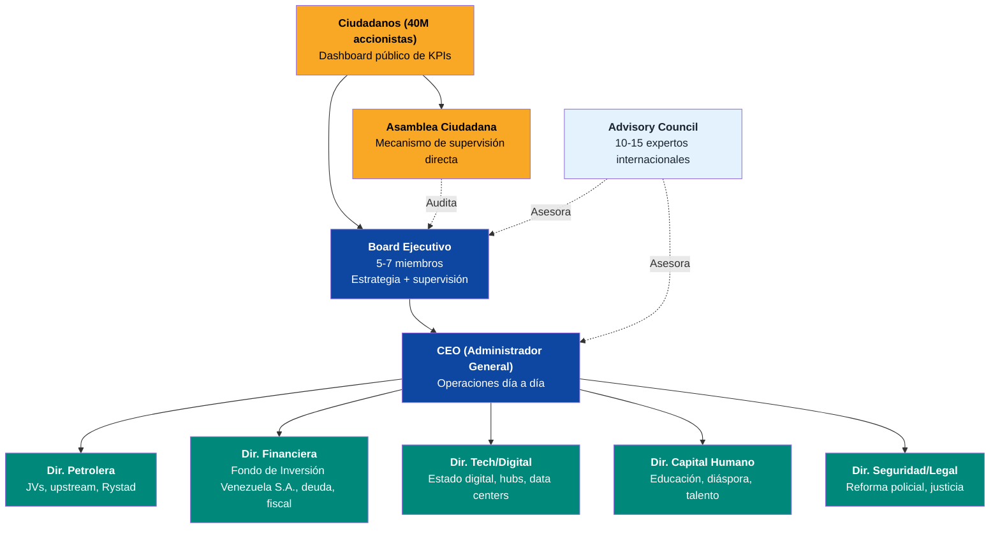
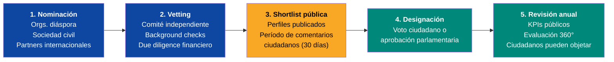

# Equipo Ejecutor

:::danger El punto ciego #1 del plan
7 de 19 perspectivas evaluadoras (Lee Kuan Yew, Bukele, Musk, VCs, Unicornios, Oppenheimer, VisualPolitik) identificaron la misma falla crítica: **no hay equipo ejecutor definido**. Severidad: 3/10 (CRÍTICO). Un plan sin equipo es un documento. Un plan con equipo es una organización.
:::

## La analogía YC

Y Combinator invierte en **equipos**, no en ideas. El plan de Venezuela S.A. es la idea — este capítulo es el **team slide**.

Como dijo Garry Tan: *"¿Quién es el CEO? ¿Quién es el CTO? Si no puedes responder eso, no tienes una empresa — tienes un PDF."*

El plan tiene tesis, proyecciones, fuentes y estructura. Lo que falta es lo que convierte documentos en organizaciones: **nombres, compromisos y accountability**.

Esta sección no nombra personas — eso es tarea operativa. Define los **roles, perfiles, proceso de selección y marco de rendición de cuentas** para que cuando llegue el momento, la estructura ya exista.

## Estructura organizacional

:::info Relación con el PMO existente
Esta estructura complementa el [organigrama de ejecución (PMO)](/06-realidad/esg-ejecucion) y se alinea con la gobernanza del [Fondo de Inversión Venezuela S.A.](/02-motor-financiero/fondo-soberano). El Board Ejecutivo reporta tanto al Consejo del Fondo como a los ciudadanos.
:::

## Perfiles requeridos por rol

| Rol | Perfil requerido | Experiencia mínima | Origen ideal | Ejemplo de perfil (no personas) |
|-----|-----------------|-------------------|-------------|-------------------------------|
| **CEO** | Ex-CEO de corporación grande o Fondo de Inversión Venezuela S.A. | **15+ años** de liderazgo ejecutivo, bilingüe ES/EN | Diáspora venezolana o internacional con conexión al país | Alguien que haya gestionado operaciones de USD 1B+ con accountability pública |
| **Dir. Petrolera** | Ex-VP de major petrolera o consultora energética | **15+ años** en upstream/midstream, conocimiento Faja del Orinoco | Ex-PDVSA pre-2002, Rystad, IHS, Wood Mackenzie | Perfil que entienda tanto la geología como los JVs internacionales |
| **Dir. Financiera** | Ex-MD de banca de inversión o reestructuración soberana | **12+ años** en deuda soberana, mercados emergentes | Wall Street, City of London, con experiencia LATAM | Alguien que haya liderado reestructuraciones de deuda de USD 10B+ |
| **Dir. Tech/Digital** | Ex-CTO/VP de BigTech o founder exitoso | **10+ años** en infraestructura cloud, data centers, gobierno digital | Silicon Valley, Europa, con voluntad de relocalización | Perfil que haya escalado plataformas de millones de usuarios |
| **Dir. Capital Humano** | Ex-ministro de educación o presidente de universidad grande | **12+ años** en reforma educativa o gestión de talento masivo | LATAM o internacional con experiencia en sistemas en crisis | Alguien que haya transformado sistemas educativos nacionales |
| **Dir. Seguridad/Legal** | Ex-líder de reforma policial/militar | **10+ años** en reforma institucional de seguridad | Experiencia en modelos Georgia, Colombia o Chile | Perfil que haya reducido crimen organizado con métricas verificables |
| **Board (5-7)** | Mix multidisciplinario con governance corporativa | **10+ años** en boards de empresas públicas o fondos | **3+ diáspora**, **2+ locales**, **1-2 internacionales** | Perfiles con track record en transparencia y accountability |
| **Advisory Council** | Expertos de clase mundial por dominio | Reconocimiento internacional en su campo | Global, pro bono o compensado | Académicos, ex-funcionarios de fondos soberanos, ex-CEOs |

## 10 criterios no negociables

Todo candidato a cualquier posición ejecutiva debe cumplir **los 10 sin excepción**:

| # | Criterio | Verificación |
|---|---------|-------------|
| 1 | **Apartidista** — sin afiliación política activa | Declaración jurada + verificación pública |
| 2 | **Sin vínculo con regímenes** — ni actual ni anteriores | Investigación independiente |
| 3 | **Track record verificable** — CV público, logros auditables | Comité de vetting + due diligence |
| 4 | **Disclosure financiero** — patrimonio declarado al entrar | Publicación en dashboard ciudadano |
| 5 | **Compromiso mínimo de 5 años** — no turismo ejecutivo | Contrato vinculante con penalidades |
| 6 | **Sin conflictos de interés** — ni directos ni indirectos | Auditoría de relaciones comerciales |
| 7 | **Bilingüe** — español + inglés mínimo | Entrevista en ambos idiomas |
| 8 | **Disponibilidad para relocalización** — base en Venezuela | Compromiso contractual de residencia |
| 9 | **Background check internacional** — estándar FCPA/UK Bribery Act | Firma externa de due diligence |
| 10 | **Compromiso público** — nombres y caras visibles | Presentación pública + acceso ciudadano |

:::caution Estas reglas existen por una razón
Venezuela ha tenido décadas de funcionarios sin accountability. El marco de [anticorrupción](/04-gobernanza/anticorrupcion-checklist) del plan se aplica con máxima exigencia a estos roles. Sin excepciones, sin "flexibilizaciones temporales".
:::

## Proceso de selección

| Fase | Duración | Responsable | Producto |
|------|---------|------------|---------|
| Nominación | 60 días | Coalición de sociedad civil + diáspora | Long list de 50-100 candidatos |
| Vetting | 90 días | Comité independiente (3 venezolanos + 2 internacionales) | Short list de 15-20 candidatos |
| Shortlist pública | 30 días | Plataforma digital ciudadana | Feedback público, objeciones documentadas |
| Designación | 30 días | Mecanismo democrático (a definir) | Equipo ejecutivo nombrado |
| Revisión | Anual | Board + Asamblea Ciudadana | Continuidad, ajuste o remoción |

## Modelo de compensación

:::info La lección de Singapur
Lee Kuan Yew pagaba a sus ministros **salarios competitivos con el sector privado** — USD 1M+ anuales. Su argumento: *"Páguenles bien o los perderán ante el sector privado, o peor, ante la corrupción."* El modelo NBIM (Fondo de Inversión Venezuela S.A. de Noruega) sigue la misma lógica [Requiere investigación].
:::

| Componente | Estructura | Referencia |
|-----------|-----------|-----------|
| **Salario base** | Competitivo con sector privado internacional (percentil 75) | Benchmarks de Korn Ferry/Mercer para mercados emergentes [Requiere investigación] |
| **Bono por desempeño** | 0-100% del salario base, atado a **KPIs trimestrales públicos** | Modelo similar a CEO de Fondo de Inversión Venezuela S.A. noruego (NBIM) |
| **Equity simbólico** | Bonos ciudadanos equivalentes — su compensación sube si Venezuela sube | Alineación de incentivos startup-style |
| **Clawback** | Devolución total de bonos si se detecta **misconduct, corrupción o conflicto de interés** | Estándar Dodd-Frank para ejecutivos de empresas públicas |
| **Pensión** | Contributiva estándar — sin pensiones vitalicias de privilegio | Modelo Estonia/Singapur |

## Pipeline de reclutamiento

| Canal | Pool estimado | Estrategia |
|-------|-------------|-----------|
| **Diáspora venezolana** | **7.9M personas** ([UNHCR, dic. 2025](https://www.unhcr.org/)) — miles en posiciones de liderazgo global | Activación vía redes profesionales en US, España, Colombia, Chile |
| **Headhunting internacional** | Firmas como Egon Zehnder, Spencer Stuart, Heidrick & Struggles | Mandato específico con criterios no negociables |
| **Multilaterales** | World Bank, BID, CAF — talent pools de reforma institucional | Partnerships formales para secondments |
| **Redes profesionales venezolanas** | Harvard Venezuela Project, VenAmérica, IESA Alumni, etc. | Embajadores de reclutamiento en cada red |
| **Talento local** | Líderes comunitarios, empresarios sobrevivientes, profesionales que se quedaron | Proceso paralelo — no toda la solución viene de afuera |

:::caution Equilibrio diáspora-local
El equipo **no puede ser solo diáspora**. Quienes se quedaron tienen conocimiento de terreno insustituible. La meta: **mínimo 40% del equipo ampliado debe ser talento local**. La reconstrucción no se impone desde afuera.
:::

## Marco de accountability

| Mecanismo | Frecuencia | Audiencia | Consecuencia |
|-----------|-----------|-----------|-------------|
| **Dashboard de KPIs** | Trimestral | Público (40M ciudadanos) | Transparencia total — cualquiera puede auditar |
| **Informe de gestión** | Semestral | Board + Asamblea Ciudadana | Preguntas públicas, respuestas obligatorias |
| **Auditoría independiente** | Anual | Firma internacional (Big Four + auditor local) | Publicación completa de resultados |
| **Evaluación 360°** | Anual | Pares, subordinados, Board, ciudadanos | Input para decisiones de continuidad |
| **Triggers de remoción automática** | Continuo | Board Ejecutivo | **2 trimestres consecutivos sin cumplir KPIs**, violación de integridad, conflicto de interés no declarado |

:::danger Sin inmunidad
Ningún miembro del equipo ejecutivo tiene inmunidad judicial. El Fiscal Nacional — que [nunca reporta al ejecutivo](/06-realidad/esg-ejecucion) — tiene jurisdicción plena. Esto no es gobierno; es una organización con accionistas que exigen resultados.
:::

## Conexión con el plan

| Sección del plan | Relación con el equipo ejecutor |
|-----------------|-------------------------------|
| [Fondo de Inversión Venezuela S.A.](/02-motor-financiero/fondo-soberano) | El Board Ejecutivo se coordina con el Consejo del Fondo — gobernanza paralela |
| [ESG y Ejecución (PMO)](/06-realidad/esg-ejecucion) | El organigrama PMO se integra bajo el CEO del equipo ejecutor |
| [Anticorrupción](/04-gobernanza/anticorrupcion-checklist) | Los 10 criterios no negociables son la versión ejecutiva del checklist anticorrupción |
| [Timeline](/07-ejecucion/timeline) | Fase A (2027-2031) requiere equipo completo antes del arranque |
| [Diáspora](/03-ciudadanos/diaspora) | Principal fuente de talento para roles de liderazgo |

## Perfiles de referencia: Quién ha hecho esto antes

> No se trata de contratar a estas personas. Se trata de reclutar perfiles **equivalentes** — gente que ha hecho exactamente esto en otro contexto.

### Rol 0: CEO / Administrador General de Venezuela S.A.

:::danger El rol más importante y el más difícil de llenar
LKY (7.5/10): *"Tienes un CRO, un abogado, un negociador China, un representante FMI y un director de comms — pero ¿a quién le reportan? Una startup con cinco VPs y cero CEO es un comité, y los comités no reconstruyen naciones."*
:::

El CEO es quien lidera la ejecución del plan completo. No es un político — es un ejecutivo de clase mundial que opera Venezuela S.A. como un holding corporativo de USD 500B+ con 40M accionistas.

| Perfil de referencia | Logro verificable | Relevancia para Venezuela |
|---------------------|-------------------|--------------------------|
| **Kakha Bendukidze** (modelo histórico) — Empresario ruso-georgiano → Ministro de Reforma, Georgia 2004 | Georgia de puesto 137 a 11 en Ease of Doing Business. Flat tax 12%. Eliminó 90% de licencias. Dijo: *"Vender todo excepto el honor"* | **El arquetipo exacto.** Empresario exitoso que acepta el reto de reconstruir un Estado. No político de carrera, no burócrata — ejecutor con track record |
| Perfil tipo: **Ex-CEO de fondo soberano o corporación extractiva en mercado emergente** | Gestión de operaciones de USD 10B+, múltiples países, rendición de cuentas pública. Bilingüe. Dispuesto a relocalización | Perfiles tipo: ex-CEO de [Equinor](https://www.equinor.com/) (NOC noruega), ex-Director de [Temasek](https://www.temasek.com.sg/) (holding estatal de Singapur), ex-CEO de operación LATAM de major petrolera |
| Perfil tipo: **Fundador/CEO de unicornio LATAM con experiencia en regulación** | Alguien que haya construido una empresa de USD 1B+ en LATAM navegando regulación compleja, informalidad y riesgo país | Perfiles tipo: fundadores de [Nubank](https://www.nu.com.br/), [MercadoLibre](https://www.mercadolibre.com/), [Globant](https://www.globant.com/) — entienden escala, regulación y capital en LATAM |

**Compensación:** Percentil 95 del mercado (no 75). LKY pagaba USD 1M+ a sus ministros. Para un CEO que gestiona USD 500B+ en activos, la compensación debe ser competitiva con CEOs de fondos soberanos (NBIM: ~USD 1-2M/año + bono por desempeño). Ver [modelo de compensación](#modelo-de-compensación).

---

### Rol 1: Chief Restructuring Officer (CRO) / Dir. Financiera

El CRO es quien negocia con acreedores, estructura los forwards petroleros, y diseña la arquitectura financiera del plan. Necesita haber reestructurado deuda soberana de USD 10B+.

| Perfil de referencia | Logro verificable | Relevancia para Venezuela |
|---------------------|-------------------|--------------------------|
| **David Martínez** — Fundador, [Fintech Advisory](https://en.wikipedia.org/wiki/David_Mart%C3%ADnez_(businessman)) (México/Londres) | Participó en casi toda reestructuración soberana de los últimos 25 años. Compró deuda distressed argentina a descuento, luego participó en exchanges. Patrimonio ~USD 3B | Entiende distressed debt LATAM. Fintech Advisory maneja exactamente el tipo de instrumentos que Venezuela necesita (forwards, bonos, swaps) |
| **Martín Guzmán** — Ex-Ministro de Economía, Argentina. Profesor, [Columbia SIPA](https://www.sipa.columbia.edu/communities-connections/faculty/martin-guzman) | Lideró la 2da mayor reestructuración soberana de la historia (USD 65B, 2020). Haircut ~45% NPV en 6 meses. Negoció con FMI (acuerdo ene. 2022) | Experiencia directa en negociación con bonistas, FMI y Paris Club. Co-director del programa de deuda soberana con Stiglitz |
| **Simón Cueva** — Ex-Ministro de Economía, Ecuador. Ex-economista FMI. [LinkedIn](https://www.linkedin.com/in/simon-cueva-344a9725/) | Reestructuró USD 17.4B en deuda soberana (2020). Ahorró USD 11.3B en 5 años. Negoció deuda china (~USD 4B, 2022). Completó programa FMI | Ecuador es el caso más parecido a Venezuela: petrodependiente, deuda china, necesidad de FMI. Su playbook es directamente replicable |
| **Mark Walker** — Senior MD, [Guggenheim Securities](https://www.brettonwoods.org/person/mark-walker). Ex-Global Managing Partner, Cleary Gottlieb | Co-autor con Hausmann de [3 papers sobre reestructuración de Venezuela](https://papers.ssrn.com/sol3/papers.cfm?abstract_id=3361887). Asesoró 20+ soberanos (Colombia, Perú, México, Filipinas, Indonesia). Miembro del Bretton Woods Committee | **Literalmente escribió el playbook para la reestructuración de Venezuela.** Es el puente natural entre la función CRO y la negociación con FMI |
| **Richard Martínez** — Senior Advisor, [Alvarez & Marsal](https://www.alvarezandmarsal.com/). Ex-Ministro de Finanzas, Ecuador. [LinkedIn](https://www.linkedin.com/in/richard-mart%C3%ADnez-alvarado-0754941a/) | Lideró reestructuración de Ecuador USD 17B. Renegoció USD 3.2B en deuda china. Aseguró USD 6.5B en EFF con FMI. Ex-VP del BID | Complementa a Cueva (fueron colegas en el equipo económico de Ecuador). Ahora en A&M Sovereign Advisory — directamente en el negocio de hacer esto por contrato |

**Firmas asesoras de referencia:**
- [Lazard Sovereign Advisory](https://www.lazard.com/financial-advisory/specialized-advisory/sovereign-advisory/) — Asesoró Argentina, Ecuador, Surinam, Zambia, Ghana, Sri Lanka. **Thomas Moatti** (Director) tuvo advisory con Venezuela 2012-2013
- [Houlihan Lokey](https://hl.com/) — **David-Alexandre Gadmer** (ex-Lazard) lidera sovereign advisory. Nuevo entrante agresivo
- [Rothschild & Co](https://www.rothschildandco.com/) — Alternativa a Lazard con track record en reestructuraciones africanas y asiáticas

### Rol 2: Asesor Legal Internacional

Maneja ICSID (USD 20B+ en arbitrajes pendientes contra Venezuela), estructura VIN (Valores de Inversión Nacional), y negocia con OFAC.

| Perfil de referencia | Logro verificable | Relevancia |
|---------------------|-------------------|------------|
| **Lee Buchheit** — Ex-socio, [Cleary Gottlieb](https://www.clearygottlieb.com/) | Inventó las Collective Action Clauses (CACs). Lideró reestructuraciones de 20+ países incluyendo Irak y Grecia. Financial Times "Top 10 Innovative Individuals" 2012 | El estándar dorado en reestructuración soberana. Su framework de CACs es lo que Venezuela usaría para forzar consenso entre bonistas |
| **Kenneth Figueroa** — Socio, [Foley Hoag](https://foleyhoag.com/people/figueroa-kenneth/) | Representó a Venezuela en ICSID por 10+ años. Caso Crystallex (USD 1.4B). Victoria en múltiples arbitrajes (Anglo American USD 400M, Highbury USD 633M) | Conoce TODOS los casos ICSID contra Venezuela. Sabe dónde están las vulnerabilidades y las fortalezas de la defensa |
| **Ian Clark** — Socio, [White & Case](https://www.whitecase.com/people/ian-clark) | Asesoró reestructuraciones de Argentina, Ecuador, Grecia, Ucrania, Surinam, Zambia, Sri Lanka | Uno de los abogados de deuda soberana más experimentados del mundo. White & Case publicó el [análisis líder sobre reestructuraciones LATAM](https://www.whitecase.com/insight-our-thinking/sovereign-debt-restructurings-latin-america-new-chapter) |
| **Anna Gelpern** — Profesora, [Georgetown Law](https://scholarship.law.georgetown.edu/). Senior Fellow, [Peterson Institute](https://www.piie.com/) | Co-autora del paper IDB *"Sovereign Debt Restructuring: The Need for a New Approach"*. Mentora de la siguiente generación de abogados de deuda soberana | Puente academia-práctica. Complementa a Buchheit (su mentor) con perspectiva moderna sobre Common Framework y arquitectura G20 |

**Firmas de referencia para Venezuela:**
- [Cleary Gottlieb](https://www.clearygottlieb.com/) — Asesoró a Ecuador en reestructuración 2020. Líder global en sovereign debt
- [Foley Hoag](https://foleyhoag.com/) — Representó a Venezuela en ICSID por más de 10 años (38 casos en LATAM)
- [King & Spalding](https://www.kslaw.com/) — Representó a ConocoPhillips en arbitraje ICSID vs. Venezuela (award USD 8B). Conocen el otro lado de la mesa

### Rol 3: Negociador Bilateral China

Venezuela debe ~USD 19B a China (préstamos oil-for-loans). Este rol negocia la reestructuración de esa deuda y la transición de la relación bilateral.

| Perfil de referencia | Logro verificable | Relevancia |
|---------------------|-------------------|------------|
| **Margaret Myers** — Directora, [Asia & Latin America Program, Inter-American Dialogue](https://thedialogue.org/expert/margaret-myers) | Creó la base de datos de préstamos China-LATAM. Asesora al gobierno de EE.UU. sobre relaciones China-LATAM. Testificó ante Congreso de EE.UU. | La mayor experta occidental en finanzas China-LATAM. Conoce estructura de los préstamos oil-for-loans y cómo se han renegociado en Ecuador |
| **Kevin Gallagher** — Director, [BU Global Development Policy Center](https://www.bu.edu/gdp/profile/kevin-p-gallagher/). Autor de *The China Triangle: Latin America's China Boom* | Co-creó la base de datos China-LATAM finance con Myers. Asesor principal de reforma MDB para la presidencia G20 de Brasil | Entiende tanto la economía política como la arquitectura financiera de los préstamos chinos en LATAM. Complementa a Myers (ella mapea, él negocia) |
| **Rebecca Ray** — Senior Researcher, [BU Global Development Policy Center](https://www.bu.edu/gdp/profile/rebecca-ray/). [LinkedIn](https://www.linkedin.com/in/rebecca-ray-6b75bb18/) | Lidera el China-LAC Economic Bulletin anual. Expertise en debt-for-climate swaps | Tracking más completo de finanzas de desarrollo chinas en LATAM. Los debt-for-climate swaps son relevantes para la narrativa de transición de Venezuela |

### Rol 4: Representante FMI / Multilateral

Negocia el programa con el FMI (probablemente Extended Fund Facility), coordina con BID, CAF, World Bank.

| Perfil de referencia | Logro verificable | Relevancia |
|---------------------|-------------------|------------|
| **Alejandro Werner** — Ex-Director WHD, FMI. Director fundador, [Georgetown Americas Institute](https://americas.georgetown.edu/people/alejandro-werner) | Dirigió el departamento del FMI para las Américas (2013-2021). Supervisó programas en Argentina, Ecuador, Colombia. Ex-Subsecretario de Finanzas de México | Conoce la cocina interna del FMI para LATAM. Sabe qué condiciones son negociables y cuáles no. Conexiones directas con el board del FMI |
| **Ricardo Hausmann** — Director, [Growth Lab, Harvard Kennedy School](https://www.hks.harvard.edu/faculty/ricardo-hausmann). Ex-Ministro de Planificación de Venezuela (1992-93) | Creó el Atlas de Complejidad Económica. Asesoró a docenas de gobiernos. En 2026, activamente involucrado en debate sobre reconstrucción de Venezuela | **Venezolano**. Entiende el país como nadie en la academia internacional. Su credibilidad con FMI, World Bank y BID es única. **Rol ideal: asesor estratégico**, no operador — complementa a Werner que opera en Washington |
| **Rodrigo Valdés** — Director actual WHD, [FMI](https://www.imf.org/en/about/senior-officials/bios/rodrigo-valdes). Ex-Ministro de Finanzas de Chile. PhD MIT | Dirigió el WHD del FMI (2023-2025) durante el período exacto en que Venezuela necesitaría un programa. Antes: Chief Economist LATAM en Barclays | Conocimiento institucional del FMI más reciente que Werner. Chileno — neutral pero profundamente conocedor de los desafíos fiscales de LATAM |

### Rol 5: Director de Comunicaciones

Maneja la narrativa simultánea para 3 audiencias: ciudadanos (40M), inversores internacionales y actores geopolíticos.

| Perfil de referencia | Logro verificable | Relevancia |
|---------------------|-------------------|------------|
| **Paul Caminiti** — Socio Fundador, [Reevemark](https://www.reevemark.com/about-us) | Ex-fiscal federal → especialista en comunicaciones de reestructuración. Reevemark es consistentemente top-ranked en restructuring comms | Maneja exactamente la intersección de negociación con bonistas, sentimiento público y gestión de medios que la reestructuración de Venezuela requiere |
| Firma alternativa: **[Kekst CNC](https://www.kekstcnc.com/expertise/restructuring-and-bankruptcy)** o **[FGS Global](https://fgsglobal.com/)** | Las dos firmas de comunicación financiera más grandes del mundo con práctica explícita de reestructuración. FGS tiene capacidad bilingüe LATAM (Miami/DC) | Para una reestructuración de la escala de Venezuela (USD 150B+, 40M ciudadanos, complejidad geopolítica), la función de comms probablemente necesita una **firma**, no una persona |

### Modelo histórico: Georgia 2004 (Saakashvili)

El caso más relevante para Venezuela S.A. — un país colapsado que se reinventó en 4 años:

| Rol | Persona | Logro | Lección para Venezuela |
|-----|---------|-------|----------------------|
| **Presidente** | Mikheil Saakashvili | Rose Revolution → reforma radical del Estado | Liderazgo político necesario pero no suficiente. Necesitó equipo técnico |
| **Ministro de Reforma** | [Kakha Bendukidze](https://en.wikipedia.org/wiki/Kakha_Bendukidze) | Georgia saltó de puesto 137 a 11 en Ease of Doing Business (World Bank). Flat tax 12%. Eliminó 90% de licencias | **El CRO de Georgia.** Empresario exitoso → ministro reformador. Dijo: *"El gobierno debería vender todo excepto su honor"*. Exactamente la filosofía de Venezuela S.A. |
| **Asesor fiscal** | Simeon Djankov (World Bank) + Leszek Balcerowicz (Polonia) | Diseñaron reformas tributarias y aduaneras | Expertise internacional + implementación local. Mismo modelo que propone el plan |

:::info El patrón que funciona
En **todos** los casos exitosos de reestructuración nacional (Georgia 2004, Singapur 1965, Chile 1975-90, Estonia 1991, Ruanda 2000), el equipo tenía 3 características: (1) **expertise técnica de clase mundial**, (2) **legitimidad política suficiente**, (3) **protección de interferencia política** durante los primeros 5 años críticos. Venezuela S.A. diseña exactamente esto.
:::

---

:::tip El primer milestone real
Esta sección es deliberadamente un **framework con referencias, no con nombres**. El primer hito real de Venezuela S.A. es convertir estas referencias en reclutamientos. Cuando el Board tenga nombres, compromisos firmados y KPIs publicados, el plan se convierte de documento a organización. Hasta entonces, es un PDF — y los PDFs no reconstruyen países.

**El Pre-Seed de USD 25-60M financia el reclutamiento.** Con USD 5M se contrata a Egon Zehnder o Spencer Stuart para un mandato de 6 meses: buscar los 7 roles ejecutivos + 5-7 board members entre la diáspora y el talento internacional. El resto del Pre-Seed financia la plataforma, el censo digital y el legal.
:::
