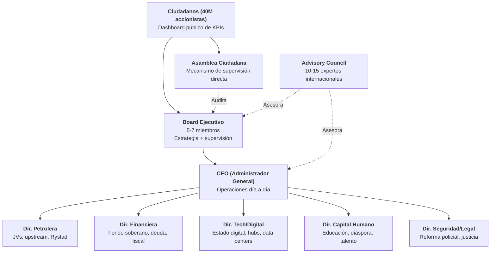
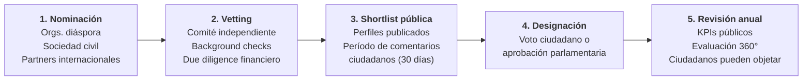

# Equipo Ejecutor

:::danger El punto ciego #1 del plan
7 de 19 perspectivas evaluadoras (Lee Kuan Yew, Bukele, Musk, VCs, Unicornios, Oppenheimer, VisualPolitik) identificaron la misma falla crítica: **no hay equipo ejecutor definido**. Severidad: 3/10 (CRÍTICO). Un plan sin equipo es un documento. Un plan con equipo es una organización.
:::

## La analogía YC

Y Combinator invierte en **equipos**, no en ideas. El plan de Venezuela S.A. es la idea — este capítulo es el **team slide**.

Como dijo Garry Tan: *"¿Quién es el CEO? ¿Quién es el CTO? Si no puedes responder eso, no tienes una empresa — tienes un PDF."*

El plan tiene tesis, proyecciones, fuentes y estructura. Lo que falta es lo que convierte documentos en organizaciones: **nombres, compromisos y accountability**.

Esta sección no nombra personas — eso es tarea operativa. Define los **roles, perfiles, proceso de selección y marco de rendición de cuentas** para que cuando llegue el momento, la estructura ya exista.

## Estructura organizacional

:::info Relación con el PMO existente
Esta estructura complementa el [organigrama de ejecución (PMO)](/06-realidad/esg-ejecucion) y se alinea con la gobernanza del [fondo soberano](/02-motor-financiero/fondo-soberano). El Board Ejecutivo reporta tanto al Consejo del Fondo como a los ciudadanos.
:::

## Perfiles requeridos por rol

| Rol | Perfil requerido | Experiencia mínima | Origen ideal | Ejemplo de perfil (no personas) |
|-----|-----------------|-------------------|-------------|-------------------------------|
| **CEO** | Ex-CEO de corporación grande o fondo soberano | **15+ años** de liderazgo ejecutivo, bilingüe ES/EN | Diáspora venezolana o internacional con conexión al país | Alguien que haya gestionado operaciones de USD 1B+ con accountability pública |
| **Dir. Petrolera** | Ex-VP de major petrolera o consultora energética | **15+ años** en upstream/midstream, conocimiento Faja del Orinoco | Ex-PDVSA pre-2002, Rystad, IHS, Wood Mackenzie | Perfil que entienda tanto la geología como los JVs internacionales |
| **Dir. Financiera** | Ex-MD de banca de inversión o reestructuración soberana | **12+ años** en deuda soberana, mercados emergentes | Wall Street, City of London, con experiencia LATAM | Alguien que haya liderado reestructuraciones de deuda de USD 10B+ |
| **Dir. Tech/Digital** | Ex-CTO/VP de BigTech o founder exitoso | **10+ años** en infraestructura cloud, data centers, gobierno digital | Silicon Valley, Europa, con voluntad de relocalización | Perfil que haya escalado plataformas de millones de usuarios |
| **Dir. Capital Humano** | Ex-ministro de educación o presidente de universidad grande | **12+ años** en reforma educativa o gestión de talento masivo | LATAM o internacional con experiencia en sistemas en crisis | Alguien que haya transformado sistemas educativos nacionales |
| **Dir. Seguridad/Legal** | Ex-líder de reforma policial/militar | **10+ años** en reforma institucional de seguridad | Experiencia en modelos Georgia, Colombia o Chile | Perfil que haya reducido crimen organizado con métricas verificables |
| **Board (5-7)** | Mix multidisciplinario con governance corporativa | **10+ años** en boards de empresas públicas o fondos | **3+ diáspora**, **2+ locales**, **1-2 internacionales** | Perfiles con track record en transparencia y accountability |
| **Advisory Council** | Expertos de clase mundial por dominio | Reconocimiento internacional en su campo | Global, pro bono o compensado | Académicos, ex-funcionarios de fondos soberanos, ex-CEOs |

## 10 criterios no negociables

Todo candidato a cualquier posición ejecutiva debe cumplir **los 10 sin excepción**:

| # | Criterio | Verificación |
|---|---------|-------------|
| 1 | **Apartidista** — sin afiliación política activa | Declaración jurada + verificación pública |
| 2 | **Sin vínculo con regímenes** — ni actual ni anteriores | Investigación independiente |
| 3 | **Track record verificable** — CV público, logros auditables | Comité de vetting + due diligence |
| 4 | **Disclosure financiero** — patrimonio declarado al entrar | Publicación en dashboard ciudadano |
| 5 | **Compromiso mínimo de 5 años** — no turismo ejecutivo | Contrato vinculante con penalidades |
| 6 | **Sin conflictos de interés** — ni directos ni indirectos | Auditoría de relaciones comerciales |
| 7 | **Bilingüe** — español + inglés mínimo | Entrevista en ambos idiomas |
| 8 | **Disponibilidad para relocalización** — base en Venezuela | Compromiso contractual de residencia |
| 9 | **Background check internacional** — estándar FCPA/UK Bribery Act | Firma externa de due diligence |
| 10 | **Compromiso público** — nombres y caras visibles | Presentación pública + acceso ciudadano |

:::caution Estas reglas existen por una razón
Venezuela ha tenido décadas de funcionarios sin accountability. El marco de [anticorrupción](/04-gobernanza/anticorrupcion-checklist) del plan se aplica con máxima exigencia a estos roles. Sin excepciones, sin "flexibilizaciones temporales".
:::

## Proceso de selección

| Fase | Duración | Responsable | Producto |
|------|---------|------------|---------|
| Nominación | 60 días | Coalición de sociedad civil + diáspora | Long list de 50-100 candidatos |
| Vetting | 90 días | Comité independiente (3 venezolanos + 2 internacionales) | Short list de 15-20 candidatos |
| Shortlist pública | 30 días | Plataforma digital ciudadana | Feedback público, objeciones documentadas |
| Designación | 30 días | Mecanismo democrático (a definir) | Equipo ejecutivo nombrado |
| Revisión | Anual | Board + Asamblea Ciudadana | Continuidad, ajuste o remoción |

## Modelo de compensación

:::info La lección de Singapur
Lee Kuan Yew pagaba a sus ministros **salarios competitivos con el sector privado** — USD 1M+ anuales. Su argumento: *"Páguenles bien o los perderán ante el sector privado, o peor, ante la corrupción."* El modelo NBIM (fondo soberano de Noruega) sigue la misma lógica [Requiere investigación].
:::

| Componente | Estructura | Referencia |
|-----------|-----------|-----------|
| **Salario base** | Competitivo con sector privado internacional (percentil 75) | Benchmarks de Korn Ferry/Mercer para mercados emergentes [Requiere investigación] |
| **Bono por desempeño** | 0-100% del salario base, atado a **KPIs trimestrales públicos** | Modelo similar a CEO de fondo soberano noruego (NBIM) |
| **Equity simbólico** | Bonos ciudadanos equivalentes — su compensación sube si Venezuela sube | Alineación de incentivos startup-style |
| **Clawback** | Devolución total de bonos si se detecta **misconduct, corrupción o conflicto de interés** | Estándar Dodd-Frank para ejecutivos de empresas públicas |
| **Pensión** | Contributiva estándar — sin pensiones vitalicias de privilegio | Modelo Estonia/Singapur |

## Pipeline de reclutamiento

| Canal | Pool estimado | Estrategia |
|-------|-------------|-----------|
| **Diáspora venezolana** | **7.9M personas** ([UNHCR, dic. 2025](https://www.unhcr.org/)) — miles en posiciones de liderazgo global | Activación vía redes profesionales en US, España, Colombia, Chile |
| **Headhunting internacional** | Firmas como Egon Zehnder, Spencer Stuart, Heidrick & Struggles | Mandato específico con criterios no negociables |
| **Multilaterales** | World Bank, BID, CAF — talent pools de reforma institucional | Partnerships formales para secondments |
| **Redes profesionales venezolanas** | Harvard Venezuela Project, VenAmérica, IESA Alumni, etc. | Embajadores de reclutamiento en cada red |
| **Talento local** | Líderes comunitarios, empresarios sobrevivientes, profesionales que se quedaron | Proceso paralelo — no toda la solución viene de afuera |

:::caution Equilibrio diáspora-local
El equipo **no puede ser solo diáspora**. Quienes se quedaron tienen conocimiento de terreno insustituible. La meta: **mínimo 40% del equipo ampliado debe ser talento local**. La reconstrucción no se impone desde afuera.
:::

## Marco de accountability

| Mecanismo | Frecuencia | Audiencia | Consecuencia |
|-----------|-----------|-----------|-------------|
| **Dashboard de KPIs** | Trimestral | Público (40M ciudadanos) | Transparencia total — cualquiera puede auditar |
| **Informe de gestión** | Semestral | Board + Asamblea Ciudadana | Preguntas públicas, respuestas obligatorias |
| **Auditoría independiente** | Anual | Firma internacional (Big Four + auditor local) | Publicación completa de resultados |
| **Evaluación 360°** | Anual | Pares, subordinados, Board, ciudadanos | Input para decisiones de continuidad |
| **Triggers de remoción automática** | Continuo | Board Ejecutivo | **2 trimestres consecutivos sin cumplir KPIs**, violación de integridad, conflicto de interés no declarado |

:::danger Sin inmunidad
Ningún miembro del equipo ejecutivo tiene inmunidad judicial. El Fiscal Nacional — que [nunca reporta al ejecutivo](/06-realidad/esg-ejecucion) — tiene jurisdicción plena. Esto no es gobierno; es una organización con accionistas que exigen resultados.
:::

## Conexión con el plan

| Sección del plan | Relación con el equipo ejecutor |
|-----------------|-------------------------------|
| [Fondo Soberano](/02-motor-financiero/fondo-soberano) | El Board Ejecutivo se coordina con el Consejo del Fondo — gobernanza paralela |
| [ESG y Ejecución (PMO)](/06-realidad/esg-ejecucion) | El organigrama PMO se integra bajo el CEO del equipo ejecutor |
| [Anticorrupción](/04-gobernanza/anticorrupcion-checklist) | Los 10 criterios no negociables son la versión ejecutiva del checklist anticorrupción |
| [Timeline](/07-ejecucion/timeline) | Fase A (2027-2031) requiere equipo completo antes del arranque |
| [Diáspora](/03-ciudadanos/diaspora) | Principal fuente de talento para roles de liderazgo |

:::tip El primer milestone real
Esta sección es deliberadamente un **framework sin nombres**. El primer hito real de Venezuela S.A. es llenar estos roles. Cuando el Board tenga nombres, compromisos firmados y KPIs publicados, el plan se convierte de documento a organización. Hasta entonces, es un PDF — y los PDFs no reconstruyen países.
:::
