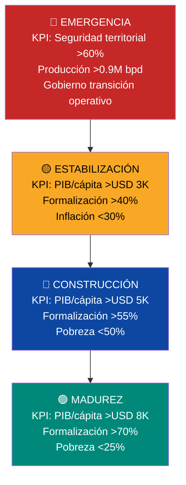

# KPIs de Activación: Condiciones, No Calendario

> El plan no se ejecuta por fechas. Se ejecuta por **condiciones verificables**. Cada fase se activa cuando se cumplen KPIs específicos — si la economía crece rápido, se acelera; si hay crisis, se espera. El plan se adapta a la realidad, no al revés.

:::danger Principio: cero promesas de fecha, solo promesas de condición
Prometer "en 5 años habrá X" es irresponsable en un país con 82,8% de pobreza y cero instituciones. Lo que sí se puede prometer: "cuando se cumplan estas condiciones verificables, se activa esto." [Singapur ajustó el CPF 50+ veces en 60 años](https://www.cpf.gov.sg/). Nosotros ajustaremos según la realidad.
:::

---

## Mapa de Activación General

---

## Fase 1: Emergencia

:::danger Activación: automática (condiciones actuales)
Esta fase arranca el Día 1 porque las condiciones ya existen: Estado fallido, 82,8% pobreza, producción petrolera en mínimos, instituciones destruidas.
:::

### KPIs de entrada (condiciones actuales)
| KPI | Valor actual | Fuente |
|-----|-------------|--------|
| PIB per cápita | USD 2.075 | FMI |
| Pobreza | 82,8% | ENCOVI 2023 |
| Producción petrolera | ~1M bpd | OPEP/IEA |
| Informalidad | >70% | ENCOVI |
| Homicidios/100K | ~30-40 | World Population Review |

### Lo que se activa
| Acción | Condición de activación | KPI de salida |
|--------|------------------------|---------------|
| **FCV al 14%** (retiro 8% + salud 6%) | Ley de FCV aprobada + ente administrador operativo | >2M de cuentas FCV activas |
| **Voucher K-12 básico** (USD 163/mes) | Presupuesto educativo asignado + plataforma digital de vouchers operativa | >3M estudiantes con voucher activo |
| **Pensión Pilar 1** (USD 50/mes) | Presupuesto aprobado + padrón de jubilados verificado | >4M jubilados recibiendo pago mensual |
| **Salud FONASA** (Tramo A/B sin copago) | FCV Salud operativo + red de hospitales concesionados mínima | >20M ciudadanos con cobertura FONASA |
| **Fusión ministerios** (34→18) | Decreto ejecutivo + plan de transición de empleados | <20 ministerios operativos |
| **Seguridad territorial** | Control >60% del territorio + reforma policial iniciada | Homicidios bajando trimestre a trimestre |
| **Dolarización formal** | Decreto + Banco Central reformado | Inflación <50% anual |

### KPIs de salida (para pasar a Estabilización)
| KPI | Umbral | Cómo se mide |
|-----|--------|-------------|
| PIB per cápita | >USD 3.000 | FMI/Banco Mundial (anual) |
| Formalización laboral | >40% de fuerza de trabajo | Registros FCV (contribuyentes activos / PEA) |
| Inflación | <30% anual | BCV reformado / indicador independiente |
| Control territorial | >75% del territorio bajo control estatal | Ministerio de Interior (mapa de seguridad) |
| Cuentas FCV activas | >5M | Ente administrador FCV |
| Producción petrolera | >1.3M bpd | OPEP / IEA |

---

## Fase 2: Estabilización

### KPIs de entrada
| KPI | Umbral requerido |
|-----|-----------------|
| PIB per cápita | >USD 3.000 |
| Formalización | >40% |
| Inflación | <30% |
| Control territorial | >75% |

### Lo que se desbloquea
| Acción | Condición de activación | KPI de salida |
|--------|------------------------|---------------|
| **FCV sube a 18%** (se agrega vivienda 4%) | PIB/cápita >USD 3K + formalización >40% | >500K cuentas con subcuenta vivienda activa |
| **Voucher K-12 crece** (USD 214/mes + transporte) | Recaudación tributaria >USD 8B/año | >5M estudiantes con voucher completo |
| **Pensión Pilar 1 sube** (USD 100/mes) | Presupuesto sostenible sin déficit petrolero >20% | >4,5M jubilados a USD 100/mes |
| **Colegios transicionan a empresas** (30-50%) | >1.000 colegios con acreditación como empresa autónoma | NPS de padres >60% en colegios autónomos |
| **Fusión ministerios** (18→12) | Digitalización >50% de trámites | <14 ministerios operativos |
| **Primeras concesiones de infraestructura** | Marco legal de concesiones aprobado + 3+ licitaciones cerradas | >USD 2B en inversión concesionada |
| **Universidad: voucher por mérito activo** | Sistema de evaluación operativo + universidades acreditadas | >100K estudiantes con voucher universitario |

### KPIs de salida (para pasar a Construcción)
| KPI | Umbral | Cómo se mide |
|-----|--------|-------------|
| PIB per cápita | >USD 5.000 | FMI/BM |
| Formalización | >55% | Registros FCV |
| Pobreza | <50% | ENCOVI/encuesta independiente |
| Recaudación tributaria | >USD 12B/año | Ministerio de Finanzas |
| Producción petrolera | >1.7M bpd | OPEP/IEA |
| Homicidios/100K | <15 | Ministerio Interior |
| Colegios autónomos | >50% | Agencia de Calidad Educativa |

---

## Fase 3: Construcción

### KPIs de entrada
| KPI | Umbral requerido |
|-----|-----------------|
| PIB per cápita | >USD 5.000 |
| Formalización | >55% |
| Pobreza | <50% |

### Lo que se desbloquea
| Acción | Condición de activación | KPI de salida |
|--------|------------------------|---------------|
| **FCV sube a 23%** (se agregan educación 2% + cesantía 2%) | PIB/cápita >USD 5K + formalización >55% | >10M cuentas FCV con 5 subcuentas activas |
| **Voucher K-12 completo** (USD 265/mes + extracurriculares) | Recaudación >USD 15B/año | >7M estudiantes con voucher completo + deporte + arte |
| **Salud introduce Medisave individual** | PIB/cápita >USD 5K + FCV Salud con saldo acumulado >USD 500/cuenta promedio | >5M cuentas con componente Medisave |
| **Fusión ministerios** (12→10) | Digitalización >80% de trámites | 10 ministerios operativos |
| **Colegios 80%+ autónomos** | Agencia de Calidad operativa >3 años + evaluaciones publicadas | Venezuela participa en PISA |
| **Fondo de Inversión VSA viable** | Ingresos petroleros al fondo >USD 5B/año acumulados | Fondo >USD 30B |
| **Data centers operativos** | Guri rehabilitado >80% capacidad + fibra óptica en 3+ hubs | >100 MW en data centers operativos |

### KPIs de salida (para pasar a Madurez)
| KPI | Umbral | Cómo se mide |
|-----|--------|-------------|
| PIB per cápita | >USD 8.000 | FMI/BM |
| Formalización | >70% | Registros FCV |
| Pobreza | <25% | ENCOVI |
| Producción petrolera | >2.5M bpd | OPEP/IEA |
| Recaudación tributaria | >USD 20B/año | Ministerio Finanzas |
| Homicidios/100K | <8 | Ministerio Interior |
| Petróleo % ingresos totales | <40% | Dashboard Venezuela S.A. |
| Fondo de Inversión VSA | >USD 100B | Auditoría externa |

---

## Fase 4: Madurez

### KPIs de entrada
| KPI | Umbral requerido |
|-----|-----------------|
| PIB per cápita | >USD 8.000 |
| Formalización | >70% |
| Pobreza | <25% |

### Lo que se desbloquea
| Acción | Condición de activación | KPI de salida |
|--------|------------------------|---------------|
| **FCV sube a 27%** (retiro 10% + vivienda 5% + educación 3%) | PIB/cápita >USD 8K + formalización >70% | >15M cuentas FCV a 27% |
| **Dividendo ciudadano activo** | Fondo de Inversión VSA >USD 100B + retornos >USD 5B/año | >35M venezolanos recibiendo dividendo anual |
| **Estado vive 100% de impuestos** | Recaudación tributaria cubre 100% del presupuesto sin petróleo | Petróleo: 0% al presupuesto, 100% al fondo |
| **Pensión Pilar 1 sube** (USD 200/mes) | Presupuesto + retornos del fondo lo sostienen | Tasa de reemplazo >60% (FCV Retiro + Pilar 1) |
| **10 ministerios, 265K empleados** | Digitalización >95% + IA en policía/justicia/fiscalización | Ratio empleados/población <1:150 |
| **Impuestos bajan** (15%→12% flat) | Base tributaria >25M contribuyentes + recaudación >USD 25B | Misma recaudación con tasa menor |

---

## Activaciones Específicas por Área

### FCV — Subcuentas

| Subcuenta | Se activa cuando | Se aumenta cuando |
|-----------|-----------------|-------------------|
| **Retiro (8%→7%)** | FCV operativo (Día 1 de la ley) | Baja a 7% cuando abre Cesantía (PIB/cápita >USD 5K); sube a 9% en madurez (PIB/cápita >USD 8K) |
| **Salud (6%→7%)** | FCV operativo (Día 1) | Formalización >55% → sube a 7% + introduce Medisave |
| **Vivienda (4%)** | PIB/cápita >USD 3K + formalización >40% | PIB/cápita >USD 8K → sube a 5% |
| **Educación (2%)** | PIB/cápita >USD 5K + formalización >55% | PIB/cápita >USD 8K → sube a 3% |
| **Cesantía — Mochila Austriaca (3%)** | PIB/cápita >USD 5K + formalización >55% | Se mantiene en 3% (estable en todas las fases) |

### Voucher Educativo

| Nivel de voucher | Se activa cuando | Qué cubre |
|-----------------|-----------------|-----------|
| **Básico (USD 163/mes)** | Presupuesto educativo asignado | Matrícula + comedor + material |
| **Intermedio (USD 214/mes)** | Recaudación tributaria >USD 8B/año | + Transporte |
| **Completo (USD 265/mes)** | Recaudación >USD 15B/año | + Extracurriculares (1 deporte + 1 arte) |
| **Premium (USD 295/mes)** | Recaudación >USD 25B/año | + Tablet/laptop + seguro premium |

### Ministerios

| Reducción | Se activa cuando |
|-----------|-----------------|
| 34→18 | Decreto ejecutivo + plan de transición de empleados aprobado |
| 18→12 | Digitalización >50% de trámites + absorción laboral verificada (desempleo formal <10%) |
| 12→10 | Digitalización >80% de trámites + desempleo formal <8% |

### Sanciones (Roadmap OFAC)

| Fase | Se activa cuando | Qué se desbloquea |
|------|-----------------|-------------------|
| **0: COMPLETADA** | [Licencia 46B emitida 14-mar-2026](https://www.infobae.com/venezuela/2026/03/14/eeuu-autorizo-a-las-empresas-estadounidenses-realizar-negocios-con-el-sector-petrolero-venezolano/) | Todas las empresas de EE.UU. pueden operar |
| **1: Upstream ampliado** | Gobierno de transición + cronograma electoral con fecha | Oil majors JVs a escala |
| **2: Full oil & gas** | Elecciones celebradas (certificadas OEA/UE) + presos liberados | LNG, refinerías, gas |
| **3: Sector financiero** | Gobierno electo + reformas judiciales + cooperación antinarcóticos | Banca internacional, bonos, VIN |
| **4: Tech/services** | 2+ años democracia + DDHH verificados + Cuba desconectada | Data centers, VC/PE, tech |
| **5: Normalización** | Track record democrático + deuda reestructurada | Investment grade, mercado de capitales |

:::info Monitoreo político en tiempo real
Las condiciones del roadmap de sanciones se rastrean vía [Umbral Watch](https://www.umbral.watch/) — que combina V-Dem Electoral Democracy Index (actual: **0,22**), señales GDELT, datos de Foro Penal (**508 presos**, mar. 2026) y mercados de predicción. Consenso expertos mar. 2026: **47% apuestan por S3** (Autocracia Electoral Estabilizada = mínimo para Fase 1). Ver [Escenarios Políticos en el Diagnóstico](/01-fundamentos/diagnostico#escenarios-políticos-la-variable-que-determina-todo).
:::

---

## Dashboard de Monitoreo

Cada KPI se mide con frecuencia y fuente definida:

| KPI | Frecuencia | Fuente | Publicación |
|-----|-----------|--------|-------------|
| PIB per cápita | Trimestral | FMI / BCV reformado | Dashboard Venezuela S.A. (público) |
| Formalización | Mensual | Registros FCV (cuentas activas / PEA) | Dashboard Venezuela S.A. |
| Pobreza | Semestral | ENCOVI independiente / Banco Mundial | Publicación abierta |
| Producción petrolera | Mensual | OPEP + IEA + Venezuela S.A. | Dashboard público |
| Recaudación tributaria | Mensual | Ministerio de Finanzas | Portal fiscal digital |
| Homicidios/100K | Mensual | Ministerio Interior + ONG independiente | Dashboard seguridad |
| Inflación | Mensual | BCV reformado + índice independiente | Público |
| Cuentas FCV activas | Tiempo real | Ente administrador FCV | App FCV del ciudadano |
| Fondo de Inversión VSA | Trimestral | Auditoría externa (Santiago Principles) | Dashboard público |
| Colegios autónomos (%) | Semestral | Agencia de Calidad Educativa | Portal educación |
| Graduados bootcamp empleados en 6 meses | Trimestral | Bootcamps (reporte de colocación) | Dashboard público |
| Salario promedio primer empleo tech | Trimestral | Plataforma VenDev + bootcamps | Dashboard público |
| Estudiantes K-12 con inglés B2+ | Anual | Examen estandarizado nacional | Portal educación |
| Retención de talento tech (% que se queda) | Anual | Registros FCV + migración | Dashboard público |

:::tip Transparencia = accountability
**Todo KPI es público, en tiempo real, auditable.** Si un KPI no se cumple, no se activa la siguiente fase — punto. No hay "decreto presidencial que acelere fases." No hay "situación especial que justifique saltarse condiciones." **Las condiciones son las condiciones.** Si Venezuela puede publicar un dashboard de producción petrolera en tiempo real, puede publicar uno de pobreza.
:::

---

**Fuentes:** [Singapur CPF ajustes históricos](https://www.cpf.gov.sg/) | [Estonia e-gov KPIs](https://e-estonia.com/) | [Chile SEP indicadores](https://www.agenciaeducacion.cl/) | [OPEP Monthly Oil Market Report](https://www.opec.org/) | [FMI World Economic Outlook](https://www.imf.org/)
