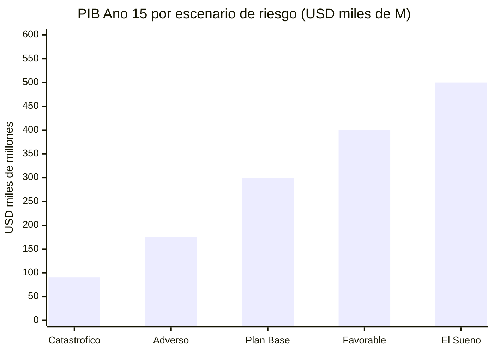
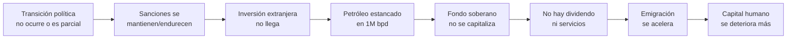
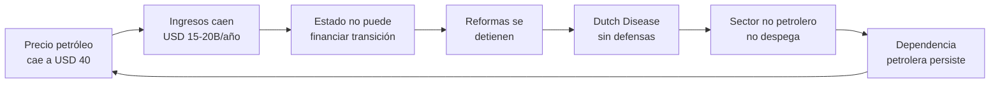
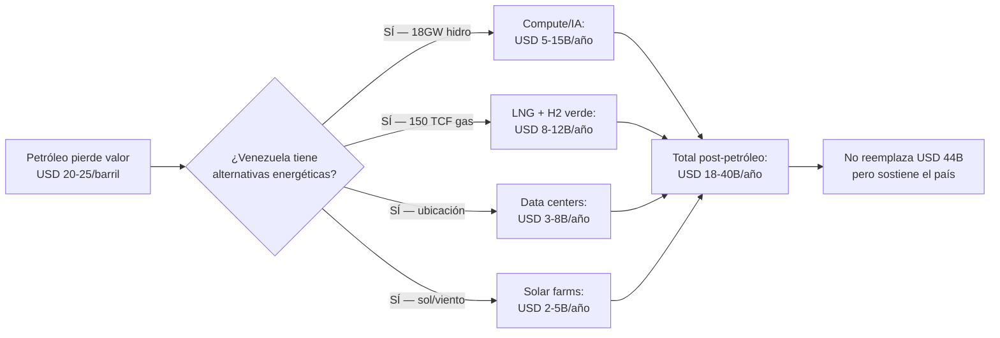

# Riesgos: Matriz de Amenazas y Mitigación

> Ningún plan sobrevive al contacto con la realidad sin una evaluación honesta de lo que puede salir mal. Esta sección identifica 20 riesgos, cuantifica su impacto y propone mitigaciones concretas.

:::danger Regla del plan
Si un riesgo no tiene mitigación, no se ignora — se marca como vulnerabilidad abierta.
:::

---

## Matriz de Riesgo: Probabilidad × Impacto

| # | Riesgo | Prob. | Impacto | Severidad | Ref. |
|---|--------|-------|---------|-----------|------|
| 1 | **Inestabilidad política** — transición fracasa o se revierte | Alta | Crítico | CRÍTICO | — |
| 2 | **Corrupción captura el fondo** — FONDEN 2.0 | Alta | Crítico | CRÍTICO | [Fondo soberano](/02-motor-financiero/fondo-soberano) |
| 3 | **FANB como actor económico** — militares bloquean reformas que afectan sus negocios | Alta | Crítico | CRÍTICO | [Seguridad](/04-gobernanza/seguridad-fisica) |
| 4 | **Dutch Disease** — petróleo aprecia moneda y destruye otros sectores | Media-Alta | Alto | ALTO | [Enfermedad holandesa](/02-motor-financiero/enfermedad-holandesa) |
| 5 | **Capacidad de absorción** — no hay proyectos ni gente para gastar USD 183B en 15 años | Media-Alta | Alto | ALTO | [Capital humano](/05-transformacion/capital-humano) |
| 6 | **Desconfianza ciudadana** — décadas de promesas rotas | Alta | Medio | ALTO | [Los que se quedaron](/03-ciudadanos/los-que-se-quedaron) |
| 7 | **Brain drain permanente** — diáspora no retorna y talento local emigra | Media | Alto | ALTO | [Capital humano](/05-transformacion/capital-humano) |
| 8 | **Sanciones se mantienen/endurecen** — EE.UU. no levanta restricciones | Media | Alto | ALTO | [Geopolítica](/04-gobernanza/geopolitica) |
| 9 | **China/Rusia exigen pago** — USD 50B+ en deuda con condiciones | Media | Alto | ALTO | [Deuda](/02-motor-financiero/deuda) |
| 10 | **Populismo captura el proceso** — nuevo gobierno gasta el fondo | Media | Crítico | ALTO | [Fondo soberano](/02-motor-financiero/fondo-soberano) |
| 11 | **Precio petróleo < USD 50** por transición energética acelerada | Media-Baja | Alto | MEDIO | — |
| 12 | **Acreedores bloquean activos** — USD 19B en reclamos Citgo | Media | Medio | MEDIO | [Deuda](/02-motor-financiero/deuda) |
| 13 | **Cambio climático reduce Guri** — sequías afectan generación hidroeléctrica | Media-Baja | Alto | MEDIO | — |
| 14 | **Competencia regional** — Colombia, Guyana, Brasil capturan inversión primero | Media | Medio | MEDIO | — |
| 15 | **Justicia transicional fracasa** — ni justicia ni reconciliación | Media-Alta | Medio | MEDIO | [Justicia transicional](/04-gobernanza/justicia-transicional) |
| 16 | **Inseguridad persiste** — grupos armados no se desmovilizan | Media | Alto | MEDIO | [Seguridad](/04-gobernanza/seguridad-fisica) |
| 17 | **Transición energética global** — demanda de crudo cae antes de lo previsto | Baja-Media | Alto | MEDIO | — |
| 18 | **Infraestructura colapsa** — no se rehabilita a tiempo | Media-Baja | Medio | BAJO | — |
| 19 | **Pandemia/crisis global** — shock exógeno | Baja | Alto | BAJO | — |
| 20 | **Guyana disputa territorial** — Esequibo escala a conflicto | Baja | Medio | BAJO | — |

---

## Detalle de Riesgos Críticos

### 1. Inestabilidad política

**El riesgo existencial.** Sin transición política, el plan no arranca. Con transición que se revierte, lo invertido se pierde.

| Escenario | Probabilidad | Impacto |
|-----------|-------------|---------|
| Transición exitosa y sostenida | 35-40% | Plan funciona |
| Transición parcial (reformas a medias) | 30-35% | Plan base con retrasos |
| Transición fracasa/se revierte | 25-35% | Plan se congela |

**Mitigación:**
- Pre-Seed arranca sin gobierno (diáspora + sector privado)
- Contratos forward con cláusulas de protección ante cambio de régimen
- Reformas constitucionales con lock de 2/3 + referéndum
- Presión internacional atada a acceso a mercados

### 2. Corrupción captura el fondo

Venezuela desvió **USD 300.000+ M** vía FONDEN entre 2005-2015 sin rendición de cuentas ([Transparencia Venezuela](https://transparenciave.org/)). Que la historia se repita es el riesgo #1 según los 9 evaluadores del panel de perspectivas.

**Mitigación:** Ver [Gobernanza del fondo soberano](/02-motor-financiero/fondo-soberano) — 6 capas de oversight, locks constitucionales, mecanismos anti-captura.

### 3. FANB como actor económico

Las FANB controlan partes de la economía: minería ilegal, contrabando de combustible, narcotráfico fronterizo, importaciones de alimentos ([InSight Crime, 2024](https://insightcrime.org/)). Cualquier reforma que amenace estos ingresos enfrentará resistencia institucional armada.

**Mitigación:**
- DDR adaptado para componente militar-económico
- Programa de reintegración con incentivos (ver [Seguridad física](/04-gobernanza/seguridad-fisica))
- Reforma militar gradual: reducir efectivos de ~350.000 a ~120.000 con paquetes de retiro dignos
- Cooperación internacional (EE.UU./Colombia) como contrapeso

### 4. Dutch Disease

Con USD 65B/año en petróleo (escenario optimista), el riesgo de apreciación cambiaria y destrucción de sectores no petroleros es real. Nigeria y la propia Venezuela pre-2000 son advertencias.

**Mitigación:** Ver [Enfermedad holandesa](/02-motor-financiero/enfermedad-holandesa) — 6 mecanismos de defensa incluyendo fondo 100% externo, esterilización fiscal y ZEETs compensatorias.

### 5. Capacidad de absorción

Gastar USD 183.000 M en 15 años requiere ~12.000 M/año en proyectos petroleros + infraestructura. Con instituciones débiles, esto produce sobrecostos y corrupción. Angola gastó USD 68.000 M en infraestructura (2002-2012) con ~30% perdido en ineficiencias ([Brookings](https://www.brookings.edu/)).

**Mitigación:**
- Ramp-up gradual: USD 3-5B/año (años 1-3) → USD 8-12B (años 4-7) → USD 12-15B (años 8-15)
- Concesiones PPP con operadores internacionales experimentados
- Benchmarking de costos por proyecto vs. comparables regionales
- Ver [Capital humano](/05-transformacion/capital-humano) para solución de brecha de talento

---

## Riesgos por Motor Económico

| Motor | Riesgo principal | P | Impacto | Mitigación |
|-------|-----------------|---|---------|-----------|
| Petróleo | Precio < USD 50 sostenido | Media-Baja | USD -15B/año | Floor USD 55 en forwards + fondo estabilización |
| Gas | Sanciones bloquean Dragon/LNG | Media | USD -5B/año | Diversificar compradores (Colombia, Brasil) |
| Minería | No se formaliza / conflicto armado | Media-Alta | USD -9B/año | Priorizar oro + hierro con security first |
| Tech/Data centers | Competencia regional gana | Media | USD -6B/año | Energía barata como ventaja; early-mover |
| Turismo | Inseguridad persiste | Media | USD -7B/año | Zonas piloto seguras (Los Roques, Canaima) |
| Agroindustria | Sin reforma de tierras | Media | USD -5B/año | Títulos de propiedad + microfinanzas |
| Renovables | Guri colapsa (cambio climático) | Baja-Media | USD -2B/año | Solar + eólica como backup |

---

## Escenarios de Impacto Acumulado

| Escenario | Riesgos materializados | PIB Año 15 | Fondo | vs. Plan Base |
|-----------|----------------------|-----------|-------|--------------|
| **Catastrófico** | Transición falla + petróleo < $50 | USD 80-100B | < USD 10B | -70% |
| **Adverso** | Reformas parciales + 3 riesgos altos | USD 150-200B | USD 50-100B | -40% |
| **Plan Base** | 5-6 condiciones + riesgos gestionados | USD 250-350B | USD 150-250B | Referencia |
| **Favorable** | 7-8 condiciones | USD 350-450B | USD 250-400B | +30% |
| **El Sueño** | Todas las condiciones | USD 450-550B | USD 400-540B | +60% |

:::info El plan se diseña para el adverso, se mide por el base
Si asumimos que 3-4 riesgos altos se materializan (lo más probable), el país aún duplica su PIB en 15 años. Eso es transformacional desde el punto de partida actual de USD 83B.
:::

---

## Correlación de Riesgos: Escenarios Cascada

Los riesgos no son independientes. Un fallo en una dimensión amplifica otros. Estos 3 escenarios muestran cómo 2-3 riesgos se encadenan:

### Cascada 1: Fallo Político → Espiral Económica

| Etapa | Probabilidad | Impacto en PIB año 15 | Ref. |
|-------|-------------|----------------------|------|
| Transición parcial/fallida | 35-40% | — | [V-Dem Institute](https://www.v-dem.net/) |
| Sanciones mantenidas | Condicionada: 70% si transición falla | -USD 30-40B/año | [OFAC](https://www.treasury.gov/ofac) |
| Inversión < USD 50B (vs. 183B plan) | Condicionada: 80% | PIB < USD 120B | Rystad Energy |
| **Resultado conjunto** | **~20%** | **PIB USD 80-120B** (escenario catastrófico) | — |

### Cascada 2: Shock Petrolero → Crisis Fiscal

| Etapa | Probabilidad | Impacto | Ref. |
|-------|-------------|---------|------|
| Petróleo < USD 40 sostenido (3+ años) | 15-20% | -USD 15B/año vs. base USD 60 | [EIA STEO](https://www.eia.gov/outlooks/steo/) |
| Transición energética acelera caída demanda | Condicionada: 60% post-2035 | Petróleo irrelevante post-2040 | [IEA Net Zero](https://www.iea.org/reports/net-zero-by-2050) |
| Dutch Disease sin fondo para contrarrestar | Condicionada: 50% sin forwards | Tipo de cambio real mata exportaciones | [IMF WP](https://www.imf.org/) |
| **Resultado conjunto** | **~10%** | **PIB USD 130-180B** (adverso, loop sin salida) | — |

**Mitigación clave:** Los [forwards petroleros](/02-motor-financiero/contratos-forward) con floor USD 55 + la [diversificación acelerada](/02-motor-financiero/enfermedad-holandesa) rompen el ciclo entre la etapa 2 y 3.

### Cascada 3: Captura Institucional → Fondo Saqueado

| Etapa | Probabilidad | Impacto | Ref. |
|-------|-------------|---------|------|
| Populismo captura gobierno | 25-30% en 15 años | — | [V-Dem](https://www.v-dem.net/), historia LATAM |
| Captura del board del fondo | Condicionada: 40% sin locks constitucionales | — | [FONDEN: USD 300B+ desviados](https://transparenciave.org/) |
| Fondo gastado en 5-10 años | Condicionada: 80% si board capturado | Fondo → USD 0 | Precedente: Venezuela 2005-2015 |
| **Resultado conjunto** | **~8-10%** | **Pérdida total del fondo** | — |

**Mitigación clave:** Los [6 mecanismos anti-captura](/02-motor-financiero/fondo-soberano) (custodia offshore, board independiente, supermayoría 4/5, whistleblower, auditoría internacional) están diseñados específicamente para romper esta cascada en la etapa 2.

### Probabilidad Conjunta de Cascadas

| Escenario | P(cascada completa) | Impacto | ¿El plan sobrevive? |
|-----------|--------------------|---------|--------------------|
| **Fallo político** | ~20% | PIB USD 80-120B, fondo < USD 10B | No — se requiere Plan B (ver [riesgos catastróficos](#escenarios-de-impacto-acumulado)) |
| **Shock petrolero** | ~10% | PIB USD 130-180B, fondo USD 50-80B | Parcialmente — si diversificación arrancó |
| **Captura institucional** | ~8-10% | Fondo USD 0, FONDEN 2.0 | No — la historia se repite |
| **Dos cascadas simultáneas** | ~3-5% | Colapso total | No |
| **Ninguna cascada** | ~55-60% | Plan Base o mejor | Sí |

:::caution El 40% de probabilidad de al menos una cascada es real
Por eso el plan no puede depender del escenario favorable. El [Plan Base](/07-ejecucion/proyecciones) asume 3-4 riesgos materializados y aún duplica el PIB. Las cascadas son el caso donde las defensas fallan simultáneamente — improbable pero no imposible. La redundancia de mitigaciones (forwards + locks + custodia + diversificación) existe precisamente para que ninguna cadena se complete.
:::

---

## Stress Test: Petróleo Irrelevante en 2040 (Tesis Musk/IEA)

:::danger Este es el riesgo que el plan original subestima
Elon Musk, Ray Dalio y la IEA coinciden: la transición energética puede hacer al petróleo irrelevante antes de lo que Rystad asume. Si solar + baterías son más baratas que extraer crudo pesado de la Faja para 2035-2040, el plan base colapsa. Este stress test modela ese escenario.
:::

### Supuestos del escenario post-petróleo

| Variable | Plan Base | Escenario Post-Petróleo | Fuente |
|----------|----------|------------------------|--------|
| Demanda global de crudo | Estable ~100M bpd hasta 2040 | Cae a 60-70M bpd para 2040 | [IEA Net Zero Scenario](https://www.iea.org/reports/net-zero-by-2050) |
| Precio Brent 2035 | USD 55-65 | USD 30-40 | [IEA WEO 2025](https://www.iea.org/reports/world-energy-outlook-2025) |
| Precio Brent 2040 | USD 50-60 | USD 20-30 | Proyección propia basada en IEA NZE |
| Costo solar (LCOE) | USD 0.03-0.05/kWh | USD 0.01-0.02/kWh | [IRENA 2024](https://www.irena.org/) |
| Costo extracción Faja | USD 35-40/barril | Sin cambio | Rystad Energy |
| Margen neto a USD 25/barril | — | **-USD 10-15/barril** (pérdida) | — |

### Impacto en el plan

| Componente | Plan Base (USD 60) | Post-Petróleo (USD 25) | Diferencia |
|-----------|-------------------|----------------------|-----------|
| Ingreso petrolero año 15 | **USD 44B/año** | **USD 10-15B/año** | -70% |
| Fondo soberano año 15 | USD 160-220B | USD 30-50B | -75% |
| Dividendo/persona/año | USD 22-30 | USD 4-7 | -75% |
| Inversión petrolera viable | USD 183B | USD 80-100B (solo campos rentables) | -50% |
| Producción máxima alcanzable | 3M bpd | 1.5-2M bpd (campos de menor costo) | -40% |

### Pivotes necesarios: De petro-estado a energy-state

Si el petróleo pierde valor, Venezuela debe pivotar sus **activos energéticos** (no solo petroleros):

| Activo | Uso petrolero | Uso post-petróleo | Valor potencial |
|--------|-------------|-------------------|-----------------|
| **18 GW hidroeléctrica** (Caroní) | Consumo interno + pérdidas | **Compute/IA** — vender electricidad como servicio de cómputo | USD 5-15B/año ([Requiere investigación]) |
| **Reservas de gas** (150 TCF) | Quema/reinyección | **LNG export + hidrógeno verde** — gas como puente + electrólisis | USD 8-12B/año |
| **Ubicación geográfica** | Exportar crudo | **Hub de data centers + cables submarinos** — latencia <30ms a Miami | USD 3-8B/año |
| **Solar + eólica** (Falcón, Zulia) | No desarrollado | **Solar farms** para compute adicional | USD 2-5B/año |
| **Talento formado en oil & gas** | Extracción | **Ingeniería de energía renovable** — transferible con reskilling 6-12 meses | — |

### Timeline de diversificación acelerada

Si la ventana es 2027-2040 (13 años, no 30), la diversificación debe arrancar en paralelo al oil ramp-up, no después:

| Año | Acción petrolera | Acción de diversificación |
|-----|-----------------|--------------------------|
| 1-3 | Ramp-up agresivo (1M → 1.5M bpd) | Iniciar 3-5 data centers, programa solar, LNG feasibility |
| 4-7 | Producción máxima (2-2.5M bpd) — **extraer rápido mientras vale** | Data centers operativos, primer LNG export, 50K ingenieros formados |
| 8-10 | Mantener producción pero preparar declive | Compute/IA como segundo motor, hidrógeno verde piloto |
| 11-15 | Reducir inversión en upstream | Tech/energía limpia > 50% PIB. Petróleo < 20% PIB |

:::tip La tesis Musk reformulada para Venezuela
Venezuela no necesita que el petróleo dure 30 años. Necesita **10-12 años de petróleo a precio razonable** para financiar la transición a un energy-state basado en hidro, solar, gas, y compute. Si usa esos 10-12 años bien, el petróleo puede llegar a cero y el país sobrevive. Si los desperdicia (como hizo con los USD 300B+ de FONDEN), no hay segunda oportunidad.
:::

### Indicadores de alerta temprana

Monitorear trimestralmente para activar el pivote:

| Indicador | Umbral de alerta | Acción si se cruza |
|-----------|-----------------|-------------------|
| Precio Brent promedio trimestral | < USD 50 por 2+ trimestres | Acelerar data centers, congelar upstream en campos no rentables |
| Costo solar global (LCOE) | < USD 0.02/kWh | Inversión masiva en solar doméstico + export de compute |
| Demanda global de crudo | Cae >5% interanual | Reclasificar reservas: solo campos < USD 30/barril de costo |
| Market cap de oil majors vs. tech | Oil < tech por >3x | Redirigir JVs hacia partnerships tech |
| Inversión global en upstream | Cae >20% interanual | Venezuela pierde competencia por capital — pivotar |

---

## Condición Sine Qua Non

**Instituciones independientes + transparencia radical + reglas constitucionales que ningún gobierno pueda cambiar.**

Sin esto, el resto del plan es papel. Con esto, incluso los escenarios adversos producen mejoras significativas para 40 millones de personas.

> *"El optimismo sin plan de contingencia es fantasía. El pesimismo sin plan de acción es parálisis. Esto es un plan con ojos abiertos."*
