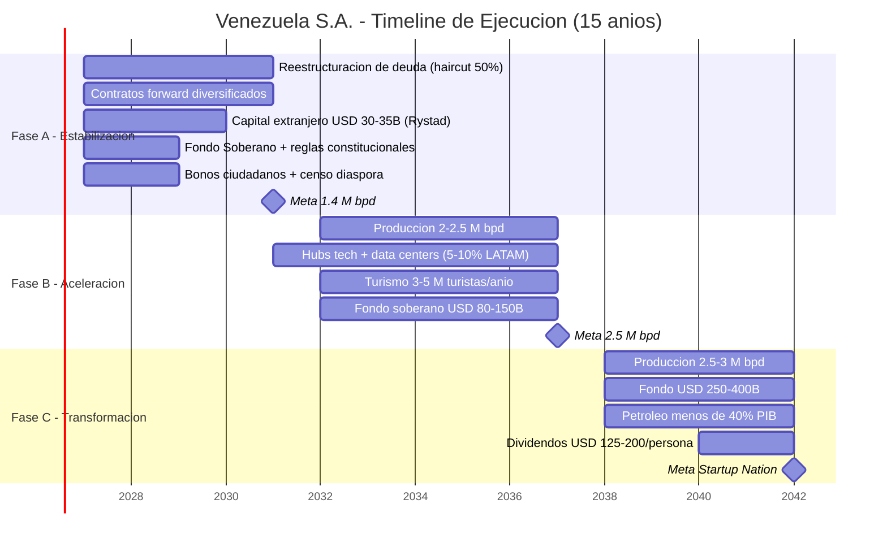
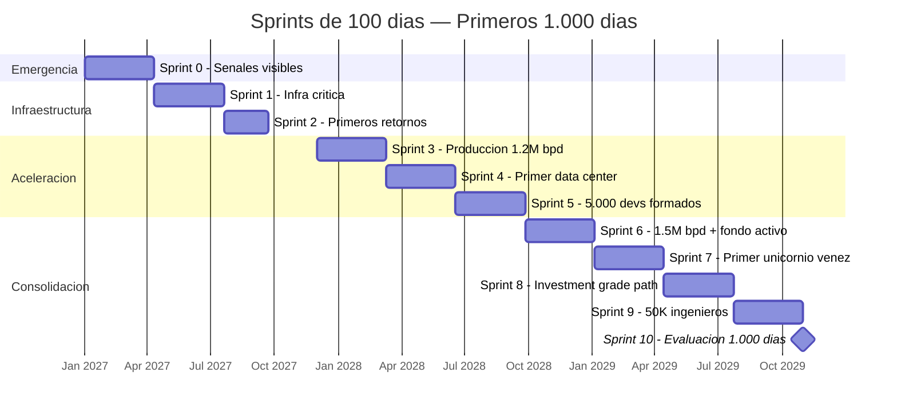

# Timeline Realista (Basado en Rystad Energy)

## Fase A: Estabilización (Años 1–4)
- Reestructurar deuda (haircut 50%, [modelo Citigroup](https://www.cnbc.com/2026/01/04/venezuelas-billions-in-distressed-debt-who-is-in-line-to-collect.html))
- Contratos forward con compradores diversificados
- USD 30–35.000 M capital extranjero inicial ([Rystad](https://www.rigzone.com/news/could_venezuela_production_get_back_to_3mm_barrels_per_day-08-jan-2026-182716-article/))
- Fondo Soberano + reglas constitucionales
- Bonos ciudadanos + censo global diáspora
- **Meta: 1,4 M bpd**

## Fase B: Aceleración (Años 5–10)
- Producción: 2–2,5 M bpd
- Hubs tech + data centers (5–10% mercado LATAM)
- Turismo: 3–5 M turistas/año
- Fondo soberano: USD 80–150.000 M

## Fase C: Transformación (Años 11–15+)
- Producción: 2,5–3 M bpd
- Fondo: USD 250–400.000 M
- Petróleo <40% PIB
- Dividendos: USD 125–200/persona/año

---

## Primeros 1.000 Días: Sprints con Resultados Visibles

:::danger Lección Bukele + Musk
Los evaluadores coinciden: un plan de 15 años sin resultados visibles en los primeros 365 días pierde legitimidad. Bukele transformó la percepción de El Salvador en 1.000 días. Musk comprime timelines 3-5x. El plan necesita **sprints de 100 días** con entregables medibles y visibles.
:::

### Sprint 0: Días 1–100 — Emergencia y Señales

| # | Entregable | Métrica | Responsable |
|---|-----------|---------|-------------|
| 1 | **Hospital funcional** — al menos 1 hospital público rehabilitado con estándares internacionales | Camas operativas, quirófanos, insumos | Min. Salud + OPS |
| 2 | **Calle segura** — 3 zonas piloto con seguridad 24/7 (Caracas, Maracaibo, Valencia) | Homicidios -50% en zona piloto | Policía reformada + cooperación internacional |
| 3 | **Mercado abastecido** — cadena de suministro de alimentos rehabilitada en 10 ciudades | Precios estables, estantes llenos, 0 CLAP | Sector privado + importación emergencia |
| 4 | **Internet funcional** — Starlink en 50 puntos públicos (plazas, escuelas, hubs) | 100+ Mbps disponible gratis | Starlink + gobierno |
| 5 | **Dashboard público** — plataforma web con presupuesto, gastos, avance en tiempo real | Online, accesible, actualizado diariamente | Equipo tech |
| 6 | **Primer contrato forward firmado** — señal al mercado de que el plan es real | USD 1-3B en adelantos | Agencia Petrolera |

### Sprint 1: Días 101–200 — Infraestructura Crítica

| # | Entregable | Métrica |
|---|-----------|---------|
| 1 | **Guri rehabilitado** — primera turbina reparada, uptime > 80% | MW recuperados |
| 2 | **5 coworkings tech** operativos con Starlink + fibra | Puestos disponibles, velocidad Mbps |
| 3 | **Primer bootcamp** de software lanzado (1.000 estudiantes) | Inscritos, tasa de permanencia |
| 4 | **Licencia OFAC expandida** — resultado de negociación | Tipo de licencia otorgada |
| 5 | **Censo digital** de diáspora lanzado | Registrados en plataforma |

### Sprint 2: Días 201–365 — Primeros Retornos

| # | Entregable | Métrica |
|---|-----------|---------|
| 1 | **Producción a 1.1-1.2M bpd** | bpd verificados |
| 2 | **Primer JV con major** firmado (post-Chevron) | USD invertidos |
| 3 | **10.000 policías** nuevos graduados y desplegados | Cobertura territorial |
| 4 | **Primer bono ciudadano** emitido (piloto USD 10-50) | Ciudadanos participantes |
| 5 | **3 bootcamps** operativos en 3 ciudades | Graduados primer cohorte |

### Sprint 3-10: Días 366–1.000

### Compresión del timeline: 15 → 10 años operativos

| Mecanismo de compresión | Ahorro estimado | Modelo |
|------------------------|----------------|--------|
| **Ejecución paralela** (no secuencial) — petróleo + tech + seguridad simultáneo | 2-3 años | Musk: "todo en paralelo, nunca en serie" |
| **Starlink** en vez de rehabilitar fibra terrestre | 1-2 años | Conectividad inmediata vs. 3-5 años de obra civil |
| **Prefabricación modular** para infraestructura | 1-2 años | China construye hospitales en 10 días |
| **Design-Build** (contratista único diseña + construye) | 6-12 meses | vs. licitación separada de diseño y construcción |
| **Permisos paralelos** (no esperar uno para empezar otro) | 6-12 meses | Singapur: permiso en 26 días vs. LATAM ~180 días |
| **24/7 en proyectos críticos** | 30-50% más rápido | UAE: turnos de 24h en proyectos clave |

:::tip El plan real es de 10 años con buffer de 5
Si se ejecuta con velocidad Musk/Bukele (todo en paralelo, resultados cada 100 días, sin burocracia), el plan se comprime a **10 años operativos**. Los 5 años restantes son buffer para imprevistos. Si no hay imprevistos graves, Venezuela llega al destino en 2037, no en 2042.
:::
