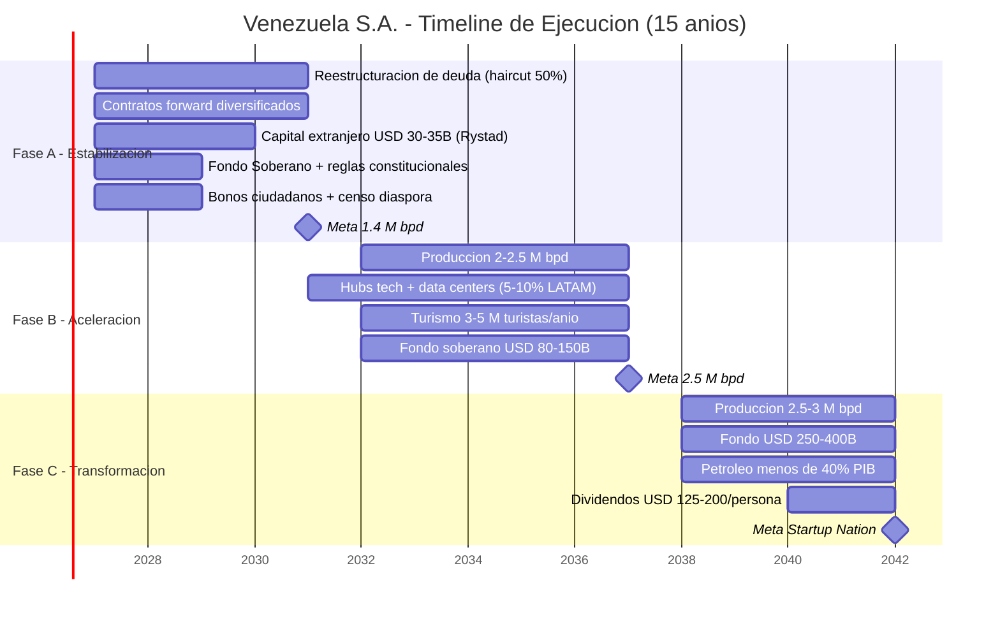

# Timeline Realista (Basado en Rystad Energy)

## Fase A: Estabilización (Años 1–4)
- Reestructurar deuda (haircut 50%, [modelo Citigroup](https://www.cnbc.com/2026/01/04/venezuelas-billions-in-distressed-debt-who-is-in-line-to-collect.html))
- Contratos forward con compradores diversificados
- USD 30–35.000 M capital extranjero inicial ([Rystad](https://www.rigzone.com/news/could_venezuela_production_get_back_to_3mm_barrels_per_day-08-jan-2026-182716-article/))
- Fondo Soberano + reglas constitucionales
- Bonos ciudadanos + censo global diáspora
- **Meta: 1,4 M bpd**

## Fase B: Aceleración (Años 5–10)
- Producción: 2–2,5 M bpd
- Hubs tech + data centers (5–10% mercado LATAM)
- Turismo: 3–5 M turistas/año
- Fondo soberano: USD 80–150.000 M

## Fase C: Transformación (Años 11–15+)
- Producción: 2,5–3 M bpd
- Fondo: USD 250–400.000 M
- Petróleo <40% PIB
- Dividendos: USD 125–200/persona/año
